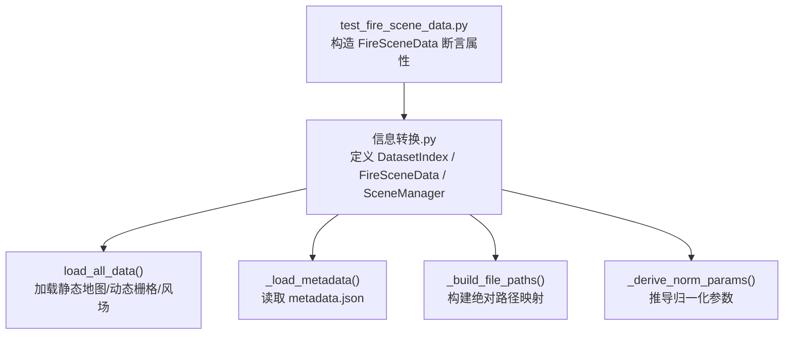
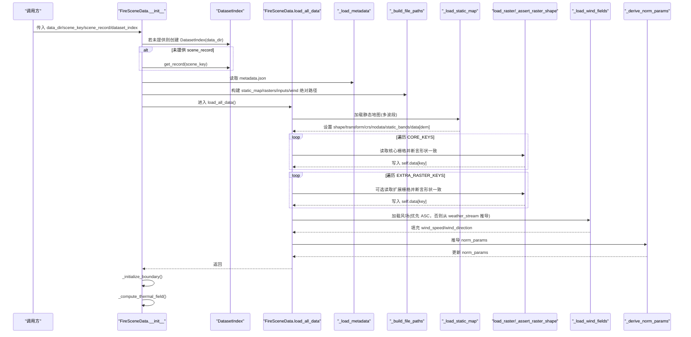
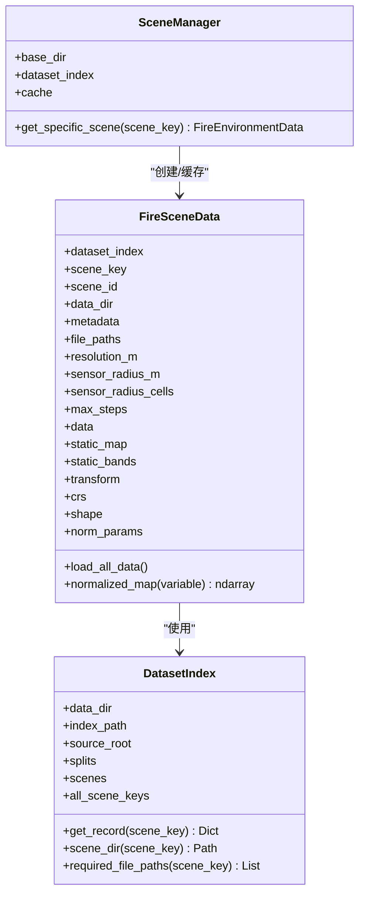

# 火灾场景数据初始化

<cite>
**本文引用的文件**   
- [信息转换.py](file://environment_variables/environment_variables/信息转换.py)
- [test_fire_scene_data.py](file://environment_variables/environment_variables/test_fire_scene_data.py)
</cite>

## 目录
1. [简介](#简介)
2. [项目结构](#项目结构)
3. [核心组件](#核心组件)
4. [架构总览](#架构总览)
5. [详细组件分析](#详细组件分析)
6. [依赖关系分析](#依赖关系分析)
7. [性能考量](#性能考量)
8. [故障排查指南](#故障排查指南)
9. [结论](#结论)
10. [附录：使用示例与最佳实践](#附录使用示例与最佳实践)

## 简介
本技术文档聚焦于 FireSceneData 类的初始化过程，系统性解析 __init__ 方法的完整执行流程，包括参数校验、元数据加载与环境配置设置；深入说明 uav 配置的解析（sensor_radius_m 计算与 sensor_radius_cells 转换）、max_steps 的设置与验证机制、norm_params 字典的初始化与默认值；并详细说明静态地图、动态栅格数据与风场数据的加载顺序与依赖关系，以及 load_all_data() 的执行流程与错误处理。文末提供基于测试用例的正确初始化与使用示例路径，便于读者快速上手。

## 项目结构
围绕 FireSceneData 的核心实现位于“信息转换.py”中，配套的单元测试位于“test_fire_scene_data.py”。该模块同时包含 DatasetIndex、FireSceneData、SceneManager 等辅助类，用于数据集索引、场景加载与管理。

图表来源
- [信息转换.py:248-323](file://environment_variables/environment_variables/信息转换.py#L248-L323)
- [信息转换.py:349-390](file://environment_variables/environment_variables/信息转换.py#L349-L390)
- [信息转换.py:639-682](file://environment_variables/environment_variables/信息转换.py#L639-L682)
- [test_fire_scene_data.py:32-44](file://environment_variables/environment_variables/test_fire_scene_data.py#L32-L44)

章节来源
- [信息转换.py:248-323](file://environment_variables/environment_variables/信息转换.py#L248-L323)
- [test_fire_scene_data.py:32-44](file://environment_variables/environment_variables/test_fire_scene_data.py#L32-L44)

## 核心组件
- DatasetIndex：负责 dataset_index.json 的解析、scene_key 到 scene_dir/metadata/rasters 的绝对路径解析、split 模式别名与场景键枚举。
- FireSceneData：单场景数据容器，完成元数据加载、栅格与矢量路径解析、静态地图与动态栅格加载、风场字段生成、归一化参数推导、边界点与热场初始化。
- SceneManager：按 split 随机或指定获取场景实例，并提供跨实例共享缓存以减少重复 I/O 与计算。

章节来源
- [信息转换.py:20-197](file://environment_variables/environment_variables/信息转换.py#L20-L197)
- [信息转换.py:219-323](file://environment_variables/environment_variables/信息转换.py#L219-L323)
- [信息转换.py:1282-1327](file://environment_variables/environment_variables/信息转换.py#L1282-L1327)

## 架构总览
下图展示 FireSceneData 初始化关键阶段及其相互依赖关系。

图表来源
- [信息转换.py:248-323](file://environment_variables/environment_variables/信息转换.py#L248-L323)
- [信息转换.py:349-390](file://environment_variables/environment_variables/信息转换.py#L349-L390)
- [信息转换.py:501-524](file://environment_variables/environment_variables/信息转换.py#L501-L524)
- [信息转换.py:392-414](file://environment_variables/environment_variables/信息转换.py#L392-L414)
- [信息转换.py:473-491](file://environment_variables/environment_variables/信息转换.py#L473-L491)
- [信息转换.py:559-602](file://environment_variables/environment_variables/信息转换.py#L559-L602)
- [信息转换.py:639-682](file://environment_variables/environment_variables/信息转换.py#L639-L682)

## 详细组件分析

### __init__ 方法执行流程与参数校验
- 参数与上下文
  - data_dir：数据集根目录，用于定位 dataset_index.json。
  - scene_key：场景标识，若未提供且未传入 scene_record，则自动取 train 分割的第一个场景键。
  - scene_record：可直接传入已解析的场景记录，避免二次查找。
  - dataset_index：可复用外部 DatasetIndex 实例，减少重复解析。
- 元数据加载
  - 通过 _load_metadata() 读取 metadata.json，失败抛出 FileNotFoundError。
- 环境配置设置
  - resolution_m：从 metadata 中读取分辨率（米），用于后续传感器半径换算。
  - uav 配置解析
    - sensor_radius_m：从 metadata.uav.sensor_radius_m 取值，默认 0.0。
    - sensor_radius_cells：以 ceil(sensor_radius_m / resolution_m) 转换为栅格单元数；当 resolution_m <= 0 时置为 0。
    - max_steps：从 metadata.uav.max_steps 取值，默认 0。
  - 其他初始状态
    - data、static_map、static_bands、transform、crs、shape、nodata_value 等占位初始化。
    - norm_params 初始化默认值（见下节）。
    - 边界点、热力场、导航场等运行时状态初始化。
- 数据加载与后处理
  - 调用 load_all_data() 完成静态地图、动态栅格与风场加载。
  - 随后执行 _initialize_boundary() 与 _compute_thermal_field()。

章节来源
- [信息转换.py:248-323](file://environment_variables/environment_variables/信息转换.py#L248-L323)
- [信息转换.py:349-356](file://environment_variables/environment_variables/信息转换.py#L349-L356)

### uav 配置解析与传感器半径换算
- sensor_radius_m：来自 metadata.uav.sensor_radius_m，单位米。
- sensor_radius_cells：将物理半径换算为栅格单元半径，计算公式为 ceil(sensor_radius_m / resolution_m)。当分辨率非正时回退为 0。
- 行为验证：测试用例断言在特定场景中 sensor_radius_cells=15，max_steps=800，resolution_m=30.0。

章节来源
- [信息转换.py:276-284](file://environment_variables/environment_variables/信息转换.py#L276-L284)
- [test_fire_scene_data.py:39-44](file://environment_variables/environment_variables/test_fire_scene_data.py#L39-L44)

### max_steps 的设置与验证机制
- 来源：metadata.uav.max_steps，默认 0。
- 用途：通常作为环境步数上限，供上层环境或训练循环使用。
- 验证：测试用例断言 max_steps 与元数据一致。

章节来源
- [信息转换.py:284](file://environment_variables/environment_variables/信息转换.py#L284)
- [test_fire_scene_data.py:43](file://environment_variables/environment_variables/test_fire_scene_data.py#L43)

### norm_params 字典的初始化与默认值
- 初始化默认值
  - intensity_max、length_max、speedRate_max、spread_direction_max、heat_per_unit_area_max、crown_fire_max 默认 1.0。
  - dem_min=0.0，dem_max=1.0。
  - slope_max=1.0，wind_speed_max=50.49，fire_threshold=1.0。
- 推导逻辑（在 load_all_data 末尾）
  - 基于实际数据分布与统计量重新计算各最大值与 DEM 范围，覆盖默认值。
  - 对强度等栅格采用分位数缩放，并对风场速度考虑元数据中的风速字段。
  - 输出日志摘要，便于调试。
- 归一化访问
  - normalized_map(variable) 根据变量名与别名映射到具体 key，并按对应 norm_params 进行 0~1 裁剪归一化。

章节来源
- [信息转换.py:294-306](file://environment_variables/environment_variables/信息转换.py#L294-L306)
- [信息转换.py:559-602](file://environment_variables/environment_variables/信息转换.py#L559-L602)
- [信息转换.py:616-637](file://environment_variables/environment_variables/信息转换.py#L616-L637)

### 静态地图、动态栅格与风场数据的加载顺序与依赖关系
- 加载顺序
  1) 静态地图（多波段栅格）：确定 shape、transform、crs、nodata，并将各波段映射到 static_bands 与 data[elevation/slope/aspect/fuel_model/canopy_*]，同时将 elevation 赋值给 data[dem]。
  2) 核心动态栅格（CORE_KEYS：intensity、length、time、speedRate）：逐个读取，断言与静态地图形状一致，写入 data。
  3) 扩展动态栅格（EXTRA_RASTER_KEYS：spread_direction、heat_per_unit_area、crown_fire）：可选加载，同样断言形状一致。
  4) 风场数据：优先尝试 wind/wspd.asc 与 wind/wdir.asc；若缺失，则从 inputs/weather_stream.wxs 解析平均风速与风向，填充全图常量场。
  5) 归一化参数推导：基于已加载数据计算 norm_params，并打印摘要。
- 依赖关系
  - 所有动态栅格必须与静态地图形状一致，否则抛出 RuntimeError。
  - 风场字段必须在推导 norm_params 前就绪，因为 wind_speed_max 可能参与归一化。
  - 边界点与热场计算依赖 fire_binary_map 与 intensity 等数据，需在 load_all_data 之后执行。

章节来源
- [信息转换.py:501-524](file://environment_variables/environment_variables/信息转换.py#L501-L524)
- [信息转换.py:639-682](file://environment_variables/environment_variables/信息转换.py#L639-L682)
- [信息转换.py:473-491](file://environment_variables/environment_variables/信息转换.py#L473-L491)

### load_all_data() 执行流程与错误处理
- 执行流程
  - 打印加载开始信息。
  - 加载静态地图并设置全局几何信息。
  - 遍历 CORE_KEYS 加载必需栅格，任一缺失即抛 FileNotFoundError。
  - 遍历 EXTRA_RASTER_KEYS 加载可选栅格，存在则加载并断言形状。
  - 加载风场（ASC 或 weather_stream 推导）。
  - 推导并记录 norm_params。
  - 校验风场形状与全局 shape 一致，不一致抛 RuntimeError。
  - 打印加载完成摘要（shape 与栅格数量）。
- 错误处理要点
  - 静态地图缺失：FileNotFoundError。
  - 核心栅格缺失：FileNotFoundError。
  - 栅格形状不匹配：RuntimeError，提示 static_map 与当前栅格的路径及形状差异。
  - 风场形状不匹配：RuntimeError，给出期望 shape。
  - 栅格读取异常：load_raster/load_asc 捕获底层异常并包装为 RuntimeError，附带文件路径。

章节来源
- [信息转换.py:639-682](file://environment_variables/environment_variables/信息转换.py#L639-L682)
- [信息转换.py:392-414](file://environment_variables/environment_variables/信息转换.py#L392-L414)
- [信息转换.py:415-424](file://environment_variables/environment_variables/信息转换.py#L415-L424)
- [信息转换.py:525-532](file://environment_variables/environment_variables/信息转换.py#L525-L532)

### 边界点与热场初始化（初始化阶段的后续步骤）
- _initialize_boundary()
  - 基于 t=0 时刻的 intensity 阈值与 time 掩码提取火场二值图，并计算活动前沿边界点。
  - 若边界为空，标记 is_valid_scene=False 并抛出 InvalidSceneError，阻止无效场景继续训练。
- _compute_thermal_field()
  - 基于 fire_binary_map 与 intensity 构建 per-scene 稳健归一化的热势场，经高斯模糊与上采样得到 thermal_field，并生成 log 压缩的导航场 _nav_field 用于梯度计算。
  - 若 fire_binary_map 未初始化或 intensity 缺失，抛出 RuntimeError。

章节来源
- [信息转换.py:684-696](file://environment_variables/environment_variables/信息转换.py#L684-L696)
- [信息转换.py:759-819](file://environment_variables/environment_variables/信息转换.py#L759-L819)

## 依赖关系分析
- 内部依赖
  - FireSceneData 依赖 DatasetIndex 提供的场景记录与路径解析。
  - 静态地图是后续所有栅格形状对齐与地理变换的基础。
  - 风场数据影响 norm_params 的风速上限与观测特征。
- 外部依赖
  - rasterio：读取 GeoTIFF 栅格。
  - scipy.ndimage：形态学操作（如边界提取）。
  - cv2：图像尺度变换（下采样/上采样）用于热场平滑。
  - numpy：数值计算与数组操作。

图表来源
- [信息转换.py:20-197](file://environment_variables/environment_variables/信息转换.py#L20-L197)
- [信息转换.py:219-323](file://environment_variables/environment_variables/信息转换.py#L219-L323)
- [信息转换.py:1282-1327](file://environment_variables/environment_variables/信息转换.py#L1282-L1327)

章节来源
- [信息转换.py:20-197](file://environment_variables/environment_variables/信息转换.py#L20-L197)
- [信息转换.py:219-323](file://environment_variables/environment_variables/信息转换.py#L219-L323)
- [信息转换.py:1282-1327](file://environment_variables/environment_variables/信息转换.py#L1282-L1327)

## 性能考量
- I/O 优化
  - 静态地图一次性读取多波段，减少多次磁盘访问。
  - 可选栅格按需加载，避免不必要开销。
- 内存与计算
  - 热场计算采用先下采样再高斯模糊、最后上采样的策略，降低计算量并保持空间连续性。
  - 归一化参数基于分位数与极值估计，避免极端值影响稳定性。
- 形状一致性检查
  - 在加载每个栅格后立即断言形状，尽早发现数据不一致问题，避免后续大规模计算浪费。

## 故障排查指南
- 常见错误与定位
  - 场景目录不存在：检查 scene_dir_abs 是否有效。
  - metadata.json 缺失：确认 scene_record.metadata 指向正确路径。
  - 静态地图缺失或多波段数不符：检查 static_map 路径与波段数是否为 STATIC_BAND_KEYS 长度。
  - 核心栅格缺失：确保 CORE_KEYS 对应的 rasters 存在。
  - 栅格形状不匹配：对比 static_map 与各动态栅格的 shape，修正数据或索引。
  - 风场形状不匹配：检查 wind ASC 文件或 weather_stream 解析结果。
- 诊断建议
  - 使用 diagnose_thermal_health() 检查热场健康度（饱和比例、零梯度比例、分位数等）。
  - 使用 validate_scene_boundaries() 批量预检场景边界有效性。

章节来源
- [信息转换.py:349-356](file://environment_variables/environment_variables/信息转换.py#L349-L356)
- [信息转换.py:501-524](file://environment_variables/environment_variables/信息转换.py#L501-L524)
- [信息转换.py:639-682](file://environment_variables/environment_variables/信息转换.py#L639-L682)
- [信息转换.py:972-1012](file://environment_variables/environment_variables/信息转换.py#L972-L1012)
- [信息转换.py:1329-1416](file://environment_variables/environment_variables/信息转换.py#L1329-L1416)

## 结论
FireSceneData 的初始化流程严谨而健壮：通过 DatasetIndex 解析场景元数据与路径，严格校验静态地图与动态栅格的一致性，逐步构建风场与归一化参数，最终完成边界点与热场的初始化。uav 配置中的传感器半径与最大步数被可靠地解析并可用于上层环境控制。整体设计兼顾了可扩展性（可选栅格）、鲁棒性（形状与缺失检查）与性能（下采样+模糊的热场重建）。

## 附录：使用示例与最佳实践
- 基本初始化与断言（参考测试用例）
  - 通过 dataset_index 与 scene_key 构造 FireSceneData，断言 shape、static_map 形状、sensor_radius_cells、max_steps、resolution_m 等属性。
  - 验证 CORE_KEYS 与 EXTRA_RASTER_KEYS 均存在于 data 中且形状一致、非负且有限。
  - 验证 norm_params 包含必要键，normalized_map 输出在 [0,1] 范围内。
- 环境集成示例（参考测试用例）
  - 使用 FireSearchBaselineEnvironment 封装 FireSceneData，设置 vision_radius、max_steps、init_area_percent 等参数，断言观测维度与奖励分解键。
  - 使用 use_metadata_uav_params=True 时，环境应直接复用 env_data.sensor_radius_cells 与 env_data.max_steps。

章节来源
- [test_fire_scene_data.py:32-66](file://environment_variables/environment_variables/test_fire_scene_data.py#L32-L66)
- [test_fire_scene_data.py:67-110](file://environment_variables/environment_variables/test_fire_scene_data.py#L67-L110)
- [test_fire_scene_data.py:111-156](file://environment_variables/environment_variables/test_fire_scene_data.py#L111-L156)
- [test_fire_scene_data.py:158-190](file://environment_variables/environment_variables/test_fire_scene_data.py#L158-L190)
- [test_fire_scene_data.py:191-219](file://environment_variables/environment_variables/test_fire_scene_data.py#L191-L219)
- [test_fire_scene_data.py:221-243](file://environment_variables/environment_variables/test_fire_scene_data.py#L221-L243)
- [test_fire_scene_data.py:244-257](file://environment_variables/environment_variables/test_fire_scene_data.py#L244-L257)