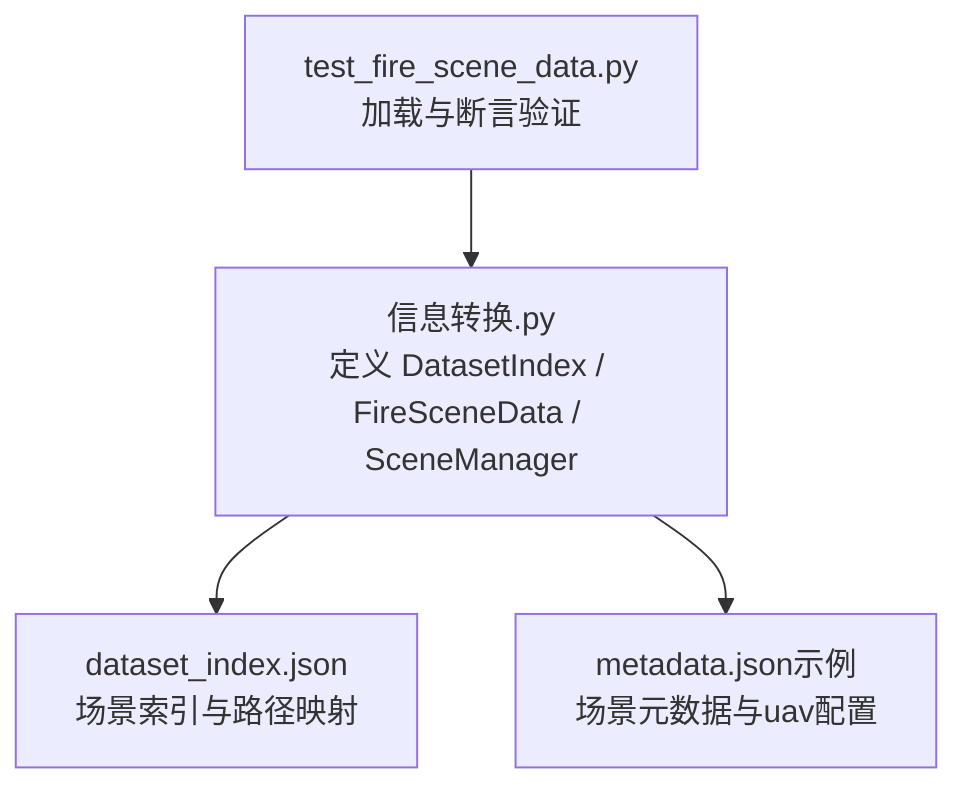
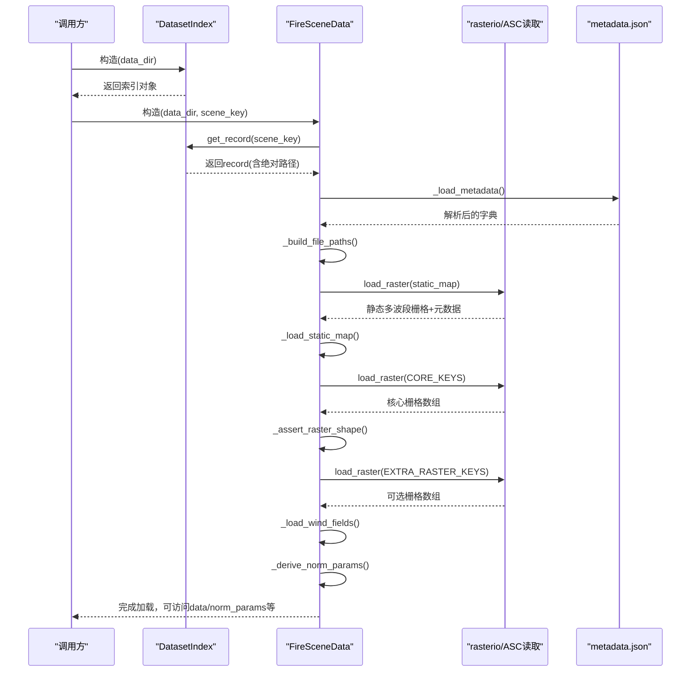
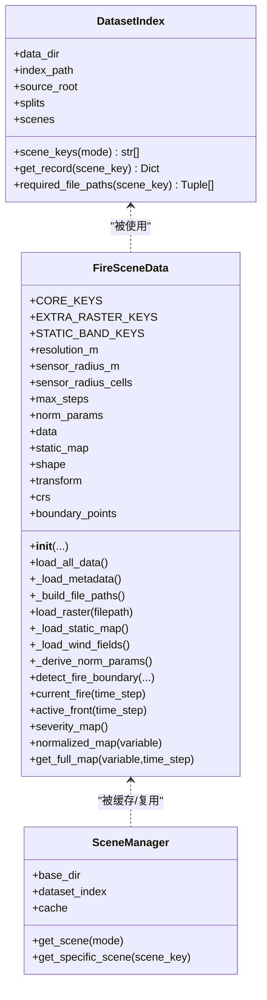
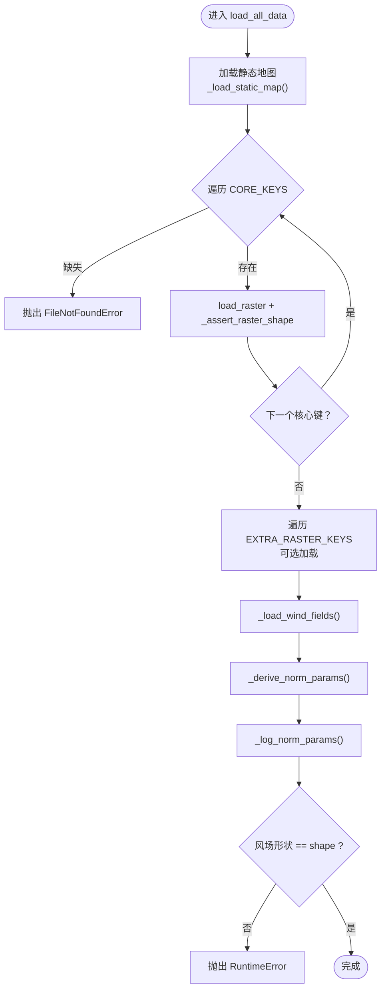
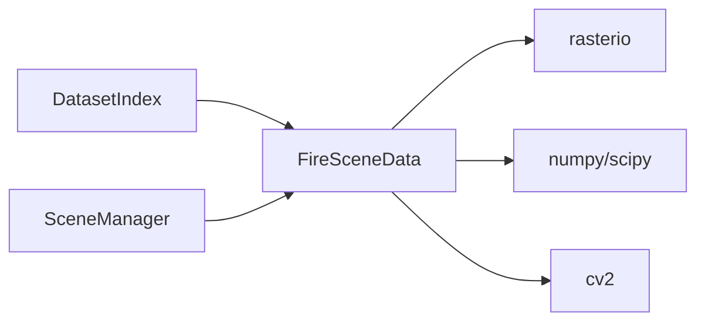

# 火灾场景数据加载

<cite>
**本文引用的文件**   
- [信息转换.py](file://environment_variables/environment_variables/信息转换.py)
- [test_fire_scene_data.py](file://environment_variables/environment_variables/test_fire_scene_data.py)
- [dataset_index.json](file://environment_variables/environment_variables/dataset/dataset_index.json)
- [metadata.json（示例）](file://map/Generalization/6/scene1/metadata.json)
</cite>

## 目录
1. [简介](#简介)
2. [项目结构](#项目结构)
3. [核心组件](#核心组件)
4. [架构总览](#架构总览)
5. [详细组件分析](#详细组件分析)
6. [依赖关系分析](#依赖关系分析)
7. [性能考量](#性能考量)
8. [故障排查指南](#故障排查指南)
9. [结论](#结论)
10. [附录：使用示例与最佳实践](#附录使用示例与最佳实践)

## 简介
本技术文档聚焦于 FireSceneData 类的数据加载能力，系统阐述 FARSITE 火灾模拟数据的完整加载流程，包括静态地图、动态栅格数据与矢量数据的读取处理；解释核心键值（intensity、length、time、speedRate）与扩展键值的区别与用途；说明 metadata.json 的解析过程与 uav 配置的处理逻辑；描述传感器半径计算、最大步数设置与环境参数初始化；详述 load_all_data 方法的执行流程与错误处理机制；并提供具体代码示例路径以展示如何正确加载和使用火灾场景数据。

## 项目结构
围绕数据加载的核心实现位于“信息转换.py”，配套测试用例在“test_fire_scene_data.py”。数据集索引由 dataset_index.json 管理，每个场景包含 metadata.json 描述元数据与资源路径。

图表来源
- [信息转换.py:219-323](file://environment_variables/environment_variables/信息转换.py#L219-L323)
- [dataset_index.json:1-200](file://environment_variables/environment_variables/dataset/dataset_index.json#L1-L200)
- [metadata.json（示例）:1-174](file://map/Generalization/6/scene1/metadata.json#L1-L174)
- [test_fire_scene_data.py:28-66](file://environment_variables/environment_variables/test_fire_scene_data.py#L28-L66)

章节来源
- [信息转换.py:219-323](file://environment_variables/environment_variables/信息转换.py#L219-L323)
- [dataset_index.json:1-200](file://environment_variables/environment_variables/dataset/dataset_index.json#L1-L200)
- [metadata.json（示例）:1-174](file://map/Generalization/6/scene1/metadata.json#L1-L174)
- [test_fire_scene_data.py:28-66](file://environment_variables/environment_variables/test_fire_scene_data.py#L28-L66)

## 核心组件
- DatasetIndex：基于 dataset_index.json 提供场景键、绝对路径解析、模式别名与必需文件清单。
- FireSceneData：单场景数据加载器，负责静态地图、动态栅格、风场、边界检测、热场与归一化参数推导。
- SceneManager：按训练/验证/泛化/压力划分批量获取场景并缓存实例，避免重复 IO 与计算。

关键职责与入口
- 构造阶段：解析 scene_key → get_record → 构建 file_paths → 加载 metadata → 初始化环境参数（分辨率、uav、norm_params）。
- 加载阶段：load_all_data 顺序加载静态地图、核心栅格、可选扩展栅格、风场，推导并记录归一化参数。
- 初始化阶段：_initialize_boundary 检测 t=0 火边界；_compute_thermal_field 生成热势场与导航场。

章节来源
- [信息转换.py:20-196](file://environment_variables/environment_variables/信息转换.py#L20-L196)
- [信息转换.py:219-323](file://environment_variables/environment_variables/信息转换.py#L219-L323)
- [信息转换.py:639-682](file://environment_variables/environment_variables/信息转换.py#L639-L682)
- [信息转换.py:684-721](file://environment_variables/environment_variables/信息转换.py#L684-L721)
- [信息转换.py:759-819](file://environment_variables/environment_variables/信息转换.py#L759-L819)

## 架构总览
下图展示了从 dataset_index.json 到场景对象的数据流与控制流。

图表来源
- [信息转换.py:219-323](file://environment_variables/environment_variables/信息转换.py#L219-L323)
- [信息转换.py:349-390](file://environment_variables/environment_variables/信息转换.py#L349-L390)
- [信息转换.py:392-424](file://environment_variables/environment_variables/信息转换.py#L392-L424)
- [信息转换.py:501-524](file://environment_variables/environment_variables/信息转换.py#L501-L524)
- [信息转换.py:639-682](file://environment_variables/environment_variables/信息转换.py#L639-L682)

## 详细组件分析

### 类与关系图（代码级）

图表来源
- [信息转换.py:20-196](file://environment_variables/environment_variables/信息转换.py#L20-L196)
- [信息转换.py:219-323](file://environment_variables/environment_variables/信息转换.py#L219-L323)
- [信息转换.py:1282-1326](file://environment_variables/environment_variables/信息转换.py#L1282-L1326)

#### 核心键值与扩展键值
- 核心键值 CORE_KEYS = ["intensity", "length", "time", "speedRate"]
  - intensity：火线强度栅格，用于严重度与热场重建。
  - length：火焰长度栅格，参与严重度加权。
  - time：到达时间栅格，用于边界选择与时间切片。
  - speedRate：蔓延速率栅格，参与严重度与归一化。
- 扩展键值 EXTRA_RASTER_KEYS = ["spread_direction", "heat_per_unit_area", "crown_fire"]
  - spread_direction：蔓延方向栅格。
  - heat_per_unit_area：单位面积热量栅格。
  - crown_fire：树冠火活动栅格。
- 这些键值在 dataset_index.json 的 required_rasters 中声明，并在 load_all_data 中强制或可选加载。

章节来源
- [信息转换.py:222-236](file://environment_variables/environment_variables/信息转换.py#L222-L236)
- [dataset_index.json:24-32](file://environment_variables/environment_variables/dataset/dataset_index.json#L24-L32)
- [信息转换.py:639-682](file://environment_variables/environment_variables/信息转换.py#L639-L682)

#### metadata.json 解析与 uav 配置
- 解析流程：
  - _load_metadata 定位 scene_dir 下的 metadata.json，失败则抛出 FileNotFoundError。
  - 解析后得到字典，供后续 resolution_m、wind、uav 等字段使用。
- uav 配置处理：
  - sensor_radius_m：无人机传感器半径（米），结合 resolution_m 换算为像素半径 sensor_radius_cells。
  - max_steps：最大仿真步数。
  - 若未提供，使用默认值（如 0），但典型场景会给出合理数值。

章节来源
- [信息转换.py:349-356](file://environment_variables/environment_variables/信息转换.py#L349-L356)
- [信息转换.py:274-284](file://environment_variables/environment_variables/信息转换.py#L274-L284)
- [metadata.json（示例）:136-143](file://map/Generalization/6/scene1/metadata.json#L136-L143)

#### 传感器半径计算与最大步数设置
- 传感器半径（像素）：
  - sensor_radius_cells = ceil(sensor_radius_m / resolution_m)，当 resolution_m > 0。
- 最大步数：
  - max_steps = int(uav.get("max_steps", 0))。

章节来源
- [信息转换.py:276-284](file://environment_variables/environment_variables/信息转换.py#L276-L284)

#### 环境参数初始化
- 分辨率：resolution_m 来自 metadata.json。
- 归一化参数 norm_params：
  - 初始默认值包含 intensity_max、dem_min/max、slope_max、wind_speed_max、fire_threshold 等。
  - 随后通过 _derive_norm_params 基于实际数据派生更稳健的值。
- 静态地图与坐标：
  - static_map 为多波段栅格，包含 elevation/slope/aspect/fuel_model/canopy_* 等波段。
  - transform/crs/shape/nodata_value 从 rasterio 元数据提取。

章节来源
- [信息转换.py:294-306](file://environment_variables/environment_variables/信息转换.py#L294-L306)
- [信息转换.py:501-524](file://environment_variables/environment_variables/信息转换.py#L501-L524)
- [信息转换.py:559-602](file://environment_variables/environment_variables/信息转换.py#L559-L602)

#### load_all_data 执行流程与错误处理
- 执行步骤：
  1) 打印场景键，加载静态地图，校验波段数量与形状。
  2) 循环加载 CORE_KEYS，缺失则抛 FileNotFoundError；形状不一致则抛 RuntimeError。
  3) 可选加载 EXTRA_RASTER_KEYS，存在且形状一致则加入 data。
  4) 加载风场：优先 wind/wdir.asc 与 wind/wspd.asc；否则从 weather_stream.wxs 解析平均风速与风向，或回退到 metadata.wind。
  5) 推导 norm_params 并打印摘要。
  6) 校验风场形状与全局 shape 一致，否则抛 RuntimeError。
- 错误处理要点：
  - 静态地图缺失：FileNotFoundError。
  - 栅格形状不匹配：RuntimeError，附带静态地图与当前栅格文件名。
  - 风场形状不匹配：RuntimeError。
  - 栅格读取异常：包装为 RuntimeError，保留原始异常链。

图表来源
- [信息转换.py:639-682](file://environment_variables/environment_variables/信息转换.py#L639-L682)
- [信息转换.py:525-532](file://environment_variables/environment_variables/信息转换.py#L525-L532)
- [信息转换.py:473-490](file://environment_variables/environment_variables/信息转换.py#L473-L490)

章节来源
- [信息转换.py:639-682](file://environment_variables/environment_variables/信息转换.py#L639-L682)
- [信息转换.py:525-532](file://environment_variables/environment_variables/信息转换.py#L525-L532)
- [信息转换.py:473-490](file://environment_variables/environment_variables/信息转换.py#L473-L490)

#### 边界检测与热场语义重建
- 边界检测 detect_fire_boundary：
  - 基于 intensity > fire_threshold 的二值掩码，结合 time 栅格进行时间切片或按 init_area_percent 选择初始火区。
  - 通过形态学腐蚀求取活跃前沿，更新内部边界点缓存。
- 热场语义重建 _compute_thermal_field：
  - 仅对火区内 intensity 做 per-scene 鲁棒归一化（参考值为 p99）。
  - 下采样+高斯模糊→上采样→clip[0,1] 得到 thermal_field。
  - 同时生成 log 压缩的导航场 _nav_field，便于梯度计算。

章节来源
- [信息转换.py:821-887](file://environment_variables/environment_variables/信息转换.py#L821-L887)
- [信息转换.py:759-819](file://environment_variables/environment_variables/信息转换.py#L759-L819)

#### 归一化与严重度
- normalized_map：
  - dem 使用 dem_min/dem_max 线性缩放至 [0,1]。
  - 其他变量使用对应 *_max 参数进行除法并 clip。
- severity_map：
  - 综合 intensity、length、speedRate、heat_per_unit_area、crown_fire 的归一化结果，按权重加权求和并 clip。

章节来源
- [信息转换.py:616-637](file://environment_variables/environment_variables/信息转换.py#L616-L637)
- [信息转换.py:903-918](file://environment_variables/environment_variables/信息转换.py#L903-L918)

## 依赖关系分析
- 外部库：
  - rasterio：读取 GeoTIFF 栅格与元数据。
  - numpy/scipy：数值计算、形态学操作。
  - cv2：图像尺寸变换（下采样/上采样）。
- 内部依赖：
  - FireSceneData 依赖 DatasetIndex 提供的 record 与路径解析。
  - SceneManager 缓存 FireSceneData 实例，减少重复 IO 与计算。

图表来源
- [信息转换.py:20-196](file://environment_variables/environment_variables/信息转换.py#L20-L196)
- [信息转换.py:219-323](file://environment_variables/environment_variables/信息转换.py#L219-L323)
- [信息转换.py:1282-1326](file://environment_variables/environment_variables/信息转换.py#L1282-L1326)

章节来源
- [信息转换.py:20-196](file://environment_variables/environment_variables/信息转换.py#L20-L196)
- [信息转换.py:219-323](file://environment_variables/environment_variables/信息转换.py#L219-L323)
- [信息转换.py:1282-1326](file://environment_variables/environment_variables/信息转换.py#L1282-L1326)

## 性能考量
- I/O 优化：
  - SceneManager 共享场景缓存，避免多次重复读盘与归一化参数推导。
- 数值计算：
  - 热场采用先下采样再高斯模糊的策略，降低计算量。
  - 归一化参数基于分位数与极值估计，避免极端值影响。
- 内存占用：
  - 栅格统一转为 float32，减少内存占用。
  - 仅在需要时复制视图（如 get_circular_neighborhood）。

[本节为通用指导，无需特定文件引用]

## 故障排查指南
- 常见错误与定位：
  - 场景目录不存在：构造时抛出 FileNotFoundError。
  - metadata.json 缺失：_load_metadata 抛出 FileNotFoundError。
  - 静态地图缺失或波段数不符：_load_static_map 抛出 FileNotFoundError/RuntimeError。
  - 栅格形状不匹配：_assert_raster_shape 抛出 RuntimeError，提示静态地图与当前栅格文件名。
  - 风场形状不匹配：load_all_data 末尾检查抛出 RuntimeError。
  - 栅格读取异常：load_raster 包装为 RuntimeError，保留原始异常链。
- 调试建议：
  - 使用 validate_scene_boundaries 预检所有场景，输出无效原因与统计。
  - 检查 dataset_index.json 的 source_root 与 scene_dir 是否指向真实路径。
  - 确认 rasters/vectors/inputs/reports 路径与 metadata.json 一致。

章节来源
- [信息转换.py:271-272](file://environment_variables/environment_variables/信息转换.py#L271-L272)
- [信息转换.py:349-356](file://environment_variables/environment_variables/信息转换.py#L349-L356)
- [信息转换.py:501-524](file://environment_variables/environment_variables/信息转换.py#L501-L524)
- [信息转换.py:525-532](file://environment_variables/environment_variables/信息转换.py#L525-L532)
- [信息转换.py:670-678](file://environment_variables/environment_variables/信息转换.py#L670-L678)
- [信息转换.py:392-413](file://environment_variables/environment_variables/信息转换.py#L392-L413)
- [信息转换.py:1329-1416](file://environment_variables/environment_variables/信息转换.py#L1329-L1416)

## 结论
FireSceneData 提供了面向 FARSITE 场景的一站式数据加载与预处理能力，涵盖静态地形、动态火场栅格、风场与边界/热场语义层。其设计强调健壮性（严格形状校验、异常包装）、可扩展性（核心/扩展键值分离）与可复现性（归一化参数派生与日志）。配合 SceneManager 的场景缓存策略，可在大规模实验中显著降低 I/O 与计算开销。

[本节为总结性内容，无需特定文件引用]

## 附录：使用示例与最佳实践

- 基本用法（加载单个场景）
  - 通过 DatasetIndex 指定 data_dir，然后构造 FireSceneData 并传入 scene_key。
  - 示例路径：[test_fire_scene_data.py:32-44](file://environment_variables/environment_variables/test_fire_scene_data.py#L32-L44)

- 使用 SceneManager 批量获取场景
  - 通过 get_scene/get_specific_scene 获取场景实例，自动缓存。
  - 示例路径：[信息转换.py:1311-1326](file://environment_variables/environment_variables/信息转换.py#L1311-L1326)

- 访问核心与扩展栅格
  - 通过 scene.data 访问已加载的栅格数组，确保形状与 shape 一致。
  - 示例路径：[test_fire_scene_data.py:46-50](file://environment_variables/environment_variables/test_fire_scene_data.py#L46-L50)

- 归一化与严重度
  - 使用 normalized_map 获取 [0,1] 归一化栅格；使用 severity_map 获取综合严重度。
  - 示例路径：[test_fire_scene_data.py:95-109](file://environment_variables/environment_variables/test_fire_scene_data.py#L95-L109)

- 边界与热场
  - 使用 current_fire/active_front 获取二值火场与前沿；使用 get_thermal_value 获取热势值。
  - 示例路径：[test_fire_scene_data.py:62-65](file://environment_variables/environment_variables/test_fire_scene_data.py#L62-L65)

- 预检与诊断
  - 使用 validate_scene_boundaries 进行全量预检，输出无效场景与统计。
  - 示例路径：[信息转换.py:1329-1416](file://environment_variables/environment_variables/信息转换.py#L1329-L1416)

章节来源
- [test_fire_scene_data.py:32-44](file://environment_variables/environment_variables/test_fire_scene_data.py#L32-L44)
- [信息转换.py:1311-1326](file://environment_variables/environment_variables/信息转换.py#L1311-L1326)
- [test_fire_scene_data.py:46-50](file://environment_variables/environment_variables/test_fire_scene_data.py#L46-L50)
- [test_fire_scene_data.py:95-109](file://environment_variables/environment_variables/test_fire_scene_data.py#L95-L109)
- [test_fire_scene_data.py:62-65](file://environment_variables/environment_variables/test_fire_scene_data.py#L62-L65)
- [信息转换.py:1329-1416](file://environment_variables/environment_variables/信息转换.py#L1329-L1416)