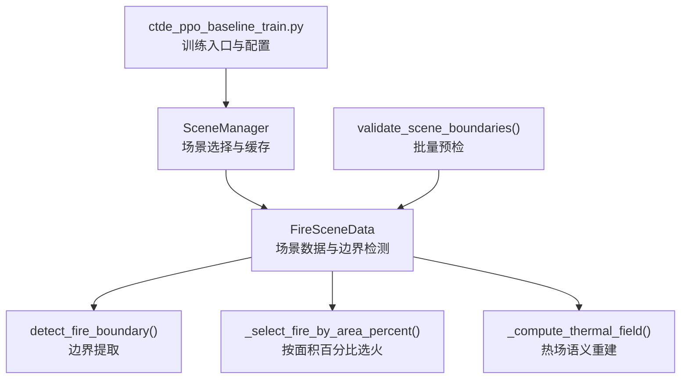
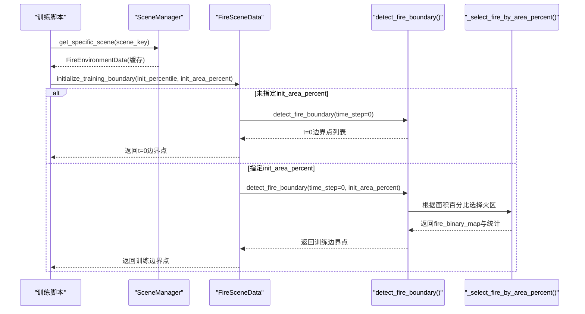
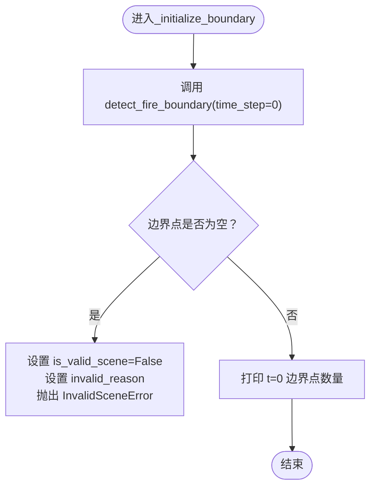
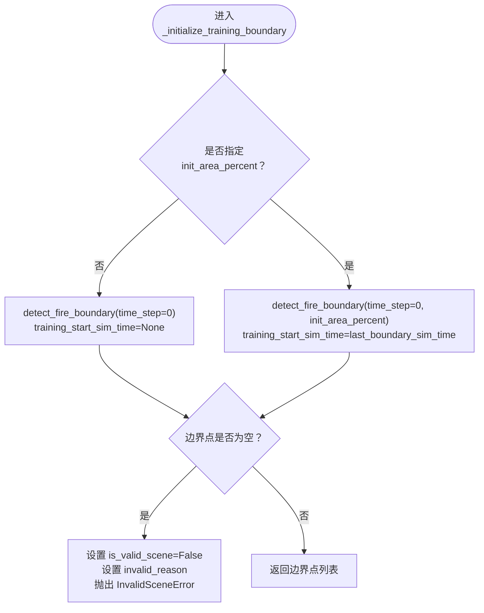
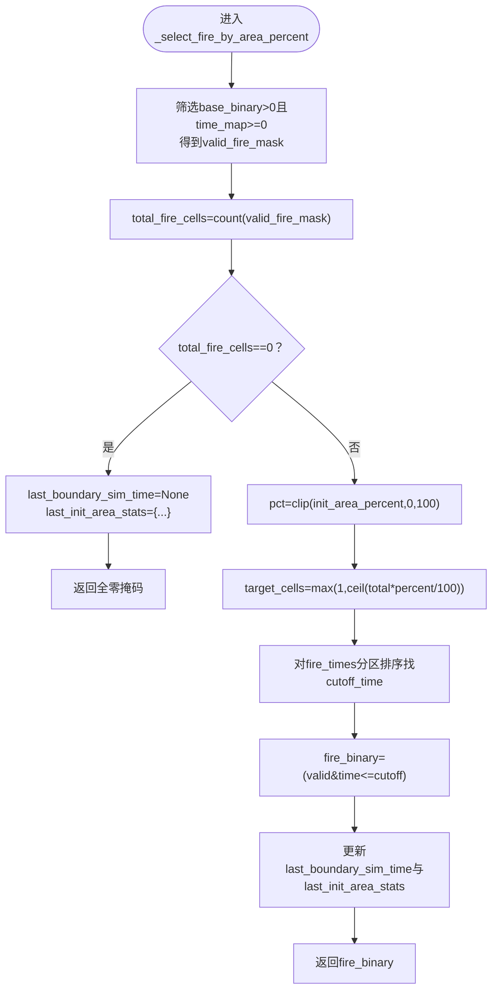
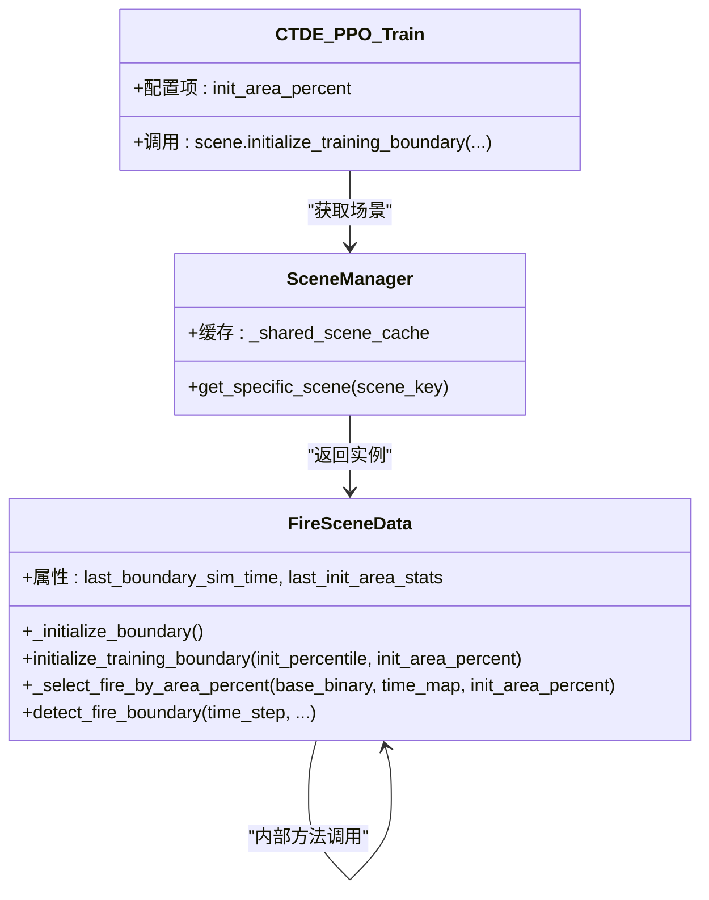

# 边界检测与初始化

<cite>
**本文引用的文件**   
- [信息转换.py](file://environment_variables/environment_variables/outputs/lr_comparison_20260709_095438/训练结果/训练源码/信息转换.py)
- [ctde_ppo_baseline_train.py](file://environment_variables/environment_variables/ctde_ppo_baseline_train.py)
</cite>

## 目录
1. [简介](#简介)
2. [项目结构](#项目结构)
3. [核心组件](#核心组件)
4. [架构总览](#架构总览)
5. [详细组件分析](#详细组件分析)
6. [依赖关系分析](#依赖关系分析)
7. [性能考量](#性能考量)
8. [故障排查指南](#故障排查指南)
9. [结论](#结论)
10. [附录：使用示例与最佳实践](#附录使用示例与最佳实践)

## 简介
本技术文档聚焦于火灾场景的“边界检测与初始化”能力，围绕以下关键目标展开：
- 深入解释 _initialize_boundary() 的执行逻辑，包括 t=0 时刻火灾边界的检测与验证。
- 详细说明 initialize_training_boundary() 的训练边界初始化过程，特别是 init_area_percent 参数的作用与面积百分比选择算法。
- 解析 _select_fire_by_area_percent() 的核心实现，包括时间阈值计算和目标单元格数量确定。
- 说明 _invalid_scene_error 异常的处理机制与场景有效性检查。
- 梳理 _last_boundary_sim_time 和 _last_init_area_stats 的状态管理。
- 提供具体代码示例路径，展示不同初始化策略的使用方法与边界点获取方式。

## 项目结构
与边界检测与初始化直接相关的核心代码位于数据加载与预处理模块中，主要类与方法如下：
- FireSceneData：场景数据加载、归一化、热场重建、边界检测与初始化等核心逻辑。
- DatasetIndex / SceneManager：数据集索引与场景管理器，负责场景元数据与缓存。
- validate_scene_boundaries：批量校验场景边界有效性的工具函数。
- 训练脚本 ctde_ppo_baseline_train.py：通过配置项驱动初始化策略（如 init_area_percent）。

图表来源
- [信息转换.py:1282-1326](file://environment_variables/environment_variables/outputs/lr_comparison_20260709_095438/训练结果/训练源码/信息转换.py#L1282-L1326)
- [信息转换.py:821-887](file://environment_variables/environment_variables/outputs/lr_comparison_20260709_095438/训练结果/训练源码/信息转换.py#L821-L887)
- [信息转换.py:723-757](file://environment_variables/environment_variables/outputs/lr_comparison_20260709_095438/训练结果/训练源码/信息转换.py#L723-L757)
- [信息转换.py:1329-1416](file://environment_variables/environment_variables/outputs/lr_comparison_20260709_095438/训练结果/训练源码/信息转换.py#L1329-L1416)

章节来源
- [信息转换.py:219-321](file://environment_variables/environment_variables/outputs/lr_comparison_20260709_095438/训练结果/训练源码/信息转换.py#L219-L321)
- [ctde_ppo_baseline_train.py:98-158](file://environment_variables/environment_variables/ctde_ppo_baseline_train.py#L98-L158)

## 核心组件
- InvalidSceneError：自定义异常，用于表示场景无法提供有效的 t=0 火灾边界或训练边界为空。
- FireSceneData：封装了场景数据读取、栅格归一化、热场重建、边界检测与初始化、局部邻域特征提取等功能。
- SceneManager：基于共享缓存的场景管理器，避免重复读盘与重复计算。
- validate_scene_boundaries：对指定集合的场景进行边界有效性预检，汇总统计并抛出异常。

章节来源
- [信息转换.py:16-18](file://environment_variables/environment_variables/outputs/lr_comparison_20260709_095438/训练结果/训练源码/信息转换.py#L16-L18)
- [信息转换.py:219-321](file://environment_variables/environment_variables/outputs/lr_comparison_20260709_095438/训练结果/训练源码/信息转换.py#L219-L321)
- [信息转换.py:1282-1326](file://environment_variables/environment_variables/outputs/lr_comparison_20260709_095438/训练结果/训练源码/信息转换.py#L1282-L1326)
- [信息转换.py:1329-1416](file://environment_variables/environment_variables/outputs/lr_comparison_20260709_095438/训练结果/训练源码/信息转换.py#L1329-L1416)

## 架构总览
下图展示了从训练脚本到场景数据、再到边界检测与初始化的调用链路与状态流转。

图表来源
- [ctde_ppo_baseline_train.py:1265-1265](file://environment_variables/environment_variables/ctde_ppo_baseline_train.py#L1265-L1265)
- [信息转换.py:698-721](file://environment_variables/environment_variables/outputs/lr_comparison_20260709_095438/训练结果/训练源码/信息转换.py#L698-L721)
- [信息转换.py:821-887](file://environment_variables/environment_variables/outputs/lr_comparison_20260709_095438/训练结果/训练源码/信息转换.py#L821-L887)
- [信息转换.py:723-757](file://environment_variables/environment_variables/outputs/lr_comparison_20260709_095438/训练结果/训练源码/信息转换.py#L723-L757)

## 详细组件分析

### _initialize_boundary() 执行逻辑（t=0 边界检测与验证）
- 功能要点
  - 调用 detect_fire_boundary(time_step=0) 获取 t=0 时刻的火灾边界点。
  - 若边界点为空，则标记场景无效（is_valid_scene=False），设置 invalid_reason，并抛出 InvalidSceneError。
  - 打印 t=0 边界点数量，便于调试与日志记录。
- 状态管理
  - training_start_sim_time 在方法开始时重置为 None；当后续使用面积百分比初始化时，该值会被更新为 last_boundary_sim_time。
- 错误处理
  - 通过 InvalidSceneError 明确表达“无有效 t=0 边界”的错误语义，阻止训练继续。

图表来源
- [信息转换.py:684-696](file://environment_variables/environment_variables/outputs/lr_comparison_20260709_095438/训练结果/训练源码/信息转换.py#L684-L696)

章节来源
- [信息转换.py:684-696](file://environment_variables/environment_variables/outputs/lr_comparison_20260709_095438/训练结果/训练源码/信息转换.py#L684-L696)

### initialize_training_boundary() 训练边界初始化流程
- 参数说明
  - init_percentile：回退策略使用的百分位（当未显式指定 init_area_percent 时使用）。
  - init_area_percent：按面积百分比选择初始火区的比例（0~100）。
- 分支逻辑
  - 若未指定 init_area_percent：直接以 t=0 边界作为训练边界，training_start_sim_time 保持为 None。
  - 若指定 init_area_percent：调用 detect_fire_boundary(time_step=0, init_area_percent=...)，并将 training_start_sim_time 设置为 last_boundary_sim_time。
- 有效性检查
  - 若最终边界点为空，标记场景无效并抛出 InvalidSceneError。
- 返回值
  - 返回训练边界点列表（坐标元组）。

图表来源
- [信息转换.py:698-721](file://environment_variables/environment_variables/outputs/lr_comparison_20260709_095438/训练结果/训练源码/信息转换.py#L698-L721)

章节来源
- [信息转换.py:698-721](file://environment_variables/environment_variables/outputs/lr_comparison_20260709_095438/训练结果/训练源码/信息转换.py#L698-L721)

### _select_fire_by_area_percent() 核心实现（面积百分比选择算法）
- 输入
  - base_binary：基于强度阈值的二值火区掩码。
  - time_map：每个单元格的着火时间栅格。
  - init_area_percent：期望的初始火区面积百分比（0~100）。
- 步骤
  - 筛选 base_binary 中正像素且 time_map 非负的区域，得到 valid_fire_mask。
  - 计算 total_fire_cells = valid_fire_mask 的非零计数。
  - 若 total_fire_cells == 0：清空 last_boundary_sim_time，设置 last_init_area_stats 为零统计，返回全零掩码。
  - 否则：
    - 将 init_area_percent 裁剪至 [0, 100]。
    - 计算 target_cells = ceil(total_fire_cells * pct / 100)，至少为 1。
    - 取 valid_fire_mask 对应的时间值 fire_times，使用分区排序找到第 target_cells 小的时间作为 cutoff_time。
    - 生成 fire_binary = (valid_fire_mask & (time_map <= cutoff_time))。
    - 更新 last_boundary_sim_time = cutoff_time。
    - 更新 last_init_area_stats：包含 total_fire_cells、init_fire_cells、actual_init_area_percent、cutoff_time。
- 输出
  - 返回符合面积百分比约束的二值火区掩码。

图表来源
- [信息转换.py:723-757](file://environment_variables/environment_variables/outputs/lr_comparison_20260709_095438/训练结果/训练源码/信息转换.py#L723-L757)

章节来源
- [信息转换.py:723-757](file://environment_variables/environment_variables/outputs/lr_comparison_20260709_095438/训练结果/训练源码/信息转换.py#L723-L757)

### _invalid_scene_error 异常处理与场景有效性检查
- 触发条件
  - _initialize_boundary()：t=0 边界点为空。
  - initialize_training_boundary()：训练边界点为空（含 init_area_percent 分支）。
  - validate_scene_boundaries()：批量预检发现任意场景 t=0 或 init_area_percent 边界为空。
- 行为
  - 设置 is_valid_scene=False 与 invalid_reason 描述原因。
  - 抛出 InvalidSceneError，中断当前流程。
- 建议
  - 在训练前调用 validate_scene_boundaries() 进行预检，提前发现无效场景。
  - 捕获 InvalidSceneError 并进行日志记录与跳过处理。

章节来源
- [信息转换.py:684-696](file://environment_variables/environment_variables/outputs/lr_comparison_20260709_095438/训练结果/训练源码/信息转换.py#L684-L696)
- [信息转换.py:698-721](file://environment_variables/environment_variables/outputs/lr_comparison_20260709_095438/训练结果/训练源码/信息转换.py#L698-L721)
- [信息转换.py:1329-1416](file://environment_variables/environment_variables/outputs/lr_comparison_20260709_095438/训练结果/训练源码/信息转换.py#L1329-L1416)

### _last_boundary_sim_time 与 _last_init_area_stats 状态管理
- last_boundary_sim_time
  - 在 detect_fire_boundary() 中根据时间步与时间范围计算当前仿真时间，并赋值给 last_boundary_sim_time。
  - 在 _select_fire_by_area_percent() 中，当使用面积百分比选择时，将其设置为 cutoff_time。
  - 在 initialize_training_boundary() 中，若使用面积百分比，training_start_sim_time 被设置为 last_boundary_sim_time。
- last_init_area_stats
  - 在 _select_fire_by_area_percent() 中更新，包含：
    - total_fire_cells：有效火区总单元格数。
    - init_fire_cells：按面积百分比选择的初始火区单元格数。
    - actual_init_area_percent：实际达到的面积百分比。
    - cutoff_time：用于选择的时间阈值。
  - 在 detect_fire_boundary() 开始处会重置为 None，确保每次检测的独立性。
- 用途
  - 用于诊断与可视化：了解训练起始时间与所选火区规模。
  - 用于课程学习：结合 CurriculumManager 动态调整 init_area_percent。

章节来源
- [信息转换.py:821-887](file://environment_variables/environment_variables/outputs/lr_comparison_20260709_095438/训练结果/训练源码/信息转换.py#L821-L887)
- [信息转换.py:723-757](file://environment_variables/environment_variables/outputs/lr_comparison_20260709_095438/训练结果/训练源码/信息转换.py#L723-L757)
- [信息转换.py:698-721](file://environment_variables/environment_variables/outputs/lr_comparison_20260709_095438/训练结果/训练源码/信息转换.py#L698-L721)

## 依赖关系分析
- 训练脚本通过配置项 init_area_percent 控制初始化策略，并在训练循环中调用 scene.initialize_training_boundary(...)。
- SceneManager 提供场景实例的缓存，避免重复创建与重复计算。
- FireSceneData 内部依赖 rasterio、scipy.ndimage、cv2 等库进行栅格读取、形态学操作与图像缩放模糊。

图表来源
- [ctde_ppo_baseline_train.py:1265-1265](file://environment_variables/environment_variables/ctde_ppo_baseline_train.py#L1265-L1265)
- [信息转换.py:1282-1326](file://environment_variables/environment_variables/outputs/lr_comparison_20260709_095438/训练结果/训练源码/信息转换.py#L1282-L1326)
- [信息转换.py:684-721](file://environment_variables/environment_variables/outputs/lr_comparison_20260709_095438/训练结果/训练源码/信息转换.py#L684-L721)

章节来源
- [ctde_ppo_baseline_train.py:98-158](file://environment_variables/environment_variables/ctde_ppo_baseline_train.py#L98-L158)
- [信息转换.py:1282-1326](file://environment_variables/environment_variables/outputs/lr_comparison_20260709_095438/训练结果/训练源码/信息转换.py#L1282-L1326)

## 性能考量
- 面积百分比选择算法使用分区排序（partition）而非完整排序，时间复杂度近似 O(n)，适合大规模栅格。
- 边界提取采用形态学腐蚀差集（binary_erosion），计算高效且稳定。
- 热场重建采用先下采样再高斯模糊后上采样的策略，降低计算量同时保留语义梯度。
- 建议在批量预检阶段启用 validate_scene_boundaries()，减少无效场景带来的额外开销。

[本节为通用指导，不直接分析具体文件]

## 故障排查指南
- 常见错误
  - 场景缺少必要栅格或矢量文件：DatasetIndex.required_file_paths 会报告缺失路径。
  - t=0 边界为空：_initialize_boundary() 抛出 InvalidSceneError。
  - 训练边界为空：initialize_training_boundary() 抛出 InvalidSceneError。
- 定位方法
  - 使用 validate_scene_boundaries() 进行批量预检，查看 counts 与 invalid_messages。
  - 检查 last_init_area_stats 中的 actual_init_area_percent 与 cutoff_time，确认面积百分比选择是否合理。
  - 检查 last_boundary_sim_time 是否与预期时间步一致。
- 修复建议
  - 调整 init_area_percent 或 init_percentile，确保能选出足够多的初始火区。
  - 修正 metadata.json 或 dataset_index.json 的路径配置。
  - 检查 intensity 与 time 栅格的数据质量（是否存在大量 NaN 或 nodata）。

章节来源
- [信息转换.py:1329-1416](file://environment_variables/environment_variables/outputs/lr_comparison_20260709_095438/训练结果/训练源码/信息转换.py#L1329-L1416)
- [信息转换.py:684-721](file://environment_variables/environment_variables/outputs/lr_comparison_20260709_095438/训练结果/训练源码/信息转换.py#L684-L721)

## 结论
- _initialize_boundary() 保证 t=0 边界的有效性，并通过 InvalidSceneError 快速失败。
- initialize_training_boundary() 支持两种初始化策略：直接使用 t=0 边界或按面积百分比选择初始火区。
- _select_fire_by_area_percent() 通过时间阈值与分区排序高效实现面积百分比约束。
- last_boundary_sim_time 与 last_init_area_stats 提供了丰富的诊断信息，有助于调参与问题定位。
- 建议在训练前运行 validate_scene_boundaries() 进行预检，提升整体稳定性与效率。

[本节为总结性内容，不直接分析具体文件]

## 附录：使用示例与最佳实践
- 训练脚本中调用训练边界初始化（参考路径）
  - [ctde_ppo_baseline_train.py:1265-1265](file://environment_variables/environment_variables/ctde_ppo_baseline_train.py#L1265-L1265)
- 获取 t=0 边界点（参考路径）
  - [信息转换.py:684-696](file://environment_variables/environment_variables/outputs/lr_comparison_20260709_095438/训练结果/训练源码/信息转换.py#L684-L696)
- 按面积百分比初始化训练边界（参考路径）
  - [信息转换.py:698-721](file://environment_variables/environment_variables/outputs/lr_comparison_20260709_095438/训练结果/训练源码/信息转换.py#L698-L721)
- 面积百分比选择算法（参考路径）
  - [信息转换.py:723-757](file://environment_variables/environment_variables/outputs/lr_comparison_20260709_095438/训练结果/训练源码/信息转换.py#L723-L757)
- 批量预检场景边界（参考路径）
  - [信息转换.py:1329-1416](file://environment_variables/environment_variables/outputs/lr_comparison_20260709_095438/训练结果/训练源码/信息转换.py#L1329-L1416)

最佳实践
- 在训练前调用 validate_scene_boundaries()，收集 counts 与 invalid_messages，提前发现问题。
- 对于课程学习，逐步提高 init_area_percent，观察 last_init_area_stats 的变化，确保模型能力稳步提升。
- 监控 last_boundary_sim_time，确保训练起始时间与预期一致，避免时间偏移导致的偏差。

[本节为使用指引，不直接分析具体文件]