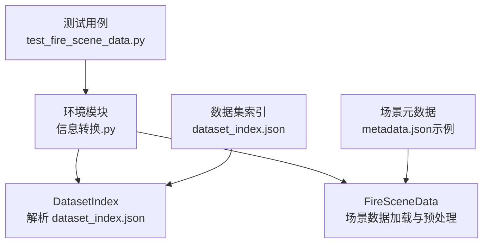
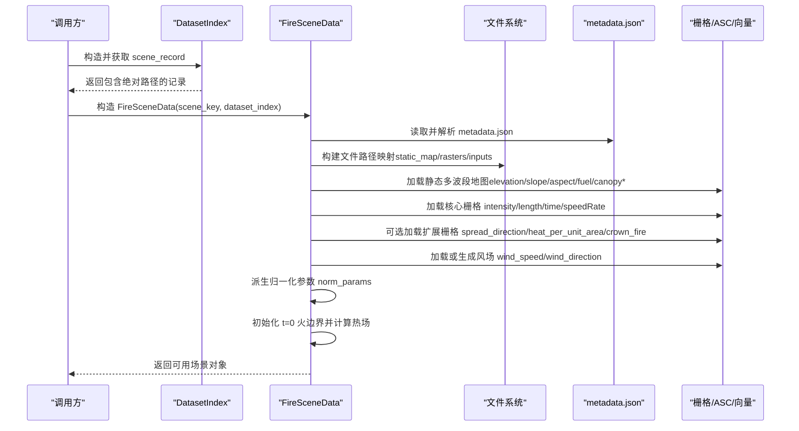
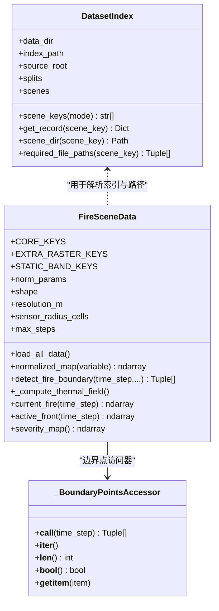
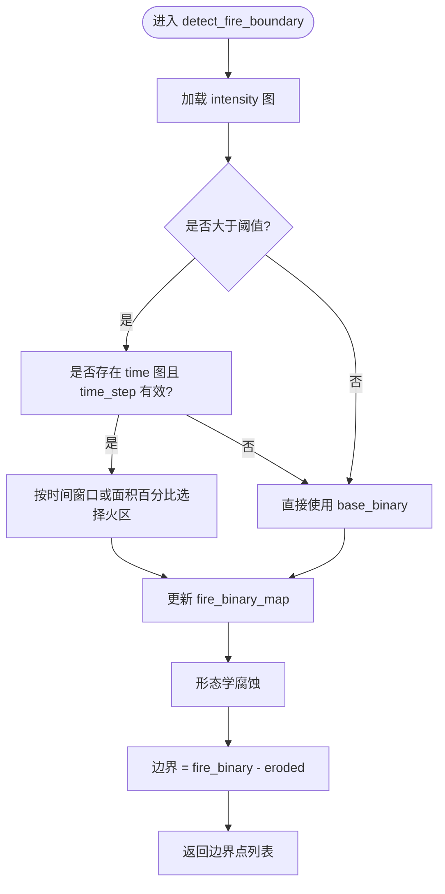
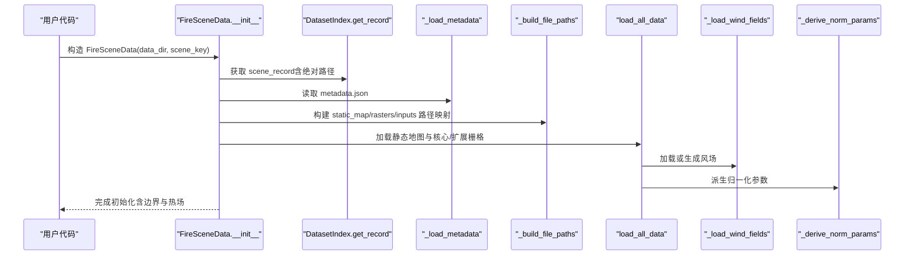
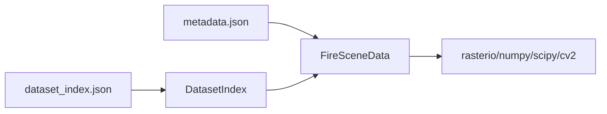

# 火灾场景数据核心

<cite>
**本文引用的文件**   
- [信息转换.py](file://environment_variables/environment_variables/信息转换.py)
- [test_fire_scene_data.py](file://environment_variables/environment_variables/test_fire_scene_data.py)
- [dataset_index.json](file://environment_variables/environment_variables/dataset/dataset_index.json)
- [metadata.json（示例）](file://map/Train/1/scene1/metadata.json)
</cite>

## 目录
1. [简介](#简介)
2. [项目结构](#项目结构)
3. [核心组件](#核心组件)
4. [架构总览](#架构总览)
5. [详细组件分析](#详细组件分析)
6. [依赖关系分析](#依赖关系分析)
7. [性能考虑](#性能考虑)
8. [故障排查指南](#故障排查指南)
9. [结论](#结论)
10. [附录：使用示例与最佳实践](#附录使用示例与最佳实践)

## 简介
本技术文档聚焦于 FireSceneData 类的核心功能，系统阐述 FARSITE 火灾模拟数据的加载流程，包括静态地图、动态栅格数据与矢量数据的读取处理；解释核心键值（intensity、length、time、speedRate）与扩展键值的区别与用途；说明 metadata.json 的解析过程与 uav 配置的处理逻辑；描述传感器半径计算、最大步数设置与环境参数初始化过程；给出数据验证规则与形状一致性检查的实现细节；并提供具体代码示例路径，展示如何正确加载和使用火灾场景数据。

## 项目结构
围绕 FireSceneData 的核心实现位于环境变量的 Python 模块中，配套测试用例与数据集索引、场景元数据共同构成完整的数据加载链路。

图表来源
- [信息转换.py:19-218](file://environment_variables/environment_variables/信息转换.py#L19-L218)
- [信息转换.py:219-682](file://environment_variables/environment_variables/信息转换.py#L219-L682)
- [test_fire_scene_data.py:28-110](file://environment_variables/environment_variables/test_fire_scene_data.py#L28-L110)
- [dataset_index.json:1-165](file://environment_variables/environment_variables/dataset/dataset_index.json#L1-L165)
- [metadata.json（示例）:1-171](file://map/Train/1/scene1/metadata.json#L1-L171)

章节来源
- [信息转换.py:19-218](file://environment_variables/environment_variables/信息转换.py#L19-L218)
- [信息转换.py:219-682](file://environment_variables/environment_variables/信息转换.py#L219-L682)
- [test_fire_scene_data.py:28-110](file://environment_variables/environment_variables/test_fire_scene_data.py#L28-L110)
- [dataset_index.json:1-165](file://environment_variables/environment_variables/dataset/dataset_index.json#L1-L165)
- [metadata.json（示例）:1-171](file://map/Train/1/scene1/metadata.json#L1-L171)

## 核心组件
- DatasetIndex：负责解析 dataset_index.json，提供场景键列表、记录获取、绝对路径推导等能力。
- FireSceneData：封装单个 FARSITE 场景的数据加载、校验、归一化、边界提取、热场重建等核心逻辑。
- _BoundaryPointsAccessor：为边界点访问提供统一接口，支持按时间步查询与缓存。
- 辅助工具：rasterio 栅格读取、ASC 文本栅格读取、天气流解析、高斯模糊与形态学操作等。

章节来源
- [信息转换.py:19-218](file://environment_variables/environment_variables/信息转换.py#L19-L218)
- [信息转换.py:219-682](file://environment_variables/environment_variables/信息转换.py#L219-L682)

## 架构总览
下图展示了从数据集索引到场景实例化的整体流程，以及关键数据流向。

图表来源
- [信息转换.py:219-682](file://environment_variables/environment_variables/信息转换.py#L219-L682)
- [dataset_index.json:1-165](file://environment_variables/environment_variables/dataset/dataset_index.json#L1-L165)
- [metadata.json（示例）:1-171](file://map/Train/1/scene1/metadata.json#L1-L171)

## 详细组件分析

### 类图概览

图表来源
- [信息转换.py:19-218](file://environment_variables/environment_variables/信息转换.py#L19-L218)
- [信息转换.py:219-682](file://environment_variables/environment_variables/信息转换.py#L219-L682)

#### 数据加载流程与键值体系
- 静态地图（多波段）：包含高程、坡度、坡向、燃料模型、冠层覆盖、冠层高、冠层底高、冠层密度等八个波段，作为地形与植被背景。
- 核心栅格（必需）：intensity（火线强度）、length（火焰长度）、time（到达时间）、speedRate（蔓延速率）。这些是训练与推理的关键输入。
- 扩展栅格（可选）：spread_direction（蔓延方向）、heat_per_unit_area（单位面积热量）、crown_fire（树冠火活动）。存在时会被加载并参与后续归一化与严重度计算。
- 风场：优先从 wind/wdir.asc 与 wind/wspd.asc 读取；若缺失则从 inputs/weather_stream.wxs 解析平均风速与风向，或回退至 metadata.json 中的 wind 字段。

章节来源
- [信息转换.py:219-390](file://environment_variables/environment_variables/信息转换.py#L219-L390)
- [信息转换.py:392-500](file://environment_variables/environment_variables/信息转换.py#L392-L500)
- [信息转换.py:501-682](file://environment_variables/environment_variables/信息转换.py#L501-L682)

#### 核心键值与扩展键值的区别与用途
- 核心键值（CORE_KEYS）：intensity、length、time、speedRate。用于定义火势强度、火焰尺度、时间演化与蔓延速度，是边界检测、热场重建与严重度评分的基础。
- 扩展键值（EXTRA_RASTER_KEYS）：spread_direction、heat_per_unit_area、crown_fire。增强对蔓延方向、能量释放与树冠火的刻画，参与严重度加权与可视化。

章节来源
- [信息转换.py:222-236](file://environment_variables/environment_variables/信息转换.py#L222-L236)

#### metadata.json 解析与 uav 配置处理
- 解析位置：在构造阶段读取 scene_dir 下的 metadata.json，得到分辨率、风场、燃料湿度、FARSITE 运行参数、统计指标、uav 配置等。
- uav 配置：
  - sensor_radius_m：传感器探测半径（米），结合 resolution_m 换算为网格单元半径 sensor_radius_cells。
  - max_steps：最大仿真步数，用于控制环境交互上限。
  - 其他如通信半径、起始位置等供上层环境使用。

章节来源
- [信息转换.py:274-284](file://environment_variables/environment_variables/信息转换.py#L274-L284)
- [metadata.json（示例）:122-140](file://map/Train/1/scene1/metadata.json#L122-L140)

#### 传感器半径计算与最大步数设置
- 传感器半径（单元格）：sensor_radius_cells = ceil(sensor_radius_m / resolution_m)，当 resolution_m > 0 时有效，否则为 0。
- 最大步数：直接从 metadata.uav.max_steps 读取，作为环境交互的最大迭代次数。

章节来源
- [信息转换.py:276-284](file://environment_variables/environment_variables/信息转换.py#L276-L284)

#### 环境参数初始化与归一化
- 归一化参数（norm_params）：基于场景内正数值分位数与极值推导，包括 intensity_max、length_max、speedRate_max、spread_direction_max、heat_per_unit_area_max、crown_fire_max、dem_min/max、slope_max、wind_speed_max、fire_threshold 等。
- 标准化方法：
  - DEM：按 dem_min/dem_max 线性缩放并裁剪到 [0,1]。
  - 其他变量：按对应 _max 参数归一化并裁剪到 [0,1]。
  - 别名映射：flame_length→length、ros→speedRate、heat→heat_per_unit_area。
- 日志输出：打印关键归一化参数摘要，便于调试与对比。

章节来源
- [信息转换.py:559-637](file://environment_variables/environment_variables/信息转换.py#L559-L637)
- [信息转换.py:604-615](file://environment_variables/environment_variables/信息转换.py#L604-L615)

#### 数据验证与形状一致性检查
- 静态地图波段数量校验：必须等于 STATIC_BAND_KEYS 的长度（8），否则抛出运行时错误。
- 栅格形状一致性：所有动态栅格与静态地图的 shape 必须一致，否则报错并附带文件路径以便定位。
- 风场形状一致性：最终 wind_speed 与 wind_direction 的形状需与全局 shape 一致。
- 无效场景判定：t=0 火边界为空时标记 is_valid_scene=False 并抛出 InvalidSceneError，阻止训练继续。

章节来源
- [信息转换.py:501-532](file://environment_variables/environment_variables/信息转换.py#L501-L532)
- [信息转换.py:670-682](file://environment_variables/environment_variables/信息转换.py#L670-L682)
- [信息转换.py:684-696](file://environment_variables/environment_variables/信息转换.py#L684-L696)

#### 边界检测与热场重建
- 边界检测：
  - 基于 intensity 阈值生成基础二值掩码。
  - 若 time 图存在且 time_step 合理，根据时间窗口选择当前时刻的火区；支持按初始面积百分比选取初始火区。
  - 通过形态学腐蚀差集提取活跃前沿（active front）。
- 热场重建（方案 C）：
  - 以 fire_binary_map 为掩码，将 intensity 按 per-scene 参考值归一化并裁剪到 [0,1]。
  - 下采样后高斯模糊，再上采样回全分辨率，取正值。
  - 以 p99 稳健归一化得到 thermal_potential，并进一步 log 压缩得到导航场，利于梯度计算。

章节来源
- [信息转换.py:723-887](file://environment_variables/environment_variables/信息转换.py#L723-L887)
- [信息转换.py:759-820](file://environment_variables/environment_variables/信息转换.py#L759-L820)

#### 严重度图与局部梯度
- 严重度图：综合 intensity、length、speedRate、heat_per_unit_area、crown_fire 的归一化值进行加权求和，结果裁剪到 [0,1]。
- 局部梯度：基于 nav_field（log 压缩势场）计算四邻域差分，避免高值区梯度消失。

章节来源
- [信息转换.py:903-918](file://environment_variables/environment_variables/信息转换.py#L903-L918)
- [信息转换.py:933-960](file://environment_variables/environment_variables/信息转换.py#L933-L960)

### 流程图：边界检测算法

图表来源
- [信息转换.py:821-887](file://environment_variables/environment_variables/信息转换.py#L821-L887)

### 序列图：场景初始化与数据加载

图表来源
- [信息转换.py:248-322](file://environment_variables/environment_variables/信息转换.py#L248-L322)
- [信息转换.py:349-390](file://environment_variables/environment_variables/信息转换.py#L349-L390)
- [信息转换.py:639-682](file://environment_variables/environment_variables/信息转换.py#L639-L682)

## 依赖关系分析
- 外部库：
  - rasterio：读取 GeoTIFF 栅格，提取 transform、crs、shape、nodata、bounds、count、descriptions。
  - numpy/scipy：数值运算、形态学操作、高斯滤波。
  - cv2：图像缩放（下采样/上采样）用于热场平滑。
- 内部依赖：
  - DatasetIndex：提供场景键、记录与路径解析。
  - metadata.json：提供分辨率、uav 配置、风场默认值等。
  - dataset_index.json：定义 rasters 映射、split 划分与 schema。

图表来源
- [dataset_index.json:1-165](file://environment_variables/environment_variables/dataset/dataset_index.json#L1-L165)
- [metadata.json（示例）:1-171](file://map/Train/1/scene1/metadata.json#L1-L171)
- [信息转换.py:219-682](file://environment_variables/environment_variables/信息转换.py#L219-L682)

章节来源
- [信息转换.py:219-682](file://environment_variables/environment_variables/信息转换.py#L219-L682)
- [dataset_index.json:1-165](file://environment_variables/environment_variables/dataset/dataset_index.json#L1-L165)
- [metadata.json（示例）:1-171](file://map/Train/1/scene1/metadata.json#L1-L171)

## 性能考虑
- 栅格读取与清洗：一次性读取并清理 nodata/NaN/负值，减少后续重复处理开销。
- 归一化参数派生：采用分位数与极值估计，避免极端值影响稳定性。
- 热场重建：先下采样再高斯模糊，最后上采样，降低计算量同时保持空间平滑性。
- 边界检测：利用形态学腐蚀差集快速提取前沿，避免复杂轮廓追踪。

[本节为通用指导，不直接分析具体文件]

## 故障排查指南
- 常见错误与定位：
  - 静态地图缺失或波段数不符：检查 static_map 路径与多波段数量是否为 8。
  - 栅格形状不一致：报错会附带 static_map 与问题栅格的文件路径，核对分辨率与裁剪范围。
  - 风场形状不一致：确认 wind/wdir.asc 与 wind/wspd.asc 是否与静态地图同形，或 weather_stream 解析是否正确。
  - t=0 边界为空：场景可能不符合训练要求，需调整阈值或初始面积百分比。
- 建议步骤：
  - 使用 required_file_paths 列出所有必需文件并校验存在性。
  - 打印 norm_params 摘要，确认归一化参数合理。
  - 检查 metadata.json 的 uav 配置与分辨率，确保 sensor_radius_cells 与 max_steps 符合预期。

章节来源
- [信息转换.py:501-532](file://environment_variables/environment_variables/信息转换.py#L501-L532)
- [信息转换.py:670-682](file://environment_variables/environment_variables/信息转换.py#L670-L682)
- [信息转换.py:684-696](file://environment_variables/environment_variables/信息转换.py#L684-L696)

## 结论
FireSceneData 提供了完整的 FARSITE 场景数据加载与预处理管线，涵盖静态地图、核心与扩展栅格、风场、归一化、边界检测与热场重建。其严格的形状与波段校验、稳健的归一化策略与清晰的错误提示，使得数据质量可控、可复现实验。配合 DatasetIndex 与 metadata.json，可实现跨场景的统一接入与参数化配置。

[本节为总结性内容，不直接分析具体文件]

## 附录：使用示例与最佳实践

### 示例一：通过 dataset_index.json 加载场景
- 步骤要点：
  - 构造 DatasetIndex，指定 data_dir。
  - 使用 scene_keys("train") 获取训练场景键。
  - 构造 FireSceneData，传入 data_dir 与 scene_key。
  - 校验 shape、静态地图波段、核心/扩展栅格存在性与形状一致性。
  - 访问 normalized_map、current_fire、active_front、boundary_points 等属性。
- 参考路径：
  - [test_fire_scene_data.py:28-110](file://environment_variables/environment_variables/test_fire_scene_data.py#L28-L110)

章节来源
- [test_fire_scene_data.py:28-110](file://environment_variables/environment_variables/test_fire_scene_data.py#L28-L110)

### 示例二：自定义初始火区面积百分比
- 步骤要点：
  - 调用 initialize_training_boundary(init_area_percent=5.0)。
  - 检查 last_init_area_stats 与实际初始面积百分比。
  - 使用 current_fire(0) 与 active_front(0) 验证结果。
- 参考路径：
  - [信息转换.py:698-721](file://environment_variables/environment_variables/信息转换.py#L698-L721)
  - [信息转换.py:723-757](file://environment_variables/environment_variables/信息转换.py#L723-L757)

章节来源
- [信息转换.py:698-757](file://environment_variables/environment_variables/信息转换.py#L698-L757)

### 示例三：读取与使用归一化参数
- 步骤要点：
  - 访问 norm_params 中的 intensity_max、length_max、speedRate_max、dem_min/max、slope_max、wind_speed_max、fire_threshold。
  - 使用 normalized_map 对任意变量进行归一化，确保输出在 [0,1]。
- 参考路径：
  - [信息转换.py:559-637](file://environment_variables/environment_variables/信息转换.py#L559-L637)
  - [test_fire_scene_data.py:67-110](file://environment_variables/environment_variables/test_fire_scene_data.py#L67-L110)

章节来源
- [信息转换.py:559-637](file://environment_variables/environment_variables/信息转换.py#L559-L637)
- [test_fire_scene_data.py:67-110](file://environment_variables/environment_variables/test_fire_scene_data.py#L67-L110)

### 示例四：处理 uav 配置与传感器半径
- 步骤要点：
  - 从 metadata.json 的 uav 字段读取 sensor_radius_m 与 max_steps。
  - 计算 sensor_radius_cells = ceil(sensor_radius_m / resolution_m)。
  - 在环境中使用 vision_radius=max(sensor_radius_cells, 用户设定) 与 max_steps。
- 参考路径：
  - [metadata.json（示例）:122-140](file://map/Train/1/scene1/metadata.json#L122-L140)
  - [信息转换.py:276-284](file://environment_variables/environment_variables/信息转换.py#L276-L284)

章节来源
- [metadata.json（示例）:122-140](file://map/Train/1/scene1/metadata.json#L122-L140)
- [信息转换.py:276-284](file://environment_variables/environment_variables/信息转换.py#L276-L284)

### 示例五：风场加载与回退策略
- 步骤要点：
  - 优先加载 wind/wdir.asc 与 wind/wspd.asc。
  - 若缺失，解析 inputs/weather_stream.wxs 的平均风速与风向。
  - 若仍不可用，回退到 metadata.json 的 wind 字段。
- 参考路径：
  - [信息转换.py:473-490](file://environment_variables/environment_variables/信息转换.py#L473-L490)
  - [信息转换.py:426-471](file://environment_variables/environment_variables/信息转换.py#L426-L471)

章节来源
- [信息转换.py:426-490](file://environment_variables/environment_variables/信息转换.py#L426-L490)