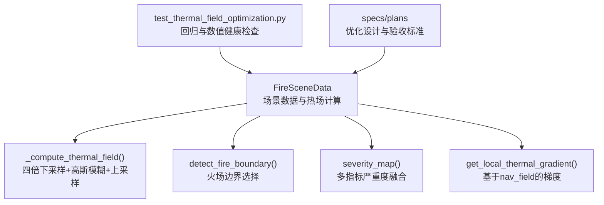
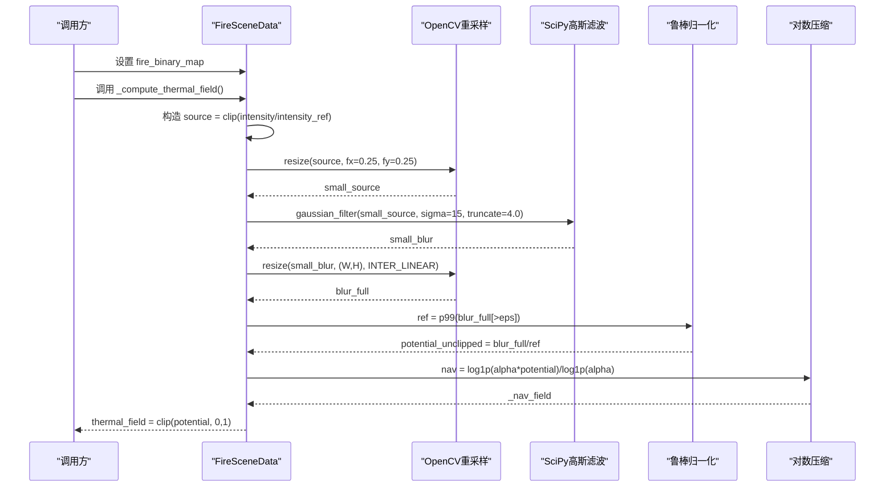
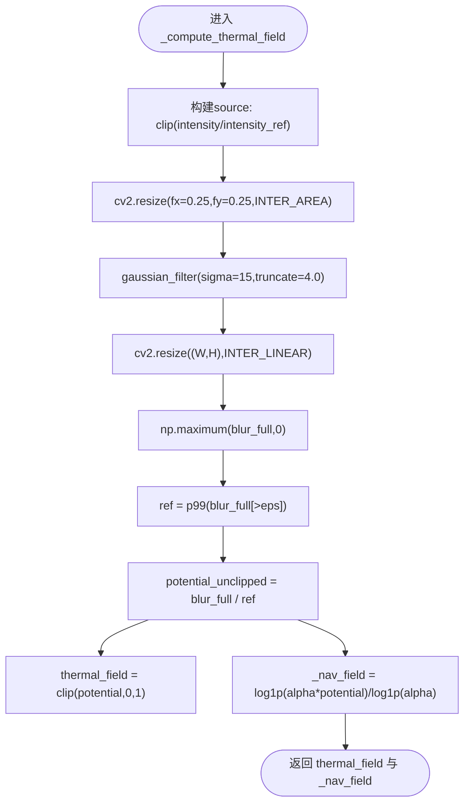
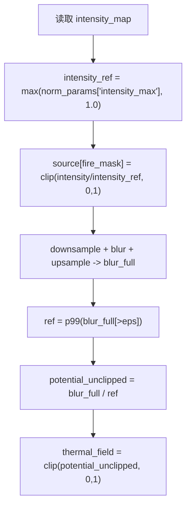
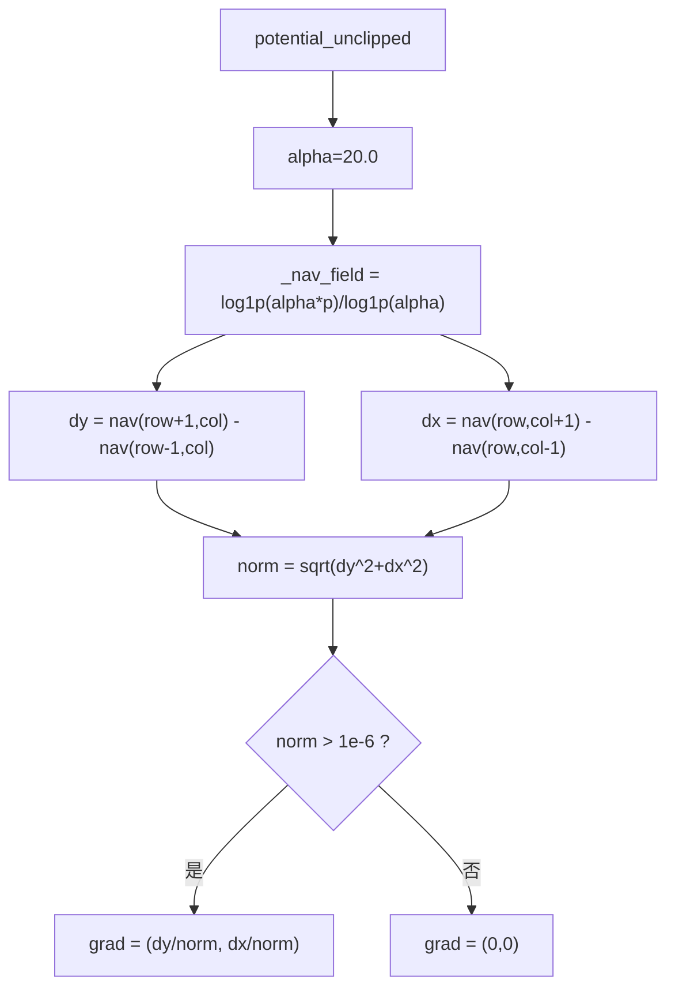
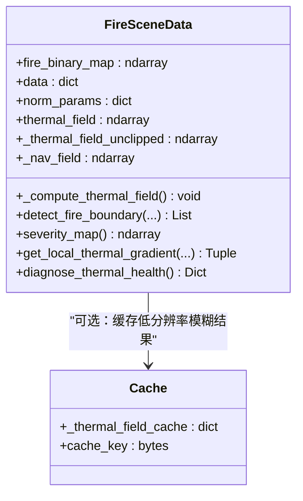
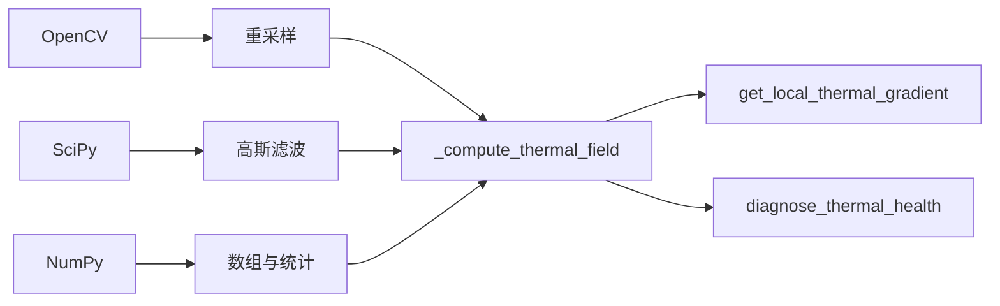

# 热场计算优化

<cite>
**本文引用的文件**
- [信息转换.py](file://environment_variables/environment_variables/信息转换.py)
- [test_thermal_field_optimization.py](file://environment_variables/environment_variables/test_thermal_field_optimization.py)
- [2026-07-06-thermal-field-optimization-design.md](file://docs/superpowers/specs/2026-07-06-thermal-field-optimization-design.md)
- [2026-07-06-thermal-field-optimization.md](file://docs/superpowers/plans/2026-07-06-thermal-field-optimization.md)
</cite>

## 目录
1. [引言](#引言)
2. [项目结构](#项目结构)
3. [核心组件](#核心组件)
4. [架构总览](#架构总览)
5. [详细组件分析](#详细组件分析)
6. [依赖关系分析](#依赖关系分析)
7. [性能考量](#性能考量)
8. [故障排查指南](#故障排查指南)
9. [结论](#结论)
10. [附录：参数调优与数学推导](#附录参数调优与数学推导)

## 引言
本技术文档围绕“热场计算系统”的优化实现，系统性阐述以下关键内容：
- 基于四分之一分辨率的高斯模糊近似计算方法（downsample + gaussian blur + upsample）三阶段处理流程。
- per-scene robust normalization 的实现原理，包括 intensity_ref 的计算与 thermal_potential 的归一化过程。
- nav_field 的对数变换算法及其梯度优化效果。
- 热场计算的缓存机制与性能优化策略。
- 具体数学公式推导与代码路径示例，指导如何调整参数以获得最佳的热场表示效果。

## 项目结构
本项目中热场计算的核心逻辑集中在场景数据类与相关工具函数中，测试与优化设计文档位于 docs 与 tests 目录。整体组织方式以功能模块为主，热场计算、边界检测、特征提取等职责清晰分离。

图表来源
- [信息转换.py:759-819](file://environment_variables/environment_variables/信息转换.py#L759-L819)
- [信息转换.py:821-887](file://environment_variables/environment_variables/信息转换.py#L821-L887)
- [信息转换.py:903-918](file://environment_variables/environment_variables/信息转换.py#L903-L918)
- [信息转换.py:933-970](file://environment_variables/environment_variables/信息转换.py#L933-L970)
- [test_thermal_field_optimization.py:25-69](file://environment_variables/environment_variables/test_thermal_field_optimization.py#L25-L69)
- [2026-07-06-thermal-field-optimization-design.md:1-29](file://docs/superpowers/specs/2026-07-06-thermal-field-optimization-design.md#L1-L29)
- [2026-07-06-thermal-field-optimization.md:1-142](file://docs/superpowers/plans/2026-07-06-thermal-field-optimization.md#L1-L142)

章节来源
- [信息转换.py:1-1426](file://environment_variables/environment_variables/信息转换.py#L1-L1426)
- [test_thermal_field_optimization.py:1-70](file://environment_variables/environment_variables/test_thermal_field_optimization.py#L1-L70)
- [2026-07-06-thermal-field-optimization-design.md:1-29](file://docs/superpowers/specs/2026-07-06-thermal-field-optimization-design.md#L1-L29)
- [2026-07-06-thermal-field-optimization.md:1-142](file://docs/superpowers/plans/2026-07-06-thermal-field-optimization.md#L1-L142)

## 核心组件
- FireSceneData：负责加载场景栅格、派生归一化参数、构建火场边界、计算热场与导航场、提供局部梯度与健康诊断。
- 热场计算链路：per-scene robust normalization → downsample(0.25x) → gaussian_filter(sigma=15, truncate=4.0) → upsample(线性插值) → robust potential normalization → log-compressed nav_field。
- 边界检测：基于时间切片或面积百分比选择初始火场掩码，并提取活跃前沿点集。
- 严重度图：加权融合强度、火焰长度、蔓延速率、单位面积热量、冠层火等多指标。
- 健康诊断：统计饱和比例、高值区零梯度比例、分位数等指标，辅助训练前校验。

章节来源
- [信息转换.py:219-322](file://environment_variables/environment_variables/信息转换.py#L219-L322)
- [信息转换.py:759-819](file://environment_variables/environment_variables/信息转换.py#L759-L819)
- [信息转换.py:821-887](file://environment_variables/environment_variables/信息转换.py#L821-L887)
- [信息转换.py:903-918](file://environment_variables/environment_variables/信息转换.py#L903-L918)
- [信息转换.py:972-1012](file://environment_variables/environment_variables/信息转换.py#L972-L1012)

## 架构总览
下图展示了热场计算的关键调用链路与数据流，从输入的火场掩码到最终的 thermal_field 与 _nav_field 输出。

图表来源
- [信息转换.py:759-819](file://environment_variables/environment_variables/信息转换.py#L759-L819)

## 详细组件分析

### 四分之一分辨率高斯模糊近似（downsample + gaussian blur + upsample）
- 目标：在保持语义一致性的前提下，显著降低高斯模糊的计算成本。
- 步骤：
  - 将源图按 0.25 倍空间分辨率下采样，得到小尺寸图。
  - 在小图上执行高斯滤波，sigma=15，truncate=4.0。
  - 使用线性插值将模糊结果上采样回原分辨率。
- 优点：
  - 计算复杂度随像素数量下降约 16 倍，配合缓存可进一步加速重复场景。
  - 通过 p99 参考值进行鲁棒归一化，避免极端值影响。
- 风险与缓解：
  - 下采样可能引入轻微平滑误差；通过保留 truncate=4.0 与 p99 归一化控制误差范围。
  - 上采样采用线性插值，保证边缘连续性。

图表来源
- [信息转换.py:759-819](file://environment_variables/environment_variables/信息转换.py#L759-L819)

章节来源
- [信息转换.py:759-819](file://environment_variables/environment_variables/信息转换.py#L759-L819)
- [2026-07-06-thermal-field-optimization-design.md:1-29](file://docs/superpowers/specs/2026-07-06-thermal-field-optimization-design.md#L1-L29)
- [2026-07-06-thermal-field-optimization.md:1-142](file://docs/superpowers/plans/2026-07-06-thermal-field-optimization.md#L1-L142)

### per-scene robust normalization（intensity_ref 与 thermal_potential）
- intensity_ref 计算：
  - 从 norm_params 中读取 intensity_max，若缺失则默认 1.0，且至少为 1.0。
  - 用于将 intensity 裁剪至 [0,1] 区间，作为 source 的基础。
- thermal_potential 归一化：
  - 对 blur_full 取正样本（> eps），计算其 99% 分位数为 ref。
  - potential_unclipped = blur_full / ref，再 clip 到 [0,1] 得到 thermal_field。
- 目的：
  - 消除不同场景间强度量纲差异，确保热场语义稳定。
  - 使用 p99 而非最大值，增强对异常值的鲁棒性。

图表来源
- [信息转换.py:783-813](file://environment_variables/environment_variables/信息转换.py#L783-L813)

章节来源
- [信息转换.py:783-813](file://environment_variables/environment_variables/信息转换.py#L783-L813)

### nav_field 的对数变换与梯度优化
- 对数变换：
  - 使用 alpha=20.0，对 potential_unclipped 做 log1p(alpha*x)/log1p(alpha) 压缩。
  - 输出 _nav_field 用于后续梯度计算，避免高值区梯度消失。
- 局部梯度：
  - 在 _nav_field 上使用中心差分计算 dy/dx，并进行 L2 归一化。
  - 当当前热力值小于阈值时返回零向量，避免噪声区域干扰。
- 效果：
  - 在高热区维持稳定的梯度方向，提升优化稳定性与收敛质量。

图表来源
- [信息转换.py:815-819](file://environment_variables/environment_variables/信息转换.py#L815-L819)
- [信息转换.py:933-970](file://environment_variables/environment_variables/信息转换.py#L933-L970)

章节来源
- [信息转换.py:815-819](file://environment_variables/environment_variables/信息转换.py#L815-L819)
- [信息转换.py:933-970](file://environment_variables/environment_variables/信息转换.py#L933-L970)

### 缓存机制与性能优化策略
- 设计要点（来自优化计划与设计文档）：
  - 在低分辨率图上缓存 blurred 结果，而非全分辨率输出，以降低内存占用与重复计算。
  - 使用 BLAKE2b 对打包的二进制火场掩码生成精确哈希，作为缓存键，避免相同计数但不同位置的掩码冲突。
  - 保持 truncate=4.0，确保近似与原实现的数值接近。
- 实际实现现状：
  - 当前主实现未包含显式缓存字典与 blake2b 键；建议按计划引入缓存以提升冷启动性能。
  - 已有测试用例覆盖形状、范围、不同掩码产生不同场、以及健康诊断指标。

图表来源
- [信息转换.py:759-819](file://environment_variables/environment_variables/信息转换.py#L759-L819)
- [2026-07-06-thermal-field-optimization-design.md:1-29](file://docs/superpowers/specs/2026-07-06-thermal-field-optimization-design.md#L1-L29)
- [2026-07-06-thermal-field-optimization.md:1-142](file://docs/superpowers/plans/2026-07-06-thermal-field-optimization.md#L1-L142)

章节来源
- [2026-07-06-thermal-field-optimization-design.md:1-29](file://docs/superpowers/specs/2026-07-06-thermal-field-optimization-design.md#L1-L29)
- [2026-07-06-thermal-field-optimization.md:1-142](file://docs/superpowers/plans/2026-07-06-thermal-field-optimization.md#L1-L142)
- [test_thermal_field_optimization.py:25-69](file://environment_variables/environment_variables/test_thermal_field_optimization.py#L25-L69)

## 依赖关系分析
- 外部库：
  - OpenCV：用于高效重采样（INTER_AREA 下采样与 INTER_LINEAR 上采样）。
  - SciPy：用于高斯滤波（gaussian_filter）。
  - NumPy：数组操作、分位数、布尔掩码、边界检测等。
- 内部耦合：
  - _compute_thermal_field 依赖 detect_fire_boundary 生成的 fire_binary_map。
  - get_local_thermal_gradient 依赖 _nav_field 的输出。
  - severity_map 依赖 normalized_map 的多指标归一化结果。

图表来源
- [信息转换.py:759-819](file://environment_variables/environment_variables/信息转换.py#L759-L819)
- [信息转换.py:933-970](file://environment_variables/environment_variables/信息转换.py#L933-L970)
- [信息转换.py:972-1012](file://environment_variables/environment_variables/信息转换.py#L972-L1012)

章节来源
- [信息转换.py:759-819](file://environment_variables/environment_variables/信息转换.py#L759-L819)
- [信息转换.py:933-970](file://environment_variables/environment_variables/信息转换.py#L933-L970)
- [信息转换.py:972-1012](file://environment_variables/environment_variables/信息转换.py#L972-L1012)

## 性能考量
- 计算复杂度：
  - 下采样使像素数量降至 1/16，高斯滤波成本显著降低。
  - 上采样使用线性插值，开销较小。
- 缓存收益：
  - 若引入低分辨率模糊结果的缓存与精确掩码哈希键，可避免重复计算，显著提升冷启动性能。
- 精度约束：
  - 计划要求 MAE ≤ 0.5，阈值不一致率 ≤ 0.2%，速度提升 ≥ 20x。
- 内存占用：
  - 缓存低分辨率结果可减少内存压力，适合大规模场景批处理。

章节来源
- [2026-07-06-thermal-field-optimization-design.md:1-29](file://docs/superpowers/specs/2026-07-06-thermal-field-optimization-design.md#L1-L29)
- [2026-07-06-thermal-field-optimization.md:1-142](file://docs/superpowers/plans/2026-07-06-thermal-field-optimization.md#L1-L142)

## 故障排查指南
- 常见错误：
  - 缺少 intensity 数据：会抛出运行时错误，需检查栅格是否加载成功。
  - 火场掩码为空：热场与导航场将置零，需确认边界检测逻辑与时间切片是否正确。
  - 梯度为零：高热区零梯度比例过高，检查 _nav_field 的对数压缩参数 alpha 与阈值。
- 诊断工具：
  - diagnose_thermal_health 提供饱和比例、高值区零梯度比例、分位数等指标，便于训练前自检。

章节来源
- [信息转换.py:783-786](file://environment_variables/environment_variables/信息转换.py#L783-L786)
- [信息转换.py:777-781](file://environment_variables/environment_variables/信息转换.py#L777-L781)
- [信息转换.py:972-1012](file://environment_variables/environment_variables/信息转换.py#L972-L1012)

## 结论
本优化方案通过四分之一分辨率的高斯模糊近似与鲁棒归一化，在保证热场语义一致性的同时显著提升了计算效率。nav_field 的对数变换有效缓解了高值区的梯度消失问题，结合健康诊断工具，可为训练提供稳定可靠的反馈信号。建议在现有实现基础上引入低分辨率模糊结果的缓存与精确掩码哈希键，以进一步提升性能与可扩展性。

## 附录：参数调优与数学推导

### 数学公式
- 源图构建：
  - intensity_ref = max(norm_params["intensity_max"], 1.0)
  - source[fire_mask] = clip(intensity / intensity_ref, 0, 1)
- 模糊与上采样：
  - small_source = resize(source, fx=0.25, fy=0.25, INTER_AREA)
  - small_blur = gaussian_filter(small_source, sigma=15, truncate=4.0)
  - blur_full = resize(small_blur, (W,H), INTER_LINEAR)
- 鲁棒归一化：
  - ref = p99(blur_full[blur_full > eps])
  - potential_unclipped = blur_full / ref
  - thermal_field = clip(potential_unclipped, 0, 1)
- 对数压缩导航场：
  - alpha = 20.0
  - _nav_field = log1p(alpha * potential_unclipped) / log1p(alpha)
- 局部梯度：
  - dy = nav(row+1,col) - nav(row-1,col)
  - dx = nav(row,col+1) - nav(row,col-1)
  - grad = (dy/norm, dx/norm)，其中 norm = sqrt(dy^2+dx^2)

### 参数建议
- sigma 与 truncate：
  - sigma=15 与 truncate=4.0 在近似精度与性能之间取得平衡；可根据场景尺度微调。
- intensity_ref：
  - 建议使用场景内强度分布的稳健估计（如 p99 或固定上限），避免极端值主导。
- alpha：
  - alpha=20.0 可在高热区维持梯度；若梯度仍过小，可适当增大 alpha。
- 缓存键：
  - 使用 BLAKE2b 对打包二进制掩码生成唯一键，避免位置无关的碰撞。

章节来源
- [信息转换.py:783-819](file://environment_variables/environment_variables/信息转换.py#L783-L819)
- [信息转换.py:933-970](file://environment_variables/environment_variables/信息转换.py#L933-L970)
- [2026-07-06-thermal-field-optimization-design.md:1-29](file://docs/superpowers/specs/2026-07-06-thermal-field-optimization-design.md#L1-L29)
- [2026-07-06-thermal-field-optimization.md:1-142](file://docs/superpowers/plans/2026-07-06-thermal-field-optimization.md#L1-L142)