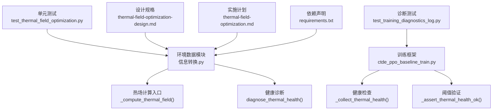
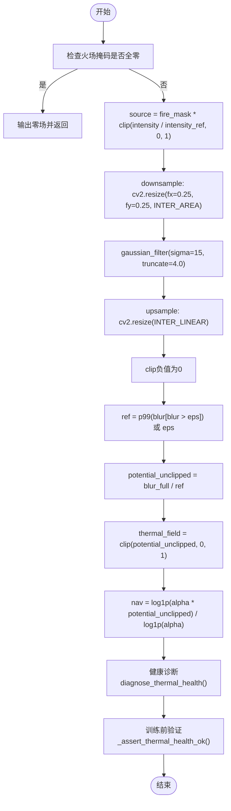
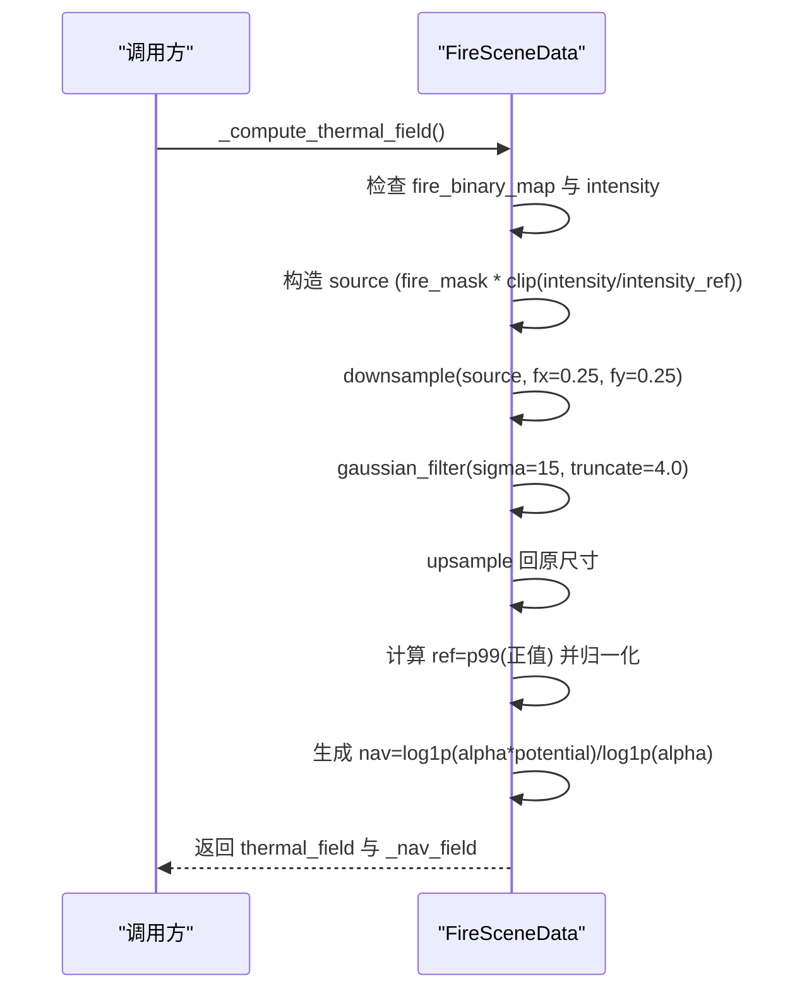
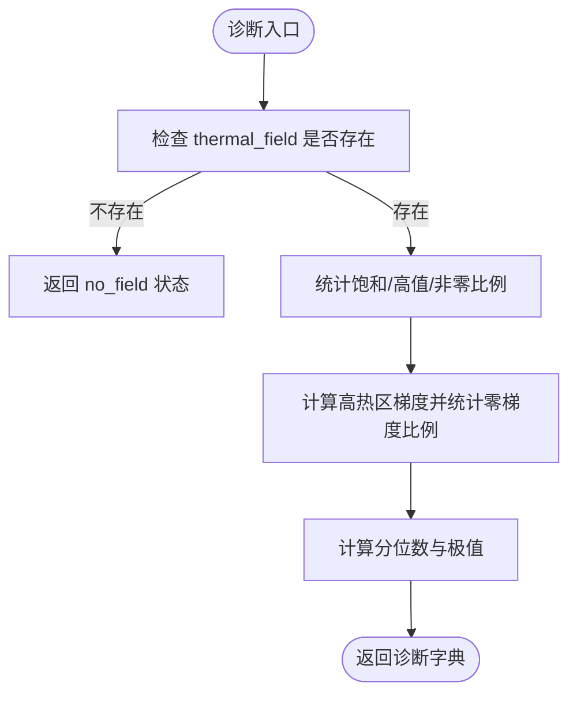
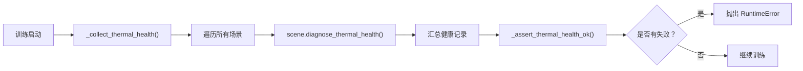
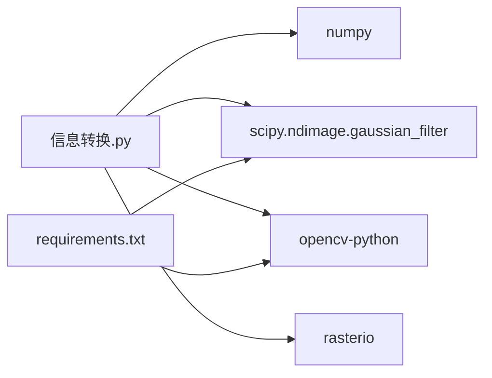

# 热场计算优化

<cite>
**本文引用的文件**
- [信息转换.py](file://environment_variables/environment_variables/信息转换.py)
- [test_thermal_field_optimization.py](file://environment_variables/environment_variables/test_thermal_field_optimization.py)
- [ctde_ppo_baseline_train.py](file://environment_variables/environment_variables/ctde_ppo_baseline_train.py)
- [test_training_diagnostics_log.py](file://environment_variables/environment_variables/test_training_diagnostics_log.py)
- [2026-07-06-thermal-field-optimization-design.md](file://docs/superpowers/specs/2026-07-06-thermal-field-optimization-design.md)
- [2026-07-06-thermal-field-optimization.md](file://docs/superpowers/plans/2026-07-06-thermal-field-optimization.md)
- [requirements.txt](file://environment_variables/requirements.txt)
</cite>

## 更新摘要
**变更内容**
- 新增综合热场健康诊断系统，支持多维度质量监控
- 集成训练前健康检查机制，确保热场语义层正常
- 添加饱和比率、高热区特性、非零覆盖率和梯度可用性等多维度指标
- 实现阈值配置和失败报告系统，自动检测问题场景

## 目录
1. [简介](#简介)
2. [项目结构](#项目结构)
3. [核心组件](#核心组件)
4. [架构总览](#架构总览)
5. [详细组件分析](#详细组件分析)
6. [健康诊断系统](#健康诊断系统)
7. [依赖关系分析](#依赖关系分析)
8. [性能与内存优化](#性能与内存优化)
9. [故障排查指南](#故障排查指南)
10. [结论](#结论)
11. [附录：可视化与调试工具使用](#附录可视化与调试工具使用)

## 简介
本技术文档围绕"热场计算优化算法"的实现与原理展开，重点解释以下要点：
- 基于四分之一分辨率的高斯模糊近似：downsample + gaussian blur + upsample 的三步处理流程。
- 热势能的数学建模：source = fire_mask * clip(intensity / intensity_ref, 0, 1)，blur = gaussian_filter(downsample(source), sigma=15)，potential = clip(blur / ref, 0, 1)。
- 导航场的对数变换：nav = log1p(alpha * potential) / log1p(alpha)。
- per-scene 鲁棒归一化策略与参考值计算（intensity_ref、ref）。
- **新增** 综合热场健康诊断系统，提供多维度质量监控和训练前验证。
- 性能优化的具体实现与内存管理技巧。
- 热场可视化和调试工具的使用方法。

该优化在不改变热场形状、取值范围与下游接口的前提下，显著降低计算成本并保持数值一致性，同时通过健康诊断系统确保热场语义层的可靠性。

## 项目结构
与热场计算相关的核心代码位于环境数据模块中，包含场景加载、栅格归一化、热场计算与健康诊断等能力；测试与规格文档提供了验收标准与回归验证方法。

**图表来源**
- [信息转换.py:759-819](file://environment_variables/environment_variables/信息转换.py#L759-L819)
- [信息转换.py:972-1012](file://environment_variables/environment_variables/信息转换.py#L972-L1012)
- [ctde_ppo_baseline_train.py:1224-1275](file://environment_variables/environment_variables/ctde_ppo_baseline_train.py#L1224-L1275)
- [test_thermal_field_optimization.py:25-66](file://environment_variables/environment_variables/test_thermal_field_optimization.py#L25-L66)
- [test_training_diagnostics_log.py:38-69](file://environment_variables/environment_variables/test_training_diagnostics_log.py#L38-L69)

**章节来源**
- [信息转换.py:1-14](file://environment_variables/environment_variables/信息转换.py#L1-L14)
- [信息转换.py:759-819](file://environment_variables/environment_variables/信息转换.py#L759-L819)
- [信息转换.py:972-1012](file://environment_variables/environment_variables/信息转换.py#L972-L1012)
- [ctde_ppo_baseline_train.py:40-44](file://environment_variables/environment_variables/ctde_ppo_baseline_train.py#L40-L44)
- [ctde_ppo_baseline_train.py:1224-1275](file://environment_variables/environment_variables/ctde_ppo_baseline_train.py#L1224-L1275)
- [test_thermal_field_optimization.py:1-70](file://environment_variables/environment_variables/test_thermal_field_optimization.py#L1-L70)
- [test_training_diagnostics_log.py:1-74](file://environment_variables/environment_variables/test_training_diagnostics_log.py#L1-L74)

## 核心组件
- **热场计算入口**：负责构建 source、下采样、高斯模糊、上采样、鲁棒归一化与导航场生成。
- **健康诊断系统**：统计饱和比例、高值比例、非零比例、高热区零梯度比例及分位数指标，用于训练前校验。
- **训练前验证**：自动收集所有场景的健康指标，验证是否超过预设阈值。
- **单元测试**：覆盖输出范围与形状、不同火场掩码产生不同结果、无饱和且存在梯度等关键属性。

**章节来源**
- [信息转换.py:759-819](file://environment_variables/environment_variables/信息转换.py#L759-L819)
- [信息转换.py:972-1012](file://environment_variables/environment_variables/信息转换.py#L972-L1012)
- [ctde_ppo_baseline_train.py:1224-1275](file://environment_variables/environment_variables/ctde_ppo_baseline_train.py#L1224-L1275)
- [test_thermal_field_optimization.py:25-66](file://environment_variables/environment_variables/test_thermal_field_optimization.py#L25-L66)

## 架构总览
下图展示了从输入到输出的完整数据流，包括每步的数学操作与关键参数，以及新增的健康诊断流程。

**图表来源**
- [信息转换.py:759-819](file://environment_variables/environment_variables/信息转换.py#L759-L819)
- [信息转换.py:972-1012](file://environment_variables/environment_variables/信息转换.py#L972-L1012)
- [ctde_ppo_baseline_train.py:1239-1247](file://environment_variables/environment_variables/ctde_ppo_baseline_train.py#L1239-L1247)

**章节来源**
- [信息转换.py:759-819](file://environment_variables/environment_variables/信息转换.py#L759-L819)
- [信息转换.py:972-1012](file://environment_variables/environment_variables/信息转换.py#L972-L1012)
- [ctde_ppo_baseline_train.py:1239-1247](file://environment_variables/environment_variables/ctde_ppo_baseline_train.py#L1239-L1247)

## 详细组件分析

### 热场计算流水线（_compute_thermal_field）
- **输入与前置条件**
  - 需要已初始化的火场二值掩码 fire_binary_map。
  - 需要从 data 字典获取 intensity 栅格。
- **步骤分解**
  - 构造 source：仅对火场区域按 intensity_ref 进行逐像素裁剪至 [0,1]。
  - 下采样：将 source 以 0.25 倍率缩小，采用面积插值以减少混叠。
  - 高斯模糊：在低分辨率图上执行 sigma=15、truncate=4.0 的滤波。
  - 上采样：线性插值恢复至原图尺寸，并将负值截断为 0。
  - 鲁棒归一化：取正值的 99 百分位作为 ref，得到 potential_unclipped，再裁剪到 [0,1] 得到 thermal_field。
  - 导航场：对 potential_unclipped 做对数压缩，alpha=20.0，便于梯度传播。
- **边界与异常**
  - 若 fire_binary_map 未初始化或 intensity 缺失，抛出运行时错误。
  - 若无火场区域，直接输出零场。

**图表来源**
- [信息转换.py:759-819](file://environment_variables/environment_variables/信息转换.py#L759-L819)

**章节来源**
- [信息转换.py:759-819](file://environment_variables/environment_variables/信息转换.py#L759-L819)

### 数学建模与参数说明
- **热势能建模**
  - source = fire_mask * clip(intensity / intensity_ref, 0, 1)
  - blur = gaussian_filter(downsample(source), sigma=15)
  - ref = p99(blur[blur > eps]) 或 eps
  - potential_unclipped = blur / ref
  - thermal_field = clip(potential_unclipped, 0, 1)
- **导航场对数变换**
  - alpha = 20.0
  - nav = log1p(alpha * potential_unclipped) / log1p(alpha)
- **参数选择依据**
  - 下采样因子 0.25 与 sigma=15 的组合等价于在原图上更大范围的平滑，兼顾精度与速度。
  - truncate=4.0 控制核大小，保证近似误差可控。
  - 99 百分位作为 ref 能抑制极端值影响，提升鲁棒性。
  - 对数变换使高值区梯度更稳定，利于优化。

**章节来源**
- [信息转换.py:759-819](file://environment_variables/environment_variables/信息转换.py#L759-L819)

### per-scene 鲁棒归一化与参考值计算
- intensity_ref 来自 norm_params["intensity_max"]，默认至少为 1.0，避免除零。
- ref 的计算：
  - 仅在 blur_full 的正值集合上计算 99 百分位，若无非正值则退化为 eps。
  - 最终 ref 不低于 eps，防止数值不稳定。
- 其他字段归一化
  - normalized_map 通过 _percentile_scale 计算各字段的缩放上限，确保输出在 [0,1]。

**章节来源**
- [信息转换.py:543-602](file://environment_variables/environment_variables/信息转换.py#L543-L602)
- [信息转换.py:616-637](file://environment_variables/environment_variables/信息转换.py#L616-L637)
- [信息转换.py:783-819](file://environment_variables/environment_variables/信息转换.py#L783-L819)

## 健康诊断系统

### 多维度质量监控指标
健康诊断系统提供全面的热场质量评估，包含以下关键指标：

- **饱和比率（sat_ratio）**：接近饱和（≥0.999）的比例，反映热场分布的集中程度
- **高值比例（high_ratio）**：高值（≥0.8）的比例，衡量高强度区域的覆盖范围
- **非零覆盖率（nonzero_ratio）**：非零（>0.001）的比例，表示有效热力区域的完整性
- **高热区零梯度比例（zero_grad_in_high_ratio）**：在高热区（≥0.5）内，导航场梯度接近零的比例，反映梯度可用性
- **潜在值分位数（potential_q50/q90/q99）**：热场值的分布特征统计
- **场极值（field_min/field_max）**：热场的最小最大值，验证数值范围

**图表来源**
- [信息转换.py:972-1012](file://environment_variables/environment_variables/信息转换.py#L972-L1012)

**章节来源**
- [信息转换.py:972-1012](file://environment_variables/environment_variables/信息转换.py#L972-L1012)

### 训练前健康检查机制
训练框架集成了完整的健康检查流程，确保所有场景的热场质量符合预期：

- **阈值配置**：定义各项指标的允许上限
  - sat_ratio ≤ 0.10（饱和比率不超过10%）
  - high_ratio ≤ 0.50（高值比例不超过50%）
  - zero_grad_in_high_ratio ≤ 0.20（高热区零梯度比例不超过20%）
- **自动收集**：遍历所有训练、验证、泛化和压力测试场景
- **失败报告**：详细记录每个场景的失败原因和具体指标值
- **严格验证**：任何场景超过阈值都会阻止训练启动

**图表来源**
- [ctde_ppo_baseline_train.py:1249-1275](file://environment_variables/environment_variables/ctde_ppo_baseline_train.py#L1249-L1275)
- [ctde_ppo_baseline_train.py:1239-1247](file://environment_variables/environment_variables/ctde_ppo_baseline_train.py#L1239-L1247)

**章节来源**
- [ctde_ppo_baseline_train.py:40-44](file://environment_variables/environment_variables/ctde_ppo_baseline_train.py#L40-L44)
- [ctde_ppo_baseline_train.py:1224-1275](file://environment_variables/environment_variables/ctde_ppo_baseline_train.py#L1224-L1275)

### 健康诊断API详解
`diagnose_thermal_health()` 方法提供标准化的热场质量评估接口：

- **输入**：无需参数，自动分析当前场景的热场状态
- **输出**：包含状态标志和多维度的质量指标字典
- **异常处理**：当热场未初始化时返回特殊状态标记
- **梯度计算**：使用边缘填充和差分法计算导航场梯度范数
- **数值稳定性**：对所有统计计算设置合理的默认值和边界保护

**章节来源**
- [信息转换.py:972-1012](file://environment_variables/environment_variables/信息转换.py#L972-L1012)

## 依赖关系分析
- **外部库**
  - numpy：数组运算与统计。
  - scipy.ndimage.gaussian_filter：高斯滤波。
  - opencv-python：高效 resize（下采样与上采样）。
  - rasterio：栅格读取。
- **依赖声明**
  - requirements.txt 明确声明了 scipy>=1.10.0 与 opencv-python>=4.8.0。

**图表来源**
- [信息转换.py:1-14](file://environment_variables/environment_variables/信息转换.py#L1-L14)
- [requirements.txt:1-13](file://environment_variables/requirements.txt#L1-L13)

**章节来源**
- [信息转换.py:1-14](file://environment_variables/environment_variables/信息转换.py#L1-L14)
- [requirements.txt:1-13](file://environment_variables/requirements.txt#L1-L13)

## 性能与内存优化
- **低分辨率近似**
  - 在 1/4 分辨率图上执行高斯模糊，显著减少计算量。
  - 使用 cv2.INTER_AREA 下采样与 cv2.INTER_LINEAR 上采样，平衡速度与质量。
- **核大小控制**
  - truncate=4.0 限制卷积核半径，避免过大核带来的开销。
- **内存布局**
  - 使用 np.ascontiguousarray 确保连续内存布局，提高后续算子效率。
- **数值稳定性**
  - 对负值进行截断，ref 设置下限 eps，避免除零与溢出。
- **基准与回归**
  - 设计规格要求冷启动热场计算至少 20x 加速，MAE ≤ 0.5，阈值不一致率 ≤ 0.2%。

**章节来源**
- [2026-07-06-thermal-field-optimization-design.md:1-29](file://docs/superpowers/specs/2026-07-06-thermal-field-optimization-design.md#L1-L29)
- [2026-07-06-thermal-field-optimization.md:41-142](file://docs/superpowers/plans/2026-07-06-thermal-field-optimization.md#L41-L142)
- [信息转换.py:759-819](file://environment_variables/environment_variables/信息转换.py#L759-L819)

## 故障排查指南
- **常见错误**
  - 缺少 intensity 数据：会抛出运行时错误，需检查数据加载路径与键名。
  - 火场掩码未初始化：同样抛出运行时错误，需在计算前正确设置 fire_binary_map。
- **诊断指标解读**
  - sat_ratio 过高：可能表示 ref 过小或强度分布过于集中，需调整 intensity_ref 或检查数据。
  - zero_grad_in_high_ratio 过高：表明导航场在高热区缺乏梯度，可检查 alpha 或 potential 分布。
  - nonzero_ratio 过低：可能表示火场掩码设置不当或强度阈值过高。
- **训练前验证失败**
  - 检查 THERMAL_HEALTH_LIMITS 配置是否合理
  - 查看 dataset_preflight.json 中的详细失败报告
  - 针对特定场景重新计算热场并单独诊断
- **回归验证**
  - 对比原始全分辨率实现，评估 MAE 与阈值不一致率，确保优化前后行为一致。

**章节来源**
- [信息转换.py:759-819](file://environment_variables/environment_variables/信息转换.py#L759-L819)
- [信息转换.py:972-1012](file://environment_variables/environment_variables/信息转换.py#L972-L1012)
- [ctde_ppo_baseline_train.py:1224-1247](file://environment_variables/environment_variables/ctde_ppo_baseline_train.py#L1224-L1247)
- [2026-07-06-thermal-field-optimization.md:99-142](file://docs/superpowers/plans/2026-07-06-thermal-field-optimization.md#L99-L142)

## 结论
通过四分之一分辨率的高斯模糊近似与鲁棒归一化，热场计算在保证数值一致性的前提下实现了显著的性能提升。导航场的对数变换进一步改善了梯度特性，配合新增的综合健康诊断系统可在训练前快速发现潜在问题。健康诊断系统提供的多维度质量监控确保了热场语义层的可靠性，整体方案满足设计与验收标准，具备工程落地价值。

## 附录：可视化与调试工具使用
- **健康诊断**
  - 调用 diagnose_thermal_health 获取统计指标，用于训练前的快速自检。
  - 检查返回字典中的 status 字段确认诊断状态。
- **训练前验证**
  - 运行训练脚本会自动执行健康检查，失败时会抛出详细错误信息。
  - 查看 outputs/*/logs/dataset_preflight.json 获取完整的健康记录。
- **单元测试**
  - 运行 test_thermal_field_optimization.py 验证输出范围、形状与梯度可用性。
  - 运行 test_training_diagnostics_log.py 验证健康检查逻辑的正确性。
- **回归与基准**
  - 按照实施计划中的步骤，对比原始实现与优化实现的误差与速度，确保达到目标。

**章节来源**
- [test_thermal_field_optimization.py:25-66](file://environment_variables/environment_variables/test_thermal_field_optimization.py#L25-L66)
- [test_training_diagnostics_log.py:38-69](file://environment_variables/environment_variables/test_training_diagnostics_log.py#L38-L69)
- [ctde_ppo_baseline_train.py:1299-1315](file://environment_variables/environment_variables/ctde_ppo_baseline_train.py#L1299-L1315)
- [2026-07-06-thermal-field-optimization.md:99-142](file://docs/superpowers/plans/2026-07-06-thermal-field-optimization.md#L99-L142)