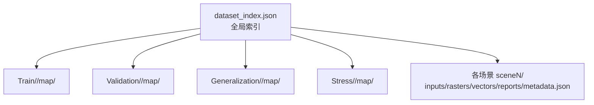
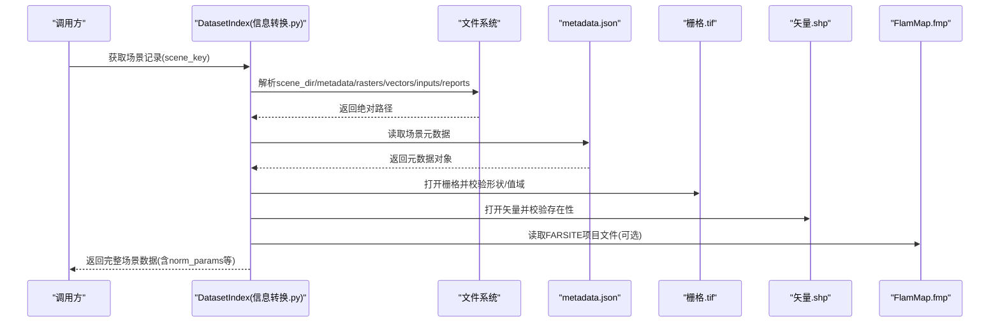
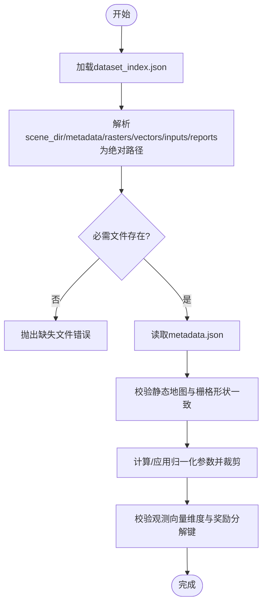
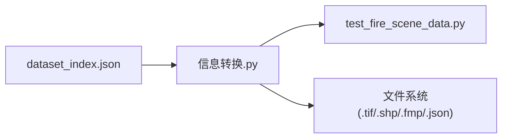

# 数据集管理

<cite>
**本文引用的文件**
- [dataset_index.json](file://environment_variables/environment_variables/dataset/dataset_index.json)
- [metadata.json（训练集示例）](file://map/Train/1/scene1/metadata.json)
- [metadata.json（验证集示例）](file://map/Validation/5/scene1/metadata.json)
- [metadata.json（泛化测试集示例）](file://map/Generalization/6/scene1/metadata.json)
- [metadata.json（压力测试集示例）](file://map/Stress/8/scene1/metadata.json)
- [FlamMap4.fmp（FARSITE项目文件示例）](file://map/Train/4/map4/FlamMap4.fmp)
- [信息转换.py（索引与路径解析、预检）](file://environment_variables/environment_variables/信息转换.py)
- [test_fire_scene_data.py（数据加载与校验用例）](file://environment_variables/environment_variables/test_fire_scene_data.py)
</cite>

## 目录
1. [引言](#引言)
2. [项目结构](#项目结构)
3. [核心组件](#核心组件)
4. [架构总览](#架构总览)
5. [详细组件分析](#详细组件分析)
6. [依赖关系分析](#依赖关系分析)
7. [性能考虑](#性能考虑)
8. [故障排查指南](#故障排查指南)
9. [结论](#结论)
10. [附录](#附录)

## 引言
本文件面向“数据集管理系统”的数据模型，聚焦以下目标：
- 说明 dataset_index.json 的结构设计与元数据管理机制
- 解释训练集、验证集、泛化测试集、压力测试集的组织方式
- 描述每个场景的 metadata.json 配置项与数据组织规范
- 明确地图文件（.fmp、.tif）及相关输入输出文件的格式要求
- 提供添加新场景的完整流程与最佳实践
- 给出数据质量检查、版本管理与数据迁移策略
- 讨论数据集的扩展性与兼容性考量

## 项目结构
仓库采用“按场景分片 + 集中索引”的组织方式：
- 根目录 map 下以四大分区存放场景：Train、Validation、Generalization、Stress
- 每个分区包含若干区域（如 1、2、…），每个区域包含多个场景（scene1、scene2、…）
- 每个场景目录内包含 inputs、rasters、vectors、reports 以及 metadata.json
- 静态地图与 FARSITE 项目文件位于对应区域的 mapN 子目录
- 全局索引文件 dataset_index.json 维护所有场景的路径、字段约束与栅格映射

图表来源
- [dataset_index.json:1-33](file://environment_variables/environment_variables/dataset/dataset_index.json#L1-L33)
- [信息转换.py:101-134](file://environment_variables/environment_variables/信息转换.py#L101-L134)

章节来源
- [dataset_index.json:1-33](file://environment_variables/environment_variables/dataset/dataset_index.json#L1-L33)
- [信息转换.py:101-134](file://environment_variables/environment_variables/信息转换.py#L101-L134)

## 核心组件
- 全局索引（dataset_index.json）
  - 定义 schema 版本、路径基准、必需字段、必需栅格键名
  - 维护 splits 列表（train/validation/generalization/stress）
  - 维护 raster_files 标准键到相对路径的映射
  - scenes 字典中为每个场景记录绝对/相对路径、风场、火情统计等
- 场景元数据（metadata.json）
  - 描述分辨率、网格尺寸、难度、风场、燃料湿度、点火、FARSITE 运行参数、火情统计、UAV 参数、栅格/矢量/输入/报告路径、派生计算与备注
- 数据读取与校验（信息转换.py、test_fire_scene_data.py）
  - 将索引中的相对路径解析为绝对路径
  - 预检缺失文件并抛出异常
  - 校验栅格形状一致性、归一化参数覆盖范围、观测向量维度等

章节来源
- [dataset_index.json:1-33](file://environment_variables/environment_variables/dataset/dataset_index.json#L1-L33)
- [metadata.json（训练集示例）:1-171](file://map/Train/1/scene1/metadata.json#L1-L171)
- [信息转换.py:101-134](file://environment_variables/environment_variables/信息转换.py#L101-L134)
- [test_fire_scene_data.py:28-110](file://environment_variables/environment_variables/test_fire_scene_data.py#L28-L110)

## 架构总览
下图展示从索引到场景数据的加载与校验流程。

图表来源
- [信息转换.py:101-134](file://environment_variables/environment_variables/信息转换.py#L101-L134)
- [test_fire_scene_data.py:28-110](file://environment_variables/environment_variables/test_fire_scene_data.py#L28-L110)

## 详细组件分析

### dataset_index.json 结构与元数据管理
- 顶层字段
  - version：索引版本
  - description：说明
  - source_root：数据根目录（Windows 路径）
  - schema：版本、路径基准、必需字段、必需栅格键
  - splits：四个划分的场景键列表
  - raster_files：标准栅格键到相对路径的映射
  - scenes：每个场景的详细记录
- schema.path_base
  - 规定 scene_dir、static_map 相对于 source_root；metadata、rasters、vectors、inputs、reports 相对于 scene_dir
- required_scene_fields
  - 强制字段：scene_key、split、scene_dir、static_map、metadata、rasters
- required_rasters
  - 强制栅格键：intensity、time、length、speedRate、spread_direction、heat_per_unit_area、crown_fire
- splits
  - train/validation/generalization/stress 四组场景键集合
- raster_files
  - 统一命名约定，便于跨场景一致访问
- scenes
  - 每个场景包含：
    - 基本标识：scene_key、split、area_id、scenario_id、difficulty
    - 空间信息：width_metadata、height_metadata
    - 风场：wind.source、wind_direction_deg、wind_speed_mph、wind_speed_mps_approx
    - 火情统计：target_*、actual_*、fires、enclaves、final_elapsed_time、final_current_time、status 等
    - 路径：metadata、static_map、rasters、vectors、inputs、reports

章节来源
- [dataset_index.json:1-33](file://environment_variables/environment_variables/dataset/dataset_index.json#L1-L33)
- [dataset_index.json:34-89](file://environment_variables/environment_variables/dataset/dataset_index.json#L34-L89)
- [dataset_index.json:90-98](file://environment_variables/environment_variables/dataset/dataset_index.json#L90-L98)
- [dataset_index.json:99-165](file://environment_variables/environment_variables/dataset/dataset_index.json#L99-L165)

### 场景划分与组织结构
- 训练集（Train）
  - 多区域（1~4），每区域 6 个场景（scene1~scene6）
  - 用于模型训练与超参搜索
- 验证集（Validation）
  - 区域 5，6 个场景
  - 用于早停与选择最优模型
- 泛化测试集（Generalization）
  - 区域 6、7，每区域 6 个场景
  - 评估对新地形/条件的泛化能力
- 压力测试集（Stress）
  - 区域 8，4 个场景
  - 强风、高燃烧强度等极端条件，检验稳定性与鲁棒性

章节来源
- [dataset_index.json:34-89](file://environment_variables/environment_variables/dataset/dataset_index.json#L34-L89)

### metadata.json 配置项与数据组织规范
- 通用字段
  - map_id、split、area_id、scenario_id、resolution_m、width、height、scenario_type、difficulty
- 环境与环境变量
  - wind：source、方向、风速（mph 与 m/s 近似）
  - fuel_moisture：class、不同时间尺度含水率、草本/活木含水率、foliar
- 点火与边界
  - ignition：count、文件、中心坐标、尺寸、实际面积/单元格数、目标范围、状态
- FARSITE 运行参数
  - run_name、weather_stream、fuel_moisture_file、ignition_file、perimeter_resolution_m、distance_resolution_m、time_step_min、use_acceleration、spotting_enabled、foliar_moisture_content、crown_fire_calculation、burn_start/end、selected_final_time 等
- 火情统计与目标区间
  - fire_statistics：目标与实际对比、最终时间步面积、状态
  - target_range_check：初始/活跃火单元格、面积比的目标与实际及状态
  - rejected_timesteps：被拒绝的时间步原因
- UAV 参数
  - uav_count、start_mode、starts_wgs84、sensor_radius_m、communication_radius_m、max_steps
- 数据路径
  - rasters、vectors、inputs、reports 的相对路径
- 派生计算
  - derived_calculation：cell_area_m2、cell_area_acres_approx、total_map_cells、公式
- 备注
  - notes：人工可读说明

章节来源
- [metadata.json（训练集示例）:1-171](file://map/Train/1/scene1/metadata.json#L1-L171)
- [metadata.json（验证集示例）:1-171](file://map/Validation/5/scene1/metadata.json#L1-L171)
- [metadata.json（泛化测试集示例）:1-174](file://map/Generalization/6/scene1/metadata.json#L1-L174)
- [metadata.json（压力测试集示例）:1-244](file://map/Stress/8/scene1/metadata.json#L1-L244)

### 地图文件与输入输出格式要求
- 静态地图栅格（.tif）
  - 与场景栅格一致的分辨率与网格尺寸
  - 需配套 .tfw 或 .aux.xml 等地理配准信息
- FARSITE 项目文件（.fmp）
  - 文本型项目配置，包含景观栅格路径、分类表、时间步、天气流、点火矢量等
  - 同一 .fmp 可包含多个场景条目（见示例文件）
- 栅格输出（rasters/*.tif）
  - 统一命名：arrival_time.tif、flame_length_farsite.tif、ros_farsite.tif、fireline_intensity_farsite.tif、spread_direction_farsite.tif、heat_per_unit_area_farsite.tif、crown_fire_activity_farsite.tif
  - 与 dataset_index.json 的 raster_files 键保持一致
- 矢量输入/输出（vectors/*.shp）
  - ignition.shp、fire_perimeter.shp 等，需附带 .prj 投影信息
- 输入文件（inputs/*）
  - fuel_moisture_*.fms：燃料湿度表
  - weather_stream.wxs：气象时间序列
- 报告（reports/*）
  - Run_log.txt、fire_growth_report.csv

章节来源
- [FlamMap4.fmp:1-800](file://map/Train/4/map4/FlamMap4.fmp#L1-L800)
- [dataset_index.json:90-98](file://environment_variables/environment_variables/dataset/dataset_index.json#L90-L98)

### 数据加载与校验流程
- 路径解析
  - 基于 source_root 与 scene_dir 将相对路径解析为绝对路径
- 预检
  - 检查 metadata.json 是否存在
  - 检查所有必需栅格/矢量/输入/报告文件是否齐全
- 形状与值域校验
  - 静态地图与动态栅格形状必须一致
  - 归一化参数覆盖关键栅格，并对观测进行裁剪至 [0,1]
- 观测与奖励摘要
  - 固定维度的局部观测与全局状态
  - 奖励分解键完备

图表来源
- [信息转换.py:101-134](file://environment_variables/environment_variables/信息转换.py#L101-L134)
- [test_fire_scene_data.py:28-110](file://environment_variables/environment_variables/test_fire_scene_data.py#L28-L110)

章节来源
- [信息转换.py:101-134](file://environment_variables/environment_variables/信息转换.py#L101-L134)
- [test_fire_scene_data.py:28-110](file://environment_variables/environment_variables/test_fire_scene_data.py#L28-L110)

## 依赖关系分析
- 模块耦合
  - 信息转换.py 依赖 dataset_index.json 的 schema 与 scenes 结构
  - test_fire_scene_data.py 依赖信息转换.py 提供的 DatasetIndex/FireSceneData 接口
- 外部依赖
  - 栅格读写（GeoTIFF）、矢量读写（Shapefile）、FARSITE 项目文件解析
- 潜在循环依赖
  - 当前未见循环导入；索引与场景数据通过路径解耦

图表来源
- [信息转换.py:101-134](file://environment_variables/environment_variables/信息转换.py#L101-L134)
- [test_fire_scene_data.py:28-110](file://environment_variables/environment_variables/test_fire_scene_data.py#L28-L110)

章节来源
- [信息转换.py:101-134](file://environment_variables/environment_variables/信息转换.py#L101-L134)
- [test_fire_scene_data.py:28-110](file://environment_variables/environment_variables/test_fire_scene_data.py#L28-L110)

## 性能考虑
- 栅格 I/O
  - 使用块读/金字塔缓存可减少内存占用与启动时间
- 归一化与裁剪
  - 在加载阶段一次性计算 norm_params 并缓存，避免重复计算
- 并行加载
  - 对独立场景可并行读取栅格与矢量，注意磁盘并发限制
- 路径解析
  - 批量解析时优先使用 Path.resolve() 与缓存结果

[本节为通用建议，不直接分析具体文件]

## 故障排查指南
- 常见错误
  - 缺少 metadata.json：在预检阶段会抛出 FileNotFoundError
  - 栅格形状不一致：当 static_map 与 intensity 等栅格尺寸不匹配时抛出运行时错误
  - 路径解析失败：相对路径未正确拼接导致找不到文件
- 定位方法
  - 查看预检日志输出的缺失文件清单
  - 核对 dataset_index.json 中 scene_dir 与 raster_files 的相对路径
  - 确认 .tif/.shp 的地理配准与投影文件存在
- 修复步骤
  - 修正路径大小写与分隔符
  - 重新生成栅格并确保与静态地图同分辨率与尺寸
  - 更新 metadata.json 与 dataset_index.json 保持一致

章节来源
- [信息转换.py:101-134](file://environment_variables/environment_variables/信息转换.py#L101-L134)
- [test_fire_scene_data.py:244-258](file://environment_variables/environment_variables/test_fire_scene_data.py#L244-L258)

## 结论
该数据集管理系统通过集中索引与标准化场景目录，实现了跨训练/验证/泛化/压力四类场景的统一管理与高质量校验。schema 与路径基准则确保了可扩展性与向后兼容，配合完善的预检与单元测试，可有效保障数据一致性与可用性。

[本节为总结性内容，不直接分析具体文件]

## 附录

### 添加新场景的完整流程与最佳实践
- 准备数据
  - 生成静态地图栅格（.tif）与地理配准文件（.tfw/.aux.xml）
  - 准备 FARSITE 项目文件（.fmp），确保包含所需场景条目
  - 生成场景栅格（rasters/*.tif）、矢量（vectors/*.shp）、输入（inputs/*.fms/*.wxs）、报告（reports/*）
- 创建场景目录
  - 在对应分区（Train/Validation/Generalization/Stress）下新建 areaX/sceneY
  - 放置 metadata.json，填写必填字段与路径
- 更新索引
  - 在 dataset_index.json 的 scenes 中添加新场景记录
  - 若新增栅格类型，同步更新 schema.required_rasters 与 raster_files
  - 将新场景键加入对应 splits 列表
- 校验与测试
  - 运行预检脚本，确保所有必需文件存在
  - 运行单元测试，验证形状、归一化、观测维度等
- 最佳实践
  - 保持栅格命名与 dataset_index.json 的 raster_files 一致
  - 使用相对路径，避免硬编码绝对路径
  - 在 metadata.json 的 notes 中记录关键假设与数据来源
  - 对压力场景设置更严格的 stress_target 与 validation 分支

章节来源
- [dataset_index.json:1-33](file://environment_variables/environment_variables/dataset/dataset_index.json#L1-L33)
- [dataset_index.json:34-89](file://environment_variables/environment_variables/dataset/dataset_index.json#L34-L89)
- [dataset_index.json:90-98](file://environment_variables/environment_variables/dataset/dataset_index.json#L90-L98)
- [metadata.json（训练集示例）:1-171](file://map/Train/1/scene1/metadata.json#L1-L171)
- [metadata.json（压力测试集示例）:1-244](file://map/Stress/8/scene1/metadata.json#L1-L244)
- [信息转换.py:101-134](file://environment_variables/environment_variables/信息转换.py#L101-L134)
- [test_fire_scene_data.py:28-110](file://environment_variables/environment_variables/test_fire_scene_data.py#L28-L110)

### 数据质量检查清单
- 路径完整性
  - metadata.json、rasters、vectors、inputs、reports 全部存在
- 几何一致性
  - static_map 与所有栅格具有相同宽高与分辨率
- 数值合理性
  - 栅格值非负且有限，归一化后落在 [0,1]
- 元数据一致性
  - dataset_index.json 与 metadata.json 的 split、area_id、scenario_id 一致
- 报告与日志
  - Run_log.txt 与 fire_growth_report.csv 存在且非空

章节来源
- [test_fire_scene_data.py:28-110](file://environment_variables/environment_variables/test_fire_scene_data.py#L28-L110)

### 版本管理与数据迁移策略
- 版本控制
  - dataset_index.json.version 递增表示索引结构变更
  - metadata.json 保留 notes 字段记录变更原因
- 迁移步骤
  - 若 schema 变更，先实现兼容读取逻辑，再逐步淘汰旧字段
  - 批量脚本遍历 scenes，补齐缺失字段或重命名键
  - 迁移后执行全量预检与单元测试
- 回滚策略
  - 保留上一版索引与元数据快照，必要时快速回退

[本节为通用建议，不直接分析具体文件]

### 扩展性与兼容性考虑
- 扩展点
  - 新增栅格类型：在 schema.required_rasters 与 raster_files 中登记
  - 新增场景属性：在 metadata.json 与 dataset_index.json.scenes 中扩展
- 兼容性
  - 保持 path_base 规则不变，仅扩展字段
  - 对历史数据提供默认值与降级处理
  - 严格区分相对路径与绝对路径，避免平台差异

[本节为通用建议，不直接分析具体文件]