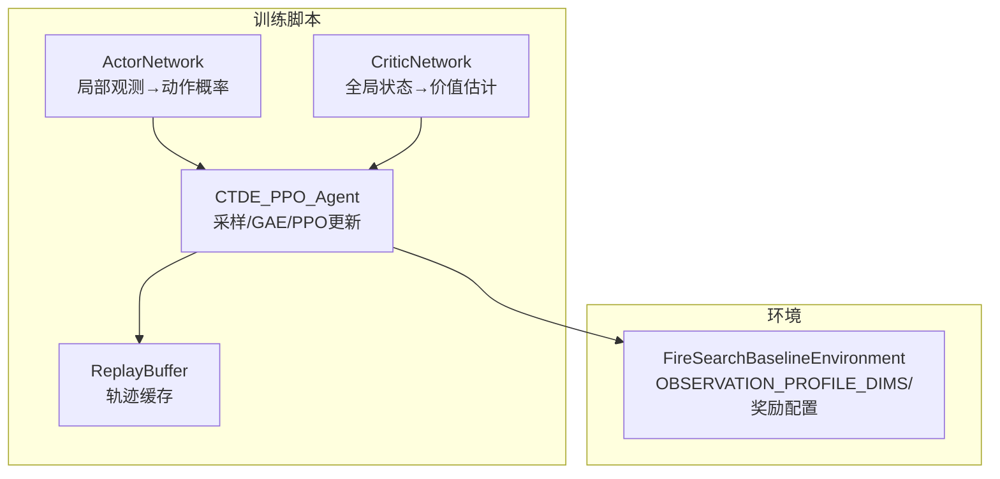
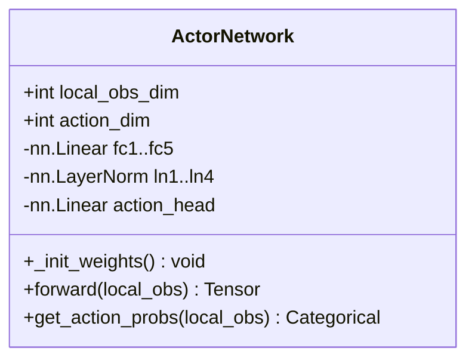
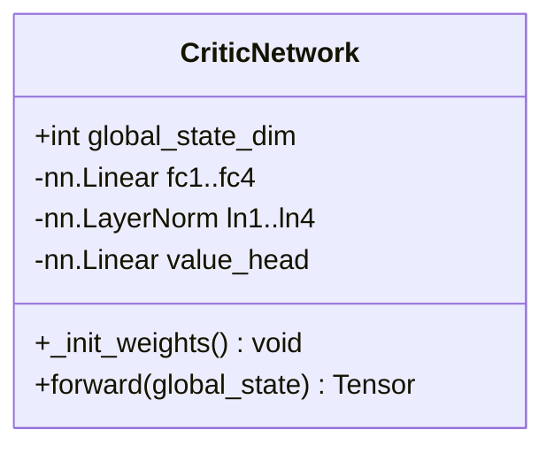
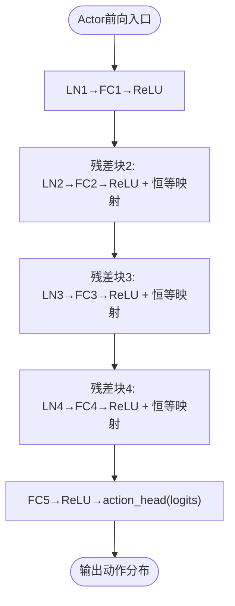
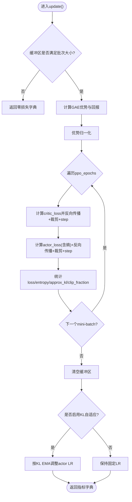
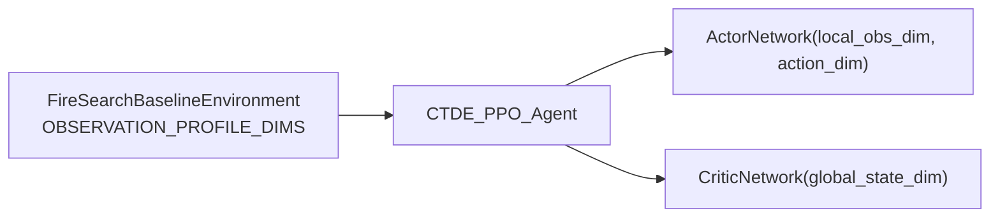

# Actor-Critic神经网络架构

<cite>
**本文引用的文件**   
- [ctde_ppo_baseline_train.py](file://environment_variables/environment_variables/ctde_ppo_baseline_train.py)
- [rl_environment_baseline.py](file://environment_variables/environment_variables/rl_environment_baseline.py)
</cite>

## 目录
1. [引言](#引言)
2. [项目结构](#项目结构)
3. [核心组件](#核心组件)
4. [架构总览](#架构总览)
5. [详细组件分析](#详细组件分析)
6. [依赖关系分析](#依赖关系分析)
7. [性能与稳定性考量](#性能与稳定性考量)
8. [故障排查指南](#故障排查指南)
9. [结论](#结论)
10. [附录：超参数调优与实践建议](#附录超参数调优与实践建议)

## 引言
本技术文档围绕Actor-Critic神经网络架构，系统阐述ActorNetwork与CriticNetwork的网络结构设计、初始化策略、前向传播机制、梯度流与优化策略，并提供面向实践的超参数调优指南。该实现采用CTDE-PPO（Centralized Training with Decentralized Execution Proximal Policy Optimization）范式：Actor基于局部观测输出动作概率分布，Critic基于全局状态估计价值函数，二者通过PPO目标联合优化。

## 项目结构
本项目将环境定义与训练脚本分离：
- 环境接口与观测/状态维度定义位于环境模块中，提供多无人机火场边界搜索任务的标准Gymnasium接口。
- 训练脚本包含Actor/Critic网络定义、回放缓冲、课程学习管理器以及CTDE-PPO智能体与训练循环。



图表来源
- [ctde_ppo_baseline_train.py:460-535](file://environment_variables/environment_variables/ctde_ppo_baseline_train.py#L460-L535)
- [rl_environment_baseline.py:21-131](file://environment_variables/environment_variables/rl_environment_baseline.py#L21-L131)

章节来源
- [ctde_ppo_baseline_train.py:460-535](file://environment_variables/environment_variables/ctde_ppo_baseline_train.py#L460-L535)
- [rl_environment_baseline.py:21-131](file://environment_variables/environment_variables/rl_environment_baseline.py#L21-L131)

## 核心组件
- ActorNetwork：多层感知机+残差连接+LayerNorm，输入为局部观测，输出为离散动作的logits，用于构建Categorical分布并采样动作。
- CriticNetwork：多层感知机+LayerNorm（无显式残差），输入为全局状态，输出标量价值V(s)。
- CTDE_PPO_Agent：封装Actor/Critic实例、Adam优化器、GAE优势估计、PPO裁剪目标、KL自适应学习率等。
- ReplayBuffer：按时间步缓存本地观测、全局状态、动作、旧对数概率、团队奖励与终止信号。

章节来源
- [ctde_ppo_baseline_train.py:460-535](file://environment_variables/environment_variables/ctde_ppo_baseline_train.py#L460-L535)
- [ctde_ppo_baseline_train.py:537-567](file://environment_variables/environment_variables/ctde_ppo_baseline_train.py#L537-L567)
- [ctde_ppo_baseline_train.py:759-991](file://environment_variables/environment_variables/ctde_ppo_baseline_train.py#L759-L991)

## 架构总览
下图展示Actor与Critic在CTDE-PPO中的交互与数据流向。

```mermaid
sequenceDiagram
participant Env as "环境"
participant Agent as "CTDE_PPO_Agent"
participant Actor as "ActorNetwork"
participant Critic as "CriticNetwork"
participant Buffer as "ReplayBuffer"
Env->>Agent : 返回(local_obs, global_state)
Agent->>Actor : get_action_probs(local_obs)
Actor-->>Agent : 动作分布(离散Categorical)
Agent->>Agent : 采样动作a, 记录log_prob
Agent->>Env : 执行动作a
Env-->>Agent : 返回rewards(团队), done
Agent->>Buffer : store(local_obs, global_state, a, log_prob, rewards, done)
Note over Agent,Buffer : 收集足够样本后触发update()
Agent->>Critic : 计算V(global_state)
Agent->>Agent : GAE计算advantages/returns
Agent->>Critic : 最小化MSE(V, returns)
Agent->>Actor : PPO裁剪目标 + 熵正则
Agent->>Agent : KL监控与可选LR自适应
```

图表来源
- [ctde_ppo_baseline_train.py:849-991](file://environment_variables/environment_variables/ctde_ppo_baseline_train.py#L849-L991)
- [ctde_ppo_baseline_train.py:460-535](file://environment_variables/environment_variables/ctde_ppo_baseline_train.py#L460-L535)

## 详细组件分析

### ActorNetwork：局部观测到动作概率映射
- 输入：local_obs_dim（由环境observation profile决定，默认baseline为17）。
- 隐藏层：4个全连接层，每层后接LayerNorm与ReLU；第2~4层使用残差连接（x = F.relu(LN(fc(x))) + x）。
- 瓶颈层：fc5将维度降至128，再经ReLU。
- 输出头：action_head线性映射到action_dim（离散动作空间大小，默认5）。
- 初始化：所有Linear权重正交初始化（gain=√2），偏置初始化为0；action_head权重正交初始化（gain=0.01），以抑制初期探索强度。
- 前向流程：特征提取→残差堆叠→非线性压缩→动作logits。
- 概率建模：get_action_probs将logits包装为Categorical分布，支持采样与log_prob计算。



图表来源
- [ctde_ppo_baseline_train.py:460-502](file://environment_variables/environment_variables/ctde_ppo_baseline_train.py#L460-L502)

章节来源
- [ctde_ppo_baseline_train.py:460-502](file://environment_variables/environment_variables/ctde_ppo_baseline_train.py#L460-L502)
- [rl_environment_baseline.py:24-29](file://environment_variables/environment_variables/rl_environment_baseline.py#L24-L29)

### CriticNetwork：全局状态到价值估计
- 输入：global_state_dim（默认baseline为19）。
- 隐藏层：4个全连接层，逐层降维（hidden_dim → hidden_dim → hidden_dim//2 → 160），每层后接LayerNorm与ReLU。
- 输出头：value_head线性映射到标量V(s)。
- 初始化：所有Linear权重正交初始化（gain=√2），偏置初始化为0；value_head权重正交初始化（gain=1.0）。
- 前向流程：特征提取→非线性变换→价值回归。



图表来源
- [ctde_ppo_baseline_train.py:504-535](file://environment_variables/environment_variables/ctde_ppo_baseline_train.py#L504-L535)

章节来源
- [ctde_ppo_baseline_train.py:504-535](file://environment_variables/environment_variables/ctde_ppo_baseline_train.py#L504-L535)
- [rl_environment_baseline.py:24-29](file://environment_variables/environment_variables/rl_environment_baseline.py#L24-L29)

### 前向传播与决策生成内部机制
- Actor前向：
  - 第一层：LN→FC→ReLU，作为基础特征提取。
  - 后续三层：LN→FC→ReLU，并与上一层输出相加形成残差，有助于缓解深层网络退化、稳定梯度。
  - 最后两层：FC→ReLU→action_head，得到各动作logits。
- Critic前向：
  - 多层LN→FC→ReLU逐步压缩表征，最终线性映射到价值。
- 决策生成：
  - Actor.get_action_probs将logits转为Categorical分布，采样动作并记录log_prob供PPO比率计算。



图表来源
- [ctde_ppo_baseline_train.py:482-501](file://environment_variables/environment_variables/ctde_ppo_baseline_train.py#L482-L501)

章节来源
- [ctde_ppo_baseline_train.py:482-501](file://environment_variables/environment_variables/ctde_ppo_baseline_train.py#L482-L501)

### 网络初始化策略与原理
- 正交初始化：对所有Linear层的权重使用正交初始化（gain=√2），有利于保持激活方差稳定，加速收敛。
- 偏置初始化：全部偏置初始化为0，避免引入不必要的先验偏移。
- 输出头差异化：
  - Actor.action_head gain=0.01，使初始策略更保守，降低早期大动作变化带来的不稳定。
  - Critic.value_head gain=1.0，利于价值估计从零附近开始合理拟合。

章节来源
- [ctde_ppo_baseline_train.py:474-481](file://environment_variables/environment_variables/ctde_ppo_baseline_train.py#L474-L481)
- [ctde_ppo_baseline_train.py:517-523](file://environment_variables/environment_variables/ctde_ppo_baseline_train.py#L517-L523)

### 梯度流与优化策略
- 优化器：Actor与Critic分别使用Adam（eps=1e-5），可配置不同学习率。
- 梯度裁剪：每次更新前后均对各自参数进行最大范数裁剪（max_grad_norm），防止梯度爆炸。
- PPO目标：
  - 优势归一化：advantages减去均值并除以标准差（加小常数防除零）。
  - 裁剪比率：ratio = exp(new_logp - old_logp)，目标取min(ratio*adv, clip(ratio)*adv)的负均值。
  - 熵正则：actor_loss包含熵项系数entropy_coef，鼓励探索。
  - 价值损失：critic_loss为预测值与returns的MSE，系数value_coef控制重要性。
- GAE优势估计：从末步回溯，结合gamma与gae_lambda累积优势与回报。
- KL自适应学习率（可选）：根据近似KL与目标KL的偏差指数调整actor学习率，限制策略更新幅度。



图表来源
- [ctde_ppo_baseline_train.py:889-991](file://environment_variables/environment_variables/ctde_ppo_baseline_train.py#L889-L991)

章节来源
- [ctde_ppo_baseline_train.py:889-991](file://environment_variables/environment_variables/ctde_ppo_baseline_train.py#L889-L991)

## 依赖关系分析
- 环境维度契约：
  - OBSERVATION_PROFILE_DIMS定义了不同profile下的local_obs_dim与global_state_dim，Actor与Critic据此构造输入层。
  - 默认baseline：local_obs_dim=17，global_state_dim=19。
- 动作空间：离散动作空间大小为5，对应Actor输出维度。
- 训练配置：
  - actor_lr/critic_lr、kl_adapt_mode/target_kl/kl_ema_beta/kl_lr_alpha、gamma/gae_lambda、clip_epsilon、entropy_coef/value_coef、max_grad_norm、ppo_epochs/batch_size等均在CTDE_PPO_Agent中生效。



图表来源
- [rl_environment_baseline.py:24-29](file://environment_variables/environment_variables/rl_environment_baseline.py#L24-L29)
- [ctde_ppo_baseline_train.py:759-814](file://environment_variables/environment_variables/ctde_ppo_baseline_train.py#L759-L814)

章节来源
- [rl_environment_baseline.py:24-29](file://environment_variables/environment_variables/rl_environment_baseline.py#L24-L29)
- [ctde_ppo_baseline_train.py:759-814](file://environment_variables/environment_variables/ctde_ppo_baseline_train.py#L759-L814)

## 性能与稳定性考量
- LayerNorm位置：Actor在前馈层之前应用LN，有助于稳定深层网络的激活分布；Critic同样在每个线性层前应用LN。
- 残差连接：Actor在第2~4层使用残差，提升深层表达能力与梯度流通性。
- 正交初始化：保证初始阶段数值稳定，配合较小的action_head增益，避免过早剧烈策略更新。
- 梯度裁剪：统一约束Actor/Critic的梯度范数，增强鲁棒性。
- 优势归一化：减少优势尺度波动，提高PPO更新稳定性。
- KL自适应：当策略偏离过大时自动降低actor学习率，维持近端假设有效性。

[本节为通用指导，不直接分析具体代码行]

## 故障排查指南
- 训练不收敛或发散：
  - 检查max_grad_norm是否过小导致欠更新，或过大导致不稳定。
  - 确认actor_lr/critic_lr是否在合理范围；必要时开启KL自适应模式。
  - 验证batch_size与mini_batch_size设置是否匹配硬件内存。
- 策略崩溃（动作单一）：
  - 适当增大entropy_coef，或减小clip_epsilon以允许更大探索。
  - 检查action_head初始增益是否过小导致长期保守。
- 价值估计不稳定：
  - 调整value_coef，确保价值损失不过度主导。
  - 检查returns计算是否正确（gamma、gae_lambda、done处理）。
- 维度不匹配错误：
  - 核对OBSERVATION_PROFILE_DIMS与实际传入的local_obs_dim/global_state_dim一致。
  - 确认num_agents与batch重塑逻辑一致。

章节来源
- [ctde_ppo_baseline_train.py:889-991](file://environment_variables/environment_variables/ctde_ppo_baseline_train.py#L889-L991)
- [rl_environment_baseline.py:24-29](file://environment_variables/environment_variables/rl_environment_baseline.py#L24-L29)

## 结论
该Actor-Critic架构在CTDE-PPO框架下，通过残差连接与LayerNorm提升深层表示能力，借助正交初始化与输出头差异化设计保障训练稳定性，并以PPO裁剪目标与KL自适应学习率控制策略更新幅度。整体设计兼顾表达力与稳定性，适合复杂多智能体火场搜索任务的离线训练与在线部署。

[本节为总结性内容，不直接分析具体代码行]

## 附录：超参数调优与实践建议
- 网络规模
  - Actor隐藏单元：默认256，可根据任务复杂度提升至384或更高；若过拟合可降低至128。
  - Critic隐藏单元：默认384，可按需调整为256或512；注意与全局状态维度匹配。
  - 层数：Actor使用4个残差块+1个瓶颈层；Critic使用4层逐步降维。
- 学习率与优化
  - actor_lr：默认2e-4；若KL频繁超过target_kl，优先尝试KL自适应模式。
  - critic_lr：默认5e-4；价值损失占比过高时可下调value_coef或降低critic_lr。
  - max_grad_norm：默认0.5；若出现NaN或震荡，适当降低。
- PPO关键参数
  - gamma：默认0.99；长视距任务可略增。
  - gae_lambda：默认0.95；高方差场景可略降。
  - clip_epsilon：默认0.2；过小会限制探索，过大破坏近端假设。
  - entropy_coef：默认0.01；探索不足时适度增加。
  - ppo_epochs：默认4；过大易过拟合当前批次，可降至2~3。
  - batch_size/mini_batch_size：默认4096/512；受显存限制调整。
- 初始化与正则
  - 保持正交初始化与偏置为零；如需更强探索，可微调action_head增益。
  - LayerNorm始终置于线性层之前，避免激活饱和。

章节来源
- [ctde_ppo_baseline_train.py:98-158](file://environment_variables/environment_variables/ctde_ppo_baseline_train.py#L98-L158)
- [ctde_ppo_baseline_train.py:759-814](file://environment_variables/environment_variables/ctde_ppo_baseline_train.py#L759-L814)
- [ctde_ppo_baseline_train.py:889-991](file://environment_variables/environment_variables/ctde_ppo_baseline_train.py#L889-L991)
- [rl_environment_baseline.py:24-29](file://environment_variables/environment_variables/rl_environment_baseline.py#L24-L29)