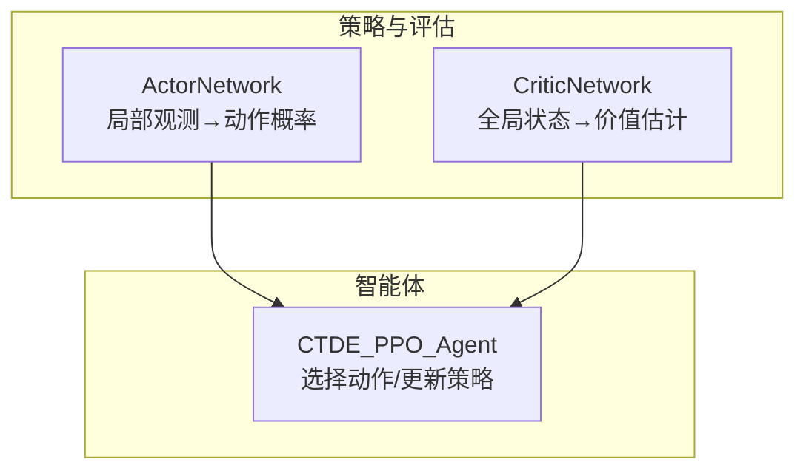
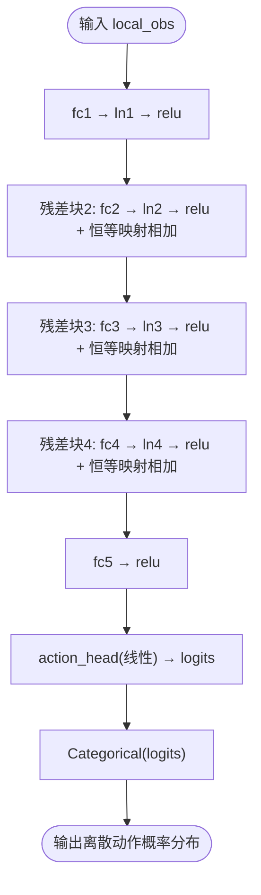
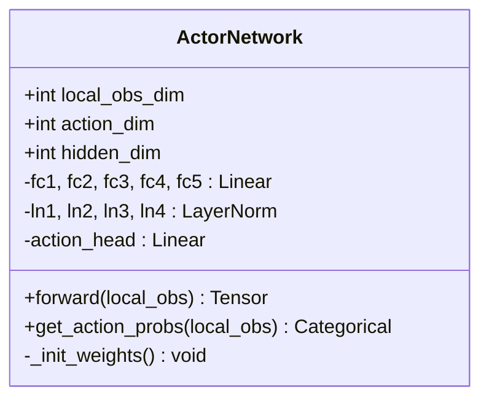
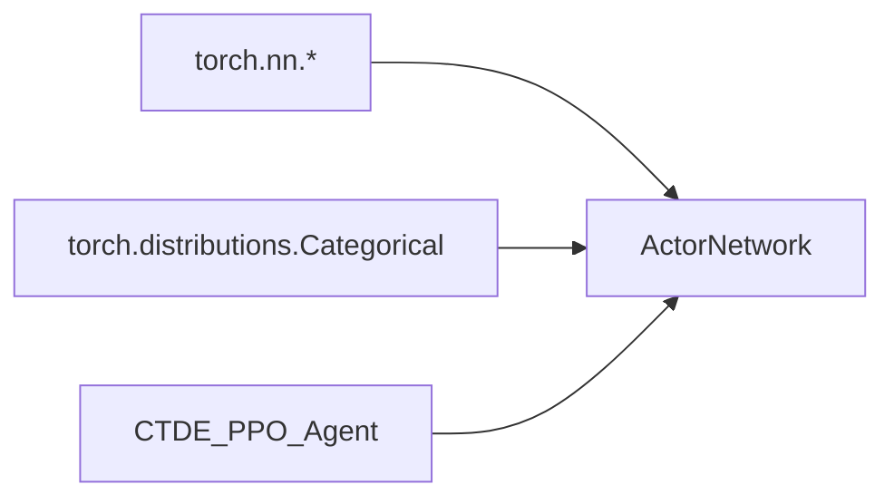

# Actor网络架构

<cite>
**本文引用的文件**   
- [ctde_ppo_baseline_train.py](file://environment_variables/environment_variables/ctde_ppo_baseline_train.py)
</cite>

## 目录
1. [简介](#简介)
2. [项目结构](#项目结构)
3. [核心组件](#核心组件)
4. [架构总览](#架构总览)
5. [详细组件分析](#详细组件分析)
6. [依赖关系分析](#依赖关系分析)
7. [性能与稳定性考量](#性能与稳定性考量)
8. [故障排查指南](#故障排查指南)
9. [结论](#结论)
10. [附录：超参数调优与实践建议](#附录超参数调优与实践建议)

## 简介
本技术文档聚焦于Actor网络架构，围绕ActorNetwork类的设计与实现进行深入解析。该网络采用多层感知机（MLP）作为特征提取主干，结合残差连接与LayerNorm提升训练稳定性与梯度传播效率；输出层将局部观测映射为离散动作的概率分布，并通过正交初始化策略稳定训练初期行为。文档还涵盖前向传播流程、get_action_probs方法的使用方式，以及hidden_dim等关键超参数的调优建议。

## 项目结构
ActorNetwork及相关逻辑位于CTDE-PPO基线训练脚本中，包含以下关键部分：
- ActorNetwork：基于MLP的离散动作策略网络
- CriticNetwork：全局状态价值网络（用于对比参考）
- CTDE_PPO_Agent：封装Actor/Critic使用、采样与KL自适应学习率调整



图表来源
- [ctde_ppo_baseline_train.py:460-502](file://environment_variables/environment_variables/ctde_ppo_baseline_train.py#L460-L502)
- [ctde_ppo_baseline_train.py:504-534](file://environment_variables/environment_variables/ctde_ppo_baseline_train.py#L504-L534)
- [ctde_ppo_baseline_train.py:849-862](file://environment_variables/environment_variables/ctde_ppo_baseline_train.py#L849-L862)

章节来源
- [ctde_ppo_baseline_train.py:460-502](file://environment_variables/environment_variables/ctde_ppo_baseline_train.py#L460-L502)
- [ctde_ppo_baseline_train.py:504-534](file://environment_variables/environment_variables/ctde_ppo_baseline_train.py#L504-L534)
- [ctde_ppo_baseline_train.py:849-862](file://environment_variables/environment_variables/ctde_ppo_baseline_train.py#L849-L862)

## 核心组件
- ActorNetwork：接收局部观测向量，经多层线性变换与非线性激活，输出离散动作空间的未归一化对数概率（logits），并支持通过Categorical分布进行采样或取对数概率。
- 关键设计点：
  - 隐藏层维度默认256，共4个隐藏层，随后接一个128维中间层，最后由action_head映射到动作空间维度。
  - 每层后接LayerNorm，并在第2~4层引入残差连接，增强深层网络的梯度流动与表征能力。
  - 权重采用正交初始化，偏置初始化为0；动作头权重使用较小的gain以抑制初期探索强度。

章节来源
- [ctde_ppo_baseline_train.py:460-502](file://environment_variables/environment_variables/ctde_ppo_baseline_train.py#L460-L502)

## 架构总览
Actor网络的前向传播流程如下：
- 输入：local_obs（局部观测向量）
- 第一层：线性+LayerNorm+ReLU
- 第二至第四层：线性+LayerNorm+ReLU + 残差连接
- 第五层：线性+ReLU（无LayerNorm）
- 输出头：线性层映射到动作维度，得到logits
- 概率建模：通过Categorical(logits)构建离散分布



图表来源
- [ctde_ppo_baseline_train.py:482-501](file://environment_variables/environment_variables/ctde_ppo_baseline_train.py#L482-L501)

## 详细组件分析

### ActorNetwork类设计与实现
- 构造参数
  - local_obs_dim：局部观测维度
  - action_dim：离散动作空间大小
  - hidden_dim：隐藏层维度（默认256）
- 网络结构
  - 四层隐藏层（均为hidden_dim），每层后接LayerNorm与ReLU
  - 第2~4层采用残差连接，形式为x = F.relu(LN(fc(x))) + x
  - 第5层为fc5(hidden_dim→128)+ReLU，作为决策前的特征压缩
  - action_head(128→action_dim)输出logits
- 初始化策略
  - 所有Linear层的权重使用正交初始化，gain=√2；偏置初始化为0
  - action_head权重使用正交初始化，gain=0.01，降低初始动作偏好，利于早期探索
- 前向传播
  - 逐层执行线性变换、LayerNorm、ReLU，并在指定层叠加残差
  - 最终输出logits供Categorical分布使用
- 概率接口
  - get_action_probs(local_obs)返回Categorical(logits)，便于采样与计算对数概率



图表来源
- [ctde_ppo_baseline_train.py:460-502](file://environment_variables/environment_variables/ctde_ppo_baseline_train.py#L460-L502)

章节来源
- [ctde_ppo_baseline_train.py:460-502](file://environment_variables/environment_variables/ctde_ppo_baseline_train.py#L460-L502)

### 前向传播内部机制
- 特征提取阶段
  - 前两层负责从原始观测中提取基础特征，LayerNorm保证各样本在各特征维度上的均值与方差稳定，ReLU提供非线性表达能力
  - 第2~4层通过残差连接缓解梯度消失问题，使深层网络更易优化
- 决策生成阶段
  - 第5层将高维特征压缩到128维，进一步提炼与动作相关的判别性信息
  - action_head将特征映射到动作空间，输出logits；由于未做softmax，数值更稳定且便于Categorical直接处理
- 概率建模
  - Categorical(logits)在内部进行数值稳定的softmax与采样，避免显式计算softmax导致的溢出风险

```mermaid
sequenceDiagram
participant Agent as "CTDE_PPO_Agent"
participant Actor as "ActorNetwork"
participant Dist as "Categorical"
Agent->>Actor : forward(local_obs)
Actor-->>Agent : logits(action_dim)
Agent->>Dist : Categorical(logits)
Dist-->>Agent : 可采样动作/对数概率
```

图表来源
- [ctde_ppo_baseline_train.py:482-501](file://environment_variables/environment_variables/ctde_ppo_baseline_train.py#L482-L501)
- [ctde_ppo_baseline_train.py:849-862](file://environment_variables/environment_variables/ctde_ppo_baseline_train.py#L849-L862)

章节来源
- [ctde_ppo_baseline_train.py:482-501](file://environment_variables/environment_variables/ctde_ppo_baseline_train.py#L482-L501)
- [ctde_ppo_baseline_train.py:849-862](file://environment_variables/environment_variables/ctde_ppo_baseline_train.py#L849-L862)

### 正交初始化策略与参数设置
- 权重初始化
  - 使用nn.init.orthogonal_进行正交初始化，gain=√2，有助于保持前向传播时激活值的方差稳定，减少梯度爆炸/消失风险
- 偏置初始化
  - 所有Linear层偏置初始化为0，避免引入不必要的先验偏移
- 动作头特殊处理
  - action_head权重使用较小的gain=0.01，抑制初始动作偏好，鼓励早期探索，有利于策略在训练初期的多样性

章节来源
- [ctde_ppo_baseline_train.py:475-480](file://environment_variables/environment_variables/ctde_ppo_baseline_train.py#L475-L480)

### get_action_probs使用方法与示例
- 作用
  - 将连续输入的局部观测转换为离散动作的概率分布对象（Categorical），支持sample()采样与log_prob()计算对数概率
- 典型调用路径
  - 智能体在推理阶段将本地观测堆叠为张量，传入actor.get_action_probs获取分布，再采样动作并记录对数概率用于PPO更新
- 确定性选择
  - 也可直接调用actor(local_obs)得到logits，并使用argmax选取确定性动作

```mermaid
sequenceDiagram
participant Env as "环境"
participant Agent as "CTDE_PPO_Agent"
participant Actor as "ActorNetwork"
participant Dist as "Categorical"
Env->>Agent : 提供local_obs列表
Agent->>Actor : get_action_probs(local_obs_tensor)
Actor-->>Agent : Categorical(logits)
Agent->>Dist : sample() / log_prob(actions)
Dist-->>Agent : 动作索引/对数概率
```

图表来源
- [ctde_ppo_baseline_train.py:849-862](file://environment_variables/environment_variables/ctde_ppo_baseline_train.py#L849-L862)
- [ctde_ppo_baseline_train.py:500-501](file://environment_variables/environment_variables/ctde_ppo_baseline_train.py#L500-L501)

章节来源
- [ctde_ppo_baseline_train.py:500-501](file://environment_variables/environment_variables/ctde_ppo_baseline_train.py#L500-L501)
- [ctde_ppo_baseline_train.py:849-862](file://environment_variables/environment_variables/ctde_ppo_baseline_train.py#L849-L862)

## 依赖关系分析
- 外部依赖
  - torch.nn.Linear、torch.nn.LayerNorm、torch.nn.functional.relu
  - torch.distributions.Categorical
- 内部耦合
  - ActorNetwork被CTDE_PPO_Agent实例化与调用，提供策略采样与对数概率
  - 与CriticNetwork并列存在，分别处理局部观测与全局状态



图表来源
- [ctde_ppo_baseline_train.py:460-502](file://environment_variables/environment_variables/ctde_ppo_baseline_train.py#L460-L502)
- [ctde_ppo_baseline_train.py:849-862](file://environment_variables/environment_variables/ctde_ppo_baseline_train.py#L849-L862)

章节来源
- [ctde_ppo_baseline_train.py:460-502](file://environment_variables/environment_variables/ctde_ppo_baseline_train.py#L460-L502)
- [ctde_ppo_baseline_train.py:849-862](file://environment_variables/environment_variables/ctde_ppo_baseline_train.py#L849-L862)

## 性能与稳定性考量
- 残差连接
  - 在第2~4层引入恒等映射相加，有助于缓解深层网络中的梯度衰减，提高收敛速度与稳定性
- LayerNorm
  - 每层后标准化特征分布，减少内部协变量偏移，提升训练鲁棒性
- 正交初始化
  - 权重正交初始化配合ReLU激活，能维持激活值方差稳定，降低训练初期发散风险
- 动作头小增益
  - 较小gain降低初始动作偏好，有利于探索与后期精细调整

[本节为通用指导，不直接分析具体代码文件]

## 故障排查指南
- 训练不稳定或发散
  - 检查是否误用softmax替代Categorical(logits)；应保持logits输入以利用数值稳定实现
  - 确认LayerNorm与残差连接的顺序与位置是否正确
- 动作分布过于集中或随机
  - 调整action_head的gain或正则化系数；适当增大探索项（如熵系数）
- 梯度异常或NaN
  - 检查输入数据范围与归一化；确保没有除零或数值溢出操作
  - 验证正交初始化与偏置初始化配置未被覆盖

章节来源
- [ctde_ppo_baseline_train.py:475-480](file://environment_variables/environment_variables/ctde_ppo_baseline_train.py#L475-L480)
- [ctde_ppo_baseline_train.py:482-501](file://environment_variables/environment_variables/ctde_ppo_baseline_train.py#L482-L501)

## 结论
ActorNetwork采用“4×256隐藏层+128中间层+动作头”的MLP结构，结合LayerNorm与残差连接，有效提升了深层网络的训练稳定性与表征能力。正交初始化与小增益动作头共同保障了训练初期的稳健探索。通过get_action_probs接口，网络将连续观测映射为离散动作的概率分布，便于PPO算法进行策略更新与优化。

[本节为总结性内容，不直接分析具体代码文件]

## 附录：超参数调优与实践建议
- hidden_dim的影响
  - 增大hidden_dim可提升模型容量与拟合能力，但会增加参数量与过拟合风险；建议在任务复杂度较高时逐步增加，并结合早停或正则化手段
  - 过小则可能导致欠拟合，表现为策略无法捕捉复杂模式
- 残差层数与位置
  - 当前在第2~4层使用残差连接，若继续加深网络，可考虑在更多层引入残差，但需监控梯度范数与损失曲线
- 学习率与KL自适应
  - 结合KL散度自适应调整actor学习率，有助于控制策略更新步长，避免破坏已学知识
- 动作头增益
  - 根据任务需求微调action_head的gain；对于需要强探索的任务可适当增大，反之减小

[本节为通用指导，不直接分析具体代码文件]