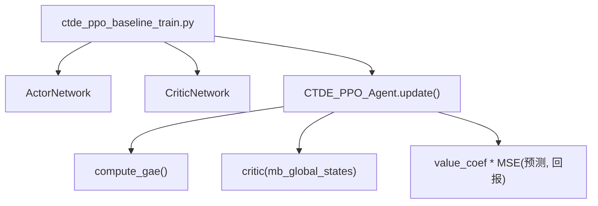
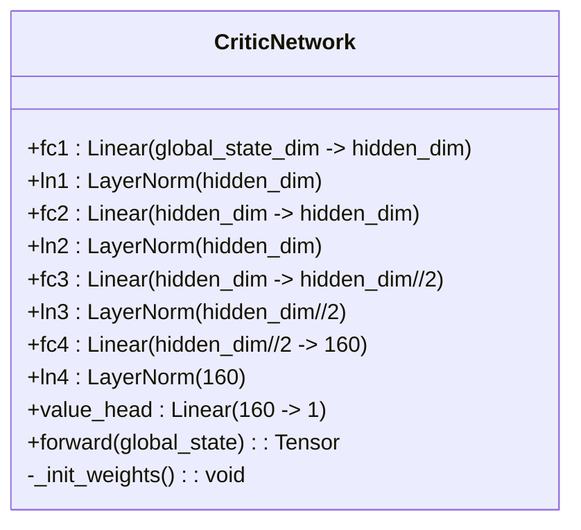
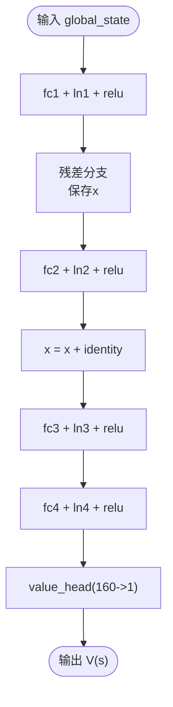
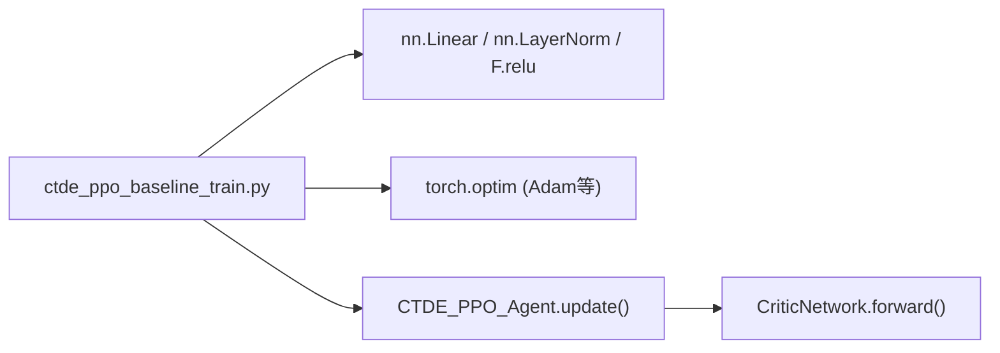

# Critic网络架构

<cite>
**本文引用的文件**
- [ctde_ppo_baseline_train.py](file://environment_variables/environment_variables/ctde_ppo_baseline_train.py)
</cite>

## 目录
1. [简介](#简介)
2. [项目结构](#项目结构)
3. [核心组件](#核心组件)
4. [架构总览](#架构总览)
5. [详细组件分析](#详细组件分析)
6. [依赖关系分析](#依赖关系分析)
7. [性能与稳定性考量](#性能与稳定性考量)
8. [故障排查指南](#故障排查指南)
9. [结论](#结论)
10. [附录：参数调优建议](#附录参数调优建议)

## 简介
本技术文档聚焦于CTDE-PPO基线中的Critic网络，系统阐述其设计动机、网络层次结构、归一化与初始化策略、前向传播流程以及梯度更新路径。该Critic网络以全局状态为输入，输出标量价值估计，用于PPO算法中计算优势函数与价值损失，从而指导策略优化。

## 项目结构
本项目将Actor-Critic网络与训练循环统一实现在一个脚本中。CriticNetwork类位于主训练脚本内，配合CTDE_PPO_Agent完成GAE优势估计、价值损失计算与参数更新。



图表来源
- [ctde_ppo_baseline_train.py:504-534](file://environment_variables/environment_variables/ctde_ppo_baseline_train.py#L504-L534)
- [ctde_ppo_baseline_train.py:889-991](file://environment_variables/environment_variables/ctde_ppo_baseline_train.py#L889-L991)

章节来源
- [ctde_ppo_baseline_train.py:504-534](file://environment_variables/environment_variables/ctde_ppo_baseline_train.py#L504-L534)
- [ctde_ppo_baseline_train.py:889-991](file://environment_variables/environment_variables/ctde_ppo_baseline_train.py#L889-L991)

## 核心组件
- CriticNetwork：接收全局状态向量，经多层全连接与层归一化，最终通过单神经元线性头输出标量价值。
- CTDE_PPO_Agent.update：负责从回放缓冲区采样批次数据，计算GAE优势与回报，使用MSE损失更新Critic权重，并执行梯度裁剪与优化器步进。

章节来源
- [ctde_ppo_baseline_train.py:504-534](file://environment_variables/environment_variables/ctde_ppo_baseline_train.py#L504-L534)
- [ctde_ppo_baseline_train.py:889-991](file://environment_variables/environment_variables/ctde_ppo_baseline_train.py#L889-L991)

## 架构总览
Critic网络采用“特征提取+价值头”的两段式结构：
- 特征提取：4个隐藏层，维度序列为 hidden_dim → hidden_dim → hidden_dim/2 → 160，每层后接LayerNorm与ReLU激活；第2层引入残差连接，有助于缓解深层网络的退化问题。
- 价值头：1×1的线性映射，将160维特征压缩为标量价值估计。



图表来源
- [ctde_ppo_baseline_train.py:504-534](file://environment_variables/environment_variables/ctde_ppo_baseline_train.py#L504-L534)

## 详细组件分析

### 网络层次设计与选择原理
- 隐藏层维度序列（默认hidden_dim=384）：384→384→192→160→1
  - 前两层保持较大容量，有利于对复杂全局状态进行充分表征；随后逐步降维，减少冗余信息，提升泛化能力。
  - 最后160维作为价值头的输入，兼顾表达能力与计算开销。
- 残差连接：在第2层引入x+identity，有助于稳定深层网络训练，缓解梯度消失/爆炸风险。
- 激活函数：ReLU提供非线性表达能力；LayerNorm在每层之后对特征进行标准化，改善训练动态。

章节来源
- [ctde_ppo_baseline_train.py:504-534](file://environment_variables/environment_variables/ctde_ppo_baseline_train.py#L504-L534)

### LayerNorm的作用与影响
- 作用机制：对每个样本在各通道上的均值与方差进行归一化，使各层输入分布更稳定，降低内部协变量偏移。
- 训练收益：
  - 提高收敛速度：稳定的特征分布允许使用更大的学习率或更快的迭代。
  - 增强鲁棒性：对不同规模的全局状态输入更具适应性，减少过拟合风险。
- 在本实现中，LayerNorm紧随线性层与激活之前，形成“LN→ReLU”的标准块，符合常见实践。

章节来源
- [ctde_ppo_baseline_train.py:504-534](file://environment_variables/environment_variables/ctde_ppo_baseline_train.py#L504-L534)

### 正交初始化策略与value_head的gain设置
- 通用层初始化：对所有Linear层的权重采用正交初始化，偏置初始化为0，有助于维持初始阶段的信息流与梯度尺度。
- value_head特殊处理：对价值头权重使用正交初始化且gain=1.0，目的是让价值估计在训练初期保持合理的数值范围，避免过大或过小导致价值损失不稳定。
- gain=1.0的原因：
  - 价值目标通常为累积奖励，数量级相对可控；较小的gain可能导致价值估计过于保守，较大的gain则可能放大误差。
  - 正交初始化配合单位增益，能在不改变信号尺度的前提下提供良好条件数，利于后续优化。

章节来源
- [ctde_ppo_baseline_train.py:518-523](file://environment_variables/environment_variables/ctde_ppo_baseline_train.py#L518-L523)

### 前向传播过程详解
- 输入：全局状态张量global_state，形状为[batch, global_state_dim]。
- 步骤：
  1) x = ReLU(LN(fc1(global_state)))
  2) identity = x; x = ReLU(LN(fc2(x))); x = x + identity（残差）
  3) x = ReLU(LN(fc3(x)))
  4) x = ReLU(LN(fc4(x)))
  5) V(s) = value_head(x)，形状为[batch, 1]
- 输出：标量价值估计V(s)，供PPO计算价值损失与优势函数。



图表来源
- [ctde_ppo_baseline_train.py:525-534](file://environment_variables/environment_variables/ctde_ppo_baseline_train.py#L525-L534)

章节来源
- [ctde_ppo_baseline_train.py:525-534](file://environment_variables/environment_variables/ctde_ppo_baseline_train.py#L525-L534)

### 梯度流分析与PPO优化中的作用
- 优势与回报计算：Agent.compute_gae基于时序差分与GAE公式，得到advantages与returns。
- 价值损失：critic_loss = value_coef * MSE(V(s), returns)。
- 反向传播与更新：
  - critic_optimizer.zero_grad()
  - critic_loss.backward()
  - 梯度裁剪：clip_grad_norm_(critic.parameters(), max_grad_norm)
  - 优化器步进：critic_optimizer.step()
- 重要性：
  - 价值函数估计直接影响优势函数的无偏性与方差，进而决定策略更新的步长与方向。
  - 稳定的价值估计能降低KL散度波动，提升PPO训练的稳定性与效率。

```mermaid
sequenceDiagram
participant Agent as "CTDE_PPO_Agent"
participant Critic as "CriticNetwork"
participant Opt as "critic_optimizer"
Agent->>Agent : compute_gae(rewards, dones, global_states)
Agent->>Critic : forward(global_states) -> values_pred
Agent->>Agent : critic_loss = value_coef * MSE(values_pred, returns)
Agent->>Opt : zero_grad()
Agent->>Critic : backward(critic_loss)
Agent->>Agent : clip_grad_norm_(critic.parameters())
Agent->>Opt : step()
```

图表来源
- [ctde_ppo_baseline_train.py:889-991](file://environment_variables/environment_variables/ctde_ppo_baseline_train.py#L889-L991)
- [ctde_ppo_baseline_train.py:525-534](file://environment_variables/environment_variables/ctde_ppo_baseline_train.py#L525-L534)

章节来源
- [ctde_ppo_baseline_train.py:889-991](file://environment_variables/environment_variables/ctde_ppo_baseline_train.py#L889-L991)
- [ctde_ppo_baseline_train.py:525-534](file://environment_variables/environment_variables/ctde_ppo_baseline_train.py#L525-L534)

## 依赖关系分析
- CriticNetwork依赖PyTorch的nn.Linear、nn.LayerNorm与F.relu等基础模块。
- 训练循环依赖CTDE_PPO_Agent.update，后者调用CriticNetwork的前向与优化器接口。
- 外部依赖包括numpy与torch.optim，用于数值计算与优化。



图表来源
- [ctde_ppo_baseline_train.py:504-534](file://environment_variables/environment_variables/ctde_ppo_baseline_train.py#L504-L534)
- [ctde_ppo_baseline_train.py:889-991](file://environment_variables/environment_variables/ctde_ppo_baseline_train.py#L889-L991)

章节来源
- [ctde_ppo_baseline_train.py:504-534](file://environment_variables/environment_variables/ctde_ppo_baseline_train.py#L504-L534)
- [ctde_ppo_baseline_train.py:889-991](file://environment_variables/environment_variables/ctde_ppo_baseline_train.py#L889-L991)

## 性能与稳定性考量
- 层归一化：显著提升训练稳定性，尤其在多智能体全局状态维度较高时。
- 残差连接：在第2层引入，有助于缓解深层网络退化，加速收敛。
- 正交初始化：保证初始权重具有良好的条件数，配合单位增益的价值头，避免早期价值估计发散。
- 梯度裁剪：防止价值损失过大导致的梯度爆炸，保障训练平稳。

章节来源
- [ctde_ppo_baseline_train.py:504-534](file://environment_variables/environment_variables/ctde_ppo_baseline_train.py#L504-L534)
- [ctde_ppo_baseline_train.py:889-991](file://environment_variables/environment_variables/ctde_ppo_baseline_train.py#L889-L991)

## 故障排查指南
- 价值损失不下降或震荡：
  - 检查value_coef是否过大；适当减小以降低价值项对整体损失的支配。
  - 确认max_grad_norm设置合理，避免梯度裁剪过强或过弱。
- 训练初期发散：
  - 检查value_head的gain是否为1.0；若自定义修改，需重新评估数值范围。
  - 确保LayerNorm与ReLU顺序正确，避免激活前未归一化导致分布漂移。
- 收敛缓慢：
  - 调整hidden_dim或网络深度；当前结构已具备一定容量，可尝试增大或引入更多残差。
  - 检查GAE参数gamma与gae_lambda是否合适，不当设置会影响优势估计质量。

章节来源
- [ctde_ppo_baseline_train.py:518-523](file://environment_variables/environment_variables/ctde_ppo_baseline_train.py#L518-L523)
- [ctde_ppo_baseline_train.py:889-991](file://environment_variables/environment_variables/ctde_ppo_baseline_train.py#L889-L991)

## 结论
CriticNetwork采用四层隐藏层加单层价值头的结构，结合LayerNorm与正交初始化，提供了稳定高效的标量价值估计能力。其在PPO框架中承担关键角色：准确的价值估计有助于构建高质量的优势函数，从而驱动策略稳步优化。通过合理的参数配置与监控指标，可在复杂任务中获得良好的训练效果。

## 附录：参数调优建议
- hidden_dim调优：
  - 起始值：384（默认），适用于中等至大型全局状态维度。
  - 若状态维度较小（如<128），可降至256或192以减少参数量与过拟合风险。
  - 若状态维度较大（如>512），可增至512或更高，但需关注显存与训练时长。
- 学习率与批大小：
  - critic_lr默认5e-4，可与actor_lr协同调整；当价值损失波动大时，可适当降低。
  - batch_size越大，优势估计越稳定，但需权衡内存与延迟。
- 正则与稳定性：
  - 保持LayerNorm与正交初始化不变；必要时增加dropout或权重衰减，但需谨慎以免破坏价值估计精度。
  - 监控approx_kl与clip_fraction，确保策略更新幅度适中。

章节来源
- [ctde_ppo_baseline_train.py:504-534](file://environment_variables/environment_variables/ctde_ppo_baseline_train.py#L504-L534)
- [ctde_ppo_baseline_train.py:889-991](file://environment_variables/environment_variables/ctde_ppo_baseline_train.py#L889-L991)