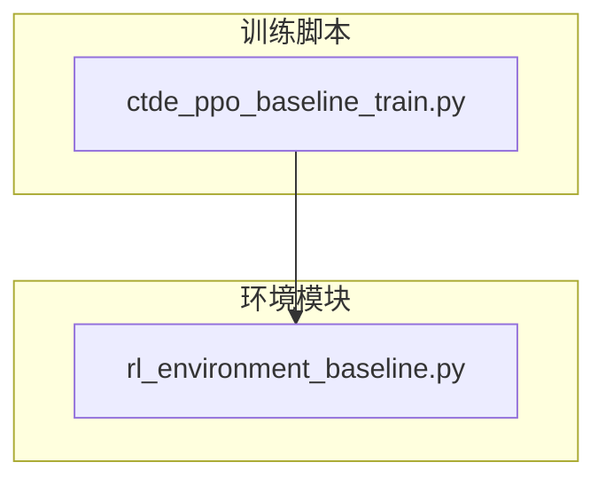
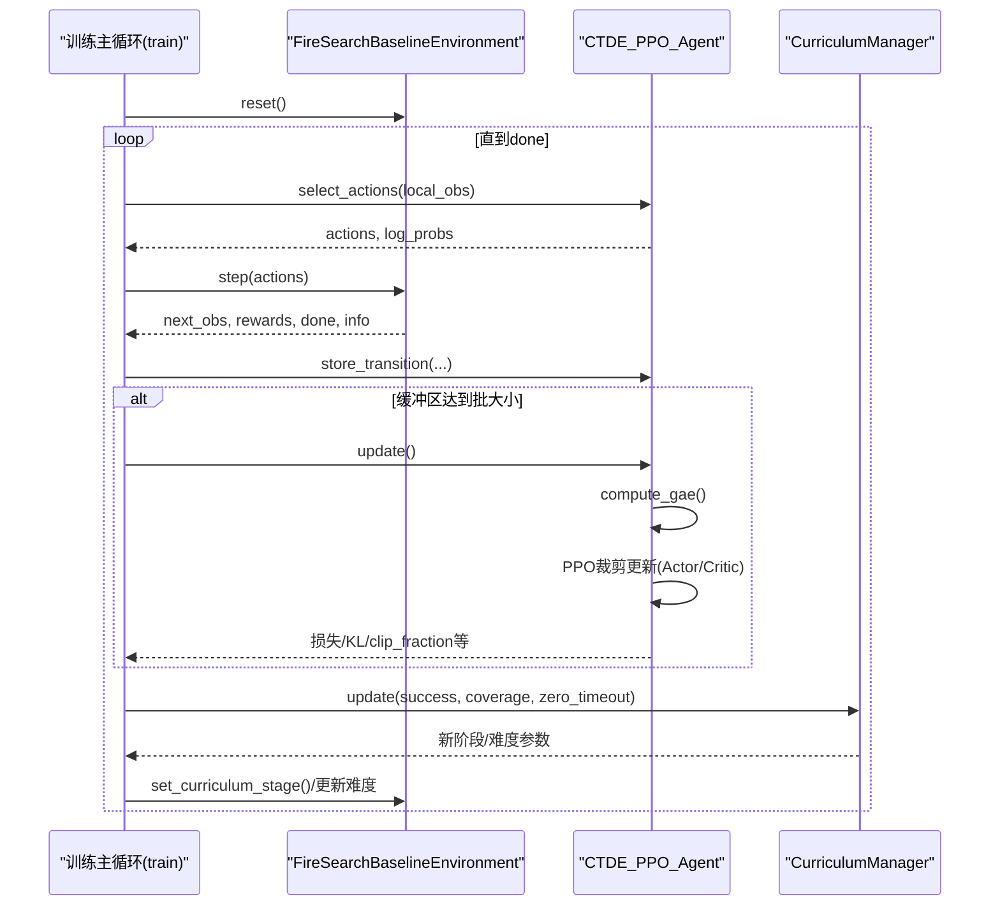
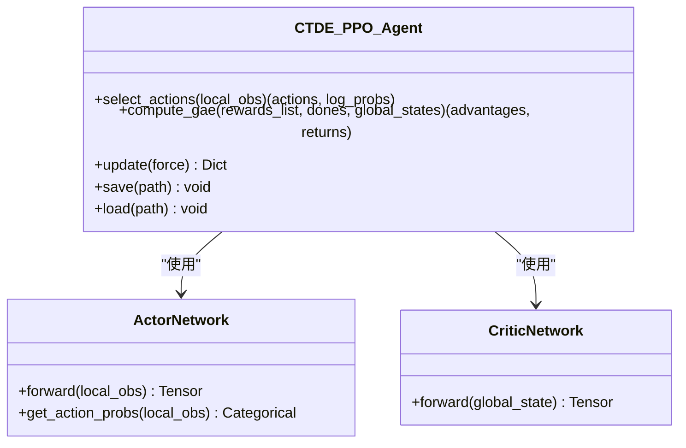
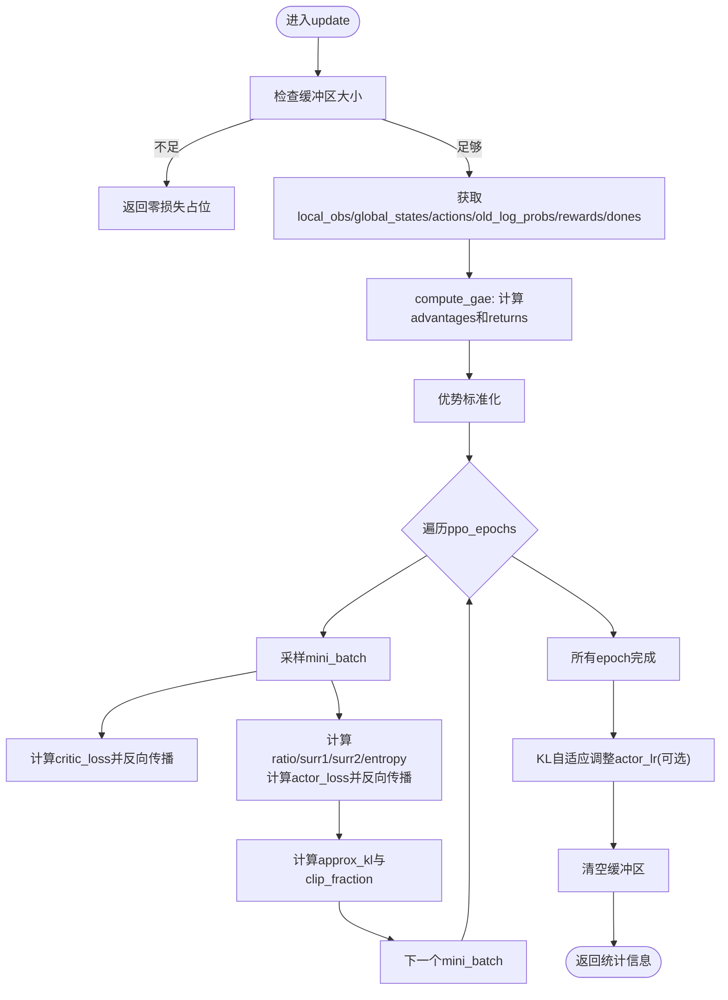
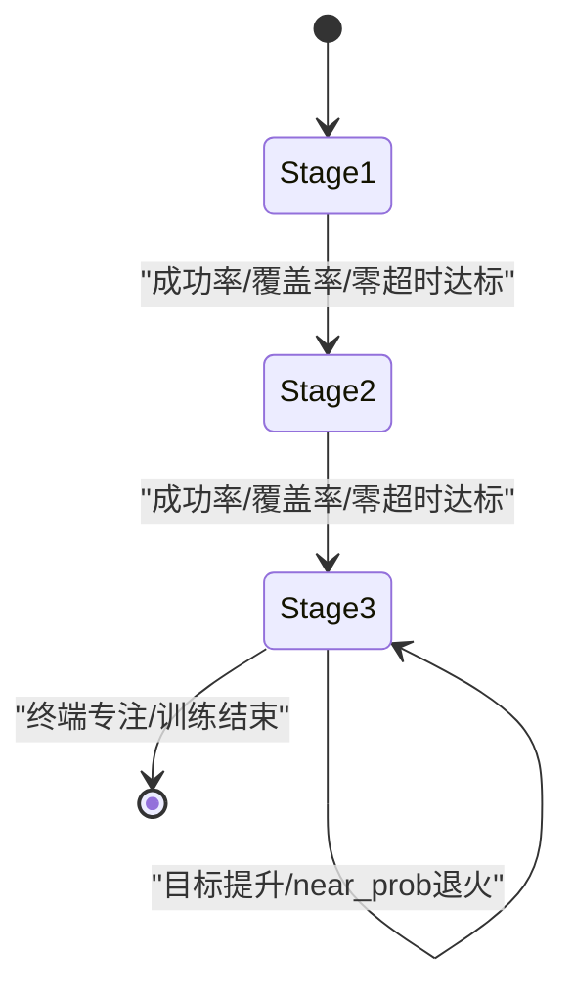
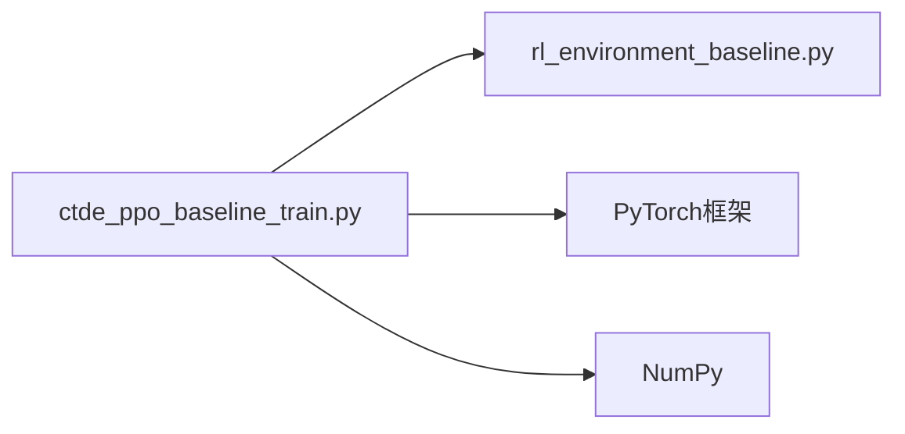

# CTDE-PPO算法核心

<cite>
**本文引用的文件**   
- [ctde_ppo_baseline_train.py](file://environment_variables/environment_variables/ctde_ppo_baseline_train.py)
- [rl_environment_baseline.py](file://environment_variables/environment_variables/rl_environment_baseline.py)
</cite>

## 目录
1. [引言](#引言)
2. [项目结构](#项目结构)
3. [核心组件](#核心组件)
4. [架构总览](#架构总览)
5. [详细组件分析](#详细组件分析)
6. [依赖关系分析](#依赖关系分析)
7. [性能与稳定性考量](#性能与稳定性考量)
8. [故障排查指南](#故障排查指南)
9. [结论](#结论)
10. [附录：参数说明与调优建议](#附录参数说明与调优建议)

## 引言
本技术文档围绕仓库中的集中式训练去中心化执行（CTDE）PPO基线实现，系统阐述算法原理、数学基础与工程实现细节。重点包括：
- PPO裁剪机制、KL散度约束与GAE优势估计的实现路径
- 多智能体协作场景下的信息共享与分布式决策流程
- 课程学习策略与自适应学习率调节
- 关键超参数的含义、默认值与调优建议
- 与其他强化学习算法的对比优势与适用场景

## 项目结构
本项目由两个核心模块组成：
- 环境模块：提供多无人机火场边界搜索任务，支持多种观测与奖励配置，输出局部观测与全局状态，满足CTDE范式
- 训练模块：实现CTDE-PPO算法，包含Actor/Critic网络、回放缓冲、GAE计算、PPO更新、课程学习与评估流水线

图表来源
- [ctde_ppo_baseline_train.py:1-50](file://environment_variables/environment_variables/ctde_ppo_baseline_train.py#L1-L50)
- [rl_environment_baseline.py:1-50](file://environment_variables/environment_variables/rl_environment_baseline.py#L1-L50)

章节来源
- [ctde_ppo_baseline_train.py:1-120](file://environment_variables/environment_variables/ctde_ppo_baseline_train.py#L1-L120)
- [rl_environment_baseline.py:1-120](file://environment_variables/environment_variables/rl_environment_baseline.py#L1-L120)

## 核心组件
- 环境类 FireSearchBaselineEnvironment：定义离散动作空间、局部观测与全局状态维度、多阶段课程目标、动态边界检测与热势引导等
- 训练器 CTDE_PPO_Agent：封装Actor/Critic网络、优化器、回放缓冲、GAE计算、PPO裁剪更新、KL自适应学习率
- 课程管理器 CurriculumManager：三阶段难度递增、近端/远端生成概率退火、最终专注阶段强制目标
- 训练主循环 train()：数据预检、日志记录、模型保存、验证与泛化评估、质量指标统计

章节来源
- [rl_environment_baseline.py:21-120](file://environment_variables/environment_variables/rl_environment_baseline.py#L21-L120)
- [ctde_ppo_baseline_train.py:460-535](file://environment_variables/environment_variables/ctde_ppo_baseline_train.py#L460-L535)
- [ctde_ppo_baseline_train.py:569-758](file://environment_variables/environment_variables/ctde_ppo_baseline_train.py#L569-L758)
- [ctde_ppo_baseline_train.py:759-1014](file://environment_variables/environment_variables/ctde_ppo_baseline_train.py#L759-L1014)
- [ctde_ppo_baseline_train.py:1278-1814](file://environment_variables/environment_variables/ctde_ppo_baseline_train.py#L1278-L1814)

## 架构总览
下图展示CTDE-PPO在训练阶段的整体交互：Agent与环境交互收集轨迹，按批次进行GAE优势估计与PPO更新；课程管理器根据成功率、覆盖率与超时率动态调整难度；训练主循环负责日志、保存与评估。

图表来源
- [ctde_ppo_baseline_train.py:1469-1604](file://environment_variables/environment_variables/ctde_ppo_baseline_train.py#L1469-L1604)
- [ctde_ppo_baseline_train.py:867-991](file://environment_variables/environment_variables/ctde_ppo_baseline_train.py#L867-L991)
- [ctde_ppo_baseline_train.py:569-758](file://environment_variables/environment_variables/ctde_ppo_baseline_train.py#L569-L758)
- [rl_environment_baseline.py:842-992](file://environment_variables/environment_variables/rl_environment_baseline.py#L842-L992)

## 详细组件分析

### 环境与观测/奖励设计
- 观测空间
  - 局部观测：每架无人机的位置、电池、地形特征、风向风速、热梯度、动量、相机方向等，维度随profile变化
  - 全局状态：团队覆盖率、平均/最低电量、团队质心与分散、距火中心距离、步数比例、已访问面积比例、课程阶段、风场/高程均值、发现边界比例、低电量指示、无人机数量、覆盖梯度、未探索密度等
- 动作空间：离散5动作（上下左右不动）
- 奖励设计
  - 基础项：发现边界点、探索新区域、重复惩罚、空闲惩罚、近距离碰撞惩罚
  - 前置边界引导：基于热势增量的弱引导，帮助早期探索
  - 配置化奖励曲线：前沿探测、严重性加权、平衡探索等
  - 终止奖励/惩罚：成功完成给予效率相关奖励；超时或零覆盖给予惩罚
- 课程阶段
  - 阶段1：快速发现少量边界点即结束
  - 阶段2/3：按覆盖率阈值完成；阶段3目标逐步提升
  - 近端/远端生成概率随阶段退火，增强鲁棒性

章节来源
- [rl_environment_baseline.py:21-120](file://environment_variables/environment_variables/rl_environment_baseline.py#L21-L120)
- [rl_environment_baseline.py:565-658](file://environment_variables/environment_variables/rl_environment_baseline.py#L565-L658)
- [rl_environment_baseline.py:692-806](file://environment_variables/environment_variables/rl_environment_baseline.py#L692-L806)
- [rl_environment_baseline.py:808-992](file://environment_variables/environment_variables/rl_environment_baseline.py#L808-L992)

### Actor/Critic网络结构与初始化
- Actor网络
  - 输入：局部观测向量
  - 结构：多层全连接+LayerNorm+残差连接，输出动作logits
  - 初始化：正交权重初始化，动作头小增益
- Critic网络
  - 输入：全局状态向量
  - 结构：多层全连接+LayerNorm+残差连接，输出标量价值
  - 初始化：正交权重初始化，价值头单位增益

图表来源
- [ctde_ppo_baseline_train.py:460-535](file://environment_variables/environment_variables/ctde_ppo_baseline_train.py#L460-L535)
- [ctde_ppo_baseline_train.py:759-822](file://environment_variables/environment_variables/ctde_ppo_baseline_train.py#L759-L822)

章节来源
- [ctde_ppo_baseline_train.py:460-535](file://environment_variables/environment_variables/ctde_ppo_baseline_train.py#L460-L535)
- [ctde_ppo_baseline_train.py:759-822](file://environment_variables/environment_variables/ctde_ppo_baseline_train.py#L759-L822)

### GAE优势估计与PPO裁剪更新
- GAE优势估计
  - 使用Critic对全局状态的价值预测，按时间步逆序累积TD误差并加权衰减
  - 优势标准化：减去均值除以标准差，稳定训练
- PPO裁剪更新
  - 计算新旧策略比率ratio = exp(new_log_prob - old_log_prob)
  - 构造surr1 = ratio * adv，surr2 = clamp(ratio, 1-ε, 1+ε) * adv
  - Actor损失取负的最小值，并加入熵正则鼓励探索
  - Critic损失为MSE，带价值系数
  - 梯度裁剪防止爆炸
- KL自适应学习率
  - 近似KL = mean((ratio - 1) - log_ratio)
  - 指数形式因子根据KL偏离目标调整actor学习率，限制在[min,max]区间

图表来源
- [ctde_ppo_baseline_train.py:867-991](file://environment_variables/environment_variables/ctde_ppo_baseline_train.py#L867-L991)

章节来源
- [ctde_ppo_baseline_train.py:867-991](file://environment_variables/environment_variables/ctde_ppo_baseline_train.py#L867-L991)

### 课程学习与难度控制
- 阶段划分
  - 阶段1：以发现少量边界点为目标，快速建立基础能力
  - 阶段2：以覆盖率阈值为目标，要求更稳定的搜索
  - 阶段3：进一步提升覆盖率目标，同时降低近端生成概率，增强远距离探索
- 能力绑定退火
  - 近端生成概率阶梯式下降，且不超过目标进度
  - 终端专注：最后若干回合强制使用最终目标与near_prob=0，确保收敛到最终条件
- 切换触发
  - 成功率、覆盖率、零覆盖超时率综合判定，最小回合数与最大回合数保护
  - 切换时优先处理缓存数据再更新环境参数

图表来源
- [ctde_ppo_baseline_train.py:569-758](file://environment_variables/environment_variables/ctde_ppo_baseline_train.py#L569-L758)

章节来源
- [ctde_ppo_baseline_train.py:569-758](file://environment_variables/environment_variables/ctde_ppo_baseline_train.py#L569-L758)

### 训练主循环与评估
- 训练主循环
  - 数据预检与热健康检查，确保场景边界与热势合理
  - 每回合收集轨迹，达到批大小时进行PPO更新
  - 滚动统计奖励、长度、覆盖率、成功率、任务得分、超时率等
  - 定期验证与保存最佳模型（训练集与验证集分别维护）
- 评估流程
  - 固定随机种子，按阶段与场景枚举评估
  - 确定性策略推理，统计覆盖率、成功率、任务得分等
  - 训练后对最佳验证模型进行泛化与压力测试评估

章节来源
- [ctde_ppo_baseline_train.py:1278-1814](file://environment_variables/environment_variables/ctde_ppo_baseline_train.py#L1278-L1814)
- [ctde_ppo_baseline_train.py:1816-1920](file://environment_variables/environment_variables/ctde_ppo_baseline_train.py#L1816-L1920)

## 依赖关系分析
- 训练脚本依赖环境模块提供的FireSearchBaselineEnvironment接口
- Agent内部依赖PyTorch张量操作与分布采样
- 课程管理器独立于具体环境，仅通过成功率/覆盖率/超时率信号驱动

图表来源
- [ctde_ppo_baseline_train.py:1-50](file://environment_variables/environment_variables/ctde_ppo_baseline_train.py#L1-L50)
- [rl_environment_baseline.py:1-50](file://environment_variables/environment_variables/rl_environment_baseline.py#L1-L50)

章节来源
- [ctde_ppo_baseline_train.py:1-50](file://environment_variables/environment_variables/ctde_ppo_baseline_train.py#L1-L50)
- [rl_environment_baseline.py:1-50](file://environment_variables/environment_variables/rl_environment_baseline.py#L1-L50)

## 性能与稳定性考量
- 数值稳定性
  - 优势标准化避免过大方差
  - 梯度裁剪防止梯度爆炸
  - KL自适应学习率抑制策略突变
- 训练效率
  - mini-batch迭代与多epoch更新提高样本利用率
  - 批量大小与mini-batch大小按比例设置，兼顾吞吐与稳定性
- 课程学习
  - 渐进式难度提升减少初期探索盲目性
  - 终端专注确保最终目标达成
- 评估与监控
  - 滚动窗口统计与尾部分布分析衡量稳定性
  - KL超限率与clip_fraction监控策略更新幅度

[本节为通用指导，不直接分析具体文件]

## 故障排查指南
- 热健康检查失败
  - 现象：训练前抛出异常，提示某些场景的热势指标超出阈值
  - 原因：初始边界或热势分布不合理
  - 处理：检查场景初始化参数与热势计算逻辑
- 课程阶段无法推进
  - 现象：长期停留在某阶段
  - 原因：成功率/覆盖率/零超时率未达门槛或回合数不足
  - 处理：调整reward权重、观察clip_fraction与KL是否过大导致策略不稳定
- 训练发散或KL过大
  - 现象：KL显著高于target，clip_fraction高
  - 原因：学习率过大或裁剪系数过小
  - 处理：启用KL自适应学习率或降低actor_lr，增大clip_epsilon

章节来源
- [ctde_ppo_baseline_train.py:1225-1276](file://environment_variables/environment_variables/ctde_ppo_baseline_train.py#L1225-L1276)
- [ctde_ppo_baseline_train.py:836-848](file://environment_variables/environment_variables/ctde_ppo_baseline_train.py#L836-L848)

## 结论
该CTDE-PPO基线实现了在多智能体火场边界搜索任务上的稳定训练与良好泛化。其核心在于：
- 清晰的CTDE分离：Actor基于局部观测，Critic基于全局状态
- 稳健的PPO实现：GAE优势估计、裁剪更新、KL自适应学习率
- 有效的课程学习：三阶段递进与能力绑定退火
- 完善的训练管线：预检、日志、验证、评估与质量指标

[本节为总结性内容，不直接分析具体文件]

## 附录：参数说明与调优建议

### 关键超参数与默认值
- 学习率
  - actor_lr：默认2e-4，范围[2e-5, 4e-4]
  - critic_lr：默认5e-4
  - lr_adapt_mode：fixed或kl
  - target_kl：默认0.010
  - kl_ema_beta：默认0.9
  - kl_lr_alpha：默认0.1
- 折扣与优势
  - gamma：默认0.99
  - gae_lambda：默认0.95
- PPO更新
  - clip_epsilon：默认0.2
  - entropy_coef：默认0.01
  - value_coef：默认0.5
  - max_grad_norm：默认0.5
  - ppo_epochs：默认4
  - batch_size：默认4096
- 课程学习
  - init_percentile/init_area_percent：默认5.0
  - stage2_success_target：默认0.15
  - stage3_success_target：默认0.60
  - stage3_near_prob：默认0.25
- 训练控制
  - total_episodes：默认2500
  - validation_interval：默认100
  - save_interval：默认100
  - seed：默认42

章节来源
- [ctde_ppo_baseline_train.py:98-158](file://environment_variables/environment_variables/ctde_ppo_baseline_train.py#L98-L158)
- [ctde_ppo_baseline_train.py:161-281](file://environment_variables/environment_variables/ctde_ppo_baseline_train.py#L161-L281)
- [ctde_ppo_baseline_train.py:759-822](file://environment_variables/environment_variables/ctde_ppo_baseline_train.py#L759-L822)

### 调优建议
- 若KL频繁超过target
  - 启用lr_adapt_mode="kl"，适当增大kl_lr_alpha或减小target_kl
  - 增大clip_epsilon至0.3~0.4，缓解策略更新过激
- 若训练不稳定或发散
  - 降低actor_lr与critic_lr，增大max_grad_norm
  - 增加ppo_epochs或batch_size以提升样本利用
- 若课程推进缓慢
  - 调整stage2/stage3目标与成功率门槛
  - 检查reward_breakdown中r_penalty与r_explore占比，必要时微调权重
- 若泛化表现不佳
  - 增加eval_after_train与final_eval_splits覆盖更多场景
  - 关注terminal_focus激活后的收敛情况

[本节为通用指导，不直接分析具体文件]