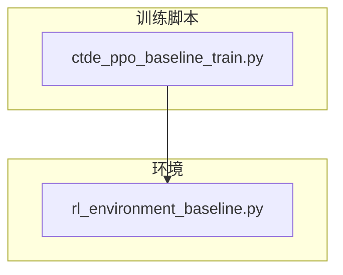
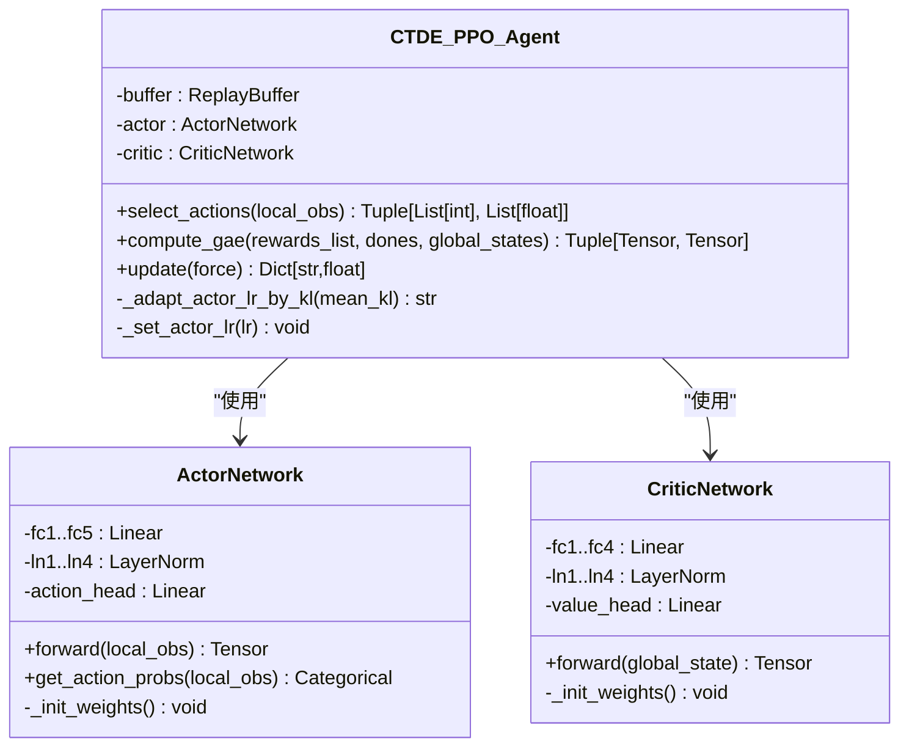
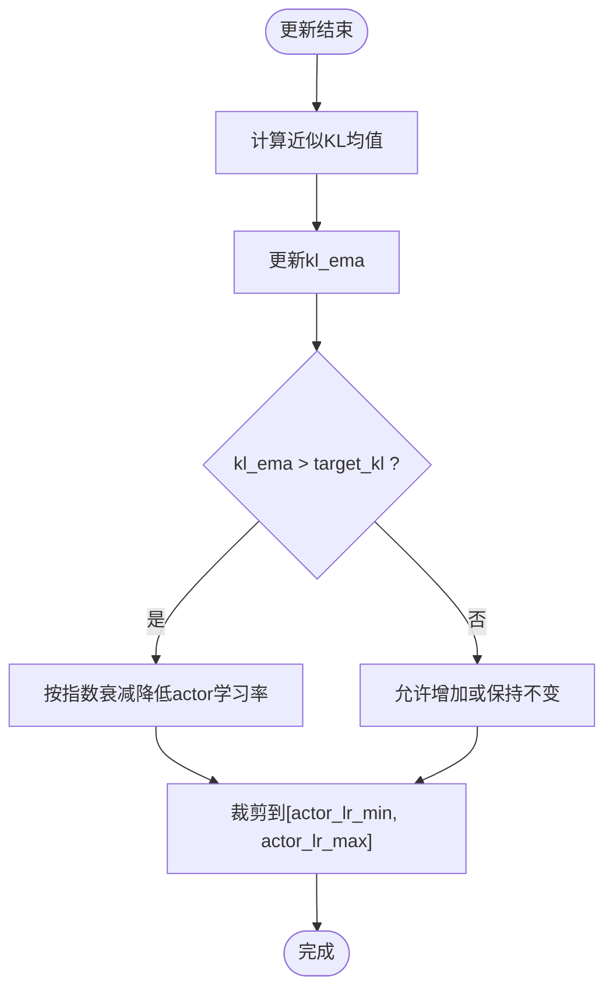
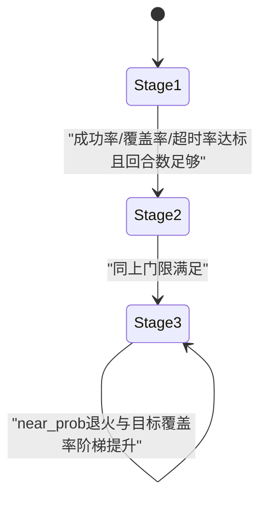
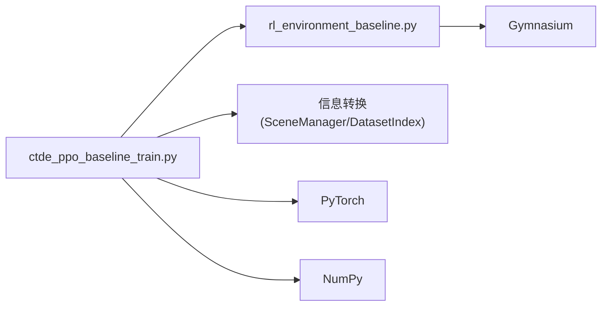

# 算法实现

<cite>
**本文引用的文件**   
- [ctde_ppo_baseline_train.py](file://environment_variables/environment_variables/ctde_ppo_baseline_train.py)
- [rl_environment_baseline.py](file://environment_variables/environment_variables/rl_environment_baseline.py)
</cite>

## 目录
1. [引言](#引言)
2. [项目结构](#项目结构)
3. [核心组件](#核心组件)
4. [架构总览](#架构总览)
5. [详细组件分析](#详细组件分析)
6. [依赖关系分析](#依赖关系分析)
7. [性能与稳定性考量](#性能与稳定性考量)
8. [故障排查指南](#故障排查指南)
9. [结论](#结论)
10. [附录：参数说明与调优建议](#附录参数说明与调优建议)

## 引言
本文件面向CTDE-PPO（集中式训练、去中心化执行）的PPO算法实现，系统阐述其数学基础、网络架构设计、自适应学习率机制、课程学习框架以及工程化实现细节。该实现以多无人机火场边界搜索任务为场景，采用Actor-Critic架构：Actor基于局部观测输出动作分布，Critic基于全局状态估计价值；训练阶段使用集中式全局状态进行策略更新，执行阶段仅依赖各智能体的局部观测。

## 项目结构
仓库中与算法实现直接相关的核心代码位于 environment_variables 目录下：
- ctde_ppo_baseline_train.py：包含CTDE-PPO智能体、回放缓冲、课程管理器、训练循环、评估流程与日志记录等。
- rl_environment_baseline.py：定义FireSearchBaselineEnvironment环境，提供离散动作空间、局部观测与全局状态接口、奖励设计与终止条件。



图表来源
- [ctde_ppo_baseline_train.py:1-50](file://environment_variables/environment_variables/ctde_ppo_baseline_train.py#L1-L50)
- [rl_environment_baseline.py:1-50](file://environment_variables/environment_variables/rl_environment_baseline.py#L1-L50)

章节来源
- [ctde_ppo_baseline_train.py:1-120](file://environment_variables/environment_variables/ctde_ppo_baseline_train.py#L1-L120)
- [rl_environment_baseline.py:1-120](file://environment_variables/environment_variables/rl_environment_baseline.py#L1-L120)

## 核心组件
- CTDE_PPO_Agent：封装Actor/Critic网络、优化器、GAE计算、PPO更新、KL自适应学习率与模型保存加载。
- ActorNetwork：多层全连接+LayerNorm+残差连接的策略网络，输出离散动作的对数几率。
- CriticNetwork：多层全连接+LayerNorm的价值网络，输出标量V(s)。
- ReplayBuffer：按时间步收集轨迹样本，供PPO小批量更新。
- CurriculumManager：三阶段渐进式难度提升，控制初始位置分布、目标覆盖率与近界生成概率。
- FireSearchBaselineEnvironment：离散动作空间、局部观测与全局状态构造、奖励分解、动态边界更新与终止判定。

章节来源
- [ctde_ppo_baseline_train.py:460-535](file://environment_variables/environment_variables/ctde_ppo_baseline_train.py#L460-L535)
- [ctde_ppo_baseline_train.py:537-567](file://environment_variables/environment_variables/ctde_ppo_baseline_train.py#L537-L567)
- [ctde_ppo_baseline_train.py:569-747](file://environment_variables/environment_variables/ctde_ppo_baseline_train.py#L569-L747)
- [ctde_ppo_baseline_train.py:749-1004](file://environment_variables/environment_variables/ctde_ppo_baseline_train.py#L749-L1004)
- [rl_environment_baseline.py:21-158](file://environment_variables/environment_variables/rl_environment_baseline.py#L21-L158)

## 架构总览
下图展示CTDE-PPO在训练与执行阶段的整体数据流与控制流。

```mermaid
sequenceDiagram
participant Env as "环境(FireSearchBaselineEnvironment)"
participant Agent as "CTDE_PPO_Agent"
participant Actor as "ActorNetwork"
participant Critic as "CriticNetwork"
participant Buffer as "ReplayBuffer"
loop 每回合
Env->>Agent : reset() -> 局部观测local_obs, 全局状态global_state
Agent->>Actor : 输入local_obs -> 采样动作actions, log_probs
Agent->>Env : step(actions)
Env-->>Agent : next_obs, rewards, done, info
Agent->>Buffer : store(local_obs, global_state, actions, log_probs, rewards, done)
alt 缓冲区达到批次大小
Agent->>Critic : compute_gae(rewards, dones, global_states)
Agent->>Actor : PPO更新(裁剪代理损失, 熵正则)
Agent->>Agent : KL自适应调整actor学习率(可选)
Agent->>Buffer : clear()
end
end
```

图表来源
- [ctde_ppo_baseline_train.py:839-981](file://environment_variables/environment_variables/ctde_ppo_baseline_train.py#L839-L981)
- [rl_environment_baseline.py:842-992](file://environment_variables/environment_variables/rl_environment_baseline.py#L842-L992)

章节来源
- [ctde_ppo_baseline_train.py:1268-1600](file://environment_variables/environment_variables/ctde_ppo_baseline_train.py#L1268-L1600)
- [rl_environment_baseline.py:842-992](file://environment_variables/environment_variables/rl_environment_baseline.py#L842-L992)

## 详细组件分析

### CTDE-PPO算法原理与数学基础
- 策略π(a|s_local)由Actor输出离散动作的概率分布；价值函数V(s_global)由Critic估计。
- GAE优势估计：A_t = Σ_{l=0}^{∞} (γλ)^l δ_{t+l}，其中δ_t = r_t + γ V(s_{t+1})(1-d_t) - V(s_t)。
- PPO裁剪代理损失：min(ratio·A_t, clip(ratio, 1-ε, 1+ε)·A_t)，ratio = π_θ(a_t|s_t)/π_θ_old(a_t|s_t)。
- 熵正则项鼓励探索，价值损失为MSE(V(s), R_t)。
- KL散度监控用于自适应调节Actor学习率，防止策略更新过大导致不稳定。

章节来源
- [ctde_ppo_baseline_train.py:857-981](file://environment_variables/environment_variables/ctde_ppo_baseline_train.py#L857-L981)

### Actor-Critic网络架构设计
- ActorNetwork：多层全连接+LayerNorm，并在中间层引入残差连接，增强梯度传播与训练稳定性；最后通过线性头输出动作对数几率。
- CriticNetwork：多层全连接+LayerNorm，逐步降维后输出标量价值；同样采用正交初始化与偏置零初始化。
- 权重初始化：Linear层权重采用正交初始化，偏置初始化为0；动作头和价值头分别设置较小增益以保证初期稳定。



图表来源
- [ctde_ppo_baseline_train.py:460-535](file://environment_variables/environment_variables/ctde_ppo_baseline_train.py#L460-L535)
- [ctde_ppo_baseline_train.py:749-812](file://environment_variables/environment_variables/ctde_ppo_baseline_train.py#L749-L812)

章节来源
- [ctde_ppo_baseline_train.py:460-535](file://environment_variables/environment_variables/ctde_ppo_baseline_train.py#L460-L535)

### 自适应学习率调整机制（基于KL散度）
- 维护KL均值的指数移动平均kl_ema，依据当前kl_ema与target_kl的偏差，按指数因子调整actor学习率：lr_new = clip(lr_old * exp(-α*(kl_ema/target_kl - 1)), lr_min, lr_max)。
- 当kl_ema显著大于target_kl时降低学习率，反之允许适度增大，从而在训练早期保持探索、后期收敛更稳定。
- 支持固定学习率模式与KL自适应模式两种策略。



图表来源
- [ctde_ppo_baseline_train.py:818-838](file://environment_variables/environment_variables/ctde_ppo_baseline_train.py#L818-L838)

章节来源
- [ctde_ppo_baseline_train.py:818-838](file://environment_variables/environment_variables/ctde_ppo_baseline_train.py#L818-L838)

### 课程学习框架（三阶段渐进式难度）
- 阶段1：低门槛成功条件（发现少量边界点即完成），并限制初始位置百分位较低，便于快速建立基础能力。
- 阶段2：要求达到一定覆盖率阈值，同时提高超时惩罚与探索引导强度。
- 阶段3：进一步提升目标覆盖率，并通过“near_prob”退火将智能体更多从靠近边界的区域生成，强化精细搜索能力。
- 自动进阶条件包括成功率、覆盖率、零覆盖超时率与最小回合数等多指标门限；阶段3还引入阶梯式退火能力绑定，确保能力达标后再提升难度。



图表来源
- [ctde_ppo_baseline_train.py:569-747](file://environment_variables/environment_variables/ctde_ppo_baseline_train.py#L569-L747)
- [rl_environment_baseline.py:824-841](file://environment_variables/environment_variables/rl_environment_baseline.py#L824-L841)

章节来源
- [ctde_ppo_baseline_train.py:569-747](file://environment_variables/environment_variables/ctde_ppo_baseline_train.py#L569-L747)
- [rl_environment_baseline.py:824-841](file://environment_variables/environment_variables/rl_environment_baseline.py#L824-L841)

### 环境与奖励设计
- 动作空间：离散5动作（上下左右不动）。
- 观测空间：每个智能体有局部观测向量（含位置、电池、地形、风场、热信号、动量、相机方向等），全局状态包含团队统计、覆盖率、步骤进度等。
- 奖励分解：发现边界点、覆盖率增量、面积增量、边界/前沿/严重性加权、探索、搜索引导、重复惩罚、空闲惩罚、终端奖励/超时惩罚等。
- 动态边界：每隔若干步重新检测边界并更新热力场，保证任务随时间演化。

章节来源
- [rl_environment_baseline.py:21-158](file://environment_variables/environment_variables/rl_environment_baseline.py#L21-L158)
- [rl_environment_baseline.py:692-806](file://environment_variables/environment_variables/rl_environment_baseline.py#L692-L806)
- [rl_environment_baseline.py:808-992](file://environment_variables/environment_variables/rl_environment_baseline.py#L808-L992)

### 训练与评估流程
- 训练循环：每回合采样动作、存储轨迹、达到批次后执行PPO更新；周期性记录指标、验证集评估与模型保存。
- 验证与泛化评估：按阶段与场景集合运行确定性策略，汇总成功率、覆盖率、超时率与任务得分；支持压力测试划分。
- 质量指标：收敛效率（AUC、阈值到达步数）、奖励稳定性（尾部标准差、性能下降）、KL稳定性（均值、方差、超限率、clip比例、学习率范围）。

章节来源
- [ctde_ppo_baseline_train.py:1268-1780](file://environment_variables/environment_variables/ctde_ppo_baseline_train.py#L1268-L1780)
- [ctde_ppo_baseline_train.py:1783-1887](file://environment_variables/environment_variables/ctde_ppo_baseline_train.py#L1783-L1887)
- [ctde_ppo_baseline_train.py:358-433](file://environment_variables/environment_variables/ctde_ppo_baseline_train.py#L358-L433)

## 依赖关系分析
- 训练脚本依赖环境模块与环境数据结构（SceneManager、DatasetIndex等），通过importlib动态导入。
- 智能体与环境解耦：Agent只关心观测/动作/奖励接口，环境负责具体任务逻辑与数据加载。
- 关键外部库：torch、numpy、gymnasium、matplotlib/scipy/rasterio/opencv（部分为可选）。



图表来源
- [ctde_ppo_baseline_train.py:30-37](file://environment_variables/environment_variables/ctde_ppo_baseline_train.py#L30-L37)
- [rl_environment_baseline.py:12-18](file://environment_variables/environment_variables/rl_environment_baseline.py#L12-L18)

章节来源
- [ctde_ppo_baseline_train.py:30-37](file://environment_variables/environment_variables/ctde_ppo_baseline_train.py#L30-L37)
- [rl_environment_baseline.py:12-18](file://environment_variables/environment_variables/rl_environment_baseline.py#L12-L18)

## 性能与稳定性考量
- 梯度裁剪：Actor与Critic均使用最大范数裁剪，避免更新爆炸。
- 小批量更新：PPO在多epoch内对小批量数据进行多次更新，提高样本利用率。
- KL自适应：通过kl_ema与target_kl控制策略更新幅度，维持训练稳定性。
- 课程学习：渐进式难度提升有助于快速收敛与泛化能力提升。
- 设备选择：自动选择CUDA或CPU，便于在不同硬件上运行。

章节来源
- [ctde_ppo_baseline_train.py:913-946](file://environment_variables/environment_variables/ctde_ppo_baseline_train.py#L913-L946)
- [ctde_ppo_baseline_train.py:818-838](file://environment_variables/environment_variables/ctde_ppo_baseline_train.py#L818-L838)
- [ctde_ppo_baseline_train.py:749-812](file://environment_variables/environment_variables/ctde_ppo_baseline_train.py#L749-L812)

## 故障排查指南
- 热健康检查失败：训练前会收集数据集的热健康指标并校验阈值，若超过限制将抛出异常，需检查数据预处理与热力场计算。
- 观察/奖励配置错误：observation_profile与reward_profile必须属于环境定义的合法集合，否则初始化时报错。
- 学习率异常：若KL自适应导致学习率过小或过大，可调整kl_lr_alpha、actor_lr_min/max与target_kl。
- 课程阶段不推进：检查成功率、覆盖率与零覆盖超时率是否满足门限，必要时放宽stage阈值或延长最小回合数。

章节来源
- [ctde_ppo_baseline_train.py:1229-1266](file://environment_variables/environment_variables/ctde_ppo_baseline_train.py#L1229-L1266)
- [rl_environment_baseline.py:208-226](file://environment_variables/environment_variables/rl_environment_baseline.py#L208-L226)
- [ctde_ppo_baseline_train.py:232-240](file://environment_variables/environment_variables/ctde_ppo_baseline_train.py#L232-L240)

## 结论
该CTDE-PPO实现将稳定的PPO更新、KL自适应学习率与三阶段课程学习有机结合，在多无人机火场边界搜索任务中展现出良好的收敛性与鲁棒性。Actor/Critic的网络设计采用LayerNorm与残差连接，提升了训练稳定性；环境侧的动态边界与奖励分解提供了清晰的优化信号。工程层面完善的日志、质量指标与评估流程，使得实验可复现与对比更加便捷。

## 附录：参数说明与调优建议
- 学习率相关
  - actor_lr/critic_lr：基线学习率，KL模式下仅actor学习率会被自适应调整。
  - lr_adapt_mode：fixed或kl；kl模式需要合理设置target_kl与kl_lr_alpha。
  - actor_lr_min/actor_lr_max：学习率裁剪边界，防止极端值。
- PPO超参
  - gamma/gae_lambda：折扣与GAE混合系数，影响优势估计偏差-方差权衡。
  - clip_epsilon：PPO裁剪范围，过大会导致更新不稳定，过小则学习缓慢。
  - entropy_coef/value_coef：探索与价值损失的权重，需根据任务稀疏性调整。
  - max_grad_norm：梯度裁剪上限，稳定训练的关键。
  - ppo_epochs/batch_size/minibatch：决定每次更新的样本规模与迭代次数。
- 课程学习
  - init_percentile/init_area_percent：初始位置分布控制，影响探索效率。
  - stage2_success_target/stage3_success_target：阶段目标覆盖率。
  - stage3_near_prob：阶段3靠近边界生成的概率，配合能力门限退火。
- 评估与日志
  - validation_interval/validation_episodes_per_scene：验证频率与每场景回合数。
  - quality_window/quality_tail_fraction/quality_target_kl：质量指标窗口与KL目标。
  - eval_stages/final_eval_splits：评估阶段与数据划分集合。

章节来源
- [ctde_ppo_baseline_train.py:98-158](file://environment_variables/environment_variables/ctde_ppo_baseline_train.py#L98-L158)
- [ctde_ppo_baseline_train.py:232-270](file://environment_variables/environment_variables/ctde_ppo_baseline_train.py#L232-L270)
- [ctde_ppo_baseline_train.py:1268-1600](file://environment_variables/environment_variables/ctde_ppo_baseline_train.py#L1268-L1600)