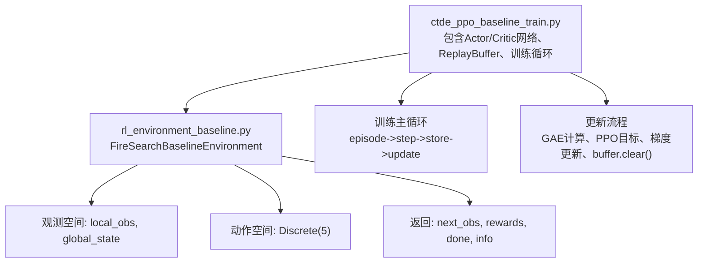
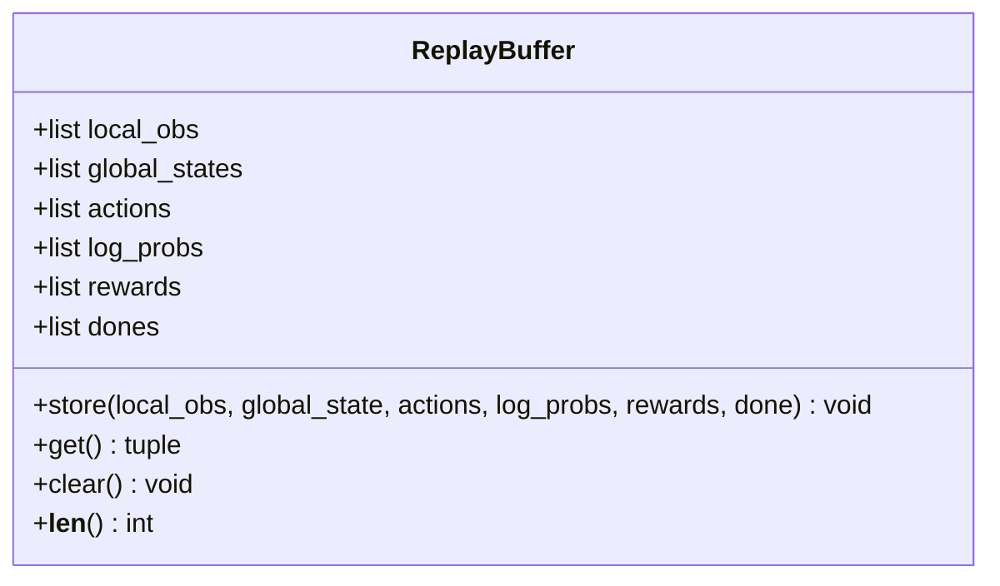
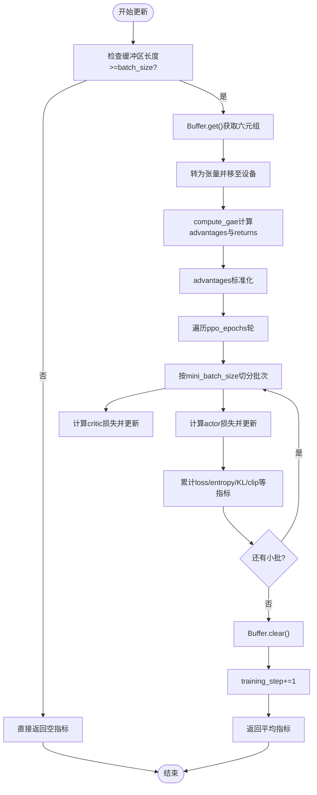
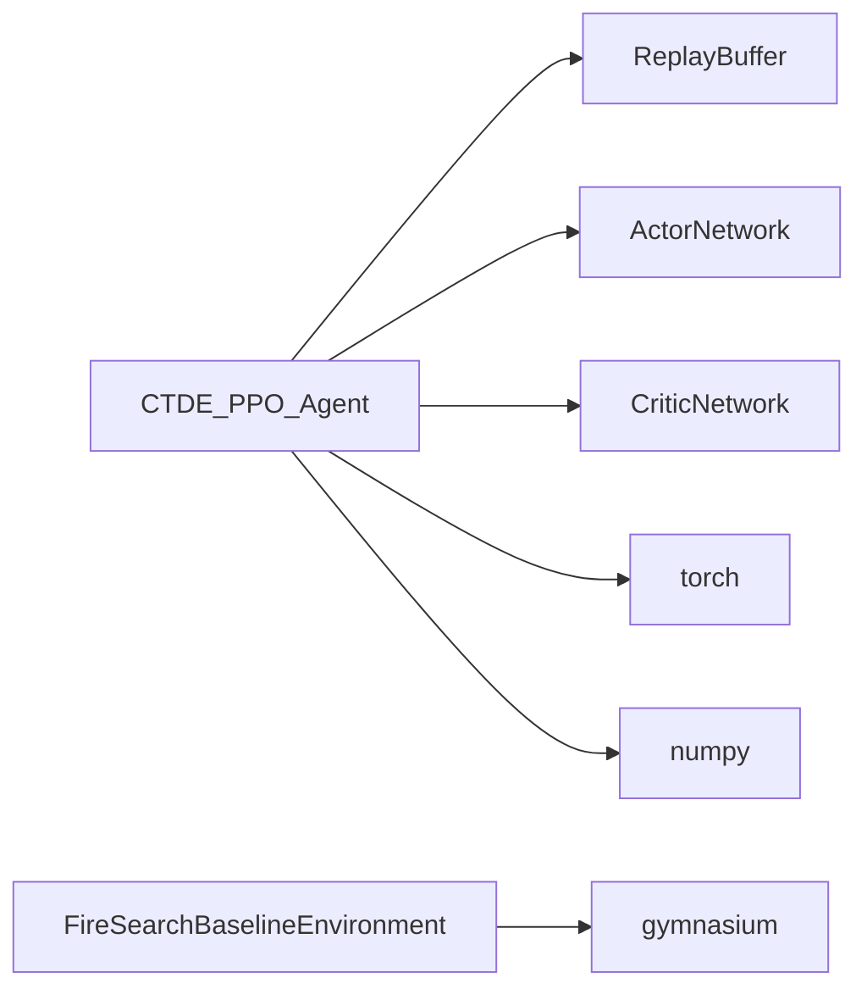

# 经验回放缓冲区

<cite>
**本文引用的文件**   
- [ctde_ppo_baseline_train.py](file://environment_variables/environment_variables/ctde_ppo_baseline_train.py)
- [rl_environment_baseline.py](file://environment_variables/environment_variables/rl_environment_baseline.py)
</cite>

## 目录
1. [简介](#简介)
2. [项目结构](#项目结构)
3. [核心组件](#核心组件)
4. [架构总览](#架构总览)
5. [详细组件分析](#详细组件分析)
6. [依赖关系分析](#依赖关系分析)
7. [性能与内存优化建议](#性能与内存优化建议)
8. [故障排查指南](#故障排查指南)
9. [结论](#结论)
10. [附录：PPO中的数据流转](#附录ppo中的数据流转)

## 简介
本技术文档聚焦于经验回放缓冲区（ReplayBuffer）在CTDE-PPO训练流程中的角色与实现。重点覆盖：
- 数据存储结构与内存管理机制
- 局部观测、全局状态、动作、对数概率、奖励、终止标志等元组数据的存储格式与管理方式
- 数据收集、批量获取、缓冲区清理的实现细节
- 缓冲区大小配置、采样策略、内存使用优化的调优建议
- 数据完整性检查、异常数据处理、性能监控的实现要点
- 经验回放在PPO算法中的作用与数据流转过程
- 与GPU内存管理的集成方式和数据迁移策略

## 项目结构
本项目采用“单脚本+环境模块”的轻量组织方式，核心训练逻辑与经验回放缓冲区均位于同一训练脚本中；环境定义与观测/奖励接口位于独立的环境模块中。



图表来源
- [ctde_ppo_baseline_train.py:537-566](file://environment_variables/environment_variables/ctde_ppo_baseline_train.py#L537-L566)
- [ctde_ppo_baseline_train.py:864-991](file://environment_variables/environment_variables/ctde_ppo_baseline_train.py#L864-L991)
- [rl_environment_baseline.py:21-131](file://environment_variables/environment_variables/rl_environment_baseline.py#L21-L131)

章节来源
- [ctde_ppo_baseline_train.py:537-566](file://environment_variables/environment_variables/ctde_ppo_baseline_train.py#L537-L566)
- [ctde_ppo_baseline_train.py:864-991](file://environment_variables/environment_variables/ctde_ppo_baseline_train.py#L864-L991)
- [rl_environment_baseline.py:21-131](file://environment_variables/environment_variables/rl_environment_baseline.py#L21-L131)

## 核心组件
- ReplayBuffer：以列表为容器的经验缓存，按时间步顺序追加并支持批量读取与清空。
- CTDE_PPO_Agent：封装Actor/Critic网络、优化器、GAE计算、PPO更新以及缓冲区的存取接口。
- FireSearchBaselineEnvironment：提供多智能体火灾边界搜索环境的交互接口，输出结构化观测与奖励。

章节来源
- [ctde_ppo_baseline_train.py:537-566](file://environment_variables/environment_variables/ctde_ppo_baseline_train.py#L537-L566)
- [ctde_ppo_baseline_train.py:759-991](file://environment_variables/environment_variables/ctde_ppo_baseline_train.py#L759-L991)
- [rl_environment_baseline.py:21-131](file://environment_variables/environment_variables/rl_environment_baseline.py#L21-L131)

## 架构总览
下图展示了从环境交互到经验回放再到PPO更新的端到端流程。

```mermaid
sequenceDiagram
participant Env as "环境(FireSearchBaselineEnvironment)"
participant Agent as "CTDE_PPO_Agent"
participant Buffer as "ReplayBuffer"
participant Actor as "ActorNetwork"
participant Critic as "CriticNetwork"
loop 每个episode
Agent->>Env : reset()
Env-->>Agent : obs{local_obs, global_state}
loop 每步
Agent->>Actor : select_actions(local_obs)
Actor-->>Agent : actions, log_probs
Agent->>Env : step(actions)
Env-->>Agent : next_obs, rewards, done, info
Agent->>Buffer : store_transition(local_obs, global_state, actions, log_probs, rewards, done)
end
alt 缓冲区达到batch_size
Agent->>Buffer : get()
Buffer-->>Agent : 历史序列
Agent->>Critic : compute_gae(rewards, dones, global_states)
Critic-->>Agent : advantages, returns
Agent->>Actor : PPO前向与新log_prob
Agent->>Actor : 梯度更新
Agent->>Critic : 梯度更新
Agent->>Buffer : clear()
end
end
```

图表来源
- [ctde_ppo_baseline_train.py:1492-1505](file://environment_variables/environment_variables/ctde_ppo_baseline_train.py#L1492-L1505)
- [ctde_ppo_baseline_train.py:864-991](file://environment_variables/environment_variables/ctde_ppo_baseline_train.py#L864-L991)
- [rl_environment_baseline.py:561-591](file://environment_variables/environment_variables/rl_environment_baseline.py#L561-L591)

## 详细组件分析

### ReplayBuffer类：数据结构与内存管理
- 内部字段
  - local_obs：按时间步累积的局部观测列表
  - global_states：按时间步累积的全局状态列表
  - actions：按时间步累积的动作列表
  - log_probs：按时间步累积的对数概率列表
  - rewards：按时间步累积的奖励列表
  - dones：按时间步累积的终止标志列表
- 关键方法
  - __init__：初始化空列表容器
  - store：将一步经验追加到各列表末尾
  - get：一次性返回所有字段的完整列表
  - clear：重置所有列表为空
  - __len__：返回当前已存储的经验条数（基于rewards长度）



图表来源
- [ctde_ppo_baseline_train.py:537-566](file://environment_variables/environment_variables/ctde_ppo_baseline_train.py#L537-L566)

章节来源
- [ctde_ppo_baseline_train.py:537-566](file://environment_variables/environment_variables/ctde_ppo_baseline_train.py#L537-L566)

### 数据收集与存储格式
- 数据来源
  - 环境reset返回obs字典，包含local_obs与global_state
  - 环境step返回next_obs、rewards、done、info
- 存储入口
  - Agent.store_transition调用Buffer.store，将每一步的(local_obs, global_state, actions, log_probs, rewards, done)追加到对应列表
- 元组数据说明
  - local_obs：多智能体的局部观测集合，形状为(num_agents, local_obs_dim)，dtype=float32
  - global_state：全局状态向量，形状为(global_state_dim,)，dtype=float32
  - actions：离散动作索引，形状为(num_agents,)，dtype=int
  - log_probs：每个智能体的对数概率，形状为(num_agents,)，dtype=float
  - rewards：每个智能体的即时奖励，形状为(num_agents,)，dtype=float
  - done：布尔值，表示该步是否终止

章节来源
- [ctde_ppo_baseline_train.py:1492-1502](file://environment_variables/environment_variables/ctde_ppo_baseline_train.py#L1492-L1502)
- [ctde_ppo_baseline_train.py:864-866](file://environment_variables/environment_variables/ctde_ppo_baseline_train.py#L864-L866)
- [rl_environment_baseline.py:111-131](file://environment_variables/environment_variables/rl_environment_baseline.py#L111-L131)

### 批量获取与PPO更新
- 触发条件
  - 当缓冲区长度≥batch_size时，进入一次PPO更新
- 获取与预处理
  - Buffer.get返回六元组列表
  - 将列表转换为numpy数组并移动到设备（CPU或CUDA）
  - 使用Critic预测全局价值，计算GAE得到advantages与returns，并进行标准化
- 小批量采样与更新
  - 随机打乱索引，按mini_batch_size切分
  - 分别计算critic损失与actor损失，执行梯度裁剪与参数更新
  - 统计approx_kl、clip_fraction等指标
- 清理与计数
  - 更新完成后调用Buffer.clear释放内存
  - 递增training_step计数



图表来源
- [ctde_ppo_baseline_train.py:889-991](file://environment_variables/environment_variables/ctde_ppo_baseline_train.py#L889-L991)

章节来源
- [ctde_ppo_baseline_train.py:889-991](file://environment_variables/environment_variables/ctde_ppo_baseline_train.py#L889-L991)

### 与GPU内存管理的集成和数据迁移
- 设备选择
  - Agent初始化时根据torch.cuda.is_available()自动选择设备，或接受显式device参数
- 数据迁移
  - 在select_actions、compute_gae、update等关键路径中，将numpy数组转换为torch.FloatTensor并to(device)
  - 动作与log_probs在推理后cpu().numpy()转回以便存入缓冲区
- 注意事项
  - 频繁to()/cpu()会带来额外开销，建议在可能的情况下尽量在设备上操作
  - 大数组转换需关注显存峰值，必要时减小batch_size或mini_batch_size

章节来源
- [ctde_ppo_baseline_train.py:805-814](file://environment_variables/environment_variables/ctde_ppo_baseline_train.py#L805-L814)
- [ctde_ppo_baseline_train.py:849-855](file://environment_variables/environment_variables/ctde_ppo_baseline_train.py#L849-L855)
- [ctde_ppo_baseline_train.py:867-887](file://environment_variables/environment_variables/ctde_ppo_baseline_train.py#L867-L887)
- [ctde_ppo_baseline_train.py:900-904](file://environment_variables/environment_variables/ctde_ppo_baseline_train.py#L900-L904)

### 数据完整性检查与异常处理
- 基本一致性
  - 通过__len__统一以rewards长度为准，确保各字段长度一致
- 潜在风险点
  - 若环境返回的rewards维度不一致或类型异常，可能导致后续张量拼接失败
  - 若done为None或非布尔值，GAE计算可能产生NaN
- 建议增强
  - 在store中增加断言：检查各字段长度一致、类型正确、数值范围合理
  - 在update前进行数据校验：过滤异常样本或记录日志
  - 对GAE结果进行NaN/Inf检测，必要时跳过该批次更新

章节来源
- [ctde_ppo_baseline_train.py:565-566](file://environment_variables/environment_variables/ctde_ppo_baseline_train.py#L565-L566)
- [ctde_ppo_baseline_train.py:867-887](file://environment_variables/environment_variables/ctde_ppo_baseline_train.py#L867-L887)

### 性能监控与日志
- 训练日志
  - 每回合记录任务得分、覆盖率、成功率、超时率、KL、clip比例、学习率等
- 更新指标
  - update返回actor_loss、critic_loss、entropy、approx_kl、kl_ema、kl_lr_action、clip_fraction、actor_lr、critic_lr等
- 可视化与评估
  - 训练结束后生成训练曲线与泛化评估图

章节来源
- [ctde_ppo_baseline_train.py:1520-1546](file://environment_variables/environment_variables/ctde_ppo_baseline_train.py#L1520-L1546)
- [ctde_ppo_baseline_train.py:980-991](file://environment_variables/environment_variables/ctde_ppo_baseline_train.py#L980-L991)

## 依赖关系分析
- 组件耦合
  - CTDE_PPO_Agent持有ReplayBuffer实例，负责数据收集与更新
  - ReplayBuffer仅依赖Python内置列表，无外部库耦合
  - 环境模块提供观测/奖励接口，不直接依赖缓冲区
- 外部依赖
  - torch用于张量运算与设备管理
  - numpy用于数组构造与基础统计
  - gymnasium用于环境接口定义



图表来源
- [ctde_ppo_baseline_train.py:759-991](file://environment_variables/environment_variables/ctde_ppo_baseline_train.py#L759-L991)
- [rl_environment_baseline.py:21-131](file://environment_variables/environment_variables/rl_environment_baseline.py#L21-L131)

章节来源
- [ctde_ppo_baseline_train.py:759-991](file://environment_variables/environment_variables/ctde_ppo_baseline_train.py#L759-L991)
- [rl_environment_baseline.py:21-131](file://environment_variables/environment_variables/rl_environment_baseline.py#L21-L131)

## 性能与内存优化建议
- 缓冲区大小配置
  - batch_size决定一次更新所需的数据量，过小导致更新不稳定，过大导致内存占用高
  - 建议结合GPU显存与CPU内存，逐步增大batch_size直至接近上限
- 采样策略
  - 当前实现使用随机打乱索引的小批量采样，有助于打破时序相关性
  - 可考虑按重要性采样或优先级采样提升学习效率，但需引入额外复杂度
- 内存使用优化
  - 避免在缓冲区中保留冗余副本，优先使用原地操作
  - 减少频繁的to()/cpu()切换，尽量在设备上完成中间计算
  - 使用更紧凑的数据类型（如float16/bfloat16）需谨慎验证数值稳定性
- 更新频率与批大小
  - mini_batch_size影响单次梯度步长与稳定性，通常设置为batch_size的1/8~1/4
  - ppo_epochs控制对同一批数据的重复利用次数，过多易过拟合，过少效率低
- 监控与诊断
  - 记录KL与clip_fraction，监控策略变化幅度
  - 观察reward方差与收敛速度，调整gae_lambda与value_coef

[本节为通用指导，无需特定文件引用]

## 故障排查指南
- 常见问题
  - 缓冲区长度不足：当len(buffer)<batch_size时不会触发更新，需延长episode或降低batch_size
  - 维度不匹配：local_obs/global_state/rewards/actions/log_probs的形状不一致会导致张量拼接失败
  - NaN/Inf损失：GAE计算或数值溢出可能导致损失异常，需检查奖励缩放与数值范围
- 定位步骤
  - 打印Buffer.__len__与各字段长度，确认一致性
  - 在update前对advantages/returns进行NaN/Inf检查
  - 逐步缩小batch_size与mini_batch_size，定位内存瓶颈
- 修复建议
  - 在store中加入断言与类型检查
  - 对异常样本进行隔离与记录，避免污染训练
  - 使用梯度裁剪与合理的学习率范围，防止发散

章节来源
- [ctde_ppo_baseline_train.py:889-991](file://environment_variables/environment_variables/ctde_ppo_baseline_train.py#L889-L991)
- [ctde_ppo_baseline_train.py:1504-1505](file://environment_variables/environment_variables/ctde_ppo_baseline_train.py#L1504-L1505)

## 结论
ReplayBuffer在本项目中作为CTDE-PPO训练的核心数据枢纽，承担了经验收集、批量获取与清理的职责。其实现简洁直观，便于理解与维护。为确保训练稳定与高效，建议加强数据完整性检查、优化内存与设备迁移策略，并结合KL与clip_fraction等指标进行动态调参。

[本节为总结性内容，无需特定文件引用]

## 附录：PPO中的数据流转
- 数据收集阶段
  - 环境交互产生(local_obs, global_state, action, log_prob, reward, done)
  - 通过Agent.store_transition写入Buffer
- 数据准备阶段
  - 达到batch_size后，Buffer.get返回完整序列
  - 转换为张量并移至设备，计算GAE得到advantages与returns
- 模型更新阶段
  - 小批量随机采样，分别更新Actor与Critic
  - 统计并记录KL、clip_fraction等指标
- 清理阶段
  - 更新完成后清空Buffer，释放内存

章节来源
- [ctde_ppo_baseline_train.py:1492-1505](file://environment_variables/environment_variables/ctde_ppo_baseline_train.py#L1492-L1505)
- [ctde_ppo_baseline_train.py:864-991](file://environment_variables/environment_variables/ctde_ppo_baseline_train.py#L864-L991)