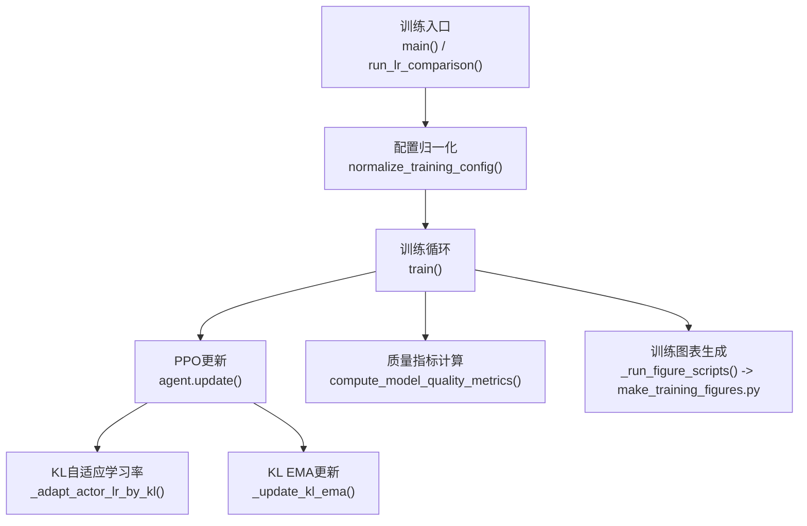
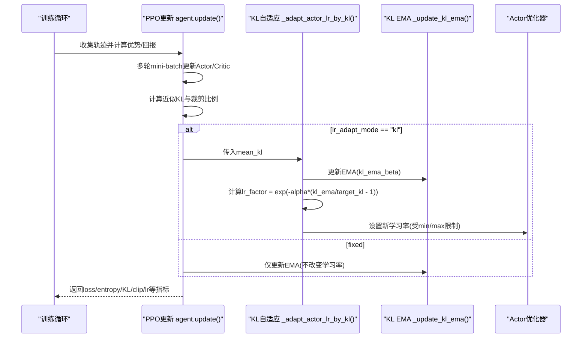
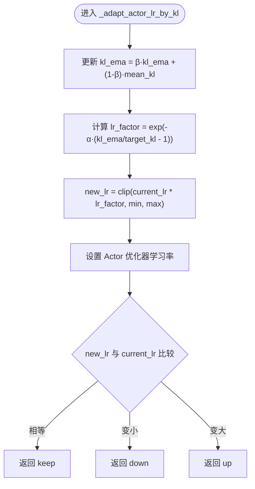
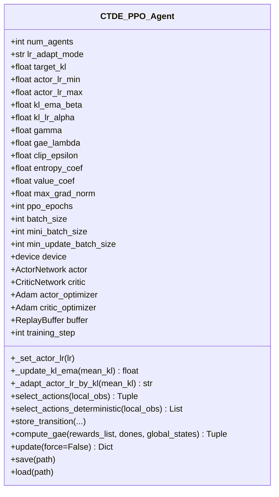
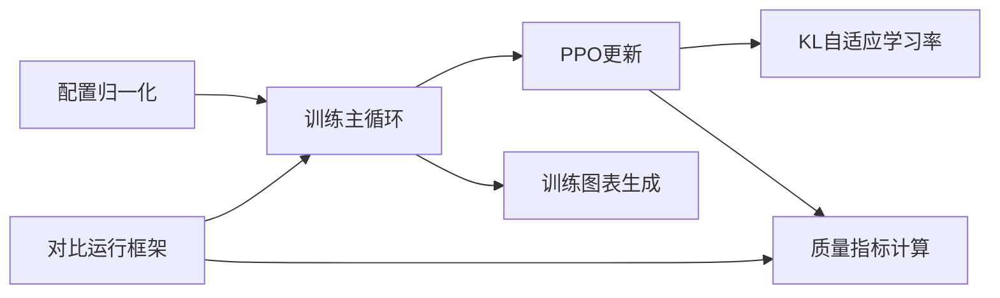

# 自适应学习率机制

<cite>
**本文引用的文件**   
- [ctde_ppo_baseline_train.py](file://environment_variables/environment_variables/ctde_ppo_baseline_train.py)
- [make_training_figures.py](file://environment_variables/environment_variables/outputs/make_training_figures.py)
</cite>

## 目录
1. [引言](#引言)
2. [项目结构](#项目结构)
3. [核心组件](#核心组件)
4. [架构总览](#架构总览)
5. [详细组件分析](#详细组件分析)
6. [依赖关系分析](#依赖关系分析)
7. [性能与稳定性考量](#性能与稳定性考量)
8. [故障排查指南](#故障排查指南)
9. [结论](#结论)
10. [附录：参数调优与实践建议](#附录参数调优与实践建议)

## 引言
本技术文档聚焦于基于KL散度的动态学习率调整策略，系统阐述其数学原理、实现细节与工程实践。该机制在PPO更新后根据近似KL散度与目标KL的偏差，通过指数移动平均（EMA）平滑与指数缩放因子对Actor学习率进行自适应调节，并提供固定学习率模式作为对照。文档同时给出关键参数的调优指南、监控指标与诊断方法，以及在不同训练场景下的策略选择建议。

## 项目结构
本项目将自适应学习率逻辑内嵌于CTDE-PPO基线训练脚本中，并通过对比运行框架在同一批随机种子下并行执行“固定学习率”和“KL自适应学习率”两种变体，输出统一的质量指标与可视化图表。

**图示来源** 
- [ctde_ppo_baseline_train.py:1922-2079](file://environment_variables/environment_variables/ctde_ppo_baseline_train.py#L1922-L2079)
- [ctde_ppo_baseline_train.py:1600-1813](file://environment_variables/environment_variables/ctde_ppo_baseline_train.py#L1600-L1813)
- [ctde_ppo_baseline_train.py:357-433](file://environment_variables/environment_variables/ctde_ppo_baseline_train.py#L357-L433)
- [make_training_figures.py:826](file://environment_variables/environment_variables/outputs/make_training_figures.py#L826)

**章节来源**
- [ctde_ppo_baseline_train.py:1922-2079](file://environment_variables/environment_variables/ctde_ppo_baseline_train.py#L1922-L2079)
- [ctde_ppo_baseline_train.py:1600-1813](file://environment_variables/environment_variables/ctde_ppo_baseline_train.py#L1600-L1813)
- [ctde_ppo_baseline_train.py:357-433](file://environment_variables/environment_variables/ctde_ppo_baseline_train.py#L357-L433)
- [make_training_figures.py:826](file://environment_variables/environment_variables/outputs/make_training_figures.py#L826)

## 核心组件
- CTDE_PPO_Agent：封装Actor/Critic网络、优化器、经验回放缓冲、GAE计算、PPO多轮更新，并在每次更新后根据模式决定是否调用KL自适应学习率。
- KL自适应学习率模块：维护KL散度的EMA，依据当前EMA与目标KL的相对误差计算指数缩放因子，对Actor学习率进行上/下调，并受上下限约束。
- 质量指标与监控：统计AUC、尾部方差、KL均值/方差、超限率、裁剪比例等，用于评估收敛效率与稳定性。
- 对比运行框架：自动构造“固定学习率”和“KL自适应学习率”两个变体，在多随机种子下并行训练并汇总结果与图表。

**章节来源**
- [ctde_ppo_baseline_train.py:759-834](file://environment_variables/environment_variables/ctde_ppo_baseline_train.py#L759-L834)
- [ctde_ppo_baseline_train.py:835-847](file://environment_variables/environment_variables/ctde_ppo_baseline_train.py#L835-L847)
- [ctde_ppo_baseline_train.py:889-991](file://environment_variables/environment_variables/ctde_ppo_baseline_train.py#L889-L991)
- [ctde_ppo_baseline_train.py:357-433](file://environment_variables/environment_variables/ctde_ppo_baseline_train.py#L357-L433)
- [ctde_ppo_baseline_train.py:1922-2079](file://environment_variables/environment_variables/ctde_ppo_baseline_train.py#L1922-L2079)

## 架构总览
下图展示KL自适应学习率在PPO更新流程中的位置与数据流：

**图示来源** 
- [ctde_ppo_baseline_train.py:889-991](file://environment_variables/environment_variables/ctde_ppo_baseline_train.py#L889-L991)
- [ctde_ppo_baseline_train.py:835-847](file://environment_variables/environment_variables/ctde_ppo_baseline_train.py#L835-L847)
- [ctde_ppo_baseline_train.py:828-834](file://environment_variables/environment_variables/ctde_ppo_baseline_train.py#L828-L834)

## 详细组件分析

### 基于KL散度的动态学习率调整
- 数学原理
  - 近似KL散度：在PPO更新过程中，使用新旧策略log概率比的对数差与线性项之差估计KL散度，即 ((ratio - 1) - log_ratio) 的均值。
  - 目标控制：以target_kl为参考，衡量当前EMA(KL)相对目标的偏离程度。
  - 指数缩放因子：采用 exp(-α·(kl_ema/target_kl - 1)) 的形式，当kl_ema > target_kl时因子小于1，降低学习率；当kl_ema < target_kl时因子大于1，提升学习率。
  - 指数移动平均：kl_ema = β·kl_ema + (1-β)·mean_kl，用于平滑KL波动，避免单次更新噪声导致的学习率震荡。
  - 学习率边界：最终学习率被截断到[actor_lr_min, actor_lr_max]区间，防止过大或过小步长破坏训练。
- 实现要点
  - 在PPO更新结束后，若启用KL模式，则调用自适应函数；否则仅更新EMA但不改变学习率。
  - 自适应函数内部先更新EMA，再计算缩放因子，最后设置新的Actor学习率。
  - 返回动作类型“keep/down/up”，便于日志记录与分析。

**图示来源** 
- [ctde_ppo_baseline_train.py:835-847](file://environment_variables/environment_variables/ctde_ppo_baseline_train.py#L835-L847)
- [ctde_ppo_baseline_train.py:828-834](file://environment_variables/environment_variables/ctde_ppo_baseline_train.py#L828-L834)

**章节来源**
- [ctde_ppo_baseline_train.py:835-847](file://environment_variables/environment_variables/ctde_ppo_baseline_train.py#L835-L847)
- [ctde_ppo_baseline_train.py:828-834](file://environment_variables/environment_variables/ctde_ppo_baseline_train.py#L828-L834)
- [ctde_ppo_baseline_train.py:889-991](file://environment_variables/environment_variables/ctde_ppo_baseline_train.py#L889-L991)

### PPO更新与KL散度计算
- 优势与回报：使用GAE计算advantages与returns，并进行标准化处理。
- Actor损失：采用带熵正则的 clipped surrogate loss。
- Critic损失：MSE损失预测returns。
- KL与裁剪比例：在no_grad下计算approx_kl与clip_fraction，用于监控与自适应。
- 学习率切换：根据lr_adapt_mode决定是调用自适应还是仅更新EMA。

**图示来源** 
- [ctde_ppo_baseline_train.py:759-834](file://environment_variables/environment_variables/ctde_ppo_baseline_train.py#L759-L834)
- [ctde_ppo_baseline_train.py:835-847](file://environment_variables/environment_variables/ctde_ppo_baseline_train.py#L835-L847)
- [ctde_ppo_baseline_train.py:889-991](file://environment_variables/environment_variables/ctde_ppo_baseline_train.py#L889-L991)

**章节来源**
- [ctde_ppo_baseline_train.py:889-991](file://environment_variables/environment_variables/ctde_ppo_baseline_train.py#L889-L991)

### 固定学习率与自适应学习率的切换逻辑
- 配置开关：lr_adapt_mode ∈ {"fixed", "kl"}，由配置归一化阶段校验与规范化。
- 行为差异：
  - fixed：不改变Actor学习率，仅更新KL EMA用于后续质量指标统计。
  - kl：每轮更新后根据KL EMA与target_kl的相对误差计算缩放因子，更新Actor学习率。
- 适用场景：
  - fixed：适合快速验证、稳定环境、或对学习率调度有外部计划的情况。
  - kl：适合需要在线稳定性的复杂任务，能抑制策略突变导致的发散风险。

**章节来源**
- [ctde_ppo_baseline_train.py:232-239](file://environment_variables/environment_variables/ctde_ppo_baseline_train.py#L232-L239)
- [ctde_ppo_baseline_train.py:974-978](file://environment_variables/environment_variables/ctde_ppo_baseline_train.py#L974-L978)

### 监控指标与诊断方法
- 收敛效率：按步骤计算的AUC、达到阈值所需步数/更新次数。
- 奖励稳定性：尾部reward与task_score的标准差、滚动均值的下降幅度。
- KL稳定性：KL均值/方差、绝对误差、超限率（超过2×target_kl的比例）、裁剪比例均值/方差、Actor学习率均值/范围、更新次数。
- 可视化：训练曲线与KL EMA曲线绘制，便于观察自适应效果。

**章节来源**
- [ctde_ppo_baseline_train.py:357-433](file://environment_variables/environment_variables/ctde_ppo_baseline_train.py#L357-L433)
- [make_training_figures.py:826](file://environment_variables/environment_variables/outputs/make_training_figures.py#L826)

## 依赖关系分析
- 模块耦合
  - 自适应学习率依赖于PPO更新的KL与裁剪比例统计，二者在同一个update流程中计算。
  - 质量指标模块依赖training_log中的ppo_updates、approx_kl、clip_fraction、actor_lr序列。
  - 对比运行框架依赖配置归一化与训练主循环，自动生成两种变体的输出与图表。
- 外部依赖
  - PyTorch张量与分布操作用于策略采样与KL估计。
  - NumPy用于数值统计与数组操作。
  - 子进程调用绘图脚本生成可视化。

**图示来源** 
- [ctde_ppo_baseline_train.py:1922-2079](file://environment_variables/environment_variables/ctde_ppo_baseline_train.py#L1922-L2079)
- [ctde_ppo_baseline_train.py:357-433](file://environment_variables/environment_variables/ctde_ppo_baseline_train.py#L357-L433)
- [ctde_ppo_baseline_train.py:1053-1087](file://environment_variables/environment_variables/ctde_ppo_baseline_train.py#L1053-L1087)

**章节来源**
- [ctde_ppo_baseline_train.py:1922-2079](file://environment_variables/environment_variables/ctde_ppo_baseline_train.py#L1922-L2079)
- [ctde_ppo_baseline_train.py:357-433](file://environment_variables/environment_variables/ctde_ppo_baseline_train.py#L357-L433)
- [ctde_ppo_baseline_train.py:1053-1087](file://environment_variables/environment_variables/ctde_ppo_baseline_train.py#L1053-L1087)

## 性能与稳定性考量
- 时间复杂度
  - 自适应学习率每轮更新仅涉及常数时间的EMA与指数运算，开销可忽略。
  - 主要计算集中在PPO的多轮mini-batch更新与GAE计算。
- 空间复杂度
  - 额外状态仅为标量kl_ema与优化器学习率，内存占用极低。
- 稳定性
  - EMA平滑有效抑制KL噪声引起的学习率抖动。
  - 指数缩放因子在KL接近目标时变化平缓，远离目标时响应更明显。
  - 学习率上下限保障极端情况下的安全边界。

[本节为通用讨论，无需具体文件引用]

## 故障排查指南
- 常见问题
  - KL超限率高：检查target_kl是否过小、kl_lr_alpha是否过大导致过度缩减或放大。
  - 学习率频繁震荡：增大kl_ema_beta以降低敏感度，或减小kl_lr_alpha。
  - 学习率触顶/触底：扩大actor_lr_max/min范围，或调整初始actor_lr。
  - 裁剪比例过高：说明策略更新步幅过大，考虑降低actor_lr或增大clip_epsilon。
- 诊断路径
  - 查看model_quality_metrics.json中的kl_stability字段，关注kl_overshoot_rate、actor_lr_min/max、clip_fraction_mean/std。
  - 观察训练图表中的KL EMA曲线与学习率曲线，确认自适应趋势是否符合预期。
  - 对比固定与KL模式的AUC与尾部标准差，评估稳定性收益。

**章节来源**
- [ctde_ppo_baseline_train.py:357-433](file://environment_variables/environment_variables/ctde_ppo_baseline_train.py#L357-L433)
- [ctde_ppo_baseline_train.py:1600-1813](file://environment_variables/environment_variables/ctde_ppo_baseline_train.py#L1600-L1813)

## 结论
基于KL散度的自适应学习率机制通过EMA平滑与指数缩放因子，实现了在线稳定的学习率调节。其在复杂环境中能有效抑制策略突变带来的不稳定，配合严格的上下限约束与完善的监控指标，提升了训练的鲁棒性与可解释性。对于追求稳定性的任务，推荐优先尝试KL自适应模式；对于快速迭代或已有明确调度计划的场景，固定学习率仍具实用价值。

[本节为总结性内容，无需具体文件引用]

## 附录：参数调优与实践建议
- 关键参数
  - target_kl：控制策略更新的容忍度，常见取值在1e-3~1e-2之间。
  - kl_ema_beta：EMA平滑系数，越大越平滑但响应慢，建议在0.85~0.99间调参。
  - kl_lr_alpha：缩放灵敏度，越大对KL偏离越敏感，建议从0.05~0.2开始。
  - actor_lr_min/actor_lr_max：学习率边界，确保不会过小导致停滞或过大导致发散。
  - clip_epsilon：PPO裁剪范围，影响策略更新步幅与KL大小。
- 调优建议
  - 先固定其他超参，逐步调整kl_lr_alpha与kl_ema_beta，观察KL EMA与学习率曲线的联动。
  - 若KL超限率高且学习率频繁下调，适当增大target_kl或减小kl_lr_alpha。
  - 若学习率长期处于上限，可适当提高target_kl或增大clip_epsilon。
  - 结合AUC与尾部标准差综合评估，优先选择KL超限率低且尾部稳定的配置。
- 最佳实践
  - 使用对比运行框架在多随机种子下评估，避免单一样本的偶然性。
  - 保存模型质量指标与评估结果，建立回归基准以便后续改进。
  - 在训练后期可固定学习率或进一步衰减，以精细收敛。

**章节来源**
- [ctde_ppo_baseline_train.py:232-239](file://environment_variables/environment_variables/ctde_ppo_baseline_train.py#L232-L239)
- [ctde_ppo_baseline_train.py:1922-2079](file://environment_variables/environment_variables/ctde_ppo_baseline_train.py#L1922-L2079)
- [ctde_ppo_baseline_train.py:357-433](file://environment_variables/environment_variables/ctde_ppo_baseline_train.py#L357-L433)