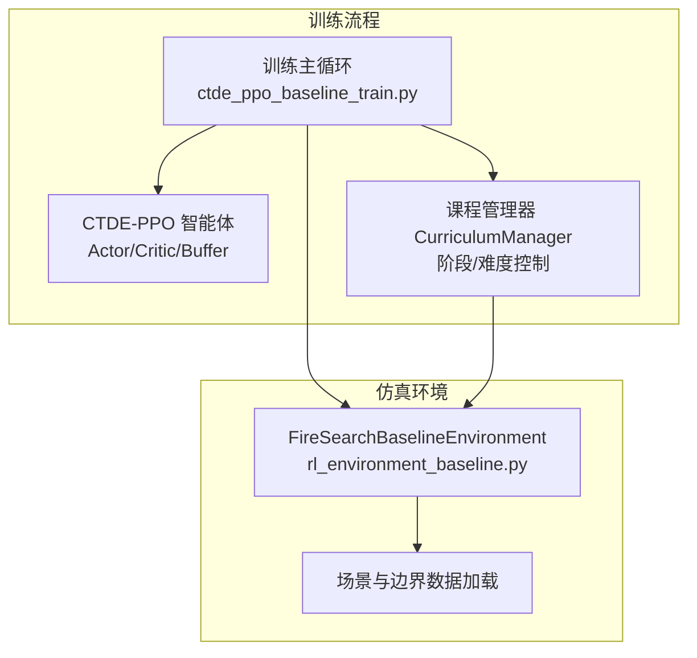
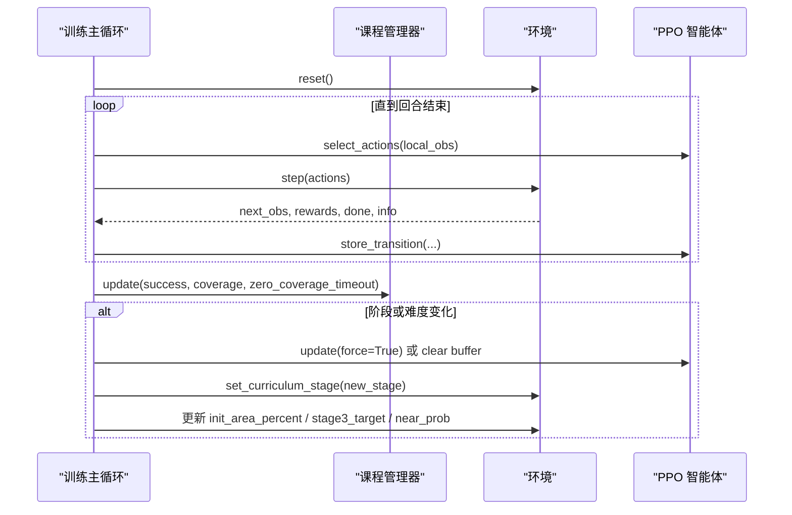
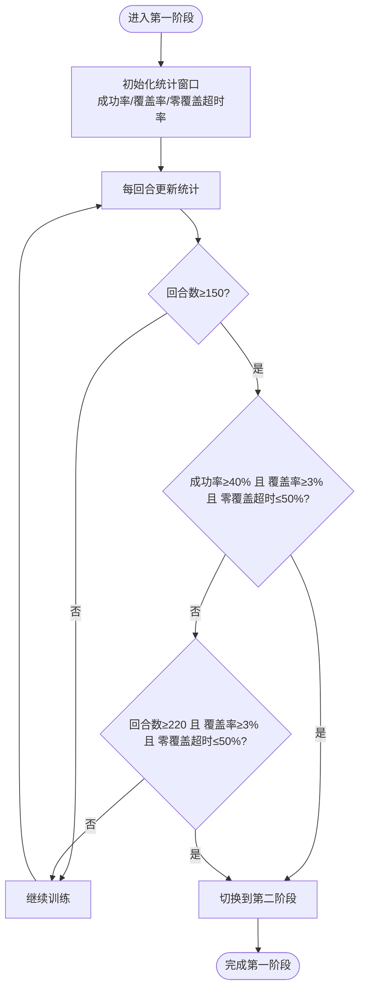
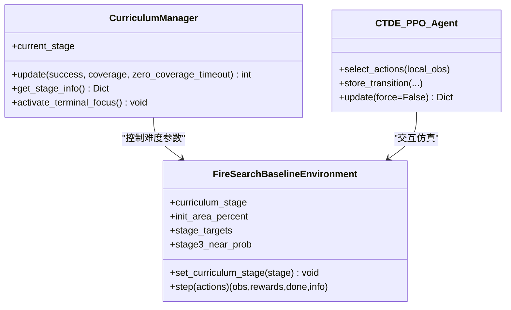

# 第一阶段：基础搜索能力培养

<cite>
**本文引用的文件**   
- [ctde_ppo_baseline_train.py](file://environment_variables/environment_variables/ctde_ppo_baseline_train.py)
- [rl_environment_baseline.py](file://environment_variables/environment_variables/rl_environment_baseline.py)
</cite>

## 目录
1. [引言](#引言)
2. [项目结构](#项目结构)
3. [核心组件](#核心组件)
4. [架构总览](#架构总览)
5. [详细组件分析](#详细组件分析)
6. [依赖关系分析](#依赖关系分析)
7. [性能与稳定性考量](#性能与稳定性考量)
8. [故障排查指南](#故障排查指南)
9. [结论](#结论)
10. [附录](#附录)

## 引言
本文件面向课程学习“第一阶段：基础搜索能力培养”，聚焦于让无人机学会基本的火灾边界搜索技能。该阶段通过渐进式难度提升，从极小的初始区域开始训练，逐步提高成功率、覆盖率并控制零覆盖超时率，最终平稳过渡到更高难度的后续阶段。文档将系统阐述该阶段的训练目标、关键阈值与推进条件、回合数约束、监控指标计算方式、阶段切换逻辑、调优建议以及评估与诊断方法。

## 项目结构
本项目采用“环境 + 训练器 + 课程管理器”的清晰分层：
- 环境层：提供多无人机火灾边界搜索仿真、观测与奖励计算、终止判定等。
- 训练层：CTDE-PPO 算法实现、经验回放、策略更新、日志记录与输出。
- 课程管理层：按阶段动态调整初始区域百分比、目标成功率、近端生成概率等，驱动渐进式难度。

图表来源
- [ctde_ppo_baseline_train.py:1278-1599](file://environment_variables/environment_variables/ctde_ppo_baseline_train.py#L1278-L1599)
- [rl_environment_baseline.py:21-158](file://environment_variables/environment_variables/rl_environment_baseline.py#L21-L158)

章节来源
- [ctde_ppo_baseline_train.py:1278-1599](file://environment_variables/environment_variables/ctde_ppo_baseline_train.py#L1278-L1599)
- [rl_environment_baseline.py:21-158](file://environment_variables/environment_variables/rl_environment_baseline.py#L21-L158)

## 核心组件
- 课程管理器（CurriculumManager）：维护当前阶段、各阶段统计窗口、阈值与最小/最大回合数，负责阶段切换与难度参数（初始区域百分比、near_prob、stage3_target）的动态调整。
- 环境（FireSearchBaselineEnvironment）：提供观测、动作执行、边界发现、覆盖率计算、终止判定与奖励分解；根据课程阶段调整行为与目标。
- 训练器（CTDE_PPO_Agent）：PPO 策略梯度更新、KL 自适应学习率、GAE 优势估计、批量更新与日志收集。

章节来源
- [ctde_ppo_baseline_train.py:569-758](file://environment_variables/environment_variables/ctde_ppo_baseline_train.py#L569-L758)
- [rl_environment_baseline.py:21-158](file://environment_variables/environment_variables/rl_environment_baseline.py#L21-L158)
- [ctde_ppo_baseline_train.py:759-991](file://environment_variables/environment_variables/ctde_ppo_baseline_train.py#L759-L991)

## 架构总览
下图展示第一阶段的关键控制流：训练主循环每回合结束后调用课程管理器更新阶段与难度，若发生阶段或难度变化则清理或强制更新缓冲，随后同步环境参数。

图表来源
- [ctde_ppo_baseline_train.py:1469-1599](file://environment_variables/environment_variables/ctde_ppo_baseline_train.py#L1469-L1599)
- [rl_environment_baseline.py:994-1018](file://environment_variables/environment_variables/rl_environment_baseline.py#L994-L1018)

## 详细组件分析

### 课程管理器（第一阶段）
- 初始区域百分比设置
  - 阶梯列表包含 1.0% 作为起始值，随成功率达标逐步提升。
- 成功率阈值要求
  - 第一阶段成功率为 40%，用于判断是否具备推进能力。
- 覆盖率强制推进条件
  - 平均覆盖率需达到 3% 以上，作为“能力就绪”的必要条件之一。
- 零覆盖超时率限制
  - 零覆盖超时率需低于 50%，避免模型完全无法探索有效区域。
- 回合数约束
  - 最小回合数 150，确保有足够样本稳定估计成功率与覆盖率。
  - 最大回合数 220，在满足覆盖率与零覆盖超时条件时允许提前退出，防止过拟合低难度。
- 阶段切换条件（第一阶段 → 第二阶段）
  - 当同时满足：
    - 已训练至少 150 回合
    - 成功率 ≥ 40%
    - 平均覆盖率 ≥ 3%
    - 零覆盖超时率 ≤ 50%
    或达到最大回合数且仍满足覆盖率与零覆盖超时条件时，自动切换到下一阶段。

图表来源
- [ctde_ppo_baseline_train.py:569-758](file://environment_variables/environment_variables/ctde_ppo_baseline_train.py#L569-L758)

章节来源
- [ctde_ppo_baseline_train.py:569-758](file://environment_variables/environment_variables/ctde_ppo_baseline_train.py#L569-L758)

### 环境（第一阶段行为与奖励）
- 初始区域百分比传递
  - 环境构造时接收 init_area_percent，并在加载新场景时传递给场景初始化函数，从而控制初始火边界的规模与位置分布。
- 近端生成概率（near spawn）
  - 第一阶段使用较高的近端生成概率，使无人机更容易靠近火边界进行探索，加速边界发现。
- 终止条件
  - 第一阶段以“发现至少 5 个边界点”为任务完成标志，便于快速获得正反馈，建立基础搜索能力。
- 超时惩罚与零覆盖超时
  - 若回合结束时未完成任务，施加基于覆盖率缺口的惩罚；若覆盖率为零，额外增加惩罚，强化探索动机。

章节来源
- [rl_environment_baseline.py:159-207](file://environment_variables/environment_variables/rl_environment_baseline.py#L159-L207)
- [rl_environment_baseline.py:362-436](file://environment_variables/environment_variables/rl_environment_baseline.py#L362-L436)
- [rl_environment_baseline.py:824-841](file://environment_variables/environment_variables/rl_environment_baseline.py#L824-L841)
- [rl_environment_baseline.py:943-962](file://environment_variables/environment_variables/rl_environment_baseline.py#L943-L962)

### 训练主循环与监控指标
- 任务得分计算
  - 综合覆盖率、成功率与效率（步数占比），形成统一的任务得分，用于滚动统计与质量评估。
- 滚动统计窗口
  - 对奖励、长度、覆盖率、成功率、任务得分、超时率、零覆盖超时率维护固定长度的滑动窗口，用于阶段性日志输出与趋势观察。
- 阶段信息输出
  - 每回合打印当前阶段、场景、奖励均值、步数均值、覆盖率、成功率、任务得分、超时率、零覆盖超时率、KL 与学习率等信息，便于实时监控。

章节来源
- [ctde_ppo_baseline_train.py:295-298](file://environment_variables/environment_variables/ctde_ppo_baseline_train.py#L295-L298)
- [ctde_ppo_baseline_train.py:1385-1452](file://environment_variables/environment_variables/ctde_ppo_baseline_train.py#L1385-L1452)
- [ctde_ppo_baseline_train.py:1588-1599](file://environment_variables/environment_variables/ctde_ppo_baseline_train.py#L1588-L1599)

## 依赖关系分析
- 课程管理器与环境耦合
  - 课程管理器通过 env.set_curriculum_stage 与 env.stage_targets/near_prob/init_area_percent 直接控制环境行为。
- 训练主循环与 PPO 智能体
  - 训练主循环负责回合采样、缓冲存储、批量更新与日志记录；智能体负责策略选择与网络更新。
- 环境与数据模块
  - 环境依赖场景管理器加载地图与边界数据，并根据课程阶段调整传感器半径与最大步数等元参数。

图表来源
- [ctde_ppo_baseline_train.py:569-758](file://environment_variables/environment_variables/ctde_ppo_baseline_train.py#L569-L758)
- [rl_environment_baseline.py:994-1018](file://environment_variables/environment_variables/rl_environment_baseline.py#L994-L1018)
- [ctde_ppo_baseline_train.py:759-991](file://environment_variables/environment_variables/ctde_ppo_baseline_train.py#L759-L991)

章节来源
- [ctde_ppo_baseline_train.py:569-758](file://environment_variables/environment_variables/ctde_ppo_baseline_train.py#L569-L758)
- [rl_environment_baseline.py:994-1018](file://environment_variables/environment_variables/rl_environment_baseline.py#L994-L1018)
- [ctde_ppo_baseline_train.py:759-991](file://environment_variables/environment_variables/ctde_ppo_baseline_train.py#L759-L991)

## 性能与稳定性考量
- KL 自适应学习率
  - 支持固定与 KL 自适应两种模式；KL 过大时降低学习率，过小则适度提升，有助于稳定策略更新。
- 批量更新与最小批次
  - 使用最小批次大小保证在阶段切换时能尽快消化旧缓存，避免策略漂移。
- 终端专注（Terminal Focus）
  - 在最后若干回合强制将目标与 near_prob 设为最终值，促使模型收敛到期望能力水平。

章节来源
- [ctde_ppo_baseline_train.py:823-848](file://environment_variables/environment_variables/ctde_ppo_baseline_train.py#L823-L848)
- [ctde_ppo_baseline_train.py:1470-1487](file://environment_variables/environment_variables/ctde_ppo_baseline_train.py#L1470-L1487)

## 故障排查指南
- 常见问题与定位
  - 长时间停留在第一阶段：检查成功率、覆盖率与零覆盖超时率是否持续低于阈值；确认最小/最大回合数配置是否符合预期。
  - 零覆盖超时率过高：说明模型未能发现任何边界点，可考虑增大 near spawn 概率或调整初始区域百分比。
  - 覆盖率增长缓慢：检查预边界引导奖励与重复惩罚是否合理，必要时微调权重。
- 诊断指标
  - 关注滚动窗口中的“零覆盖超时率”、“覆盖率”、“成功率”与“任务得分”曲线；结合 KL 与 clip fraction 判断策略更新是否稳定。
- 日志与可视化
  - 训练控制台日志包含每回合关键指标；可使用提供的绘图脚本生成训练与泛化评估图表，辅助定位问题。

章节来源
- [ctde_ppo_baseline_train.py:1385-1452](file://environment_variables/environment_variables/ctde_ppo_baseline_train.py#L1385-L1452)
- [ctde_ppo_baseline_train.py:1588-1599](file://environment_variables/environment_variables/ctde_ppo_baseline_train.py#L1588-L1599)

## 结论
第一阶段通过严格的成功率、覆盖率与零覆盖超时率门槛，配合最小/最大回合数约束，确保无人机在可控难度下掌握基础的火灾边界搜索能力。课程管理器驱动的渐进式难度提升与终端专注机制，进一步保障训练的稳定性和收敛性。建议在训练中密切监控关键指标，依据实际表现微调 near spawn 概率、初始区域百分比与奖励权重，以获得更稳健的学习效果。

## 附录

### 阶段切换条件与监控指标计算方法
- 阶段切换条件（第一阶段 → 第二阶段）
  - 能力就绪：回合数 ≥ 150 且 成功率 ≥ 40% 且 平均覆盖率 ≥ 3% 且 零覆盖超时率 ≤ 50%
  - 强制推进：回合数 ≥ 220 且 平均覆盖率 ≥ 3% 且 零覆盖超时率 ≤ 50%
- 监控指标
  - 任务得分 = 0.5 × 覆盖率 + 0.3 × 成功率 + 0.2 × 效率（效率 = 1 − 步数/最大步数）
  - 滚动窗口统计：奖励、长度、覆盖率、成功率、任务得分、超时率、零覆盖超时率
  - KL 与 clip fraction：衡量策略更新的稳定性

章节来源
- [ctde_ppo_baseline_train.py:295-298](file://environment_variables/environment_variables/ctde_ppo_baseline_train.py#L295-L298)
- [ctde_ppo_baseline_train.py:569-758](file://environment_variables/environment_variables/ctde_ppo_baseline_train.py#L569-L758)
- [ctde_ppo_baseline_train.py:1385-1452](file://environment_variables/environment_variables/ctde_ppo_baseline_train.py#L1385-L1452)