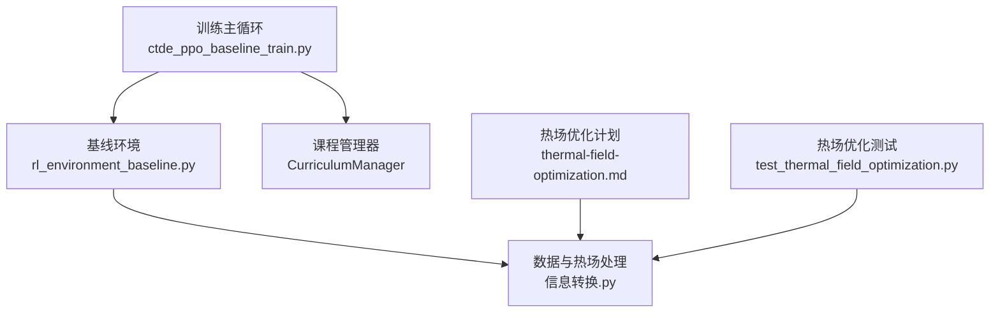
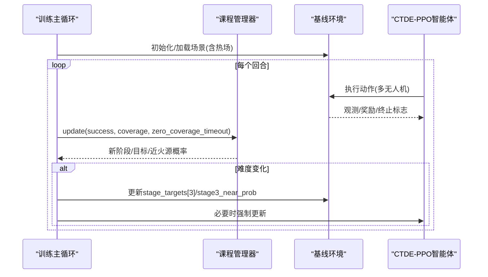
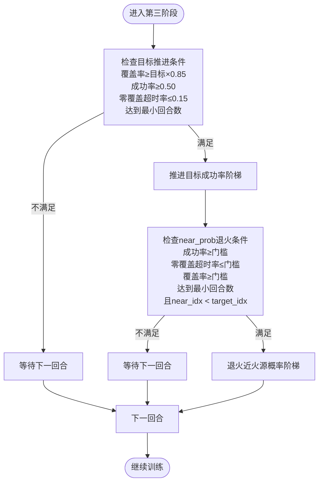
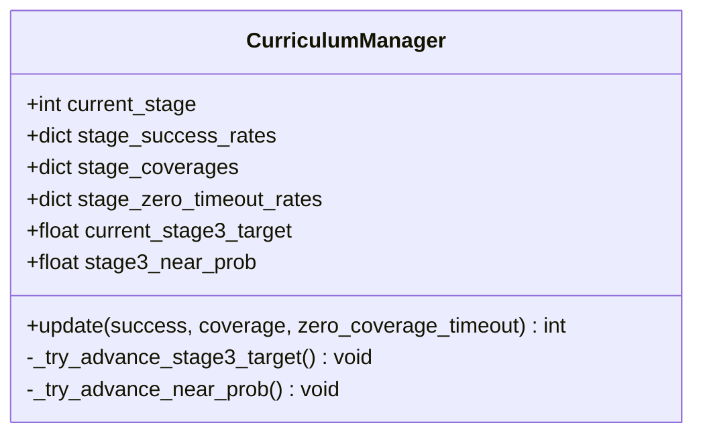
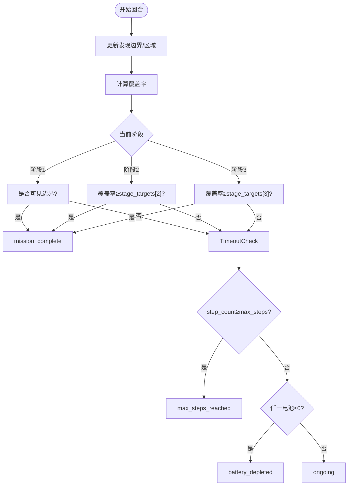
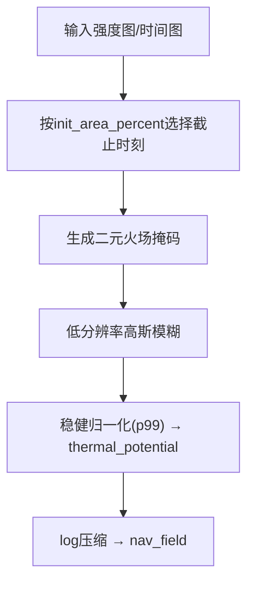
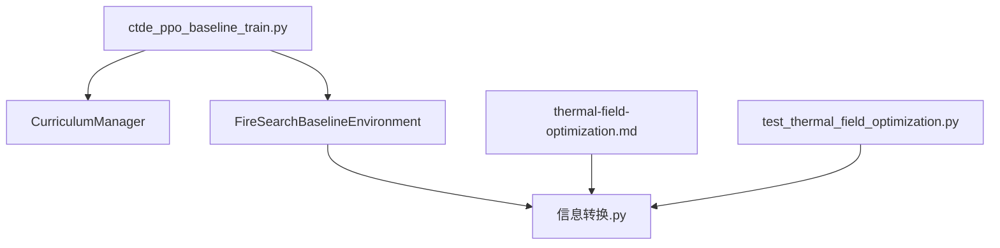
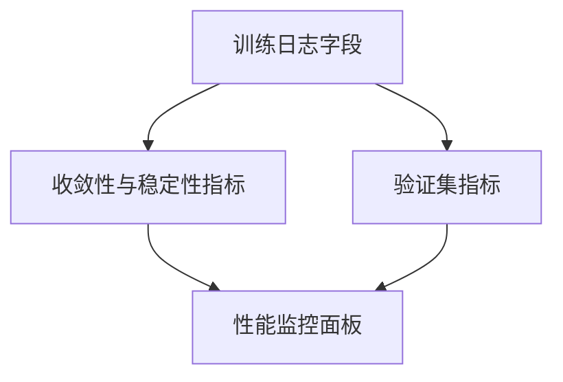

# 第三阶段：高难度任务挑战

<cite>
**本文引用的文件**   
- [ctde_ppo_baseline_train.py](file://environment_variables/environment_variables/ctde_ppo_baseline_train.py)
- [rl_environment_baseline.py](file://environment_variables/environment_variables/rl_environment_baseline.py)
- [信息转换.py](file://environment_variables/environment_variables/信息转换.py)
- [2026-07-06-thermal-field-optimization.md](file://docs/superpowers/plans/2026-07-06-thermal-field-optimization.md)
- [test_thermal_field_optimization.py](file://environment_variables/environment_variables/test_thermal_field_optimization.py)
</cite>

## 目录
1. [引言](#引言)
2. [项目结构](#项目结构)
3. [核心组件](#核心组件)
4. [架构总览](#架构总览)
5. [详细组件分析](#详细组件分析)
6. [依赖关系分析](#依赖关系分析)
7. [性能考量与监控指标](#性能考量与监控指标)
8. [故障排查指南](#故障排查指南)
9. [结论](#结论)
10. [附录](#附录)

## 引言
本技术文档聚焦课程学习第三阶段的高难度任务挑战，系统阐述该阶段的三大核心机制与能力要求：
- 目标成功率阶梯式提升：从初始20%逐步提升至最终目标60%，通过严格的能力门槛控制推进。
- 近火源生成概率退火：从0.25逐步降低到0，采用“能力绑定”的阶梯式退火方案，确保模型在具备足够能力后再减少环境难度。
- 严格的能力门槛控制：以成功率、零覆盖超时率、最低覆盖率三维度联合约束，配合每级退火的最低回合数要求，保障训练收敛质量。

同时，文档说明该阶段如何实现从基础搜索到高级战术决策的能力跃升，包括复杂地形适应、多无人机协同优化等高级技能，并提供性能监控指标、收敛性分析与调优策略。

## 项目结构
围绕第三阶段的关键实现集中在以下模块：
- 课程管理与训练主循环：负责阶段切换、目标推进、near_prob退火、日志记录与环境参数同步。
- 基线环境：提供多无人机边界搜索任务接口、终止条件判定、奖励分解与观测空间定义。
- 数据与热场处理：场景索引、边界点初始化、热场语义重建与导航场计算。
- 热场优化计划与测试：低分辨率滤波、缓存策略与回归验证。

**图表来源** 
- [ctde_ppo_baseline_train.py:569-751](file://environment_variables/environment_variables/ctde_ppo_baseline_train.py#L569-L751)
- [rl_environment_baseline.py:21-157](file://environment_variables/environment_variables/rl_environment_baseline.py#L21-L157)
- [信息转换.py:1-199](file://environment_variables/environment_variables/信息转换.py#L1-L199)
- [2026-07-06-thermal-field-optimization.md:41-111](file://docs/superpowers/plans/2026-07-06-thermal-field-optimization.md#L41-L111)
- [test_thermal_field_optimization.py:1-37](file://environment_variables/environment_variables/test_thermal_field_optimization.py#L1-L37)

**章节来源**
- [ctde_ppo_baseline_train.py:569-751](file://environment_variables/environment_variables/ctde_ppo_baseline_train.py#L569-L751)
- [rl_environment_baseline.py:21-157](file://environment_variables/environment_variables/rl_environment_baseline.py#L21-L157)
- [信息转换.py:1-199](file://environment_variables/environment_variables/信息转换.py#L1-L199)

## 核心组件
- 课程管理器（CurriculumManager）
  - 维护阶段状态、成功率/覆盖率/零覆盖超时率的滑动窗口统计。
  - 管理第三阶段目标成功率阶梯（20%→35%→50%→60%），以及近火源生成概率阶梯（0.25→0.15→0.05→0）。
  - 实施能力绑定阶梯式退火：每级退火需满足成功率、零覆盖超时率、最低覆盖率门槛，并达到最低回合数。
- 基线环境（FireSearchBaselineEnvironment）
  - 提供多无人机离散动作空间、局部观测与全局状态。
  - 根据当前阶段目标判定任务完成或超时，驱动奖励信号与终止条件。
- 数据与热场处理（SceneManager/FireSceneData）
  - 场景索引与边界点初始化；热场语义重建与导航场计算，支持低分辨率滤波与缓存以提升性能。

**章节来源**
- [ctde_ppo_baseline_train.py:569-751](file://environment_variables/environment_variables/ctde_ppo_baseline_train.py#L569-L751)
- [rl_environment_baseline.py:21-157](file://environment_variables/environment_variables/rl_environment_baseline.py#L21-L157)
- [信息转换.py:743-839](file://environment_variables/environment_variables/信息转换.py#L743-L839)

## 架构总览
第三阶段训练流程由课程管理器主导，动态调整环境难度与评估目标，并通过严格的评估标准控制退火进度。

**图表来源** 
- [ctde_ppo_baseline_train.py:1523-1581](file://environment_variables/environment_variables/ctde_ppo_baseline_train.py#L1523-L1581)
- [ctde_ppo_baseline_train.py:621-738](file://environment_variables/environment_variables/ctde_ppo_baseline_train.py#L621-L738)
- [rl_environment_baseline.py:525-559](file://environment_variables/environment_variables/rl_environment_baseline.py#L525-L559)

## 详细组件分析

### 课程管理器与第三阶段机制
- 目标成功率阶梯式提升
  - 目标阶梯：STAGE3_TARGET_LADDER = [0.20, 0.35, 0.50, final_target]，默认final_target=0.60。
  - 推进条件：在第三阶段内，当平均覆盖率≥当前目标的85%、成功率≥0.50、零覆盖超时率≤0.15，且达到最小回合数时，推进至下一级目标。
- 近火源生成概率退火（能力绑定阶梯式）
  - 近火源概率阶梯：STAGE3_NEAR_LADDER = [0.25, 0.15, 0.05, 0.0]。
  - 每级退火门槛（成功率、最大零覆盖超时率、最低覆盖率）：
    - 第1级（0.25→0.15）：成功率≥0.30，零覆盖超时率≤0.20，覆盖率≥0.25
    - 第2级（0.15→0.05）：成功率≥0.40，零覆盖超时率≤0.15，覆盖率≥0.35
    - 第3级（0.05→0.00）：成功率≥0.50，零覆盖超时率≤0.10，覆盖率≥0.45
  - 每级最少回合数：STAGE3_NEAR_MIN_EPS = [80, 100, 120]。
  - 关键约束：near_prob退火不超前于target推进，即_s3_near_idx不得大于_s3_target_idx。
- 严格的能力门槛控制
  - 第三阶段推进还需满足：平均覆盖率≥当前目标×0.85、成功率≥0.50、零覆盖超时率≤0.15。
  - 最后300回合可激活终端聚焦，强制切换到最终目标与near_prob=0.0，用于稳定评估。

**图表来源** 
- [ctde_ppo_baseline_train.py:684-738](file://environment_variables/environment_variables/ctde_ppo_baseline_train.py#L684-L738)

**章节来源**
- [ctde_ppo_baseline_train.py:569-751](file://environment_variables/environment_variables/ctde_ppo_baseline_train.py#L569-L751)

### 近火源生成概率退火的具体实现
- 属性与常量
  - STAGE3_NEAR_SPAWN_INIT = 0.25
  - STAGE3_NEAR_LADDER = [0.25, 0.15, 0.05, 0.0]
  - STAGE3_NEAR_MIN_EPS = [80, 100, 120]
  - STAGE3_NEAR_GATES = [(0.30,0.20,0.25), (0.40,0.15,0.35), (0.50,0.10,0.45)]
- 推进逻辑
  - 每次回合更新时，若处于第三阶段，则累计_s3_target_eps与_near_eps，并尝试推进目标与near_prob。
  - near_prob退火受限于目标进度，避免过早降低环境难度导致能力退化。
- 日志输出
  - 打印当前near_prob值、成功率、零覆盖超时率与覆盖率，便于诊断退火进程。

**图表来源** 
- [ctde_ppo_baseline_train.py:569-751](file://environment_variables/environment_variables/ctde_ppo_baseline_train.py#L569-L751)

**章节来源**
- [ctde_ppo_baseline_train.py:609-738](file://environment_variables/environment_variables/ctde_ppo_baseline_train.py#L609-L738)

### 环境终止条件与阶段目标
- 阶段目标判定
  - 第一阶段：只要任一无人机可见边界即完成。
  - 第二阶段：覆盖率≥stage_targets[2]即完成。
  - 第三阶段：覆盖率≥stage_targets[3]即完成。
- 超时与电池耗尽
  - 步数超过max_steps或任一无人机电池耗尽则终止。

**图表来源** 
- [rl_environment_baseline.py:525-559](file://environment_variables/environment_variables/rl_environment_baseline.py#L525-L559)

**章节来源**
- [rl_environment_baseline.py:525-559](file://environment_variables/environment_variables/rl_environment_baseline.py#L525-L559)

### 热场语义重建与复杂地形适应
- 热场语义重建链路
  - 基于强度图与时间图构建二元火场掩码，按面积百分比选择截止时刻，得到t=0边界。
  - 对火场进行低分辨率高斯模糊，使用稳健归一化（p99参考）得到thermal_potential∈[0,1]，再经log压缩得到导航场。
- 性能优化
  - 低分辨率滤波与缓存策略，显著降低计算开销。
  - 单元测试验证输出范围与形状正确性。

**图表来源** 
- [信息转换.py:743-839](file://environment_variables/environment_variables/信息转换.py#L743-L839)
- [2026-07-06-thermal-field-optimization.md:41-111](file://docs/superpowers/plans/2026-07-06-thermal-field-optimization.md#L41-L111)
- [test_thermal_field_optimization.py:1-37](file://environment_variables/environment_variables/test_thermal_field_optimization.py#L1-L37)

**章节来源**
- [信息转换.py:743-839](file://environment_variables/environment_variables/信息转换.py#L743-L839)
- [2026-07-06-thermal-field-optimization.md:41-111](file://docs/superpowers/plans/2026-07-06-thermal-field-optimization.md#L41-L111)
- [test_thermal_field_optimization.py:1-37](file://environment_variables/environment_variables/test_thermal_field_optimization.py#L1-L37)

### 多无人机协同优化
- 奖励设计包含对空闲行为、重复探测、同屏聚集的惩罚，鼓励无人机分散探索与高效覆盖。
- 观测空间提供局部视野与全局状态，支持分布式决策与集中式价值估计。

**章节来源**
- [rl_environment_baseline.py:710-748](file://environment_variables/environment_variables/rl_environment_baseline.py#L710-L748)

## 依赖关系分析
- 训练主循环依赖课程管理器与环境实例，动态同步难度参数。
- 环境依赖数据与热场处理模块，负责场景加载与热场计算。
- 热场优化计划与测试为数据模块提供性能优化与回归验证。

**图表来源** 
- [ctde_ppo_baseline_train.py:1523-1581](file://environment_variables/environment_variables/ctde_ppo_baseline_train.py#L1523-L1581)
- [rl_environment_baseline.py:159-188](file://environment_variables/environment_variables/rl_environment_baseline.py#L159-L188)
- [信息转换.py:1-199](file://environment_variables/environment_variables/信息转换.py#L1-L199)
- [2026-07-06-thermal-field-optimization.md:41-111](file://docs/superpowers/plans/2026-07-06-thermal-field-optimization.md#L41-L111)
- [test_thermal_field_optimization.py:1-37](file://environment_variables/environment_variables/test_thermal_field_optimization.py#L1-L37)

**章节来源**
- [ctde_ppo_baseline_train.py:1523-1581](file://environment_variables/environment_variables/ctde_ppo_baseline_train.py#L1523-L1581)
- [rl_environment_baseline.py:159-188](file://environment_variables/environment_variables/rl_environment_baseline.py#L159-L188)
- [信息转换.py:1-199](file://environment_variables/environment_variables/信息转换.py#L1-L199)

## 性能考量与监控指标
- 训练日志指标
  - 成功率、覆盖率、任务得分、超时率、零覆盖超时率、KL散度、裁剪比例、学习率等。
  - 阶段信息：当前阶段、init_area_percent、stage3_target、stage3_near_prob。
- 收敛性与稳定性
  - 收敛效率：按步数的任务得分AUC、首次阈值穿越步数/更新次数。
  - 稳定性：尾部奖励与任务得分的标准差、均值/最大性能下降。
  - KL稳定性：平均KL、KL标准差、平均绝对误差、超调率、裁剪比例均值/标准差、Actor学习率统计。
- 验证集指标
  - 验证成功率、零覆盖超时率、泛化差距等序列，用于评估模型在不同场景分布上的表现。

**图表来源** 
- [ctde_ppo_baseline_train.py:358-433](file://environment_variables/environment_variables/ctde_ppo_baseline_train.py#L358-L433)
- [ctde_ppo_baseline_train.py:1523-1581](file://environment_variables/environment_variables/ctde_ppo_baseline_train.py#L1523-L1581)

**章节来源**
- [ctde_ppo_baseline_train.py:358-433](file://environment_variables/environment_variables/ctde_ppo_baseline_train.py#L358-L433)
- [ctde_ppo_baseline_train.py:1523-1581](file://environment_variables/environment_variables/ctde_ppo_baseline_train.py#L1523-L1581)

## 故障排查指南
- 课程阶段未推进
  - 检查第三阶段推进条件：覆盖率、成功率、零覆盖超时率是否达标，回合数是否达到最小要求。
  - 确认near_prob退火未超前于目标推进（_s3_near_idx ≤ _s3_target_idx）。
- 近火源概率未退火
  - 核对每级退火门槛（成功率、零覆盖超时率、覆盖率）与最低回合数。
  - 查看控制台日志中[near curriculum]相关输出，定位具体失败原因。
- 热场计算异常
  - 验证二元火场掩码与截止时刻选择是否正确。
  - 检查低分辨率滤波与稳健归一化的数值范围，确保thermal_potential∈[0,1]。
  - 运行热场优化测试用例，确认输出形状与范围符合预期。

**章节来源**
- [ctde_ppo_baseline_train.py:684-738](file://environment_variables/environment_variables/ctde_ppo_baseline_train.py#L684-L738)
- [信息转换.py:743-839](file://environment_variables/environment_variables/信息转换.py#L743-L839)
- [test_thermal_field_optimization.py:1-37](file://environment_variables/environment_variables/test_thermal_field_optimization.py#L1-L37)

## 结论
第三阶段通过目标成功率阶梯式提升、近火源生成概率退火与严格的能力门槛控制，实现了从基础搜索到高级战术决策的能力跃升。能力绑定阶梯式退火确保模型在具备足够成功率、覆盖率与低零覆盖超时率的前提下逐步降低环境难度，从而稳定收敛并提升泛化能力。结合热场语义重建与低分辨率滤波优化，系统在复杂地形与多无人机协同场景中展现出良好的性能与鲁棒性。

## 附录
- 关键配置项
  - 第三阶段目标阶梯：STAGE3_TARGET_LADDER = [0.20, 0.35, 0.50, final_target]
  - 近火源概率阶梯：STAGE3_NEAR_LADDER = [0.25, 0.15, 0.05, 0.0]
  - 每级退火门槛：STAGE3_NEAR_GATES = [(0.30,0.20,0.25), (0.40,0.15,0.35), (0.50,0.10,0.45)]
  - 每级最少回合数：STAGE3_NEAR_MIN_EPS = [80, 100, 120]
  - 终端聚焦回合数：TERMINAL_FOCUS_EPISODES = 300

**章节来源**
- [ctde_ppo_baseline_train.py:569-751](file://environment_variables/environment_variables/ctde_ppo_baseline_train.py#L569-L751)