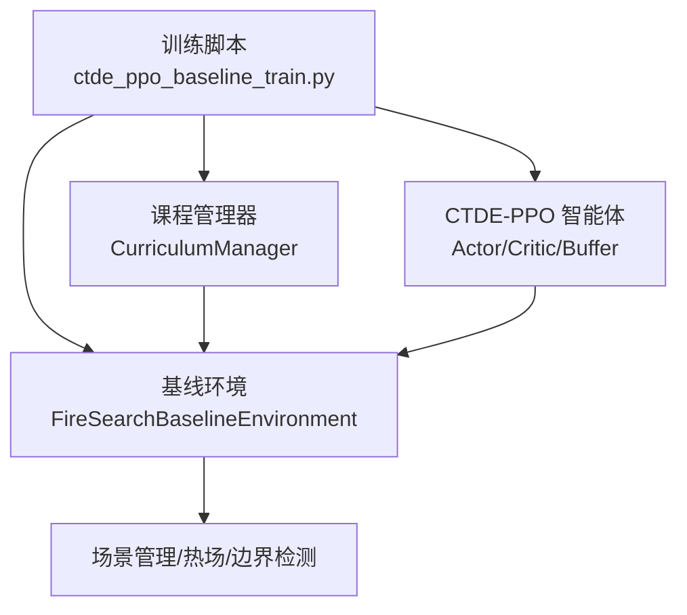
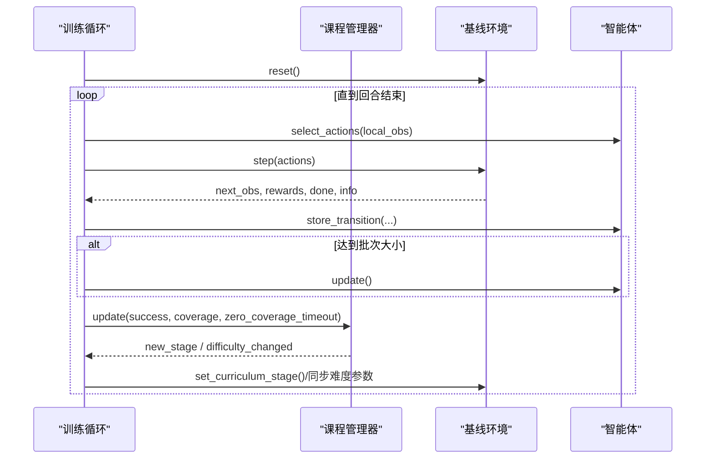
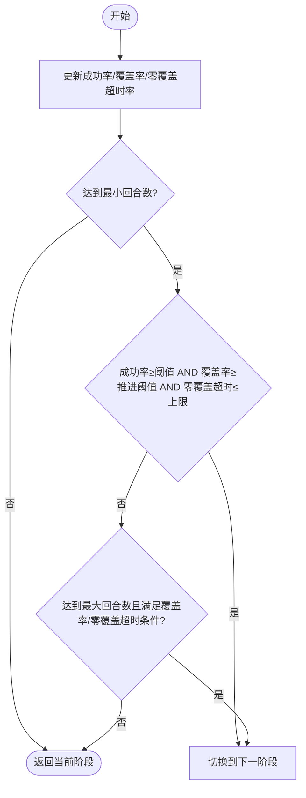
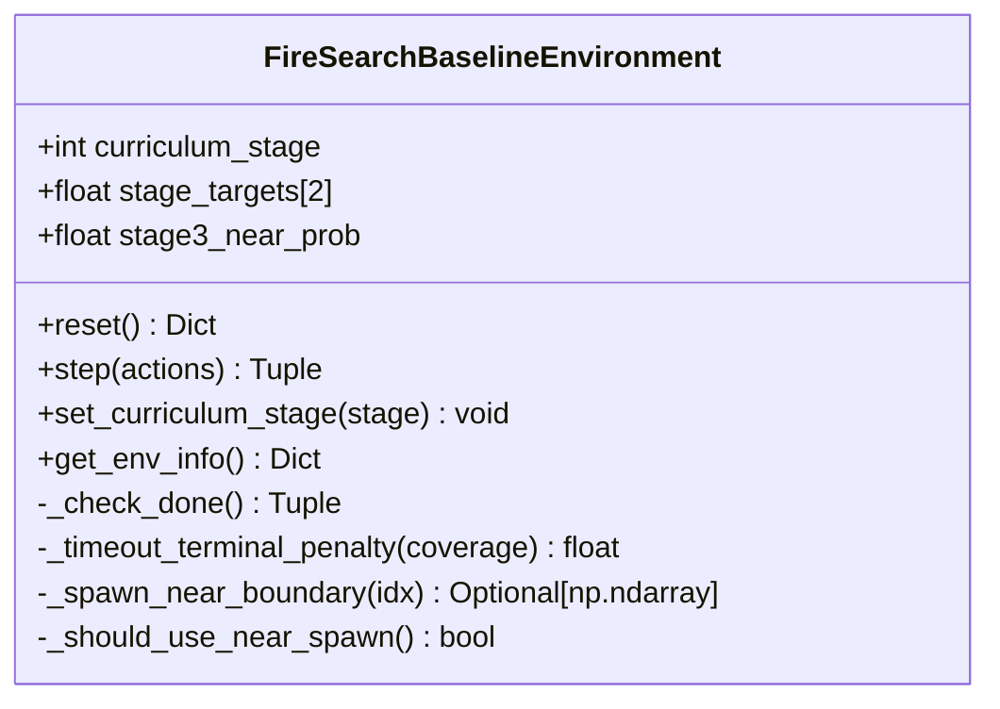
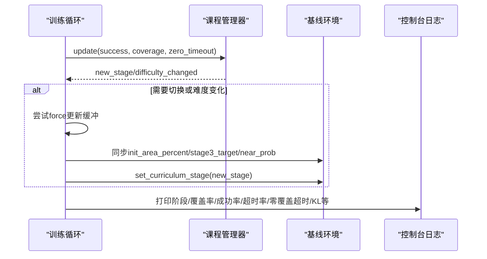

# 第二阶段：复杂环境适应

<cite>
**本文引用的文件**   
- [ctde_ppo_baseline_train.py](file://environment_variables/environment_variables/ctde_ppo_baseline_train.py)
- [rl_environment_baseline.py](file://environment_variables/environment_variables/rl_environment_baseline.py)
- [train_console_log.txt（示例）](file://environment_variables/environment_variables/outputs/lr_comparison_20260709_095438/训练结果/KL_LR_CTDE_PPO_seed42/train_console_log.txt)
</cite>

## 目录
1. [引言](#引言)
2. [项目结构](#项目结构)
3. [核心组件](#核心组件)
4. [架构总览](#架构总览)
5. [详细组件分析](#详细组件分析)
6. [依赖关系分析](#依赖关系分析)
7. [性能考量](#性能考量)
8. [故障排查指南](#故障排查指南)
9. [结论](#结论)
10. [附录](#附录)

## 引言
本技术文档聚焦课程学习“第二阶段：复杂环境适应”的设计与实现。该阶段在初始区域百分比、成功率阈值、覆盖率推进条件、零覆盖超时率限制、回合数上下限等方面进行了严格约束，并通过动态火场边界更新与多源观测特征增强，提升无人机在动态环境中的适应能力。同时，文档给出阶段切换的多维度评估指标、性能监控方法、参数调优建议与训练效果分析方法，帮助读者快速理解并落地实施。

## 项目结构
围绕第二阶段的关键代码主要分布在两个文件中：
- 训练主循环与课程管理器：负责阶段判定、难度曲线控制、日志记录与模型保存等
- 基线环境：提供动态火场、观测/奖励计算、阶段目标与终止条件等

图表来源
- [ctde_ppo_baseline_train.py:1334-1383](file://environment_variables/environment_variables/ctde_ppo_baseline_train.py#L1334-L1383)
- [rl_environment_baseline.py:21-108](file://environment_variables/environment_variables/rl_environment_baseline.py#L21-L108)

章节来源
- [ctde_ppo_baseline_train.py:1278-1383](file://environment_variables/environment_variables/ctde_ppo_baseline_train.py#L1278-L1383)
- [rl_environment_baseline.py:21-108](file://environment_variables/environment_variables/rl_environment_baseline.py#L21-L108)

## 核心组件
- 课程管理器（CurriculumManager）
  - 维护阶段状态、回合计数、成功率/覆盖率/零覆盖超时率的滑动窗口统计
  - 定义阶段门槛与强制推进条件，支持最终专注模式
- 基线环境（FireSearchBaselineEnvironment）
  - 根据当前阶段设置目标覆盖率、近距生成概率、步长惩罚与终端惩罚
  - 每若干步更新动态火场边界与热力场，驱动环境变化
- 智能体（CTDE_PPO_Agent）
  - 执行PPO更新、KL自适应学习率策略、轨迹缓存与GAE计算

章节来源
- [ctde_ppo_baseline_train.py:569-757](file://environment_variables/environment_variables/ctde_ppo_baseline_train.py#L569-L757)
- [rl_environment_baseline.py:21-108](file://environment_variables/environment_variables/rl_environment_baseline.py#L21-L108)
- [ctde_ppo_baseline_train.py:759-991](file://environment_variables/environment_variables/ctde_ppo_baseline_train.py#L759-L991)

## 架构总览
下图展示第二阶段训练的主流程：训练循环驱动环境步进，收集指标后由课程管理器判定是否进入下一阶段；环境内部按阶段调整目标与采样策略，并在固定周期刷新动态边界。

图表来源
- [ctde_ppo_baseline_train.py:1469-1586](file://environment_variables/environment_variables/ctde_ppo_baseline_train.py#L1469-L1586)
- [rl_environment_baseline.py:842-992](file://environment_variables/environment_variables/rl_environment_baseline.py#L842-L992)

## 详细组件分析

### 课程管理器（第二阶段关键逻辑）
- 初始区域百分比设置
  - 通过百分位阶梯从较低值逐步提升到最终值（默认最终值为5.0%），第二阶段期间使用当前阶梯值作为初始区域百分比
- 成功率阈值要求
  - 第二阶段成功率为最近窗口均值，需达到设定阈值方可考虑升级
- 覆盖率强制推进条件
  - 当平均覆盖率超过最低推进阈值时，可触发提前推进
- 零覆盖超时率限制
  - 若零覆盖超时率低于上限，则满足安全底线
- 最小/最大回合数
  - 第二阶段最少回合数与最多回合数分别限定，确保充分探索与避免过长停留
- 终末专注
  - 在最后若干回合内强制将目标与近距概率拉至最终值，加速收敛

图表来源
- [ctde_ppo_baseline_train.py:621-670](file://environment_variables/environment_variables/ctde_ppo_baseline_train.py#L621-L670)

章节来源
- [ctde_ppo_baseline_train.py:569-757](file://environment_variables/environment_variables/ctde_ppo_baseline_train.py#L569-L757)

### 基线环境（第二阶段行为差异）
- 阶段目标与终止条件
  - 第二阶段以目标覆盖率为完成标准；未达标则在步数耗尽时施加终端惩罚，且对零覆盖率额外加重惩罚
- 近距生成概率
  - 第二阶段近距生成概率降低，促使智能体在更远距离进行探索
- 动态边界更新
  - 每隔若干步重新检测火场边界并更新热力场，形成动态环境
- 观测与奖励
  - 观测包含位置、电池、地形、风场、热梯度、动量、相机方向等；奖励强调边界发现、覆盖率增益、探索与重复惩罚

图表来源
- [rl_environment_baseline.py:21-108](file://environment_variables/environment_variables/rl_environment_baseline.py#L21-L108)
- [rl_environment_baseline.py:824-992](file://environment_variables/environment_variables/rl_environment_baseline.py#L824-L992)

章节来源
- [rl_environment_baseline.py:824-992](file://environment_variables/environment_variables/rl_environment_baseline.py#L824-L992)

### 训练主循环与指标汇总
- 滚动指标
  - 维护奖励、长度、覆盖率、成功率、任务得分、超时率、零覆盖超时的滑动窗口均值
- 阶段切换处理
  - 当阶段或难度发生变化时，优先尝试一次强制更新以消化旧缓冲区数据，再同步环境参数
- 控制台日志
  - 定期输出阶段、场景、覆盖率、成功率、任务得分、超时率、零覆盖超时、KL与学习率等信息，便于诊断

图表来源
- [ctde_ppo_baseline_train.py:1554-1586](file://environment_variables/environment_variables/ctde_ppo_baseline_train.py#L1554-L1586)
- [ctde_ppo_baseline_train.py:1588-1599](file://environment_variables/environment_variables/ctde_ppo_baseline_train.py#L1588-L1599)

章节来源
- [ctde_ppo_baseline_train.py:1469-1599](file://environment_variables/environment_variables/ctde_ppo_baseline_train.py#L1469-L1599)

## 依赖关系分析
- 训练脚本依赖课程管理器与环境接口
- 课程管理器依赖环境提供的指标（成功率、覆盖率、零覆盖超时）
- 环境依赖场景管理与热力场/边界检测模块

图表来源
- [ctde_ppo_baseline_train.py:1334-1383](file://environment_variables/environment_variables/ctde_ppo_baseline_train.py#L1334-L1383)
- [rl_environment_baseline.py:159-188](file://environment_variables/environment_variables/rl_environment_baseline.py#L159-L188)

章节来源
- [ctde_ppo_baseline_train.py:1334-1383](file://environment_variables/environment_variables/ctde_ppo_baseline_train.py#L1334-L1383)
- [rl_environment_baseline.py:159-188](file://environment_variables/environment_variables/rl_environment_baseline.py#L159-L188)

## 性能考量
- 动态边界更新频率
  - 每若干步更新一次边界与热力场，平衡仿真精度与计算开销
- 近距生成概率
  - 第二阶段降低近距生成概率，鼓励更广的搜索空间，有助于提高鲁棒性
- KL自适应学习率
  - 基于近似KL的指数调节策略，稳定训练并防止策略退化
- 终端惩罚设计
  - 针对未达目标的超时施加与零覆盖加重的惩罚，引导智能体关注覆盖率与效率

章节来源
- [rl_environment_baseline.py:927-941](file://environment_variables/environment_variables/rl_environment_baseline.py#L927-L941)
- [rl_environment_baseline.py:241-251](file://environment_variables/environment_variables/rl_environment_baseline.py#L241-L251)
- [ctde_ppo_baseline_train.py:836-847](file://environment_variables/environment_variables/ctde_ppo_baseline_train.py#L836-L847)

## 故障排查指南
- 常见问题定位
  - 成功率长期不达标：检查成功率阈值、最小回合数与覆盖率推进条件是否过于严格
  - 零覆盖超时率偏高：关注终端惩罚权重与近距生成概率配置
  - 阶段无法推进：确认覆盖率与零覆盖超时率是否同时满足强制推进条件
- 日志诊断要点
  - 控制台日志中“成功率/覆盖率/超时率/零覆盖超时/KL/学习率”等指标趋势
  - 阶段切换日志行，观察切换前后指标变化
- 参考日志片段路径
  - 示例日志显示第二阶段评估与切换过程，可用于对照实际运行状态

章节来源
- [ctde_ppo_baseline_train.py:1588-1599](file://environment_variables/environment_variables/ctde_ppo_baseline_train.py#L1588-L1599)
- [train_console_log.txt（示例）:338-346](file://environment_variables/environment_variables/outputs/lr_comparison_20260709_095438/训练结果/KL_LR_CTDE_PPO_seed42/train_console_log.txt#L338-L346)

## 结论
第二阶段通过严格的成功率阈值、覆盖率推进条件与零覆盖超时率限制，结合最小/最大回合数约束，确保智能体在动态火场环境中获得稳健的边界搜索能力。课程管理器与环境协同工作，既保证难度渐进，又通过终端专注加速收敛。配合详细的日志与指标监控，可有效指导参数调优与训练效果分析。

## 附录

### 第二阶段关键参数与阈值说明
- 初始区域百分比
  - 通过百分位阶梯逐步提升至最终值（默认5.0%），第二阶段使用该值作为初始区域百分比
- 成功率阈值
  - 第二阶段成功率窗口均值需达到设定阈值
- 覆盖率强制推进条件
  - 平均覆盖率超过最低推进阈值时可提前推进
- 零覆盖超时率限制
  - 零覆盖超时率需低于上限
- 回合数范围
  - 最小回合数与最大回合数分别限定，保障探索充分性与训练效率

章节来源
- [ctde_ppo_baseline_train.py:569-670](file://environment_variables/environment_variables/ctde_ppo_baseline_train.py#L569-L670)

### 阶段切换的多维度评估指标
- 成功率
  - 反映任务完成的稳定性
- 覆盖率
  - 衡量边界发现的全面性
- 超时率与零覆盖超时率
  - 超时率体现效率，零覆盖超时率反映最坏情况下的失败风险
- 任务得分
  - 综合覆盖率、成功率与效率的加权评分

章节来源
- [ctde_ppo_baseline_train.py:295-305](file://environment_variables/environment_variables/ctde_ppo_baseline_train.py#L295-L305)
- [ctde_ppo_baseline_train.py:1588-1599](file://environment_variables/environment_variables/ctde_ppo_baseline_train.py#L1588-L1599)

### 性能监控方法与参数调优指南
- 监控方法
  - 跟踪滚动窗口内的成功率、覆盖率、超时率、零覆盖超时率与KL值
  - 关注阶段切换前后的指标跃迁与学习率动作（up/down/keep/fixed）
- 参数调优建议
  - 若成功率难以提升，可适当放宽成功率阈值或增加最小回合数
  - 若零覆盖超时率偏高，可降低近距生成概率或调整终端惩罚权重
  - 若阶段推进过慢，可适度降低覆盖率推进阈值或缩短最大回合数

章节来源
- [ctde_ppo_baseline_train.py:836-847](file://environment_variables/environment_variables/ctde_ppo_baseline_train.py#L836-L847)
- [rl_environment_baseline.py:373-415](file://environment_variables/environment_variables/rl_environment_baseline.py#L373-L415)
- [rl_environment_baseline.py:241-251](file://environment_variables/environment_variables/rl_environment_baseline.py#L241-L251)