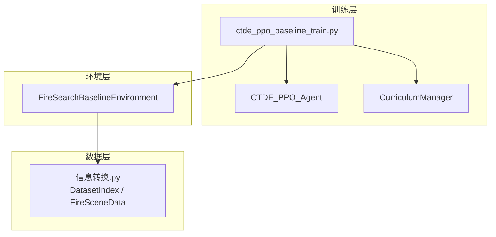
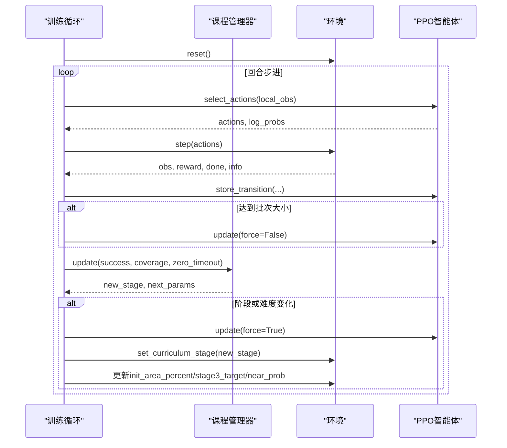
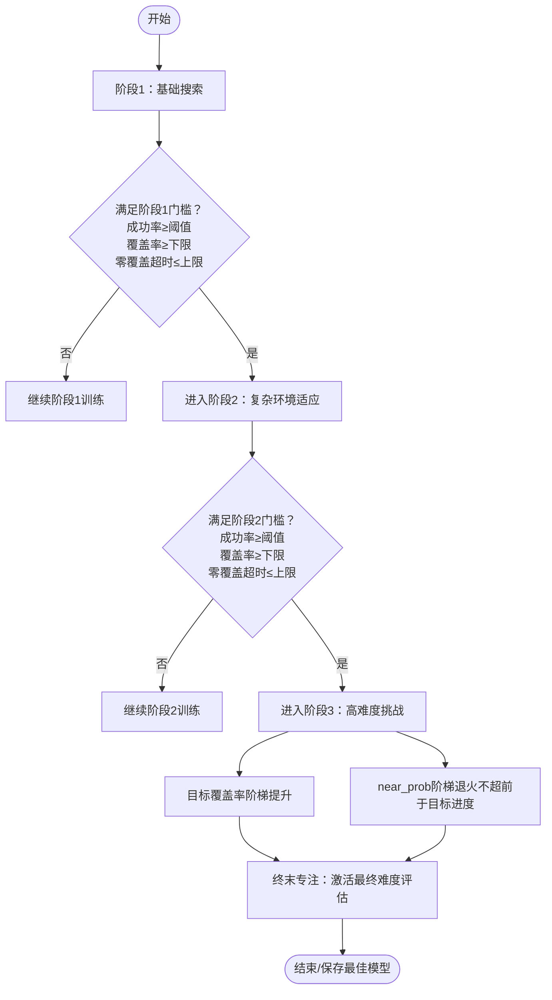
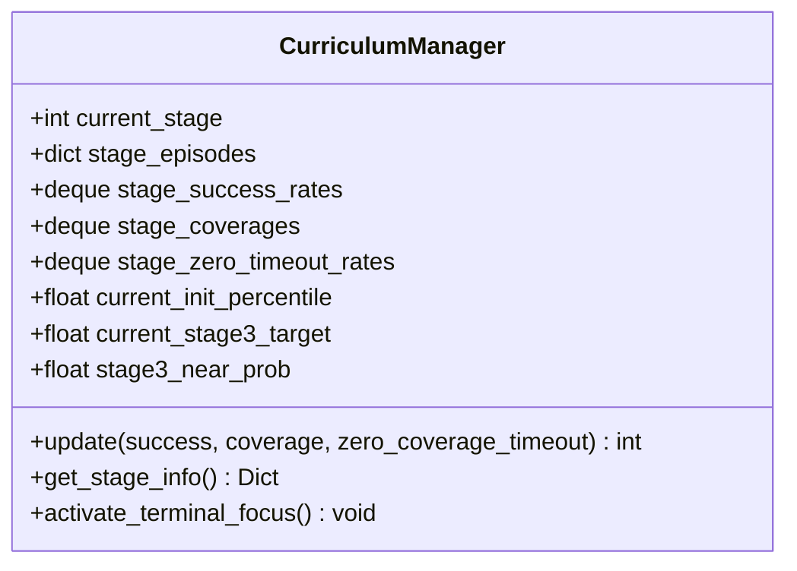
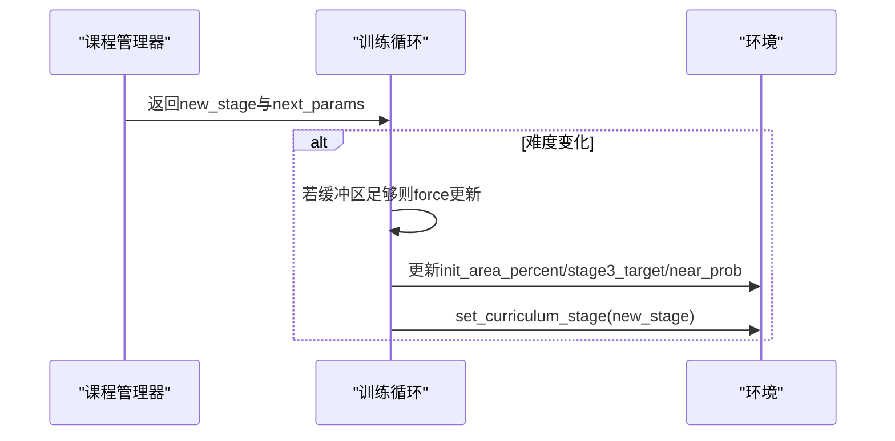
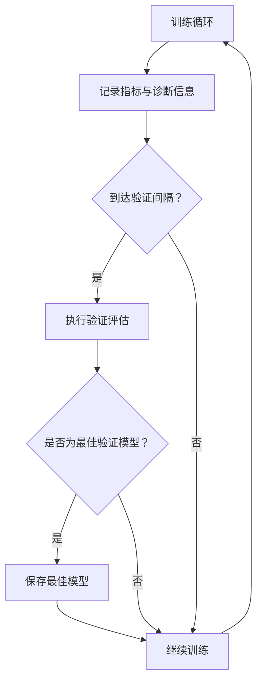
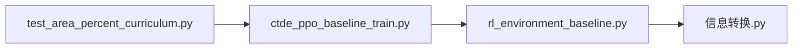

# 课程学习框架

<cite>
**本文引用的文件**   
- [ctde_ppo_baseline_train.py](file://environment_variables/environment_variables/ctde_ppo_baseline_train.py)
- [rl_environment_baseline.py](file://environment_variables/environment_variables/rl_environment_baseline.py)
- [信息转换.py](file://environment_variables/environment_variables/信息转换.py)
- [test_area_percent_curriculum.py](file://environment_variables/environment_variables/test_area_percent_curriculum.py)
</cite>

## 目录
1. [引言](#引言)
2. [项目结构](#项目结构)
3. [核心组件](#核心组件)
4. [架构总览](#架构总览)
5. [详细组件分析](#详细组件分析)
6. [依赖关系分析](#依赖关系分析)
7. [性能与训练效率](#性能与训练效率)
8. [故障排查指南](#故障排查指南)
9. [结论](#结论)
10. [附录：调优与监控实践](#附录：调优与监控实践)

## 引言
本技术文档围绕“三阶段渐进式难度提升”的课程学习框架，系统阐述其设计理念、实现机制与评估体系。该框架通过动态调整环境难度（初始火场面积百分比、目标覆盖率、近边界生成概率等），引导多智能体在基础搜索能力、复杂环境适应和高难度任务挑战三个阶段的逐步进阶。文档同时给出阶段切换条件判断逻辑（成功率阈值、覆盖率要求、超时率限制）、训练时长控制、难度参数调节、能力门槛设置、进度监控与日志分析方法，并解释课程学习对模型泛化能力和训练效率的作用机制。

## 项目结构
仓库采用“环境-训练-数据”分层组织方式：
- 环境层：基于 Gymnasium 的火灾边界搜索环境，提供分布式局部观测与集中式全局状态接口，支持多种观察/奖励配置与课程阶段参数注入。
- 训练层：CTDE-PPO 基线训练脚本，包含课程管理器、PPO 智能体、回放缓冲、质量指标计算、验证与可视化流程。
- 数据层：场景索引与 FARSITE 场景加载、归一化、热势场重建、边界点初始化等工具。

图表来源
- [ctde_ppo_baseline_train.py:568-758](file://environment_variables/environment_variables/ctde_ppo_baseline_train.py#L568-L758)
- [ctde_ppo_baseline_train.py:759-991](file://environment_variables/environment_variables/ctde_ppo_baseline_train.py#L759-L991)
- [rl_environment_baseline.py:21-158](file://environment_variables/environment_variables/rl_environment_baseline.py#L21-L158)
- [信息转换.py:20-135](file://environment_variables/environment_variables/信息转换.py#L20-L135)

章节来源
- [ctde_ppo_baseline_train.py:98-158](file://environment_variables/environment_variables/ctde_ppo_baseline_train.py#L98-L158)
- [rl_environment_baseline.py:21-158](file://environment_variables/environment_variables/rl_environment_baseline.py#L21-L158)
- [信息转换.py:20-135](file://environment_variables/environment_variables/信息转换.py#L20-L135)

## 核心组件
- 课程管理器（CurriculumManager）：维护当前阶段、各阶段统计窗口（成功率、覆盖率、零覆盖超时率）、阶段最小/最大回合数、能力门槛与强制推进策略；在第三阶段内还管理目标覆盖率阶梯与近边界生成概率退火。
- 环境（FireSearchBaselineEnvironment）：根据课程阶段与环境参数动态调整初始火场面积、目标覆盖率惩罚、近边界生成概率、奖励权重与步长惩罚等。
- PPO 智能体（CTDE_PPO_Agent）：Actor/Critic 网络、KL 自适应学习率、GAE 优势估计、批量更新与保存/加载。
- 数据模块（信息转换.py）：场景索引、栅格加载、归一化、热势场重建、边界点选择与初始化。

章节来源
- [ctde_ppo_baseline_train.py:568-758](file://environment_variables/environment_variables/ctde_ppo_baseline_train.py#L568-L758)
- [rl_environment_baseline.py:21-158](file://environment_variables/environment_variables/rl_environment_baseline.py#L21-L158)
- [ctde_ppo_baseline_train.py:759-991](file://environment_variables/environment_variables/ctde_ppo_baseline_train.py#L759-L991)
- [信息转换.py:219-322](file://environment_variables/environment_variables/信息转换.py#L219-L322)

## 架构总览
课程学习在训练循环中按回合驱动：每回合结束后由课程管理器依据多指标评估是否提升阶段或调整难度参数；若难度变化，则触发一次强制更新以平滑策略分布，随后将新参数同步到环境中。

图表来源
- [ctde_ppo_baseline_train.py:1554-1586](file://environment_variables/environment_variables/ctde_ppo_baseline_train.py#L1554-L1586)
- [ctde_ppo_baseline_train.py:889-991](file://environment_variables/environment_variables/ctde_ppo_baseline_train.py#L889-L991)
- [rl_environment_baseline.py:331-361](file://environment_variables/environment_variables/rl_environment_baseline.py#L331-L361)

## 详细组件分析

### 三阶段渐进式难度提升策略
- 第一阶段（基础搜索能力培养）
  - 目标：建立基本边界发现与探索能力，降低初始火场面积百分比，强化探索奖励，容忍较高超时率。
  - 关键参数：初始火场面积百分比从低到高阶梯上升；阶段内成功率阈值、覆盖率下限、零覆盖超时率上限共同决定升级。
  - 评估指标：成功率、覆盖率、零覆盖超时率、平均长度与任务得分。
- 第二阶段（复杂环境适应）
  - 目标：提高目标覆盖率要求，增强对更大火场的适应能力，适度增加步长惩罚与近边界生成概率。
  - 关键参数：目标覆盖率提升，近边界生成概率下降，零覆盖超时率阈值更严格。
  - 评估指标：同上，但阈值更高。
- 第三阶段（高难度任务挑战）
  - 目标：逼近最终目标覆盖率，进一步降低近边界生成概率，强调稳定性与鲁棒性。
  - 关键参数：目标覆盖率阶梯式提升；near_prob 阶梯式退火且不得超前于目标进度；能力门槛包括成功率、零覆盖超时率与覆盖率。
  - 评估指标：除常规指标外，引入“终末专注”模式，强制切换到最终难度进行稳定评估。

图表来源
- [ctde_ppo_baseline_train.py:568-758](file://environment_variables/environment_variables/ctde_ppo_baseline_train.py#L568-L758)
- [ctde_ppo_baseline_train.py:1554-1586](file://environment_variables/environment_variables/ctde_ppo_baseline_train.py#L1554-L1586)

章节来源
- [ctde_ppo_baseline_train.py:568-758](file://environment_variables/environment_variables/ctde_ppo_baseline_train.py#L568-L758)
- [ctde_ppo_baseline_train.py:1554-1586](file://environment_variables/environment_variables/ctde_ppo_baseline_train.py#L1554-L1586)

### 课程阶段切换的条件判断逻辑
- 成功率阈值：各阶段维护最近若干回合的成功率滑动均值，超过阈值方可考虑升级。
- 覆盖率要求：阶段内平均覆盖率需达到最低门槛，防止过早升级导致不稳定。
- 超时率限制：零覆盖超时率必须低于阶段上限，避免模型陷入无效探索。
- 强制推进：在第一阶段达到最大回合数且满足覆盖率与超时率条件时，强制推进至下一阶段，保证训练进度。
- 第三阶段内部：目标覆盖率阶梯提升与 near_prob 退火分别受独立门槛约束，且 near_prob 退火不得超前于目标进度。

图表来源
- [ctde_ppo_baseline_train.py:568-758](file://environment_variables/environment_variables/ctde_ppo_baseline_train.py#L568-L758)

章节来源
- [ctde_ppo_baseline_train.py:568-758](file://environment_variables/environment_variables/ctde_ppo_baseline_train.py#L568-L758)
- [test_area_percent_curriculum.py:130-169](file://environment_variables/environment_variables/test_area_percent_curriculum.py#L130-L169)

### 环境与课程参数的联动
- 初始火场面积百分比：随第一阶段能力提升逐步提升，扩大训练难度。
- 目标覆盖率：在第三阶段按阶梯提升，配合成功率与超时率门槛确保稳健过渡。
- 近边界生成概率：在第三阶段按能力门槛阶梯退火，促使智能体在更广范围内探索。
- 阶段切换时：先处理缓存数据再更新环境阶段与难度参数，保证策略分布平滑。

图表来源
- [ctde_ppo_baseline_train.py:1554-1586](file://environment_variables/environment_variables/ctde_ppo_baseline_train.py#L1554-L1586)
- [rl_environment_baseline.py:331-361](file://environment_variables/environment_variables/rl_environment_baseline.py#L331-L361)

章节来源
- [ctde_ppo_baseline_train.py:1554-1586](file://environment_variables/environment_variables/ctde_ppo_baseline_train.py#L1554-L1586)
- [rl_environment_baseline.py:331-361](file://environment_variables/environment_variables/rl_environment_baseline.py#L331-L361)

### 训练与评估流程
- 训练循环：记录每回合的长度、覆盖率、成功与否、超时情况、阶段、场景标识、视觉半径、传感器半径、最大步数、累计步数、PPO更新次数、损失、熵、KL、clip比例、学习率、难度参数、终端专注标志等。
- 定期验证：每隔固定回合在验证集上评估当前阶段表现，使用综合评分函数（任务得分、覆盖率、超时率、零覆盖超时率加权）选择最佳模型。
- 最终评估：训练结束后在多个划分（验证、泛化、压力）上进行最终评估，输出图表与分析结果。

图表来源
- [ctde_ppo_baseline_train.py:1523-1634](file://environment_variables/environment_variables/ctde_ppo_baseline_train.py#L1523-L1634)

章节来源
- [ctde_ppo_baseline_train.py:1523-1634](file://environment_variables/environment_variables/ctde_ppo_baseline_train.py#L1523-L1634)

## 依赖关系分析
- 训练脚本依赖环境类与数据模块：课程管理器与PPO智能体通过环境接口获取观测、奖励与终止信号，并通过数据模块加载场景与构建热势场。
- 环境依赖数据模块：场景初始化、边界点选择、热势场重建均通过数据模块完成。
- 测试用例验证课程调度：针对第三阶段目标与near_prob的推进逻辑进行单元测试。

图表来源
- [ctde_ppo_baseline_train.py:568-758](file://environment_variables/environment_variables/ctde_ppo_baseline_train.py#L568-L758)
- [rl_environment_baseline.py:21-158](file://environment_variables/environment_variables/rl_environment_baseline.py#L21-L158)
- [信息转换.py:219-322](file://environment_variables/environment_variables/信息转换.py#L219-L322)
- [test_area_percent_curriculum.py:130-169](file://environment_variables/environment_variables/test_area_percent_curriculum.py#L130-L169)

章节来源
- [ctde_ppo_baseline_train.py:568-758](file://environment_variables/environment_variables/ctde_ppo_baseline_train.py#L568-L758)
- [rl_environment_baseline.py:21-158](file://environment_variables/environment_variables/rl_environment_baseline.py#L21-L158)
- [信息转换.py:219-322](file://environment_variables/environment_variables/信息转换.py#L219-L322)
- [test_area_percent_curriculum.py:130-169](file://environment_variables/environment_variables/test_area_percent_curriculum.py#L130-L169)

## 性能与训练效率
- KL 自适应学习率：通过指数衰减因子根据近似 KL 与目标 KL 的偏差动态调整 Actor 学习率，有助于稳定训练与加速收敛。
- GAE 优势估计：结合折扣因子与 λ 参数，平衡偏差与方差，提升样本效率。
- 课程学习作用机制：
  - 泛化能力：通过逐步提升难度与多样化场景，促使策略在不同火场规模与地形条件下保持稳健。
  - 训练效率：早期简单任务快速建立基础能力，后期高难度任务精细优化，减少在高难度直接训练的探索成本。

章节来源
- [ctde_ppo_baseline_train.py:823-847](file://environment_variables/environment_variables/ctde_ppo_baseline_train.py#L823-L847)
- [ctde_ppo_baseline_train.py:867-887](file://environment_variables/environment_variables/ctde_ppo_baseline_train.py#L867-L887)

## 故障排查指南
- 场景无效或缺失：当 t=0 边界为空或必需栅格缺失时，会抛出异常并停止训练。检查 dataset_index.json 与场景路径是否正确。
- 课程未推进：若成功率、覆盖率或超时率未达到门槛，或回合数不足，课程不会推进。检查对应阈值与窗口统计。
- 近边界生成概率未退火：第三阶段 near_prob 退火不得超前于目标进度，且需满足成功率、零覆盖超时率与覆盖率门槛。检查相关门槛与回合计数。
- 验证未保存最佳模型：仅在第三阶段且满足终末专注条件时才会保存最佳验证模型。确认终端专注已激活与回合数达标。

章节来源
- [信息转换.py:684-721](file://environment_variables/environment_variables/信息转换.py#L684-L721)
- [ctde_ppo_baseline_train.py:568-758](file://environment_variables/environment_variables/ctde_ppo_baseline_train.py#L568-L758)
- [ctde_ppo_baseline_train.py:1606-1634](file://environment_variables/environment_variables/ctde_ppo_baseline_train.py#L1606-L1634)

## 结论
该课程学习框架通过三阶段渐进式难度提升，结合多维度评估指标与严格的阶段切换条件，有效提升了多智能体在火灾边界搜索任务中的泛化能力与训练效率。课程管理器与环境参数的紧密联动确保了难度调整的稳健性与可解释性，而 KL 自适应与 GAE 等技术进一步增强了训练的稳定性和样本利用效率。

## 附录：调优与监控实践
- 训练时长控制
  - 调整 total_episodes 与 max_train_updates 控制总体训练量。
  - 设置 validation_interval 与 figure_window 平衡评估频率与绘图开销。
- 难度参数调节
  - 第一阶段：适当降低 init_percentile 与 stage1_explore_reward_cap，鼓励探索。
  - 第二阶段：提高 stage2_success_target 与 force_advance_min_coverage，强化覆盖率要求。
  - 第三阶段：逐步提升 stage3_target，降低 stage3_near_prob，并收紧 zero_timeout_rate 上限。
- 能力门槛设置
  - 调整 stage_thresholds、stage_zero_timeout_thresholds 与 min/max episodes，确保阶段推进既稳健又高效。
- 课程进度监控
  - 关注训练日志中的阶段、成功率、覆盖率、超时率、KL 与 clip_fraction。
  - 使用滚动均值与尾部分布分析稳定性，识别性能骤降与过拟合风险。
- 阶段转换日志
  - 打印阶段切换与难度参数变更，便于回溯与调试。
- 能力发展轨迹分析
  - 绘制任务得分、覆盖率、超时率随回合的变化曲线，结合阶段标记分析进步趋势。
  - 对比不同种子与超参组合的结果，选择最优配置。

章节来源
- [ctde_ppo_baseline_train.py:98-158](file://environment_variables/environment_variables/ctde_ppo_baseline_train.py#L98-L158)
- [ctde_ppo_baseline_train.py:1523-1634](file://environment_variables/environment_variables/ctde_ppo_baseline_train.py#L1523-L1634)