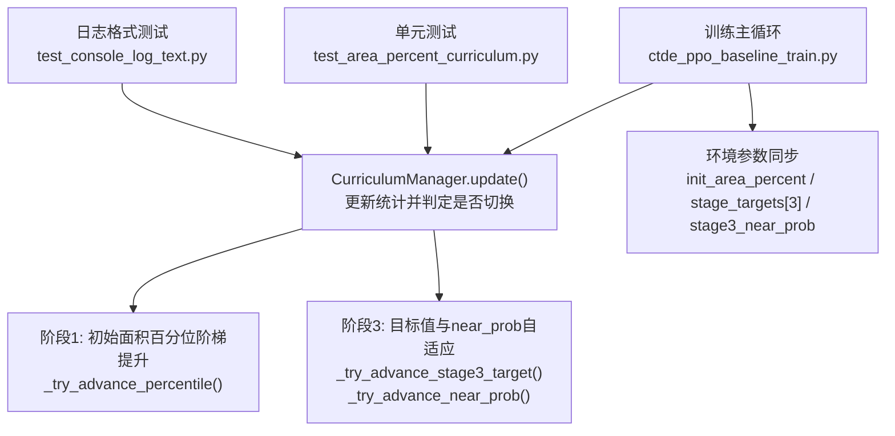
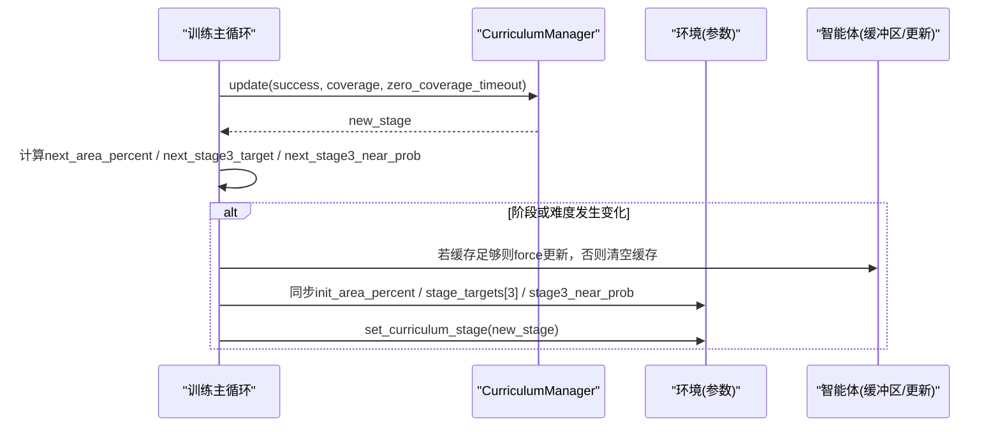
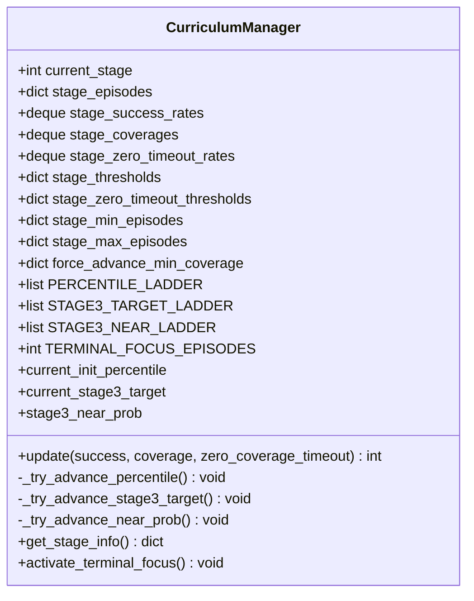
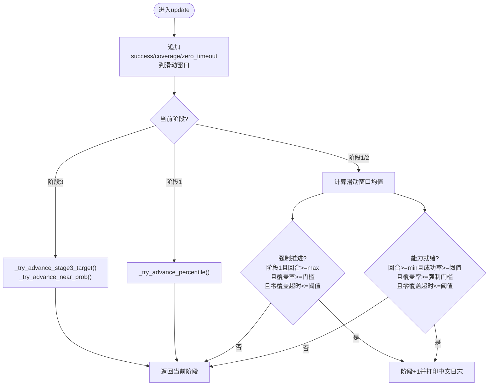
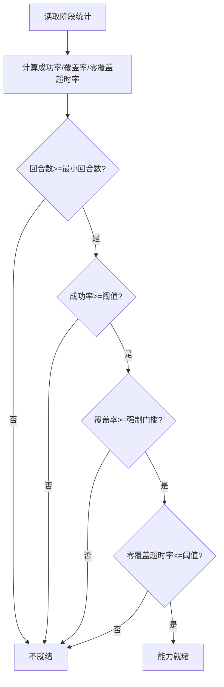
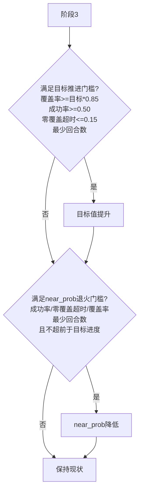
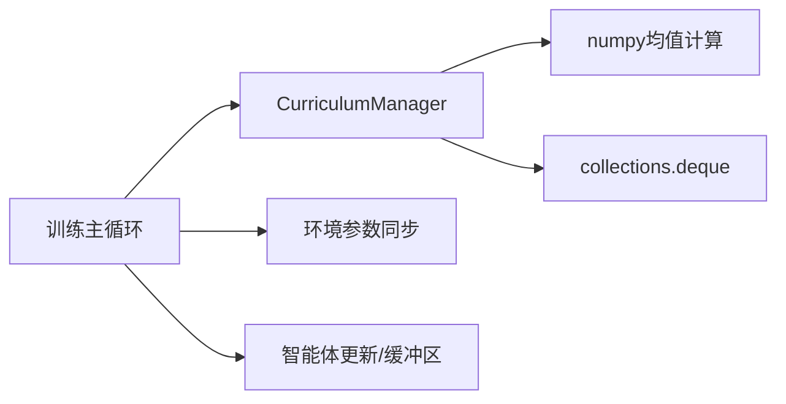

# 课程阶段切换机制

<cite>
**本文引用的文件**
- [ctde_ppo_baseline_train.py](file://environment_variables/environment_variables/ctde_ppo_baseline_train.py)
- [test_area_percent_curriculum.py](file://environment_variables/environment_variables/test_area_percent_curriculum.py)
- [test_console_log_text.py](file://environment_variables/environment_variables/test_console_log_text.py)
</cite>

## 目录
1. [简介](#简介)
2. [项目结构](#项目结构)
3. [核心组件](#核心组件)
4. [架构总览](#架构总览)
5. [详细组件分析](#详细组件分析)
6. [依赖关系分析](#依赖关系分析)
7. [性能考量](#性能考量)
8. [故障排查指南](#故障排查指南)
9. [结论](#结论)
10. [附录](#附录)

## 简介
本技术文档围绕“课程学习阶段切换机制”展开，聚焦 CurriculumManager 类的核心算法与状态管理。文档深入解释：
- 多维度评估体系：成功率、覆盖率、零覆盖超时率的实时计算与滑动窗口平均
- 能力就绪判断逻辑：最小回合数检查、成功率阈值验证、覆盖率强制推进条件、零覆盖超时率限制的综合评估
- 强制推进机制：第一阶段达到最大回合数时的自动升级逻辑
- 动态阈值调整策略：第1阶段初始面积百分位阶梯式提升；第3阶段目标值与近点生成概率的自适应退火
- 日志输出格式、监控指标可视化方法与调试工具使用指南
- 常见问题诊断与参数调优最佳实践

## 项目结构
与课程阶段切换机制直接相关的代码位于训练主脚本中，包含 CurriculumManager 类定义及其在训练循环中的调用位置。测试用例覆盖了关键行为断言与中文日志格式校验。

图表来源
- [ctde_ppo_baseline_train.py:568-758](file://environment_variables/environment_variables/ctde_ppo_baseline_train.py#L568-L758)
- [ctde_ppo_baseline_train.py:1554-1579](file://environment_variables/environment_variables/ctde_ppo_baseline_train.py#L1554-L1579)
- [test_area_percent_curriculum.py:130-169](file://environment_variables/environment_variables/test_area_percent_curriculum.py#L130-L169)
- [test_console_log_text.py:8-24](file://environment_variables/environment_variables/test_console_log_text.py#L8-L24)

章节来源
- [ctde_ppo_baseline_train.py:568-758](file://environment_variables/environment_variables/ctde_ppo_baseline_train.py#L568-L758)
- [ctde_ppo_baseline_train.py:1554-1579](file://environment_variables/environment_variables/ctde_ppo_baseline_train.py#L1554-L1579)
- [test_area_percent_curriculum.py:130-169](file://environment_variables/environment_variables/test_area_percent_curriculum.py#L130-L169)
- [test_console_log_text.py:8-24](file://environment_variables/environment_variables/test_console_log_text.py#L8-L24)

## 核心组件
- CurriculumManager：维护当前阶段、各阶段统计队列（成功率、覆盖率、零覆盖超时率）、阈值与最小/最大回合数，负责阶段切换与难度参数自适应。
- 训练主循环：每回合结束后调用 CurriculumManager.update(success, coverage, zero_coverage_timeout)，并根据返回的新阶段与环境参数变化进行模型更新与参数同步。
- 测试套件：对阶段3目标值与near_prob推进逻辑、以及中文日志标签进行断言。

章节来源
- [ctde_ppo_baseline_train.py:568-758](file://environment_variables/environment_variables/ctde_ppo_baseline_train.py#L568-L758)
- [ctde_ppo_baseline_train.py:1554-1579](file://environment_variables/environment_variables/ctde_ppo_baseline_train.py#L1554-L1579)
- [test_area_percent_curriculum.py:130-169](file://environment_variables/environment_variables/test_area_percent_curriculum.py#L130-L169)
- [test_console_log_text.py:8-24](file://environment_variables/environment_variables/test_console_log_text.py#L8-L24)

## 架构总览
下图展示了 CurriculumManager 在训练流程中的交互关系与数据流。

图表来源
- [ctde_ppo_baseline_train.py:1554-1579](file://environment_variables/environment_variables/ctde_ppo_baseline_train.py#L1554-L1579)
- [ctde_ppo_baseline_train.py:568-758](file://environment_variables/environment_variables/ctde_ppo_baseline_train.py#L568-L758)

## 详细组件分析

### CurriculumManager 类概览
- 状态与配置
  - 当前阶段 current_stage
  - 各阶段回合计数 stage_episodes
  - 滑动窗口统计：stage_success_rates、stage_coverages、stage_zero_timeout_rates（长度固定为50）
  - 阈值与门槛：stage_thresholds、stage_zero_timeout_thresholds、stage_min_episodes、stage_max_episodes、force_advance_min_coverage
  - 难度参数：PERCENTILE_LADDER（初始面积百分位阶梯）、STAGE3_TARGET_LADDER（阶段3目标值阶梯）、STAGE3_NEAR_LADDER（近点生成概率阶梯）
  - 阶段3推进门槛：STAGE3_TARGET_MIN_EPS、STAGE3_NEAR_MIN_EPS、STAGE3_NEAR_GATES
  - 终末专注：TERMINAL_FOCUS_EPISODES

- 关键属性
  - current_init_percentile：当前初始面积百分位
  - current_stage3_target：当前阶段3目标值
  - stage3_near_prob：当前阶段3近点生成概率

- 主要方法
  - update(success, coverage, zero_coverage_timeout)：累计统计、计算滑动窗口均值、判定能力就绪与强制推进、打印中文日志、返回新阶段
  - _try_advance_percentile()：阶段1内基于成功率与最少回合数提升初始面积百分位
  - _try_advance_stage3_target()：阶段3内基于覆盖率、成功率、零覆盖超时率与最少回合数提升目标值
  - _try_advance_near_prob()：阶段3内基于成功率、零覆盖超时率、覆盖率与最少回合数降低近点生成概率
  - get_stage_info()：导出当前阶段关键指标
  - activate_terminal_focus()：最后若干回合强制将目标值设为最终值、near_prob设为0.0

图表来源
- [ctde_ppo_baseline_train.py:568-758](file://environment_variables/environment_variables/ctde_ppo_baseline_train.py#L568-L758)

章节来源
- [ctde_ppo_baseline_train.py:568-758](file://environment_variables/environment_variables/ctde_ppo_baseline_train.py#L568-L758)

### 多维度评估体系与滑动窗口平均
- 实时统计
  - 每回合调用 update 时，按当前阶段追加 success、coverage、zero_coverage_timeout 到对应 deque（长度上限50），形成滑动窗口。
- 滑动窗口均值
  - 成功率 = 最近最多50个回合的成功标记的平均值
  - 覆盖率 = 最近最多50个回合的边界覆盖率平均值
  - 零覆盖超时率 = 最近最多50个回合的零覆盖超时标记平均值
- 能力就绪条件（阶段1/2）
  - 回合数 >= 该阶段最小回合数
  - 成功率 >= 该阶段阈值
  - 覆盖率 >= 该阶段强制推进最低覆盖率
  - 零覆盖超时率 <= 该阶段零覆盖超时阈值
- 强制推进条件（仅阶段1）
  - 回合数 >= 该阶段最大回合数
  - 同时满足覆盖率与零覆盖超时率门槛
  - 触发后自动进入下一阶段

图表来源
- [ctde_ppo_baseline_train.py:621-670](file://environment_variables/environment_variables/ctde_ppo_baseline_train.py#L621-L670)
- [ctde_ppo_baseline_train.py:672-738](file://environment_variables/environment_variables/ctde_ppo_baseline_train.py#L672-L738)

章节来源
- [ctde_ppo_baseline_train.py:621-670](file://environment_variables/environment_variables/ctde_ppo_baseline_train.py#L621-L670)
- [ctde_ppo_baseline_train.py:672-738](file://environment_variables/environment_variables/ctde_ppo_baseline_train.py#L672-L738)

### 能力就绪判断逻辑流程
- 最小回合数检查：确保有足够样本以稳定估计
- 成功率阈值验证：保证基本任务完成能力
- 覆盖率强制推进条件：避免长期低覆盖停滞
- 零覆盖超时率限制：防止长时间无覆盖导致的无效探索

图表来源
- [ctde_ppo_baseline_train.py:638-658](file://environment_variables/environment_variables/ctde_ppo_baseline_train.py#L638-L658)

章节来源
- [ctde_ppo_baseline_train.py:638-658](file://environment_variables/environment_variables/ctde_ppo_baseline_train.py#L638-L658)

### 强制推进机制设计原理
- 目的：防止在第一阶段因成功率难以达标而长期停滞，通过最大回合数与覆盖率/零覆盖超时率双门槛保障进度
- 触发条件：阶段1回合数达到最大值，且覆盖率与零覆盖超时率均满足要求
- 效果：自动进入下一阶段，同时打印中文日志便于追踪

章节来源
- [ctde_ppo_baseline_train.py:653-670](file://environment_variables/environment_variables/ctde_ppo_baseline_train.py#L653-L670)

### 阶段阈值的动态调整策略
- 阶段1：初始面积百分位阶梯式提升
  - 依据：阶段1成功率与最少回合数
  - 效果：逐步提高初始着火区域比例，增强难度
- 阶段3：目标值与近点生成概率自适应退火
  - 目标值推进：需满足覆盖率接近当前目标、成功率与零覆盖超时率门槛、最少回合数
  - near_prob退火：需满足更严格的能力门槛（成功率、零覆盖超时率、覆盖率），且不得超前于目标值推进进度
  - 终末专注：最后若干回合强制将目标值设为最终值、near_prob设为0.0

图表来源
- [ctde_ppo_baseline_train.py:684-738](file://environment_variables/environment_variables/ctde_ppo_baseline_train.py#L684-L738)
- [ctde_ppo_baseline_train.py:753-757](file://environment_variables/environment_variables/ctde_ppo_baseline_train.py#L753-L757)

章节来源
- [ctde_ppo_baseline_train.py:684-738](file://environment_variables/environment_variables/ctde_ppo_baseline_train.py#L684-L738)
- [ctde_ppo_baseline_train.py:753-757](file://environment_variables/environment_variables/ctde_ppo_baseline_train.py#L753-L757)

### 阶段切换日志输出格式
- 中文标签：如“课程阶段 X -> Y”、“本阶段回合=...”、“成功率=...%”、“覆盖率=...%”、“零覆盖超时=...%”
- 辅助日志：
  - 初始面积百分位提升：“[area curriculum] init_area_percent -> ... | stage1_success=...%”
  - 阶段3目标值推进：“[stage3 curriculum] target ... -> ... | avg_coverage=...% | success=...% | zero_timeout=...%”
  - near_prob退火：“[near curriculum] near_prob ... -> ... | success=...% | zero_timeout=...% | coverage=...%”
  - 终端专注：“[terminal focus] 剩余N回合, 强制 target=..., near_prob=...”

章节来源
- [ctde_ppo_baseline_train.py:663-668](file://environment_variables/environment_variables/ctde_ppo_baseline_train.py#L663-L668)
- [ctde_ppo_baseline_train.py:679-682](file://environment_variables/environment_variables/ctde_ppo_baseline_train.py#L679-L682)
- [ctde_ppo_baseline_train.py:705-709](file://environment_variables/environment_variables/ctde_ppo_baseline_train.py#L705-L709)
- [ctde_ppo_baseline_train.py:734-738](file://environment_variables/environment_variables/ctde_ppo_baseline_train.py#L734-L738)
- [ctde_ppo_baseline_train.py:1482-1486](file://environment_variables/environment_variables/ctde_ppo_baseline_train.py#L1482-L1486)
- [test_console_log_text.py:18-23](file://environment_variables/environment_variables/test_console_log_text.py#L18-L23)

### 监控指标的可视化方法
- 训练日志字段（每个回合记录）：
  - episodes、rewards、task_scores、lengths、coverages、success、done_reasons、timeout、zero_coverage_timeout
  - stage、scene_ids、scene_keys、vision_radius、sensor_radius_cells、max_steps、total_steps
  - ppo_updates、actor_loss、critic_loss、entropy、approx_kl、kl_ema、kl_lr_action、clip_fraction
  - actor_lr、critic_lr、init_area_percent、stage3_target、stage3_near_prob、terminal_focus
- 建议可视化：
  - 成功率与覆盖率随回合的变化曲线
  - 零覆盖超时率趋势
  - 阶段切换时间点标注
  - 初始面积百分位与阶段3目标/near_prob演进轨迹
  - KL散度与学习率自适应动作

章节来源
- [ctde_ppo_baseline_train.py:1393-1436](file://environment_variables/environment_variables/ctde_ppo_baseline_train.py#L1393-L1436)
- [ctde_ppo_baseline_train.py:1520-1552](file://environment_variables/environment_variables/ctde_ppo_baseline_train.py#L1520-L1552)

### 调试工具的使用指南
- 单元测试
  - test_area_percent_curriculum.py：验证阶段3目标值与near_prob推进逻辑、以及在仅有覆盖率或存在零覆盖超时时不推进的行为
  - test_console_log_text.py：验证阶段切换日志使用中文标签
- 使用方式
  - 运行测试以快速定位阶段推进逻辑问题
  - 结合训练日志字段进行回放与可视化分析

章节来源
- [test_area_percent_curriculum.py:130-169](file://environment_variables/environment_variables/test_area_percent_curriculum.py#L130-L169)
- [test_console_log_text.py:8-24](file://environment_variables/environment_variables/test_console_log_text.py#L8-L24)

## 依赖关系分析
- CurriculumManager 与训练主循环的耦合点：
  - 主循环每回合调用 update(success, coverage, zero_coverage_timeout)
  - 根据返回的新阶段与难度参数变化，决定是否执行一次强制更新或清空缓冲区，并同步环境参数
- 外部依赖：
  - numpy用于滑动窗口均值计算
  - collections.deque用于固定长度队列
  - torch用于智能体网络与优化器（不在本节范围）

图表来源
- [ctde_ppo_baseline_train.py:1554-1579](file://environment_variables/environment_variables/ctde_ppo_baseline_train.py#L1554-L1579)
- [ctde_ppo_baseline_train.py:568-758](file://environment_variables/environment_variables/ctde_ppo_baseline_train.py#L568-L758)

章节来源
- [ctde_ppo_baseline_train.py:1554-1579](file://environment_variables/environment_variables/ctde_ppo_baseline_train.py#L1554-L1579)
- [ctde_ppo_baseline_train.py:568-758](file://environment_variables/environment_variables/ctde_ppo_baseline_train.py#L568-L758)

## 性能考量
- 滑动窗口大小固定为50，兼顾稳定性与响应速度
- 阶段切换仅在必要时触发，避免频繁抖动
- 阶段3的near_prob退火受目标值进度约束，防止过早增加难度导致不稳定
- 终端专注阶段在最后若干回合锁定难度，有利于收敛评估

## 故障排查指南
- 现象：阶段无法推进
  - 检查最小回合数是否满足
  - 检查成功率是否低于阈值
  - 检查覆盖率是否低于强制门槛
  - 检查零覆盖超时率是否高于阈值
- 现象：阶段1长期停滞
  - 确认是否已达到最大回合数且满足覆盖率与零覆盖超时率门槛，以便触发强制推进
- 现象：阶段3目标值不提升
  - 检查覆盖率是否达到当前目标的85%以上
  - 检查成功率是否达到0.50及以上
  - 检查零覆盖超时率是否不超过0.15
  - 检查是否满足最少回合数
- 现象：near_prob不退火
  - 检查是否满足对应阶梯的能力门槛
  - 检查是否未超前于目标值进度
- 现象：日志非中文
  - 使用单元测试校验日志标签是否符合预期

章节来源
- [ctde_ppo_baseline_train.py:638-670](file://environment_variables/environment_variables/ctde_ppo_baseline_train.py#L638-L670)
- [ctde_ppo_baseline_train.py:684-738](file://environment_variables/environment_variables/ctde_ppo_baseline_train.py#L684-L738)
- [test_console_log_text.py:18-23](file://environment_variables/environment_variables/test_console_log_text.py#L18-L23)

## 结论
CurriculumManager 通过多维度的实时指标与滑动窗口平均，结合最小回合数、成功率、覆盖率与零覆盖超时率等门槛，实现了稳健的阶段切换与难度自适应。强制推进机制有效避免了早期停滞，阶段3的目标值与near_prob退火遵循能力绑定原则，确保难度提升与能力增长相匹配。配合详细的中文日志与丰富的训练监控字段，便于可视化分析与问题定位。

## 附录
- 参数调优最佳实践
  - 合理设置阶段最小/最大回合数以平衡探索与推进
  - 调整成功率阈值与覆盖率强制门槛以适应不同场景
  - 控制零覆盖超时率阈值以避免无效探索
  - 在阶段3谨慎设定目标值阶梯与near_prob退火门槛，确保平滑过渡
  - 利用终端专注阶段强化最终评估条件