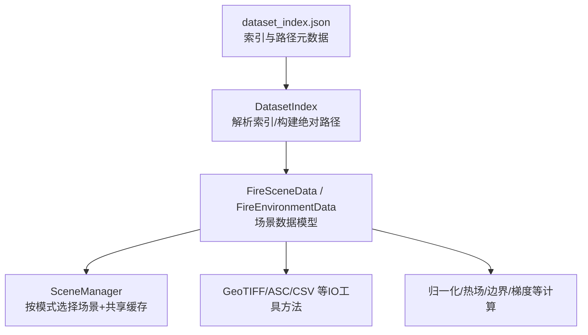
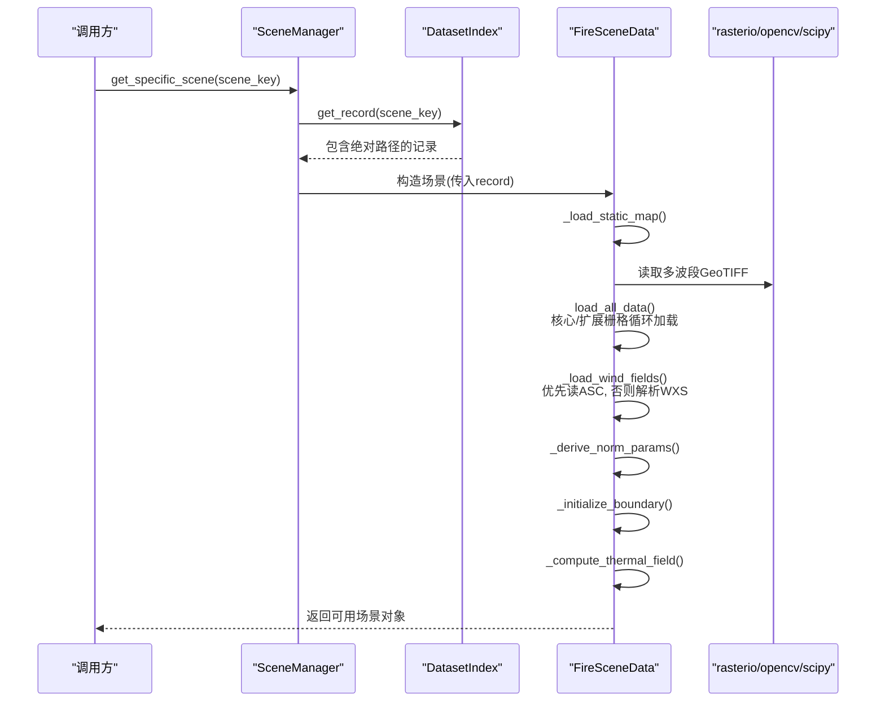
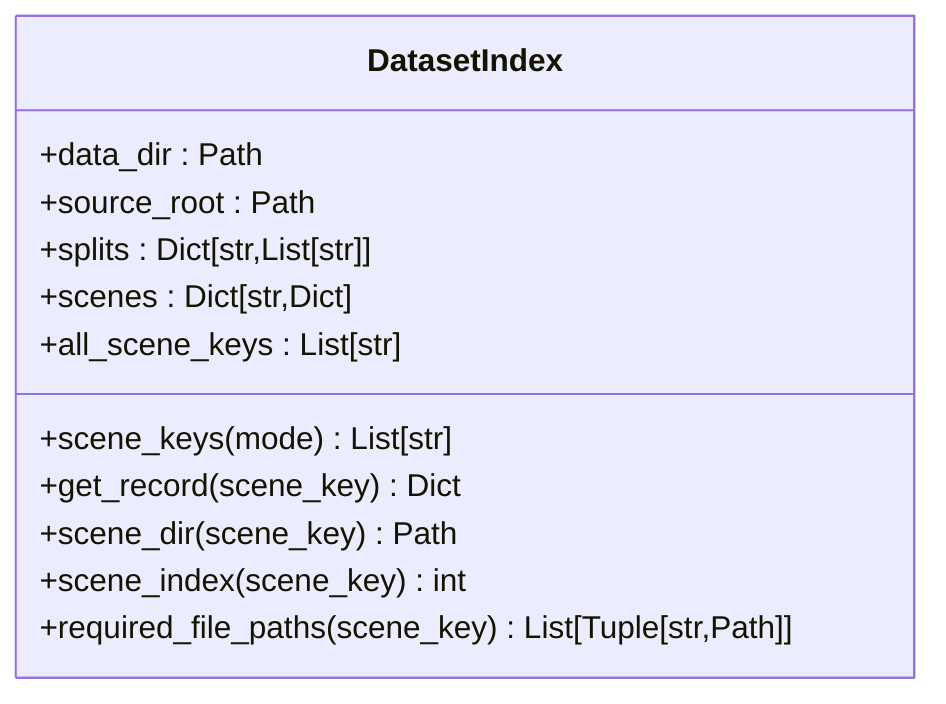
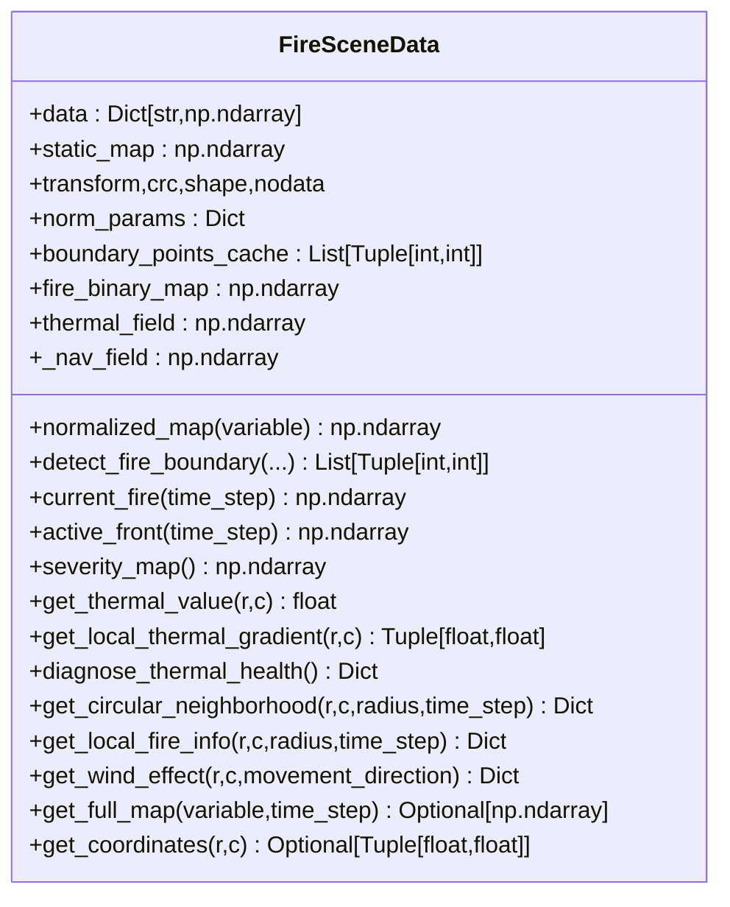
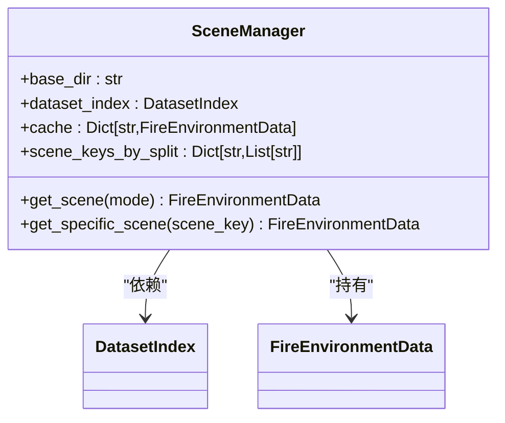
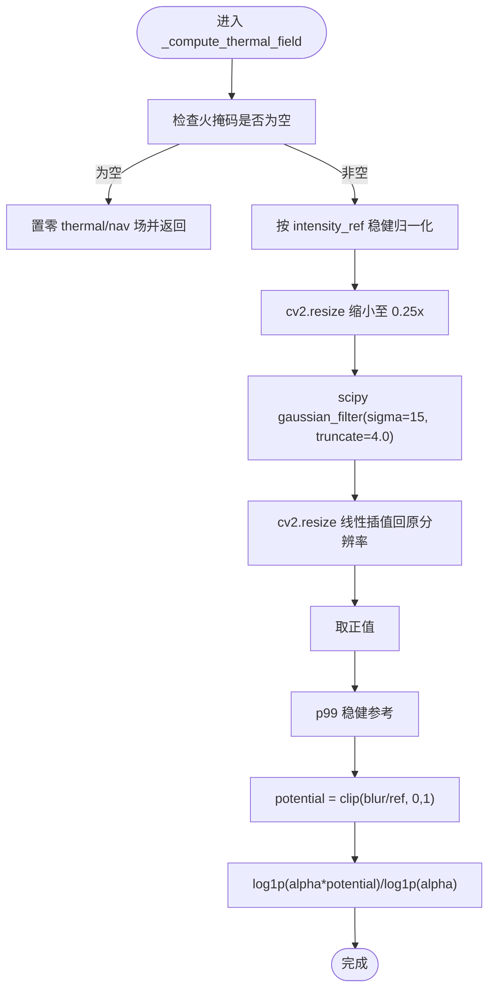
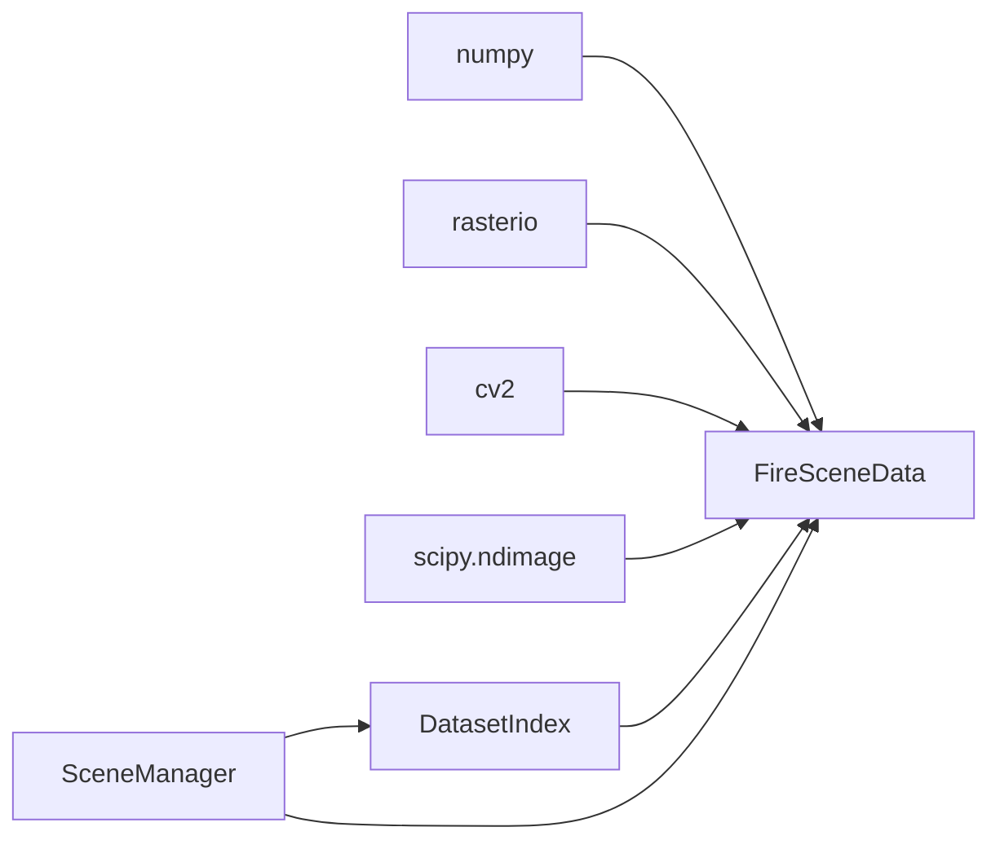

# 数据处理架构

<cite>
**本文引用的文件**   
- [信息转换.py](file://environment_variables/environment_variables/信息转换.py)
- [test_fire_scene_data.py](file://environment_variables/environment_variables/test_fire_scene_data.py)
- [test_thermal_field_optimization.py](file://environment_variables/environment_variables/test_thermal_field_optimization.py)
- [2026-07-06-thermal-field-optimization-design.md](file://docs/superpowers/specs/2026-07-06-thermal-field-optimization-design.md)
- [2026-07-06-thermal-field-optimization.md](file://docs/superpowers/plans/2026-07-06-thermal-field-optimization.md)
- [dataset_index.json](file://environment_variables/environment_variables/dataset/dataset_index.json)
</cite>

## 目录
1. [引言](#引言)
2. [项目结构](#项目结构)
3. [核心组件](#核心组件)
4. [架构总览](#架构总览)
5. [详细组件分析](#详细组件分析)
6. [依赖关系分析](#依赖关系分析)
7. [性能考量](#性能考量)
8. [故障排查指南](#故障排查指南)
9. [结论](#结论)
10. [附录](#附录)

## 引言
本文件面向数据处理与仿真场景的工程师，系统化阐述数据集索引管理、FARSITE 场景数据模型、栅格与矢量数据读写、坐标系统处理、热场计算优化（四分之一分辨率高斯模糊近似）、数据归一化策略、内存缓存机制与批量处理优化。文档同时提供 GeoTIFF 读写、ASC 风场读取、CSV 报告解析路径说明，并给出数据预处理管道示例与自定义数据格式支持指南，帮助读者快速理解并扩展该架构。

## 项目结构
仓库围绕“数据集索引 + 场景加载 + 环境数据封装”组织：
- 数据集索引：通过 dataset_index.json 描述源根目录、分片（train/validation/generalization/stress）与每个 scene 的路径元数据。
- 场景数据模型：FireSceneData/FireEnvironmentData 负责从索引定位并加载静态地图、动态栅格、输入与报告等文件，构建统一的数据视图。
- 场景管理器：SceneManager 按模式随机或指定获取场景，并提供跨实例共享的场景缓存，避免重复 IO 与重算。
- 测试与规范：单元测试覆盖场景加载、归一化、热场优化等关键行为；设计文档明确热场优化的目标与验收标准。

图表来源
- [信息转换.py:20-196](file://environment_variables/environment_variables/信息转换.py#L20-L196)
- [信息转换.py:219-322](file://environment_variables/environment_variables/信息转换.py#L219-L322)
- [信息转换.py:1282-1326](file://environment_variables/environment_variables/信息转换.py#L1282-L1326)
- [dataset_index.json:1-12](file://environment_variables/environment_variables/dataset/dataset_index.json#L1-L12)

章节来源
- [信息转换.py:20-196](file://environment_variables/environment_variables/信息转换.py#L20-L196)
- [信息转换.py:219-322](file://environment_variables/environment_variables/信息转换.py#L219-L322)
- [信息转换.py:1282-1326](file://environment_variables/environment_variables/信息转换.py#L1282-L1326)
- [dataset_index.json:1-12](file://environment_variables/environment_variables/dataset/dataset_index.json#L1-L12)

## 核心组件
- DatasetIndex：基于 dataset_index.json 构建 source_root、分片列表与场景记录，并将相对路径解析为绝对路径，便于后续 IO。
- FireSceneData/FireEnvironmentData：封装单个 FARSITE 场景的全部数据，包括静态多波段地图、核心与扩展栅格、风场、时间序列、边界点、热力场、导航场等，并提供归一化、局部邻域、风向影响、健康诊断等能力。
- SceneManager：按训练/验证/泛化/压力模式随机或固定选取场景，维护进程级共享缓存，减少重复加载与计算。

章节来源
- [信息转换.py:20-196](file://environment_variables/environment_variables/信息转换.py#L20-L196)
- [信息转换.py:219-322](file://environment_variables/environment_variables/信息转换.py#L219-L322)
- [信息转换.py:1282-1326](file://environment_variables/environment_variables/信息转换.py#L1282-L1326)

## 架构总览
下图展示从索引到场景对象的关键调用链与数据流，涵盖路径解析、栅格加载、风场生成、归一化参数推导、边界初始化与热场计算。

图表来源
- [信息转换.py:1282-1326](file://environment_variables/environment_variables/信息转换.py#L1282-L1326)
- [信息转换.py:392-524](file://environment_variables/environment_variables/信息转换.py#L392-L524)
- [信息转换.py:473-500](file://environment_variables/environment_variables/信息转换.py#L473-L500)
- [信息转换.py:559-602](file://environment_variables/environment_variables/信息转换.py#L559-L602)
- [信息转换.py:684-721](file://environment_variables/environment_variables/信息转换.py#L684-L721)
- [信息转换.py:759-819](file://environment_variables/environment_variables/信息转换.py#L759-L819)

## 详细组件分析

### DatasetIndex 数据索引管理系统
- 职责
  - 解析 dataset_index.json，建立 source_root、分片映射与场景字典。
  - 将 scene_dir、metadata、static_map、rasters、vectors、inputs、reports 等相对路径解析为绝对路径，供后续 IO 使用。
  - 提供 required_file_paths 校验清单，辅助预检缺失文件。
- 关键点
  - 支持 mode 别名（如 test/eval -> generalization）。
  - 对 static_map 采用 source_root 拼接，其他资源采用 scene_dir 拼接。
  - 提供 scene_index 用于顺序编号。

图表来源
- [信息转换.py:20-196](file://environment_variables/environment_variables/信息转换.py#L20-L196)

章节来源
- [信息转换.py:20-196](file://environment_variables/environment_variables/信息转换.py#L20-L196)
- [dataset_index.json:1-12](file://environment_variables/environment_variables/dataset/dataset_index.json#L1-L12)

### FireSceneData 场景数据模型
- 数据加载
  - 静态地图：多波段 GeoTIFF，按 STATIC_BAND_KEYS 拆分为 elevation/slope/aspect/fuel_model/canopy_* 等，并设置 transform/crs/shape/nodata。
  - 核心栅格：intensity/length/time/speedRate；可选扩展栅格：spread_direction/heat_per_unit_area/crown_fire。
  - 风场：优先读取 wind/wdir.asc 与 wind/wspd.asc；若不存在则解析 weather_stream.wxs 得到平均风速与方向，填充全图常量场。
  - 地形占位：若无真实地形，可生成零值 dem/slope/aspect。
- 坐标系统与形状一致性
  - 所有栅格需与静态地图 shape 一致，否则抛出形状不匹配异常。
  - 提供 get_coordinates(row,col) 通过 rasterio.transform.xy 转换为地理坐标。
- 边界与火场
  - detect_fire_boundary 根据 intensity 阈值与 time 序列筛选当前时刻火区，利用形态学腐蚀提取活动前沿，并缓存 boundary_points。
  - initialize_training_boundary 支持按面积百分比选择初始火区，并记录 last_init_area_stats。
- 归一化
  - normalized_map 支持 DEM 区间归一化与其他字段按 max 缩放，输出裁剪至 [0,1]。
  - _derive_norm_params 使用正数百分位统计与元数据中的风场范围，推导各字段归一化参数。
- 热场与导航场
  - _compute_thermal_field 实现方案 C：在火区内以 per-scene 强度参考进行稳健归一化，四分之一分辨率下高斯模糊，再上采样回原分辨率，并以 p99 做稳健参考，最终 clip 到 [0,1]；同时生成 log 压缩的导航场用于梯度计算。
- 观测与邻域
  - severity_map 综合强度、长度、速度、单位面积热量、冠层火的加权评分。
  - get_circular_neighborhood 提取圆形邻域特征，fire_binary_mask 与 circular_mask 配合掩码。
  - get_local_fire_info 统计邻域内火点数、边界点数、最近距离与方向。
  - get_wind_effect 计算移动方向与风向夹角带来的阻力与电池惩罚。
- 健康诊断
  - diagnose_thermal_health 检查饱和比例、非零比例、高热区零梯度比例与势场分位数，辅助训练前自检。

图表来源
- [信息转换.py:219-322](file://environment_variables/environment_variables/信息转换.py#L219-L322)
- [信息转换.py:392-524](file://environment_variables/environment_variables/信息转换.py#L392-L524)
- [信息转换.py:559-602](file://environment_variables/environment_variables/信息转换.py#L559-L602)
- [信息转换.py:616-637](file://environment_variables/environment_variables/信息转换.py#L616-L637)
- [信息转换.py:684-721](file://environment_variables/environment_variables/信息转换.py#L684-L721)
- [信息转换.py:759-819](file://environment_variables/environment_variables/信息转换.py#L759-L819)
- [信息转换.py:903-918](file://environment_variables/environment_variables/信息转换.py#L903-L918)
- [信息转换.py:920-970](file://environment_variables/environment_variables/信息转换.py#L920-L970)
- [信息转换.py:972-1012](file://environment_variables/environment_variables/信息转换.py#L972-L1012)
- [信息转换.py:1014-1123](file://environment_variables/environment_variables/信息转换.py#L1014-L1123)
- [信息转换.py:1125-1165](file://environment_variables/environment_variables/信息转换.py#L1125-L1165)
- [信息转换.py:1267-1275](file://environment_variables/environment_variables/信息转换.py#L1267-L1275)
- [信息转换.py:1256-1265](file://environment_variables/environment_variables/信息转换.py#L1256-L1265)

章节来源
- [信息转换.py:219-322](file://environment_variables/environment_variables/信息转换.py#L219-L322)
- [信息转换.py:392-524](file://environment_variables/environment_variables/信息转换.py#L392-L524)
- [信息转换.py:559-602](file://environment_variables/environment_variables/信息转换.py#L559-L602)
- [信息转换.py:616-637](file://environment_variables/environment_variables/信息转换.py#L616-L637)
- [信息转换.py:684-721](file://environment_variables/environment_variables/信息转换.py#L684-L721)
- [信息转换.py:759-819](file://environment_variables/environment_variables/信息转换.py#L759-L819)
- [信息转换.py:903-918](file://environment_variables/environment_variables/信息转换.py#L903-L918)
- [信息转换.py:920-970](file://environment_variables/environment_variables/信息转换.py#L920-L970)
- [信息转换.py:972-1012](file://environment_variables/environment_variables/信息转换.py#L972-L1012)
- [信息转换.py:1014-1123](file://environment_variables/environment_variables/信息转换.py#L1014-L1123)
- [信息转换.py:1125-1165](file://environment_variables/environment_variables/信息转换.py#L1125-L1165)
- [信息转换.py:1267-1275](file://environment_variables/environment_variables/信息转换.py#L1267-L1275)
- [信息转换.py:1256-1265](file://environment_variables/environment_variables/信息转换.py#L1256-L1265)

### SceneManager 场景管理与缓存
- 职责
  - 按 split 随机或固定获取场景。
  - 进程级共享缓存 _shared_scene_cache，避免 evaluate 时重复创建环境与重复 IO/计算。
- 关键点
  - 支持外部覆盖 scene_keys_by_split，便于实验控制。
  - get_specific_scene 先查缓存，未命中则构造 FireEnvironmentData 并写入缓存。

图表来源
- [信息转换.py:1282-1326](file://environment_variables/environment_variables/信息转换.py#L1282-L1326)

章节来源
- [信息转换.py:1282-1326](file://environment_variables/environment_variables/信息转换.py#L1282-L1326)

### 热场计算优化算法（四分之一分辨率高斯模糊近似）
- 设计目标
  - 保持输出形状与范围不变，显著降低冷启动计算耗时，同时保证数值误差可控。
- 核心流程
  - 在火区内以 per-scene 强度参考进行稳健归一化。
  - 使用 OpenCV 将源图缩小至 0.25 倍，应用 scipy gaussian_filter(sigma=15, truncate=4.0)。
  - 线性插值上采样回原分辨率，取正值后以 p99 做稳健参考，clip 到 [0,1]。
  - 生成 log 压缩导航场用于梯度计算。
- 缓存策略
  - 使用 BLAKE2b 对打包的二值火掩码求摘要作为缓存键，区分相同数量但不同位置的火区。
  - 缓存低分辨率模糊结果，每次调用时上采样复用。
- 验收指标
  - 输出形状与范围不变；MAE ≤ 0.5；阈值不一致率 ≤ 0.2%；冷启动加速 ≥ 20x。

图表来源
- [信息转换.py:759-819](file://environment_variables/environment_variables/信息转换.py#L759-L819)
- [2026-07-06-thermal-field-optimization-design.md:1-29](file://docs/superpowers/specs/2026-07-06-thermal-field-optimization-design.md#L1-L29)
- [2026-07-06-thermal-field-optimization.md:41-142](file://docs/superpowers/plans/2026-07-06-thermal-field-optimization.md#L41-L142)

章节来源
- [信息转换.py:759-819](file://environment_variables/environment_variables/信息转换.py#L759-L819)
- [2026-07-06-thermal-field-optimization-design.md:1-29](file://docs/superpowers/specs/2026-07-06-thermal-field-optimization-design.md#L1-L29)
- [2026-07-06-thermal-field-optimization.md:41-142](file://docs/superpowers/plans/2026-07-06-thermal-field-optimization.md#L41-L142)

### 数据归一化策略
- DEM 归一化：按 (dem - dem_min)/(dem_max - dem_min)，分母最小为 1.0，结果裁剪至 [0,1]。
- 其他栅格：按对应 max 参数归一化，slope 与 wind_speed 使用专用参数 key。
- 参数推导：基于正数百分位统计与元数据中的风场范围，确保鲁棒性。
- 输出：所有 normalized_map 返回值均被裁剪至 [0,1]。

章节来源
- [信息转换.py:559-602](file://environment_variables/environment_variables/信息转换.py#L559-L602)
- [信息转换.py:616-637](file://environment_variables/environment_variables/信息转换.py#L616-L637)

### 内存缓存机制与批量处理优化
- 场景级缓存：SceneManager._shared_scene_cache 跨实例共享，避免重复 IO 与重算。
- 热场缓存：基于二值火掩码的 BLAKE2b 摘要作为缓存键，缓存低分辨率模糊结果，提升重复状态下的吞吐。
- 批量预检：validate_scene_boundaries 可一次性校验多个场景的文件完整性与 t=0 边界有效性，提前发现无效场景。

章节来源
- [信息转换.py:1282-1326](file://environment_variables/environment_variables/信息转换.py#L1282-L1326)
- [信息转换.py:759-819](file://environment_variables/environment_variables/信息转换.py#L759-L819)
- [信息转换.py:1329-1416](file://environment_variables/environment_variables/信息转换.py#L1329-L1416)

### GeoTIFF 读写、矢量数据处理与 CSV 报告解析
- GeoTIFF 读写
  - load_raster 使用 rasterio.open 读取多波段栅格，处理 nodata/NaN/Inf，单波段自动降维，并返回 transform/crs/shape/bounds 等元数据。
  - _load_static_map 强制要求多波段数等于 STATIC_BAND_KEYS 数量，并拆分波段到 data/static_bands。
- ASC 风场读取
  - load_asc 解析 ASCII 网格，跳过头部 6 行，逐行转为浮点矩阵。
  - _load_wind_fields 优先读取 wind/wdir.asc 与 wind/wspd.asc；否则解析 weather_stream.wxs 得到平均风速与方向，填充全图常量场。
- CSV 报告解析
  - dataset_index.json 中 reports.fire_growth_report 指向 fire_growth_report.csv，可作为训练/评估的补充指标来源（由上层逻辑按需读取）。

章节来源
- [信息转换.py:392-424](file://environment_variables/environment_variables/信息转换.py#L392-L424)
- [信息转换.py:473-500](file://environment_variables/environment_variables/信息转换.py#L473-L500)
- [dataset_index.json:115-126](file://environment_variables/environment_variables/dataset/dataset_index.json#L115-L126)

### 数据预处理管道示例
- 步骤
  1) 使用 SceneManager.get_specific_scene 获取场景对象。
  2) 调用 normalized_map 获取归一化后的 DEM/强度/坡度/风速等。
  3) 使用 current_fire/active_front 获取当前火区与活动前沿。
  4) 使用 get_circular_neighborhood 提取局部邻域特征。
  5) 使用 get_wind_effect 计算移动方向的风阻与能耗。
  6) 使用 diagnose_thermal_health 进行热场健康检查。
- 参考用例
  - 单元测试展示了场景加载、归一化裁剪、观察向量维度与奖励分解等断言。

章节来源
- [test_fire_scene_data.py:28-109](file://environment_variables/environment_variables/test_fire_scene_data.py#L28-L109)
- [test_fire_scene_data.py:111-157](file://environment_variables/environment_variables/test_fire_scene_data.py#L111-L157)
- [test_fire_scene_data.py:158-220](file://environment_variables/environment_variables/test_fire_scene_data.py#L158-L220)
- [test_fire_scene_data.py:221-257](file://environment_variables/environment_variables/test_fire_scene_data.py#L221-L257)

### 自定义数据格式支持指南
- 新增栅格类型
  - 在 FIRE 场景的 rasters 配置中添加新键，并在 CORE_KEYS/EXTRA_RASTER_KEYS 与 NORM_RASTER_PARAMS/NORM_ALIASES 中注册。
  - 若需要新的归一化方式，可在 normalized_map 分支中增加处理逻辑。
- 新增风场来源
  - 若存在新的风场格式，可在 _load_wind_fields 中增加读取分支，并保证输出形状与 shape 一致。
- 新增报告字段
  - 在 dataset_index.json 的 reports 中声明新 CSV 路径，上层逻辑按需解析。

章节来源
- [信息转换.py:219-246](file://environment_variables/environment_variables/信息转换.py#L219-L246)
- [信息转换.py:616-637](file://environment_variables/environment_variables/信息转换.py#L616-L637)
- [信息转换.py:473-500](file://environment_variables/environment_variables/信息转换.py#L473-L500)
- [dataset_index.json:115-126](file://environment_variables/environment_variables/dataset/dataset_index.json#L115-L126)

## 依赖关系分析
- 外部库
  - numpy：数组运算与统计。
  - rasterio：GeoTIFF 读写与坐标变换。
  - cv2：图像缩放（INTER_AREA/INTER_LINEAR）。
  - scipy.ndimage.gaussian_filter：高斯模糊。
- 内部模块
  - DatasetIndex 为 FireSceneData 提供路径与元数据。
  - SceneManager 组合 DatasetIndex 与 FireEnvironmentData，并提供缓存。

图表来源
- [信息转换.py:1-14](file://environment_variables/environment_variables/信息转换.py#L1-L14)
- [信息转换.py:20-196](file://environment_variables/environment_variables/信息转换.py#L20-L196)
- [信息转换.py:1282-1326](file://environment_variables/environment_variables/信息转换.py#L1282-L1326)

章节来源
- [信息转换.py:1-14](file://environment_variables/environment_variables/信息转换.py#L1-L14)
- [信息转换.py:20-196](file://environment_variables/environment_variables/信息转换.py#L20-L196)
- [信息转换.py:1282-1326](file://environment_variables/environment_variables/信息转换.py#L1282-L1326)

## 性能考量
- 热场计算优化
  - 四分之一分辨率高斯模糊显著降低计算量，结合缓存策略，冷启动加速可达 20x 以上。
  - 使用 BLAKE2b 对二值掩码打包位图摘要，避免相同计数不同位置导致的误命中。
- 内存占用
  - 场景共享缓存避免重复分配大数组。
  - 邻域切片与掩码操作尽量就地或拷贝小区域，降低峰值内存。
- I/O 优化
  - 静态地图一次读取多波段，避免多次打开文件。
  - 风场优先读取 ASC，失败时解析 WXS 并填充常量场，减少额外磁盘访问。

[本节为通用性能建议，无需特定文件引用]

## 故障排查指南
- 常见错误
  - 场景目录不存在：构造场景时若 scene_dir_abs 不存在会抛 FileNotFoundError。
  - 静态地图缺失或多波段数不符：_load_static_map 会抛出相应异常。
  - 栅格形状不匹配：_assert_raster_shape 比较 static_map 与各栅格 shape，不一致即报错。
  - 风场形状不匹配：load_all_data 末尾校验 wind speed/direction 与 shape 一致。
  - 无有效 t=0 边界：_initialize_boundary 检测到空边界会抛出 InvalidSceneError。
- 诊断工具
  - validate_scene_boundaries：批量校验场景文件完整性与边界有效性。
  - diagnose_thermal_health：检查热场饱和比例、非零比例与高热区零梯度比例。

章节来源
- [信息转换.py:269-272](file://environment_variables/environment_variables/信息转换.py#L269-L272)
- [信息转换.py:501-524](file://environment_variables/environment_variables/信息转换.py#L501-L524)
- [信息转换.py:525-532](file://environment_variables/environment_variables/信息转换.py#L525-L532)
- [信息转换.py:670-678](file://environment_variables/environment_variables/信息转换.py#L670-L678)
- [信息转换.py:684-693](file://environment_variables/environment_variables/信息转换.py#L684-L693)
- [信息转换.py:1329-1416](file://environment_variables/environment_variables/信息转换.py#L1329-L1416)
- [信息转换.py:972-1012](file://environment_variables/environment_variables/信息转换.py#L972-L1012)

## 结论
该数据处理架构以 dataset_index.json 为中心，通过 DatasetIndex 与 FireSceneData/FireEnvironmentData 实现了 FARSITE 场景的统一建模与高效加载；SceneManager 提供按模式管理与共享缓存，显著提升批量评估效率。热场计算采用四分之一分辨率高斯模糊近似与稳健归一化，在保证精度的前提下大幅提升性能。完善的归一化、边界检测、邻域观测与诊断工具，使该架构具备良好的可扩展性与工程可用性。

[本节为总结性内容，无需特定文件引用]

## 附录
- 术语
  - 静态地图：多波段 GeoTIFF，包含地形与植被等基础信息。
  - 核心栅格：强度、火焰长度、到达时间、蔓延速率等。
  - 扩展栅格：蔓延方向、单位面积热量、冠层火活动等。
  - 风场：风速与风向栅格，来源于 ASC 或天气流文件。
  - 热场：基于强度与火区的平滑势场，用于导航与梯度计算。
- 参考测试
  - 场景加载与归一化断言见 test_fire_scene_data.py。
  - 热场优化行为与范围断言见 test_thermal_field_optimization.py。

章节来源
- [test_fire_scene_data.py:28-109](file://environment_variables/environment_variables/test_fire_scene_data.py#L28-L109)
- [test_thermal_field_optimization.py:25-66](file://environment_variables/environment_variables/test_thermal_field_optimization.py#L25-L66)