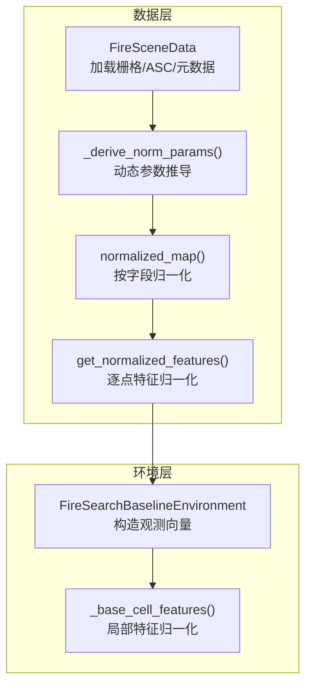
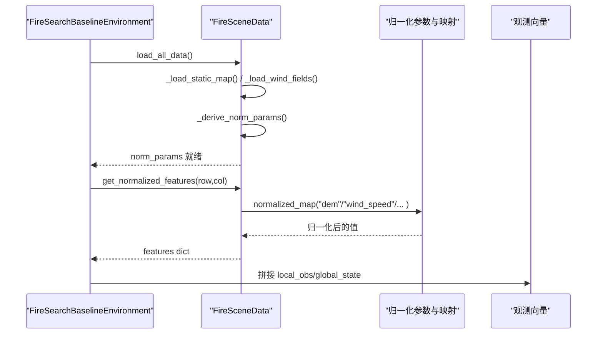
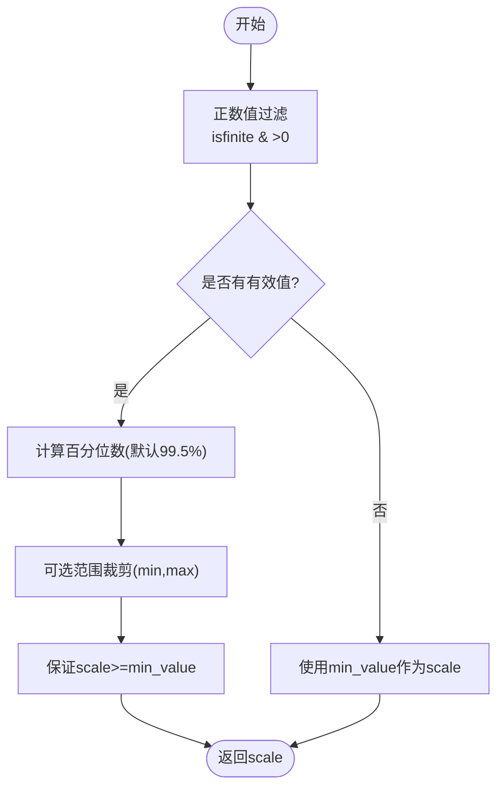
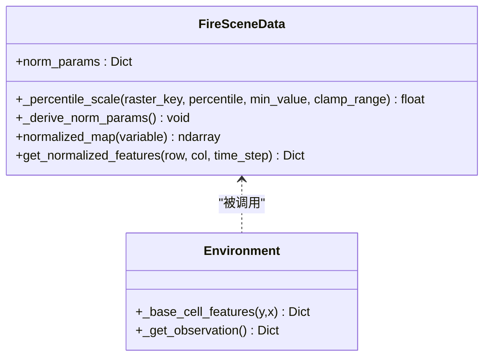
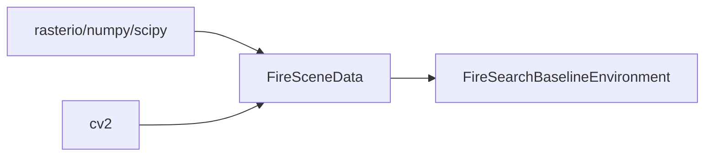

# 数据归一化系统

<cite>
**本文引用的文件**   
- [信息转换.py](file://environment_variables/environment_variables/信息转换.py)
- [rl_environment_baseline.py](file://environment_variables/environment_variables/rl_environment_baseline.py)
</cite>

## 目录
1. [简介](#简介)
2. [项目结构](#项目结构)
3. [核心组件](#核心组件)
4. [架构总览](#架构总览)
5. [详细组件分析](#详细组件分析)
6. [依赖关系分析](#依赖关系分析)
7. [性能考量](#性能考量)
8. [故障排查指南](#故障排查指南)
9. [结论](#结论)
10. [附录](#附录)

## 简介
本文件面向“数据归一化系统”，聚焦以下目标：
- 多种归一化策略的实现与使用，包括DEM高程数据的线性归一化、风速数据的最大值归一化、火灾指标的百分位数归一化。
- 动态归一化参数推导算法：正数值过滤、百分位数计算、范围裁剪机制。
- 日志记录与调试输出：关键统计量的监控与诊断。
- 异常处理：零除保护、NaN值处理、负值修正。
- 不同数据类型的归一化规则：连续型变量、角度数据（风向）和二元掩码的特殊处理。
- 扩展接口与最佳实践：如何新增自定义归一化函数与接入流程。

## 项目结构
与归一化相关的核心代码集中在两个文件中：
- 场景数据与归一化逻辑：[信息转换.py](file://environment_variables/environment_variables/信息转换.py)
- 环境观测构建与特征拼接：[rl_environment_baseline.py](file://environment_variables/environment_variables/rl_environment_baseline.py)

图表来源
- [信息转换.py:559-602](file://environment_variables/environment_variables/信息转换.py#L559-L602)
- [信息转换.py:616-637](file://environment_variables/environment_variables/信息转换.py#L616-L637)
- [信息转换.py:1187-1234](file://environment_variables/environment_variables/信息转换.py#L1187-L1234)
- [rl_environment_baseline.py:438-490](file://environment_variables/environment_variables/rl_environment_baseline.py#L438-L490)

章节来源
- [信息转换.py:219-322](file://environment_variables/environment_variables/信息转换.py#L219-L322)
- [rl_environment_baseline.py:438-490](file://environment_variables/environment_variables/rl_environment_baseline.py#L438-L490)

## 核心组件
- FireSceneData：负责场景数据加载、静态地形与风场读取、动态归一化参数推导、逐像素归一化、热势场与梯度计算等。
- FireSearchBaselineEnvironment：在环境步中调用场景数据，组装本地观测与全局状态，复用已计算的归一化结果。

关键职责划分
- 参数推导：基于正数过滤、百分位数与范围裁剪，生成每场景的归一化参数字典。
- 归一化实现：提供按字段归一化的通用方法与逐点特征归一化方法。
- 类型特化：DEM线性归一化、风速最大值归一化、风向角度编码为sin/cos。
- 异常防护：零除保护、NaN清理、负值截断。

章节来源
- [信息转换.py:534-557](file://environment_variables/environment_variables/信息转换.py#L534-L557)
- [信息转换.py:559-602](file://environment_variables/environment_variables/信息转换.py#L559-L602)
- [信息转换.py:616-637](file://environment_variables/environment_variables/信息转换.py#L616-L637)
- [信息转换.py:1187-1234](file://environment_variables/environment_variables/信息转换.py#L1187-L1234)
- [rl_environment_baseline.py:438-490](file://environment_variables/environment_variables/rl_environment_baseline.py#L438-L490)

## 架构总览
下图展示了从场景数据到环境观测的完整归一化链路，以及关键的数据流与控制流。

图表来源
- [信息转换.py:639-682](file://environment_variables/environment_variables/信息转换.py#L639-L682)
- [信息转换.py:616-637](file://environment_variables/environment_variables/信息转换.py#L616-L637)
- [rl_environment_baseline.py:565-658](file://environment_variables/environment_variables/rl_environment_baseline.py#L565-L658)

## 详细组件分析

### 动态归一化参数推导算法
- 正数值过滤：对输入栅格进行有限性与正值筛选，避免噪声与无效值影响统计量。
- 百分位数计算：对强度、长度、速度、热量、冠层火等指标采用高百分位（默认99.5%）作为参考尺度；风向最小值为360度以保证角度归一化分母合理。
- 范围裁剪：对强度等指标设置上下界裁剪区间，防止极端值导致尺度失真。
- DEM线性归一化：以正数过滤后的最小/最大值为范围，若范围退化则回退为+1的安全范围。
- 风速最大值：优先取栅格最大值，再与元数据中的风速字段比较取最大，确保覆盖极端天气。
- 零除保护：所有除法前将分母与max(..., 1.0)比较，避免除以0或极小值。

图表来源
- [信息转换.py:534-557](file://environment_variables/environment_variables/信息转换.py#L534-L557)
- [信息转换.py:559-602](file://environment_variables/environment_variables/信息转换.py#L559-L602)

章节来源
- [信息转换.py:534-557](file://environment_variables/environment_variables/信息转换.py#L534-L557)
- [信息转换.py:559-602](file://environment_variables/environment_variables/信息转换.py#L559-L602)

### 归一化策略与数据类型规则
- DEM高程（连续型）：线性归一化至[0,1]，分母为(max-min)且至少为1，避免零除。
- 风速（连续型）：最大值归一化，分母为max(speed, 1.0)。
- 火灾指标（连续型）：强度、长度、速度、热量、冠层火等采用百分位数归一化，并支持范围裁剪。
- 角度数据（风向）：不直接做线性归一化，而是转换为sin/cos双通道，保留周期性语义。
- 二元掩码（火边界/热力场）：保持二值或阈值后二值，不参与线性缩放；用于计数、形态学操作与可视化。

图表来源
- [信息转换.py:559-602](file://environment_variables/environment_variables/信息转换.py#L559-L602)
- [信息转换.py:616-637](file://environment_variables/environment_variables/信息转换.py#L616-L637)
- [信息转换.py:1187-1234](file://environment_variables/environment_variables/信息转换.py#L1187-L1234)
- [rl_environment_baseline.py:438-490](file://environment_variables/environment_variables/rl_environment_baseline.py#L438-L490)

章节来源
- [信息转换.py:616-637](file://environment_variables/environment_variables/信息转换.py#L616-L637)
- [信息转换.py:1187-1234](file://environment_variables/environment_variables/信息转换.py#L1187-L1234)
- [rl_environment_baseline.py:438-490](file://environment_variables/environment_variables/rl_environment_baseline.py#L438-L490)

### 日志记录与调试输出
- 归一化参数摘要：在场景加载完成后打印关键参数的汇总，便于快速检查尺度是否合理。
- 热场健康诊断：提供热场分布统计、饱和比例、非零比例、高热区零梯度比例、分位数等指标，辅助定位归一化与平滑参数问题。
- 训练阶段监控：环境在构造观测时复用已归一化特征，无需重复计算，减少开销。

章节来源
- [信息转换.py:604-614](file://environment_variables/environment_variables/信息转换.py#L604-L614)
- [信息转换.py:972-1012](file://environment_variables/environment_variables/信息转换.py#L972-L1012)

### 异常处理与鲁棒性
- NaN与无穷值：读取栅格时将nodata置0，并用nan_to_num替换NaN/Inf为0，随后将所有负值截断为0，确保后续统计与归一化稳定。
- 零除保护：所有除法分母均与1.0取max，避免除以0或极小值导致的数值不稳定。
- 负值修正：在读取阶段统一将负值设为0，避免物理意义不符的值进入归一化。
- 形状一致性校验：各栅格需与静态地图shape一致，否则抛出错误，防止广播与索引越界。

章节来源
- [信息转换.py:392-413](file://environment_variables/environment_variables/信息转换.py#L392-L413)
- [信息转换.py:525-532](file://environment_variables/environment_variables/信息转换.py#L525-L532)
- [信息转换.py:616-637](file://environment_variables/environment_variables/信息转换.py#L616-L637)

### 不同数据类型的归一化规则
- 连续型变量（DEM、风速、强度、长度、速度、热量、冠层火）：分别采用线性或百分位数归一化，输出限定在[0,1]。
- 角度数据（风向）：转换为sin/cos双通道，避免角度周期性问题。
- 二元掩码（火边界、热力场）：不进行线性缩放，仅用于计数、形态学操作与阈值判定。

章节来源
- [信息转换.py:616-637](file://environment_variables/environment_variables/信息转换.py#L616-L637)
- [信息转换.py:1187-1234](file://environment_variables/environment_variables/信息转换.py#L1187-L1234)
- [rl_environment_baseline.py:485-490](file://environment_variables/environment_variables/rl_environment_baseline.py#L485-L490)

### 扩展接口与最佳实践
- 新增字段归一化步骤：
  - 在NORM_RASTER_PARAMS中添加新字段到对应参数键的映射。
  - 在_get_normalized_features或normalized_map中增加分支，指定分母参数键。
  - 在_derive_norm_params中为新字段添加百分位数或最大值推导逻辑。
- 建议：
  - 始终使用_positive_values进行正数过滤，避免异常值影响百分位数。
  - 为易出现极端值的指标配置clamp_range，限制尺度上下界。
  - 对角度类字段优先采用sin/cos编码而非线性归一化。
  - 对所有除法分母执行max(..., 1.0)保护。
  - 在训练前运行validate_scene_boundaries与diagnose_thermal_health，确认数据与热场健康。

章节来源
- [信息转换.py:224-236](file://environment_variables/environment_variables/信息转换.py#L224-L236)
- [信息转换.py:559-602](file://environment_variables/environment_variables/信息转换.py#L559-L602)
- [信息转换.py:616-637](file://environment_variables/environment_variables/信息转换.py#L616-L637)
- [信息转换.py:1187-1234](file://environment_variables/environment_variables/信息转换.py#L1187-L1234)

## 依赖关系分析
- 模块内依赖：
  - FireSceneData内部通过_load_static_map/_load_wind_fields准备数据，再由_derive_norm_params推导参数，最后由normalized_map/get_normalized_features执行归一化。
  - FireSearchBaselineEnvironment在_get_observation中调用场景对象的归一化方法，拼装观测向量。
- 外部库：
  - numpy/scipy/rasterio用于栅格读写与数值运算。
  - cv2用于下采样与上采样，配合高斯模糊构建热势场。

图表来源
- [信息转换.py:392-413](file://environment_variables/environment_variables/信息转换.py#L392-L413)
- [信息转换.py:795-800](file://environment_variables/environment_variables/信息转换.py#L795-L800)
- [rl_environment_baseline.py:565-658](file://environment_variables/environment_variables/rl_environment_baseline.py#L565-L658)

章节来源
- [信息转换.py:392-413](file://environment_variables/environment_variables/信息转换.py#L392-L413)
- [rl_environment_baseline.py:565-658](file://environment_variables/environment_variables/rl_environment_baseline.py#L565-L658)

## 性能考量
- 归一化参数仅在场景加载时计算一次，并在缓存中复用，避免重复计算。
- 逐点特征归一化在环境步中按需获取，避免全图重复归一化。
- 热势场采用先下采样再高斯模糊，再上采样回原分辨率的策略，降低计算成本同时保留空间平滑效果。
- 使用np.clip与max(..., 1.0)避免昂贵条件判断与异常分支。

章节来源
- [信息转换.py:639-682](file://environment_variables/environment_variables/信息转换.py#L639-L682)
- [信息转换.py:795-800](file://environment_variables/environment_variables/信息转换.py#L795-L800)

## 故障排查指南
- 现象：归一化结果为NaN或Inf
  - 排查：检查栅格读取阶段的NaN/Inf清理与负值截断是否正确；确认分母保护是否生效。
- 现象：DEM归一化恒为常数
  - 排查：检查_dem_min与_dem_max是否相等，若退化会回退为+1安全范围；确认输入DEM是否存在有效正值。
- 现象：风速归一化异常偏高
  - 排查：查看_derive_norm_params中风速最大值是否来自栅格与元数据比较；必要时调整wind_speed_max上限。
- 现象：风向特征表现不佳
  - 排查：确认使用sin/cos编码而非线性归一化；检查角度单位是否为度。
- 现象：热势场梯度消失
  - 排查：运行diagnose_thermal_health，关注zero_grad_in_high_ratio与饱和比例；调整高斯模糊sigma或百分位参考ref。

章节来源
- [信息转换.py:392-413](file://environment_variables/environment_variables/信息转换.py#L392-L413)
- [信息转换.py:559-602](file://environment_variables/environment_variables/信息转换.py#L559-L602)
- [信息转换.py:972-1012](file://environment_variables/environment_variables/信息转换.py#L972-L1012)

## 结论
该数据归一化系统围绕“稳健的参数推导”和“安全的归一化实现”展开，针对DEM、风速与火灾指标分别采用线性、最大值与百分位数策略，并通过正数过滤、范围裁剪与零除保护提升鲁棒性。角度数据采用sin/cos编码，二元掩码保持二值语义。系统在场景加载阶段完成参数推导与日志输出，并提供热场健康诊断工具，便于快速定位问题。扩展新字段只需在参数映射、推导与归一化分支处增补即可。

## 附录
- 常用归一化键名与用途：
  - intensity_max：强度指标百分位数参考
  - length_max：火焰长度百分位数参考
  - speedRate_max：蔓延速度百分位数参考
  - heat_per_unit_area_max：单位面积热量百分位数参考
  - crown_fire_max：冠层火百分位数参考
  - dem_min/dem_max：DEM线性归一化范围
  - slope_max：坡度最大值归一化
  - wind_speed_max：风速最大值归一化
  - fire_threshold：火边界阈值

章节来源
- [信息转换.py:224-236](file://environment_variables/environment_variables/信息转换.py#L224-L236)
- [信息转换.py:559-602](file://environment_variables/environment_variables/信息转换.py#L559-L602)