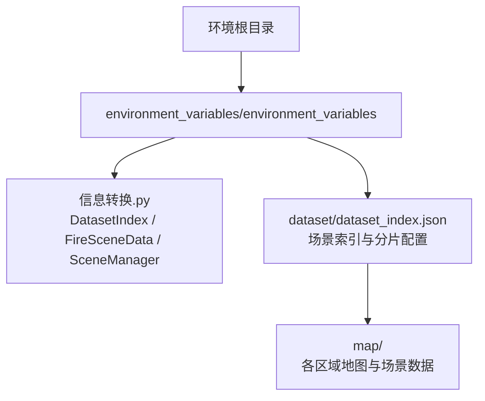
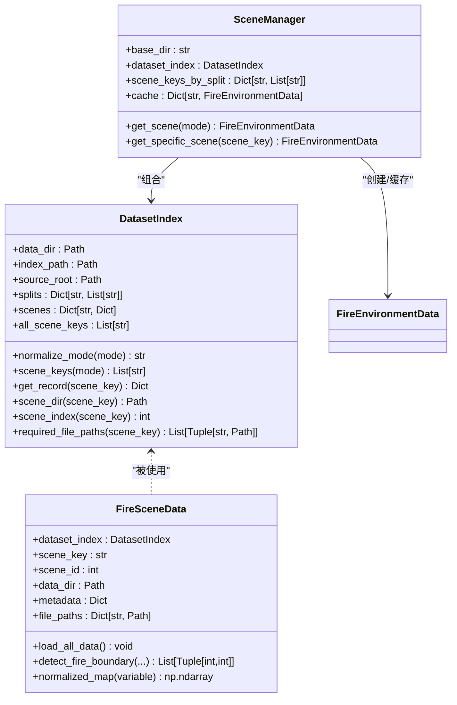
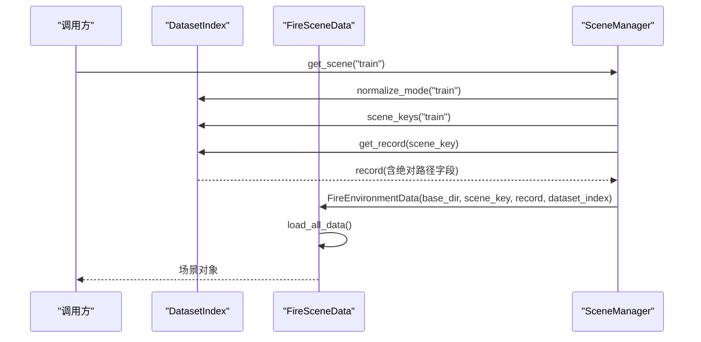
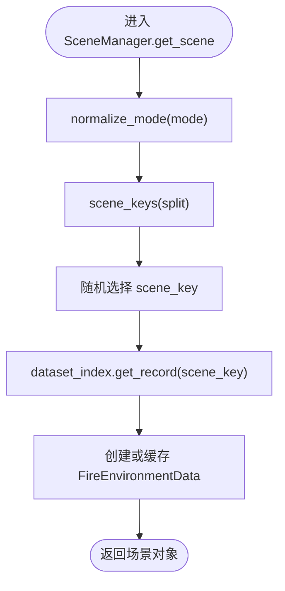
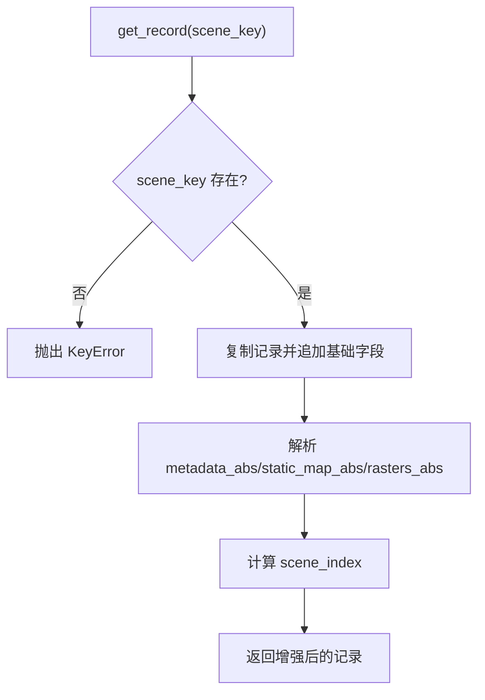
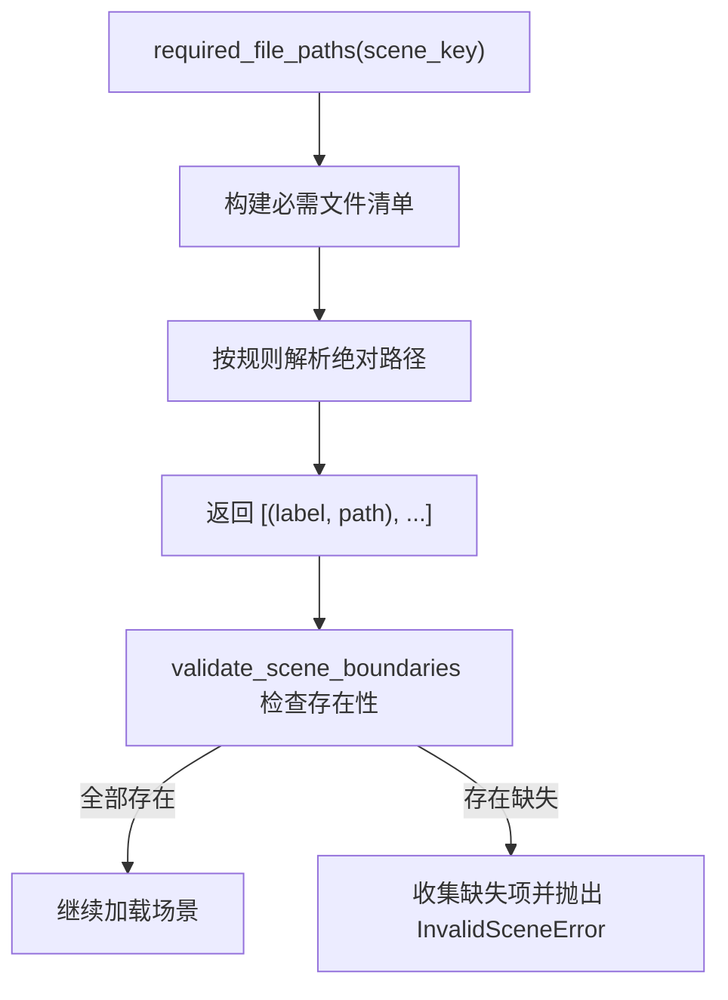
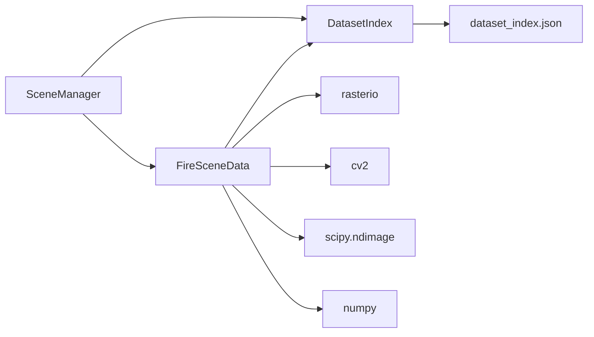

# 数据集索引管理

<cite>
**本文引用的文件**   
- [信息转换.py](file://environment_variables/environment_variables/信息转换.py)
- [dataset_index.json](file://environment_variables/environment_variables/dataset/dataset_index.json)
</cite>

## 目录
1. [简介](#简介)
2. [项目结构](#项目结构)
3. [核心组件](#核心组件)
4. [架构总览](#架构总览)
5. [详细组件分析](#详细组件分析)
6. [依赖关系分析](#依赖关系分析)
7. [性能考量](#性能考量)
8. [故障排查指南](#故障排查指南)
9. [结论](#结论)

## 简介
本文件面向“数据集索引管理系统”，围绕 DatasetIndex 类的设计与实现，系统性说明以下能力：
- dataset_index.json 配置文件的解析与校验
- 场景键（scene_key）管理与模式别名系统（train、validation、generalization、stress 等）
- 数据目录解析逻辑（支持绝对路径、相对路径、脚本目录自动定位）
- 场景分割管理（按 split 组织训练/验证/泛化/压力测试场景）
- get_record 方法的数据加载流程（元数据、栅格、矢量、输入与报告文件路径解析）
- required_file_paths 方法的文件验证机制与错误处理策略
- 场景索引计算与批量场景访问的实现细节

该文档以源码为依据，提供架构图、时序图与流程图，帮助读者快速理解并正确使用该系统。

## 项目结构
与数据集索引相关的核心代码位于 environment_variables/environment_variables/信息转换.py，配置文件位于 environment_variables/environment_variables/dataset/dataset_index.json。

图表来源
- [信息转换.py:20-196](file://environment_variables/environment_variables/信息转换.py#L20-L196)
- [dataset_index.json:1-120](file://environment_variables/environment_variables/dataset/dataset_index.json#L1-L120)

章节来源
- [信息转换.py:20-196](file://environment_variables/environment_variables/信息转换.py#L20-L196)
- [dataset_index.json:1-120](file://environment_variables/environment_variables/dataset/dataset_index.json#L1-L120)

## 核心组件
- DatasetIndex：负责解析 dataset_index.json，维护 splits/scenes/source_root，提供场景键查询、记录构建、路径解析与必需文件清单生成。
- FireSceneData：基于 DatasetIndex 提供的记录，加载具体场景的栅格、矢量、输入与报告文件，计算归一化参数、热场与边界点等。
- SceneManager：封装按模式（train/validation/generalization/stress）随机或指定获取场景的能力，并提供跨实例共享的场景缓存。

章节来源
- [信息转换.py:20-196](file://environment_variables/environment_variables/信息转换.py#L20-L196)
- [信息转换.py:219-323](file://environment_variables/environment_variables/信息转换.py#L219-L323)
- [信息转换.py:1282-1327](file://environment_variables/environment_variables/信息转换.py#L1282-L1327)

## 架构总览
下图展示了 DatasetIndex、FireSceneData 与 SceneManager 之间的交互关系，以及它们对 dataset_index.json 的依赖。

图表来源
- [信息转换.py:20-196](file://environment_variables/environment_variables/信息转换.py#L20-L196)
- [信息转换.py:219-323](file://environment_variables/environment_variables/信息转换.py#L219-L323)
- [信息转换.py:1282-1327](file://environment_variables/environment_variables/信息转换.py#L1282-L1327)

## 详细组件分析

### DatasetIndex 设计与实现
- 初始化与配置解析
  - 解析 data_dir 指向的 dataset_index.json；若不存在则抛出 FileNotFoundError。
  - 读取 source_root，若为相对路径则以 index_path.parent 为基准进行解析。
  - 将 splits 与 scenes 拷贝到内存字典，便于后续快速访问。
  - 汇总 all_scene_keys：先收集 train/validation/generalization/stress 四个标准 split 中的 scene_key，再补充未在 splits 中出现的其它场景键。
- 模式别名系统
  - normalize_mode 将用户传入的模式名映射为标准键，默认支持 train/validation/generalization/stress/test/eval，其中 test/eval 均映射到 generalization。
  - 未知模式会抛出 ValueError，提示期望值集合。
- 场景键管理
  - scene_keys(mode) 返回指定 split 下的 scene_key 列表；若为空则抛出 ValueError。
  - scene_index(scene_key) 返回场景在 all_scene_keys 中的序号（从 1 开始），不在列表中则返回 0。
- 数据目录解析逻辑
  - _resolve_data_dir(data_dir) 优先判断是否为绝对路径；否则尝试当前工作目录；最后回退到脚本所在目录。
  - scene_dir(scene_key) 根据记录的 scene_dir 字段解析绝对路径，若为相对路径则以 source_root 为基准。
- get_record 方法的数据加载流程
  - 校验 scene_key 是否存在于 scenes。
  - 复制原始记录，追加 scene_key、scene_dir_abs、metadata_abs、static_map_abs、rasters_abs、scene_index 等字段。
  - metadata 与 rasters 的路径若为相对路径，则以 scene_dir 为基准；static_map 若为相对路径，则以 source_root 为基准。
- required_file_paths 方法与文件验证机制
  - 构造必需文件清单，包括 metadata、static_map、核心栅格（intensity/time/length/speedRate）、扩展栅格（spread_direction/heat_per_unit_area/crown_fire）、矢量（ignition/fire_perimeter）、输入（weather_stream/fuel_moisture）与报告（fire_growth_report/run_log）。
  - 对于缺失字段，用占位符 __missing_path__ 表示，以便上层统一检测。
  - static_map 相对路径基于 source_root 解析，其余基于 scene_dir 解析。
  - 返回标签与绝对路径的元组列表，供上层 validate_scene_boundaries 进行存在性检查。

图表来源
- [信息转换.py:80-121](file://environment_variables/environment_variables/信息转换.py#L80-L121)
- [信息转换.py:1282-1327](file://environment_variables/environment_variables/信息转换.py#L1282-L1327)
- [信息转换.py:639-683](file://environment_variables/environment_variables/信息转换.py#L639-L683)

章节来源
- [信息转换.py:20-196](file://environment_variables/environment_variables/信息转换.py#L20-L196)
- [dataset_index.json:1-120](file://environment_variables/environment_variables/dataset/dataset_index.json#L1-L120)

### 场景分割管理（train/validation/generalization/stress）
- 配置层面
  - dataset_index.json 的 splits 字段定义了四个标准 split 及其包含的 scene_key 列表。
  - schema.required_rasters 定义了每个场景必须存在的栅格键集合。
- 运行时行为
  - SceneManager 通过 DatasetIndex.scene_keys(split) 获取对应 split 的 scene_key 列表。
  - get_scene(mode) 会从对应 split 中随机选择一个 scene_key，并通过 get_specific_scene 创建或复用场景对象。
  - 支持外部覆盖 scene_keys_by_split，用于实验控制。

图表来源
- [信息转换.py:80-94](file://environment_variables/environment_variables/信息转换.py#L80-L94)
- [信息转换.py:1282-1327](file://environment_variables/environment_variables/信息转换.py#L1282-L1327)

章节来源
- [dataset_index.json:34-88](file://environment_variables/environment_variables/dataset/dataset_index.json#L34-L88)
- [信息转换.py:1282-1327](file://environment_variables/environment_variables/信息转换.py#L1282-L1327)

### get_record 方法详解
- 输入：scene_key（字符串）
- 输出：包含丰富绝对路径字段的场景记录字典
- 关键步骤
  - 校验 scene_key 存在于 scenes，否则抛出 KeyError。
  - 计算 scene_dir_abs（基于 source_root 与 scene_dir）。
  - 解析 metadata_abs（默认 metadata.json，可自定义路径）。
  - 解析 static_map_abs（若存在且为相对路径，基于 source_root）。
  - 遍历 rasters 字典，解析每个栅格的绝对路径（基于 scene_dir）。
  - 计算 scene_index（基于 all_scene_keys 的顺序）。
- 异常与健壮性
  - 对缺失 scene_key 的情况抛出 KeyError。
  - 路径解析采用 Path.resolve() 确保一致性。

图表来源
- [信息转换.py:96-121](file://environment_variables/environment_variables/信息转换.py#L96-L121)

章节来源
- [信息转换.py:96-121](file://environment_variables/environment_variables/信息转换.py#L96-L121)

### required_file_paths 方法与错误处理策略
- 功能
  - 生成必需文件清单，涵盖 metadata、static_map、核心与扩展栅格、矢量、输入与报告。
  - 对缺失字段使用占位符 __missing_path__，便于上层统一检测。
- 路径解析规则
  - static_map 相对路径基于 source_root。
  - 其他相对路径基于 scene_dir。
  - 所有路径最终 resolve 为绝对路径。
- 错误处理
  - 上层 validate_scene_boundaries 会遍历 required_file_paths 的结果，检查文件是否存在；若缺失则收集错误信息并在最后抛出 InvalidSceneError。
  - 单个场景加载时，若缺少必要栅格或静态地图，会在相应加载函数中抛出 FileNotFoundError 或 RuntimeError。

图表来源
- [信息转换.py:136-196](file://environment_variables/environment_variables/信息转换.py#L136-L196)
- [信息转换.py:1329-1416](file://environment_variables/environment_variables/信息转换.py#L1329-L1416)

章节来源
- [信息转换.py:136-196](file://environment_variables/environment_variables/信息转换.py#L136-L196)
- [信息转换.py:1329-1416](file://environment_variables/environment_variables/信息转换.py#L1329-L1416)

### 场景索引计算与批量场景访问
- 场景索引计算
  - all_scene_keys 由四个标准 split 的 scene_key 拼接而成，随后补充未出现在任何 split 中的场景键。
  - scene_index(scene_key) 返回其在 all_scene_keys 中的位置（从 1 开始），不在列表中返回 0。
- 批量场景访问
  - SceneManager 提供 get_scene(mode) 随机选取一个场景，内部通过 dataset_index.scene_keys(split) 获取候选集。
  - get_specific_scene(scene_key) 支持直接指定场景键，并使用跨实例共享缓存避免重复加载。

章节来源
- [信息转换.py:51-66](file://environment_variables/environment_variables/信息转换.py#L51-L66)
- [信息转换.py:130-134](file://environment_variables/environment_variables/信息转换.py#L130-L134)
- [信息转换.py:1282-1327](file://environment_variables/environment_variables/信息转换.py#L1282-L1327)

## 依赖关系分析
- 模块内依赖
  - DatasetIndex 不依赖外部业务类，仅依赖标准库与 pathlib/json。
  - FireSceneData 依赖 DatasetIndex 提供的记录与路径解析结果。
  - SceneManager 组合 DatasetIndex，并创建/缓存 FireEnvironmentData（即 FireSceneData 的别名）。
- 外部依赖
  - rasterio 用于栅格读写。
  - cv2 用于图像缩放与滤波。
  - scipy.ndimage 用于形态学操作与高斯滤波。
  - numpy 用于数值计算。

图表来源
- [信息转换.py:20-196](file://environment_variables/environment_variables/信息转换.py#L20-L196)
- [信息转换.py:219-323](file://environment_variables/environment_variables/信息转换.py#L219-L323)
- [信息转换.py:1282-1327](file://environment_variables/environment_variables/信息转换.py#L1282-L1327)

章节来源
- [信息转换.py:20-196](file://environment_variables/environment_variables/信息转换.py#L20-L196)
- [信息转换.py:219-323](file://environment_variables/environment_variables/信息转换.py#L219-L323)
- [信息转换.py:1282-1327](file://environment_variables/environment_variables/信息转换.py#L1282-L1327)

## 性能考量
- 场景缓存
  - SceneManager 使用类级共享缓存字典，避免多次 evaluate 或训练循环中重复读盘与计算归一化参数。
- 路径解析优化
  - 使用 Path.resolve() 一次性解析绝对路径，减少后续重复计算。
- I/O 与计算
  - 栅格读取与预处理集中在 load_all_data 中，顺序执行，便于监控日志与诊断。
  - 热场计算采用降采样+高斯模糊+上采样的方案，兼顾性能与语义稳定性。

[本节为通用指导，无需特定文件引用]

## 故障排查指南
- 常见错误与定位
  - FileNotFoundError: dataset_index.json not found
    - 检查 data_dir 是否正确，_resolve_data_dir 的回退逻辑是否满足预期。
  - KeyError: Unknown scene_key
    - 确认 scene_key 是否存在于 scenes 字典。
  - FileNotFoundError: metadata.json missing
    - 检查 metadata 字段路径是否正确，或是否在 scene_dir 下存在该文件。
  - FileNotFoundError: Static map missing
    - 检查 static_map 字段路径是否正确，注意其相对路径基于 source_root。
  - RuntimeError: Raster shape mismatch
    - 检查栅格分辨率是否与静态地图一致。
  - InvalidSceneError: empty t=0 boundary
    - 场景初始火边界为空，需调整阈值或检查时间栅格。
- 建议的诊断流程
  - 使用 validate_scene_boundaries 进行预检，打印缺失文件与无效场景原因。
  - 查看 norm_params 日志，确认强度、长度、速度、热量等归一化参数合理。
  - 检查 thermal_field 健康指标，关注饱和比例与零梯度比例。

章节来源
- [信息转换.py:32-44](file://environment_variables/environment_variables/信息转换.py#L32-L44)
- [信息转换.py:96-121](file://environment_variables/environment_variables/信息转换.py#L96-L121)
- [信息转换.py:349-356](file://environment_variables/environment_variables/信息转换.py#L349-L356)
- [信息转换.py:501-518](file://environment_variables/environment_variables/信息转换.py#L501-L518)
- [信息转换.py:525-532](file://environment_variables/environment_variables/信息转换.py#L525-L532)
- [信息转换.py:684-693](file://environment_variables/environment_variables/信息转换.py#L684-L693)
- [信息转换.py:1329-1416](file://environment_variables/environment_variables/信息转换.py#L1329-L1416)

## 结论
DatasetIndex 作为数据集索引管理的核心，提供了稳健的配置解析、灵活的路径解析与严格的文件验证机制；配合 FireSceneData 与 SceneManager，实现了从配置到场景加载、从模式选择到批量访问的完整链路。通过合理的缓存与诊断工具，系统在大规模场景管理中具备良好的可扩展性与可维护性。