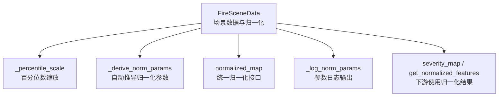
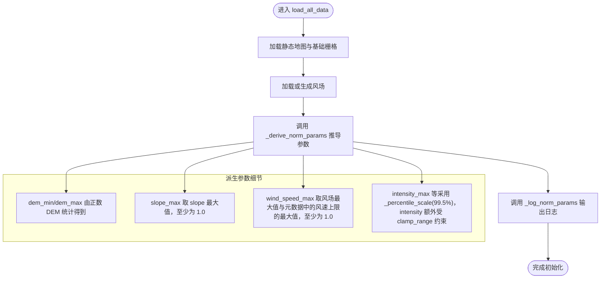
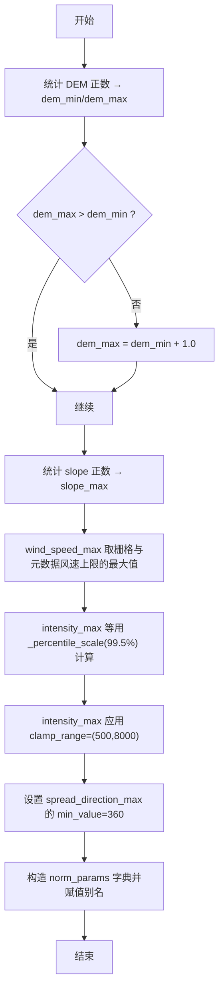
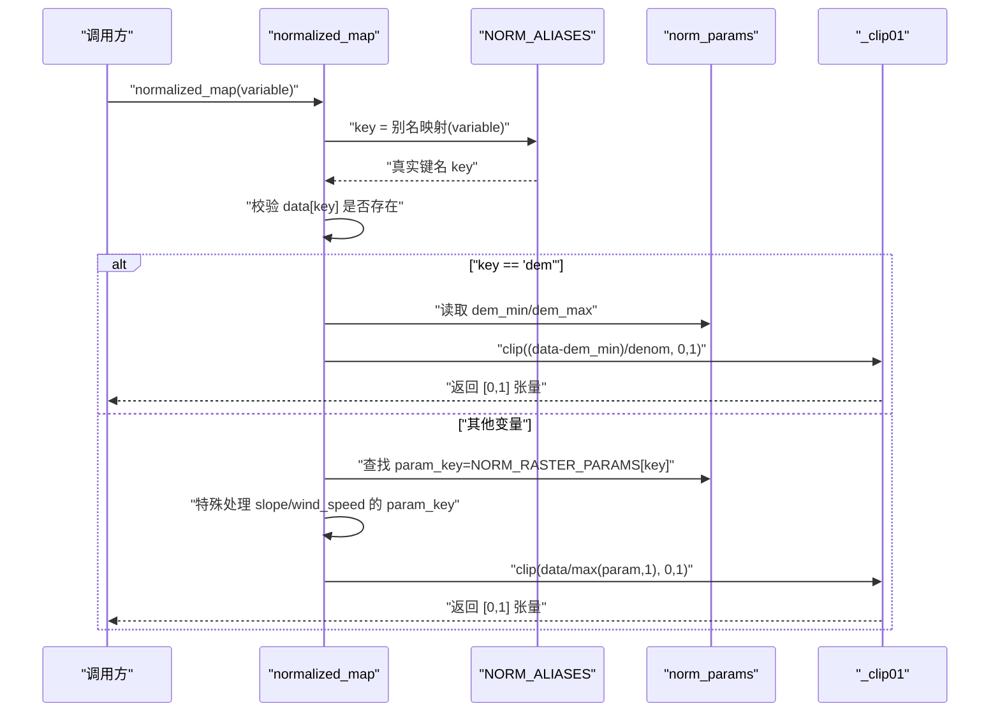
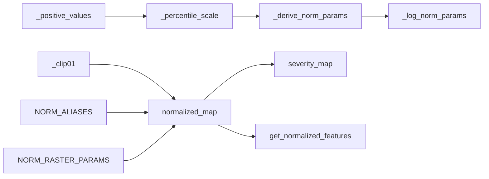

# 数据归一化系统

<cite>
**本文引用的文件**   
- [信息转换.py](file://environment_variables/environment_variables/信息转换.py)
</cite>

## 目录
1. [简介](#简介)
2. [项目结构](#项目结构)
3. [核心组件](#核心组件)
4. [架构总览](#架构总览)
5. [详细组件分析](#详细组件分析)
6. [依赖关系分析](#依赖关系分析)
7. [性能考量](#性能考量)
8. [故障排查指南](#故障排查指南)
9. [结论](#结论)

## 简介
本文件围绕“数据归一化系统”的核心实现进行系统化说明，重点覆盖以下方面：
- _derive_norm_params 方法的自动推导流程与关键策略
- 百分位数缩放算法（默认使用 99.5% 分位数）的鲁棒性设计
- 不同变量的归一化策略：DEM 范围归一化、坡度最大值归一化、风速最大值归一化
- clamp_range 参数的作用与对 intensity 等关键变量的数值范围限制
- normalized_map 方法：变量别名映射与统一归一化接口
- 归一化参数的日志输出，便于调试与监控
- 特殊变量的处理逻辑：slope 与 wind_speed 的动态范围调整

## 项目结构
归一化相关逻辑集中在场景数据加载与预处理模块中，主要类为 FireSceneData。其职责包括：
- 读取栅格与静态地形数据
- 计算并缓存每场景的归一化参数
- 提供统一的归一化接口 normalized_map
- 基于归一化结果构建热力场、严重度图等下游特征

图表来源
- [信息转换.py:534-614](file://environment_variables/environment_variables/信息转换.py#L534-L614)
- [信息转换.py:616-637](file://environment_variables/environment_variables/信息转换.py#L616-L637)
- [信息转换.py:903-918](file://environment_variables/environment_variables/信息转换.py#L903-L918)
- [信息转换.py:1187-1234](file://environment_variables/environment_variables/信息转换.py#L1187-L1234)

章节来源
- [信息转换.py:219-322](file://environment_variables/environment_variables/信息转换.py#L219-L322)

## 核心组件
- 正数过滤与裁剪工具
  - _positive_values：仅保留有限且大于 0 的值，用于稳健统计
  - _clip01：将值裁剪到 [0, 1]，保证归一化输出稳定
- 百分位数缩放
  - _percentile_scale：按指定分位数（默认 99.5%）计算缩放因子，支持最小值下限与可选的 clamp_range 约束
- 归一化参数推导
  - _derive_norm_params：从 DEM、slope、wind_speed 及各类火行为栅格中自动推导各变量的最大/最小参考值
- 统一归一化接口
  - normalized_map：根据变量名解析真实键名（含别名），选择对应归一化策略并返回 [0, 1] 张量
- 日志记录
  - _log_norm_params：打印关键归一化参数摘要，便于调试与监控

章节来源
- [信息转换.py:534-614](file://environment_variables/environment_variables/信息转换.py#L534-L614)
- [信息转换.py:616-637](file://environment_variables/environment_variables/信息转换.py#L616-L637)

## 架构总览
下图展示了归一化参数推导与使用的整体流程，以及关键分支与异常路径。

图表来源
- [信息转换.py:559-602](file://environment_variables/environment_variables/信息转换.py#L559-L602)
- [信息转换.py:639-682](file://environment_variables/environment_variables/信息转换.py#L639-L682)

## 详细组件分析

### 百分位数缩放算法（_percentile_scale）
- 输入
  - raster_key：源栅格键名
  - percentile：分位数（默认 99.5%）
  - min_value：缩放因子的最小下限（默认 1.0）
  - clamp_range：可选的上下界约束（如 intensity 的 (500.0, 8000.0)）
- 处理步骤
  - 提取正数有效值（排除非有限与负值）
  - 若存在有效值，则按分位数计算 scale；否则回退至 min_value
  - 若提供 clamp_range，则将 scale 裁剪到该区间
  - 最终确保 scale ≥ min_value
- 复杂度
  - 时间 O(N)，空间 O(N)（N 为正数像素数量）
- 鲁棒性
  - 通过 99.5% 分位数抑制极端高值影响
  - 通过 clamp_range 避免个别场景出现过大/过小缩放因子
  - 通过 min_value 防止除零或尺度退化

章节来源
- [信息转换.py:534-557](file://environment_variables/environment_variables/信息转换.py#L534-L557)

### 归一化参数自动推导（_derive_norm_params）
- DEM 范围归一化
  - dem_min/dem_max 来自 DEM 的正数统计；若 dem_max ≤ dem_min，则强制 dem_max = dem_min + 1.0，避免除零
- 坡度最大值归一化
  - slope_max 取 slope 正数最大值，若无有效值则为 1.0；最终至少为 1.0
- 风速最大值归一化
  - wind_speed_max 综合栅格风场最大值与元数据中的风速上限（如 wind_speed_mph、peak_wind_speed_mph、wind_speed_range_mph、expected_wind_speed_range_mph），取最大值；若无有效值则为 1.0；最终至少为 1.0
- 其他变量
  - intensity_max、length_max、speedRate_max、spread_direction_max、heat_per_unit_area_max、crown_fire_max 均通过 _percentile_scale 计算
  - spread_direction_max 设置 min_value=360.0，保证方向归一化分母合理
  - intensity_max 额外传入 clamp_range=(500.0, 8000.0)，限制强度缩放因子的取值范围
- 别名同步
  - flame_length_max ← length_max
  - ros_max ← speedRate_max
  - heat_max ← heat_per_unit_area_max
- 固定阈值
  - fire_threshold 固定为 1.0

图表来源
- [信息转换.py:559-602](file://environment_variables/environment_variables/信息转换.py#L559-L602)

章节来源
- [信息转换.py:559-602](file://environment_variables/environment_variables/信息转换.py#L559-L602)

### 统一归一化接口（normalized_map）
- 变量别名映射
  - NORM_ALIASES：flame_length→length，ros→speedRate，heat→heat_per_unit_area
- 归一化策略
  - dem：按 (data - dem_min) / max(dem_max - dem_min, 1.0) 归一化，再裁剪到 [0, 1]
  - slope：使用 slope_max 作为分母，至少为 1.0
  - wind_speed：使用 wind_speed_max 作为分母，至少为 1.0
  - 其他变量：通过 NORM_RASTER_PARAMS 映射到对应的 _max 参数，以该值为分母，再裁剪到 [0, 1]
- 错误处理
  - 未知变量键：抛出 KeyError
  - 未配置归一化参数：抛出 KeyError

图表来源
- [信息转换.py:616-637](file://environment_variables/environment_variables/信息转换.py#L616-L637)

章节来源
- [信息转换.py:224-236](file://environment_variables/environment_variables/信息转换.py#L224-L236)
- [信息转换.py:616-637](file://environment_variables/environment_variables/信息转换.py#L616-L637)

### 归一化参数日志输出（_log_norm_params）
- 输出字段
  - intensity_max、length_max、speedRate_max、heat_per_unit_area_max、crown_fire_max、wind_speed_max
- 用途
  - 快速定位某场景的归一化尺度是否异常
  - 辅助对比不同场景的参数分布，发现数据质量问题

章节来源
- [信息转换.py:604-614](file://environment_variables/environment_variables/信息转换.py#L604-L614)

### 特殊变量的处理逻辑
- slope 动态范围
  - 在 _derive_norm_params 中，slope_max 至少为 1.0，避免小坡度场景导致过大的归一化放大
- wind_speed 动态范围
  - 在 _derive_norm_params 中，wind_speed_max 综合考虑栅格与元数据的风速上限，并至少为 1.0，确保风场归一化稳定
- intensity 的 clamp_range
  - 在 _percentile_scale 中对 intensity_max 施加 (500.0, 8000.0) 的钳制，避免极端高值导致的尺度漂移

章节来源
- [信息转换.py:559-602](file://environment_variables/environment_variables/信息转换.py#L559-L602)
- [信息转换.py:543-557](file://environment_variables/environment_variables/信息转换.py#L543-L557)

## 依赖关系分析
- 内部依赖
  - normalized_map 依赖 NORM_ALIASES 与 NORM_RASTER_PARAMS 两个映射表
  - _derive_norm_params 依赖 _percentile_scale、_positive_values 与 _clip01
  - severity_map 与 get_normalized_features 消费 normalized_map 的输出
- 外部依赖
  - numpy：数组操作与分位数统计
  - cv2：下采样与上采样（热场构建时）
  - scipy.ndimage：形态学操作（边界检测）
  - rasterio：栅格读写与坐标变换

图表来源
- [信息转换.py:534-614](file://environment_variables/environment_variables/信息转换.py#L534-L614)
- [信息转换.py:616-637](file://environment_variables/environment_variables/信息转换.py#L616-L637)
- [信息转换.py:903-918](file://environment_variables/environment_variables/信息转换.py#L903-L918)
- [信息转换.py:1187-1234](file://environment_variables/environment_variables/信息转换.py#L1187-L1234)

章节来源
- [信息转换.py:219-322](file://environment_variables/environment_variables/信息转换.py#L219-L322)

## 性能考量
- 分位数计算的时间复杂度为 O(N)，在高分辨率栅格上可能成为热点。建议：
  - 仅在首次加载场景时计算一次，并缓存于 norm_params
  - 对超大栅格可考虑分块统计或近似分位数算法
- 内存占用
  - 正数过滤会创建中间布尔掩码，注意大栅格的内存峰值
- I/O 与形状一致性
  - 所有栅格需与静态地图形状一致，避免重复对齐与重采样开销

[本节为通用指导，不直接分析具体文件]

## 故障排查指南
- 常见错误与定位
  - KeyError("Unknown scene raster for normalization: ...")：检查变量名是否在 NORM_ALIASES/NORM_RASTER_PARAMS 中，或数据是否成功加载
  - KeyError("No normalization parameter configured for: ...")：确认该变量已配置对应的 _max 参数
  - FileNotFoundError：场景栅格缺失或路径不正确
  - RuntimeError("Raster shape mismatch...")：栅格尺寸与静态地图不一致
- 诊断建议
  - 查看 _log_norm_params 输出的关键参数，判断是否出现异常极大/极小值
  - 针对 intensity，检查 clamp_range 是否合适；必要时调整上下限
  - 对于 slope 与 wind_speed，确认元数据中的风速上限是否正确填充

章节来源
- [信息转换.py:616-637](file://environment_variables/environment_variables/信息转换.py#L616-L637)
- [信息转换.py:639-682](file://environment_variables/environment_variables/信息转换.py#L639-L682)

## 结论
本归一化系统通过“分位数+钳制+下限保护”的组合策略，实现了跨场景、跨变量的稳健归一化。_derive_norm_params 负责自动推导关键尺度，normalized_map 提供一致的归一化入口，配合日志输出与严格的异常处理，既保证了训练稳定性，也提升了可观测性与可维护性。对于 DEM、slope、wind_speed 等特殊变量，系统提供了针对性的动态范围控制，进一步增强了鲁棒性。