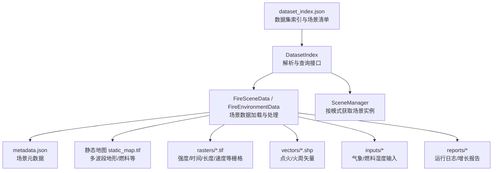
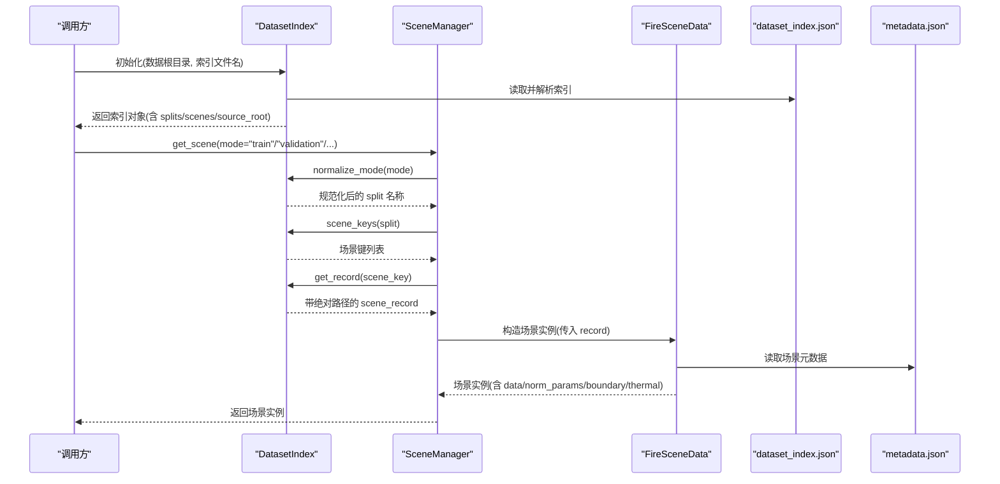
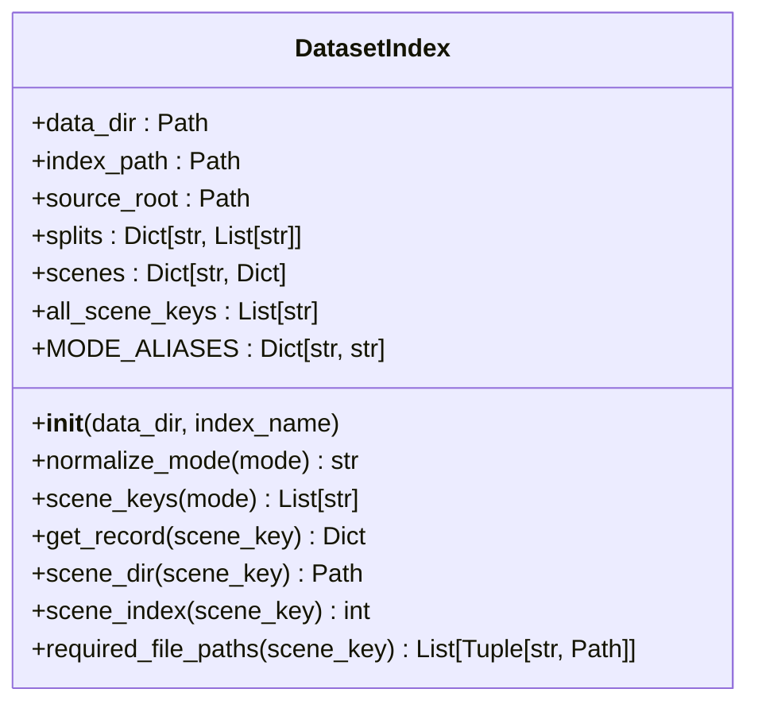
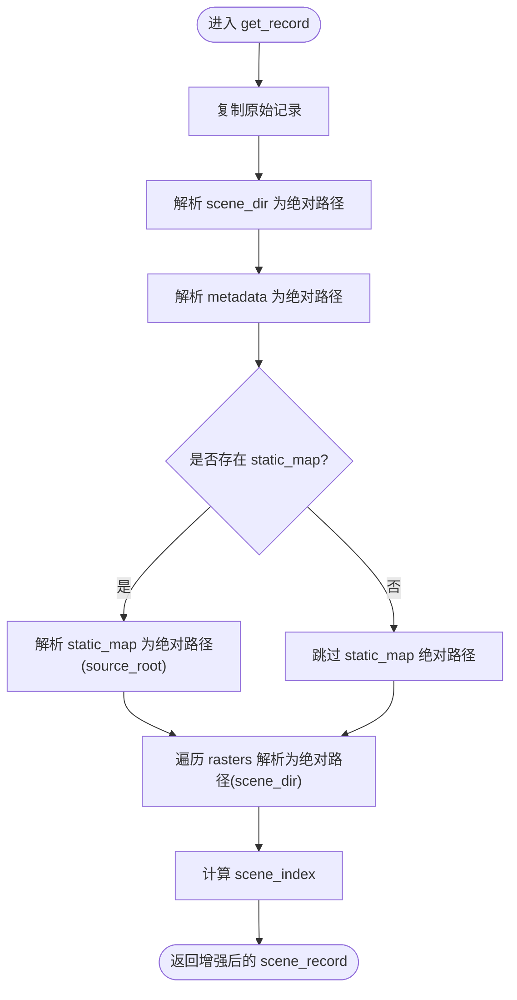
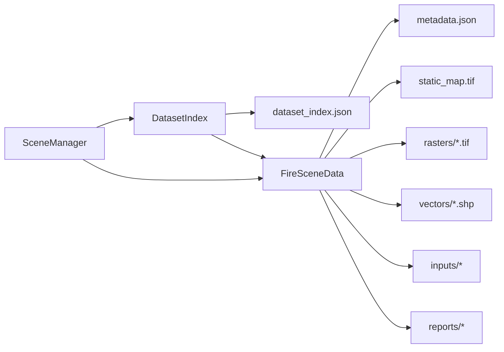

# 数据集索引管理

<cite>
**本文引用的文件**   
- [信息转换.py](file://environment_variables/environment_variables/outputs/lr_comparison_20260709_095438/训练结果/训练源码/信息转换.py)
- [dataset_index.json](file://environment_variables/environment_variables/dataset/dataset_index.json)
- [metadata.json](file://map/Train/1/scene1/metadata.json)
</cite>

## 目录
1. [简介](#简介)
2. [项目结构](#项目结构)
3. [核心组件](#核心组件)
4. [架构总览](#架构总览)
5. [详细组件分析](#详细组件分析)
6. [依赖关系分析](#依赖关系分析)
7. [性能考量](#性能考量)
8. [故障排查指南](#故障排查指南)
9. [结论](#结论)
10. [附录](#附录)

## 简介
本文件面向“数据集索引管理系统”，围绕 DatasetIndex 类及其相关能力，系统性说明以下要点：
- dataset_index.json 的解析与场景元数据管理
- 场景模式支持（train、validation、generalization、stress）及别名标准化（test、eval）
- 场景路径解析机制（相对路径与绝对路径自动转换）
- 必需文件路径检查（metadata.json、static_map、rasters 等）
- scene_record 构建过程（绝对路径填充、索引号分配）
- 场景遍历与批量操作支持

## 项目结构
该数据集索引系统由一个 JSON 索引文件与 Python 实现组成。JSON 负责声明式描述数据集划分、场景清单与路径约定；Python 提供加载、校验、归一化参数推导、边界检测与热场计算等能力。

图表来源
- [信息转换.py:20-196](file://environment_variables/environment_variables/outputs/lr_comparison_20260709_095438/训练结果/训练源码/信息转换.py#L20-L196)
- [dataset_index.json:1-120](file://environment_variables/environment_variables/dataset/dataset_index.json#L1-L120)

章节来源
- [信息转换.py:20-196](file://environment_variables/environment_variables/outputs/lr_comparison_20260709_095438/训练结果/训练源码/信息转换.py#L20-L196)
- [dataset_index.json:1-120](file://environment_variables/environment_variables/dataset/dataset_index.json#L1-L120)

## 核心组件
- DatasetIndex：基于 dataset_index.json 的索引加载器与查询器，负责模式标准化、场景键集合、记录构建与路径解析。
- FireSceneData/FireEnvironmentData：场景数据加载器，负责读取 metadata.json、静态地图、栅格、矢量与输入文件，并计算归一化参数、边界点、热场等。
- SceneManager：按模式随机或指定获取场景实例，并提供跨实例共享缓存以减少重复 IO 与计算。

章节来源
- [信息转换.py:20-196](file://environment_variables/environment_variables/outputs/lr_comparison_20260709_095438/训练结果/训练源码/信息转换.py#L20-L196)
- [信息转换.py:219-323](file://environment_variables/environment_variables/outputs/lr_comparison_20260709_095438/训练结果/训练源码/信息转换.py#L219-L323)
- [信息转换.py:1278-1326](file://environment_variables/environment_variables/outputs/lr_comparison_20260709_095438/训练结果/训练源码/信息转换.py#L1278-L1326)

## 架构总览
下图展示了从索引到场景数据的端到端流程：索引解析 → 模式标准化 → 场景记录构建 → 路径解析与校验 → 数据加载与预处理。

图表来源
- [信息转换.py:80-134](file://environment_variables/environment_variables/outputs/lr_comparison_20260709_095438/训练结果/训练源码/信息转换.py#L80-L134)
- [信息转换.py:1289-1326](file://environment_variables/environment_variables/outputs/lr_comparison_20260709_095438/训练结果/训练源码/信息转换.py#L1289-L1326)
- [信息转换.py:349-368](file://environment_variables/environment_variables/outputs/lr_comparison_20260709_095438/训练结果/训练源码/信息转换.py#L349-L368)

## 详细组件分析

### DatasetIndex 类
职责
- 解析 dataset_index.json，维护 source_root、splits、scenes 与 all_scene_keys
- 提供模式标准化（支持 test、eval 别名映射至 generalization）
- 提供按模式获取场景键、按 key 获取完整记录（包含绝对路径与索引号）
- 提供 required_file_paths 用于批量完整性检查

关键行为
- 模式标准化：normalize_mode 将 test/eval 统一为 generalization，未知模式抛出异常
- 场景键集合：scene_keys 返回某 split 下的场景键列表，空集合抛错
- 记录构建：get_record 对 scene_dir、metadata、static_map、rasters 进行相对→绝对路径转换，并注入 scene_index
- 路径解析：scene_dir 根据 source_root 解析场景目录；required_file_paths 汇总所有必需路径（含默认值）

图表来源
- [信息转换.py:20-196](file://environment_variables/environment_variables/outputs/lr_comparison_20260709_095438/训练结果/训练源码/信息转换.py#L20-L196)

章节来源
- [信息转换.py:20-196](file://environment_variables/environment_variables/outputs/lr_comparison_20260709_095438/训练结果/训练源码/信息转换.py#L20-L196)

#### 场景模式支持与别名标准化
- 内置模式：train、validation、generalization、stress
- 别名映射：test、eval → generalization
- 未识别模式会抛出错误，避免误用

章节来源
- [信息转换.py:23-30](file://environment_variables/environment_variables/outputs/lr_comparison_20260709_095438/训练结果/训练源码/信息转换.py#L23-L30)
- [信息转换.py:80-87](file://environment_variables/environment_variables/outputs/lr_comparison_20260709_095438/训练结果/训练源码/信息转换.py#L80-L87)

#### 场景路径解析机制
- source_root 来自索引顶层字段，若为相对路径则相对于索引文件所在目录解析
- scene_dir 若为相对路径，则拼接 source_root 后 resolve
- metadata、rasters 的路径以 scene_dir 为基准；static_map 以 source_root 为基准
- 支持 Windows 反斜杠转斜杠，确保跨平台兼容

章节来源
- [信息转换.py:46-49](file://environment_variables/environment_variables/outputs/lr_comparison_20260709_095438/训练结果/训练源码/信息转换.py#L46-L49)
- [信息转换.py:123-128](file://environment_variables/environment_variables/outputs/lr_comparison_20260709_095438/训练结果/训练源码/信息转换.py#L123-L128)
- [信息转换.py:105-121](file://environment_variables/environment_variables/outputs/lr_comparison_20260709_095438/训练结果/训练源码/信息转换.py#L105-L121)
- [信息转换.py:189-196](file://environment_variables/environment_variables/outputs/lr_comparison_20260709_095438/训练结果/训练源码/信息转换.py#L189-L196)

#### 必需文件路径检查
- required_file_paths 汇总如下必需项（缺失时以占位符路径表示以便后续判断）：
  - metadata（默认 metadata.json）
  - static_map（必填）
  - rasters：intensity、length、time、speedRate、spread_direction、heat_per_unit_area、crown_fire
  - vectors：ignition（默认 vectors/ignition.shp）、fire_perimeter（默认 vectors/fire_perimeter.shp）
  - inputs：weather_stream（默认 inputs/weather_stream.wxs）、fuel_moisture（默认 inputs/fuel_moisture_dry.fms）
  - reports：fire_growth_report（默认 reports/fire_growth_report.csv）、run_log（默认 reports/Run_log.txt）

章节来源
- [信息转换.py:136-196](file://environment_variables/environment_variables/outputs/lr_comparison_20260709_095438/训练结果/训练源码/信息转换.py#L136-L196)

#### scene_record 构建过程
- 复制原始 scenes[scene_key] 记录
- 注入 scene_key、scene_dir_abs
- 解析 metadata_abs（相对路径以 scene_dir 为基）
- 解析 static_map_abs（相对路径以 source_root 为基）
- 解析 rasters_abs（相对路径以 scene_dir 为基）
- 计算 scene_index（在 all_scene_keys 中的序号，从 1 开始）

图表来源
- [信息转换.py:96-134](file://environment_variables/environment_variables/outputs/lr_comparison_20260709_095438/训练结果/训练源码/信息转换.py#L96-L134)

章节来源
- [信息转换.py:96-134](file://environment_variables/environment_variables/outputs/lr_comparison_20260709_095438/训练结果/训练源码/信息转换.py#L96-L134)

### FireSceneData / FireEnvironmentData
职责
- 读取 metadata.json，构建 file_paths（static_map、rasters、inputs、wind 栅格等）
- 加载静态地图与动态栅格，校验形状一致性
- 推导归一化参数（dem/slope/wind/intensity 等分位数/极值）
- 计算 t=0 初始边界、活动前沿、热力场与导航场
- 提供局部邻域特征、风阻与电池惩罚、边界闭合度诊断等

关键行为
- _load_metadata：强制存在 metadata.json，否则抛错
- _build_file_paths：static_map 必须存在；rasters 按需加载；wind 栅格优先 ASC，否则回退 weather_stream 统计
- load_all_data：顺序加载 static_map、核心栅格、可选栅格、风场，并输出日志
- detect_fire_boundary：基于 intensity 阈值与 time 图选择当前时刻火线，支持按面积百分比选取初始边界
- _compute_thermal_field：基于 per-scene 稳健归一化生成 thermal_potential，并对数压缩得到 nav_field

章节来源
- [信息转换.py:219-323](file://environment_variables/environment_variables/outputs/lr_comparison_20260709_095438/训练结果/训练源码/信息转换.py#L219-L323)
- [信息转换.py:349-390](file://environment_variables/environment_variables/outputs/lr_comparison_20260709_095438/训练结果/训练源码/信息转换.py#L349-L390)
- [信息转换.py:639-683](file://environment_variables/environment_variables/outputs/lr_comparison_20260709_095438/训练结果/训练源码/信息转换.py#L639-L683)
- [信息转换.py:759-820](file://environment_variables/environment_variables/outputs/lr_comparison_20260709_095438/训练结果/训练源码/信息转换.py#L759-L820)
- [信息转换.py:821-887](file://environment_variables/environment_variables/outputs/lr_comparison_20260709_095438/训练结果/训练源码/信息转换.py#L821-L887)

### SceneManager
职责
- 封装 DatasetIndex，按模式随机或指定获取场景实例
- 使用类级共享缓存避免重复 IO 与计算

关键行为
- get_scene：随机抽取某 split 的一个 scene_key，再 get_specific_scene
- get_specific_scene：命中缓存则直接返回，否则构造 FireEnvironmentData 并缓存

章节来源
- [信息转换.py:1282-1326](file://environment_variables/environment_variables/outputs/lr_comparison_20260709_095438/训练结果/训练源码/信息转换.py#L1282-L1326)

## 依赖关系分析
- DatasetIndex 依赖 dataset_index.json 的结构与内容
- FireSceneData 依赖 metadata.json、static_map、rasters、vectors、inputs、reports 等实际文件
- SceneManager 组合 DatasetIndex 与 FireSceneData，并通过共享缓存降低开销

图表来源
- [信息转换.py:20-196](file://environment_variables/environment_variables/outputs/lr_comparison_20260709_095438/训练结果/训练源码/信息转换.py#L20-L196)
- [信息转换.py:219-390](file://environment_variables/environment_variables/outputs/lr_comparison_20260709_095438/训练结果/训练源码/信息转换.py#L219-L390)
- [dataset_index.json:1-120](file://environment_variables/environment_variables/dataset/dataset_index.json#L1-L120)

章节来源
- [信息转换.py:20-196](file://environment_variables/environment_variables/outputs/lr_comparison_20260709_095438/训练结果/训练源码/信息转换.py#L20-L196)
- [信息转换.py:219-390](file://environment_variables/environment_variables/outputs/lr_comparison_20260709_095438/训练结果/训练源码/信息转换.py#L219-L390)
- [dataset_index.json:1-120](file://environment_variables/environment_variables/dataset/dataset_index.json#L1-L120)

## 性能考量
- 共享缓存：SceneManager 使用类级缓存避免重复创建场景实例，显著减少磁盘 IO 与归一化参数重算
- 懒加载与校验：仅在需要时加载栅格与风场，并在加载阶段进行形状一致性校验，尽早失败
- 稳健归一化：采用分位数与极值估计，避免极端值影响稳定性
- 热场计算优化：先下采样+高斯模糊再上采样，兼顾平滑与效率

章节来源
- [信息转换.py:1282-1326](file://environment_variables/environment_variables/outputs/lr_comparison_20260709_095438/训练结果/训练源码/信息转换.py#L1282-L1326)
- [信息转换.py:543-602](file://environment_variables/environment_variables/outputs/lr_comparison_20260709_095438/训练结果/训练源码/信息转换.py#L543-L602)
- [信息转换.py:759-820](file://environment_variables/environment_variables/outputs/lr_comparison_20260709_095438/训练结果/训练源码/信息转换.py#L759-L820)

## 故障排查指南
常见问题与定位
- dataset_index.json 不存在：初始化 DatasetIndex 即抛 FileNotFoundError，请确认 data_dir 与 index_name
- 未知模式：normalize_mode 抛出 ValueError，请检查 mode 是否在 MODE_ALIASES 中
- 场景目录不存在：构造 FireSceneData 时若 scene_dir_abs 不存在，抛 FileNotFoundError
- metadata.json 缺失：_load_metadata 抛 FileNotFoundError，请检查路径是否正确
- static_map 缺失：_build_file_paths 抛 KeyError，请在索引中配置 static_map
- 栅格形状不一致：加载时抛 RuntimeError，需对齐 static_map 与各栅格尺寸
- 风场形状不匹配：wind speed/direction 与 shape 不一致抛错，需修正 wind 栅格或回退 weather_stream

建议步骤
- 使用 validate_scene_boundaries 进行预检，批量检查必需文件与边界有效性
- 打印 norm_params 摘要，确认归一化范围合理
- 查看 diagnose_thermal_health，评估热场质量与梯度健康度

章节来源
- [信息转换.py:32-41](file://environment_variables/environment_variables/outputs/lr_comparison_20260709_095438/训练结果/训练源码/信息转换.py#L32-L41)
- [信息转换.py:80-87](file://environment_variables/environment_variables/outputs/lr_comparison_20260709_095438/训练结果/训练源码/信息转换.py#L80-L87)
- [信息转换.py:271-276](file://environment_variables/environment_variables/outputs/lr_comparison_20260709_095438/训练结果/训练源码/信息转换.py#L271-L276)
- [信息转换.py:349-356](file://environment_variables/environment_variables/outputs/lr_comparison_20260709_095438/训练结果/训练源码/信息转换.py#L349-L356)
- [信息转换.py:370-390](file://environment_variables/environment_variables/outputs/lr_comparison_20260709_095438/训练结果/训练源码/信息转换.py#L370-L390)
- [信息转换.py:525-533](file://environment_variables/environment_variables/outputs/lr_comparison_20260709_095438/训练结果/训练源码/信息转换.py#L525-L533)
- [信息转换.py:670-678](file://environment_variables/environment_variables/outputs/lr_comparison_20260709_095438/训练结果/训练源码/信息转换.py#L670-L678)
- [信息转换.py:1329-1416](file://environment_variables/environment_variables/outputs/lr_comparison_20260709_095438/训练结果/训练源码/信息转换.py#L1329-L1416)

## 结论
DatasetIndex 提供了稳定、可扩展的数据集索引管理能力，结合 FireSceneData 的健壮加载与预处理流程，以及 SceneManager 的缓存策略，能够高效支撑训练、验证、泛化与压力测试等多场景需求。通过严格的文件完整性检查与路径解析机制，系统在跨平台与复杂目录结构下仍具备良好鲁棒性。

## 附录

### dataset_index.json 结构与示例片段
- 顶层字段
  - version、description、schema、source_root、splits、raster_files、scenes
- schema.path_base 约定
  - scene_dir/static_map 为 source_root 相对路径
  - metadata/rasters/vectors/inputs/reports 为 scene_dir 相对路径
- splits 定义四个模式对应的场景键列表
- scenes 中每个场景包含 scene_key、split、scene_dir、static_map、metadata、rasters、vectors、inputs、reports 等

章节来源
- [dataset_index.json:1-120](file://environment_variables/environment_variables/dataset/dataset_index.json#L1-L120)

### metadata.json 结构与示例片段
- 基础信息：map_id、split、area_id、scenario_id、resolution_m、width、height、difficulty
- 环境配置：wind、fuel_moisture、farsite 运行参数
- 目标与统计：fire_statistics、target_range_check、rejected_timesteps
- UAV 配置：uav_count、starts_wgs84、sensor_radius_m、max_steps
- 资源路径：rasters、vectors、inputs、reports
- 派生计算：cell_area_m2、total_map_cells 等

章节来源
- [metadata.json:1-171](file://map/Train/1/scene1/metadata.json#L1-L171)