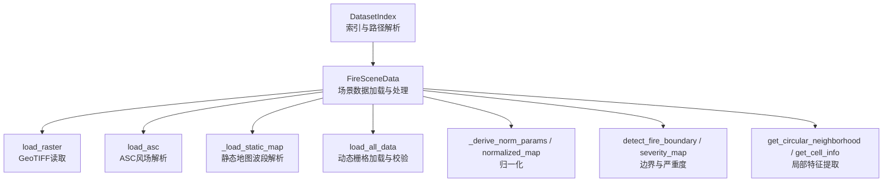
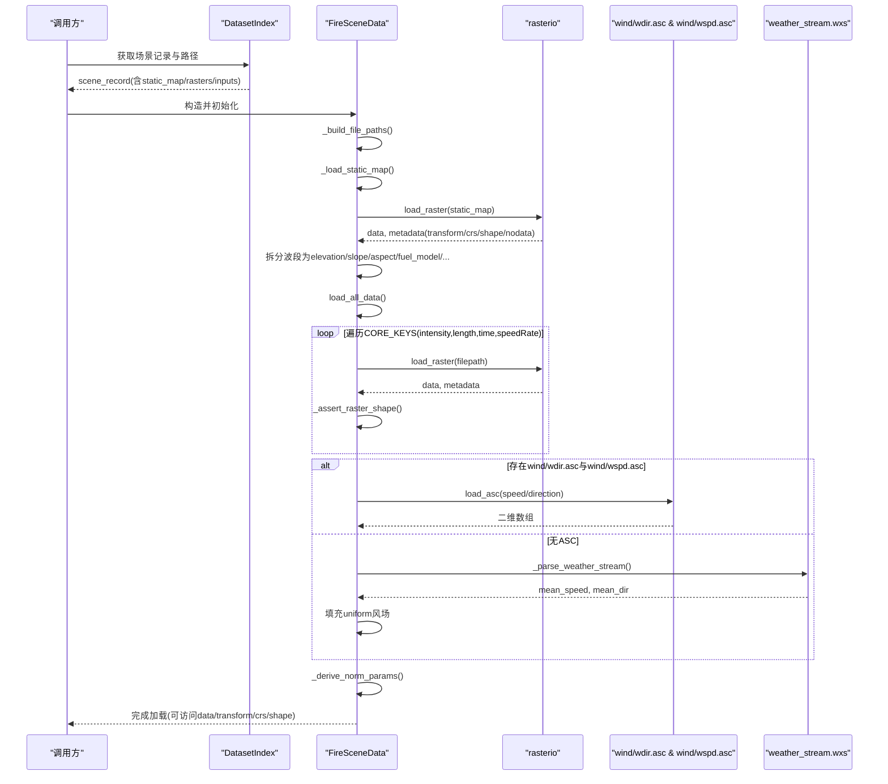
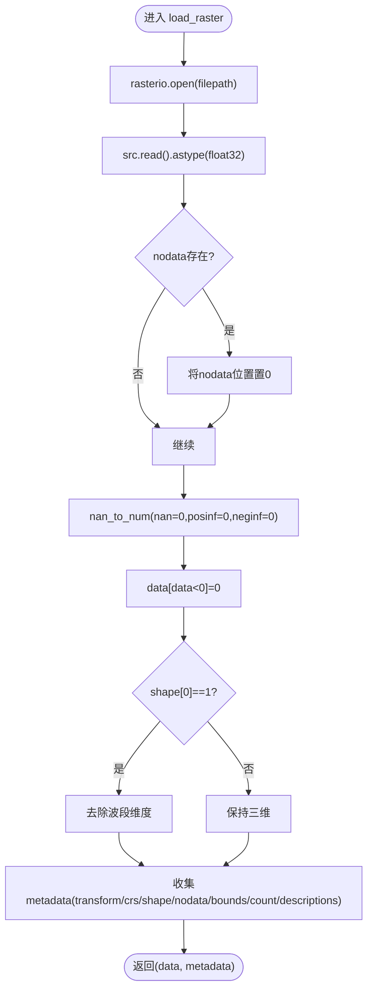
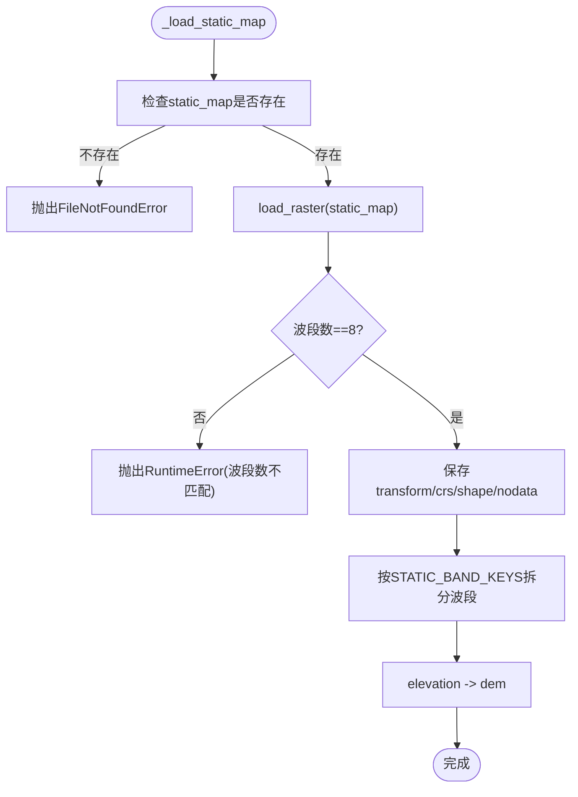
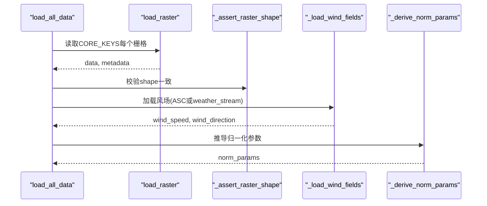
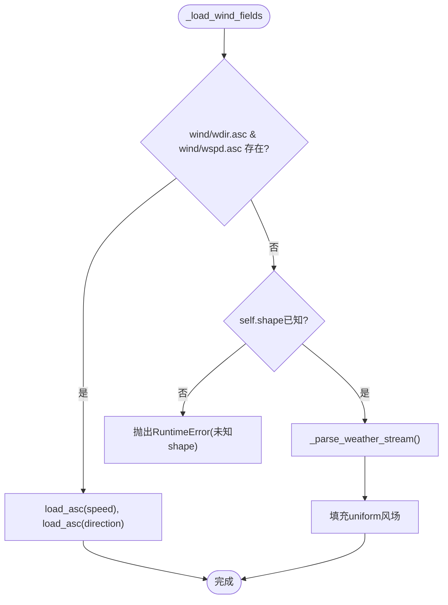
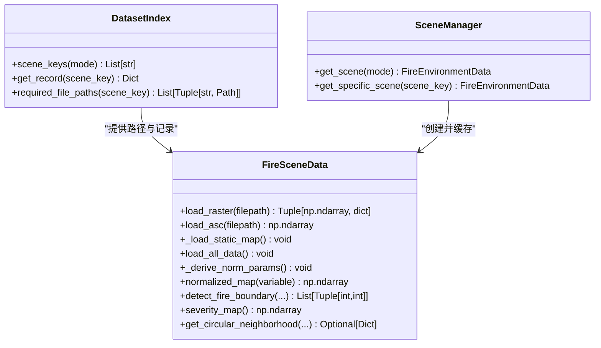

# 栅格数据处理系统

<cite>
**本文引用的文件**   
- [信息转换.py](file://environment_variables/environment_variables/信息转换.py)
</cite>

## 目录
1. [简介](#简介)
2. [项目结构](#项目结构)
3. [核心组件](#核心组件)
4. [架构总览](#架构总览)
5. [详细组件分析](#详细组件分析)
6. [依赖关系分析](#依赖关系分析)
7. [性能与复杂度](#性能与复杂度)
8. [故障排查指南](#故障排查指南)
9. [结论](#结论)

## 简介
本文件系统围绕栅格数据加载、静态地形波段解析、动态火灾指标处理、风场 ASC 文件解析以及数据预处理与验证展开，重点说明 load_raster 方法的核心实现与整体数据流。该系统支持从 GeoTIFF 读取多波段静态地图（包含高程、坡度、坡向、燃料模型等），并加载强度、长度、时间、速度率等动态栅格，同时提供风场 wind/wdir.asc 与 wind/wspd.asc 的解析与回退策略，确保在缺失空间风场时仍可生成均匀风场。

## 项目结构
- 核心代码位于 environment_variables/environment_variables/信息转换.py，包含：
  - 数据集索引与场景路径解析
  - 栅格与 ASC 文件读取
  - 静态地图与动态栅格的加载流程
  - 归一化参数推导与标准化映射
  - 边界点检测、热场重建与导航场计算
  - 场景管理器与批量校验工具

图表来源
- [信息转换.py:219-320](file://environment_variables/environment_variables/信息转换.py#L219-L320)
- [信息转换.py:392-424](file://environment_variables/environment_variables/信息转换.py#L392-L424)
- [信息转换.py:501-524](file://environment_variables/environment_variables/信息转换.py#L501-L524)
- [信息转换.py:639-682](file://environment_variables/environment_variables/信息转换.py#L639-L682)
- [信息转换.py:559-637](file://environment_variables/environment_variables/信息转换.py#L559-L637)
- [信息转换.py:821-918](file://environment_variables/environment_variables/信息转换.py#L821-L918)
- [信息转换.py:1014-1276](file://environment_variables/environment_variables/信息转换.py#L1014-L1276)

章节来源
- [信息转换.py:219-320](file://environment_variables/environment_variables/信息转换.py#L219-L320)

## 核心组件
- DatasetIndex：负责 dataset_index.json 的加载、模式别名、场景键列表、绝对路径解析与必需文件清单构建。
- FireSceneData：核心类，封装单个场景的数据加载、预处理、归一化、边界检测、热场与导航场计算、局部邻域特征提取等。
- SceneManager：跨实例共享场景缓存，按训练/验证/泛化/压力集随机或指定获取场景。
- validate_scene_boundaries：批量预检场景有效性，统计 t=0 边界点数与初始化面积百分比对应的边界点数。

章节来源
- [信息转换.py:20-196](file://environment_variables/environment_variables/信息转换.py#L20-L196)
- [信息转换.py:219-320](file://environment_variables/environment_variables/信息转换.py#L219-L320)
- [信息转换.py:1282-1327](file://environment_variables/environment_variables/信息转换.py#L1282-L1327)
- [信息转换.py:1329-1416](file://environment_variables/environment_variables/信息转换.py#L1329-L1416)

## 架构总览
下图展示从场景索引到最终可用栅格数据的端到端流程，包括静态地图与动态栅格加载、风场解析、形状一致性校验与归一化参数推导。

图表来源
- [信息转换.py:370-390](file://environment_variables/environment_variables/信息转换.py#L370-L390)
- [信息转换.py:501-524](file://environment_variables/environment_variables/信息转换.py#L501-L524)
- [信息转换.py:639-682](file://environment_variables/environment_variables/信息转换.py#L639-L682)
- [信息转换.py:473-490](file://environment_variables/environment_variables/信息转换.py#L473-L490)
- [信息转换.py:426-471](file://environment_variables/environment_variables/信息转换.py#L426-L471)

## 详细组件分析

### load_raster 方法核心实现
- 功能要点
  - 使用 rasterio 打开 GeoTIFF，读取全部波段并转换为 float32。
  - nodata 值替换为 0；NaN/Inf 用 0 填充；负值裁剪为 0。
  - 若波段数为 1，则降维为二维矩阵。
  - 返回元组 (data, metadata)，metadata 包含 transform、crs、shape、nodata、bounds、count、descriptions。
- 坐标系统与多波段
  - transform 与 crs 用于后续地理坐标转换与空间对齐。
  - count 与 descriptions 可用于波段语义识别与调试。
- 错误处理
  - 捕获异常并包装为 RuntimeError，附带原始文件路径与底层异常信息。

图表来源
- [信息转换.py:392-413](file://environment_variables/environment_variables/信息转换.py#L392-L413)

章节来源
- [信息转换.py:392-413](file://environment_variables/environment_variables/信息转换.py#L392-L413)

### 静态地图加载机制（8个地形波段）
- 静态地图文件由 static_map 字段指向，要求为多波段 GeoTIFF，波段数必须等于 STATIC_BAND_KEYS 的长度。
- 支持的波段键顺序与含义：
  - elevation（高程）
  - slope（坡度）
  - aspect（坡向）
  - fuel_model（燃料模型）
  - canopy_cover（冠层覆盖）
  - canopy_height（冠层高）
  - canopy_base_height（冠层底高）
  - canopy_bulk_density（冠层体密度）
- 加载流程
  - 读取 static_map，校验波段数量与 shape。
  - 保存 transform/crs/shape/nodata 至实例属性。
  - 将各波段分别写入 static_bands 与 data，并将 elevation 映射为 dem。
- 错误处理
  - 缺少 static_map 或波段数不匹配会抛出异常。

图表来源
- [信息转换.py:501-524](file://environment_variables/environment_variables/信息转换.py#L501-L524)

章节来源
- [信息转换.py:237-246](file://environment_variables/environment_variables/信息转换.py#L237-L246)
- [信息转换.py:501-524](file://environment_variables/environment_variables/信息转换.py#L501-L524)

### 动态栅格数据加载流程（intensity、length、time、speedRate）
- CORE_KEYS 定义核心动态栅格键：intensity、length、time、speedRate。
- 加载流程
  - 遍历 CORE_KEYS，逐个通过 load_raster 读取。
  - 使用 _assert_raster_shape 与 static_map 的 shape 进行一致性校验。
  - 可选加载 EXTRA_RASTER_KEYS（spread_direction、heat_per_unit_area、crown_fire）。
- 风场补充
  - 优先尝试 wind/wdir.asc 与 wind/wspd.asc；若存在则直接解析为二维数组。
  - 否则从 weather_stream.wxs 解析平均风速与风向，生成 uniform 风场。
- 归一化参数推导
  - 基于正定值分位数与极值推导 intensity_max、length_max、speedRate_max、dem_min/max、slope_max、wind_speed_max 等。
  - 支持对特定键设置 clamp_range 与最小值保护。

图表来源
- [信息转换.py:639-682](file://environment_variables/environment_variables/信息转换.py#L639-L682)
- [信息转换.py:473-490](file://environment_variables/environment_variables/信息转换.py#L473-L490)
- [信息转换.py:559-602](file://environment_variables/environment_variables/信息转换.py#L559-L602)

章节来源
- [信息转换.py:222-236](file://environment_variables/environment_variables/信息转换.py#L222-L236)
- [信息转换.py:639-682](file://environment_variables/environment_variables/信息转换.py#L639-L682)
- [信息转换.py:559-602](file://environment_variables/environment_variables/信息转换.py#L559-L602)

### 栅格数据验证机制（形状一致性与 nodata 处理）
- 形状一致性
  - 所有动态栅格与 static_map 的 shape 必须一致，否则抛出 RuntimeError。
- nodata 与 NaN 处理
  - load_raster 中将 nodata 置 0，并用 nan_to_num 清理 NaN/Inf。
  - 负值统一裁剪为 0，保证后续统计与归一化的稳定性。
- 风场形状校验
  - 若风场来自 ASC，需与 shape 一致；否则从 weather_stream 生成 uniform 风场以补齐。

章节来源
- [信息转换.py:525-532](file://environment_variables/environment_variables/信息转换.py#L525-L532)
- [信息转换.py:392-413](file://environment_variables/environment_variables/信息转换.py#L392-L413)
- [信息转换.py:670-678](file://environment_variables/environment_variables/信息转换.py#L670-L678)

### ASC 格式风场文件解析（wind/wdir.asc 与 wind/wspd.asc）
- 解析规则
  - 跳过前 6 行头部，逐行空格分隔数值，转为 float32 二维数组。
- 优先级
  - 若 wind/wdir.asc 与 wind/wspd.asc 均存在，则直接加载。
  - 否则从 weather_stream.wxs 解析平均风速与风向，生成 uniform 风场。
- 天气流解析
  - 扫描 weather_stream.wxs，找到“year”头后读取第 8、9 列作为风速与风向，计算均值与方向角平均。

图表来源
- [信息转换.py:473-490](file://environment_variables/environment_variables/信息转换.py#L473-L490)
- [信息转换.py:415-424](file://environment_variables/environment_variables/信息转换.py#L415-L424)
- [信息转换.py:426-471](file://environment_variables/environment_variables/信息转换.py#L426-L471)

章节来源
- [信息转换.py:415-424](file://environment_variables/environment_variables/信息转换.py#L415-L424)
- [信息转换.py:426-471](file://environment_variables/environment_variables/信息转换.py#L426-L471)
- [信息转换.py:473-490](file://environment_variables/environment_variables/信息转换.py#L473-L490)

### 数据预处理步骤（NaN 处理、负值裁剪、数据类型转换）
- 类型转换
  - 所有栅格读入后强制转换为 float32，降低内存占用并保持数值精度。
- NaN/Inf 处理
  - 使用 nan_to_num 将 NaN、+Inf、-Inf 替换为 0。
- 负值裁剪
  - 将所有负值置 0，避免影响后续统计与归一化。
- 单波段降维
  - 当波段数为 1 时，去除多余维度，便于后续二维操作。

章节来源
- [信息转换.py:392-413](file://environment_variables/environment_variables/信息转换.py#L392-L413)

## 依赖关系分析
- 外部库
  - rasterio：GeoTIFF 读写与元数据提取。
  - numpy：数值计算与掩码操作。
  - scipy.ndimage：形态学侵蚀与边界提取。
  - cv2：图像缩放与高斯滤波（热场重建）。
- 内部模块关系
  - DatasetIndex 提供场景路径与必需文件清单。
  - FireSceneData 组合上述能力，完成数据加载、校验、归一化与特征提取。
  - SceneManager 管理场景缓存与选择。
  - validate_scene_boundaries 批量校验场景有效性。

图表来源
- [信息转换.py:20-196](file://environment_variables/environment_variables/信息转换.py#L20-L196)
- [信息转换.py:219-320](file://environment_variables/environment_variables/信息转换.py#L219-L320)
- [信息转换.py:1282-1327](file://environment_variables/environment_variables/信息转换.py#L1282-L1327)

章节来源
- [信息转换.py:20-196](file://environment_variables/environment_variables/信息转换.py#L20-L196)
- [信息转换.py:219-320](file://environment_variables/environment_variables/信息转换.py#L219-L320)
- [信息转换.py:1282-1327](file://environment_variables/environment_variables/信息转换.py#L1282-L1327)

## 性能与复杂度
- 时间复杂度
  - load_raster：O(H×W×C)，H/W 为行列，C 为波段数；随后 O(H×W) 的掩码与裁剪。
  - _load_static_map：O(H×W×8) 拆分波段。
  - load_all_data：O(K×H×W)，K 为核心栅格数量。
  - _derive_norm_params：对各键统计正定值分位数与极值，总体 O(N) 其中 N 为有效像素总数。
  - detect_fire_boundary：阈值与形态学操作 O(H×W)。
- 空间复杂度
  - 主要受栅格尺寸与波段数影响，float32 存储约 4 字节每像素。
- 优化建议
  - 对大场景可使用分块读取与并行处理。
  - 利用 cv2.resize 与 gaussian_filter 的 GPU 加速（如 cuCV/CuPy）。
  - 缓存已计算的 norm_params 与 boundary_points，减少重复计算。

[本节为通用指导，无需具体文件引用]

## 故障排查指南
- 常见错误与定位
  - 缺少 static_map 或波段数不匹配：检查 static_map 路径与波段数是否为 8。
  - 动态栅格形状不一致：确认所有栅格与 static_map 的 shape 一致。
  - 风场缺失且未生成 uniform 风场：检查 wind/wdir.asc 与 wind/wspd.asc 是否存在，或 weather_stream.wxs 是否可解析。
  - 无效场景（t=0 边界为空）：调整 fire_threshold 或 init_area_percent，或检查 intensity/time 栅格质量。
- 诊断工具
  - diagnose_thermal_health：输出热场饱和比例、非零比例、梯度为零的高热区比例等指标。
  - validate_scene_boundaries：批量校验场景，输出 t=0 边界点数与初始化面积百分比对应的边界点数。

章节来源
- [信息转换.py:972-1012](file://environment_variables/environment_variables/信息转换.py#L972-L1012)
- [信息转换.py:1329-1416](file://environment_variables/environment_variables/信息转换.py#L1329-L1416)

## 结论
本系统通过统一的 load_raster 与 load_asc 接口，结合严格的形状一致性校验与稳健的预处理（nodata/NaN/负值处理），实现了从静态地形到动态火灾指标的完整栅格数据管线。静态地图的 8 个波段与动态指标（强度、长度、时间、速度率）被规范化为一致的数值范围，风场在缺失空间数据时可回退为 uniform 场，保障训练与评估的鲁棒性。配合热场重建与导航场计算，系统为后续决策与可视化提供了高质量的特征基础。