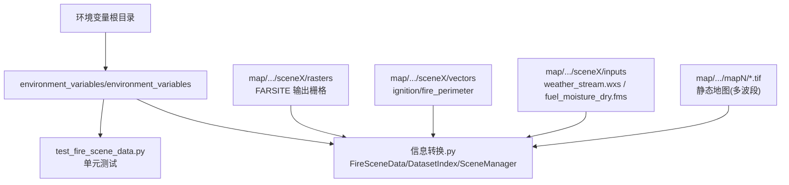
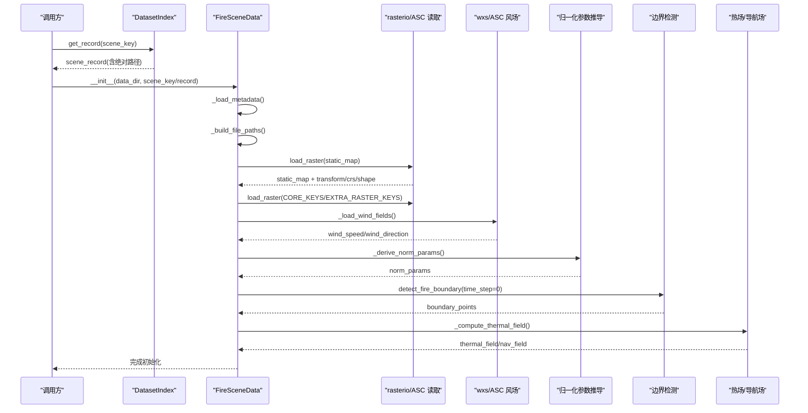
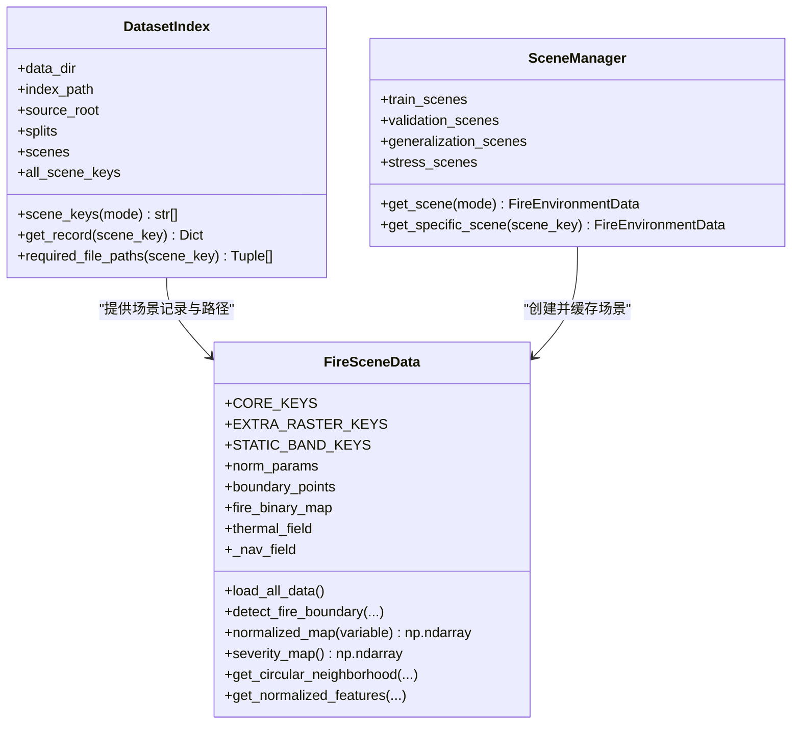
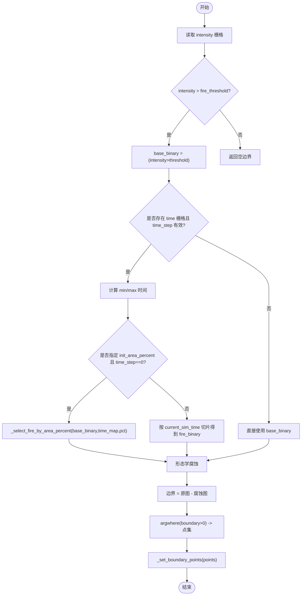
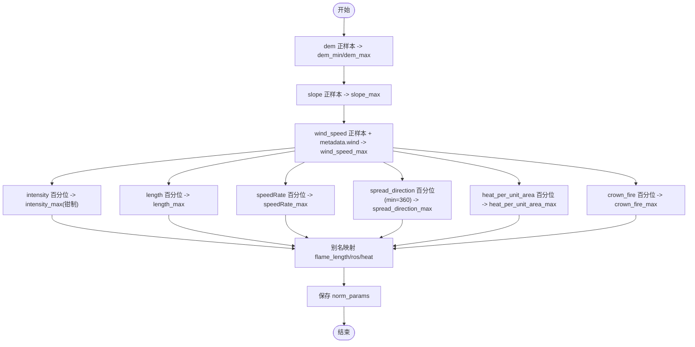
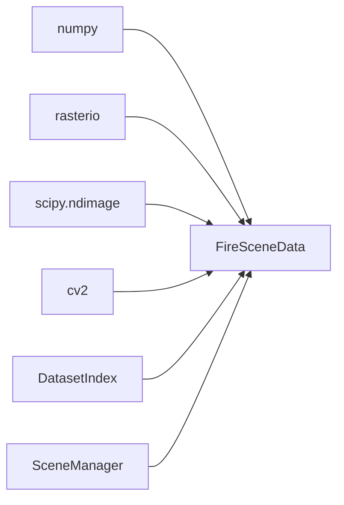

# 火灾场景数据模型

<cite>
**本文引用的文件**   
- [信息转换.py](file://environment_variables/environment_variables/信息转换.py)
- [test_fire_scene_data.py](file://environment_variables/environment_variables/test_fire_scene_data.py)
</cite>

## 目录
1. [引言](#引言)
2. [项目结构](#项目结构)
3. [核心组件](#核心组件)
4. [架构总览](#架构总览)
5. [详细组件分析](#详细组件分析)
6. [依赖关系分析](#依赖关系分析)
7. [性能考量](#性能考量)
8. [故障排查指南](#故障排查指南)
9. [结论](#结论)
10. [附录](#附录)

## 引言
本文件面向“火灾场景数据模型”的构建与使用，聚焦 FireSceneData 类的整体架构与数据处理流水线。文档覆盖以下关键主题：
- FARSITE 火灾模拟数据的完整加载流程
- 静态地图加载机制（多波段 GeoTIFF、坐标系统、地形特征）
- 动态栅格数据处理（intensity、length、time、speedRate 等核心指标）
- 风场数据加载（weather_stream.wxs 解析与 ASC 格式风场）
- 边界点检测算法（t=0 时刻边界识别与训练初始边界的面积百分比控制）
- 数据归一化参数推导（百分位数缩放与动态范围调整）

## 项目结构
仓库中与数据模型相关的核心实现位于 environment_variables/environment_variables/ 目录下，主模块为“信息转换.py”，配套单元测试位于 test_fire_scene_data.py。数据样例分布在 map/ 下的多个场景目录中，包含静态地图、FARSITE 输出栅格、矢量边界、气象输入等。

图表来源
- [信息转换.py:219-320](file://environment_variables/environment_variables/信息转换.py#L219-L320)
- [test_fire_scene_data.py:28-66](file://environment_variables/environment_variables/test_fire_scene_data.py#L28-L66)

章节来源
- [信息转换.py:219-320](file://environment_variables/environment_variables/信息转换.py#L219-L320)
- [test_fire_scene_data.py:28-66](file://environment_variables/environment_variables/test_fire_scene_data.py#L28-L66)

## 核心组件
- DatasetIndex：基于 dataset_index.json 的场景索引管理，负责路径解析、模式别名、分片键列表、元数据与栅格绝对路径拼装。
- FireSceneData：单场景数据装载器，统一读取静态地图、动态栅格、风场、向量边界，计算归一化参数、热场与导航场，提供边界点检测与观测接口。
- SceneManager：按 train/validation/generalization/stress 分片随机选择场景，并提供跨实例共享缓存避免重复 IO 与计算。
- _BoundaryPointsAccessor：对 boundary_points 属性的便捷访问封装。

章节来源
- [信息转换.py:20-196](file://environment_variables/environment_variables/信息转换.py#L20-L196)
- [信息转换.py:219-320](file://environment_variables/environment_variables/信息转换.py#L219-L320)
- [信息转换.py:1282-1327](file://environment_variables/environment_variables/信息转换.py#L1282-L1327)

## 架构总览
下图展示了从数据集索引到场景对象初始化、数据加载、归一化参数推导、边界检测与热场计算的端到端流程。

图表来源
- [信息转换.py:248-320](file://environment_variables/environment_variables/信息转换.py#L248-L320)
- [信息转换.py:392-424](file://environment_variables/environment_variables/信息转换.py#L392-L424)
- [信息转换.py:426-499](file://environment_variables/environment_variables/信息转换.py#L426-L499)
- [信息转换.py:559-614](file://environment_variables/environment_variables/信息转换.py#L559-L614)
- [信息转换.py:821-887](file://environment_variables/environment_variables/信息转换.py#L821-L887)
- [信息转换.py:759-819](file://environment_variables/environment_variables/信息转换.py#L759-L819)

## 详细组件分析

### FireSceneData 类核心架构
- 常量与映射
  - CORE_KEYS：核心动态栅格键 ["intensity","length","time","speedRate"]
  - EXTRA_RASTER_KEYS：扩展栅格键 ["spread_direction","heat_per_unit_area","crown_fire"]
  - NORM_RASTER_PARAMS：栅格归一化参数键映射
  - NORM_ALIASES：历史命名别名映射（flame_length→length 等）
  - STATIC_BAND_KEYS：静态地图波段键顺序（elevation,slope,aspect,fuel_model,canopy_cover,canopy_height,canopy_base_height,canopy_bulk_density）
- 初始化流程
  - 通过 DatasetIndex 获取 scene_record，解析 scene_dir_abs、metadata_abs、static_map_abs、rasters_abs
  - 读取 metadata.json，解析分辨率、UAV 传感器半径、最大步数等
  - 构建 file_paths（静态地图、动态栅格、wxs/fms、wind ASC）
  - 加载静态地图并设置 shape/transform/crs/nodata_value
  - 加载核心与可选栅格，校验形状一致性
  - 加载风场（优先 ASC，否则解析 wxs），推导归一化参数，记录日志
  - 初始化 t=0 边界点、计算热场与导航场
- 属性与访问器
  - boundary_points：返回 _BoundaryPointsAccessor，支持 time_step 查询与迭代
  - fire_binary_map、thermal_field、_nav_field 等中间结果
  - norm_params：每场景派生的归一化参数字典

章节来源
- [信息转换.py:219-320](file://environment_variables/environment_variables/信息转换.py#L219-L320)
- [信息转换.py:370-390](file://environment_variables/environment_variables/信息转换.py#L370-L390)
- [信息转换.py:501-532](file://environment_variables/environment_variables/信息转换.py#L501-L532)
- [信息转换.py:639-682](file://environment_variables/environment_variables/信息转换.py#L639-L682)
- [信息转换.py:684-721](file://environment_variables/environment_variables/信息转换.py#L684-L721)

#### 类图（代码级）

图表来源
- [信息转换.py:20-196](file://environment_variables/environment_variables/信息转换.py#L20-L196)
- [信息转换.py:219-320](file://environment_variables/environment_variables/信息转换.py#L219-L320)
- [信息转换.py:1282-1327](file://environment_variables/environment_variables/信息转换.py#L1282-L1327)

### 静态地图加载机制（多波段 GeoTIFF、坐标系统与地形特征）
- 读取与校验
  - 使用 rasterio 打开静态地图，读取所有波段并转为 float32，处理 nodata、NaN/Inf 与负值
  - 要求波段数量等于 STATIC_BAND_KEYS 长度，否则抛出异常
  - 保存 transform/crs/shape/nodata_value 与 band descriptions
- 地形特征提取
  - 将各波段按 STATIC_BAND_KEYS 顺序写入 self.static_bands 与 self.data
  - 将 elevation 作为 dem 字段暴露，供后续归一化与观测使用
- 坐标系统
  - 保留 CRS 与仿射变换矩阵，用于行列号与地理坐标互转（get_coordinates）

章节来源
- [信息转换.py:392-424](file://environment_variables/environment_variables/信息转换.py#L392-L424)
- [信息转换.py:501-532](file://environment_variables/environment_variables/信息转换.py#L501-L532)
- [信息转换.py:1256-1260](file://environment_variables/environment_variables/信息转换.py#L1256-L1260)

### 动态栅格数据处理（intensity、length、time、speedRate 等）
- 核心栅格
  - intensity：火线强度
  - length：火焰长度
  - time：到达时间（时序栅格）
  - speedRate：蔓延速率
- 可选栅格
  - spread_direction：蔓延方向
  - heat_per_unit_area：单位面积热量
  - crown_fire：树冠火活动
- 加载与一致性检查
  - 逐个读取 CORE_KEYS，缺失则报错；EXTRA_RASTER_KEYS 存在则加载
  - 使用 _assert_raster_shape 确保与静态地图一致
- 时序切片
  - get_full_map 支持按 time_step 取第 t 层 time 栅格，其他栅格仅二维

章节来源
- [信息转换.py:639-682](file://environment_variables/environment_variables/信息转换.py#L639-L682)
- [信息转换.py:1267-1275](file://environment_variables/environment_variables/信息转换.py#L1267-L1275)

### 风场数据加载（weather_stream.wxs 与 ASC 格式）
- 优先级
  - 若存在 wind/wspd.asc 与 wind/wdir.asc，直接以 ASC 方式读取为二维栅格
  - 否则解析 inputs/weather_stream.wxs，统计风速均值与风向平均角（向量平均）
  - 若无有效行，回退至 metadata.wind 中的近似值
- 生成均匀风场
  - 当仅有 wxs 时，根据 shape 填充全图 uniform 风场
- 形状校验
  - 最终 wind_speed 与 wind_direction 必须与 shape 一致，否则抛错

章节来源
- [信息转换.py:426-499](file://environment_variables/environment_variables/信息转换.py#L426-L499)
- [信息转换.py:670-678](file://environment_variables/environment_variables/信息转换.py#L670-L678)

### 边界点检测算法（t=0 时刻与训练初始边界面积百分比控制）
- 基本流程
  - 基于 intensity > fire_threshold 得到 base_binary
  - 若存在 time 栅格且 time_step < 阈值：
    - 计算非负最小时间与最大时间，构造当前仿真时间 current_sim_time
    - 当 init_area_percent 给定且 time_step==0：
      - 使用 _select_fire_by_area_percent 选取达到目标面积比例的子集
      - 记录 last_boundary_sim_time 与 last_init_area_stats
      - 对二值掩码进行形态学腐蚀，边界 = 原图 - 腐蚀图，得到边界点集合
    - 否则按时间切片得到 fire_binary，再求边界
  - 若不存在 time 或 time_step 超出范围，直接使用 base_binary 求边界
- 训练初始边界
  - initialize_training_boundary 支持 init_percentile 或 init_area_percent
  - 若为空边界，标记 is_valid_scene=False 并抛出 InvalidSceneError
- 可视化与诊断
  - current_fire 与 active_front 分别返回二值火场与活跃前沿
  - check_boundary_closure 评估已发现边界覆盖率

图表来源
- [信息转换.py:821-887](file://environment_variables/environment_variables/信息转换.py#L821-L887)
- [信息转换.py:723-757](file://environment_variables/environment_variables/信息转换.py#L723-L757)

章节来源
- [信息转换.py:684-721](file://environment_variables/environment_variables/信息转换.py#L684-L721)
- [信息转换.py:723-757](file://environment_variables/environment_variables/信息转换.py#L723-L757)
- [信息转换.py:821-887](file://environment_variables/environment_variables/信息转换.py#L821-L887)

### 数据归一化参数推导（百分位数缩放与动态范围调整）
- 正样本过滤
  - _positive_values 仅保留有限正值，避免 NaN/Inf/负值干扰
- 百分位数缩放
  - _percentile_scale 对指定栅格键的正样本计算 percentile（默认 99.5%），可设置最小值与上下限钳制
- 参数推导
  - dem_min/dem_max：来自 dem 正样本的最小/最大值，若相等则加 1 保证非零分母
  - slope_max：slope 正样本最大值，至少为 1
  - wind_speed_max：综合栅格最大值与 metadata.wind 中的多种风速字段，至少为 1
  - 核心栅格 max 参数：intensity_max（带钳制区间）、length_max、speedRate_max、spread_direction_max（最小 360）、heat_per_unit_area_max、crown_fire_max
  - 别名映射：flame_length_max/ros_max/heat_max 指向对应主参数
- 归一化应用
  - normalized_map 按 key 选择对应分母（dem 用 dem_max-dem_min，slope 用 slope_max，wind_speed 用 wind_speed_max，其余用 NORM_RASTER_PARAMS）
  - 输出经 clip01 限制在 [0,1]

图表来源
- [信息转换.py:534-614](file://environment_variables/environment_variables/信息转换.py#L534-L614)

章节来源
- [信息转换.py:534-614](file://environment_variables/environment_variables/信息转换.py#L534-L614)

### 热场与导航场（语义重建与梯度友好）
- 语义重建
  - 基于 fire_binary_map 与 intensity 做 per-scene 稳健归一化（参考值为高斯模糊后的 p99）
  - 得到 thermal_potential ∈ [0,1]
- 导航场
  - 对 potential 做 log 压缩，便于梯度计算，避免高值区梯度消失
- 健康诊断
  - diagnose_thermal_health 统计饱和比例、高值比例、非零比例、高值区零梯度比例与分位数

章节来源
- [信息转换.py:759-819](file://environment_variables/environment_variables/信息转换.py#L759-L819)
- [信息转换.py:972-1012](file://environment_variables/environment_variables/信息转换.py#L972-L1012)

## 依赖关系分析
- 外部库
  - numpy：数值计算与数组操作
  - rasterio：GeoTIFF 读写与坐标系统
  - scipy.ndimage：形态学腐蚀
  - cv2：图像缩放（热场重建下采样/上采样）
- 内部依赖
  - DatasetIndex 提供场景元数据与绝对路径
  - SceneManager 负责分片管理与场景缓存
  - FireSceneData 组合上述能力完成数据装配与预处理

图表来源
- [信息转换.py:1-14](file://environment_variables/environment_variables/信息转换.py#L1-L14)
- [信息转换.py:219-320](file://environment_variables/environment_variables/信息转换.py#L219-L320)
- [信息转换.py:1282-1327](file://environment_variables/environment_variables/信息转换.py#L1282-L1327)

章节来源
- [信息转换.py:1-14](file://environment_variables/environment_variables/信息转换.py#L1-L14)
- [信息转换.py:219-320](file://environment_variables/environment_variables/信息转换.py#L219-L320)
- [信息转换.py:1282-1327](file://environment_variables/environment_variables/信息转换.py#L1282-L1327)

## 性能考量
- 栅格读取与类型转换
  - 全部栅格读入后转换为 float32，减少内存占用与计算开销
  - 一次性处理 nodata/NaN/Inf/负值，避免后续分支判断
- 形状一致性校验
  - 在加载每个栅格后立即与静态地图 shape 对比，尽早失败，避免后续错误传播
- 风场生成策略
  - 优先使用现成 ASC 风场，避免解析 wxs 的额外开销；无 ASC 时按 shape 填充均匀风场
- 热场重建
  - 先下采样再高斯模糊，最后上采样，降低计算量并保持平滑效果
- 归一化参数
  - 采用百分位数与钳制策略，避免极端值影响稳定性

[本节为通用指导，不直接分析具体文件]

## 故障排查指南
- 静态地图缺失或波段数不符
  - 现象：初始化时报 FileNotFoundError 或 RuntimeError（波段数不匹配）
  - 定位：_load_static_map 中对文件存在性与波段数量的断言
- 栅格形状不一致
  - 现象：RuntimeError 提示 static_map 与某栅格形状不匹配
  - 定位：_assert_raster_shape
- 风场形状不一致
  - 现象：wind_speed/wind_direction 形状与 shape 不一致
  - 定位：load_all_data 末尾的形状校验
- 无效场景（t=0 边界为空）
  - 现象：InvalidSceneError，is_valid_scene=False
  - 定位：_initialize_boundary 与 initialize_training_boundary
- 归一化参数异常
  - 现象：normalized_map 输出越界或除零
  - 定位：_derive_norm_params 与 normalized_map 的分母保护逻辑

章节来源
- [信息转换.py:501-532](file://environment_variables/environment_variables/信息转换.py#L501-L532)
- [信息转换.py:670-678](file://environment_variables/environment_variables/信息转换.py#L670-L678)
- [信息转换.py:684-721](file://environment_variables/environment_variables/信息转换.py#L684-L721)
- [信息转换.py:559-614](file://environment_variables/environment_variables/信息转换.py#L559-L614)

## 结论
FireSceneData 提供了从 FARSITE 输出到机器学习可用张量的完整数据管线：统一的静态地图与动态栅格加载、健壮的风场注入、严格的形状与有效性校验、基于百分位数的自适应归一化、以及面向训练的边界点检测与热场语义重建。该设计在保证数据质量的同时，兼顾了可扩展性与工程可用性。

[本节为总结性内容，不直接分析具体文件]

## 附录
- 单元测试要点
  - 场景形状、静态地图波段、传感器半径与最大步数
  - 归一化参数覆盖与输出裁剪
  - 观测特征裁剪与固定维度
  - 不同观察/奖励配置下的行为一致性
  - 静态地图与栅格形状不一致的错误信息包含文件名

章节来源
- [test_fire_scene_data.py:28-110](file://environment_variables/environment_variables/test_fire_scene_data.py#L28-L110)
- [test_fire_scene_data.py:111-190](file://environment_variables/environment_variables/test_fire_scene_data.py#L111-L190)
- [test_fire_scene_data.py:191-262](file://environment_variables/environment_variables/test_fire_scene_data.py#L191-L262)