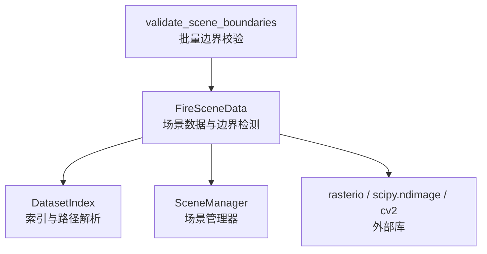
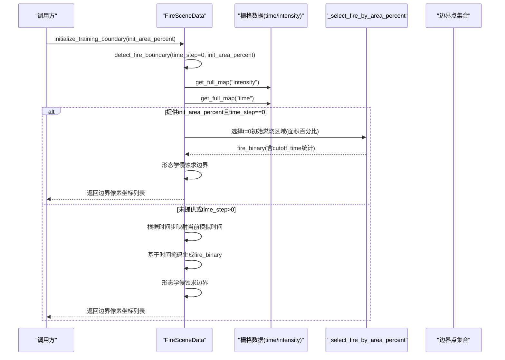
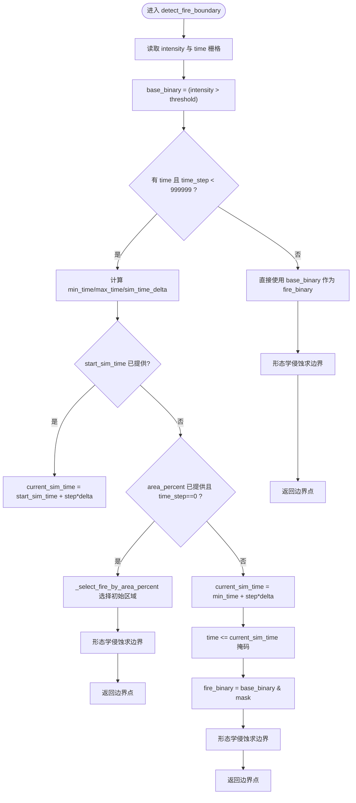
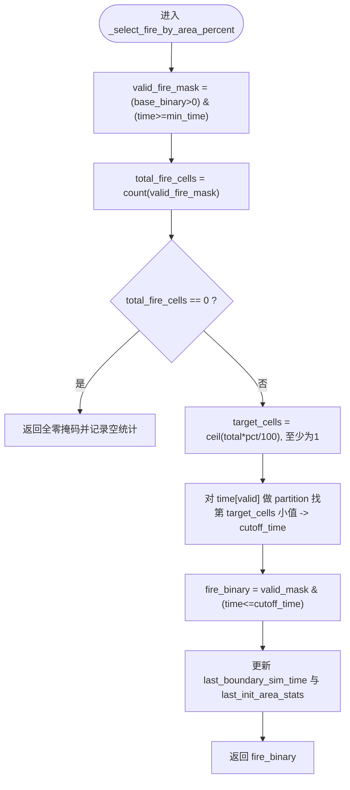
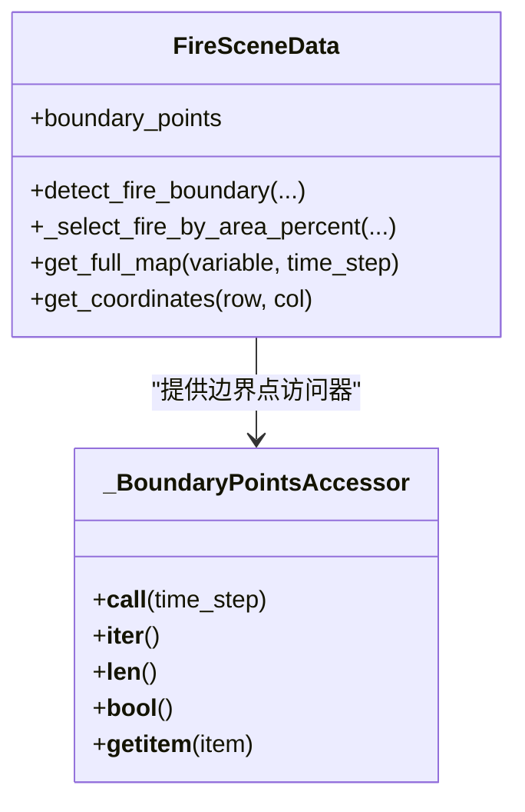
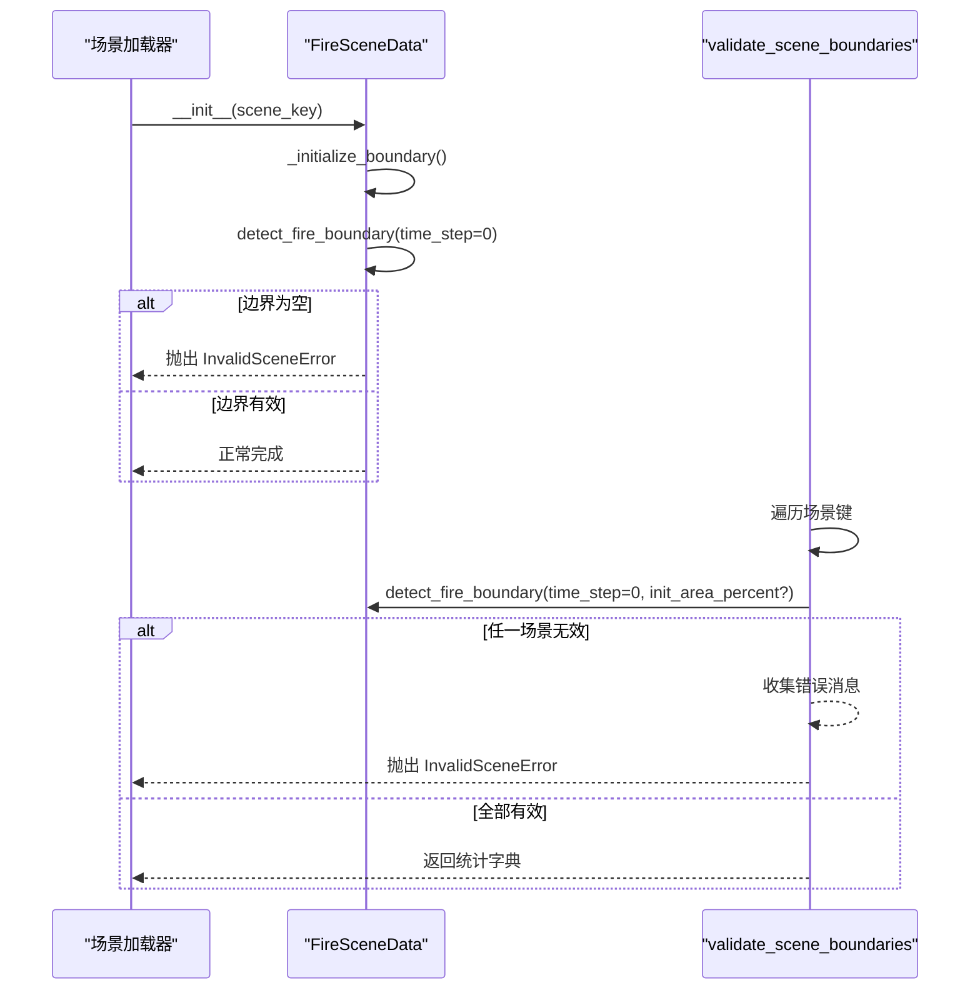
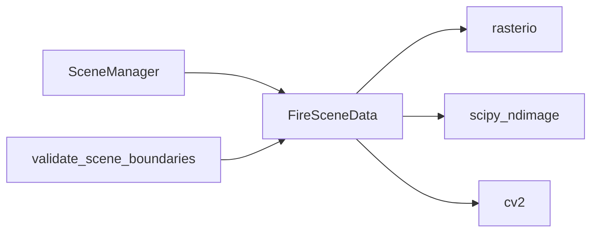

# 火灾边界检测算法

<cite>
**本文引用的文件**   
- [信息转换.py](file://environment_variables/environment_variables/信息转换.py)
</cite>

## 目录
1. [简介](#简介)
2. [项目结构](#项目结构)
3. [核心组件](#核心组件)
4. [架构总览](#架构总览)
5. [详细组件分析](#详细组件分析)
6. [依赖关系分析](#依赖关系分析)
7. [性能考量](#性能考量)
8. [故障排查指南](#故障排查指南)
9. [结论](#结论)

## 简介
本文件围绕“火灾边界检测算法”的核心实现进行系统化文档化，重点覆盖以下目标：
- 深入说明 detect_fire_boundary 方法在 t=0 时刻的边界识别逻辑
- 解释基于时间戳的边界提取算法，利用 arrival_time（time）栅格数据确定初始燃烧区域
- 记录边界点采样策略，包括边界像素坐标提取与坐标系统转换
- 说明初始化训练边界的面积百分比控制机制，支持通过 init_area_percent 参数动态调整训练起始状态
- 详细解释 _select_fire_by_area_percent 方法的实现，包括目标细胞数计算和时间阈值确定
- 记录边界有效性验证，确保场景具有有效的初始火灾边界

## 项目结构
该算法实现在单一模块中，主要类与方法如下：
- FireSceneData：场景数据加载、归一化、热场重建、边界检测与访问器
- DatasetIndex：数据集索引与路径解析
- SceneManager：按训练/验证/泛化/压力集管理场景实例
- validate_scene_boundaries：批量校验场景边界有效性

图表来源
- [信息转换.py:219-321](file://environment_variables/environment_variables/信息转换.py#L219-L321)
- [信息转换.py:1282-1326](file://environment_variables/environment_variables/信息转换.py#L1282-L1326)
- [信息转换.py:1329-1416](file://environment_variables/environment_variables/信息转换.py#L1329-L1416)

章节来源
- [信息转换.py:219-321](file://environment_variables/environment_variables/信息转换.py#L219-L321)
- [信息转换.py:1282-1326](file://environment_variables/environment_variables/信息转换.py#L1282-L1326)
- [信息转换.py:1329-1416](file://environment_variables/environment_variables/信息转换.py#L1329-L1416)

## 核心组件
- 边界检测入口：detect_fire_boundary
- 面积百分比选择：_select_fire_by_area_percent
- 边界初始化与校验：_initialize_boundary、initialize_training_boundary
- 栅格读取与坐标转换：get_full_map、get_coordinates
- 边界有效性批量校验：validate_scene_boundaries

章节来源
- [信息转换.py:821-887](file://environment_variables/environment_variables/信息转换.py#L821-L887)
- [信息转换.py:723-757](file://environment_variables/environment_variables/信息转换.py#L723-L757)
- [信息转换.py:684-721](file://environment_variables/environment_variables/信息转换.py#L684-L721)
- [信息转换.py:1267-1275](file://environment_variables/environment_variables/信息转换.py#L1267-L1275)
- [信息转换.py:1256-1265](file://environment_variables/environment_variables/信息转换.py#L1256-L1265)
- [信息转换.py:1329-1416](file://environment_variables/environment_variables/信息转换.py#L1329-L1416)

## 架构总览
下图展示了从场景加载到 t=0 边界提取的关键流程。

图表来源
- [信息转换.py:698-721](file://environment_variables/environment_variables/信息转换.py#L698-L721)
- [信息转换.py:821-887](file://environment_variables/environment_variables/信息转换.py#L821-L887)
- [信息转换.py:723-757](file://environment_variables/environment_variables/信息转换.py#L723-L757)
- [信息转换.py:1267-1275](file://environment_variables/environment_variables/信息转换.py#L1267-L1275)

## 详细组件分析

### detect_fire_boundary 方法（t=0 时刻边界识别）
- 输入参数
  - time_step：默认 0，用于时间步进；当为极大值时跳过时间相关处理
  - fire_threshold：火强度阈值，默认来自归一化参数
  - init_percentile：兼容旧接口，作为面积百分比回退
  - init_area_percent：新接口，直接指定面积百分比
  - start_sim_time：可选，指定起始仿真时间以线性插值到当前时间步
- 核心步骤
  - 获取 intensity 与 time 栅格
  - 构建 base_binary = (intensity > fire_threshold)
  - 若存在 time 且 time_step < 999999：
    - 计算非负最小时间与最大时间，得到时间范围与每步时间增量
    - 若提供 start_sim_time：current_sim_time = start_sim_time + time_step * sim_time_delta
    - 若提供 init_area_percent 且 time_step == 0：
      - 调用 _select_fire_by_area_percent 基于面积百分比选择初始燃烧区域
      - 使用形态学侵蚀求边界，并缓存 last_boundary_sim_time 与 last_init_area_stats
      - 直接返回边界像素坐标
    - 否则：current_sim_time = min_time + time_step * sim_time_delta，并用 time <= current_sim_time 掩码筛选
  - 对最终 fire_binary 执行形态学侵蚀求边界，返回像素坐标列表
- 输出
  - List[Tuple[int, int]]：边界像素的行、列坐标

图表来源
- [信息转换.py:821-887](file://environment_variables/environment_variables/信息转换.py#L821-L887)
- [信息转换.py:723-757](file://environment_variables/environment_variables/信息转换.py#L723-L757)

章节来源
- [信息转换.py:821-887](file://environment_variables/environment_variables/信息转换.py#L821-L887)

### 基于时间戳的边界提取算法（arrival_time/time 栅格）
- 时间栅格含义
  - time 栅格表示每个像元被火焰到达的时间（单位由数据定义），用于将强度栅格在不同时间切片下转换为二值火场
- 时间窗口构造
  - 计算非负时间的最小值 min_time 与最大值 max_time，得到时间范围
  - 将时间范围按比例映射到 800 个时间步，得到每步时间增量 sim_time_delta
  - 根据 time_step 或 start_sim_time 计算当前仿真时间 current_sim_time
  - 用 time <= current_sim_time 且 time >= min_time 的掩码筛选出截至当前时刻的燃烧区域
- 结果
  - 得到 fire_binary，随后通过形态学侵蚀求取活跃前沿（边界）

章节来源
- [信息转换.py:821-887](file://environment_variables/environment_variables/信息转换.py#L821-L887)

### 初始化训练边界的面积百分比控制机制（init_area_percent）
- 触发条件
  - 当提供 init_area_percent 且 time_step == 0 时，采用面积百分比方式选择初始燃烧区域
- 作用
  - 动态控制训练起始状态的燃烧面积比例，便于课程学习或难度渐进
- 关键属性
  - last_boundary_sim_time：记录所选区域的截止仿真时间（cutoff_time）
  - last_init_area_stats：记录总火区细胞数、初始火区细胞数、实际面积百分比与 cutoff_time

章节来源
- [信息转换.py:698-721](file://environment_variables/environment_variables/信息转换.py#L698-L721)
- [信息转换.py:821-887](file://environment_variables/environment_variables/信息转换.py#L821-L887)

### _select_fire_by_area_percent 方法（目标细胞数与时间阈值）
- 输入
  - base_binary：强度阈值后的二值图
  - time_map：时间栅格
  - init_area_percent：目标面积百分比（0~100）
- 核心步骤
  - 过滤有效火区：仅考虑 base_binary > 0 且 time_map >= min_time 的像元
  - 统计 total_fire_cells
  - 计算 target_cells = ceil(total_fire_cells * pct / 100)，至少为 1
  - 使用快速选择（partition）在 O(n) 内找到第 target_cells 小的时间值作为 cutoff_time
  - 生成 fire_binary = valid_fire_mask & (time_map <= cutoff_time)
  - 更新 last_boundary_sim_time 与 last_init_area_stats
- 复杂度
  - 时间：O(N)（N 为有效火区像元数）
  - 空间：O(N)（存储时间序列与掩码）

图表来源
- [信息转换.py:723-757](file://environment_variables/environment_variables/信息转换.py#L723-L757)

章节来源
- [信息转换.py:723-757](file://environment_variables/environment_variables/信息转换.py#L723-L757)

### 边界点采样策略（像素坐标与坐标系统转换）
- 像素坐标提取
  - 对 fire_binary 执行形态学侵蚀，边界 = fire_binary - eroded
  - 使用 argwhere 提取所有边界像素的行、列坐标，转为元组列表
- 地理坐标转换
  - 通过 rasterio.transform.xy 将行列坐标转换为地理坐标 (x, y)
  - 适用于可视化或与其他地理数据对齐
- 访问器
  - boundary_points 属性提供便捷访问，内部委托给 _boundary_points_at

图表来源
- [信息转换.py:821-887](file://environment_variables/environment_variables/信息转换.py#L821-L887)
- [信息转换.py:199-217](file://environment_variables/environment_variables/信息转换.py#L199-L217)
- [信息转换.py:1256-1265](file://environment_variables/environment_variables/信息转换.py#L1256-L1265)

章节来源
- [信息转换.py:821-887](file://environment_variables/environment_variables/信息转换.py#L821-L887)
- [信息转换.py:199-217](file://environment_variables/environment_variables/信息转换.py#L199-L217)
- [信息转换.py:1256-1265](file://environment_variables/environment_variables/信息转换.py#L1256-L1265)

### 边界有效性验证（确保场景具有有效的初始火灾边界）
- 单场景初始化
  - _initialize_boundary 在构造阶段调用 detect_fire_boundary(time_step=0)
  - 若边界为空，设置 is_valid_scene=False 并抛出 InvalidSceneError，阻止训练继续
- 训练边界初始化
  - initialize_training_boundary 支持传入 init_area_percent，若结果为空同样抛出异常
- 批量预检
  - validate_scene_boundaries 遍历场景，统计 t=0 边界点数与 init_area_percent 边界点数
  - 若任一场景无效，汇总错误信息并抛出 InvalidSceneError

图表来源
- [信息转换.py:684-721](file://environment_variables/environment_variables/信息转换.py#L684-L721)
- [信息转换.py:1329-1416](file://environment_variables/environment_variables/信息转换.py#L1329-L1416)

章节来源
- [信息转换.py:684-721](file://environment_variables/environment_variables/信息转换.py#L684-L721)
- [信息转换.py:1329-1416](file://environment_variables/environment_variables/信息转换.py#L1329-L1416)

## 依赖关系分析
- 外部库
  - rasterio：栅格读写与坐标变换
  - scipy.ndimage：形态学操作（erosion）
  - cv2：图像缩放与高斯滤波（热场重建时使用）
- 内部依赖
  - FireSceneData 依赖 DatasetIndex 解析场景路径
  - SceneManager 复用 FireSceneData 实例，避免重复加载与计算
  - validate_scene_boundaries 依赖 FireSceneData 的边界检测能力进行批量校验

图表来源
- [信息转换.py:1-14](file://environment_variables/environment_variables/信息转换.py#L1-L14)
- [信息转换.py:1282-1326](file://environment_variables/environment_variables/信息转换.py#L1282-L1326)
- [信息转换.py:1329-1416](file://environment_variables/environment_variables/信息转换.py#L1329-L1416)

章节来源
- [信息转换.py:1-14](file://environment_variables/environment_variables/信息转换.py#L1-L14)
- [信息转换.py:1282-1326](file://environment_variables/environment_variables/信息转换.py#L1282-L1326)
- [信息转换.py:1329-1416](file://environment_variables/environment_variables/信息转换.py#L1329-L1416)

## 性能考量
- 时间选择算法
  - _select_fire_by_area_percent 使用 np.partition 在 O(N) 时间内找到分位时间阈值，适合大规模栅格
- 形态学操作
  - binary_erosion 为逐邻域操作，复杂度近似 O(N)，注意内存占用
- 栅格读取
  - get_full_map 返回副本以避免共享内存修改，可能带来额外拷贝开销
- 建议
  - 在超大规模场景下可考虑分块处理或延迟计算
  - 合理设置 fire_threshold 与 init_area_percent，减少无效边界点数量

## 故障排查指南
- 常见错误
  - 缺少静态地图或核心栅格：会抛出 FileNotFoundError 或 RuntimeError
  - 栅格形状不一致：抛出 RuntimeError，提示 static_map 与某栅格尺寸不匹配
  - 初始边界为空：抛出 InvalidSceneError，需检查 intensity 阈值、time 栅格或 init_area_percent 设置
- 诊断要点
  - 查看 last_init_area_stats 中的 total_fire_cells、init_fire_cells、actual_init_area_percent、cutoff_time
  - 确认 time 栅格是否存在非负值，以及 min_time 与 max_time 是否合理
  - 检查 fire_threshold 是否过高导致 base_binary 全零
- 定位方法
  - 使用 validate_scene_boundaries 批量扫描，打印各场景的边界点统计与错误原因
  - 在 initialize_training_boundary 后检查 is_valid_scene 与 invalid_reason

章节来源
- [信息转换.py:501-532](file://environment_variables/environment_variables/信息转换.py#L501-L532)
- [信息转换.py:684-721](file://environment_variables/environment_variables/信息转换.py#L684-L721)
- [信息转换.py:1329-1416](file://environment_variables/environment_variables/信息转换.py#L1329-L1416)

## 结论
本算法通过强度阈值与时间栅格的组合，实现了灵活的 t=0 时刻火灾边界提取。面积百分比控制机制使得训练起始状态可按比例调节，配合高效的分位选择与形态学边界提取，兼顾了准确性与性能。严格的边界有效性验证确保了训练数据的可靠性，为后续热场重建与导航梯度计算提供了稳定基础。