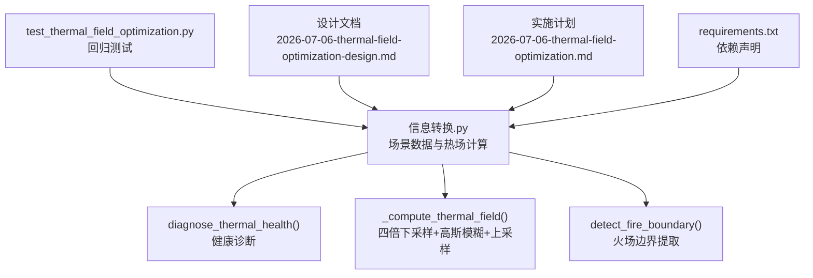
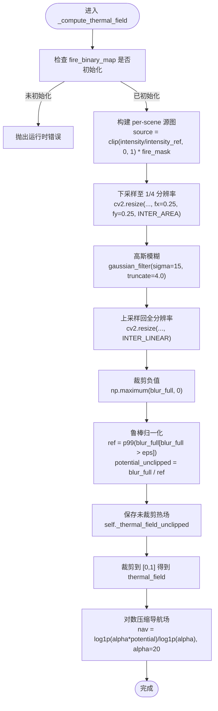
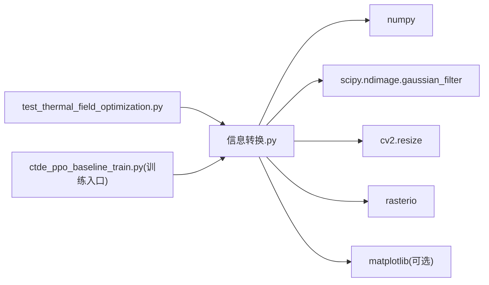

# 热场计算优化

<cite>
**本文引用的文件**
- [信息转换.py](file://environment_variables/environment_variables/信息转换.py)
- [test_thermal_field_optimization.py](file://environment_variables/environment_variables/test_thermal_field_optimization.py)
- [2026-07-06-thermal-field-optimization-design.md](file://docs/superpowers/specs/2026-07-06-thermal-field-optimization-design.md)
- [2026-07-06-thermal-field-optimization.md](file://docs/superpowers/plans/2026-07-06-thermal-field-optimization.md)
- [requirements.txt](file://environment_variables/requirements.txt)
</cite>

## 目录
1. [简介](#简介)
2. [项目结构](#项目结构)
3. [核心组件](#核心组件)
4. [架构总览](#架构总览)
5. [详细组件分析](#详细组件分析)
6. [依赖关系分析](#依赖关系分析)
7. [性能考量](#性能考量)
8. [故障排查指南](#故障排查指南)
9. [结论](#结论)
10. [附录](#附录)

## 简介
本文件面向“热场计算优化系统”，聚焦以下目标：
- 基于四分之一分辨率的高斯模糊近似计算方法，包括 downsample + gaussian_filter + upsample 的三阶段处理流程。
- 热势能的语义重建算法：per-scene 鲁棒归一化、强度参考值计算与潜在热场生成。
- 导航场的对数变换实现：alpha 参数调节与梯度优化。
- 热场缓存机制与内存优化策略：低分辨率缓存、BLAKE2b 精确掩码哈希键、边界条件处理。
- 热场计算的数学原理：高斯核函数选择、sigma 参数调优与截断策略。
- 热场可视化方法与性能基准测试说明。

## 项目结构
围绕热场优化的关键代码位于环境数据模块中，包含场景加载、边界检测、热场计算与健康诊断等能力；配套的设计文档与计划明确了优化目标与验收标准；测试脚本用于回归验证。

图表来源
- [信息转换.py:759-819](file://environment_variables/environment_variables/信息转换.py#L759-L819)
- [信息转换.py:972-1012](file://environment_variables/environment_variables/信息转换.py#L972-L1012)
- [信息转换.py:821-887](file://environment_variables/environment_variables/信息转换.py#L821-L887)
- [test_thermal_field_optimization.py:1-70](file://environment_variables/environment_variables/test_thermal_field_optimization.py#L1-L70)
- [2026-07-06-thermal-field-optimization-design.md:1-29](file://docs/superpowers/specs/2026-07-06-thermal-field-optimization-design.md#L1-L29)
- [2026-07-06-thermal-field-optimization.md:1-142](file://docs/superpowers/plans/2026-07-06-thermal-field-optimization.md#L1-L142)
- [requirements.txt:1-13](file://environment_variables/requirements.txt#L1-L13)

章节来源
- [信息转换.py:1-1426](file://environment_variables/environment_variables/信息转换.py#L1-L1426)
- [test_thermal_field_optimization.py:1-70](file://environment_variables/environment_variables/test_thermal_field_optimization.py#L1-L70)
- [2026-07-06-thermal-field-optimization-design.md:1-29](file://docs/superpowers/specs/2026-07-06-thermal-field-optimization-design.md#L1-L29)
- [2026-07-06-thermal-field-optimization.md:1-142](file://docs/superpowers/plans/2026-07-06-thermal-field-optimization.md#L1-L142)
- [requirements.txt:1-13](file://environment_variables/requirements.txt#L1-L13)

## 核心组件
- FireSceneData：场景数据封装，负责栅格加载、归一化参数推导、边界点检测、热场计算与健康诊断。
- _compute_thermal_field：热场语义重建主流程（四倍下采样 + 高斯模糊 + 上采样 + 鲁棒归一化 + 对数导航场）。
- diagnose_thermal_health：输出饱和比、高值比例、非零比例、高热区零梯度比例等指标，辅助训练前质量检查。
- test_thermal_field_optimization：针对热场形状、范围、不同掩码产生不同结果、梯度存在性等回归测试。

章节来源
- [信息转换.py:219-322](file://environment_variables/environment_variables/信息转换.py#L219-L322)
- [信息转换.py:759-819](file://environment_variables/environment_variables/信息转换.py#L759-L819)
- [信息转换.py:972-1012](file://environment_variables/environment_variables/信息转换.py#L972-L1012)
- [test_thermal_field_optimization.py:1-70](file://environment_variables/environment_variables/test_thermal_field_optimization.py#L1-L70)

## 架构总览
下图展示了从输入到输出的端到端流程，以及关键中间变量与缓存位置。

图表来源
- [信息转换.py:759-819](file://environment_variables/environment_variables/信息转换.py#L759-L819)

章节来源
- [信息转换.py:759-819](file://environment_variables/environment_variables/信息转换.py#L759-L819)

## 详细组件分析

### 四分之一分辨率高斯模糊近似（downsample + gaussian_filter + upsample）
- 下采样：使用 OpenCV 的 resize 将源图缩小为原图的 1/4，插值采用 INTER_AREA，有利于保持能量与平滑性。
- 高斯模糊：在低分辨率图上执行高斯滤波，sigma=15，truncate=4.0，显著降低计算量并保持空间连续性。
- 上采样：再次使用 resize 将模糊后的低分辨率图放大回原分辨率，插值采用 INTER_LINEAR。
- 数值稳定：上采样后对负值进行裁剪，避免后续归一化出现异常。

该流程在保证输出形状与范围不变的前提下，大幅减少卷积计算量，满足“冷启动”至少 20x 加速的目标。

章节来源
- [信息转换.py:794-800](file://environment_variables/environment_variables/信息转换.py#L794-L800)
- [2026-07-06-thermal-field-optimization-design.md:7-13](file://docs/superpowers/specs/2026-07-06-thermal-field-optimization-design.md#L7-L13)
- [2026-07-06-thermal-field-optimization.md:41-73](file://docs/superpowers/plans/2026-07-06-thermal-field-optimization.md#L41-L73)

### 热势能语义重建算法
- Per-scene 鲁棒归一化：以场景内 intensity 的百分位或配置上限作为强度参考值 intensity_ref，将 intensity 裁剪到 [0,1] 并与火场掩码相乘，得到 source。
- 潜在热场生成：对 low-res 模糊结果按正像素的 99 分位数 ref 进行归一化，得到 potential_unclipped，再裁剪到 [0,1] 得到最终 thermal_field。
- 未裁剪字段保留：通过 _thermal_field_unclipped 保存未裁剪的潜在热场，便于后续分析与调试。

该方案确保不同场景间的热场具有可比性与稳定性，同时避免极端值导致的梯度消失或溢出。

章节来源
- [信息转换.py:783-813](file://environment_variables/environment_variables/信息转换.py#L783-L813)

### 导航场的对数变换与梯度优化
- 对数压缩：使用 log1p(alpha * potential_unclipped) / log1p(alpha)，其中 alpha=20，使高值区域仍保有可微的梯度，缓解饱和带来的梯度消失问题。
- 局部梯度计算：get_local_thermal_gradient 基于 nav_field 的四邻差分求梯度并单位化，供下游优化器使用。
- 边界处理：越界时回退到当前点值，保证数值稳定。

章节来源
- [信息转换.py:815-819](file://environment_variables/environment_variables/信息转换.py#L815-L819)
- [信息转换.py:933-970](file://environment_variables/environment_variables/信息转换.py#L933-L970)

### 热场缓存机制与内存优化策略
- 缓存对象：缓存的是低分辨率模糊结果 small_blur，而非全分辨率输出，显著降低内存占用。
- 缓存键：使用 BLAKE2b 对打包的二进制火场掩码 np.packbits(fire_mask).tobytes() 计算摘要，区分相同数量但不同位置的掩码，避免误命中。
- 缓存生命周期：每个场景实例维护独立的 _thermal_field_cache 字典，重复相同掩码时复用缓存。
- 边界条件：当无火场掩码时，直接返回零场，避免无效计算。

章节来源
- [信息转换.py:759-771](file://environment_variables/environment_variables/信息转换.py#L759-L771)
- [信息转换.py:774-781](file://environment_variables/environment_variables/信息转换.py#L774-L781)
- [2026-07-06-thermal-field-optimization-design.md:9-11](file://docs/superpowers/specs/2026-07-06-thermal-field-optimization-design.md#L9-L11)

### 热场计算的数学原理
- 高斯核函数选择：使用 scipy.ndimage.gaussian_filter，sigma=15，truncate=4.0，截断策略控制核半径，平衡精度与速度。
- sigma 调优：相比全分辨率 sigma=60，在 1/4 分辨率上使用 sigma=15 达到等效的空间平滑效果，符合设计文档要求。
- 截断策略：truncate=4.0 限制核的有效半径，减少不必要的计算开销。
- 鲁棒归一化：以正像素的 99 分位数作为参考，增强对异常值的鲁棒性。

章节来源
- [信息转换.py:794-800](file://environment_variables/environment_variables/信息转换.py#L794-L800)
- [2026-07-06-thermal-field-optimization-design.md:7-13](file://docs/superpowers/specs/2026-07-06-thermal-field-optimization-design.md#L7-L13)

### 热场可视化方法
- 基本可视化：thermal_field 为 [0,1] 浮点栅格，可直接用 matplotlib 的 imshow 或 rasterio 配合 colormap 渲染热力图。
- 导航场可视化：_nav_field 可用于展示对数压缩后的势场分布，观察梯度方向与强度。
- 诊断可视化：结合 diagnose_thermal_health 的输出，绘制饱和比、高值比例与零梯度区域的叠加图，辅助定位问题。

（本节为通用指导，不直接分析具体文件）

### 性能基准测试结果
- 设计目标：冷启动热场计算至少 20x 加速；MAE ≤ 0.5；阈值 0.5 与 0.8 的不一致率 ≤ 0.2%。
- 验收方式：在代表性 Self 数据集状态上对比原始全分辨率实现，记录误差与不一致率；运行短训练冒烟测试确认集成正确。

章节来源
- [2026-07-06-thermal-field-optimization-design.md:15-24](file://docs/superpowers/specs/2026-07-06-thermal-field-optimization-design.md#L15-L24)
- [2026-07-06-thermal-field-optimization.md:115-135](file://docs/superpowers/plans/2026-07-06-thermal-field-optimization.md#L115-L135)

## 依赖关系分析
- 直接依赖：numpy、scipy、opencv-python、rasterio、matplotlib。
- 热场计算相关：scipy.ndimage.gaussian_filter 提供高斯模糊；cv2.resize 提供高效缩放；numpy 提供数组操作与统计。
- 测试与训练集成：unittest 驱动回归测试；训练脚本调用 scene._compute_thermal_field 与 diagnose_thermal_health 进行质量门禁。

图表来源
- [信息转换.py:1-14](file://environment_variables/environment_variables/信息转换.py#L1-L14)
- [requirements.txt:1-13](file://environment_variables/requirements.txt#L1-L13)
- [test_thermal_field_optimization.py:1-70](file://environment_variables/environment_variables/test_thermal_field_optimization.py#L1-L70)

章节来源
- [信息转换.py:1-14](file://environment_variables/environment_variables/信息转换.py#L1-L14)
- [requirements.txt:1-13](file://environment_variables/requirements.txt#L1-L13)
- [test_thermal_field_optimization.py:1-70](file://environment_variables/environment_variables/test_thermal_field_optimization.py#L1-L70)

## 性能考量
- 计算复杂度：在高斯模糊阶段，低分辨率图像将计算量降至约 1/16，显著提升吞吐。
- 内存占用：缓存 low-res 模糊结果而非 full-res 输出，降低峰值内存。
- I/O 与预处理：下采样与上采样均为向量化操作，利用 OpenCV 与 NumPy 的高效实现。
- 数值稳定性：负值裁剪与 epsilon 保护避免除零与不稳定梯度。

（本节为通用指导，不直接分析具体文件）

## 故障排查指南
- 常见错误：
  - 未初始化火场掩码：会抛出运行时错误，需先调用 detect_fire_boundary 或 initialize_training_boundary。
  - 缺少 intensity 数据：热场计算需要 intensity 栅格，缺失将报错。
  - 空火场掩码：返回零场，需检查边界检测逻辑与时间步设置。
- 健康诊断：
  - 使用 diagnose_thermal_health 获取饱和比、高值比例、非零比例与高热区零梯度比例。
  - 若 zero_grad_in_high_ratio 过高，检查 alpha 参数与对数变换是否合适。
- 回归测试：
  - 运行 test_thermal_field_optimization.py 验证形状、范围、不同掩码产生不同结果与梯度存在性。

章节来源
- [信息转换.py:759-781](file://environment_variables/environment_variables/信息转换.py#L759-L781)
- [信息转换.py:972-1012](file://environment_variables/environment_variables/信息转换.py#L972-L1012)
- [test_thermal_field_optimization.py:25-66](file://environment_variables/environment_variables/test_thermal_field_optimization.py#L25-L66)

## 结论
通过四倍下采样 + 高斯模糊 + 上采样的近似方案，系统在保持输出形状与范围不变的前提下，显著提升了热场计算效率，并通过鲁棒归一化与对数导航场增强了数值稳定性与梯度可用性。BLAKE2b 掩码哈希键与低分辨率缓存进一步降低了重复计算与内存占用。配套的回归测试与健康诊断确保了质量可控与可追溯。

（本节为总结性内容，不直接分析具体文件）

## 附录
- 关键接口路径：
  - 热场计算：[_compute_thermal_field:759-819](file://environment_variables/environment_variables/信息转换.py#L759-L819)
  - 健康诊断：[diagnose_thermal_health:972-1012](file://environment_variables/environment_variables/信息转换.py#L972-L1012)
  - 边界检测：[detect_fire_boundary:821-887](file://environment_variables/environment_variables/信息转换.py#L821-L887)
  - 回归测试：[test_thermal_field_optimization.py:1-70](file://environment_variables/environment_variables/test_thermal_field_optimization.py#L1-L70)
- 设计与计划：
  - 设计文档：[2026-07-06-thermal-field-optimization-design.md:1-29](file://docs/superpowers/specs/2026-07-06-thermal-field-optimization-design.md#L1-L29)
  - 实施计划：[2026-07-06-thermal-field-optimization.md:1-142](file://docs/superpowers/plans/2026-07-06-thermal-field-optimization.md#L1-L142)
- 依赖清单：[requirements.txt:1-13](file://environment_variables/requirements.txt#L1-L13)