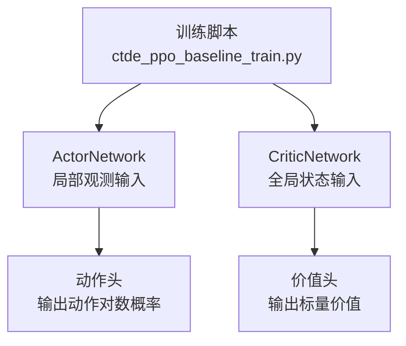
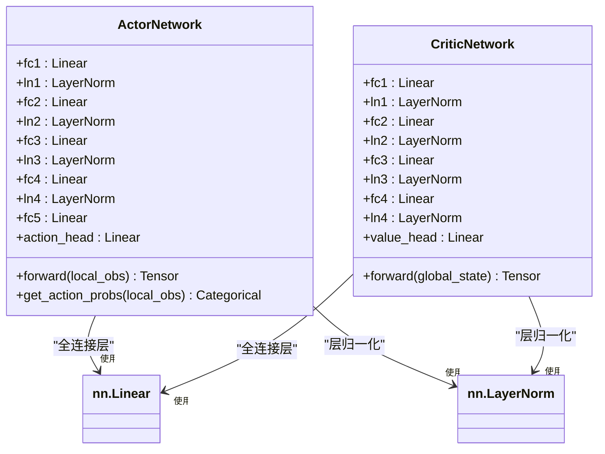
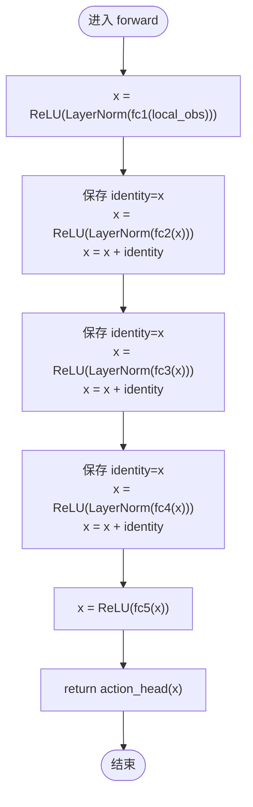
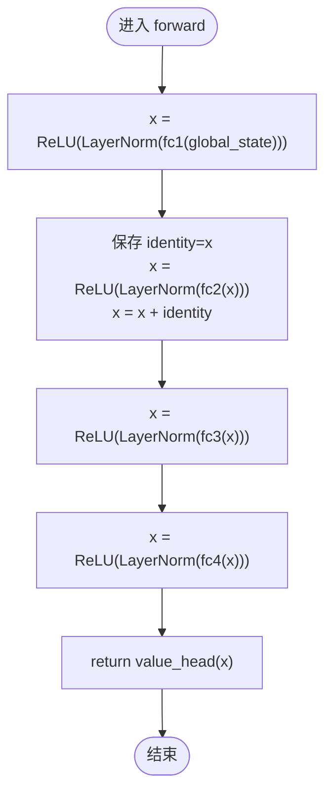
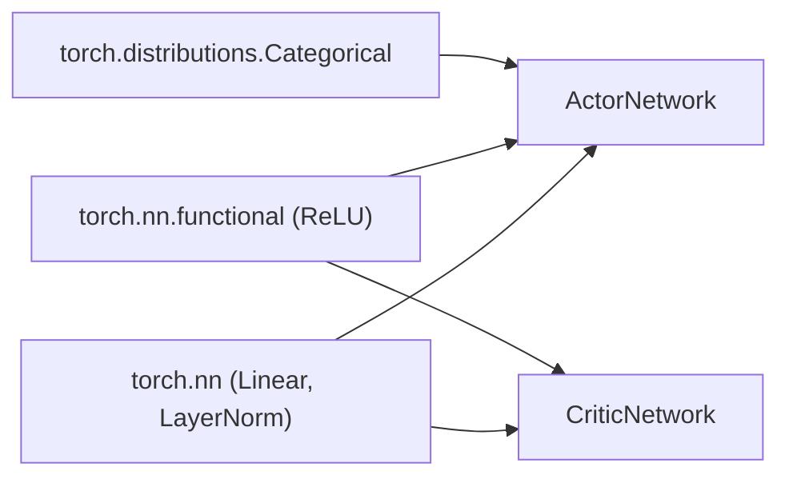

# Actor-Critic神经网络架构

<cite>
**本文引用的文件**   
- [ctde_ppo_baseline_train.py](file://environment_variables/environment_variables/ctde_ppo_baseline_train.py)
</cite>

## 目录
1. [简介](#简介)
2. [项目结构](#项目结构)
3. [核心组件](#核心组件)
4. [架构总览](#架构总览)
5. [详细组件分析](#详细组件分析)
6. [依赖关系分析](#依赖关系分析)
7. [性能与稳定性考量](#性能与稳定性考量)
8. [故障排查指南](#故障排查指南)
9. [结论](#结论)
10. [附录：使用示例与数据流说明](#附录使用示例与数据流说明)

## 简介
本文件围绕Actor-Critic神经网络架构，系统阐述ActorNetwork与CriticNetwork的网络结构设计、初始化策略与前向传播数据流。重点包括：
- 多层感知机（MLP）主干与残差连接机制
- LayerNorm在各层中的应用
- 正交初始化策略及权重参数设置
- Actor网络5层全连接结构（256→256→256→256→128）与动作头设计
- Critic网络4层结构（384→384→192→160）与价值头设计
- 如何实例化网络并获取动作概率分布与价值估计

## 项目结构
本项目将Actor-Critic网络定义在训练脚本中，便于与CTDE-PPO算法流程集成。关键类位于同一文件中，包含：
- ActorNetwork：离散动作策略网络
- CriticNetwork：全局状态价值网络
- 辅助类（如ReplayBuffer、CurriculumManager等）用于训练流程管理



图表来源
- [ctde_ppo_baseline_train.py:460-535](file://environment_variables/environment_variables/ctde_ppo_baseline_train.py#L460-L535)

章节来源
- [ctde_ppo_baseline_train.py:460-535](file://environment_variables/environment_variables/ctde_ppo_baseline_train.py#L460-L535)

## 核心组件
- ActorNetwork
  - 输入：局部观测向量
  - 主干：多层全连接+LayerNorm+ReLU，并在中间层引入残差连接
  - 输出头：线性层映射到动作维度，提供动作对数概率
- CriticNetwork
  - 输入：全局状态向量
  - 主干：多层全连接+LayerNorm+ReLU，部分层采用残差连接
  - 输出头：线性层输出标量价值估计

章节来源
- [ctde_ppo_baseline_train.py:460-535](file://environment_variables/environment_variables/ctde_ppo_baseline_train.py#L460-L535)

## 架构总览
下图展示Actor与Critic网络的层级结构与数据流向，突出LayerNorm、ReLU、残差连接与输出头的位置。



图表来源
- [ctde_ppo_baseline_train.py:460-535](file://environment_variables/environment_variables/ctde_ppo_baseline_train.py#L460-L535)

## 详细组件分析

### ActorNetwork分析
- 网络结构
  - 输入维度：local_obs_dim
  - 隐藏层：4个隐藏块，每块为Linear→LayerNorm→ReLU，并在第2~4块后加入恒等映射的残差连接
  - 最后隐藏层：Linear(hidden_dim→128)+ReLU
  - 动作头：Linear(128→action_dim)，输出动作对数概率
- 前向传播数据流
  - 第一块：x = ReLU(LayerNorm(fc1(x)))
  - 第二块：identity=x；x = ReLU(LayerNorm(fc2(x)))；x = x + identity
  - 第三块：同上模式
  - 第四块：同上模式
  - 尾段：x = ReLU(fc5(x))；返回 action_head(x)
- 初始化策略
  - 所有Linear层：权重采用正交初始化，增益为sqrt(2)；偏置初始化为0
  - 动作头：权重采用正交初始化，增益为0.01（较小增益有助于稳定早期策略探索）
- 复杂度与特性
  - 时间复杂度：O(N·d^2)（N为批大小，d为隐藏维度）
  - 空间复杂度：O(d^2)（存储权重）
  - 残差连接有助于缓解梯度消失，提升深层网络训练稳定性
  - LayerNorm稳定激活分布，加速收敛



图表来源
- [ctde_ppo_baseline_train.py:482-501](file://environment_variables/environment_variables/ctde_ppo_baseline_train.py#L482-L501)

章节来源
- [ctde_ppo_baseline_train.py:460-501](file://environment_variables/environment_variables/ctde_ppo_baseline_train.py#L460-L501)

### CriticNetwork分析
- 网络结构
  - 输入维度：global_state_dim
  - 隐藏层：4个隐藏块，每块为Linear→LayerNorm→ReLU，其中第2块后加入残差连接
  - 尾段：两层连续的全连接+LayerNorm+ReLU（无残差）
  - 价值头：Linear(160→1)，输出标量价值
- 前向传播数据流
  - 第一块：x = ReLU(LayerNorm(fc1(x)))
  - 第二块：identity=x；x = ReLU(LayerNorm(fc2(x)))；x = x + identity
  - 第三块：x = ReLU(LayerNorm(fc3(x)))
  - 第四块：x = ReLU(LayerNorm(fc4(x)))
  - 返回 value_head(x)
- 初始化策略
  - 所有Linear层：权重采用正交初始化，增益为sqrt(2)；偏置初始化为0
  - 价值头：权重采用正交初始化，增益为1.0（利于价值估计的尺度）
- 复杂度与特性
  - 时间复杂度：O(N·d^2)
  - 空间复杂度：O(d^2)
  - 残差连接仅出现在第二块，仍有助于梯度流动
  - LayerNorm确保各层激活分布稳定



图表来源
- [ctde_ppo_baseline_train.py:525-534](file://environment_variables/environment_variables/ctde_ppo_baseline_train.py#L525-L534)

章节来源
- [ctde_ppo_baseline_train.py:504-534](file://environment_variables/environment_variables/ctde_ppo_baseline_train.py#L504-L534)

## 依赖关系分析
- 外部依赖
  - torch.nn：Linear、LayerNorm
  - torch.nn.functional：ReLU
  - torch.distributions：Categorical（用于构造动作概率分布）
- 内部耦合
  - ActorNetwork与CriticNetwork彼此独立，分别处理局部观测与全局状态
  - 两者均通过正交初始化与LayerNorm保证训练稳定性
  - 上层训练循环（不在本节范围）负责采样、计算优势函数与更新参数



图表来源
- [ctde_ppo_baseline_train.py:460-535](file://environment_variables/environment_variables/ctde_ppo_baseline_train.py#L460-L535)

章节来源
- [ctde_ppo_baseline_train.py:460-535](file://environment_variables/environment_variables/ctde_ppo_baseline_train.py#L460-L535)

## 性能与稳定性考量
- 正交初始化
  - 优点：保持权重矩阵的条件数良好，避免早期梯度爆炸或消失
  - 适用性：深度MLP与策略网络常用，配合ReLU与LayerNorm效果显著
- LayerNorm
  - 优点：对批次大小不敏感，稳定激活分布，提高训练鲁棒性
  - 注意：需与合适的学习率配合，避免过度缩放导致优化困难
- 残差连接
  - 优点：缓解梯度衰减，允许信息跨层直达
  - 注意：仅在相同维度下可直接相加，当前实现满足该条件
- 输出头增益
  - Actor动作头增益较小（0.01），有利于初期策略平滑探索
  - Critic价值头增益较大（1.0），有利于价值估计的数值稳定性

[本节为通用指导，无需具体文件引用]

## 故障排查指南
- 维度不匹配错误
  - 现象：forward时出现张量形状不一致报错
  - 排查：确认传入local_obs_dim与global_state_dim与实际环境观测/状态维度一致
- 数值不稳定
  - 现象：训练发散或NaN损失
  - 排查：检查学习率、梯度裁剪、LayerNorm位置是否正确；验证正交初始化是否被覆盖
- 动作概率异常
  - 现象：Categorical采样失败或概率分布过于尖锐/平坦
  - 排查：确认动作头未施加额外非线性；检查logits尺度与熵系数设置

[本节为通用指导，无需具体文件引用]

## 结论
ActorNetwork与CriticNetwork均采用“全连接+LayerNorm+ReLU”的主干结构，并结合残差连接与正交初始化，形成稳定高效的Actor-Critic架构。Actor网络具备5层全连接与动作头，Critic网络具备4层全连接与价值头，二者在前向传播中清晰分离局部策略与全局价值估计，适合CTDE-PPO的训练范式。

[本节为总结性内容，无需具体文件引用]

## 附录：使用示例与数据流说明

### 实例化与调用示例（路径指引）
- 实例化ActorNetwork
  - 参考路径：[ctde_ppo_baseline_train.py:460-473](file://environment_variables/environment_variables/ctde_ppo_baseline_train.py#L460-L473)
  - 要点：传入local_obs_dim与action_dim，可选hidden_dim=256
- 实例化CriticNetwork
  - 参考路径：[ctde_ppo_baseline_train.py:504-516](file://environment_variables/environment_variables/ctde_ppo_baseline_train.py#L504-L516)
  - 要点：传入global_state_dim，可选hidden_dim=384
- 获取动作概率分布
  - 参考路径：[ctde_ppo_baseline_train.py:500-501](file://environment_variables/environment_variables/ctde_ppo_baseline_train.py#L500-L501)
  - 方法：调用actor.get_action_probs(local_obs)，返回Categorical对象
- 获取价值估计
  - 参考路径：[ctde_ppo_baseline_train.py:525-534](file://environment_variables/environment_variables/ctde_ppo_baseline_train.py#L525-L534)
  - 方法：critic.forward(global_state)，返回标量价值

```mermaid
sequenceDiagram
participant Env as "环境"
participant Actor as "ActorNetwork"
participant Critic as "CriticNetwork"
participant Dist as "Categorical"
Env->>Actor : 提供 local_obs
Actor->>Actor : forward(local_obs)
Actor-->>Dist : logits
Dist-->>Env : 采样动作 a
Env->>Critic : 提供 global_state
Critic->>Critic : forward(global_state)
Critic-->>Env : 价值 v
```

图表来源
- [ctde_ppo_baseline_train.py:482-501](file://environment_variables/environment_variables/ctde_ppo_baseline_train.py#L482-L501)
- [ctde_ppo_baseline_train.py:525-534](file://environment_variables/environment_variables/ctde_ppo_baseline_train.py#L525-L534)

章节来源
- [ctde_ppo_baseline_train.py:460-535](file://environment_variables/environment_variables/ctde_ppo_baseline_train.py#L460-L535)