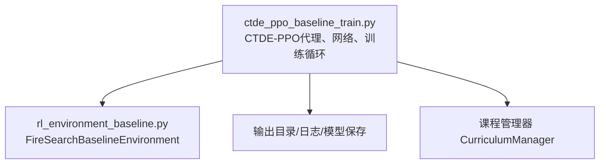
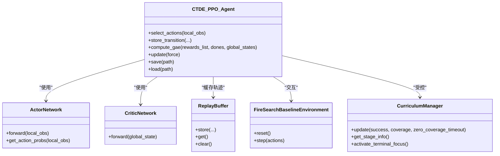
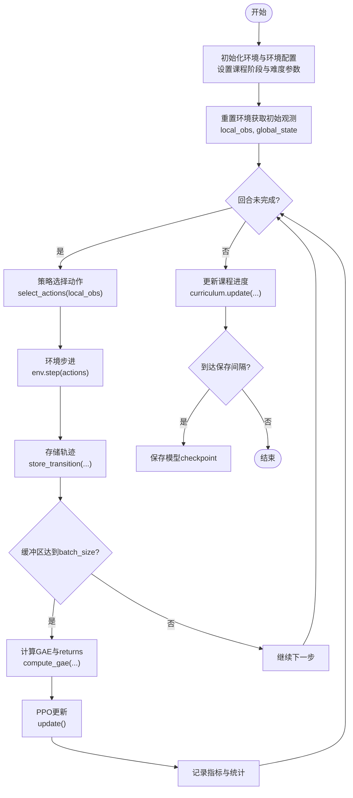

# PPO算法核心实现

<cite>
**本文引用的文件**   
- [ctde_ppo_baseline_train.py](file://environment_variables/environment_variables/ctde_ppo_baseline_train.py)
- [rl_environment_baseline.py](file://environment_variables/environment_variables/rl_environment_baseline.py)
</cite>

## 目录
1. [简介](#简介)
2. [项目结构](#项目结构)
3. [核心组件](#核心组件)
4. [架构总览](#架构总览)
5. [详细组件分析](#详细组件分析)
6. [依赖关系分析](#依赖关系分析)
7. [性能与稳定性考量](#性能与稳定性考量)
8. [故障排查指南](#故障排查指南)
9. [结论](#结论)
10. [附录：训练循环示例](#附录训练循环示例)

## 简介
本文件面向CTDE-PPO（集中式训练、分布式执行）多智能体强化学习基线实现，聚焦PPO核心机制在代码中的落地方式。内容涵盖：
- 优势函数估计（GAE）、裁剪目标函数、熵正则化、价值损失计算
- 超参数配置项（gamma、gae_lambda、clip_epsilon、entropy_coef、value_coef等）
- 梯度裁剪（max_grad_norm）与mini-batch策略
- 多智能体协作的动作选择、策略更新流程与模型保存机制
- 完整训练循环：从环境交互到模型更新的端到端流程

## 项目结构
本项目包含两个关键源文件：
- 环境与数据接口：提供多无人机火场边界搜索的Gymnasium环境
- CTDE-PPO训练脚本：包含网络定义、回放缓冲、GAE、PPO更新、课程学习与评估流水线



图表来源
- [ctde_ppo_baseline_train.py:759-1014](file://environment_variables/environment_variables/ctde_ppo_baseline_train.py#L759-L1014)
- [rl_environment_baseline.py:21-158](file://environment_variables/environment_variables/rl_environment_baseline.py#L21-L158)

章节来源
- [ctde_ppo_baseline_train.py:1-158](file://environment_variables/environment_variables/ctde_ppo_baseline_train.py#L1-L158)
- [rl_environment_baseline.py:1-158](file://environment_variables/environment_variables/rl_environment_baseline.py#L1-L158)

## 核心组件
- ActorNetwork：离散动作策略网络，输入为局部观测，输出动作logits
- CriticNetwork：全局状态价值网络，输入为全局状态，输出标量V(s)
- ReplayBuffer：按时间步收集轨迹（本地观测、全局状态、动作、旧对数概率、奖励、终止标记）
- CTDE_PPO_Agent：封装GAE、PPO裁剪目标、KL自适应学习率、mini-batch更新、模型存取
- FireSearchBaselineEnvironment：多智能体环境，提供局部观测与全局状态，支持多种观察/奖励配置
- CurriculumManager：三阶段课程学习，控制初始位置分布、目标覆盖率与近界生成概率

章节来源
- [ctde_ppo_baseline_train.py:460-535](file://environment_variables/environment_variables/ctde_ppo_baseline_train.py#L460-L535)
- [ctde_ppo_baseline_train.py:537-567](file://environment_variables/environment_variables/ctde_ppo_baseline_train.py#L537-L567)
- [ctde_ppo_baseline_train.py:569-757](file://environment_variables/environment_variables/ctde_ppo_baseline_train.py#L569-L757)
- [ctde_ppo_baseline_train.py:759-1014](file://environment_variables/environment_variables/ctde_ppo_baseline_train.py#L759-L1014)
- [rl_environment_baseline.py:21-158](file://environment_variables/environment_variables/rl_environment_baseline.py#L21-L158)

## 架构总览
下图展示CTDE-PPO在多智能体环境中的整体数据流与控制流：

```mermaid
sequenceDiagram
participant Env as "FireSearchBaselineEnvironment"
participant Agent as "CTDE_PPO_Agent"
participant Actor as "ActorNetwork"
participant Critic as "CriticNetwork"
participant Buffer as "ReplayBuffer"
loop 每个回合
Env->>Agent : reset() -> 初始obs(local_obs, global_state)
Agent->>Actor : select_actions(local_obs) -> actions, log_probs
Agent->>Env : step(actions) -> next_obs, rewards, done, info
Agent->>Buffer : store_transition(...)
alt 缓冲区达到batch_size
Agent->>Critic : compute_gae(rewards, dones, global_states)
Agent->>Agent : update() (mini-batch PPO)
end
end
```

图表来源
- [ctde_ppo_baseline_train.py:849-866](file://environment_variables/environment_variables/ctde_ppo_baseline_train.py#L849-L866)
- [ctde_ppo_baseline_train.py:867-887](file://environment_variables/environment_variables/ctde_ppo_baseline_train.py#L867-L887)
- [ctde_ppo_baseline_train.py:889-991](file://environment_variables/environment_variables/ctde_ppo_baseline_train.py#L889-L991)
- [rl_environment_baseline.py:331-361](file://environment_variables/environment_variables/rl_environment_baseline.py#L331-L361)

## 详细组件分析

### 1) 优势函数估计（GAE）
- 团队奖励聚合：将每步各智能体的奖励取均值作为团队奖励
- 时序差分残差：delta = r_t + gamma * V(s_{t+1}) * (1 - done_t) - V(s_t)
- GAE递归：gae_t = delta_t + gamma * gae_lambda * (1 - done_t) * gae_{t+1}
- 返回：returns_t = gae_t + V(s_t)
- 标准化：advantages先减去均值再除以标准差（加小常数防除零）

复杂度
- 时间：O(T)，T为回合长度
- 空间：O(T)用于存储advantages与returns

数值稳定
- 使用(1 - done_t)处理终止步
- advantages标准化避免方差过大导致的更新不稳定

章节来源
- [ctde_ppo_baseline_train.py:867-887](file://environment_variables/environment_variables/ctde_ppo_baseline_train.py#L867-L887)
- [ctde_ppo_baseline_train.py:895-898](file://environment_variables/environment_variables/ctde_ppo_baseline_train.py#L895-L898)

### 2) 裁剪目标函数与熵正则化
- 比率：ratio = exp(log π_θ(a|s) - log π_θ_old(a|s))
- 裁剪目标：min(ratio * A, clip(ratio, 1-ε, 1+ε) * A)
- 策略损失：负的平均裁剪目标，加上熵正则项（entropy_coef * H）
- 近似KL：((ratio - 1) - log_ratio)的均值，用于监控或自适应学习率

作用
- 裁剪限制策略更新幅度，防止一步更新过大导致崩溃
- 熵鼓励探索，避免过早收敛到次优策略

章节来源
- [ctde_ppo_baseline_train.py:939-951](file://environment_variables/environment_variables/ctde_ppo_baseline_train.py#L939-L951)
- [ctde_ppo_baseline_train.py:958-960](file://environment_variables/environment_variables/ctde_ppo_baseline_train.py#L958-L960)

### 3) 价值损失计算
- 预测值：V(s)由Critic网络输出
- 损失：MSE(V(s), returns)，乘以value_coef权重
- 优化：独立于Actor进行反向传播与参数更新

章节来源
- [ctde_ppo_baseline_train.py:920-926](file://environment_variables/environment_variables/ctde_ppo_baseline_train.py#L920-L926)

### 4) 梯度裁剪与mini-batch策略
- 梯度裁剪：对Actor和Critic分别应用nn.utils.clip_grad_norm_(params, max_grad_norm)
- mini-batch：每次迭代随机打乱样本，按mini_batch_size切分批次；默认mini_batch_size=max(512, batch_size//8)
- ppo_epochs：对同一批数据进行多次epoch更新

章节来源
- [ctde_ppo_baseline_train.py:923-926](file://environment_variables/environment_variables/ctde_ppo_baseline_train.py#L923-L926)
- [ctde_ppo_baseline_train.py:953-956](file://environment_variables/environment_variables/ctde_ppo_baseline_train.py#L953-L956)
- [ctde_ppo_baseline_train.py:802-803](file://environment_variables/environment_variables/ctde_ppo_baseline_train.py#L802-L803)

### 5) KL自适应学习率（可选）
- 模式：fixed或kl
- kl模式：根据近似KL的指数衰减因子调整actor学习率，并限制在[actor_lr_min, actor_lr_max]
- 记录：kl_ema、kl_lr_action等指标便于诊断

章节来源
- [ctde_ppo_baseline_train.py:823-847](file://environment_variables/environment_variables/ctde_ppo_baseline_train.py#L823-L847)
- [ctde_ppo_baseline_train.py:974-978](file://environment_variables/environment_variables/ctde_ppo_baseline_train.py#L974-L978)

### 6) 多智能体协作：动作选择与策略更新
- 动作选择：Actor对每个智能体的local_obs输出离散动作分布，采样得到actions与log_probs
- 策略更新：将多智能体动作展平后统一计算新log_prob、熵与裁剪目标，共享advantages广播至各智能体维度
- 全局状态：Critic仅接收全局状态，不直接参与动作选择，体现CTDE思想

章节来源
- [ctde_ppo_baseline_train.py:849-862](file://environment_variables/environment_variables/ctde_ppo_baseline_train.py#L849-L862)
- [ctde_ppo_baseline_train.py:933-937](file://environment_variables/environment_variables/ctde_ppo_baseline_train.py#L933-L937)

### 7) 模型保存与加载
- save：保存actor/critic参数与优化器状态、训练步数、KL EMA
- load：恢复上述状态，便于中断续训或离线评估

章节来源
- [ctde_ppo_baseline_train.py:993-1014](file://environment_variables/environment_variables/ctde_ppo_baseline_train.py#L993-L1014)

### 8) 课程学习（CurriculumManager）
- 阶段1：提升初始位置百分位，逐步增加难度
- 阶段2/3：提高目标覆盖率，降低near_prob（靠近边界的生成概率），最终进入“终末专注”强制评估条件
- 动态同步：当课程变化时，立即更新环境的init_area_percent、stage3_target、stage3_near_prob，并在必要时触发一次强制更新

章节来源
- [ctde_ppo_baseline_train.py:569-757](file://environment_variables/environment_variables/ctde_ppo_baseline_train.py#L569-L757)
- [ctde_ppo_baseline_train.py:1470-1486](file://environment_variables/environment_variables/ctde_ppo_baseline_train.py#L1470-L1486)
- [ctde_ppo_baseline_train.py:1554-1586](file://environment_variables/environment_variables/ctde_ppo_baseline_train.py#L1554-L1586)

## 依赖关系分析
- CTDE_PPO_Agent依赖ActorNetwork/CriticNetwork进行前向推理与参数更新
- Agent通过ReplayBuffer缓存轨迹，compute_gae依赖Critic预测值
- 训练循环依赖FireSearchBaselineEnvironment提供交互接口
- 课程管理器与训练循环耦合，驱动环境难度与评估条件



图表来源
- [ctde_ppo_baseline_train.py:460-535](file://environment_variables/environment_variables/ctde_ppo_baseline_train.py#L460-L535)
- [ctde_ppo_baseline_train.py:537-567](file://environment_variables/environment_variables/ctde_ppo_baseline_train.py#L537-L567)
- [ctde_ppo_baseline_train.py:569-757](file://environment_variables/environment_variables/ctde_ppo_baseline_train.py#L569-L757)
- [ctde_ppo_baseline_train.py:759-1014](file://environment_variables/environment_variables/ctde_ppo_baseline_train.py#L759-L1014)
- [rl_environment_baseline.py:21-158](file://environment_variables/environment_variables/rl_environment_baseline.py#L21-L158)

## 性能与稳定性考量
- GAE偏差-方差权衡：gae_lambda越大，方差越低但偏差越高；建议0.9~0.95
- 裁剪范围clip_epsilon：过小导致更新保守，过大可能导致不稳定；常见0.1~0.3
- 熵系数entropy_coef：鼓励探索，过大可能阻碍收敛；常见0.001~0.05
- 价值系数value_coef：平衡价值拟合与策略更新；常见0.5~1.0
- 梯度裁剪max_grad_norm：防止梯度爆炸；常见0.5~1.0
- mini-batch大小：过小导致噪声大，过大降低样本多样性；建议至少512
- ppo_epochs：过多易过拟合当前批次；常见2~5

章节来源
- [ctde_ppo_baseline_train.py:774-782](file://environment_variables/environment_variables/ctde_ppo_baseline_train.py#L774-L782)
- [ctde_ppo_baseline_train.py:802-803](file://environment_variables/environment_variables/ctde_ppo_baseline_train.py#L802-L803)

## 故障排查指南
- 训练未更新：检查缓冲区是否达到batch_size或min_update_batch_size
- 策略崩溃：增大max_grad_norm或减小clip_epsilon；监控approx_kl与clip_fraction
- 探索不足：适当增大entropy_coef；检查KL自适应是否过度抑制学习率
- 价值发散：检查returns尺度与value_coef；确保advantages已标准化
- 课程推进异常：确认成功率、覆盖率与超时阈值满足阶段门槛；关注“终末专注”是否激活

章节来源
- [ctde_ppo_baseline_train.py:889-893](file://environment_variables/environment_variables/ctde_ppo_baseline_train.py#L889-L893)
- [ctde_ppo_baseline_train.py:958-960](file://environment_variables/environment_variables/ctde_ppo_baseline_train.py#L958-L960)
- [ctde_ppo_baseline_train.py:1470-1486](file://environment_variables/environment_variables/ctde_ppo_baseline_train.py#L1470-L1486)

## 结论
该CTDE-PPO实现以清晰的模块化设计实现了多智能体协作下的稳定训练流程。GAE与裁剪目标结合熵正则化，配合KL自适应学习率与梯度裁剪，形成稳健的策略更新闭环。课程学习进一步提升了在不同难度场景下的泛化能力。通过完善的日志与评估管线，可系统性地追踪训练质量与稳定性。

## 附录：训练循环示例
以下给出一个完整的训练循环示例，展示从环境初始化、回合交互、轨迹收集、GAE计算到PPO更新的全过程。



图表来源
- [ctde_ppo_baseline_train.py:1469-1506](file://environment_variables/environment_variables/ctde_ppo_baseline_train.py#L1469-L1506)
- [ctde_ppo_baseline_train.py:1504-1505](file://environment_variables/environment_variables/ctde_ppo_baseline_train.py#L1504-L1505)
- [ctde_ppo_baseline_train.py:1554-1586](file://environment_variables/environment_variables/ctde_ppo_baseline_train.py#L1554-L1586)
- [ctde_ppo_baseline_train.py:1658-1670](file://environment_variables/environment_variables/ctde_ppo_baseline_train.py#L1658-L1670)

章节来源
- [ctde_ppo_baseline_train.py:1278-1383](file://environment_variables/environment_variables/ctde_ppo_baseline_train.py#L1278-L1383)
- [ctde_ppo_baseline_train.py:1469-1506](file://environment_variables/environment_variables/ctde_ppo_baseline_train.py#L1469-L1506)
- [ctde_ppo_baseline_train.py:1554-1586](file://environment_variables/environment_variables/ctde_ppo_baseline_train.py#L1554-L1586)
- [ctde_ppo_baseline_train.py:1658-1670](file://environment_variables/environment_variables/ctde_ppo_baseline_train.py#L1658-L1670)