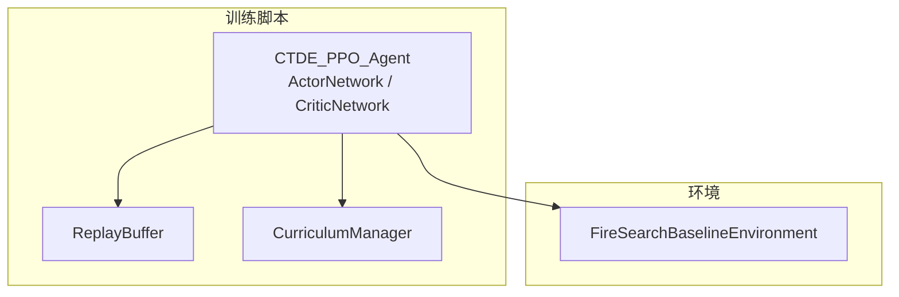
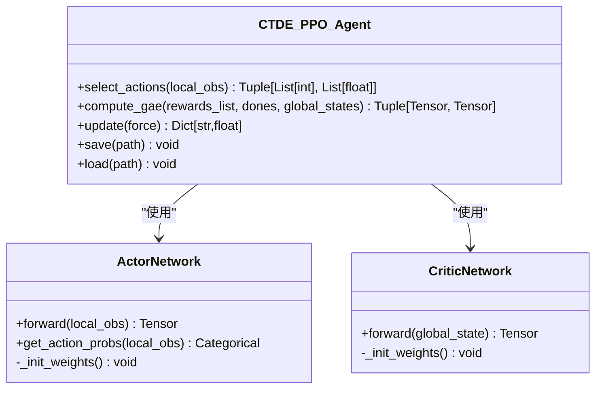
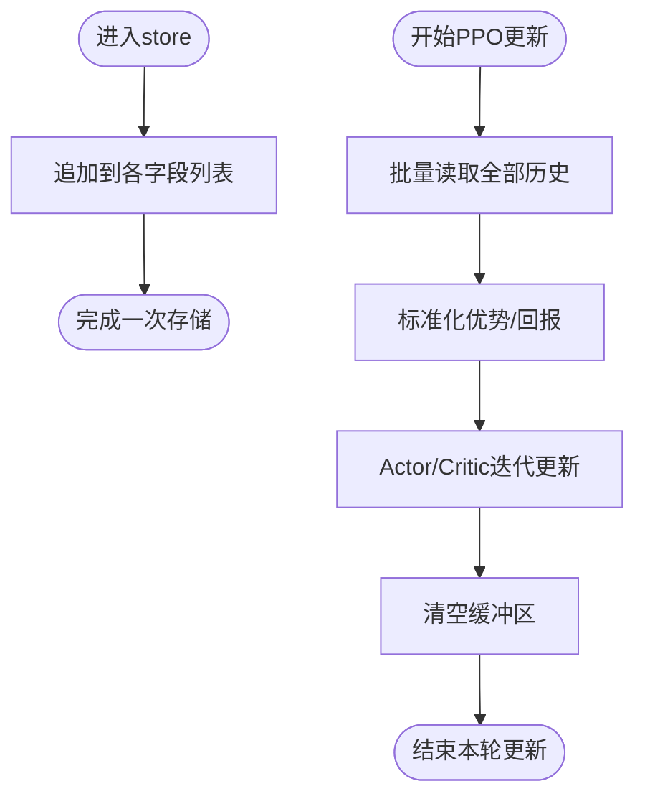
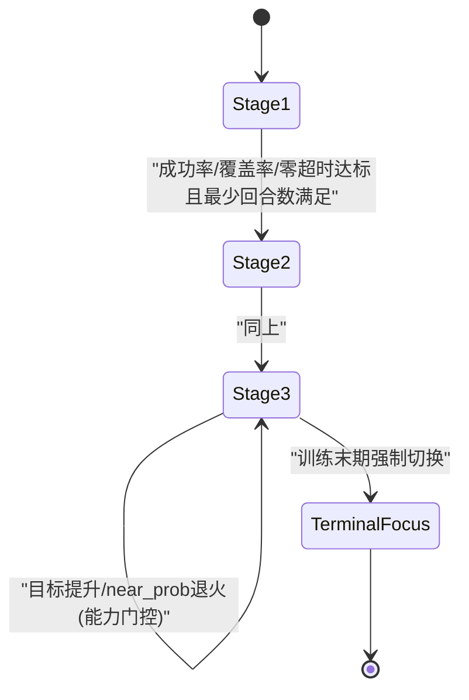
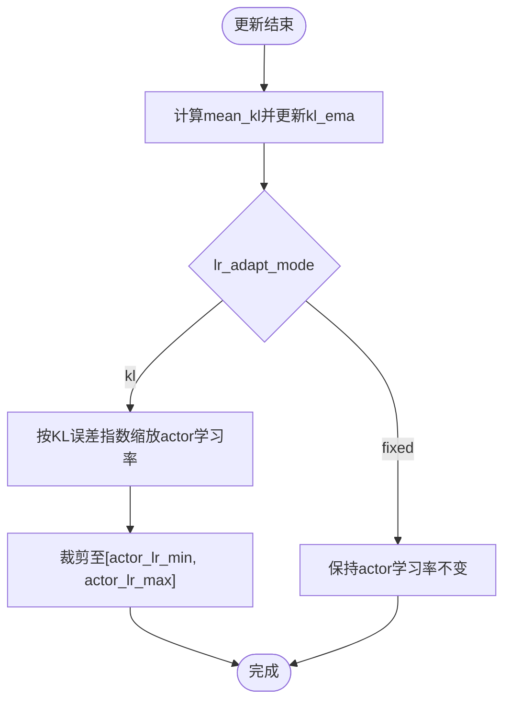
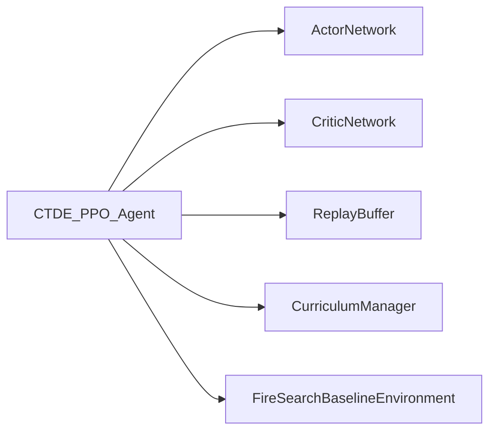

# 核心算法架构

<cite>
**本文引用的文件**   
- [ctde_ppo_baseline_train.py](file://environment_variables/environment_variables/ctde_ppo_baseline_train.py)
- [rl_environment_baseline.py](file://environment_variables/environment_variables/rl_environment_baseline.py)
</cite>

## 目录
1. [简介](#简介)
2. [项目结构](#项目结构)
3. [核心组件](#核心组件)
4. [架构总览](#架构总览)
5. [详细组件分析](#详细组件分析)
6. [依赖关系分析](#依赖关系分析)
7. [性能考量](#性能考量)
8. [故障排查指南](#故障排查指南)
9. [结论](#结论)
10. [附录：使用示例与超参数配置](#附录使用示例与超参数配置)

## 简介
本文件面向CTDE-PPO（集中式训练、去中心化执行）的核心算法架构，系统阐述ActorNetwork与CriticNetwork的网络设计（含残差连接与LayerNorm）、ReplayBuffer的数据存储机制、CurriculumManager的课程学习框架、自适应学习率策略（KL控制），以及多智能体协作、动作选择与价值估计方法。文档同时给出网络权重初始化、梯度裁剪与关键超参数的说明，并提供可复现的实例化与调用路径指引。

## 项目结构
仓库中与CTDE-PPO相关的核心实现位于 environment_variables 目录下：
- ctde_ppo_baseline_train.py：包含CTDE-PPO代理、Actor/Critic网络、回放缓冲、课程管理器、训练主循环与评估工具等。
- rl_environment_baseline.py：提供FireSearchBaselineEnvironment环境，定义观测空间、全局状态、奖励函数与任务终止条件，支撑CTDE范式下的“局部观测+全局状态”接口。



图表来源
- [ctde_ppo_baseline_train.py:460-535](file://environment_variables/environment_variables/ctde_ppo_baseline_train.py#L460-L535)
- [ctde_ppo_baseline_train.py:537-567](file://environment_variables/environment_variables/ctde_ppo_baseline_train.py#L537-L567)
- [ctde_ppo_baseline_train.py:569-757](file://environment_variables/environment_variables/ctde_ppo_baseline_train.py#L569-L757)
- [rl_environment_baseline.py:21-158](file://environment_variables/environment_variables/rl_environment_baseline.py#L21-L158)

章节来源
- [ctde_ppo_baseline_train.py:1-158](file://environment_variables/environment_variables/ctde_ppo_baseline_train.py#L1-L158)
- [rl_environment_baseline.py:1-158](file://environment_variables/environment_variables/rl_environment_baseline.py#L1-L158)

## 核心组件
- ActorNetwork：基于多层全连接网络，采用LayerNorm与残差连接，输出离散动作的对数几率（logits）。
- CriticNetwork：基于多层全连接网络，采用LayerNorm与部分残差连接，输出标量状态价值V(s)。
- ReplayBuffer：以列表形式按时间步累积轨迹样本，支持批量获取与清空。
- CurriculumManager：三阶段课程学习，动态调整初始火场面积比例、目标覆盖率与近端生成概率，并具备能力门控与强制推进逻辑。
- CTDE_PPO_Agent：封装PPO更新流程（GAE、裁剪目标、熵正则、KL自适应学习率、梯度裁剪）、动作采样与确定性推理、模型保存/加载。

章节来源
- [ctde_ppo_baseline_train.py:460-535](file://environment_variables/environment_variables/ctde_ppo_baseline_train.py#L460-L535)
- [ctde_ppo_baseline_train.py:537-567](file://environment_variables/environment_variables/ctde_ppo_baseline_train.py#L537-L567)
- [ctde_ppo_baseline_train.py:569-757](file://environment_variables/environment_variables/ctde_ppo_baseline_train.py#L569-L757)
- [ctde_ppo_baseline_train.py:759-1014](file://environment_variables/environment_variables/ctde_ppo_baseline_train.py#L759-L1014)

## 架构总览
CTDE-PPO在训练中共享全局状态用于价值估计，在执行时各智能体仅依据本地观测独立决策。整体数据流如下：

```mermaid
sequenceDiagram
participant Env as "FireSearchBaselineEnvironment"
participant Agent as "CTDE_PPO_Agent"
participant Actor as "ActorNetwork"
participant Critic as "CriticNetwork"
participant Buffer as "ReplayBuffer"
Env->>Agent : reset() -> {local_obs, global_state}
loop 每步
Agent->>Actor : get_action_probs(local_obs)
Actor-->>Agent : logits -> 采样actions, log_probs
Agent->>Env : step(actions)
Env-->>Agent : {local_obs', global_state'}, rewards, done, info
Agent->>Buffer : store_transition(...)
alt 缓冲区满足批次大小
Agent->>Critic : compute_gae(global_states)
Agent->>Actor : PPO更新(裁剪目标+熵)
Agent->>Critic : PPO更新(MSE损失)
Agent->>Agent : KL自适应actor学习率(可选)
end
end
```

图表来源
- [ctde_ppo_baseline_train.py:849-991](file://environment_variables/environment_variables/ctde_ppo_baseline_train.py#L849-L991)
- [rl_environment_baseline.py:331-361](file://environment_variables/environment_variables/rl_environment_baseline.py#L331-L361)
- [rl_environment_baseline.py:842-992](file://environment_variables/environment_variables/rl_environment_baseline.py#L842-L992)

## 详细组件分析

### ActorNetwork 与 CriticNetwork 网络架构
- ActorNetwork
  - 输入：本地观测向量；输出：离散动作logits。
  - 结构：多层线性层 + LayerNorm + ReLU，并在中间块引入残差连接，最后经一个小型投影头输出动作维度。
  - 权重初始化：线性层权重正交初始化，偏置为零；动作头权重小尺度正交初始化，利于稳定早期探索。
- CriticNetwork
  - 输入：全局状态向量；输出：标量价值V(s)。
  - 结构：多层线性层 + LayerNorm + ReLU，部分块引入残差连接，最终经价值头输出。
  - 权重初始化：线性层权重正交初始化，偏置为零；价值头权重单位增益正交初始化。



图表来源
- [ctde_ppo_baseline_train.py:460-535](file://environment_variables/environment_variables/ctde_ppo_baseline_train.py#L460-L535)
- [ctde_ppo_baseline_train.py:759-1014](file://environment_variables/environment_variables/ctde_ppo_baseline_train.py#L759-L1014)

章节来源
- [ctde_ppo_baseline_train.py:460-535](file://environment_variables/environment_variables/ctde_ppo_baseline_train.py#L460-L535)

### ReplayBuffer 数据存储机制
- 存储字段：local_obs、global_states、actions、log_probs、rewards、dones，均以Python列表按时间步追加。
- 访问方式：一次性返回所有字段组成的元组，供PPO更新阶段进行张量化与批处理。
- 清理：更新完成后清空列表，避免内存泄漏。



图表来源
- [ctde_ppo_baseline_train.py:537-567](file://environment_variables/environment_variables/ctde_ppo_baseline_train.py#L537-L567)
- [ctde_ppo_baseline_train.py:889-991](file://environment_variables/environment_variables/ctde_ppo_baseline_train.py#L889-L991)

章节来源
- [ctde_ppo_baseline_train.py:537-567](file://environment_variables/environment_variables/ctde_ppo_baseline_train.py#L537-L567)

### CurriculumManager 课程学习框架
- 阶段划分：Stage1（易场景/低覆盖率目标）、Stage2（中等目标）、Stage3（高目标与难度退火）。
- 能力门控：基于成功率、覆盖率、零覆盖超时率的滑动窗口统计，达到阈值后推进阶段或提升目标。
- 难度退火：逐步降低near_prob（靠近边界生成无人机），并与目标进度绑定，防止超前退化。
- 终端聚焦：在训练末尾强制切换到最终目标与最小near_prob，确保评估条件一致性。



图表来源
- [ctde_ppo_baseline_train.py:569-757](file://environment_variables/environment_variables/ctde_ppo_baseline_train.py#L569-L757)

章节来源
- [ctde_ppo_baseline_train.py:569-757](file://environment_variables/environment_variables/ctde_ppo_baseline_train.py#L569-L757)

### 自适应学习率调整策略（KL控制）
- 监控指标：近似KL散度（approx_kl）及其指数移动平均（kl_ema）。
- 调整规则：根据当前kl_ema与目标KL的偏差，计算缩放因子并更新actor学习率，限制在[min,max]范围内。
- 模式：固定学习率（fixed）或KL自适应（kl）。



图表来源
- [ctde_ppo_baseline_train.py:823-847](file://environment_variables/environment_variables/ctde_ppo_baseline_train.py#L823-L847)
- [ctde_ppo_baseline_train.py:974-978](file://environment_variables/environment_variables/ctde_ppo_baseline_train.py#L974-L978)

章节来源
- [ctde_ppo_baseline_train.py:823-847](file://environment_variables/environment_variables/ctde_ppo_baseline_train.py#L823-L847)
- [ctde_ppo_baseline_train.py:974-978](file://environment_variables/environment_variables/ctde_ppo_baseline_train.py#L974-L978)

### 多智能体协作机制、动作选择与价值估计
- 协作机制：每个智能体独立选择动作（基于ActorNetwork），但训练时使用团队平均奖励与全局状态进行价值估计（CriticNetwork），体现CTDE思想。
- 动作选择：
  - 随机采样：从Categorical分布中采样动作并记录对数几率。
  - 确定性推理：取logits最大值作为动作（评估时使用）。
- 价值估计：CriticNetwork对全局状态映射为标量V(s)，结合GAE计算优势与回报。

```mermaid
sequenceDiagram
participant Agent as "CTDE_PPO_Agent"
participant Actor as "ActorNetwork"
participant Critic as "CriticNetwork"
Agent->>Actor : get_action_probs(local_obs)
Actor-->>Agent : logits -> actions, log_probs
Agent->>Critic : forward(global_states)
Critic-->>Agent : values V(s)
Agent->>Agent : GAE计算advantages与returns
```

图表来源
- [ctde_ppo_baseline_train.py:849-887](file://environment_variables/environment_variables/ctde_ppo_baseline_train.py#L849-L887)

章节来源
- [ctde_ppo_baseline_train.py:849-887](file://environment_variables/environment_variables/ctde_ppo_baseline_train.py#L849-L887)

### 网络初始化权重策略与梯度裁剪
- 权重初始化：
  - 线性层：正交初始化权重，偏置设为0。
  - 动作头：小增益正交初始化，利于初期探索稳定性。
  - 价值头：单位增益正交初始化。
- 梯度裁剪：
  - Actor与Critic均使用最大范数裁剪，防止梯度爆炸。

章节来源
- [ctde_ppo_baseline_train.py:475-481](file://environment_variables/environment_variables/ctde_ppo_baseline_train.py#L475-L481)
- [ctde_ppo_baseline_train.py:518-524](file://environment_variables/environment_variables/ctde_ppo_baseline_train.py#L518-L524)
- [ctde_ppo_baseline_train.py:925-956](file://environment_variables/environment_variables/ctde_ppo_baseline_train.py#L925-L956)

### 环境与CTDE接口
- 观测空间：
  - local_obs：每架无人机的局部观测向量（不同profile维度不同）。
  - global_state：团队级全局状态向量（覆盖率、电池均值/最小值、队形中心/散布、距火场平均距离、步长归一化、已访问密度、课程阶段、风场/高程均值、边界发现特征、低电量指示、无人机数量、覆盖率梯度、未发现密度等）。
- 动作空间：离散5维（上下左右不动）。
- 奖励分解：发现边界、覆盖率增量、区域增量、边界/前沿/严重性/探索/搜索/惩罚/终端等分项。

章节来源
- [rl_environment_baseline.py:21-158](file://environment_variables/environment_variables/rl_environment_baseline.py#L21-L158)
- [rl_environment_baseline.py:565-658](file://environment_variables/environment_variables/rl_environment_baseline.py#L565-L658)
- [rl_environment_baseline.py:692-992](file://environment_variables/environment_variables/rl_environment_baseline.py#L692-L992)

## 依赖关系分析
- 模块耦合：
  - CTDE_PPO_Agent强依赖ActorNetwork与CriticNetwork，并通过ReplayBuffer解耦采样与更新。
  - CurriculumManager通过外部回调（训练循环）驱动环境参数（如stage3_near_prob、init_area_percent）变化。
  - FireSearchBaselineEnvironment提供标准Gymnasium接口，暴露local_obs与global_state，支撑CTDE范式。
- 潜在环依赖：无直接循环导入；训练脚本与环境分离清晰。
- 外部依赖：PyTorch（神经网络与优化器）、NumPy（数值计算）、Gymnasium（环境接口）。



图表来源
- [ctde_ppo_baseline_train.py:460-535](file://environment_variables/environment_variables/ctde_ppo_baseline_train.py#L460-L535)
- [ctde_ppo_baseline_train.py:537-567](file://environment_variables/environment_variables/ctde_ppo_baseline_train.py#L537-L567)
- [ctde_ppo_baseline_train.py:569-757](file://environment_variables/environment_variables/ctde_ppo_baseline_train.py#L569-L757)
- [rl_environment_baseline.py:21-158](file://environment_variables/environment_variables/rl_environment_baseline.py#L21-L158)

章节来源
- [ctde_ppo_baseline_train.py:460-535](file://environment_variables/environment_variables/ctde_ppo_baseline_train.py#L460-L535)
- [rl_environment_baseline.py:21-158](file://environment_variables/environment_variables/rl_environment_baseline.py#L21-L158)

## 性能考量
- 批处理与Mini-batch：
  - 支持batch_size与mini_batch_size，默认mini_batch_size不低于512，兼顾GPU吞吐与稳定性。
- 优势标准化：
  - 在PPO更新前对advantages进行零均值和单位方差标准化，提高训练稳定性。
- 梯度裁剪：
  - 统一的最大范数裁剪，防止不稳定更新。
- KL自适应学习率：
  - 通过KL控制actor学习率，有助于在分布漂移时自动收敛。
- 设备选择：
  - 自动检测CUDA可用性，优先使用GPU加速。

章节来源
- [ctde_ppo_baseline_train.py:800-815](file://environment_variables/environment_variables/ctde_ppo_baseline_train.py#L800-L815)
- [ctde_ppo_baseline_train.py:898-956](file://environment_variables/environment_variables/ctde_ppo_baseline_train.py#L898-L956)

## 故障排查指南
- 常见错误与定位：
  - lr_adapt_mode非法：需为'fixed'或'kl'。
  - observation_profile或reward_profile非法：需在环境定义的枚举集合内。
  - init_percentile/init_area_percent越界：需在[0,100]范围。
- 调试建议：
  - 检查日志中的课程阶段切换信息、KL与clip_fraction趋势、actor/critic学习率变化。
  - 若出现NaN或梯度爆炸，确认max_grad_norm设置与KL自适应是否过于激进。
  - 验证环境维度是否与网络输入一致（local_obs_dim/global_state_dim）。

章节来源
- [ctde_ppo_baseline_train.py:784-800](file://environment_variables/environment_variables/ctde_ppo_baseline_train.py#L784-L800)
- [ctde_ppo_baseline_train.py:196-202](file://environment_variables/environment_variables/ctde_ppo_baseline_train.py#L196-L202)
- [ctde_ppo_baseline_train.py:215-220](file://environment_variables/environment_variables/ctde_ppo_baseline_train.py#L215-L220)

## 结论
该CTDE-PPO实现将Actor/Critic网络设计与课程学习、KL自适应学习率、GAE优势估计与PPO裁剪目标有机结合，形成稳定的多智能体协作训练框架。通过清晰的CTDE接口与丰富的奖励分解，便于在不同场景与观察/奖励配置下快速迁移与扩展。

## 附录：使用示例与超参数配置

### 实例化与使用核心组件（代码片段路径）
- 初始化CTDE_PPO_Agent与网络：
  - [ctde_ppo_baseline_train.py:784-821](file://environment_variables/environment_variables/ctde_ppo_baseline_train.py#L784-L821)
- 动作选择（随机/确定性）：
  - [ctde_ppo_baseline_train.py:849-862](file://environment_variables/environment_variables/ctde_ppo_baseline_train.py#L849-L862)
- 存储过渡与GAE计算：
  - [ctde_ppo_baseline_train.py:864-887](file://environment_variables/environment_variables/ctde_ppo_baseline_train.py#L864-L887)
- PPO更新与KL自适应：
  - [ctde_ppo_baseline_train.py:889-991](file://environment_variables/environment_variables/ctde_ppo_baseline_train.py#L889-L991)
- 保存/加载模型：
  - [ctde_ppo_baseline_train.py:993-1014](file://environment_variables/environment_variables/ctde_ppo_baseline_train.py#L993-L1014)
- 环境初始化与step接口：
  - [rl_environment_baseline.py:331-361](file://environment_variables/environment_variables/rl_environment_baseline.py#L331-L361)
  - [rl_environment_baseline.py:842-992](file://environment_variables/environment_variables/rl_environment_baseline.py#L842-L992)

### 关键超参数配置选项（默认值与说明）
- 训练与优化
  - actor_lr、critic_lr：初始学习率
  - gamma、gae_lambda：折扣与GAE系数
  - clip_epsilon：PPO裁剪范围
  - entropy_coef、value_coef：熵与价值损失权重
  - max_grad_norm：梯度裁剪上限
  - ppo_epochs、batch_size、mini_batch_size：更新轮次与批次大小
- 自适应学习率（KL）
  - lr_adapt_mode：'fixed'或'kl'
  - target_kl：目标KL散度
  - actor_lr_min、actor_lr_max：actor学习率边界
  - kl_ema_beta、kl_lr_alpha：EMA平滑与缩放强度
- 课程学习
  - final_init_area_percent、stage3_final_target：最终难度目标
  - stage2_success_target、stage3_success_target、stage3_near_prob：阶段目标与近端生成概率
- 数据与评估
  - data_dir、train_split、eval_split、validation_split：数据集与切分
  - validation_interval、eval_episodes_per_scene、final_eval_splits：评估频率与规模
  - quality_score_threshold、quality_window、quality_tail_fraction、quality_target_kl：质量评估指标

章节来源
- [ctde_ppo_baseline_train.py:98-158](file://environment_variables/environment_variables/ctde_ppo_baseline_train.py#L98-L158)
- [ctde_ppo_baseline_train.py:161-281](file://environment_variables/environment_variables/ctde_ppo_baseline_train.py#L161-L281)
- [ctde_ppo_baseline_train.py:784-800](file://environment_variables/environment_variables/ctde_ppo_baseline_train.py#L784-L800)