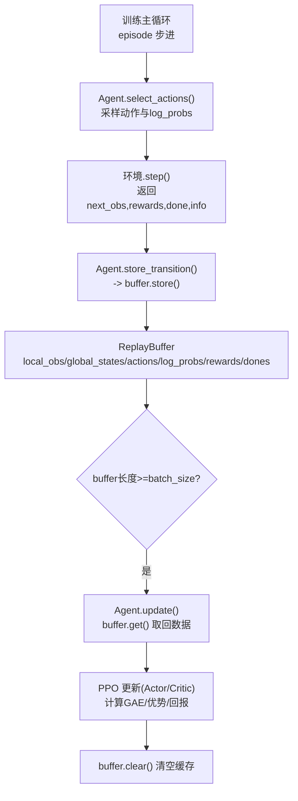
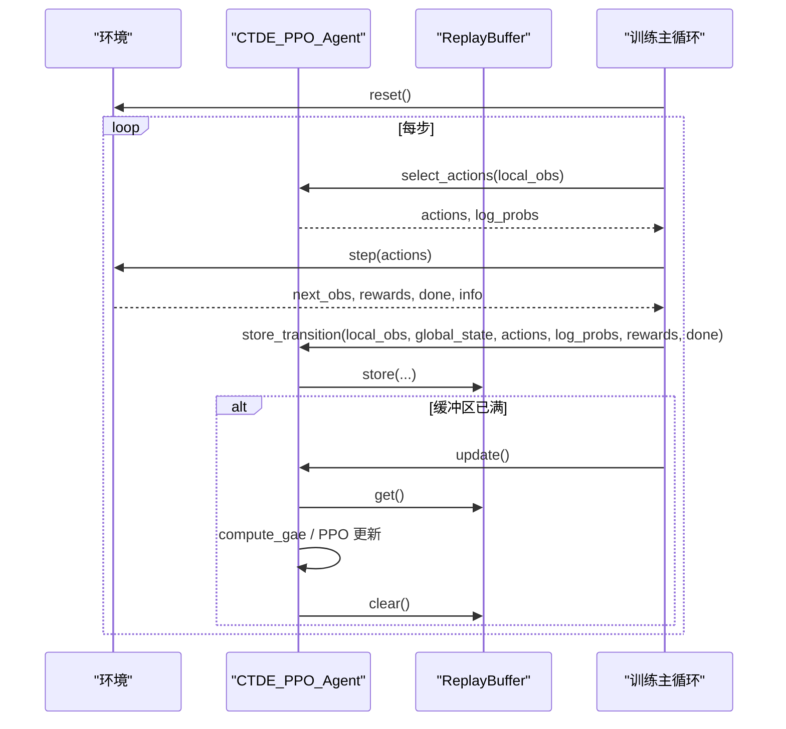
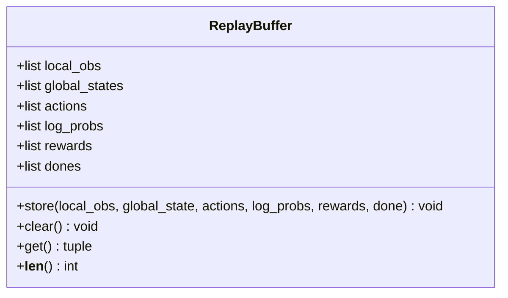
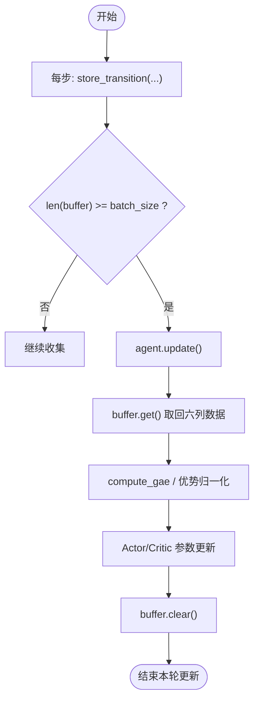
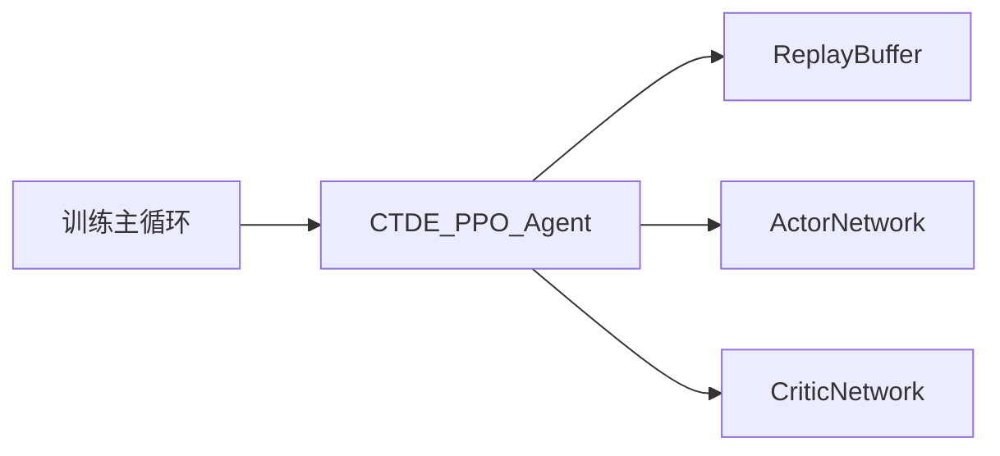

# 经验回放缓冲区系统

<cite>
**本文引用的文件**   
- [ctde_ppo_baseline_train.py](file://environment_variables/environment_variables/ctde_ppo_baseline_train.py)
</cite>

## 目录
1. [简介](#简介)
2. [项目结构](#项目结构)
3. [核心组件](#核心组件)
4. [架构总览](#架构总览)
5. [详细组件分析](#详细组件分析)
6. [依赖关系分析](#依赖关系分析)
7. [性能与内存考量](#性能与内存考量)
8. [故障排查指南](#故障排查指南)
9. [结论](#结论)
10. [附录：使用示例与最佳实践](#附录使用示例与最佳实践)

## 简介
本文件聚焦于经验回放缓冲区系统，围绕 ReplayBuffer 类的数据管理机制展开。文档详细说明其如何存储局部观测、全局状态、动作、对数概率、奖励和终止信号；解释数据的存储格式、内存管理策略与清理机制；并给出在训练循环中如何使用 store() 与 get() 的完整流程与示例路径，帮助读者快速理解与正确集成该缓冲区到 PPO 训练管线中。

## 项目结构
ReplayBuffer 及其调用点位于 CTDE-PPO 基线训练脚本中，主要涉及以下位置：
- 缓冲区定义与接口：ReplayBuffer 类
- 智能体封装：CTDE_PPO_Agent 持有 ReplayBuffer 实例并提供统一访问方法
- 训练主循环：在 episode 步进过程中收集数据并在满足批次大小时触发更新

图表来源
- [ctde_ppo_baseline_train.py:537-566](file://environment_variables/environment_variables/ctde_ppo_baseline_train.py#L537-L566)
- [ctde_ppo_baseline_train.py:864-866](file://environment_variables/environment_variables/ctde_ppo_baseline_train.py#L864-L866)
- [ctde_ppo_baseline_train.py:889-991](file://environment_variables/environment_variables/ctde_ppo_baseline_train.py#L889-L991)
- [ctde_ppo_baseline_train.py:1492-1506](file://environment_variables/environment_variables/ctde_ppo_baseline_train.py#L1492-L1506)

章节来源
- [ctde_ppo_baseline_train.py:537-566](file://environment_variables/environment_variables/ctde_ppo_baseline_train.py#L537-L566)
- [ctde_ppo_baseline_train.py:864-866](file://environment_variables/environment_variables/ctde_ppo_baseline_train.py#L864-L866)
- [ctde_ppo_baseline_train.py:889-991](file://environment_variables/environment_variables/ctde_ppo_baseline_train.py#L889-L991)
- [ctde_ppo_baseline_train.py:1492-1506](file://environment_variables/environment_variables/ctde_ppo_baseline_train.py#L1492-L1506)

## 核心组件
- ReplayBuffer：负责按时间步顺序追加并批量读取轨迹片段（local_obs、global_states、actions、log_probs、rewards、dones）。
- CTDE_PPO_Agent：封装 Actor/Critic 网络与优化器，持有 ReplayBuffer 实例，提供 select_actions、store_transition、update 等高层接口。
- 训练主循环：在每个环境 step 后调用 agent.store_transition，当缓冲区累积达到 batch_size 时调用 agent.update 进行 PPO 更新，并在更新完成后清空缓冲区。

章节来源
- [ctde_ppo_baseline_train.py:537-566](file://environment_variables/environment_variables/ctde_ppo_baseline_train.py#L537-L566)
- [ctde_ppo_baseline_train.py:864-866](file://environment_variables/environment_variables/ctde_ppo_baseline_train.py#L864-L866)
- [ctde_ppo_baseline_train.py:889-991](file://environment_variables/environment_variables/ctde_ppo_baseline_train.py#L889-L991)
- [ctde_ppo_baseline_train.py:1492-1506](file://environment_variables/environment_variables/ctde_ppo_baseline_train.py#L1492-L1506)

## 架构总览
下图展示了从环境交互到模型更新的端到端数据流，重点标注了 ReplayBuffer 的写入与读取时机。

图表来源
- [ctde_ppo_baseline_train.py:1492-1506](file://environment_variables/environment_variables/ctde_ppo_baseline_train.py#L1492-L1506)
- [ctde_ppo_baseline_train.py:864-866](file://environment_variables/environment_variables/ctde_ppo_baseline_train.py#L864-L866)
- [ctde_ppo_baseline_train.py:889-991](file://environment_variables/environment_variables/ctde_ppo_baseline_train.py#L889-L991)

## 详细组件分析

### ReplayBuffer 类：数据结构与接口
- 内部存储字段
  - local_obs：每个时间步的局部观测列表
  - global_states：每个时间步的全局状态列表
  - actions：每个时间步的动作列表
  - log_probs：每个时间步的策略对数概率列表
  - rewards：每个时间步的奖励列表
  - dones：每个时间步的终止标志列表
- 关键方法
  - __init__：初始化上述六个空列表
  - store(local_obs, global_state, actions, log_probs, rewards, done)：将单步元组追加到对应列表末尾
  - clear()：将所有列表重置为空，释放引用以允许垃圾回收
  - get()：一次性返回六列数据的元组，供上层批量处理
  - __len__()：返回当前缓冲区条目数量（基于 rewards 长度）

图表来源
- [ctde_ppo_baseline_train.py:537-566](file://environment_variables/environment_variables/ctde_ppo_baseline_train.py#L537-L566)

章节来源
- [ctde_ppo_baseline_train.py:537-566](file://environment_variables/environment_variables/ctde_ppo_baseline_train.py#L537-L566)

### 数据格式与类型约定
- 列表维度
  - 所有字段均为 Python list，长度一致，表示同一批时间步的序列
  - 多智能体场景下，actions、log_probs、rewards 等元素通常为“每步的多智能体向量”或“聚合后的队列表格”，由上层传入
- 数值类型
  - 通常由上层转换为 numpy 数组或 torch Tensor 后再进入网络计算
  - 在 get() 返回后，Agent.update 会将其转为张量并进行标准化（如优势归一化）
- 终止信号
  - dones 为布尔值，用于 GAE 计算中的截断控制

章节来源
- [ctde_ppo_baseline_train.py:889-991](file://environment_variables/environment_variables/ctde_ppo_baseline_train.py#L889-L991)

### 内存管理与清理机制
- 追加策略
  - store() 采用 append 追加，避免频繁扩容拷贝，适合在线收集
- 清理策略
  - clear() 将各列表置空，释放对象引用，利于 GC 回收
  - 在 Agent.update() 完成一次 PPO 更新后，立即调用 buffer.clear()，确保内存不持续增长
- 容量控制
  - 通过外部阈值（batch_size）控制何时触发更新与清理
  - 课程难度切换时，若缓冲不足则直接 clear()，避免跨阶段污染

章节来源
- [ctde_ppo_baseline_train.py:554-560](file://environment_variables/environment_variables/ctde_ppo_baseline_train.py#L554-L560)
- [ctde_ppo_baseline_train.py:969-970](file://environment_variables/environment_variables/ctde_ppo_baseline_train.py#L969-L970)
- [ctde_ppo_baseline_train.py:1568-1573](file://environment_variables/environment_variables/ctde_ppo_baseline_train.py#L1568-L1573)

### 在训练循环中的使用方式
- 数据收集
  - 每步执行：agent.select_actions -> env.step -> agent.store_transition
  - store_transition 内部委托给 buffer.store，将 (local_obs, global_state, actions, log_probs, rewards, done) 追加
- 数据消费
  - 当 len(buffer) >= batch_size 时，调用 agent.update
  - update 内部通过 buffer.get() 获取六列数据，构造张量并计算 GAE、优势与回报，随后执行 Actor/Critic 更新
  - 更新结束后 buffer.clear()

图表来源
- [ctde_ppo_baseline_train.py:1492-1506](file://environment_variables/environment_variables/ctde_ppo_baseline_train.py#L1492-L1506)
- [ctde_ppo_baseline_train.py:889-991](file://environment_variables/environment_variables/ctde_ppo_baseline_train.py#L889-L991)

章节来源
- [ctde_ppo_baseline_train.py:1492-1506](file://environment_variables/environment_variables/ctde_ppo_baseline_train.py#L1492-L1506)
- [ctde_ppo_baseline_train.py:889-991](file://environment_variables/environment_variables/ctde_ppo_baseline_train.py#L889-L991)

## 依赖关系分析
- 耦合关系
  - CTDE_PPO_Agent 强依赖 ReplayBuffer，作为唯一数据源
  - 训练主循环仅通过 Agent 暴露的接口间接操作缓冲区，降低耦合度
- 外部依赖
  - 无额外第三方库依赖，纯 Python list 实现
- 潜在风险
  - 列表动态增长可能带来内存峰值，需合理设置 batch_size 与 min_update_batch_size
  - 课程难度切换时的强制清理可避免跨阶段数据污染

图表来源
- [ctde_ppo_baseline_train.py:810-814](file://environment_variables/environment_variables/ctde_ppo_baseline_train.py#L810-L814)
- [ctde_ppo_baseline_train.py:537-566](file://environment_variables/environment_variables/ctde_ppo_baseline_train.py#L537-L566)

章节来源
- [ctde_ppo_baseline_train.py:810-814](file://environment_variables/environment_variables/ctde_ppo_baseline_train.py#L810-L814)
- [ctde_ppo_baseline_train.py:537-566](file://environment_variables/environment_variables/ctde_ppo_baseline_train.py#L537-L566)

## 性能与内存考量
- 时间复杂度
  - store(): O(1) 追加
  - get(): O(1) 返回引用
  - clear(): O(n) 重置引用（n 为缓冲区大小）
- 空间复杂度
  - 线性增长至 batch_size，之后周期性清空
- 优化建议
  - 合理设置 batch_size 与 mini_batch_size，平衡吞吐与显存占用
  - 在多智能体场景下，注意 actions/log_probs/rewards 的形状一致性，避免不必要的复制
  - 课程难度切换时及时清理，防止跨阶段数据污染导致训练不稳定

[本节为通用指导，无需特定文件引用]

## 故障排查指南
- 症状：训练中途内存持续增长
  - 检查是否遗漏 buffer.clear() 调用
  - 确认是否在每次 update 后清理
- 症状：更新时出现形状不一致错误
  - 核对 store 传入的 local_obs/global_states/actions/log_probs/rewards/dones 是否为同长度列表
  - 确认多智能体维度是否与 num_agents 一致
- 症状：课程难度切换后性能骤降
  - 检查是否在切换前已清理缓冲区，避免旧阶段数据参与新阶段更新

章节来源
- [ctde_ppo_baseline_train.py:969-970](file://environment_variables/environment_variables/ctde_ppo_baseline_train.py#L969-L970)
- [ctde_ppo_baseline_train.py:1568-1573](file://environment_variables/environment_variables/ctde_ppo_baseline_train.py#L1568-L1573)

## 结论
ReplayBuffer 以简洁高效的列表结构实现了经验回放的核心功能：按时间步追加、批量读取与周期清理。配合 CTDE_PPO_Agent 的训练循环，能够在保证内存可控的前提下稳定地进行 PPO 更新。通过合理的 batch_size 配置与严格的清理策略，可有效避免内存泄漏与跨阶段数据污染，提升训练稳定性与效率。

[本节为总结性内容，无需特定文件引用]

## 附录：使用示例与最佳实践
- 典型调用路径
  - 数据收集：在训练主循环的每一步调用 agent.store_transition(local_obs, global_state, actions, log_probs, rewards, done)
  - 数据消费：当缓冲区达到阈值时调用 agent.update()，内部通过 buffer.get() 获取数据并执行 PPO 更新
- 参考代码片段路径
  - 缓冲区定义与接口：[ctde_ppo_baseline_train.py:537-566](file://environment_variables/environment_variables/ctde_ppo_baseline_train.py#L537-L566)
  - Agent 存储入口：[ctde_ppo_baseline_train.py:864-866](file://environment_variables/environment_variables/ctde_ppo_baseline_train.py#L864-L866)
  - 训练循环收集与更新触发：[ctde_ppo_baseline_train.py:1492-1506](file://environment_variables/environment_variables/ctde_ppo_baseline_train.py#L1492-L1506)
  - 更新流程与清理：[ctde_ppo_baseline_train.py:889-991](file://environment_variables/environment_variables/ctde_ppo_baseline_train.py#L889-L991)

章节来源
- [ctde_ppo_baseline_train.py:537-566](file://environment_variables/environment_variables/ctde_ppo_baseline_train.py#L537-L566)
- [ctde_ppo_baseline_train.py:864-866](file://environment_variables/environment_variables/ctde_ppo_baseline_train.py#L864-L866)
- [ctde_ppo_baseline_train.py:889-991](file://environment_variables/environment_variables/ctde_ppo_baseline_train.py#L889-L991)
- [ctde_ppo_baseline_train.py:1492-1506](file://environment_variables/environment_variables/ctde_ppo_baseline_train.py#L1492-L1506)