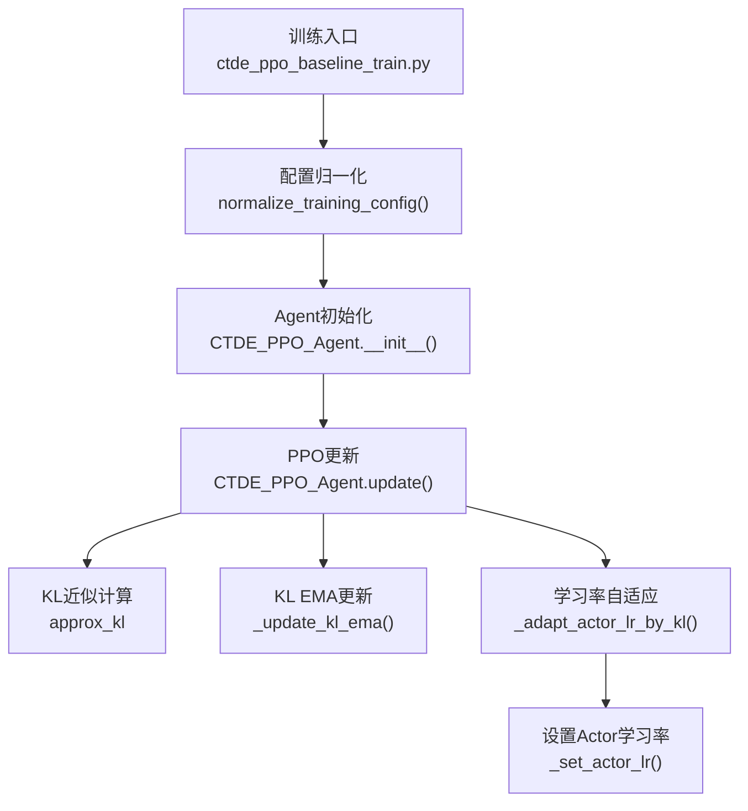
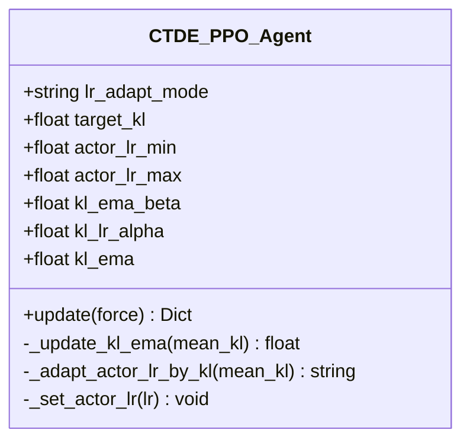
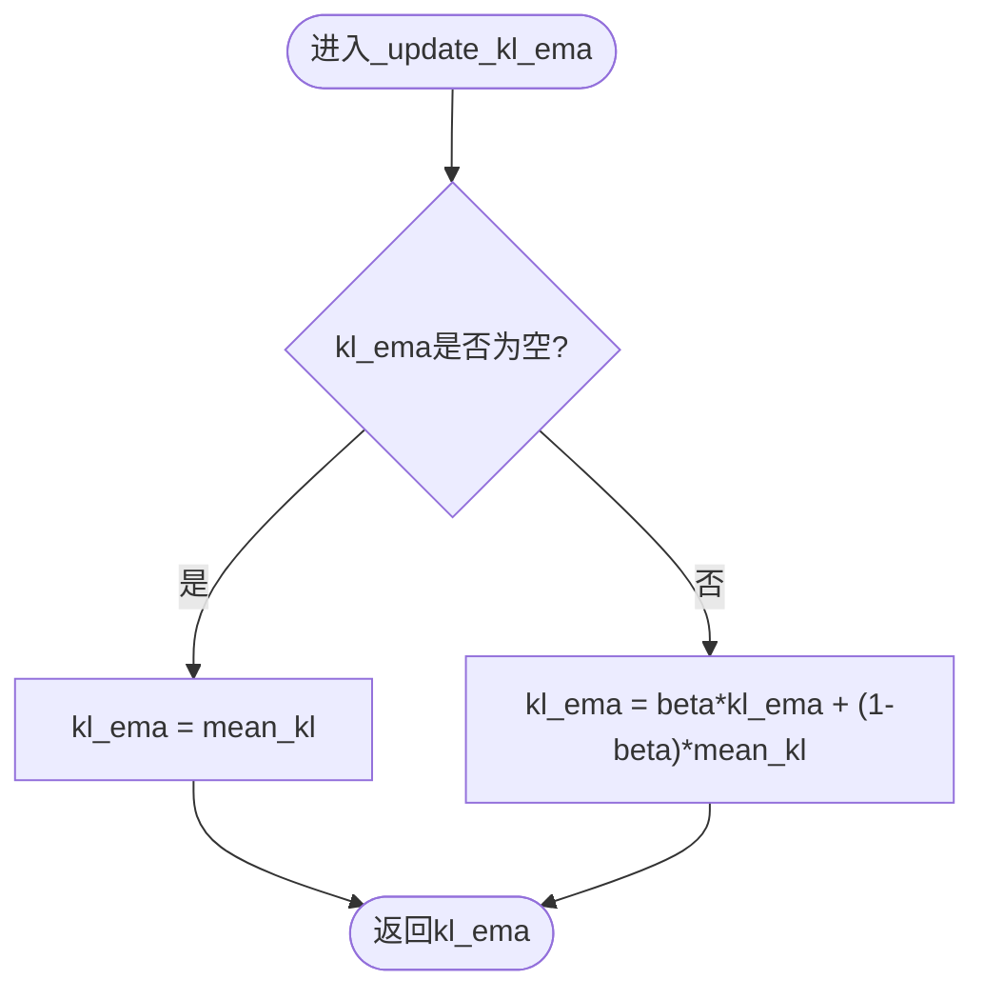
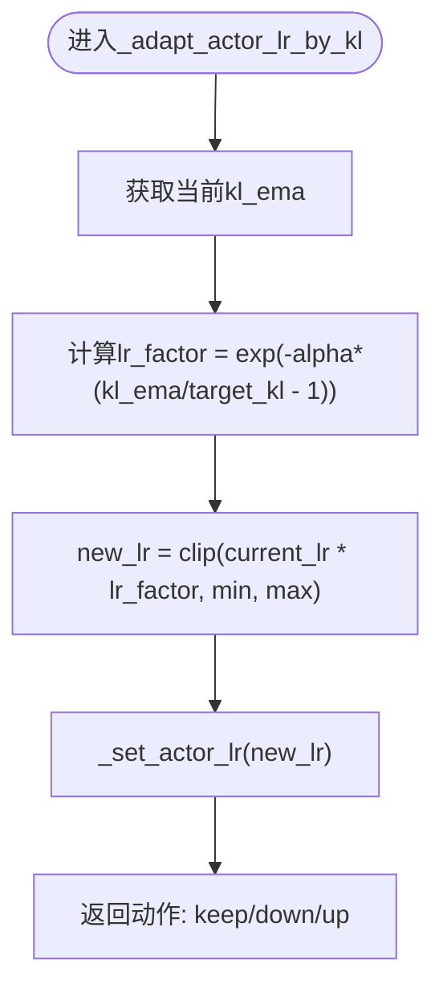
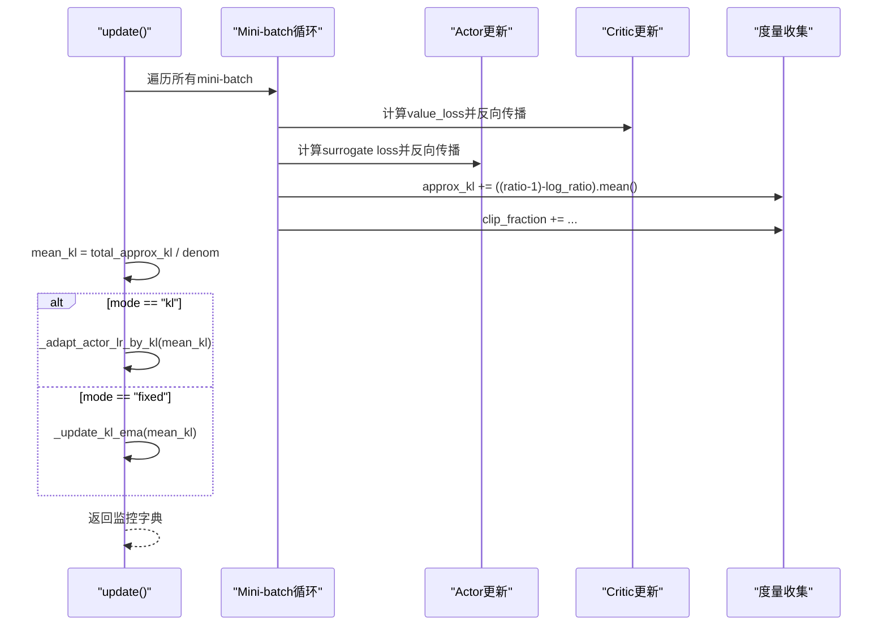
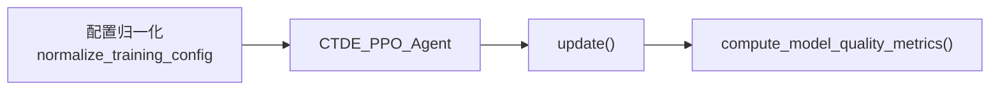

# 自适应学习率机制

<cite>
**本文引用的文件**   
- [ctde_ppo_baseline_train.py](file://environment_variables/environment_variables/ctde_ppo_baseline_train.py)
</cite>

## 目录
1. [引言](#引言)
2. [项目结构](#项目结构)
3. [核心组件](#核心组件)
4. [架构总览](#架构总览)
5. [详细组件分析](#详细组件分析)
6. [依赖关系分析](#依赖关系分析)
7. [性能与稳定性考量](#性能与稳定性考量)
8. [故障排查指南](#故障排查指南)
9. [结论](#结论)
10. [附录：配置与调参指南](#附录配置与调参指南)

## 引言
本文件围绕“基于KL散度的动态学习率调整”机制，系统梳理固定学习率与KL自适应两种模式在实现上的差异，解释KL近似值计算、指数移动平均（EMA）更新、学习率上下界约束与自适应步长控制。重点说明以下参数的作用与影响：
- target_kl：目标KL阈值，用于衡量策略更新的“步幅”是否过大或过小
- kl_ema_beta：KL的平滑系数，控制历史KL对当前估计的影响程度
- kl_lr_alpha：KL到学习率的映射强度，决定偏离目标时学习率变化的幅度
同时阐述训练过程中学习率的动态变化策略（衰减与恢复），并提供可操作的配置示例与调参建议，帮助根据训练稳定性选择合适的自适应模式。

## 项目结构
本项目将CTDE-PPO基线训练脚本与自适应学习率逻辑集中在同一文件中。关键位置如下：
- 默认配置与参数归一化：包含lr_adapt_mode、target_kl、kl_ema_beta、kl_lr_alpha等
- CTDE_PPO_Agent类：封装PPO更新、KL统计、EMA更新与学习率自适应
- 训练主循环：按模式调用自适应逻辑并记录指标



图表来源
- [ctde_ppo_baseline_train.py:161-281](file://environment_variables/environment_variables/ctde_ppo_baseline_train.py#L161-L281)
- [ctde_ppo_baseline_train.py:759-847](file://environment_variables/environment_variables/ctde_ppo_baseline_train.py#L759-L847)
- [ctde_ppo_baseline_train.py:889-991](file://environment_variables/environment_variables/ctde_ppo_baseline_train.py#L889-L991)

章节来源
- [ctde_ppo_baseline_train.py:98-158](file://environment_variables/environment_variables/ctde_ppo_baseline_train.py#L98-L158)
- [ctde_ppo_baseline_train.py:161-281](file://environment_variables/environment_variables/ctde_ppo_baseline_train.py#L161-L281)

## 核心组件
- 配置与校验
  - lr_adapt_mode：支持"fixed"与"kl"两种模式
  - target_kl：目标KL阈值，限制最小正值
  - actor_lr_min / actor_lr_max：学习率上下界
  - kl_ema_beta：EMA平滑系数，裁剪至[0, 0.999]
  - kl_lr_alpha：自适应强度，非负
- Agent内部状态
  - kl_ema：当前KL的指数移动平均估计
  - actor_optimizer.param_groups[0]["lr"]：当前Actor学习率
- PPO更新流程
  - 计算近似KL：基于新旧策略比率与log比率的二阶展开近似
  - 根据模式决定是否通过KL驱动学习率更新
  - 记录并返回监控指标（approx_kl、kl_ema、actor_lr等）

章节来源
- [ctde_ppo_baseline_train.py:116-121](file://environment_variables/environment_variables/ctde_ppo_baseline_train.py#L116-L121)
- [ctde_ppo_baseline_train.py:232-239](file://environment_variables/environment_variables/ctde_ppo_baseline_train.py#L232-L239)
- [ctde_ppo_baseline_train.py:759-847](file://environment_variables/environment_variables/ctde_ppo_baseline_train.py#L759-L847)
- [ctde_ppo_baseline_train.py:889-991](file://environment_variables/environment_variables/ctde_ppo_baseline_train.py#L889-L991)

## 架构总览
下图展示KL自适应学习率在PPO更新中的集成点与控制流。

```mermaid
sequenceDiagram
participant Train as "训练循环"
participant Agent as "CTDE_PPO_Agent"
participant KL as "KL近似计算"
participant EMA as "KL EMA更新"
participant LR as "学习率自适应"
participant Opt as "优化器"
Train->>Agent : update(force=False)
Agent->>Agent : 采样/前向/计算GAE
Agent->>Opt : 更新Critic
Agent->>Opt : 更新Actor
Agent->>KL : 计算approx_kl(比率与log比率)
Agent->>EMA : _update_kl_ema(mean_kl)
alt lr_adapt_mode == "kl"
Agent->>LR : _adapt_actor_lr_by_kl(mean_kl)
LR->>LR : 计算lr_factor = exp(-alpha*(kl_ema/target_kl - 1))
LR->>Opt : _set_actor_lr(clip(new_lr, min,max))
else lr_adapt_mode == "fixed"
Agent-->>Train : 仅更新EMA，不改变学习率
end
Agent-->>Train : 返回监控指标(approx_kl, kl_ema, actor_lr, ...)
```

图表来源
- [ctde_ppo_baseline_train.py:889-991](file://environment_variables/environment_variables/ctde_ppo_baseline_train.py#L889-L991)
- [ctde_ppo_baseline_train.py:828-847](file://environment_variables/environment_variables/ctde_ppo_baseline_train.py#L828-L847)

## 详细组件分析

### 组件A：KL自适应学习率控制器
该控制器负责将KL误差信号转换为学习率缩放因子，并通过上下界约束保证数值稳定。



图表来源
- [ctde_ppo_baseline_train.py:759-847](file://environment_variables/environment_variables/ctde_ppo_baseline_train.py#L759-L847)

#### 算法要点
- KL近似计算
  - 使用比率ratio与log_ratio的二阶近似：((ratio - 1) - log_ratio)的均值作为近似KL
  - 该近似在ratio接近1时具有良好的局部性质，适合小步长策略更新
- EMA更新
  - 首次以当前mean_kl初始化；后续按beta加权融合历史估计
  - beta越大，越平滑但响应越慢；beta越小，越敏感但噪声更大
- 学习率缩放
  - 缩放因子为exp(-alpha * (kl_ema / target_kl - 1))
  - 当kl_ema > target_kl时，因子小于1，学习率下降；反之则上升
  - 最终通过min/max边界裁剪，避免极端值
- 模式差异
  - fixed：仅维护KL EMA，不改变actor学习率
  - kl：依据KL误差动态调整actor学习率



图表来源
- [ctde_ppo_baseline_train.py:828-834](file://environment_variables/environment_variables/ctde_ppo_baseline_train.py#L828-L834)



图表来源
- [ctde_ppo_baseline_train.py:835-847](file://environment_variables/environment_variables/ctde_ppo_baseline_train.py#L835-L847)

章节来源
- [ctde_ppo_baseline_train.py:828-847](file://environment_variables/environment_variables/ctde_ppo_baseline_train.py#L828-L847)
- [ctde_ppo_baseline_train.py:958-973](file://environment_variables/environment_variables/ctde_ppo_baseline_train.py#L958-L973)

### 组件B：PPO更新与KL统计
- 在每次mini-batch内计算actor损失与critic损失，并进行梯度裁剪与参数更新
- 同步计算approx_kl与clip_fraction，用于监控策略更新质量
- 在更新结束后，根据lr_adapt_mode选择是否进行KL自适应



图表来源
- [ctde_ppo_baseline_train.py:889-991](file://environment_variables/environment_variables/ctde_ppo_baseline_train.py#L889-L991)
- [ctde_ppo_baseline_train.py:958-973](file://environment_variables/environment_variables/ctde_ppo_baseline_train.py#L958-L973)

章节来源
- [ctde_ppo_baseline_train.py:889-991](file://environment_variables/environment_variables/ctde_ppo_baseline_train.py#L889-L991)

## 依赖关系分析
- 配置层
  - normalize_training_config负责合并默认配置、类型转换与范围裁剪
  - 确保lr_adapt_mode∈{fixed, kl}，target_kl≥1e-8，kl_ema_beta∈[0, 0.999]，kl_lr_alpha≥0
- 运行时层
  - CTDE_PPO_Agent在构造时保存上述参数，并在update中消费
- 监控层
  - compute_model_quality_metrics从training_log中提取approx_kl、clip_fraction、actor_lr序列，输出KL稳定性与学习率统计



图表来源
- [ctde_ppo_baseline_train.py:161-281](file://environment_variables/environment_variables/ctde_ppo_baseline_train.py#L161-L281)
- [ctde_ppo_baseline_train.py:358-433](file://environment_variables/environment_variables/ctde_ppo_baseline_train.py#L358-L433)

章节来源
- [ctde_ppo_baseline_train.py:161-281](file://environment_variables/environment_variables/ctde_ppo_baseline_train.py#L161-L281)
- [ctde_ppo_baseline_train.py:358-433](file://environment_variables/environment_variables/ctde_ppo_baseline_train.py#L358-L433)

## 性能与稳定性考量
- KL近似值的数值稳定性
  - ratio与log_ratio的差值在ratio≈1时更可靠；若出现较大波动，应降低kl_lr_alpha或增大batch_size以降低方差
- EMA平滑与响应速度
  - kl_ema_beta偏大：学习率变化更平滑，但对突发KL超调反应较慢
  - kl_ema_beta偏小：能更快响应，但可能放大噪声导致学习率震荡
- 学习率边界
  - actor_lr_min与actor_lr_max提供硬约束，防止过小的学习率导致停滞或过大的学习率导致发散
- 自适应步长控制
  - kl_lr_alpha控制“偏离目标KL时的惩罚强度”，过大易造成剧烈震荡，过小则调节迟缓
- 固定模式的优势
  - fixed模式保持学习率不变，便于对比实验与复现；同时仍记录KL EMA用于诊断

[本节为通用指导，无需具体代码引用]

## 故障排查指南
- 现象：KL超限率高（approx_kl远大于target_kl）
  - 检查kl_lr_alpha是否过大导致过度压缩学习率，或过小导致无法及时抑制
  - 适当提高kl_ema_beta以平滑噪声，或增大batch_size减少估计方差
  - 参考指标：kl_overshoot_rate、mean_abs_kl_error
- 现象：学习率长期处于下界
  - 可能由于KL持续高于目标，导致不断衰减；考虑放宽target_kl或减小kl_lr_alpha
  - 确认actor_lr_min是否过低导致收敛缓慢
- 现象：学习率频繁在上下界间切换
  - 可能是KL估计不稳定；提升kl_ema_beta或增大批大小
  - 检查clip_fraction是否过高，表明策略更新过于激进，可适当降低clip_epsilon
- 现象：固定模式与KL模式结果差异显著
  - 固定模式可作为基准；KL模式需结合任务难度与数据分布调参
  - 建议先以固定模式建立基线，再逐步引入KL自适应

章节来源
- [ctde_ppo_baseline_train.py:358-433](file://environment_variables/environment_variables/ctde_ppo_baseline_train.py#L358-L433)
- [ctde_ppo_baseline_train.py:828-847](file://environment_variables/environment_variables/ctde_ppo_baseline_train.py#L828-L847)

## 结论
KL自适应学习率机制通过“目标KL—实际KL误差—指数平滑—指数缩放—边界裁剪”的闭环，实现对策略更新步幅的动态控制。相比固定学习率，KL模式能在KL超调时自动收缩步长，在KL不足时适度扩张，从而提升训练稳定性与鲁棒性。合理设置target_kl、kl_ema_beta与kl_lr_alpha，并结合上下界约束，可在不同任务与数据分布上取得更稳健的训练效果。

[本节为总结性内容，无需具体代码引用]

## 附录：配置与调参指南

### 关键参数与作用
- lr_adapt_mode
  - fixed：固定学习率，仅记录KL EMA
  - kl：基于KL自适应调整actor学习率
- target_kl
  - 目标KL阈值，控制期望的策略更新幅度
  - 过小会导致学习率频繁下降，过大则难以抑制超调
- kl_ema_beta
  - EMA平滑系数，越大越平滑，越小越灵敏
- kl_lr_alpha
  - 自适应强度，越大对KL偏差越敏感，可能导致剧烈震荡
- actor_lr_min / actor_lr_max
  - 学习率上下界，保障数值稳定与收敛能力

### 推荐初始值与搜索范围
- 固定模式（baseline）
  - actor_lr=2e-4，critic_lr=5e-4，其他默认
- KL模式
  - target_kl ∈ [0.005, 0.02]
  - kl_ema_beta ∈ [0.85, 0.99]
  - kl_lr_alpha ∈ [0.05, 0.3]
  - actor_lr_min ≥ 1e-5，actor_lr_max ≤ 1e-3（视任务尺度调整）

### 配置示例（JSON片段）
- 固定学习率
  - lr_adapt_mode="fixed"
  - actor_lr=2e-4
  - actor_lr_min=2e-5，actor_lr_max=4e-4
- KL自适应
  - lr_adapt_mode="kl"
  - target_kl=0.01
  - kl_ema_beta=0.9
  - kl_lr_alpha=0.1
  - actor_lr_min=2e-5，actor_lr_max=4e-4

### 调参流程建议
- 第一步：以固定模式运行，观察KL均值与clip_fraction，评估策略更新是否稳定
- 第二步：开启KL模式，从小kl_lr_alpha开始，逐步增加直至KL均值接近target_kl且学习率不过度震荡
- 第三步：微调kl_ema_beta，平衡平滑性与响应速度
- 第四步：必要时调整target_kl，使KL均值落在目标附近，同时关注kl_overshoot_rate与actor_lr轨迹

章节来源
- [ctde_ppo_baseline_train.py:116-121](file://environment_variables/environment_variables/ctde_ppo_baseline_train.py#L116-L121)
- [ctde_ppo_baseline_train.py:232-239](file://environment_variables/environment_variables/ctde_ppo_baseline_train.py#L232-L239)
- [ctde_ppo_baseline_train.py:759-847](file://environment_variables/environment_variables/ctde_ppo_baseline_train.py#L759-L847)
- [ctde_ppo_baseline_train.py:889-991](file://environment_variables/environment_variables/ctde_ppo_baseline_train.py#L889-L991)