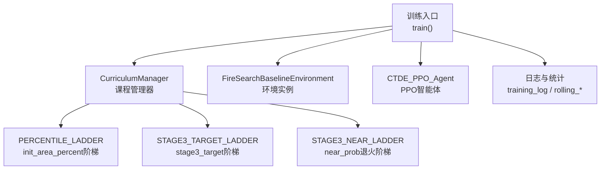
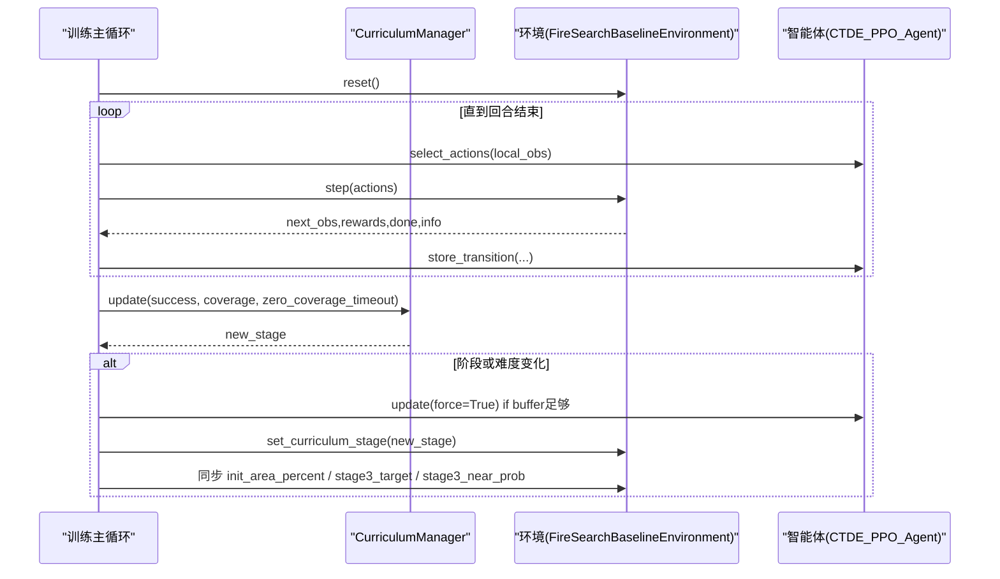
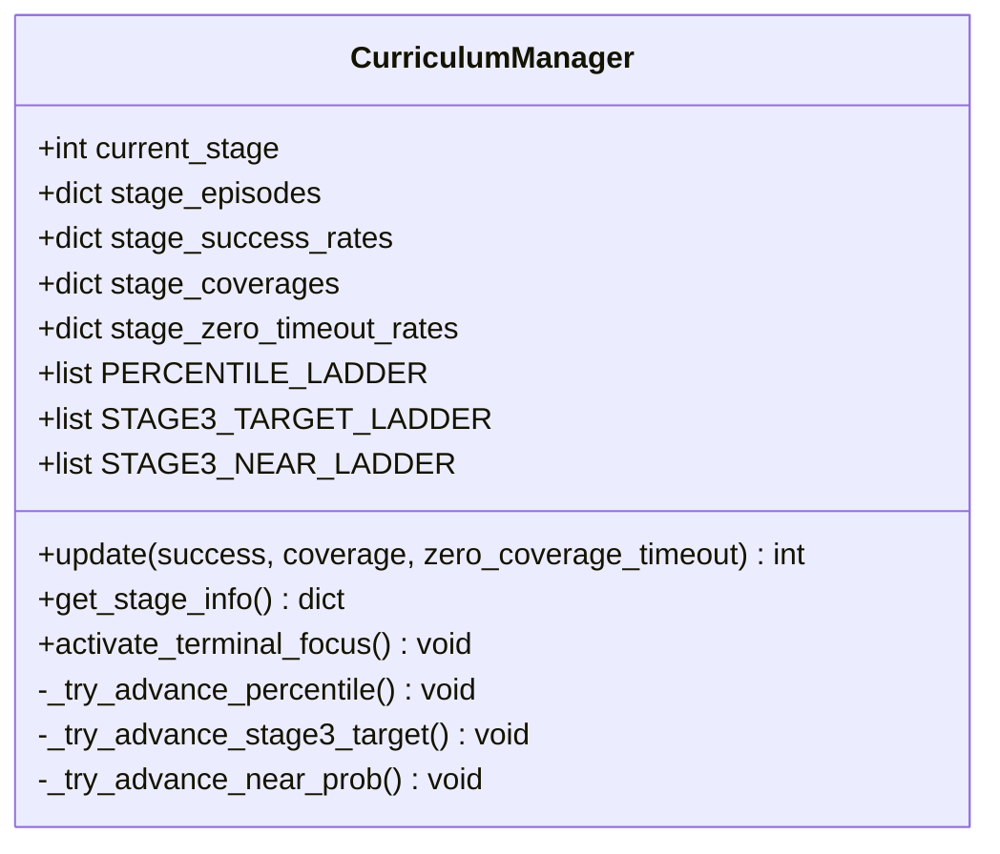
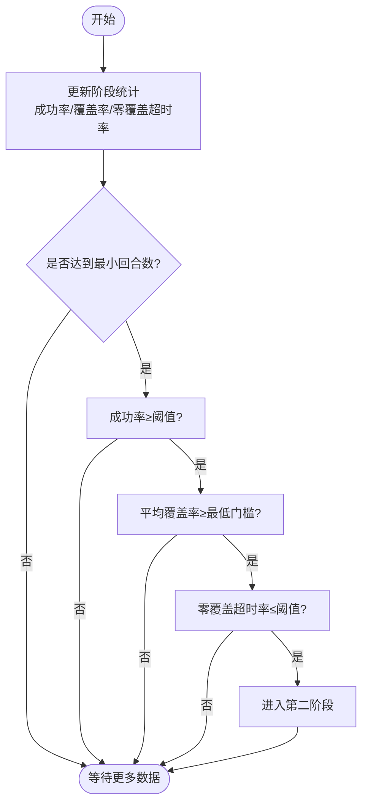
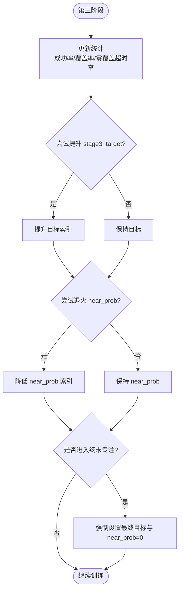
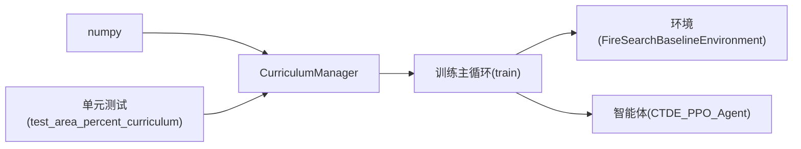

# 课程学习管理器

<cite>
**本文引用的文件**   
- [ctde_ppo_baseline_train.py](file://environment_variables/environment_variables/ctde_ppo_baseline_train.py)
- [test_area_percent_curriculum.py](file://environment_variables/environment_variables/test_area_percent_curriculum.py)
</cite>

## 目录
1. [简介](#简介)
2. [项目结构](#项目结构)
3. [核心组件](#核心组件)
4. [架构总览](#架构总览)
5. [详细组件分析](#详细组件分析)
6. [依赖关系分析](#依赖关系分析)
7. [性能与稳定性考量](#性能与稳定性考量)
8. [故障排查指南](#故障排查指南)
9. [结论](#结论)
10. [附录：使用示例与配置要点](#附录使用示例与配置要点)

## 简介
本文件围绕课程学习管理器 CurriculumManager 的三阶段渐进式学习框架进行深入解析，涵盖难度阶梯设计、能力评估机制与自动进阶逻辑。重点说明：
- 第一阶段（基础搜索）：以“初始起火面积百分比”为难度控制点，逐步提升训练起点难度。
- 第二阶段（复杂场景）：在覆盖率与成功率双指标约束下完成过渡。
- 第三阶段（高难度任务）：动态提升成功率目标并退火“近端生成概率”，最终收敛到严格评估条件。

同时给出关键阈值、最小回合数要求、强制进阶条件，并提供监控训练进度与调整难度的实践方法。

## 项目结构
与课程学习相关的核心实现位于训练脚本中，包含默认训练配置、课程管理器类以及训练主循环对课程参数的同步更新逻辑；单元测试覆盖课程调度行为验证。

图表来源
- [ctde_ppo_baseline_train.py:1278-1600](file://environment_variables/environment_variables/ctde_ppo_baseline_train.py#L1278-L1600)
- [ctde_ppo_baseline_train.py:568-758](file://environment_variables/environment_variables/ctde_ppo_baseline_train.py#L568-L758)

章节来源
- [ctde_ppo_baseline_train.py:98-158](file://environment_variables/environment_variables/ctde_ppo_baseline_train.py#L98-L158)
- [ctde_ppo_baseline_train.py:1278-1600](file://environment_variables/environment_variables/ctde_ppo_baseline_train.py#L1278-L1600)

## 核心组件
- CurriculumManager：维护当前阶段、各阶段统计窗口、难度阶梯与进阶判定逻辑，提供 get_stage_info 暴露监控指标。
- 训练主循环：每回合结束后调用 curriculum.update(success, coverage, zero_coverage_timeout)，并根据返回的新阶段与参数变化同步至环境。
- 单元测试：验证 stage3_target 与 near_prob 的演进路径及边界条件。

章节来源
- [ctde_ppo_baseline_train.py:568-758](file://environment_variables/environment_variables/ctde_ppo_baseline_train.py#L568-L758)
- [ctde_ppo_baseline_train.py:1554-1586](file://environment_variables/environment_variables/ctde_ppo_baseline_train.py#L1554-L1586)
- [test_area_percent_curriculum.py:130-169](file://environment_variables/environment_variables/test_area_percent_curriculum.py#L130-L169)

## 架构总览
下图展示训练主循环与课程管理器的交互流程，包括阶段切换、难度参数同步与模型更新的触发时机。

图表来源
- [ctde_ppo_baseline_train.py:1469-1600](file://environment_variables/environment_variables/ctde_ppo_baseline_train.py#L1469-L1600)
- [ctde_ppo_baseline_train.py:568-758](file://environment_variables/environment_variables/ctde_ppo_baseline_train.py#L568-L758)

## 详细组件分析

### CurriculumManager 类结构与职责
- 状态与窗口
  - 当前阶段 current_stage ∈ {1,2,3}
  - 各阶段滑动窗口：成功率、平均覆盖率、零覆盖超时率、回合计数
- 难度阶梯
  - PERCENTILE_LADDER：控制第一阶段 init_area_percent 的百分比阶梯
  - STAGE3_TARGET_LADDER：第三阶段成功率目标阶梯
  - STAGE3_NEAR_LADDER：第三阶段 near_prob 退火阶梯
- 进阶与退火
  - 阶段进阶：基于成功率、覆盖率、零覆盖超时率与回合数门槛
  - 百分比进阶：第一阶段内按成功率与最小回合数推进 init_area_percent
  - 目标提升：第三阶段在满足覆盖率、成功率与零覆盖超时率后提升 stage3_target
  - 退火策略：第三阶段在满足能力门限且不超过 target 进度时降低 near_prob

图表来源
- [ctde_ppo_baseline_train.py:568-758](file://environment_variables/environment_variables/ctde_ppo_baseline_train.py#L568-L758)

章节来源
- [ctde_ppo_baseline_train.py:568-758](file://environment_variables/environment_variables/ctde_ppo_baseline_train.py#L568-L758)

### 第一阶段（基础搜索）：难度阶梯与转换条件
- 训练目标
  - 在较低难度（较小初始起火面积百分比）下建立基础搜索能力，关注覆盖率与成功率稳步提升。
- 难度控制
  - init_area_percent 由 PERCENTILE_LADDER 驱动，从低到高逐步提升。
- 转换条件（进入第二阶段）
  - 成功率达到阈值
  - 平均覆盖率超过最低门槛
  - 零覆盖超时率低于阈值
  - 回合数达到最小要求
  - 若回合数达到最大限制且满足覆盖率与零覆盖超时率，则强制进阶
- 百分比进阶（第一阶段内部）
  - 当累计回合数达到最小值且成功率达到阈值，将 init_area_percent 提升至下一阶梯

图表来源
- [ctde_ppo_baseline_train.py:621-670](file://environment_variables/environment_variables/ctde_ppo_baseline_train.py#L621-L670)
- [ctde_ppo_baseline_train.py:672-683](file://environment_variables/environment_variables/ctde_ppo_baseline_train.py#L672-L683)

章节来源
- [ctde_ppo_baseline_train.py:621-670](file://environment_variables/environment_variables/ctde_ppo_baseline_train.py#L621-L670)
- [ctde_ppo_baseline_train.py:672-683](file://environment_variables/environment_variables/ctde_ppo_baseline_train.py#L672-L683)

### 第二阶段（复杂场景）：过渡与稳定
- 训练目标
  - 在更复杂的场景中巩固搜索与边界覆盖能力，提高鲁棒性。
- 转换条件（进入第三阶段）
  - 成功率达到更高阈值
  - 平均覆盖率继续提升
  - 零覆盖超时率进一步降低
  - 回合数达到最小要求
- 注意
  - 第二阶段无百分比阶梯推进，主要关注能力达标与稳定性。

章节来源
- [ctde_ppo_baseline_train.py:621-670](file://environment_variables/environment_variables/ctde_ppo_baseline_train.py#L621-L670)

### 第三阶段（高难度任务）：目标提升与 near_prob 退火
- 训练目标
  - 在高难度条件下持续提升成功率，逼近最终目标；同时通过 near_prob 退火减少“近端生成”的捷径依赖，强化真实探索能力。
- 目标提升（stage3_target）
  - 当满足以下门限时，提升下一阶段目标：
    - 回合数达到该级最小要求
    - 平均覆盖率 ≥ 当前目标 × 系数
    - 成功率 ≥ 固定阈值
    - 零覆盖超时率 ≤ 固定阈值
- near_prob 退火（方案C）
  - 仅在满足能力门限（成功率、零覆盖超时率、覆盖率）且不超过 target 进度时，才允许降低 near_prob
  - 每级有最小回合数要求，避免过早退火
- 终末专注（Terminal Focus）
  - 在最后若干回合强制切换到最终目标与 near_prob=0，确保评估条件一致

图表来源
- [ctde_ppo_baseline_train.py:684-738](file://environment_variables/environment_variables/ctde_ppo_baseline_train.py#L684-L738)
- [ctde_ppo_baseline_train.py:753-757](file://environment_variables/environment_variables/ctde_ppo_baseline_train.py#L753-L757)

章节来源
- [ctde_ppo_baseline_train.py:684-738](file://environment_variables/environment_variables/ctde_ppo_baseline_train.py#L684-L738)
- [ctde_ppo_baseline_train.py:753-757](file://environment_variables/environment_variables/ctde_ppo_baseline_train.py#L753-L757)

### 关键阈值与配置项
- 第一阶段
  - 成功率阈值、覆盖率最低门槛、零覆盖超时率阈值、最小/最大回合数
  - 百分比进阶：最小回合数与成功率阈值
- 第二阶段
  - 更高的成功率阈值、覆盖率门槛与零覆盖超时率阈值、最小回合数
- 第三阶段
  - 目标阶梯：从较低目标逐步提升到最终目标
  - near_prob 阶梯：从高到低退火，受能力门限与目标进度约束
  - 每级最小回合数：防止过早退火
  - 终末专注：最后若干回合强制最终目标与 near_prob=0

章节来源
- [ctde_ppo_baseline_train.py:568-758](file://environment_variables/environment_variables/ctde_ppo_baseline_train.py#L568-L758)
- [ctde_ppo_baseline_train.py:1470-1486](file://environment_variables/environment_variables/ctde_ppo_baseline_train.py#L1470-L1486)

### 训练主循环中的课程同步
- 每回合结束后：
  - 调用 curriculum.update(success, info["boundary_coverage"], zero_coverage_timeout)
  - 获取 next_area_percent、next_stage3_target、next_stage3_near_prob
  - 若阶段或难度发生变化：
    - 若缓冲区足够，立即执行一次强制更新
    - 否则清空缓冲区
  - 同步环境参数：
    - env.init_area_percent = next_area_percent
    - env.stage_targets[3] = next_stage3_target
    - env.stage3_near_prob = next_stage3_near_prob
    - env.set_curriculum_stage(new_stage)

章节来源
- [ctde_ppo_baseline_train.py:1554-1586](file://environment_variables/environment_variables/ctde_ppo_baseline_train.py#L1554-L1586)

## 依赖关系分析
- CurriculumManager 依赖 numpy 进行均值计算与数值处理
- 训练主循环依赖 CurriculumManager 输出以驱动环境参数与模型更新
- 单元测试直接导入 CurriculumManager 验证其调度行为

图表来源
- [ctde_ppo_baseline_train.py:568-758](file://environment_variables/environment_variables/ctde_ppo_baseline_train.py#L568-L758)
- [ctde_ppo_baseline_train.py:1278-1600](file://environment_variables/environment_variables/ctde_ppo_baseline_train.py#L1278-L1600)
- [test_area_percent_curriculum.py:1-169](file://environment_variables/environment_variables/test_area_percent_curriculum.py#L1-L169)

章节来源
- [ctde_ppo_baseline_train.py:568-758](file://environment_variables/environment_variables/ctde_ppo_baseline_train.py#L568-L758)
- [ctde_ppo_baseline_train.py:1278-1600](file://environment_variables/environment_variables/ctde_ppo_baseline_train.py#L1278-L1600)
- [test_area_percent_curriculum.py:1-169](file://environment_variables/environment_variables/test_area_percent_curriculum.py#L1-L169)

## 性能与稳定性考量
- 缓冲更新策略：当课程难度或阶段变化时，若缓冲区大小不足，会清空以避免污染新难度下的梯度估计
- KL 自适应与裁剪：训练过程中记录 approx_kl、clip_fraction 等指标，有助于判断策略更新稳定性
- 滚动统计：使用定长队列跟踪奖励、长度、覆盖率、成功率、超时率等，便于实时监控与诊断
- 终末专注：在最后若干回合强制最终目标与 near_prob=0，保证评估一致性

章节来源
- [ctde_ppo_baseline_train.py:1567-1586](file://environment_variables/environment_variables/ctde_ppo_baseline_train.py#L1567-L1586)
- [ctde_ppo_baseline_train.py:1470-1486](file://environment_variables/environment_variables/ctde_ppo_baseline_train.py#L1470-L1486)

## 故障排查指南
- 阶段不进阶
  - 检查成功率、覆盖率、零覆盖超时率是否达到对应阈值
  - 确认回合数是否达到最小要求
  - 查看打印日志中的“课程阶段 X -> Y”提示
- 百分比未提升
  - 确认第一阶段成功率是否达到百分比进阶阈值
  - 检查最小回合数是否满足
- 第三阶段目标未提升
  - 检查覆盖率是否达到当前目标的系数倍
  - 检查成功率与零覆盖超时率是否满足门限
- near_prob 未退火
  - 确认能力门限是否满足
  - 确认 near_prob 索引未超前于 target 索引
- 终端专注未生效
  - 确认剩余回合数是否小于等于 TERMINAL_FOCUS_EPISODES
  - 检查是否已激活 _terminal_focus_active

章节来源
- [ctde_ppo_baseline_train.py:621-738](file://environment_variables/environment_variables/ctde_ppo_baseline_train.py#L621-L738)
- [ctde_ppo_baseline_train.py:1470-1486](file://environment_variables/environment_variables/ctde_ppo_baseline_train.py#L1470-L1486)

## 结论
CurriculumManager 通过三阶段渐进式学习框架，结合难度阶梯、能力评估与自动进阶逻辑，实现了从基础搜索到高难度任务的平滑过渡。第一阶段通过 init_area_percent 的百分比阶梯逐步增加难度；第二阶段强调稳定性与鲁棒性；第三阶段通过提升 stage3_target 与退火 near_prob，最终在终末专注下收敛到严格评估条件。配合训练主循环的参数同步与模型更新策略，整体流程兼顾了学习效率与评估一致性。

## 附录：使用示例与配置要点

- 初始化课程管理器与环境
  - 使用 final_init_area_percent 与 stage3_final_target 构造 CurriculumManager
  - 将 curriculum.current_init_percentile、curriculum.current_stage3_target、curriculum.stage3_near_prob 传入环境初始化
  - 参考路径：[ctde_ppo_baseline_train.py:1334-1354](file://environment_variables/environment_variables/ctde_ppo_baseline_train.py#L1334-L1354)

- 每回合更新与同步
  - 调用 curriculum.update(success, info["boundary_coverage"], zero_coverage_timeout)
  - 根据返回值与难度变化同步 env.init_area_percent、env.stage_targets[3]、env.stage3_near_prob、env.curriculum_stage
  - 参考路径：[ctde_ppo_baseline_train.py:1554-1586](file://environment_variables/environment_variables/ctde_ppo_baseline_train.py#L1554-L1586)

- 监控训练进度
  - 使用 curriculum.get_stage_info() 获取当前阶段、回合数、成功率、init_area_percent、stage3_target、stage3_near_prob 等
  - 参考路径：[ctde_ppo_baseline_train.py:740-751](file://environment_variables/environment_variables/ctde_ppo_baseline_train.py#L740-L751)

- 单元测试验证
  - 验证 stage3_target 与 near_prob 的演进路径与边界条件
  - 参考路径：[test_area_percent_curriculum.py:130-169](file://environment_variables/environment_variables/test_area_percent_curriculum.py#L130-L169)

章节来源
- [ctde_ppo_baseline_train.py:1334-1354](file://environment_variables/environment_variables/ctde_ppo_baseline_train.py#L1334-L1354)
- [ctde_ppo_baseline_train.py:1554-1586](file://environment_variables/environment_variables/ctde_ppo_baseline_train.py#L1554-L1586)
- [ctde_ppo_baseline_train.py:740-751](file://environment_variables/environment_variables/ctde_ppo_baseline_train.py#L740-L751)
- [test_area_percent_curriculum.py:130-169](file://environment_variables/environment_variables/test_area_percent_curriculum.py#L130-L169)