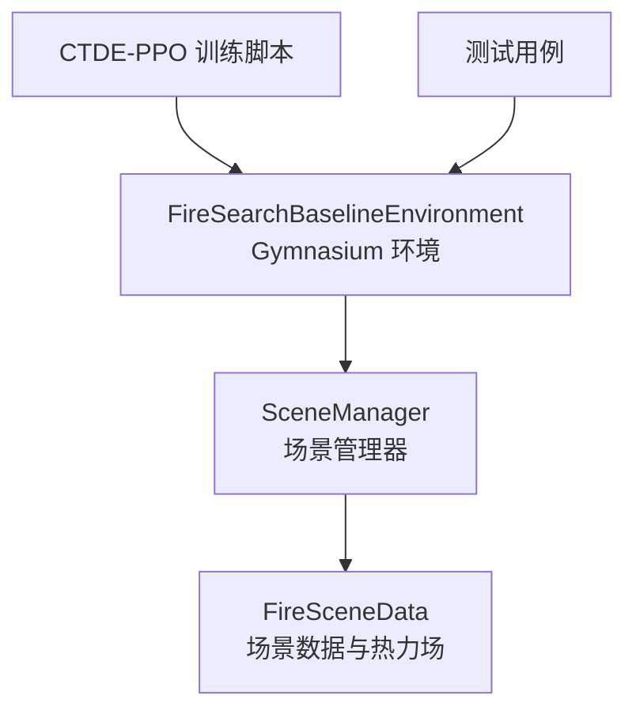
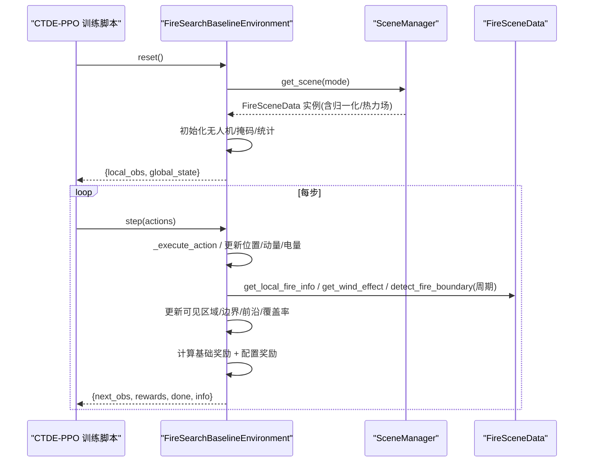
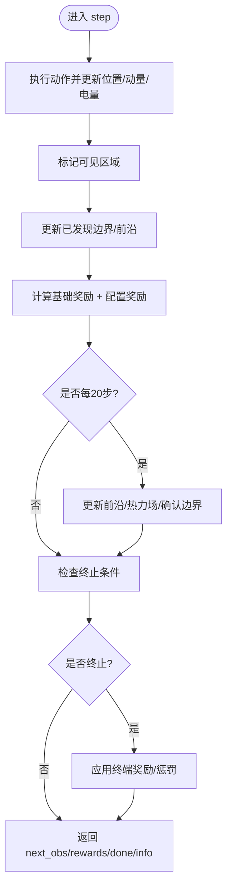
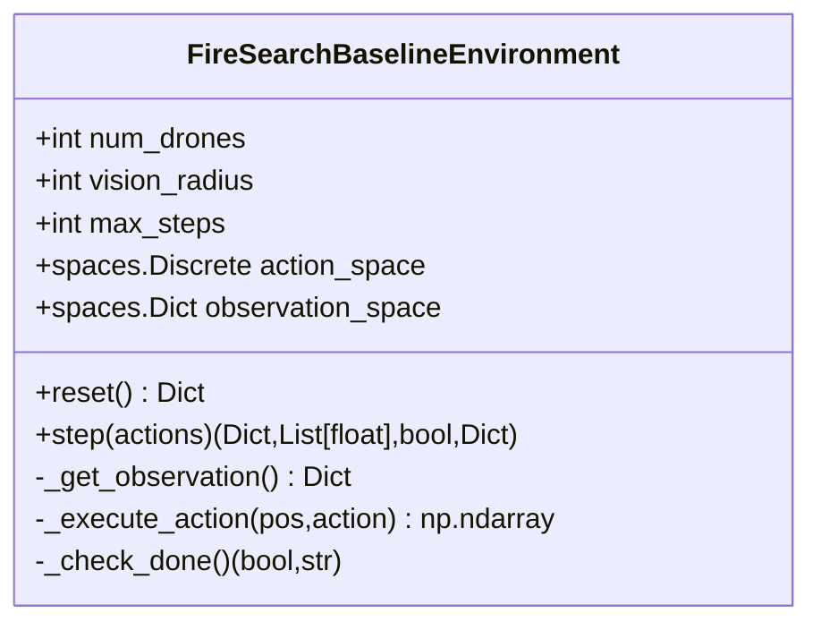
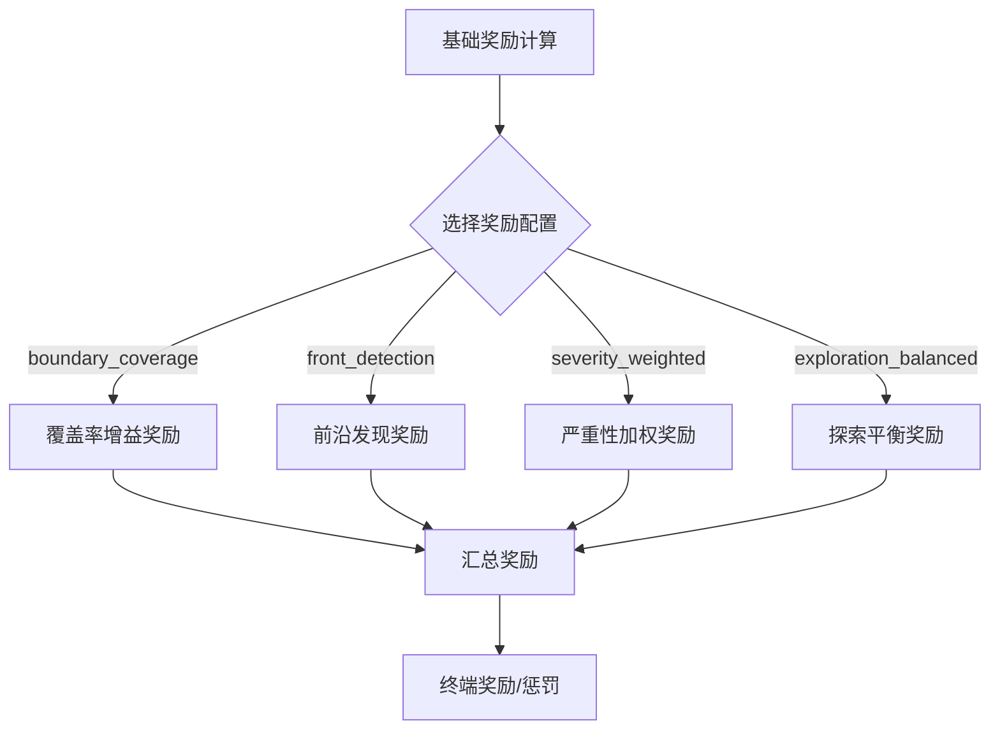
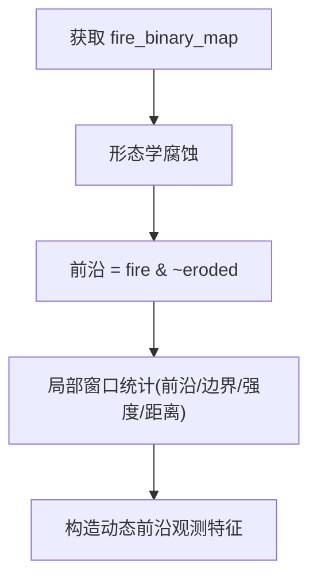
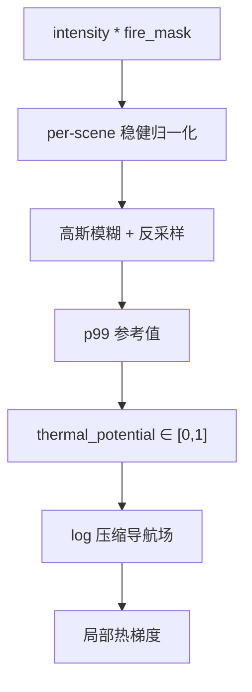
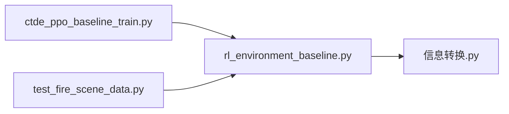

# 环境系统架构

<cite>
**本文引用的文件**   
- [rl_environment_baseline.py](file://environment_variables/environment_variables/rl_environment_baseline.py)
- [信息转换.py](file://environment_variables/environment_variables/信息转换.py)
- [ctde_ppo_baseline_train.py](file://environment_variables/environment_variables/ctde_ppo_baseline_train.py)
- [test_fire_scene_data.py](file://environment_variables/environment_variables/test_fire_scene_data.py)
</cite>

## 目录
1. [简介](#简介)
2. [项目结构](#项目结构)
3. [核心组件](#核心组件)
4. [架构总览](#架构总览)
5. [详细组件分析](#详细组件分析)
6. [依赖关系分析](#依赖关系分析)
7. [性能考量](#性能考量)
8. [故障排查指南](#故障排查指南)
9. [结论](#结论)
10. [附录](#附录)

## 简介
本文件面向 FireSearchBaselineEnvironment 环境系统的架构与实现，围绕 Gymnasium 标准化接口、多无人机状态管理、观测空间（17维局部观测+19维全局状态）、动作空间（5个离散方向）进行系统化说明。文档还覆盖奖励函数计算机制、边界覆盖率评估、前沿检测算法、严重性加权策略、传感器观测模型、热场交互机制、碰撞检测逻辑、环境初始化参数、状态转换规则与终止条件，并提供使用示例与自定义扩展指南。

## 项目结构
- 环境与数据层分离：
  - 环境类 FireSearchBaselineEnvironment 提供 Gymnasium 标准接口 reset()/step()，封装多智能体状态、观测、奖励与终止判定。
  - 场景与数据加载由 SceneManager/FireSceneData 负责，包含栅格数据读取、归一化、火场前沿与热力场构建、风场与地形特征等。
- 训练脚本 ctde_ppo_baseline_train.py 仅保留 CTDE-PPO 算法与任务训练循环，通过 importlib 动态导入“信息转换”模块以访问数据层。

**图表来源** 
- [rl_environment_baseline.py:1-120](file://environment_variables/environment_variables/rl_environment_baseline.py#L1-L120)
- [信息转换.py:1282-1326](file://environment_variables/environment_variables/信息转换.py#L1282-L1326)
- [ctde_ppo_baseline_train.py:30-36](file://environment_variables/environment_variables/ctde_ppo_baseline_train.py#L30-L36)

**章节来源**
- [rl_environment_baseline.py:1-120](file://environment_variables/environment_variables/rl_environment_baseline.py#L1-L120)
- [信息转换.py:1282-1326](file://environment_variables/environment_variables/信息转换.py#L1282-L1326)
- [ctde_ppo_baseline_train.py:30-36](file://environment_variables/environment_variables/ctde_ppo_baseline_train.py#L30-L36)

## 核心组件
- FireSearchBaselineEnvironment
  - 继承 gym.Env，实现 reset()/step() 标准接口。
  - 维护多无人机位置、电量、动量、已访问区域掩码、已发现边界/前沿集合等。
  - 支持多种观测配置（baseline/static_terrain/dynamic_front/risk_aware）与奖励配置（boundary_coverage/front_detection/severity_weighted/exploration_balanced）。
- 数据与场景层（信息转换.py）
  - DatasetIndex/SceneManager：按 split 选择场景并缓存实例。
  - FireSceneData：加载静态地图、核心栅格、风场；推导归一化参数；构建热力场与导航场；检测火场前沿；计算严重性图；提供局部视野聚合与梯度。
- 训练脚本（ctde_ppo_baseline_train.py）
  - 仅保留 CTDE-PPO 算法与训练循环，通过 importlib 动态导入“信息转换”模块。

**章节来源**
- [rl_environment_baseline.py:21-158](file://environment_variables/environment_variables/rl_environment_baseline.py#L21-L158)
- [信息转换.py:219-322](file://environment_variables/environment_variables/信息转换.py#L219-L322)
- [ctde_ppo_baseline_train.py:30-36](file://environment_variables/environment_variables/ctde_ppo_baseline_train.py#L30-L36)

## 架构总览
下图展示环境、数据与训练脚本之间的调用关系与数据流。

**图表来源** 
- [rl_environment_baseline.py:331-360](file://environment_variables/environment_variables/rl_environment_baseline.py#L331-L360)
- [rl_environment_baseline.py:842-992](file://environment_variables/environment_variables/rl_environment_baseline.py#L842-L992)
- [信息转换.py:1282-1326](file://environment_variables/environment_variables/信息转换.py#L1282-L1326)
- [信息转换.py:821-887](file://environment_variables/environment_variables/信息转换.py#L821-L887)

## 详细组件分析

### Gymnasium 接口：reset() 与 step()
- reset()
  - 加载新场景，重置步数、掩码、集合与统计。
  - 为每架无人机随机生成初始位置（近/远两种模式），初始化电量与动量。
  - 返回当前观测字典。
- step(actions)
  - 对每个无人机执行动作，更新位置、动量与电量（考虑风阻影响）。
  - 标记可见区域、更新已发现边界与前沿、计算覆盖率。
  - 组合基础奖励与配置奖励，记录分解项。
  - 周期性更新火场前沿与热力场，刷新确认边界状态。
  - 判定终止条件并返回 next_obs、rewards、done、info。

**图表来源** 
- [rl_environment_baseline.py:842-992](file://environment_variables/environment_variables/rl_environment_baseline.py#L842-L992)

**章节来源**
- [rl_environment_baseline.py:331-360](file://environment_variables/environment_variables/rl_environment_baseline.py#L331-L360)
- [rl_environment_baseline.py:842-992](file://environment_variables/environment_variables/rl_environment_baseline.py#L842-L992)

### 多无人机状态管理与观测空间
- 状态管理
  - 位置、电量、动量、最近移动历史、已访问单元格集合、已发现边界/前沿集合、确认边界掩码、覆盖率梯度、首次探测到热信号/边界的步数等。
- 观测空间
  - 局部观测（每机）：维度随 observation_profile 变化，默认 baseline 为 17 维，包括位置、电量、强度/DEM/坡度/风场、热梯度、相机方向等。
  - 全局状态：19 维，包括覆盖率、平均/最小电量、队形中心与散布、距火距离、步长进度、已访问密度、课程阶段、平均风速/高程、低电量标志、无人机数量、覆盖率梯度、未探索密度等。
- 动作空间
  - 5 个离散动作：上/下/左/右/静止，带网格边界裁剪。

**图表来源** 
- [rl_environment_baseline.py:21-158](file://environment_variables/environment_variables/rl_environment_baseline.py#L21-L158)
- [rl_environment_baseline.py:565-658](file://environment_variables/environment_variables/rl_environment_baseline.py#L565-L658)
- [rl_environment_baseline.py:660-669](file://environment_variables/environment_variables/rl_environment_baseline.py#L660-L669)

**章节来源**
- [rl_environment_baseline.py:21-158](file://environment_variables/environment_variables/rl_environment_baseline.py#L21-L158)
- [rl_environment_baseline.py:565-658](file://environment_variables/environment_variables/rl_environment_baseline.py#L565-L658)
- [rl_environment_baseline.py:660-669](file://environment_variables/environment_variables/rl_environment_baseline.py#L660-L669)
- [test_fire_scene_data.py:133-157](file://environment_variables/environment_variables/test_fire_scene_data.py#L133-L157)

### 奖励函数与配置
- 基础奖励
  - 边界发现奖励（随课程阶段递减）、步数惩罚、重复区域惩罚、空闲惩罚、同伴接近惩罚、预边界搜索引导（基于热势增量）。
- 配置奖励
  - boundary_coverage：按新发现边界点比例给予覆盖率增益奖励。
  - front_detection：按新发现前沿点比例给予前沿奖励。
  - severity_weighted：基于新可见区域的严重性均值/最大值加权。
  - exploration_balanced：基于新可见面积占比的探索奖励，并对重复访问施加小惩罚。
- 终端奖励/惩罚
  - 完成任务：根据效率给予终端奖励。
  - 超时：根据覆盖率缺口给予惩罚，零覆盖率额外加重。
  - 电量耗尽：固定惩罚。

**图表来源** 
- [rl_environment_baseline.py:692-806](file://environment_variables/environment_variables/rl_environment_baseline.py#L692-L806)
- [rl_environment_baseline.py:948-962](file://environment_variables/environment_variables/rl_environment_baseline.py#L948-L962)

**章节来源**
- [rl_environment_baseline.py:692-806](file://environment_variables/environment_variables/rl_environment_baseline.py#L692-L806)
- [rl_environment_baseline.py:948-962](file://environment_variables/environment_variables/rl_environment_baseline.py#L948-L962)

### 边界覆盖率评估
- 覆盖率定义：在当前 t=0 或动态更新的边界点集中，已发现边界点的比例。
- 更新机制：每步根据无人机视野圆形窗口内可见边界点进行去重计数；每20步重新检测前沿并刷新边界集与热力场。
- 目标阈值：课程阶段2/3分别设定不同覆盖率目标，达到即提前终止。

**章节来源**
- [rl_environment_baseline.py:253-257](file://environment_variables/environment_variables/rl_environment_baseline.py#L253-L257)
- [rl_environment_baseline.py:808-822](file://environment_variables/environment_variables/rl_environment_baseline.py#L808-L822)
- [rl_environment_baseline.py:927-941](file://environment_variables/environment_variables/rl_environment_baseline.py#L927-L941)

### 前沿检测算法
- 二值前沿图：基于 fire_binary_map 的形态学腐蚀操作得到活跃前沿（fire & ~eroded）。
- 局部前沿统计：在视野窗口内统计前沿像素比例、边界点密度、强度统计与最近火点距离等，用于动态前沿观测特征。
- 动态更新：每20步调用 detect_fire_boundary(time_step)，结合时间映射与起始模拟时间推进前沿。

**图表来源** 
- [rl_environment_baseline.py:504-514](file://environment_variables/environment_variables/rl_environment_baseline.py#L504-L514)
- [rl_environment_baseline.py:534-552](file://environment_variables/environment_variables/rl_environment_baseline.py#L534-L552)
- [信息转换.py:821-887](file://environment_variables/environment_variables/信息转换.py#L821-L887)

**章节来源**
- [rl_environment_baseline.py:504-514](file://environment_variables/environment_variables/rl_environment_baseline.py#L504-L514)
- [rl_environment_baseline.py:534-552](file://environment_variables/environment_variables/rl_environment_baseline.py#L534-L552)
- [信息转换.py:821-887](file://environment_variables/environment_variables/信息转换.py#L821-L887)

### 严重性加权策略
- 严重性图：综合强度、火焰长度、蔓延速率、单位面积热量、树冠火等多指标归一化后加权合成，范围[0,1]。
- 奖励计算：在新可见区域内取严重性的均值与最大值，线性组合后缩放至奖励上限。

**章节来源**
- [信息转换.py:903-918](file://environment_variables/environment_variables/信息转换.py#L903-L918)
- [rl_environment_baseline.py:788-794](file://environment_variables/environment_variables/rl_environment_baseline.py#L788-L794)

### 传感器观测模型与热场交互
- 传感器模型
  - 圆形视野窗口，半径为 vision_radius；窗口外置零掩码。
  - 局部火情信息：火点数、边界点数、平均/最大强度、最近火点距离、火场方向向量。
- 热场交互
  - 热势重建：基于 intensity 与 fire_mask 做 per-scene 稳健归一化，高斯模糊与反采样，再按 p99 参考值归一化为 thermal_potential ∈ [0,1]。
  - 导航场：log 压缩后的势场，用于稳定梯度计算。
  - 分层热信号判定：视野内真实火点 > 0 或当前位置热势 ≥ 0.50 视为有热信号。
  - 热梯度：从导航场计算局部梯度，避免高热区梯度消失。

**图表来源** 
- [信息转换.py:759-819](file://environment_variables/environment_variables/信息转换.py#L759-L819)
- [信息转换.py:933-970](file://environment_variables/environment_variables/信息转换.py#L933-L970)
- [rl_environment_baseline.py:671-690](file://environment_variables/environment_variables/rl_environment_baseline.py#L671-L690)

**章节来源**
- [信息转换.py:759-819](file://environment_variables/environment_variables/信息转换.py#L759-L819)
- [信息转换.py:933-970](file://environment_variables/environment_variables/信息转换.py#L933-L970)
- [rl_environment_baseline.py:671-690](file://environment_variables/environment_variables/rl_environment_baseline.py#L671-L690)

### 碰撞检测与风场交互
- 碰撞检测：若两机间距小于 vision_radius*0.8，施加惩罚以避免聚集。
- 风场交互：根据移动方向与风向夹角计算风阻与电池惩罚，逆风时增加能耗。

**章节来源**
- [rl_environment_baseline.py:746-754](file://environment_variables/environment_variables/rl_environment_baseline.py#L746-L754)
- [信息转换.py:1125-1165](file://environment_variables/environment_variables/信息转换.py#L1125-L1165)

### 环境初始化参数、状态转换与终止条件
- 初始化参数
  - data_dir、num_drones、vision_radius、max_steps、use_metadata_uav_params、observation_profile、reward_profile、curriculum_stage、mode、fixed_scene_key、scene_keys、init_percentile/init_area_percent、stage2_target/stage3_target/stage3_near_prob 等。
- 状态转换
  - 每步更新位置、动量、电量、可见区域、已发现边界/前沿、覆盖率梯度与统计。
- 终止条件
  - 课程阶段1：发现≥5个边界点。
  - 课程阶段2/3：覆盖率达到对应目标。
  - 超过 max_steps 或任一无人机电量耗尽。

**章节来源**
- [rl_environment_baseline.py:49-106](file://environment_variables/environment_variables/rl_environment_baseline.py#L49-L106)
- [rl_environment_baseline.py:824-840](file://environment_variables/environment_variables/rl_environment_baseline.py#L824-L840)

### 使用示例与自定义扩展指南
- 基本使用
  - 创建环境实例，调用 reset() 获取初始观测，循环调用 step([action]*num_drones) 直至 done。
  - 可通过 fixed_scene_key 指定场景，或通过 scene_keys 限定 split 下的场景集合。
- 自定义扩展
  - 新增观测配置：在 OBSERVATION_PROFILE_DIMS 中注册新的 local_obs_dim，并在 _get_observation 中拼接相应特征。
  - 新增奖励配置：在 REWARD_PROFILES 中注册名称，并在 _compute_profile_reward 中实现具体逻辑。
  - 调整课程阶段目标：修改 stage_targets 与 _check_done 中的阈值判断。
  - 更换数据源：确保 SceneManager 能正确解析 dataset_index.json 与场景路径。

**章节来源**
- [rl_environment_baseline.py:21-158](file://environment_variables/environment_variables/rl_environment_baseline.py#L21-L158)
- [rl_environment_baseline.py:565-658](file://environment_variables/environment_variables/rl_environment_baseline.py#L565-L658)
- [rl_environment_baseline.py:769-806](file://environment_variables/environment_variables/rl_environment_baseline.py#L769-L806)
- [rl_environment_baseline.py:824-840](file://environment_variables/environment_variables/rl_environment_baseline.py#L824-L840)

## 依赖关系分析
- 环境与环境数据解耦：环境不直接读写磁盘，通过 SceneManager 获取 FireSceneData 实例，降低耦合度。
- 训练脚本仅依赖环境接口，通过 importlib 动态导入“信息转换”模块，便于替换数据后端。
- 测试用例验证观测形状、奖励分解键与元数据 UAV 参数行为。

**图表来源** 
- [ctde_ppo_baseline_train.py:30-36](file://environment_variables/environment_variables/ctde_ppo_baseline_train.py#L30-L36)
- [rl_environment_baseline.py:17-18](file://environment_variables/environment_variables/rl_environment_baseline.py#L17-L18)
- [信息转换.py:1282-1326](file://environment_variables/environment_variables/信息转换.py#L1282-L1326)
- [test_fire_scene_data.py:133-157](file://environment_variables/environment_variables/test_fire_scene_data.py#L133-L157)

**章节来源**
- [ctde_ppo_baseline_train.py:30-36](file://environment_variables/environment_variables/ctde_ppo_baseline_train.py#L30-L36)
- [rl_environment_baseline.py:17-18](file://environment_variables/environment_variables/rl_environment_baseline.py#L17-L18)
- [信息转换.py:1282-1326](file://environment_variables/environment_variables/信息转换.py#L1282-L1326)
- [test_fire_scene_data.py:133-157](file://environment_variables/environment_variables/test_fire_scene_data.py#L133-L157)

## 性能考量
- 热点优化
  - 每20步才更新前沿与热力场，减少高频计算开销。
  - 使用圆形窗口掩码与布尔数组加速可见区域标记与统计。
  - 严重性图与热力场缓存，避免重复计算。
- 数值稳定性
  - 热势采用稳健归一化与 log 压缩导航场，避免梯度消失。
  - 所有归一化特征均 clip 到合理范围，防止异常值影响训练。

[本节为通用指导，无需特定文件引用]

## 故障排查指南
- 场景无效
  - 若 t=0 或 init_area_percent 对应的边界为空，将抛出 InvalidSceneError，需检查数据集完整性与路径配置。
- 热场健康诊断
  - 使用 diagnose_thermal_health 检查饱和比例、高热区零梯度比例等指标，确保热场语义层正常。
- 观测形状校验
  - 通过测试用例验证 baseline/local_obs_dim=17、global_state_dim=19 的形状一致性。

**章节来源**
- [信息转换.py:684-721](file://environment_variables/environment_variables/信息转换.py#L684-L721)
- [信息转换.py:972-1012](file://environment_variables/environment_variables/信息转换.py#L972-L1012)
- [test_fire_scene_data.py:133-157](file://environment_variables/environment_variables/test_fire_scene_data.py#L133-L157)

## 结论
FireSearchBaselineEnvironment 提供了清晰的多无人机火灾边界搜索任务接口，具备可配置的观测与奖励方案、稳健的热场交互与前沿检测机制，并通过课程学习逐步提升任务难度。其模块化设计便于扩展与替换数据后端，适合用于 CTDE-PPO 等分布式强化学习算法的训练与评估。

[本节为总结性内容，无需特定文件引用]

## 附录
- 关键 API 速查
  - reset(): 初始化场景与无人机状态，返回初始观测。
  - step(actions): 执行动作、更新状态、计算奖励、返回下一步观测与终止信息。
  - set_curriculum_stage(stage): 切换课程阶段。
  - get_env_info(): 获取环境配置与统计信息。

**章节来源**
- [rl_environment_baseline.py:331-360](file://environment_variables/environment_variables/rl_environment_baseline.py#L331-L360)
- [rl_environment_baseline.py:842-992](file://environment_variables/environment_variables/rl_environment_baseline.py#L842-L992)
- [rl_environment_baseline.py:994-1018](file://environment_variables/environment_variables/rl_environment_baseline.py#L994-L1018)