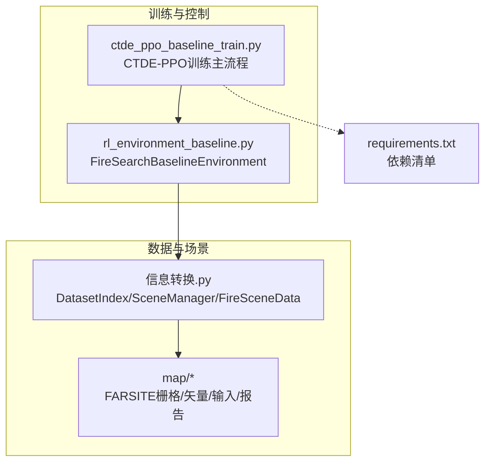
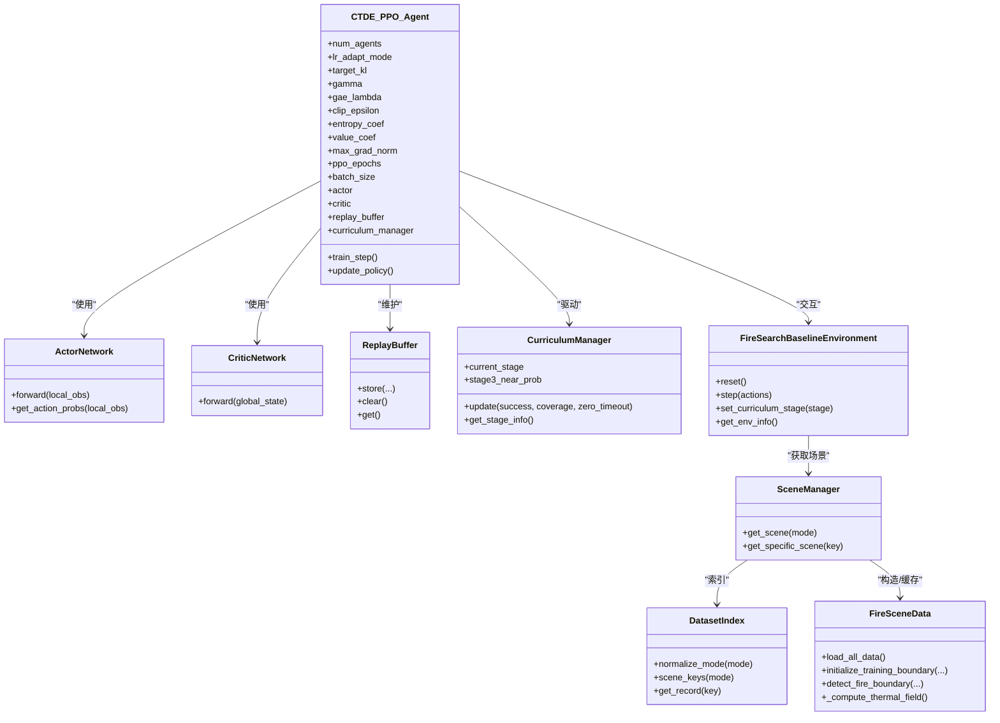
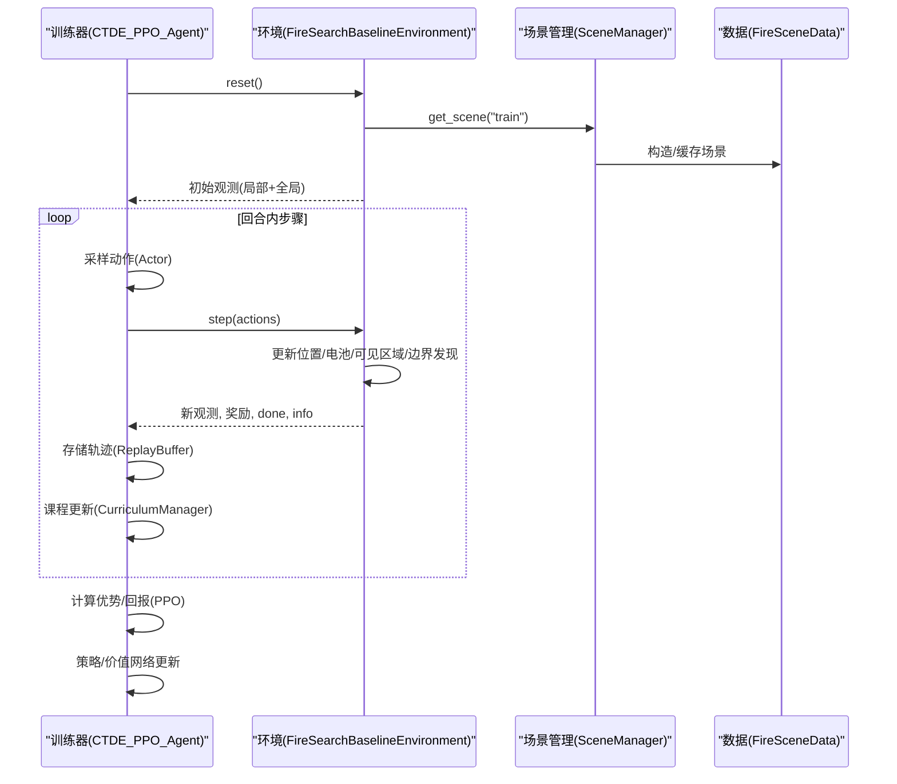
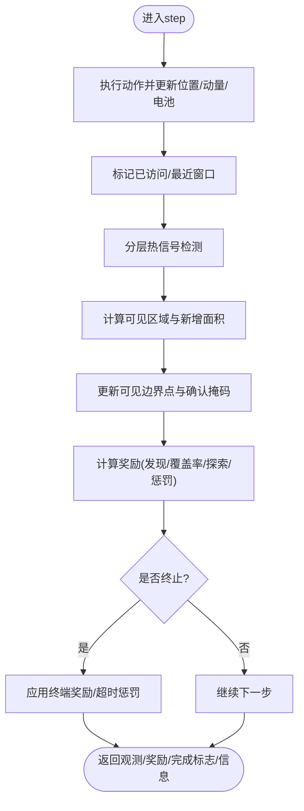
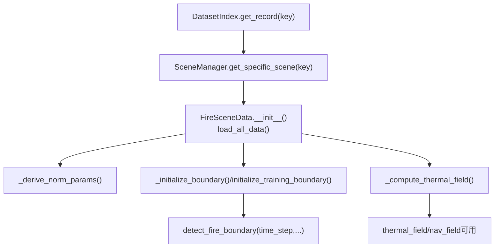
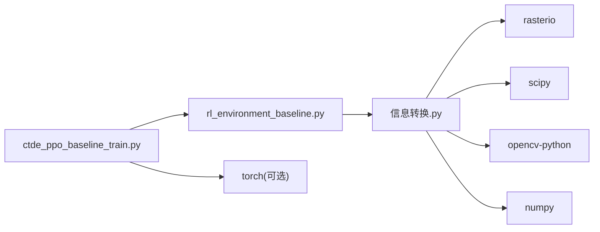

# 系统架构

<cite>
**本文引用的文件**   
- [ctde_ppo_baseline_train.py](file://environment_variables/environment_variables/ctde_ppo_baseline_train.py)
- [rl_environment_baseline.py](file://environment_variables/environment_variables/rl_environment_baseline.py)
- [信息转换.py](file://environment_variables/environment_variables/信息转换.py)
- [requirements.txt](file://environment_variables/requirements.txt)
</cite>

## 目录
1. [引言](#引言)
2. [项目结构](#项目结构)
3. [核心组件](#核心组件)
4. [架构总览](#架构总览)
5. [详细组件分析](#详细组件分析)
6. [依赖关系分析](#依赖关系分析)
7. [性能与可扩展性](#性能与可扩展性)
8. [安全、监控与灾难恢复](#安全监控与灾难恢复)
9. [部署拓扑与基础设施](#部署拓扑与基础设施)
10. [故障排查指南](#故障排查指南)
11. [结论](#结论)

## 引言
本架构文档面向“自适应参数森林火灾搜索系统”，聚焦高层设计、架构模式与系统边界，详细说明以下关键模块的交互：CTDE-PPO智能体、FireSearchBaselineEnvironment环境、数据处理模块（数据索引、场景管理、栅格加载与热场计算）。文档同时覆盖从FARSITE数据加载到训练循环的数据流设计、技术决策与权衡、约束条件、基础设施需求、可扩展性与部署拓扑，并给出系统上下文图与组件分解图。

## 项目结构
仓库采用“脚本+数据”组织方式：
- environment_variables/environment_variables：核心训练与环境代码
  - ctde_ppo_baseline_train.py：CTDE-PPO训练主流程、网络、回放缓冲、课程管理器、质量评估等
  - rl_environment_baseline.py：Gymnasium风格的多无人机火边界搜索环境
  - 信息转换.py：数据集索引、场景管理、FARSITE栅格/矢量/输入解析、归一化、热场与边界处理
- environment_variables/requirements.txt：运行依赖声明
- map：多组FARSITE仿真场景（Train/Validation/Generalization/Stress）
- outputs：训练输出与可视化结果

图表来源
- [ctde_ppo_baseline_train.py:1-120](file://environment_variables/environment_variables/ctde_ppo_baseline_train.py#L1-L120)
- [rl_environment_baseline.py:1-120](file://environment_variables/environment_variables/rl_environment_baseline.py#L1-L120)
- [信息转换.py:20-120](file://environment_variables/environment_variables/信息转换.py#L20-L120)
- [requirements.txt:1-13](file://environment_variables/requirements.txt#L1-L13)

章节来源
- [ctde_ppo_baseline_train.py:1-120](file://environment_variables/environment_variables/ctde_ppo_baseline_train.py#L1-L120)
- [rl_environment_baseline.py:1-120](file://environment_variables/environment_variables/rl_environment_baseline.py#L1-L120)
- [信息转换.py:20-120](file://environment_variables/environment_variables/信息转换.py#L20-L120)
- [requirements.txt:1-13](file://environment_variables/requirements.txt#L1-L13)

## 核心组件
- CTDE-PPO智能体与训练器
  - Actor/Critic网络：Actor基于局部观测，Critic基于全局状态；支持KL自适应学习率与PPO超参配置
  - 回放缓冲：收集轨迹用于PPO更新
  - 课程管理器：三阶段课程（初始面积百分比递增、目标覆盖率阶梯提升、近界生成概率退火）
  - 质量指标：收敛效率、奖励稳定性、KL稳定性等
- FireSearchBaselineEnvironment
  - Gymnasium接口：离散动作空间（上下左右静止）、局部观测与全局状态
  - 观测配置：baseline/static_terrain/dynamic_front/risk_aware多种profile
  - 奖励配置：boundary_coverage/front_detection/severity_weighted/exploration_balanced
  - 动态边界更新与热信号分层判定
- 数据处理模块
  - DatasetIndex：按split划分场景键，统一路径解析与元数据读取
  - SceneManager：跨实例共享场景缓存，避免重复IO与重算
  - FireSceneData（兼容别名FireEnvironmentData）：栅格/ASC/矢量/输入加载、风场推导、归一化参数派生、边界选择与热场重建

章节来源
- [ctde_ppo_baseline_train.py:460-535](file://environment_variables/environment_variables/ctde_ppo_baseline_train.py#L460-L535)
- [ctde_ppo_baseline_train.py:537-567](file://environment_variables/environment_variables/ctde_ppo_baseline_train.py#L537-L567)
- [ctde_ppo_baseline_train.py:569-747](file://environment_variables/environment_variables/ctde_ppo_baseline_train.py#L569-L747)
- [ctde_ppo_baseline_train.py:749-800](file://environment_variables/environment_variables/ctde_ppo_baseline_train.py#L749-L800)
- [rl_environment_baseline.py:21-157](file://environment_variables/environment_variables/rl_environment_baseline.py#L21-L157)
- [rl_environment_baseline.py:565-658](file://environment_variables/environment_variables/rl_environment_baseline.py#L565-L658)
- [信息转换.py:20-120](file://environment_variables/environment_variables/信息转换.py#L20-L120)
- [信息转换.py:1282-1326](file://environment_variables/environment_variables/信息转换.py#L1282-L1326)
- [信息转换.py:219-323](file://environment_variables/environment_variables/信息转换.py#L219-L323)

## 架构总览
系统采用“训练器-环境-数据层”三层解耦：
- 训练器负责策略优化、课程调度、日志与模型保存
- 环境封装任务语义、观测/奖励、步推进与终止条件
- 数据层提供场景检索、栅格/矢量解析、归一化与热场/边界计算

图表来源
- [ctde_ppo_baseline_train.py:460-535](file://environment_variables/environment_variables/ctde_ppo_baseline_train.py#L460-L535)
- [ctde_ppo_baseline_train.py:537-567](file://environment_variables/environment_variables/ctde_ppo_baseline_train.py#L537-L567)
- [ctde_ppo_baseline_train.py:569-747](file://environment_variables/environment_variables/ctde_ppo_baseline_train.py#L569-L747)
- [ctde_ppo_baseline_train.py:749-800](file://environment_variables/environment_variables/ctde_ppo_baseline_train.py#L749-L800)
- [rl_environment_baseline.py:21-157](file://environment_variables/environment_variables/rl_environment_baseline.py#L21-L157)
- [信息转换.py:20-120](file://environment_variables/environment_variables/信息转换.py#L20-L120)
- [信息转换.py:1282-1326](file://environment_variables/environment_variables/信息转换.py#L1282-L1326)
- [信息转换.py:219-323](file://environment_variables/environment_variables/信息转换.py#L219-L323)

## 详细组件分析

### CTDE-PPO智能体与训练循环
- 网络结构
  - Actor：多层全连接+LayerNorm+残差连接，输出离散动作logits
  - Critic：多层全连接+LayerNorm，输出标量价值
- PPO更新
  - GAE优势估计、裁剪损失、熵正则与价值损失加权
  - KL自适应学习率（fixed或kl模式），EMA跟踪近似KL
- 课程管理
  - 阶段1：初始面积百分比渐进提升
  - 阶段2/3：目标覆盖率逐步提高，near_prob退火
- 质量评估
  - 收敛效率（AUC、阈值到达步数/更新次数）
  - 奖励稳定性（尾部方差、均值/最大下降）
  - KL稳定性（均值/方差、超调率、裁剪比例、LR统计）

图表来源
- [ctde_ppo_baseline_train.py:749-800](file://environment_variables/environment_variables/ctde_ppo_baseline_train.py#L749-L800)
- [ctde_ppo_baseline_train.py:569-747](file://environment_variables/environment_variables/ctde_ppo_baseline_train.py#L569-L747)
- [rl_environment_baseline.py:331-360](file://environment_variables/environment_variables/rl_environment_baseline.py#L331-L360)
- [rl_environment_baseline.py:565-658](file://environment_variables/environment_variables/rl_environment_baseline.py#L565-L658)
- [信息转换.py:1282-1326](file://environment_variables/environment_variables/信息转换.py#L1282-L1326)
- [信息转换.py:219-323](file://environment_variables/environment_variables/信息转换.py#L219-L323)

章节来源
- [ctde_ppo_baseline_train.py:460-535](file://environment_variables/environment_variables/ctde_ppo_baseline_train.py#L460-L535)
- [ctde_ppo_baseline_train.py:537-567](file://environment_variables/environment_variables/ctde_ppo_baseline_train.py#L537-L567)
- [ctde_ppo_baseline_train.py:569-747](file://environment_variables/environment_variables/ctde_ppo_baseline_train.py#L569-L747)
- [ctde_ppo_baseline_train.py:749-800](file://environment_variables/environment_variables/ctde_ppo_baseline_train.py#L749-L800)

### FireSearchBaselineEnvironment环境
- 观测空间
  - 本地观测：位置、电量、地形/风场、热梯度、相机方向、动量等
  - 全局状态：覆盖率、队形中心/散布、距火距离、进度、未探索密度等
- 动作空间：五维离散（上/下/左/右/静止），带边界约束
- 奖励设计
  - 边界发现、覆盖率增量、预边界区域探索引导、重复惩罚、空闲惩罚、同伴接近惩罚、终端奖励/超时惩罚
  - 支持多种奖励配置（front_detection、severity_weighted、exploration_balanced）
- 动态边界更新
  - 每若干步根据时间序列更新t时刻边界，刷新SDF与热场
- 热信号分层判定
  - local_fire_visible / thermal_sensor_signal / has_heat_signal

图表来源
- [rl_environment_baseline.py:565-658](file://environment_variables/environment_variables/rl_environment_baseline.py#L565-L658)
- [rl_environment_baseline.py:660-717](file://environment_variables/environment_variables/rl_environment_baseline.py#L660-L717)
- [rl_environment_baseline.py:692-767](file://environment_variables/environment_variables/rl_environment_baseline.py#L692-L767)

章节来源
- [rl_environment_baseline.py:21-157](file://environment_variables/environment_variables/rl_environment_baseline.py#L21-L157)
- [rl_environment_baseline.py:565-658](file://environment_variables/environment_variables/rl_environment_baseline.py#L565-L658)
- [rl_environment_baseline.py:660-717](file://environment_variables/environment_variables/rl_environment_baseline.py#L660-L717)
- [rl_environment_baseline.py:692-767](file://environment_variables/environment_variables/rl_environment_baseline.py#L692-L767)

### 数据处理模块（数据索引、场景管理、栅格加载与热场计算）
- DatasetIndex
  - 规范化mode别名，按split返回场景键列表
  - 解析绝对路径、元数据、raster/vector/input路径
- SceneManager
  - 跨所有实例共享场景缓存，避免重复IO与重算
  - 按mode随机选择场景键，懒加载具体场景
- FireSceneData（兼容别名FireEnvironmentData）
  - 加载静态地图与核心/额外栅格，校验形状一致性
  - 解析风场（ASC或weather_stream），派生归一化参数
  - 初始化训练边界（可选按面积百分比截断时间切片）
  - 热场重建：per-scene稳健归一化→高斯模糊→参考值归一化→导航场

图表来源
- [信息转换.py:20-120](file://environment_variables/environment_variables/信息转换.py#L20-L120)
- [信息转换.py:1282-1326](file://environment_variables/environment_variables/信息转换.py#L1282-L1326)
- [信息转换.py:219-323](file://environment_variables/environment_variables/信息转换.py#L219-L323)
- [信息转换.py:559-602](file://environment_variables/environment_variables/信息转换.py#L559-L602)
- [信息转换.py:684-721](file://environment_variables/environment_variables/信息转换.py#L684-L721)
- [信息转换.py:759-800](file://environment_variables/environment_variables/信息转换.py#L759-L800)

章节来源
- [信息转换.py:20-120](file://environment_variables/environment_variables/信息转换.py#L20-L120)
- [信息转换.py:1282-1326](file://environment_variables/environment_variables/信息转换.py#L1282-L1326)
- [信息转换.py:219-323](file://environment_variables/environment_variables/信息转换.py#L219-L323)
- [信息转换.py:559-602](file://environment_variables/environment_variables/信息转换.py#L559-L602)
- [信息转换.py:684-721](file://environment_variables/environment_variables/信息转换.py#L684-L721)
- [信息转换.py:759-800](file://environment_variables/environment_variables/信息转换.py#L759-L800)

## 依赖关系分析
- 直接依赖
  - 训练器依赖环境与数据模块
  - 环境依赖SceneManager与FireSceneData
  - 数据模块依赖rasterio、scipy、opencv-python、numpy等
- 外部依赖与版本
  - numpy>=1.21.0、rasterio>=1.3.0、matplotlib>=3.5.0、scipy>=1.10.0、opencv-python>=4.8.0
  - 强化学习相关依赖为可选（torch、stable-baselines3、tensorboard）

图表来源
- [ctde_ppo_baseline_train.py:1-30](file://environment_variables/environment_variables/ctde_ppo_baseline_train.py#L1-L30)
- [rl_environment_baseline.py:1-20](file://environment_variables/environment_variables/rl_environment_baseline.py#L1-L20)
- [信息转换.py:1-14](file://environment_variables/environment_variables/信息转换.py#L1-L14)
- [requirements.txt:1-13](file://environment_variables/requirements.txt#L1-L13)

章节来源
- [requirements.txt:1-13](file://environment_variables/requirements.txt#L1-L13)
- [ctde_ppo_baseline_train.py:1-30](file://environment_variables/environment_variables/ctde_ppo_baseline_train.py#L1-L30)
- [rl_environment_baseline.py:1-20](file://environment_variables/environment_variables/rl_environment_baseline.py#L1-L20)
- [信息转换.py:1-14](file://environment_variables/environment_variables/信息转换.py#L1-L14)

## 性能与可扩展性
- 性能要点
  - 场景缓存：SceneManager跨实例共享缓存，显著减少I/O与重算开销
  - 热场重建：先降采样再高斯模糊后上采样，降低计算成本
  - 观测/奖励向量化：基于NumPy切片与布尔掩码，避免Python循环热点
  - PPO批大小与mini-batch：默认较大批以稳定训练，可按GPU显存调整
- 可扩展性建议
  - 观测/奖励profile通过字典注册扩展，无需修改核心逻辑
  - 课程管理器可插拔：新增能力门槛与退火策略时仅替换配置表
  - 数据层抽象：新增栅格类型或风场源时，在FireSceneData中扩展加载与归一化逻辑

[本节为通用指导，不直接分析具体文件]

## 安全、监控与灾难恢复
- 安全性
  - 路径解析：DatasetIndex对相对路径进行绝对化与source_root拼接，避免越权访问
  - 输入校验：栅格形状一致性检查、风场形状匹配、必需文件存在性验证
- 监控
  - 控制台输出双写（tee）：训练日志与屏幕同步，便于追踪与审计
  - 质量指标：收敛效率、奖励/KL稳定性、阈值到达步数等，便于自动早停与回滚
- 灾难恢复
  - 无效场景抛出异常并记录原因，训练应停止而非回退到最终态边界
  - 课程阶段切换打印详细信息，便于定位退化问题

章节来源
- [ctde_ppo_baseline_train.py:47-96](file://environment_variables/environment_variables/ctde_ppo_baseline_train.py#L47-L96)
- [信息转换.py:32-87](file://environment_variables/environment_variables/信息转换.py#L32-L87)
- [信息转换.py:525-533](file://environment_variables/environment_variables/信息转换.py#L525-L533)
- [信息转换.py:684-721](file://environment_variables/environment_variables/信息转换.py#L684-L721)

## 部署拓扑与基础设施
- 单机训练拓扑
  - CPU/GPU节点运行训练器与环境，磁盘存放FARSITE场景与输出
  - 推荐GPU显存≥16GB以支撑大batch与多无人机并行
- 分布式训练（可选）
  - 将环境实例分布至多进程/多机，训练器聚合梯度
  - 场景缓存需跨进程共享（如内存映射或分布式缓存）
- 数据布局
  - dataset_index.json集中描述场景元数据与路径
  - 各场景包含inputs/rasters/vectors/reports子目录

[本节为通用指导，不直接分析具体文件]

## 故障排查指南
- 常见错误
  - 缺失dataset_index.json或场景目录不存在：检查data_dir与工作目录
  - 栅格形状不一致：核对static_map与各raster尺寸
  - 风场形状不匹配：确保wind_speed/wind_direction与shape一致
  - t=0边界为空：场景无效，需修正数据或调整初始化面积百分比
- 诊断方法
  - 查看控制台日志与训练日志文件
  - 检查质量指标曲线（任务分数、KL、裁剪比例）
  - 打印环境信息（网格大小、边界点数、阶段目标等）

章节来源
- [信息转换.py:32-87](file://environment_variables/environment_variables/信息转换.py#L32-L87)
- [信息转换.py:525-533](file://environment_variables/environment_variables/信息转换.py#L525-L533)
- [信息转换.py:684-721](file://environment_variables/environment_variables/信息转换.py#L684-L721)
- [ctde_ppo_baseline_train.py:47-96](file://environment_variables/environment_variables/ctde_ppo_baseline_train.py#L47-L96)

## 结论
本系统以“训练器-环境-数据层”清晰分层，结合CTDE-PPO与多阶段课程学习，实现多无人机在FARSITE场景中的自适应火边界搜索。数据层提供稳健的栅格/矢量解析与热场重建，环境层定义明确的任务语义与奖励机制，训练器则提供稳定的PPO优化与质量评估。通过场景缓存、向量化计算与可插拔配置，系统在性能与可扩展性方面具备良好基础，适合进一步演进为分布式训练与在线部署形态。