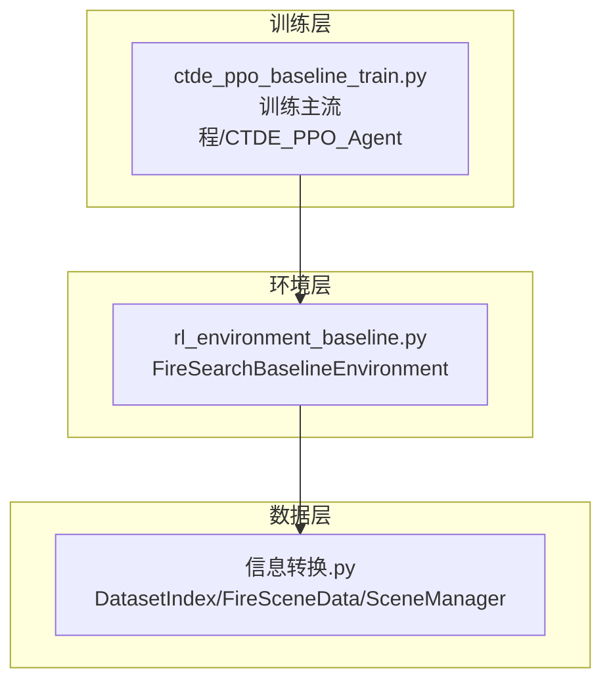
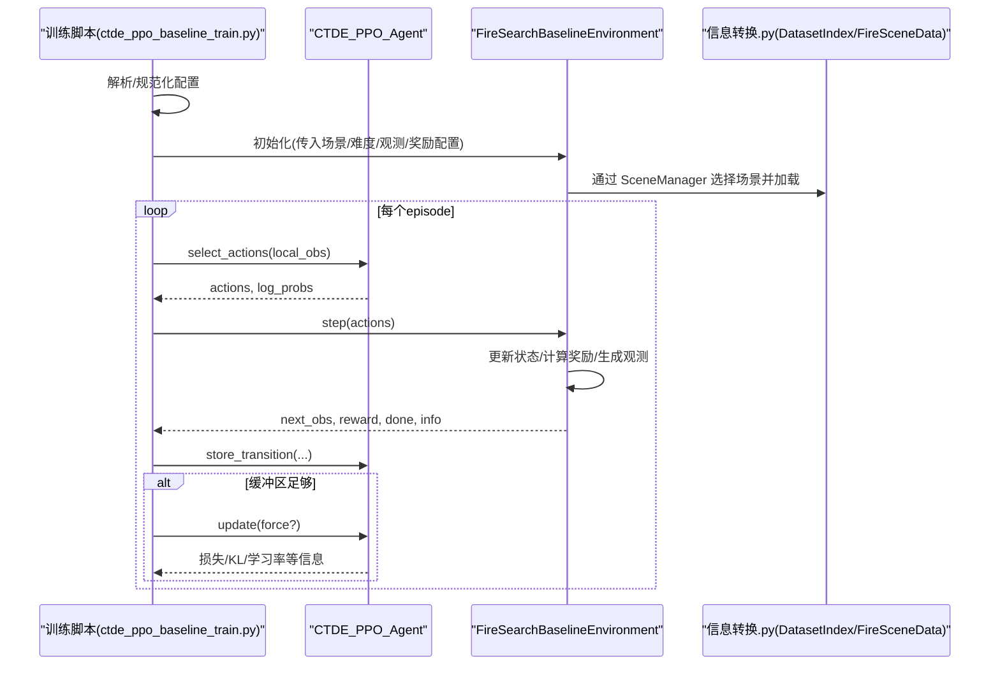
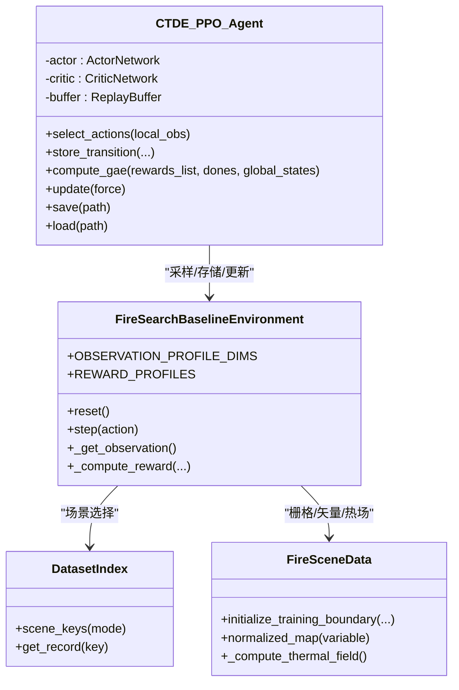
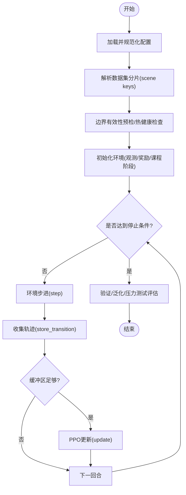
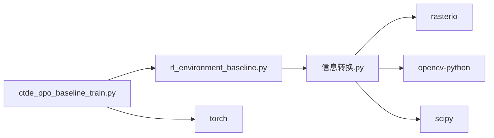

# 系统集成架构

<cite>
**本文引用的文件**
- [ctde_ppo_baseline_train.py](file://environment_variables/environment_variables/ctde_ppo_baseline_train.py)
- [rl_environment_baseline.py](file://environment_variables/environment_variables/rl_environment_baseline.py)
- [信息转换.py](file://environment_variables/environment_variables/信息转换.py)
- [requirements.txt](file://environment_variables/requirements.txt)
</cite>

## 目录
1. [简介](#简介)
2. [项目结构](#项目结构)
3. [核心组件](#核心组件)
4. [架构总览](#架构总览)
5. [详细组件分析](#详细组件分析)
6. [依赖关系分析](#依赖关系分析)
7. [性能考量](#性能考量)
8. [故障排查指南](#故障排查指南)
9. [结论](#结论)
10. [附录](#附录)

## 简介
本文件面向系统集成与二次开发，系统性阐述 CTDE-PPO 基线训练系统与火灾边界搜索环境之间的交互协议、数据流与控制流；说明配置驱动架构（JSON 解析、参数校验与默认值管理）、模块化设计与接口抽象层；记录扩展点（可插拔观测配置、奖励函数、网络架构）；并给出第三方库集成策略、版本兼容性与冲突解决建议，以及系统集成示例与自定义组件开发指南。

## 项目结构
仓库采用“训练脚本 + 环境实现 + 数据加载”的三层组织方式：
- 训练脚本：CTDE-PPO 算法、训练循环、课程学习、评估与可视化编排
- 环境实现：Gymnasium 风格的多无人机火场边界搜索环境，提供局部观测与全局状态
- 数据加载：场景索引、栅格与矢量读取、归一化、热场重建等

图表来源
- [ctde_ppo_baseline_train.py:1-120](file://environment_variables/environment_variables/ctde_ppo_baseline_train.py#L1-L120)
- [rl_environment_baseline.py:1-120](file://environment_variables/environment_variables/rl_environment_baseline.py#L1-L120)
- [信息转换.py:1-120](file://environment_variables/environment_variables/信息转换.py#L1-L120)

章节来源
- [ctde_ppo_baseline_train.py:1-120](file://environment_variables/environment_variables/ctde_ppo_baseline_train.py#L1-L120)
- [rl_environment_baseline.py:1-120](file://environment_variables/environment_variables/rl_environment_baseline.py#L1-L120)
- [信息转换.py:1-120](file://environment_variables/environment_variables/信息转换.py#L1-L120)

## 核心组件
- CTDE_PPO_Agent：Actor/Critic 网络、ReplayBuffer、GAE 计算、PPO 更新、KL 自适应学习率、保存/加载
- FireSearchBaselineEnvironment：多智能体离散动作空间、局部观测与全局状态构造、多种观测配置与奖励配置、课程阶段控制
- 数据模块（信息转换.py）：DatasetIndex 场景索引、FireSceneData 场景数据加载与归一化、热场重建、边界点初始化
- 配置系统：DEFAULT_TRAIN_CONFIG + normalize_training_config 完成默认值合并、类型与范围校验、枚举白名单检查

章节来源
- [ctde_ppo_baseline_train.py:460-535](file://environment_variables/environment_variables/ctde_ppo_baseline_train.py#L460-L535)
- [ctde_ppo_baseline_train.py:537-567](file://environment_variables/environment_variables/ctde_ppo_baseline_train.py#L537-L567)
- [ctde_ppo_baseline_train.py:759-991](file://environment_variables/environment_variables/ctde_ppo_baseline_train.py#L759-L991)
- [rl_environment_baseline.py:21-158](file://environment_variables/environment_variables/rl_environment_baseline.py#L21-L158)
- [信息转换.py:20-197](file://environment_variables/environment_variables/信息转换.py#L20-L197)
- [信息转换.py:219-323](file://environment_variables/environment_variables/信息转换.py#L219-L323)
- [ctde_ppo_baseline_train.py:98-281](file://environment_variables/environment_variables/ctde_ppo_baseline_train.py#L98-L281)

## 架构总览
下图展示从训练入口到环境步进、再到数据加载的完整调用链与数据流向。

图表来源
- [ctde_ppo_baseline_train.py:1119-1183](file://environment_variables/environment_variables/ctde_ppo_baseline_train.py#L1119-L1183)
- [ctde_ppo_baseline_train.py:849-991](file://environment_variables/environment_variables/ctde_ppo_baseline_train.py#L849-L991)
- [rl_environment_baseline.py:331-361](file://environment_variables/environment_variables/rl_environment_baseline.py#L331-L361)
- [信息转换.py:248-323](file://environment_variables/environment_variables/信息转换.py#L248-L323)

## 详细组件分析

### CTDE_PPO_Agent 与 FireSearchBaselineEnvironment 通信协议
- 输入输出契约
  - 输入：每步 local_obs（多无人机元组向量），由 Agent 转为张量后采样动作
  - 输出：next_obs（包含 local_obs 与 global_state）、标量 reward、done、info（含覆盖率、首次发现时间、奖励分解等）
- 关键数据字段
  - local_obs_dim/global_state_dim 由观测配置决定，受 FireSearchBaselineEnvironment.OBSERVATION_PROFILE_DIMS 约束
  - reward_profile 受 REWARD_PROFILES 白名单约束
- 训练循环集成
  - 使用 ReplayBuffer 收集轨迹，按 batch_size 触发 PPO 更新
  - GAE 优势估计基于 Critic 对全局状态的估值
  - KL 自适应学习率可选（fixed/kl），在 update 中根据近似 KL 调整 actor_lr

图表来源
- [ctde_ppo_baseline_train.py:759-991](file://environment_variables/environment_variables/ctde_ppo_baseline_train.py#L759-L991)
- [rl_environment_baseline.py:21-158](file://environment_variables/environment_variables/rl_environment_baseline.py#L21-L158)
- [信息转换.py:20-197](file://environment_variables/environment_variables/信息转换.py#L20-L197)
- [信息转换.py:219-323](file://environment_variables/environment_variables/信息转换.py#L219-L323)

章节来源
- [ctde_ppo_baseline_train.py:849-991](file://environment_variables/environment_variables/ctde_ppo_baseline_train.py#L849-L991)
- [rl_environment_baseline.py:331-361](file://environment_variables/environment_variables/rl_environment_baseline.py#L331-L361)
- [rl_environment_baseline.py:565-658](file://environment_variables/environment_variables/rl_environment_baseline.py#L565-L658)
- [信息转换.py:248-323](file://environment_variables/environment_variables/信息转换.py#L248-L323)

### 数据处理模块与训练循环集成
- 场景选择与加载
  - 训练前通过 DatasetIndex 获取 train/validation/generalization/stress 分片键集合
  - FireSearchBaselineEnvironment 内部通过 SceneManager 按需加载 scene，支持固定 scene_key 或随机采样
- 边界与热场
  - initialize_training_boundary 支持按面积百分位选择 t=0 初始边界
  - _compute_thermal_field 构建 per-scene 鲁棒归一化的热势场，用于引导探索
- 训练日志与质量指标
  - 训练过程记录任务分数、奖励、KL、裁剪比例等，并计算收敛效率与稳定性指标

图表来源
- [ctde_ppo_baseline_train.py:1119-1183](file://environment_variables/environment_variables/ctde_ppo_baseline_train.py#L1119-L1183)
- [ctde_ppo_baseline_train.py:889-991](file://environment_variables/environment_variables/ctde_ppo_baseline_train.py#L889-L991)
- [信息转换.py:698-721](file://environment_variables/environment_variables/信息转换.py#L698-L721)
- [信息转换.py:759-800](file://environment_variables/environment_variables/信息转换.py#L759-L800)

章节来源
- [ctde_ppo_baseline_train.py:1119-1183](file://environment_variables/environment_variables/ctde_ppo_baseline_train.py#L1119-L1183)
- [ctde_ppo_baseline_train.py:889-991](file://environment_variables/environment_variables/ctde_ppo_baseline_train.py#L889-L991)
- [信息转换.py:698-721](file://environment_variables/environment_variables/信息转换.py#L698-L721)
- [信息转换.py:759-800](file://environment_variables/environment_variables/信息转换.py#L759-L800)

### 配置驱动架构（JSON 解析、参数验证、默认值管理）
- 默认配置字典 DEFAULT_TRAIN_CONFIG 集中定义所有可调超参与路径
- normalize_training_config 负责：
  - 深拷贝合并用户配置
  - 字符串列表/逗号分隔字符串标准化
  - 数值范围裁剪与类型转换
  - 枚举白名单校验（observation_profile/reward_profile/lr_adapt_mode）
  - 将环境暴露的维度映射注入配置（observation_profile_dims）
- 输出目录与实验元数据
  - _make_output_dir 自动生成时间戳子目录
  - _build_experiment_metadata 汇总数据集分片计数、观测/奖励配置、传感器半径、最大步数等

章节来源
- [ctde_ppo_baseline_train.py:98-281](file://environment_variables/environment_variables/ctde_ppo_baseline_train.py#L98-L281)
- [ctde_ppo_baseline_train.py:1016-1045](file://environment_variables/environment_variables/ctde_ppo_baseline_train.py#L1016-L1045)
- [ctde_ppo_baseline_train.py:1128-1153](file://environment_variables/environment_variables/ctde_ppo_baseline_train.py#L1128-L1153)

### 依赖注入模式、模块化设计与接口抽象层
- 依赖注入
  - 训练脚本通过构造函数参数向 Agent 注入网络维度、优化器超参、设备、批次大小等
  - 环境通过参数注入数据目录、无人机数量、视野半径、最大步数、观测/奖励配置、课程阶段等
- 模块化设计
  - 训练逻辑（ctde_ppo_baseline_train.py）与环境（rl_environment_baseline.py）解耦，仅通过 Gymnasium 标准接口交互
  - 数据加载（信息转换.py）独立封装，对外暴露 SceneManager/DatasetIndex/FireSceneData
- 接口抽象层
  - Gymnasium.Env 作为环境抽象，统一 reset/step 语义
  - 观测/奖励配置以类级常量字典形式声明，便于外部校验与扩展

章节来源
- [ctde_ppo_baseline_train.py:759-821](file://environment_variables/environment_variables/ctde_ppo_baseline_train.py#L759-L821)
- [rl_environment_baseline.py:21-158](file://environment_variables/environment_variables/rl_environment_baseline.py#L21-L158)
- [信息转换.py:20-197](file://environment_variables/environment_variables/信息转换.py#L20-L197)

### 扩展点设计（可插拔观测配置、奖励函数、网络架构）
- 观测配置
  - OBSERVATION_PROFILE_DIMS 声明不同 profile 的 local/global 维度
  - 新增 profile 需在类内注册并在 normalize_training_config 白名单中允许
- 奖励函数
  - REWARD_PROFILES 声明可用奖励方案，_compute_profile_reward 分支处理
  - 新增方案需在此处添加分支并更新 REWARD_BREAKDOWN_KEYS
- 网络架构
  - ActorNetwork/CriticNetwork 为独立 nn.Module，可通过替换类或修改构造参数进行扩展
  - 若改变输入维度，需同步更新对应 observation_profile 的维度定义

章节来源
- [rl_environment_baseline.py:24-47](file://environment_variables/environment_variables/rl_environment_baseline.py#L24-L47)
- [rl_environment_baseline.py:769-800](file://environment_variables/environment_variables/rl_environment_baseline.py#L769-L800)
- [ctde_ppo_baseline_train.py:460-535](file://environment_variables/environment_variables/ctde_ppo_baseline_train.py#L460-L535)
- [ctde_ppo_baseline_train.py:98-281](file://environment_variables/environment_variables/ctde_ppo_baseline_train.py#L98-L281)

### 第三方库集成策略、版本兼容性与依赖冲突解决
- 核心依赖
  - numpy/rasterio/matplotlib/scipy/opencv-python 用于栅格读写、图像处理与可视化
- 可选依赖
  - torch/tensorboard/stable-baselines3 被注释为可选，避免强制安装
- 兼容性建议
  - 使用 requirements.txt 锁定最低版本，结合虚拟环境隔离
  - 当出现 ABI 不兼容时，优先升级/降级至已验证组合；必要时使用 conda/mamba 管理二进制依赖
  - 对于 rasterio/geos 等底层库，确保系统级依赖满足其编译要求

章节来源
- [requirements.txt:1-12](file://environment_variables/requirements.txt#L1-L12)

## 依赖关系分析
- 直接依赖
  - 训练脚本依赖环境与数据模块
  - 环境依赖数据模块进行场景加载与特征提取
- 间接依赖
  - 数据模块依赖 rasterio/cv2/scipy 等科学计算与地理栅格库
- 潜在耦合点
  - 观测/奖励配置变更会同时影响环境行为与训练脚本的校验逻辑
  - 网络输入维度变化需要同步更新配置与环境的维度映射

图表来源
- [ctde_ppo_baseline_train.py:1-120](file://environment_variables/environment_variables/ctde_ppo_baseline_train.py#L1-L120)
- [rl_environment_baseline.py:1-120](file://environment_variables/environment_variables/rl_environment_baseline.py#L1-L120)
- [信息转换.py:1-120](file://environment_variables/environment_variables/信息转换.py#L1-L120)
- [requirements.txt:1-12](file://environment_variables/requirements.txt#L1-L12)

章节来源
- [ctde_ppo_baseline_train.py:1-120](file://environment_variables/environment_variables/ctde_ppo_baseline_train.py#L1-L120)
- [rl_environment_baseline.py:1-120](file://environment_variables/environment_variables/rl_environment_baseline.py#L1-L120)
- [信息转换.py:1-120](file://environment_variables/environment_variables/信息转换.py#L1-L120)
- [requirements.txt:1-12](file://environment_variables/requirements.txt#L1-L12)

## 性能考量
- 批处理与内存
  - ReplayBuffer 累积轨迹，batch_size/minibatch_size 控制显存占用与更新频率
- 数值稳定
  - GAE 优势标准化（减均值除方差）提升训练稳定性
  - 梯度裁剪防止爆炸
- I/O 瓶颈
  - 栅格读取与热场重建可能成为热点，建议复用缓存、减少重复计算
- 并行与设备
  - 自动选择 CUDA/CPU，注意显存不足时的 batch 调小与 ppo_epochs 调整

[本节为通用指导，无需特定文件引用]

## 故障排查指南
- 常见错误与定位
  - 未知 observation_profile/reward_profile：检查是否在类常量白名单中注册
  - 场景缺失或形状不一致：核对 dataset_index.json 与栅格尺寸一致性
  - 空边界导致无效场景：检查 t=0 边界检测与 init_area_percent 设置
- 诊断与日志
  - 控制台 TeeStream 将 stdout/stderr 双写到日志文件
  - 预检报告 dataset_preflight.json 包含边界统计与热健康记录
- 复现与调试
  - 固定 seed 与比较种子集，确保结果可复现
  - 使用 evaluate_preserving_rng 保持 RNG 状态一致性

章节来源
- [ctde_ppo_baseline_train.py:98-281](file://environment_variables/environment_variables/ctde_ppo_baseline_train.py#L98-L281)
- [ctde_ppo_baseline_train.py:1119-1183](file://environment_variables/environment_variables/ctde_ppo_baseline_train.py#L1119-L1183)
- [信息转换.py:684-721](file://environment_variables/environment_variables/信息转换.py#L684-L721)

## 结论
本系统以清晰的模块化分层与严格的配置校验为基础，实现了 CTDE-PPO 与多无人机火场边界搜索环境的松耦合集成。通过可插拔的观测/奖励配置与可扩展的网络结构，系统在保持基线简洁的同时具备良好的扩展性。配合完善的数据预检与日志机制，便于工程化部署与持续迭代。

[本节为总结性内容，无需特定文件引用]

## 附录

### 系统集成示例（端到端流程）
- 准备数据：确保 dataset/dataset_index.json 存在且各场景路径有效
- 运行训练：执行 ctde_ppo_baseline_train.py，传入 JSON 配置或命令行参数
- 观察输出：查看 outputs 下训练日志、模型与图表

章节来源
- [ctde_ppo_baseline_train.py:1016-1045](file://environment_variables/environment_variables/ctde_ppo_baseline_train.py#L1016-L1045)
- [ctde_ppo_baseline_train.py:1119-1183](file://environment_variables/environment_variables/ctde_ppo_baseline_train.py#L1119-L1183)

### 自定义组件开发指南
- 新增观测配置
  - 在 FireSearchBaselineEnvironment.OBSERVATION_PROFILE_DIMS 中注册新 profile 的维度
  - 在 _get_observation 中添加特征拼接分支
  - 在 normalize_training_config 中确保白名单允许该 profile
- 新增奖励函数
  - 在 REWARD_PROFILES 中添加名称
  - 在 _compute_profile_reward 中实现分支逻辑，并更新 REWARD_BREAKDOWN_KEYS
- 替换网络架构
  - 继承 ActorNetwork/CriticNetwork 或替换类实例
  - 保证输入维度与配置一致，必要时调整归一化与权重初始化

章节来源
- [rl_environment_baseline.py:24-47](file://environment_variables/environment_variables/rl_environment_baseline.py#L24-L47)
- [rl_environment_baseline.py:565-658](file://environment_variables/environment_variables/rl_environment_baseline.py#L565-L658)
- [rl_environment_baseline.py:769-800](file://environment_variables/environment_variables/rl_environment_baseline.py#L769-L800)
- [ctde_ppo_baseline_train.py:98-281](file://environment_variables/environment_variables/ctde_ppo_baseline_train.py#L98-L281)
- [ctde_ppo_baseline_train.py:460-535](file://environment_variables/environment_variables/ctde_ppo_baseline_train.py#L460-L535)