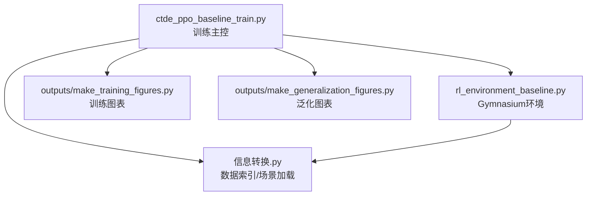
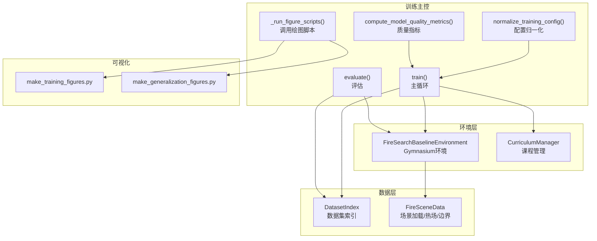
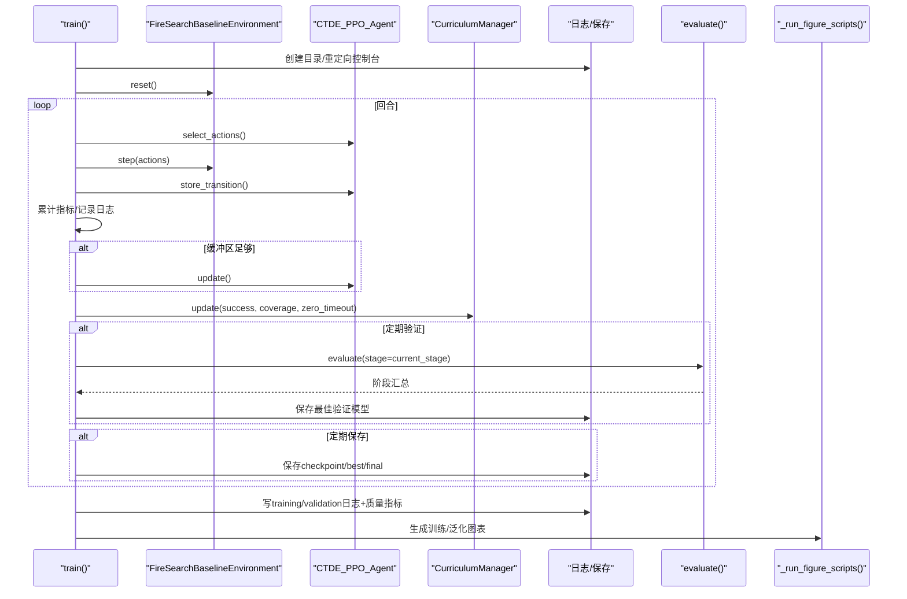
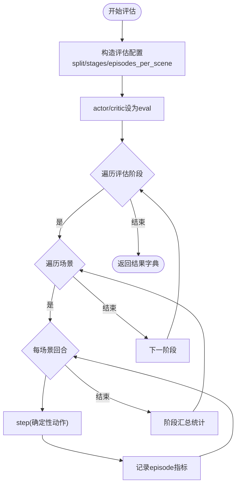
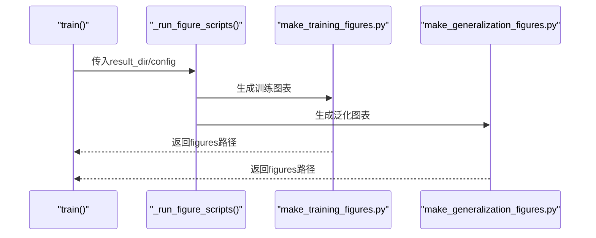
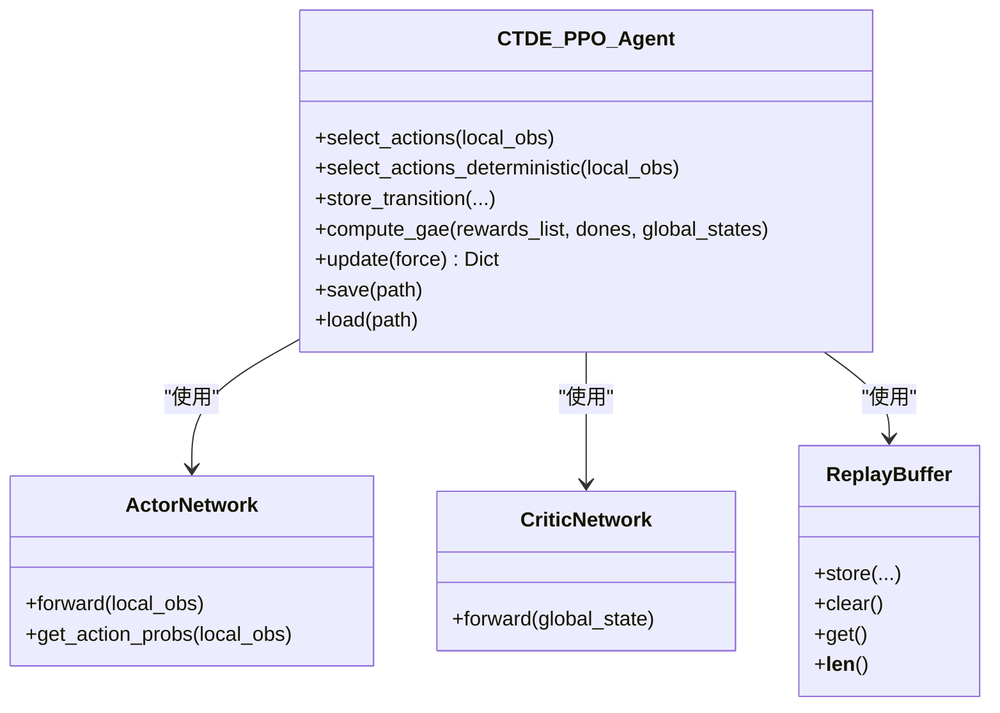
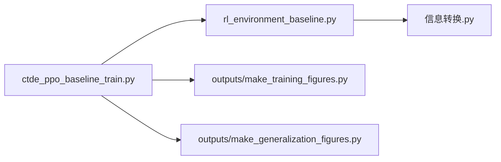

# 训练管理架构

<cite>
**本文引用的文件**   
- [ctde_ppo_baseline_train.py](file://environment_variables/environment_variables/ctde_ppo_baseline_train.py)
- [rl_environment_baseline.py](file://environment_variables/environment_variables/rl_environment_baseline.py)
- [信息转换.py](file://environment_variables/environment_variables/信息转换.py)
- [make_training_figures.py](file://environment_variables/environment_variables/outputs/make_training_figures.py)
- [make_generalization_figures.py](file://environment_variables/environment_variables/outputs/make_generalization_figures.py)
</cite>

## 目录
1. [简介](#简介)
2. [项目结构](#项目结构)
3. [核心组件](#核心组件)
4. [架构总览](#架构总览)
5. [详细组件分析](#详细组件分析)
6. [依赖关系分析](#依赖关系分析)
7. [性能与资源管理](#性能与资源管理)
8. [故障排查指南](#故障排查指南)
9. [结论](#结论)
10. [附录：配置示例与自定义指标集成](#附录配置示例与自定义指标集成)

## 简介
本文件面向“训练管理架构”的完整说明，覆盖主训练循环控制流程、实验配置管理、训练进度监控与结果保存机制；日志系统（控制台输出重定向、训练指标收集、性能统计）；模型评估策略（验证集评估、泛化能力测试、压力测试框架）；可视化生成系统（训练曲线绘制、结果图表导出、对比分析工具）；错误处理机制、资源管理与并发训练支持；并提供训练配置示例与自定义评估指标集成指南。

## 项目结构
仓库围绕一个可复用的CTDE-PPO基线训练脚本组织，配套环境封装、数据加载与预处理、以及训练后可视化脚本。关键目录与职责如下：
- environment_variables/environment_variables
  - ctde_ppo_baseline_train.py：主训练入口、配置归一化、训练循环、评估、质量指标计算、图表调用等
  - rl_environment_baseline.py：Gymnasium环境封装，观测/奖励/终止逻辑
  - 信息转换.py：数据集索引、场景数据加载、栅格/矢量读取、热场与边界初始化
- environment_variables/environment_variables/outputs
  - make_training_figures.py：从训练日志生成训练曲线与质量摘要图
  - make_generalization_figures.py：从评估记录生成泛化/压力测试图表

图示来源
- [ctde_ppo_baseline_train.py:1278-1813](file://environment_variables/environment_variables/ctde_ppo_baseline_train.py#L1278-L1813)
- [rl_environment_baseline.py:21-158](file://environment_variables/environment_variables/rl_environment_baseline.py#L21-L158)
- [信息转换.py:20-135](file://environment_variables/environment_variables/信息转换.py#L20-L135)
- [make_training_figures.py:1-120](file://environment_variables/environment_variables/outputs/make_training_figures.py#L1-L120)
- [make_generalization_figures.py:1-120](file://environment_variables/environment_variables/outputs/make_generalization_figures.py#L1-L120)

章节来源
- [ctde_ppo_baseline_train.py:1278-1813](file://environment_variables/environment_variables/ctde_ppo_baseline_train.py#L1278-L1813)
- [rl_environment_baseline.py:21-158](file://environment_variables/environment_variables/rl_environment_baseline.py#L21-L158)
- [信息转换.py:20-135](file://environment_variables/environment_variables/信息转换.py#L20-L135)
- [make_training_figures.py:1-120](file://environment_variables/environment_variables/outputs/make_training_figures.py#L1-L120)
- [make_generalization_figures.py:1-120](file://environment_variables/environment_variables/outputs/make_generalization_figures.py#L1-L120)

## 核心组件
- 训练主控与配置管理
  - 配置归一化与校验：DEFAULT_TRAIN_CONFIG + normalize_training_config，统一类型、范围与默认值，并注入观察/奖励轮廓维度等元信息
  - 输出目录与源码快照：_make_output_dir、_save_source_snapshot，确保可复现性
  - 控制台日志重定向：setup_console_tee + TeeStream，将stdout/stderr同时写入文件
- 环境与数据
  - Gymnasium环境：FireSearchBaselineEnvironment，提供多智能体局部观测与全局状态、多种observation/reward profile、课程阶段参数
  - 数据索引与场景加载：DatasetIndex + FireSceneData，负责dataset_index.json解析、栅格/矢量/气象输入加载、热场与边界初始化
- 算法与回放
  - CTDE_PPO_Agent：Actor/Critic网络、PPO更新、KL自适应学习率、GAE优势估计、批量/小批量迭代
  - ReplayBuffer：轨迹缓存与采样
- 课程管理器
  - CurriculumManager：三阶段课程（初始面积百分位、目标成功率、近界概率退火），终末专注模式
- 评估与质量度量
  - evaluate / evaluate_preserving_rng：确定性评估、跨划分（validation/generalization/stress）、阶段聚合
  - compute_model_quality_metrics：收敛效率、奖励稳定性、KL稳定性等指标
- 可视化
  - _run_figure_scripts：调用训练/泛化图表脚本，按种子过滤与聚合
  - make_training_figures.py / make_generalization_figures.py：滚动平均、对齐均值方差、汇总柱状图、分布箱线图、散点图等

章节来源
- [ctde_ppo_baseline_train.py:98-281](file://environment_variables/environment_variables/ctde_ppo_baseline_train.py#L98-L281)
- [ctde_ppo_baseline_train.py:47-96](file://environment_variables/environment_variables/ctde_ppo_baseline_train.py#L47-L96)
- [ctde_ppo_baseline_train.py:569-758](file://environment_variables/environment_variables/ctde_ppo_baseline_train.py#L569-L758)
- [ctde_ppo_baseline_train.py:759-1014](file://environment_variables/environment_variables/ctde_ppo_baseline_train.py#L759-L1014)
- [rl_environment_baseline.py:21-158](file://environment_variables/environment_variables/rl_environment_baseline.py#L21-L158)
- [信息转换.py:20-135](file://environment_variables/environment_variables/信息转换.py#L20-L135)
- [ctde_ppo_baseline_train.py:358-433](file://environment_variables/environment_variables/ctde_ppo_baseline_train.py#L358-L433)
- [ctde_ppo_baseline_train.py:1048-1116](file://environment_variables/environment_variables/ctde_ppo_baseline_train.py#L1048-L1116)
- [make_training_figures.py:1-120](file://environment_variables/environment_variables/outputs/make_training_figures.py#L1-L120)
- [make_generalization_figures.py:1-120](file://environment_variables/environment_variables/outputs/make_generalization_figures.py#L1-L120)

## 架构总览
下图展示训练主控与环境/数据/可视化的交互关系。

图示来源
- [ctde_ppo_baseline_train.py:1278-1813](file://environment_variables/environment_variables/ctde_ppo_baseline_train.py#L1278-L1813)
- [ctde_ppo_baseline_train.py:1816-1920](file://environment_variables/environment_variables/ctde_ppo_baseline_train.py#L1816-L1920)
- [ctde_ppo_baseline_train.py:358-433](file://environment_variables/environment_variables/ctde_ppo_baseline_train.py#L358-L433)
- [ctde_ppo_baseline_train.py:1048-1116](file://environment_variables/environment_variables/ctde_ppo_baseline_train.py#L1048-L1116)
- [rl_environment_baseline.py:21-158](file://environment_variables/environment_variables/rl_environment_baseline.py#L21-L158)
- [信息转换.py:20-135](file://environment_variables/environment_variables/信息转换.py#L20-L135)

## 详细组件分析

### 主训练循环与控制流
- 启动与准备
  - 创建输出目录、日志目录、控制台Tee重定向
  - 设置随机种子、解析数据集索引、预检场景边界与热健康检查
  - 构建实验元数据并持久化config.json
- 训练循环
  - 每回合：环境reset → 选择动作 → step → 存储过渡 → 累计指标
  - 当缓冲区达到batch_size时执行一次PPO更新
  - 记录episode级指标、阶段信息、KL/clip分数、学习率等
  - 课程管理器根据成功率、覆盖率、零超时率等阈值推进阶段与难度参数
  - 定期验证：在验证集上评估当前阶段，基于组合评分保存最佳验证模型
  - 定期保存checkpoint与最终模型，写JSON/NPZ日志，计算质量指标
  - 可选：训练后对best-val模型进行final_eval_splits评估，并生成图表
- 退出与收尾
  - 强制flush剩余缓冲更新
  - 保存最终模型、日志、质量指标、评估摘要
  - 调用可视化脚本生成训练/泛化图表
  - 打印耗时、阶段、路径等信息

图示来源
- [ctde_ppo_baseline_train.py:1278-1813](file://environment_variables/environment_variables/ctde_ppo_baseline_train.py#L1278-L1813)
- [ctde_ppo_baseline_train.py:1816-1920](file://environment_variables/environment_variables/ctde_ppo_baseline_train.py#L1816-L1920)
- [ctde_ppo_baseline_train.py:1048-1116](file://environment_variables/environment_variables/ctde_ppo_baseline_train.py#L1048-L1116)

章节来源
- [ctde_ppo_baseline_train.py:1278-1813](file://environment_variables/environment_variables/ctde_ppo_baseline_train.py#L1278-L1813)
- [ctde_ppo_baseline_train.py:1816-1920](file://environment_variables/environment_variables/ctde_ppo_baseline_train.py#L1816-L1920)

### 实验配置管理
- 默认配置与归一化
  - DEFAULT_TRAIN_CONFIG定义全部可调超参
  - normalize_training_config完成类型转换、范围裁剪、键名兼容（如init_area_percent/init_percentile）、profile合法性校验、列表/字符串规范化
- 输出与元数据
  - _make_output_dir决定输出根/时间戳/子目录
  - _build_experiment_metadata记录数据集版本、划分规模、观察/奖励轮廓、传感器半径、最大步数等
- 源码快照
  - _save_source_snapshot复制训练相关源文件到“训练源码”目录，便于复现实验

章节来源
- [ctde_ppo_baseline_train.py:98-281](file://environment_variables/environment_variables/ctde_ppo_baseline_train.py#L98-L281)
- [ctde_ppo_baseline_train.py:1016-1046](file://environment_variables/environment_variables/ctde_ppo_baseline_train.py#L1016-L1046)
- [ctde_ppo_baseline_train.py:1128-1154](file://environment_variables/environment_variables/ctde_ppo_baseline_train.py#L1128-L1154)

### 训练进度监控与结果保存
- 控制台输出重定向
  - setup_console_tee + TeeStream将stdout/stderr双写到文件，避免进程内其他模块覆盖
- 指标收集
  - training_log包含episode级指标、阶段、场景ID/Key、视觉半径、传感器半径、总步数、PPO更新计数、损失/熵/KL/clip分数、学习率、课程参数等
  - validation_log记录训练/验证任务得分差、是否最佳验证等
- 结果保存
  - JSON/NPZ双格式保存training_log、validation_log
  - model_quality_metrics.json保存收敛效率、奖励稳定性、KL稳定性等
  - eval_summary.json汇总各划分/阶段的评估摘要
  - best_val/best_train/final模型路径记录于best_model_paths

章节来源
- [ctde_ppo_baseline_train.py:47-96](file://environment_variables/environment_variables/ctde_ppo_baseline_train.py#L47-L96)
- [ctde_ppo_baseline_train.py:1393-1456](file://environment_variables/environment_variables/ctde_ppo_baseline_train.py#L1393-L1456)
- [ctde_ppo_baseline_train.py:1684-1711](file://environment_variables/environment_variables/ctde_ppo_baseline_train.py#L1684-L1711)
- [ctde_ppo_baseline_train.py:1777-1813](file://environment_variables/environment_variables/ctde_ppo_baseline_train.py#L1777-L1813)

### 模型评估策略
- 验证集评估
  - 每validation_interval次回合触发，使用当前阶段配置，在validation_split上评估，按组合评分保存最佳验证模型
- 泛化能力测试
  - 训练结束后，若存在best_val，则对final_eval_splits（validation/generalization/stress）进行评估，输出generalization_eval.json与eval_results.json
- 压力测试框架
  - stress划分作为独立评估集合，配合make_generalization_figures.py生成场景级/阶段级对比图
- 确定性评估
  - evaluate_preserving_rng在评估前后恢复随机状态，保证结果可重复

图示来源
- [ctde_ppo_baseline_train.py:1816-1920](file://environment_variables/environment_variables/ctde_ppo_baseline_train.py#L1816-L1920)

章节来源
- [ctde_ppo_baseline_train.py:1606-1656](file://environment_variables/environment_variables/ctde_ppo_baseline_train.py#L1606-L1656)
- [ctde_ppo_baseline_train.py:1709-1776](file://environment_variables/environment_variables/ctde_ppo_baseline_train.py#L1709-L1776)
- [ctde_ppo_baseline_train.py:1170-1183](file://environment_variables/environment_variables/ctde_ppo_baseline_train.py#L1170-L1183)

### 可视化生成系统
- 训练图表
  - make_training_figures.py自动发现最新训练日志，绘制任务得分、覆盖率、成功率、超时率、步骤、损失曲线、阶段转移、KL/clip分数、质量摘要等
  - 支持按运行名称分组、多种子对齐均值/方差、窗口平滑、最后N回合汇总柱状图
- 泛化图表
  - make_generalization_figures.py读取CSV/JSON评估记录，绘制平滑曲线、场景级柱状图、箱线图、效率散点图、完成率分布等
- 集成方式
  - _run_figure_scripts通过subprocess调用绘图脚本，传入results-dir/window/dpi/max-steps/out-dir/run-filter/aggregate-seeds等参数

图示来源
- [ctde_ppo_baseline_train.py:1048-1116](file://environment_variables/environment_variables/ctde_ppo_baseline_train.py#L1048-L1116)
- [make_training_figures.py:1-120](file://environment_variables/environment_variables/outputs/make_training_figures.py#L1-L120)
- [make_generalization_figures.py:1-120](file://environment_variables/environment_variables/outputs/make_generalization_figures.py#L1-L120)

章节来源
- [ctde_ppo_baseline_train.py:1048-1116](file://environment_variables/environment_variables/ctde_ppo_baseline_train.py#L1048-L1116)
- [make_training_figures.py:1-120](file://environment_variables/environment_variables/outputs/make_training_figures.py#L1-L120)
- [make_generalization_figures.py:1-120](file://environment_variables/environment_variables/outputs/make_generalization_figures.py#L1-L120)

### 算法与数据结构
- ActorNetwork/CriticNetwork
  - 多层全连接+LayerNorm+残差连接，正交初始化，动作头/价值头
- PPO更新
  - GAE优势估计、标准化、mini-batch迭代、梯度裁剪、近似KL与clip_fraction统计
- KL自适应学习率
  - 指数衰减因子基于KL误差EMA调整actor学习率，限制上下界
- ReplayBuffer
  - 顺序存储local_obs/global_states/actions/log_probs/rewards/dones，支持clear/get/len

图示来源
- [ctde_ppo_baseline_train.py:460-535](file://environment_variables/environment_variables/ctde_ppo_baseline_train.py#L460-L535)
- [ctde_ppo_baseline_train.py:537-567](file://environment_variables/environment_variables/ctde_ppo_baseline_train.py#L537-L567)
- [ctde_ppo_baseline_train.py:759-1014](file://environment_variables/environment_variables/ctde_ppo_baseline_train.py#L759-L1014)

章节来源
- [ctde_ppo_baseline_train.py:460-535](file://environment_variables/environment_variables/ctde_ppo_baseline_train.py#L460-L535)
- [ctde_ppo_baseline_train.py:537-567](file://environment_variables/environment_variables/ctde_ppo_baseline_train.py#L537-L567)
- [ctde_ppo_baseline_train.py:759-1014](file://environment_variables/environment_variables/ctde_ppo_baseline_train.py#L759-L1014)

### 课程管理与难度调节
- 三阶段课程
  - 阶段1：提升初始面积百分位，鼓励探索
  - 阶段2：提高成功率门槛，降低零超时率
  - 阶段3：逐步提升目标成功率，退火near_prob，终末专注模式强制最终条件
- 推进条件
  - 成功率、覆盖率、零超时率、最小/最大回合数、能力门限（方案C）
- 同步环境
  - 课程变化时更新env.init_area_percent、env.stage_targets[3]、env.stage3_near_prob，必要时清空或强制更新缓冲

章节来源
- [ctde_ppo_baseline_train.py:569-758](file://environment_variables/environment_variables/ctde_ppo_baseline_train.py#L569-L758)
- [ctde_ppo_baseline_train.py:1554-1586](file://environment_variables/environment_variables/ctde_ppo_baseline_train.py#L1554-L1586)

### 数据与场景加载
- DatasetIndex
  - 解析dataset_index.json，提供scene_keys(mode)、get_record(scene_key)、required_file_paths等
- FireSceneData
  - 加载静态地图、核心/额外栅格、风场、气象流，派生norm_params，检测t=0边界，初始化训练边界，计算热场与导航场
- Gymnasium环境
  - 根据observation/reward profile组装局部观测与全局状态，实现奖励分解、超时惩罚、近界/远界生成策略

章节来源
- [信息转换.py:20-135](file://environment_variables/environment_variables/信息转换.py#L20-L135)
- [信息转换.py:219-322](file://environment_variables/environment_variables/信息转换.py#L219-L322)
- [信息转换.py:639-683](file://environment_variables/environment_variables/信息转换.py#L639-L683)
- [信息转换.py:684-721](file://environment_variables/environment_variables/信息转换.py#L684-L721)
- [信息转换.py:759-800](file://environment_variables/environment_variables/信息转换.py#L759-L800)
- [rl_environment_baseline.py:21-158](file://environment_variables/environment_variables/rl_environment_baseline.py#L21-L158)

## 依赖关系分析
- 模块耦合
  - 训练主控强依赖环境与环境的数据后端；评估复用同一环境接口；可视化脚本仅消费已落盘日志/评估结果
- 外部依赖
  - PyTorch/TorchDistributions用于网络与分布采样；Gymnasium定义环境接口；rasterio/OpenCV/scipy用于栅格/图像/滤波；matplotlib用于绘图
- 潜在循环依赖
  - 训练主控与环境/数据为单向依赖，无循环导入风险

图示来源
- [ctde_ppo_baseline_train.py:1278-1813](file://environment_variables/environment_variables/ctde_ppo_baseline_train.py#L1278-L1813)
- [rl_environment_baseline.py:21-158](file://environment_variables/environment_variables/rl_environment_baseline.py#L21-L158)
- [信息转换.py:20-135](file://environment_variables/environment_variables/信息转换.py#L20-L135)
- [make_training_figures.py:1-120](file://environment_variables/environment_variables/outputs/make_training_figures.py#L1-L120)
- [make_generalization_figures.py:1-120](file://environment_variables/environment_variables/outputs/make_generalization_figures.py#L1-L120)

章节来源
- [ctde_ppo_baseline_train.py:1278-1813](file://environment_variables/environment_variables/ctde_ppo_baseline_train.py#L1278-L1813)
- [rl_environment_baseline.py:21-158](file://environment_variables/environment_variables/rl_environment_baseline.py#L21-L158)
- [信息转换.py:20-135](file://environment_variables/environment_variables/信息转换.py#L20-L135)
- [make_training_figures.py:1-120](file://environment_variables/environment_variables/outputs/make_training_figures.py#L1-L120)
- [make_generalization_figures.py:1-120](file://environment_variables/environment_variables/outputs/make_generalization_figures.py#L1-L120)

## 性能与资源管理
- 设备与内存
  - 自动选择cuda/cpu；评估前后切换train/eval模式；显存不足时可手动清理（对比脚本中显式empty_cache）
- 批大小与更新预算
  - batch_size/min_update_batch_size控制更新频率；max_train_updates可提前终止训练
- I/O与日志
  - JSON/NPZ双格式保存；控制台Tee实时落盘；高质量图片dpi可配
- 并发训练支持
  - 当前实现为单进程串行训练；对比脚本run_lr_comparison以for循环顺序执行不同变体与种子，未使用并行；如需并发，可在外层调度器中使用多进程/分布式策略，注意随机种子隔离与GPU资源分配

章节来源
- [ctde_ppo_baseline_train.py:805-821](file://environment_variables/environment_variables/ctde_ppo_baseline_train.py#L805-L821)
- [ctde_ppo_baseline_train.py:1672-1675](file://environment_variables/environment_variables/ctde_ppo_baseline_train.py#L1672-L1675)
- [ctde_ppo_baseline_train.py:1923-1984](file://environment_variables/environment_variables/ctde_ppo_baseline_train.py#L1923-L1984)

## 故障排查指南
- 常见错误
  - 未知observation_profile/reward_profile：需从环境枚举中选择
  - dataset_index.json缺失或场景目录不存在：检查data_dir与索引配置
  - 栅格形状不匹配：静态地图与各raster必须同形
  - t=0边界为空：场景无效，训练应中止而非回退
- 诊断与断言
  - 热健康检查：统计sat_ratio/high_ratio/zero_grad_in_high_ratio等指标，超过阈值抛出异常
  - 边界预检：统计各划分有效场景数量，辅助定位问题
- 建议
  - 开启plot_after_train与eval_after_train，结合图表快速定位退化
  - 使用quality_window/quality_target_kl等参数调优稳定性

章节来源
- [rl_environment_baseline.py:208-226](file://environment_variables/environment_variables/rl_environment_baseline.py#L208-L226)
- [信息转换.py:684-721](file://environment_variables/environment_variables/信息转换.py#L684-L721)
- [ctde_ppo_baseline_train.py:1225-1248](file://environment_variables/environment_variables/ctde_ppo_baseline_train.py#L1225-L1248)
- [ctde_ppo_baseline_train.py:1291-1315](file://environment_variables/environment_variables/ctde_ppo_baseline_train.py#L1291-L1315)

## 结论
该训练管理架构以“配置驱动+课程引导+稳健评估+可视化闭环”为核心，实现了从数据加载、环境交互、PPO训练、质量度量到图表输出的端到端流水线。其模块化设计便于扩展新观察/奖励轮廓、新增评估划分与指标，并通过严格的日志与快照机制保障可复现性与可追溯性。

## 附录：配置示例与自定义指标集成

### 训练配置示例（节选）
以下为常用配置项及其作用说明（具体默认值见DEFAULT_TRAIN_CONFIG）：
- data_dir：数据集根目录
- train_split/eval_split/validation_split：训练/评估/验证划分别名
- num_drones/vision_radius/max_steps：多智能体与视野/步长
- observation_profile/reward_profile：观察/奖励轮廓
- norm_params_source：归一化参数来源
- total_episodes/batch_size/ppo_epochs：训练规模与PPO超参
- actor_lr/critic_lr/lr_adapt_mode/target_kl/kl_ema_beta/kl_lr_alpha：学习率策略
- gamma/gae_lambda/clip_epsilon/entropy_coef/value_coef/max_grad_norm：PPO核心超参
- save_interval/log_interval：保存/日志间隔
- seed/comparison_seeds：随机种子与对比实验种子
- stage2_success_target/stage3_success_target/stage3_near_prob：课程目标
- validation_interval/validation_episodes_per_scene/save_best_by_validation：验证策略
- final_eval_splits/eval_stages/eval_seed_stride/eval_after_train：训练后评估策略
- quality_score_threshold/quality_window/quality_tail_fraction/quality_target_kl：质量指标阈值
- plot_after_train/figure_window/figure_dpi/output_root_dir/output_subdir：可视化与输出

章节来源
- [ctde_ppo_baseline_train.py:98-158](file://environment_variables/environment_variables/ctde_ppo_baseline_train.py#L98-L158)

### 自定义评估指标集成指南
- 在训练循环中追加指标
  - 在episode结束时向training_log追加新字段（参考现有字段插入位置）
  - 在update_info中记录与优化相关的中间量（如loss/entropy/KL等）
- 在质量指标中聚合
  - 在compute_model_quality_metrics中增加新的统计项（如AUC、尾部标准差、超限率等）
- 在可视化中呈现
  - 在make_training_figures.py中添加对应绘图函数（滚动平均、对齐均值方差、汇总柱状图）
  - 在_make_run_figure_scripts中注册新图表输出路径
- 在评估中记录
  - 在evaluate中为每个episode记录新字段，并在阶段汇总中计算均值/比率
  - 在make_generalization_figures.py中新增场景级/阶段级图表

章节来源
- [ctde_ppo_baseline_train.py:1393-1456](file://environment_variables/environment_variables/ctde_ppo_baseline_train.py#L1393-L1456)
- [ctde_ppo_baseline_train.py:358-433](file://environment_variables/environment_variables/ctde_ppo_baseline_train.py#L358-L433)
- [make_training_figures.py:1-120](file://environment_variables/environment_variables/outputs/make_training_figures.py#L1-L120)
- [make_generalization_figures.py:1-120](file://environment_variables/environment_variables/outputs/make_generalization_figures.py#L1-L120)
- [ctde_ppo_baseline_train.py:1816-1920](file://environment_variables/environment_variables/ctde_ppo_baseline_train.py#L1816-L1920)