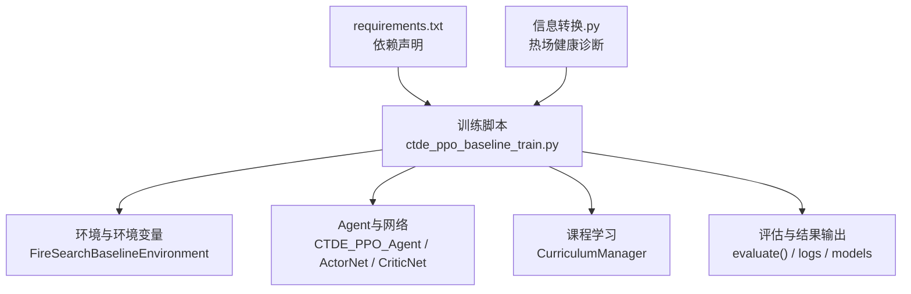
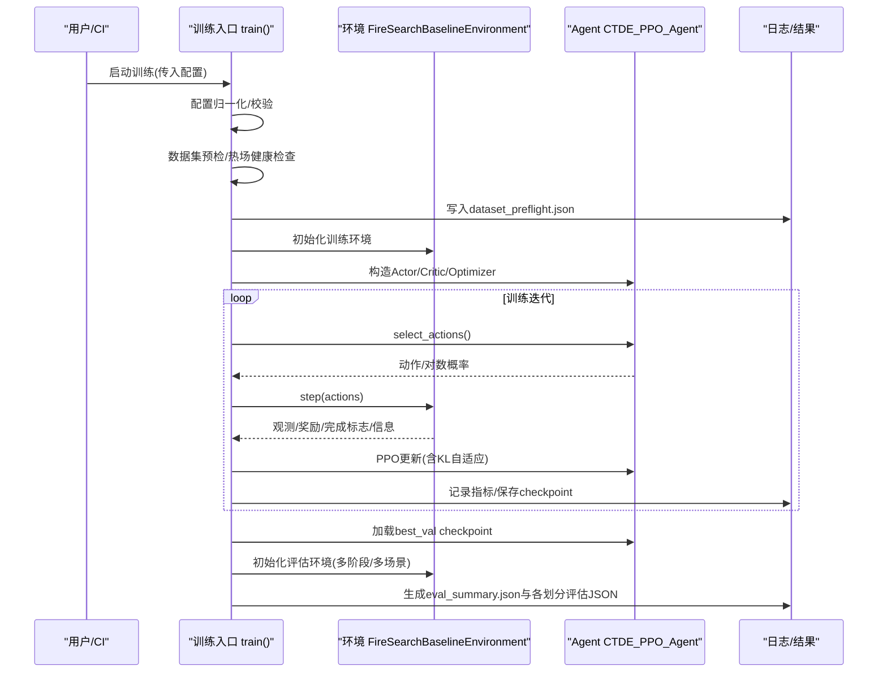
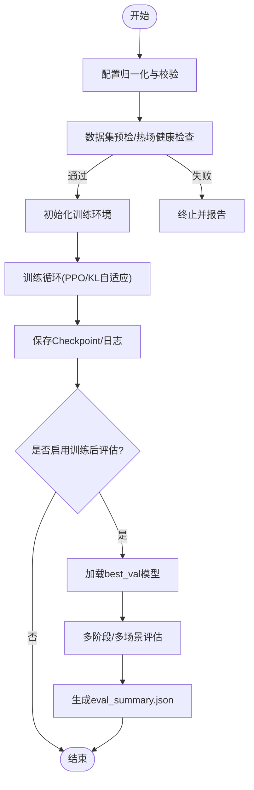
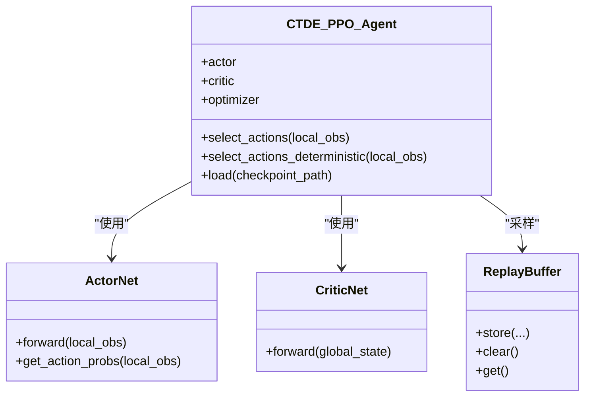
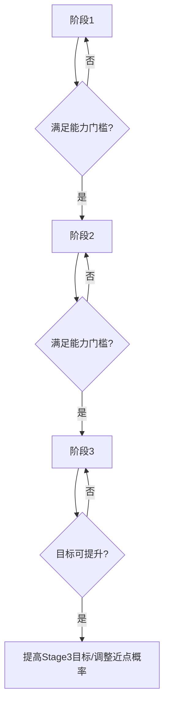
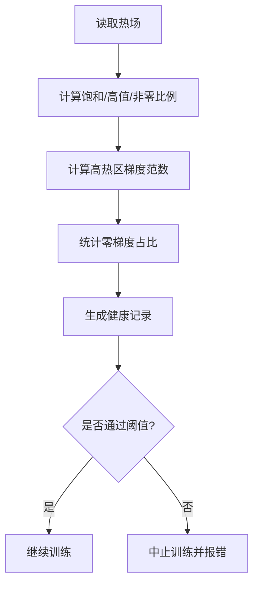
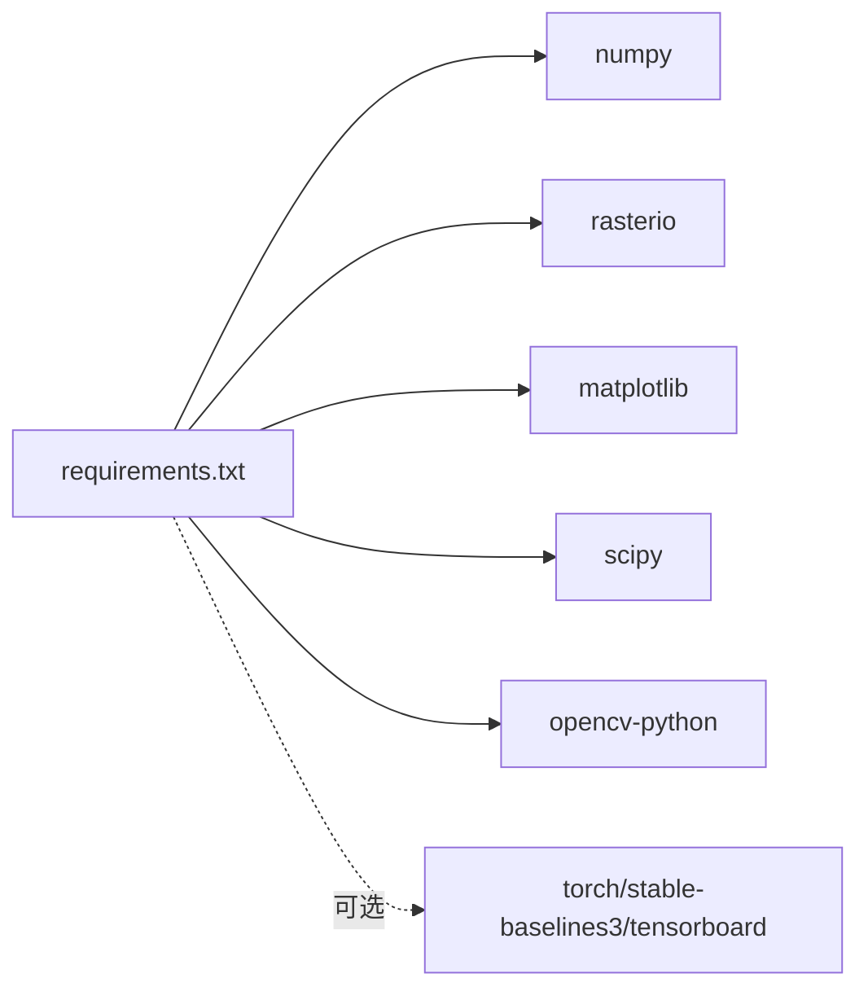

# 部署指南

<cite>
**本文引用的文件**   
- [environment_variables/requirements.txt](file://environment_variables/requirements.txt)
- [ctde_ppo_baseline_train.py](file://environment_variables/environment_variables/ctde_ppo_baseline_train.py)
- [信息转换.py](file://environment_variables/environment_variables/信息转换.py)
</cite>

## 目录
1. [简介](#简介)
2. [项目结构](#项目结构)
3. [核心组件](#核心组件)
4. [架构总览](#架构总览)
5. [详细组件分析](#详细组件分析)
6. [依赖关系分析](#依赖关系分析)
7. [性能考虑](#性能考虑)
8. [故障排查指南](#故障排查指南)
9. [结论](#结论)
10. [附录](#附录)

## 简介
本指南面向生产环境部署，覆盖以下方面：
- 运行环境与硬件要求（Python版本、操作系统兼容性、GPU/CPU）
- Docker容器化与镜像构建流程
- 模型导出与推理服务实现要点
- 分布式训练与负载均衡策略建议
- 性能监控、日志收集与错误告警配置
- CI/CD流水线与自动化测试集成
- 安全加固与权限管理最佳实践
- 故障恢复与灾难恢复方案

## 项目结构
仓库包含强化学习训练脚本、数据与输出产物等。与部署相关的关键位置如下：
- 依赖清单：environment_variables/requirements.txt
- 训练入口与主流程：environment_variables/environment_variables/ctde_ppo_baseline_train.py
- 热场健康诊断与预处理：environment_variables/environment_variables/信息转换.py

图表来源
- [ctde_ppo_baseline_train.py:1278-1467](file://environment_variables/environment_variables/ctde_ppo_baseline_train.py#L1278-L1467)
- [ctde_ppo_baseline_train.py:1689-1888](file://environment_variables/environment_variables/ctde_ppo_baseline_train.py#L1689-L1888)
- [信息转换.py:972-999](file://environment_variables/environment_variables/信息转换.py#L972-L999)

章节来源
- [ctde_ppo_baseline_train.py:1278-1467](file://environment_variables/environment_variables/ctde_ppo_baseline_train.py#L1278-L1467)
- [ctde_ppo_baseline_train.py:1689-1888](file://environment_variables/environment_variables/ctde_ppo_baseline_train.py#L1689-L1888)
- [信息转换.py:972-999](file://environment_variables/environment_variables/信息转换.py#L972-L999)

## 核心组件
- 训练主流程
  - 配置归一化与校验、数据集预检、热场健康检查、实验元数据写入、控制台日志双写、随机种子设置、环境初始化、Agent构造、训练循环、验证与保存、训练后评估与可视化。
- Agent与网络
  - ActorNet（动作头）、CriticNet（价值头）、ReplayBuffer、CTDE_PPO_Agent（含KL自适应学习率、PPO超参）。
- 课程学习
  - CurriculumManager（阶段切换、初始面积百分位阶梯、Stage3目标阶梯与近点概率退火）。
- 评估与结果
  - evaluate() 支持多阶段、多场景、确定性推理；输出eval_summary.json、各划分评估JSON、质量指标JSON等。

章节来源
- [ctde_ppo_baseline_train.py:1278-1467](file://environment_variables/environment_variables/ctde_ppo_baseline_train.py#L1278-L1467)
- [ctde_ppo_baseline_train.py:1689-1888](file://environment_variables/environment_variables/ctde_ppo_baseline_train.py#L1689-L1888)

## 架构总览
下图展示从训练到评估的端到端流程，以及关键产出物位置。

图表来源
- [ctde_ppo_baseline_train.py:1278-1467](file://environment_variables/environment_variables/ctde_ppo_baseline_train.py#L1278-L1467)
- [ctde_ppo_baseline_train.py:1689-1888](file://environment_variables/environment_variables/ctde_ppo_baseline_train.py#L1689-L1888)

## 详细组件分析

### 训练与评估流程
- 训练前检查
  - 边界校验与热场健康诊断，失败则中止训练，避免在异常数据上训练。
- 训练过程
  - 使用PPO算法，支持固定或基于KL的学习率自适应；维护滚动统计与质量指标。
- 训练后评估
  - 自动加载最佳验证模型，按最终划分集合执行评估，汇总为eval_summary.json。

图表来源
- [ctde_ppo_baseline_train.py:1278-1467](file://environment_variables/environment_variables/ctde_ppo_baseline_train.py#L1278-L1467)
- [ctde_ppo_baseline_train.py:1689-1888](file://environment_variables/environment_variables/ctde_ppo_baseline_train.py#L1689-L1888)

章节来源
- [ctde_ppo_baseline_train.py:1278-1467](file://environment_variables/environment_variables/ctde_ppo_baseline_train.py#L1278-L1467)
- [ctde_ppo_baseline_train.py:1689-1888](file://environment_variables/environment_variables/ctde_ppo_baseline_train.py#L1689-L1888)

### 模型导出与推理服务
- 模型导出
  - 训练过程中会保存多个checkpoint，并在训练后评估时加载“最佳验证”模型进行推理。
- 推理服务建议
  - 将最佳验证模型作为生产模型，封装为轻量HTTP/gRPC服务；在请求中传入观测向量，返回离散动作索引。
  - 推理路径参考：evaluate() 中的确定性选择逻辑与env.step交互。

图表来源
- [ctde_ppo_baseline_train.py:454-528](file://environment_variables/environment_variables/ctde_ppo_baseline_train.py#L454-L528)
- [ctde_ppo_baseline_train.py:531-561](file://environment_variables/environment_variables/ctde_ppo_baseline_train.py#L531-L561)
- [ctde_ppo_baseline_train.py:705-767](file://environment_variables/environment_variables/ctde_ppo_baseline_train.py#L705-L767)

章节来源
- [ctde_ppo_baseline_train.py:454-528](file://environment_variables/environment_variables/ctde_ppo_baseline_train.py#L454-L528)
- [ctde_ppo_baseline_train.py:531-561](file://environment_variables/environment_variables/ctde_ppo_baseline_train.py#L531-L561)
- [ctde_ppo_baseline_train.py:705-767](file://environment_variables/environment_variables/ctde_ppo_baseline_train.py#L705-L767)

### 课程学习与难度调度
- 初始面积百分位阶梯：随能力逐步提升初始起火规模。
- Stage3目标阶梯：以覆盖率、成功率、零超时率等指标驱动目标上调。
- 近点概率退火：在第三阶段逐步降低靠近热点的概率，促进探索。

图表来源
- [ctde_ppo_baseline_train.py:583-709](file://environment_variables/environment_variables/ctde_ppo_baseline_train.py#L583-L709)

章节来源
- [ctde_ppo_baseline_train.py:583-709](file://environment_variables/environment_variables/ctde_ppo_baseline_train.py#L583-L709)

### 热场健康诊断
- 训练前对热场进行健康检查，包括饱和比例、高值比例、非零比例、高热区零梯度比例等，确保语义层正常。
- 检查结果写入dataset_preflight.json，若失败则中止训练。

图表来源
- [信息转换.py:972-999](file://environment_variables/environment_variables/信息转换.py#L972-L999)
- [ctde_ppo_baseline_train.py:1299-1315](file://environment_variables/environment_variables/ctde_ppo_baseline_train.py#L1299-L1315)

章节来源
- [信息转换.py:972-999](file://environment_variables/environment_variables/信息转换.py#L972-L999)
- [ctde_ppo_baseline_train.py:1299-1315](file://environment_variables/environment_variables/ctde_ppo_baseline_train.py#L1299-L1315)

## 依赖关系分析
- Python生态依赖
  - numpy、rasterio、matplotlib、scipy、opencv-python为核心依赖；torch等用于RL训练的可选依赖在清单中以注释形式存在。
- 运行时依赖
  - 训练脚本依赖PyTorch与上述科学计算库；推理服务同样需要这些依赖。

图表来源
- [environment_variables/requirements.txt:1-13](file://environment_variables/requirements.txt#L1-L13)

章节来源
- [environment_variables/requirements.txt:1-13](file://environment_variables/requirements.txt#L1-L13)

## 性能考虑
- 设备选择
  - 训练脚本支持自动检测CUDA可用性，优先使用GPU；无GPU时回退CPU。
- 批大小与更新步长
  - 默认批大小较大，需根据显存容量调整；最小批大小与最小更新批大小有下限保护。
- KL自适应学习率
  - 通过指数移动平均跟踪KL，动态缩放actor学习率，有助于稳定训练。
- I/O与日志
  - 控制台日志双写到文件；训练后生成大量JSON/NPZ结果，建议使用高效存储介质。

章节来源
- [ctde_ppo_baseline_train.py:751-767](file://environment_variables/environment_variables/ctde_ppo_baseline_train.py#L751-L767)
- [ctde_ppo_baseline_train.py:746-750](file://environment_variables/environment_variables/ctde_ppo_baseline_train.py#L746-L750)
- [ctde_ppo_baseline_train.py:782-793](file://environment_variables/environment_variables/ctde_ppo_baseline_train.py#L782-L793)

## 故障排查指南
- 训练提前终止
  - 检查dataset_preflight.json中的thermal_health记录与失败项，确认热场健康阈值是否被触发。
- 评估结果为空或未生成
  - 确认是否开启训练后评估开关，以及是否存在best_val checkpoint。
- 日志缺失
  - 确认控制台日志路径与输出目录权限；训练脚本会将stdout/stderr双写到指定文件。

章节来源
- [ctde_ppo_baseline_train.py:1299-1315](file://environment_variables/environment_variables/ctde_ppo_baseline_train.py#L1299-L1315)
- [ctde_ppo_baseline_train.py:1706-1772](file://environment_variables/environment_variables/ctde_ppo_baseline_train.py#L1706-L1772)

## 结论
本项目提供完整的训练与评估流程，内置数据预检与热场健康检查，具备稳定的PPO训练与KL自适应学习率机制。生产部署应重点关注依赖环境一致性、GPU资源规划、模型导出与服务化封装、以及完善的监控与告警体系。

## 附录

### 生产环境部署要求
- Python版本
  - 建议使用Python 3.9+（与numpy>=1.21.0、rasterio>=1.3.0、opencv-python>=4.8.0兼容）。
- 操作系统
  - Linux发行版（推荐Ubuntu 20.04/22.04），Windows亦可但需注意CUDA工具链与驱动匹配。
- 硬件资源
  - CPU：至少4核，内存≥16GB（小批量/小规模场景）。
  - GPU：NVIDIA GPU（显存≥8GB，推荐16GB+）以支撑默认批大小与大规模场景；无GPU时可降级至CPU但速度显著下降。
- 软件依赖
  - 依据requirements.txt安装核心依赖；如需强化学习训练，请取消注释并安装torch等可选依赖。

章节来源
- [environment_variables/requirements.txt:1-13](file://environment_variables/requirements.txt#L1-L13)

### Docker容器化部署与镜像构建
- 基础镜像
  - 使用官方Python镜像（如python:3.10-slim），并安装系统级依赖（如libgl1、libgomp1等）以满足OpenCV与科学计算库需求。
- 依赖安装
  - 将requirements.txt复制到镜像内，执行pip install -r requirements.txt；如需训练，取消注释并安装torch等。
- 应用打包
  - 复制训练脚本与数据目录到镜像工作目录；暴露必要端口（若提供推理服务）。
- 环境变量
  - 通过环境变量注入数据路径、输出目录、随机种子、观察/奖励配置等，便于不同环境复用同一镜像。
- 启动命令
  - 训练：python ctde_ppo_baseline_train.py --config ...
  - 推理：封装HTTP/gRPC服务，加载best_val模型，接收观测并返回动作。

[本节为通用指导，不直接分析具体文件]

### 模型导出与推理服务实现
- 模型导出
  - 使用训练产出的best_val checkpoint；在推理服务启动时加载该权重。
- 推理接口
  - 输入：局部观测向量（维度由observation_profile决定）。
  - 输出：离散动作索引（由action_dim决定）。
- 服务化建议
  - 使用异步框架（如FastAPI）承载并发请求；对观测做标准化处理，保证与训练一致。
  - 增加健康检查端点与指标上报（延迟、吞吐、错误率）。

章节来源
- [ctde_ppo_baseline_train.py:1719-1742](file://environment_variables/environment_variables/ctde_ppo_baseline_train.py#L1719-L1742)
- [ctde_ppo_baseline_train.py:1813-1888](file://environment_variables/environment_variables/ctde_ppo_baseline_train.py#L1813-L1888)

### 分布式训练与负载均衡策略
- 分布式训练
  - 当前脚本未内置多机多卡分布式；可在外部使用Ray/Torch Distributed包装训练循环，或使用并行进程分别训练不同seed/配置。
- 负载均衡（推理侧）
  - 使用反向代理（Nginx/Ingress）对多个推理实例进行轮询或加权分配；结合Kubernetes HPA基于CPU/GPU/延迟指标自动扩缩容。
- 状态共享
  - 若采用参数服务器模式，需将模型权重同步至共享存储（对象存储/NFS），各worker定期拉取最新权重。

[本节为通用指导，不直接分析具体文件]

### 性能监控、日志收集与错误告警
- 指标采集
  - 训练期：记录任务得分、覆盖率、成功率、KL、裁剪分数、学习率等；训练后生成model_quality_metrics.json。
  - 推理期：暴露Prometheus指标（请求计数、延迟分位数、错误率、队列长度）。
- 日志收集
  - 训练控制台日志双写到文件；建议接入集中式日志系统（ELK/Loki）。
- 告警规则
  - 训练：热场健康失败、KL超限率过高、收敛效率低于阈值。
  - 推理：P99延迟超过SLA、错误率高于阈值、健康检查失败。

章节来源
- [ctde_ppo_baseline_train.py:1689-1705](file://environment_variables/environment_variables/ctde_ppo_baseline_train.py#L1689-L1705)
- [ctde_ppo_baseline_train.py:1299-1315](file://environment_variables/environment_variables/ctde_ppo_baseline_train.py#L1299-L1315)

### CI/CD流水线与自动化测试集成
- 流水线阶段
  - 代码检查与依赖安装 → 单元测试 → 小规模训练回归 → 模型评估与指标阈值检查 → 构建镜像 → 推送制品库。
- 自动化测试
  - 使用现有测试脚本（如test_area_percent_curriculum.py）验证配置归一化与维度映射；新增端到端小样本训练与评估用例。
- 制品管理
  - 将best_val模型与评估摘要归档至制品库，供后续推理服务拉取。

章节来源
- [ctde_ppo_baseline_train.py:1706-1772](file://environment_variables/environment_variables/ctde_ppo_baseline_train.py#L1706-L1772)

### 安全加固与权限管理
- 镜像安全
  - 使用最小化基础镜像，定期扫描漏洞；仅安装必要依赖。
- 密钥与配置
  - 敏感配置（如数据路径、访问凭证）通过环境变量或密钥管理服务注入，禁止硬编码。
- 运行权限
  - 以非root用户运行容器；限制文件系统读写范围，仅开放必要端口。
- 网络安全
  - 使用TLS终止于网关；内部服务间通信启用mTLS。

[本节为通用指导，不直接分析具体文件]

### 故障恢复与灾难恢复
- 训练断点续训
  - 利用保存的checkpoint与日志，从最近一次保存点恢复训练。
- 数据与模型备份
  - 定期备份dataset_index.json、模型权重与评估摘要；异地冗余存储。
- 服务高可用
  - 多副本部署推理服务；健康检查失败自动剔除；灰度发布与快速回滚。
- 灾难恢复演练
  - 定期演练从备份恢复服务与模型，验证RTO/RPO目标达成。

[本节为通用指导，不直接分析具体文件]