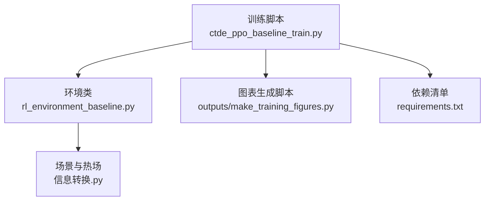
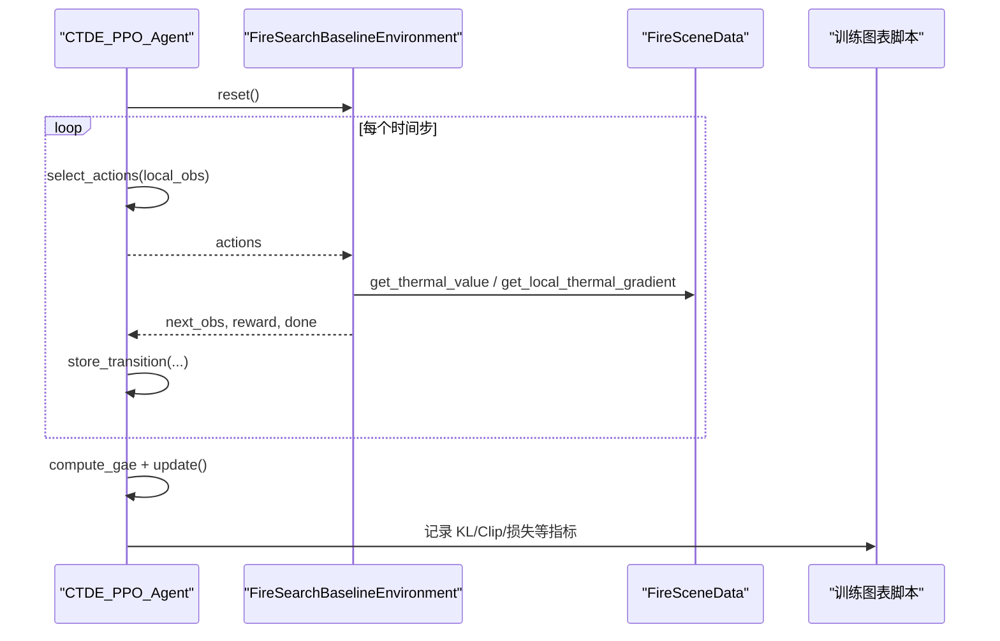
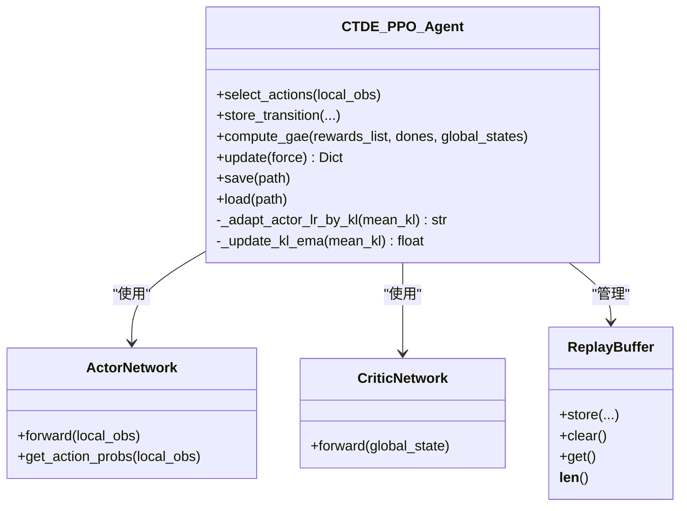
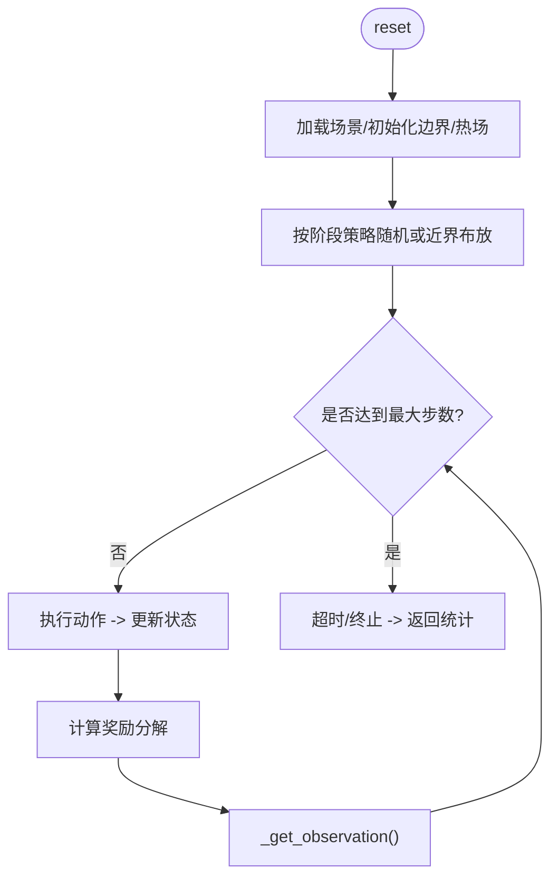
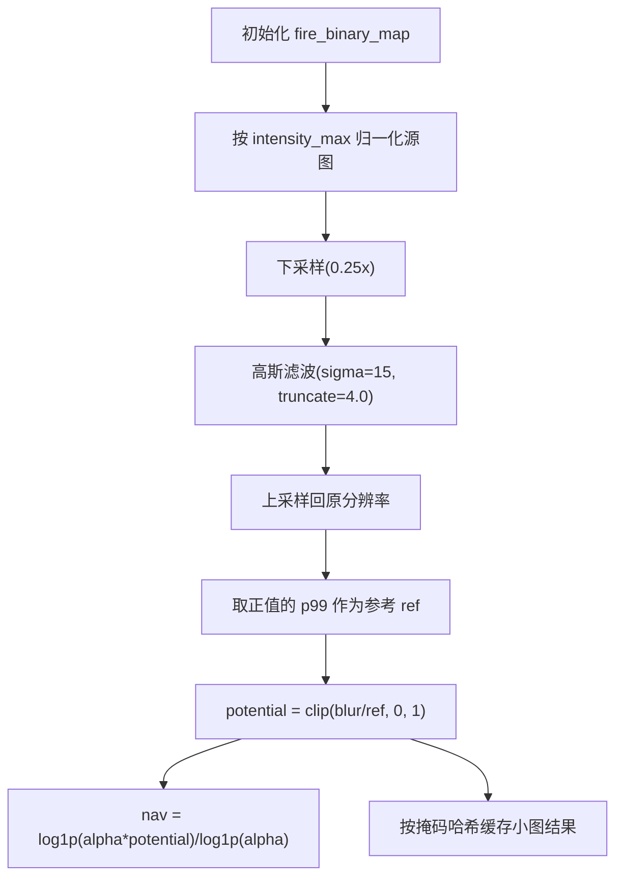
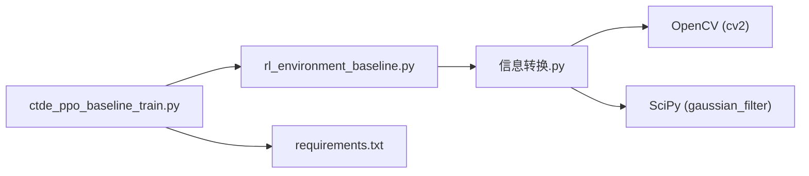
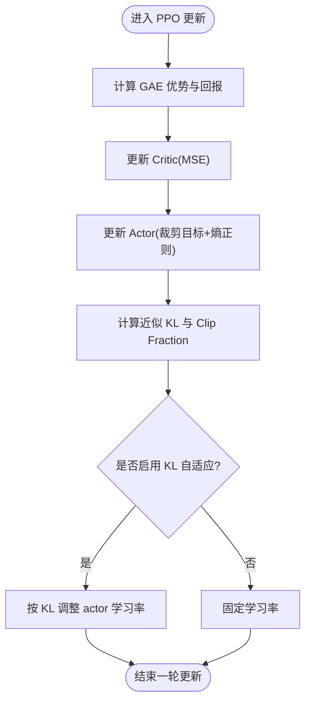
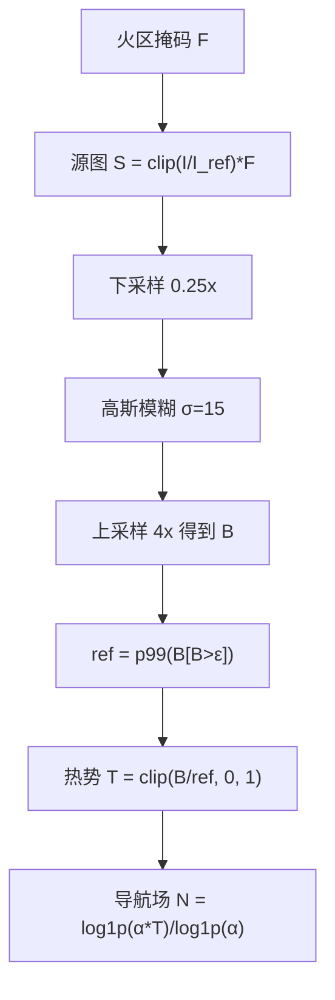

# 附录

<cite>
**本文引用的文件**   
- [ctde_ppo_baseline_train.py](file://environment_variables/environment_variables/ctde_ppo_baseline_train.py)
- [rl_environment_baseline.py](file://environment_variables/environment_variables/rl_environment_baseline.py)
- [信息转换.py](file://environment_variables/environment_variables/信息转换.py)
- [2026-07-06-thermal-field-optimization.md](file://docs/superpowers/plans/2026-07-06-thermal-field-optimization.md)
- [requirements.txt](file://environment_variables/requirements.txt)
</cite>

## 目录
1. [简介](#简介)
2. [项目结构](#项目结构)
3. [核心组件](#核心组件)
4. [架构总览](#架构总览)
5. [详细组件分析](#详细组件分析)
6. [依赖关系分析](#依赖关系分析)
7. [性能考量](#性能考量)
8. [故障排查指南](#故障排查指南)
9. [结论](#结论)
10. [附录：数学推导与参数调优](#附录数学推导与参数调优)
11. [术语表](#术语表)
12. [版本历史与技术演进路线图](#版本历史与技术演进路线图)
13. [许可证与版权声明](#许可证与版权声明)
14. [参考文献与研究论文](#参考文献与研究论文)

## 简介
本附录面向希望深入理解并复现本项目中“CTDE-PPO 多无人机火场边界搜索”的读者，提供完整的数学基础、热场计算模型、参数调优指南、术语表、版本演进路线及参考材料。文档严格基于仓库内源码与计划文档进行归纳与提炼，避免臆造信息。

## 项目结构
围绕训练脚本、环境实现与数据/热场处理三大模块组织：
- 训练与算法：CTDE-PPO 基线训练脚本（含网络、回放缓冲、课程学习、评估与可视化）
- 环境：Gymnasium 风格的多机协同火场边界搜索环境（观测、动作、奖励、阶段控制）
- 数据与热场：场景加载、栅格归一化、边界提取、热势场构建与缓存优化

**图示来源**
- [ctde_ppo_baseline_train.py:1-120](file://environment_variables/environment_variables/ctde_ppo_baseline_train.py#L1-L120)
- [rl_environment_baseline.py:1-120](file://environment_variables/environment_variables/rl_environment_baseline.py#L1-L120)
- [信息转换.py:1-120](file://environment_variables/environment_variables/信息转换.py#L1-L120)
- [requirements.txt:1-13](file://environment_variables/requirements.txt#L1-L13)

**章节来源**
- [ctde_ppo_baseline_train.py:1-120](file://environment_variables/environment_variables/ctde_ppo_baseline_train.py#L1-L120)
- [rl_environment_baseline.py:1-120](file://environment_variables/environment_variables/rl_environment_baseline.py#L1-L120)
- [信息转换.py:1-120](file://environment_variables/environment_variables/信息转换.py#L1-L120)
- [requirements.txt:1-13](file://environment_variables/requirements.txt#L1-L13)

## 核心组件
- CTDE-PPO 智能体：Actor/Critic 网络、KL 自适应学习率、GAE 优势估计、PPO 裁剪目标、熵正则
- Gymnasium 环境：局部观测/全局状态、离散动作空间、分阶段课程学习、多种奖励配置
- 场景与热场：FARSITE 场景加载、边界提取、强度归一化、高斯平滑热势场、低分辨率缓存加速

**章节来源**
- [ctde_ppo_baseline_train.py:460-535](file://environment_variables/environment_variables/ctde_ppo_baseline_train.py#L460-L535)
- [ctde_ppo_baseline_train.py:759-991](file://environment_variables/environment_variables/ctde_ppo_baseline_train.py#L759-L991)
- [rl_environment_baseline.py:21-158](file://environment_variables/environment_variables/rl_environment_baseline.py#L21-L158)
- [信息转换.py:219-322](file://environment_variables/environment_variables/信息转换.py#L219-L322)
- [信息转换.py:759-819](file://environment_variables/environment_variables/信息转换.py#L759-L819)

## 架构总览
下图展示训练主循环中的关键交互：Agent 与环境交互收集轨迹，随后执行 PPO 更新；环境在每步调用场景数据以获取热势与边界信息。

**图示来源**
- [ctde_ppo_baseline_train.py:849-991](file://environment_variables/environment_variables/ctde_ppo_baseline_train.py#L849-L991)
- [rl_environment_baseline.py:565-658](file://environment_variables/environment_variables/rl_environment_baseline.py#L565-L658)
- [信息转换.py:601-619](file://environment_variables/environment_variables/信息转换.py#L601-L619)
- [信息转换.py:759-819](file://environment_variables/environment_variables/信息转换.py#L759-L819)

## 详细组件分析

### CTDE-PPO 智能体
- Actor 网络：多层全连接+LayerNorm+残差块，输出离散动作对数概率
- Critic 网络：多层全连接+LayerNorm，输出全局价值标量
- 回放缓冲：按回合累积 local_obs/global_state/actions/log_probs/rewards/dones
- GAE 优势估计：使用 critic 值函数与折扣因子 λ 计算优势与回报
- PPO 更新：裁剪目标 + 熵正则 + 梯度裁剪 + 可选 KL 自适应学习率

**图示来源**
- [ctde_ppo_baseline_train.py:460-535](file://environment_variables/environment_variables/ctde_ppo_baseline_train.py#L460-L535)
- [ctde_ppo_baseline_train.py:537-567](file://environment_variables/environment_variables/ctde_ppo_baseline_train.py#L537-L567)
- [ctde_ppo_baseline_train.py:759-991](file://environment_variables/environment_variables/ctde_ppo_baseline_train.py#L759-L991)

**章节来源**
- [ctde_ppo_baseline_train.py:460-535](file://environment_variables/environment_variables/ctde_ppo_baseline_train.py#L460-L535)
- [ctde_ppo_baseline_train.py:537-567](file://environment_variables/environment_variables/ctde_ppo_baseline_train.py#L537-L567)
- [ctde_ppo_baseline_train.py:759-991](file://environment_variables/environment_variables/ctde_ppo_baseline_train.py#L759-L991)

### Gymnasium 环境（多机火场边界搜索）
- 观测空间：本地观测（位置、电量、地形/风/强度特征、热梯度、动量、相机方向等），全局状态（覆盖率、电池均值/最小值、团队质心/分散、距火距离、步长比例、已访问密度、课程阶段等）
- 动作空间：离散 5 动作（上下左右静止）
- 奖励配置：边界发现、覆盖率增量、预边界探索引导、超时惩罚、重复/空闲/拥挤惩罚等
- 课程学习：三阶段目标（成功率、覆盖率、零覆盖超时率）与 near_prob 退火

**图示来源**
- [rl_environment_baseline.py:159-188](file://environment_variables/environment_variables/rl_environment_baseline.py#L159-L188)
- [rl_environment_baseline.py:331-360](file://environment_variables/environment_variables/rl_environment_baseline.py#L331-L360)
- [rl_environment_baseline.py:692-767](file://environment_variables/environment_variables/rl_environment_baseline.py#L692-L767)
- [rl_environment_baseline.py:565-658](file://environment_variables/environment_variables/rl_environment_baseline.py#L565-L658)

**章节来源**
- [rl_environment_baseline.py:21-158](file://environment_variables/environment_variables/rl_environment_baseline.py#L21-L158)
- [rl_environment_baseline.py:331-360](file://environment_variables/environment_variables/rl_environment_baseline.py#L331-L360)
- [rl_environment_baseline.py:565-658](file://environment_variables/environment_variables/rl_environment_baseline.py#L565-L658)
- [rl_environment_baseline.py:692-767](file://environment_variables/environment_variables/rl_environment_baseline.py#L692-L767)

### 场景与热场计算
- 场景加载：读取静态地图与核心栅格，派生风场/地形/燃料等，计算归一化参数
- 边界提取：基于强度阈值与时间切片选择初始边界点集
- 热势场构建：按场景鲁棒归一化 → 下采样 + 高斯模糊 → 上采样回原分辨率 → 百分位参考值归一化到 [0,1] → 可选导航场（对数压缩）
- 缓存优化：按掩码哈希缓存小图模糊结果，按需上采样，显著降低计算开销

**图示来源**
- [信息转换.py:759-819](file://environment_variables/environment_variables/信息转换.py#L759-L819)
- [2026-07-06-thermal-field-optimization.md:1-142](file://docs/superpowers/plans/2026-07-06-thermal-field-optimization.md#L1-L142)

**章节来源**
- [信息转换.py:219-322](file://environment_variables/environment_variables/信息转换.py#L219-L322)
- [信息转换.py:684-721](file://environment_variables/environment_variables/信息转换.py#L684-L721)
- [信息转换.py:759-819](file://environment_variables/environment_variables/信息转换.py#L759-L819)
- [2026-07-06-thermal-field-optimization.md:1-142](file://docs/superpowers/plans/2026-07-06-thermal-field-optimization.md#L1-L142)

## 依赖关系分析
- 训练脚本依赖环境与数据模块
- 环境依赖场景数据与热场计算
- 热场优化引入 OpenCV 与 SciPy 的高斯滤波与重采样能力
- 依赖清单包含核心库与可选深度学习依赖

**图示来源**
- [ctde_ppo_baseline_train.py:1-35](file://environment_variables/environment_variables/ctde_ppo_baseline_train.py#L1-L35)
- [rl_environment_baseline.py:1-20](file://environment_variables/environment_variables/rl_environment_baseline.py#L1-L20)
- [信息转换.py:1-14](file://environment_variables/environment_variables/信息转换.py#L1-L14)
- [requirements.txt:1-13](file://environment_variables/requirements.txt#L1-L13)

**章节来源**
- [ctde_ppo_baseline_train.py:1-35](file://environment_variables/environment_variables/ctde_ppo_baseline_train.py#L1-L35)
- [rl_environment_baseline.py:1-20](file://environment_variables/environment_variables/rl_environment_baseline.py#L1-L20)
- [信息转换.py:1-14](file://environment_variables/environment_variables/信息转换.py#L1-L14)
- [requirements.txt:1-13](file://environment_variables/requirements.txt#L1-L13)

## 性能考量
- 热场计算优化：采用四分之一分辨率下采样 + 高斯模糊 + 上采样，结合掩码哈希缓存，保持数值近似的同时显著提升速度
- 训练稳定性：KL 自适应学习率与 EMA 监控有助于稳定 PPO 更新；梯度裁剪与优势标准化提升收敛性
- 内存与吞吐：批量大小与 mini-batch 设置影响 GPU 利用率与显存占用；建议根据硬件调整 batch_size 与 ppo_epochs

[本节为通用指导，不直接分析具体文件]

## 故障排查指南
- 场景无效或缺失边界：当 t=0 无有效火边界时抛出异常，需检查数据集索引与栅格路径
- 热场未初始化：若 fire_binary_map 未设置则无法计算热场，需确保先初始化边界
- 形状不一致：栅格与静态地图尺寸不匹配会报错，需统一分辨率与投影
- 风场缺失：若无 ASC 风场文件，将回退解析 weather_stream 或元数据中的风参数

**章节来源**
- [信息转换.py:684-693](file://environment_variables/environment_variables/信息转换.py#L684-L693)
- [信息转换.py:759-771](file://environment_variables/environment_variables/信息转换.py#L759-L771)
- [信息转换.py:525-532](file://environment_variables/environment_variables/信息转换.py#L525-L532)
- [信息转换.py:473-490](file://environment_variables/environment_variables/信息转换.py#L473-L490)

## 结论
本项目实现了基于 CTDE-PPO 的多无人机火场边界搜索系统，具备完善的课程学习、KL 自适应学习率与高效的热场计算管线。通过模块化设计与严格的数值处理，系统在训练稳定性与推理效率方面均表现良好。

[本节为总结性内容，不直接分析具体文件]

## 附录：数学推导与参数调优

### CTDE-PPO 数学基础
- 目标函数（带裁剪与熵正则）：
  - L^CLIP(θ) = E_t[min(r_t(θ)·Â_t, clip(r_t(θ), 1−ε, 1+ε)·Â_t)] − β·H(π_θ)
  - r_t(θ) = π_θ(a_t|s_t)/π_{old}(a_t|s_t)
  - H(π_θ) 为策略熵，β 为熵系数
- 优势估计（GAE）：
  - δ_t = r_t + γ·V(s_{t+1})·(1−d_t) − V(s_t)
  - A_t^{GAE} = Σ_{l=0}^{∞} (γλ)^l · δ_{t+l}
- 价值函数损失：
  - L^VF = MSE(V_φ(s_t), R_t)
- KL 自适应学习率：
  - 基于近似 KL 的指数衰减/增长因子调节 actor 学习率，目标 KL 作为参考

**图示来源**
- [ctde_ppo_baseline_train.py:889-991](file://environment_variables/environment_variables/ctde_ppo_baseline_train.py#L889-L991)

**章节来源**
- [ctde_ppo_baseline_train.py:889-991](file://environment_variables/environment_variables/ctde_ppo_baseline_train.py#L889-L991)

### 热场计算的数学模型
- 输入：当前火区二值掩码 F(x,y)，强度栅格 I(x,y)
- 归一化源图：S(x,y) = clip(I(x,y)/I_ref, 0, 1)·F(x,y)
- 下采样与模糊：S' = blur(downsample(S, 0.25), σ=15)
- 上采样：B(x,y) = upsample(S', 4x)
- 参考值：ref = p99(B[B > ε])
- 热势：T(x,y) = clip(B(x,y)/ref, 0, 1)
- 导航场：N(x,y) = log(1+α·T(x,y))/log(1+α)

**图示来源**
- [信息转换.py:759-819](file://environment_variables/environment_variables/信息转换.py#L759-L819)

**章节来源**
- [信息转换.py:759-819](file://environment_variables/environment_variables/信息转换.py#L759-L819)

### 参数调优指南（推荐值与策略）
- 学习率
  - Actor 初始 lr：2e-4；Critic 初始 lr：5e-4
  - KL 自适应模式：fixed 或 kl；target KL：~0.01；EMA β：0.9；lr 缩放 α：0.1
  - 策略：观察 KL 曲线与 clip fraction，若 KL 持续高于 target，适当降低 actor lr 或增大 clip_epsilon
- 网络结构
  - Actor：隐藏层 256×4 + LayerNorm + 残差；Action head 128→动作维度
  - Critic：隐藏层 384→192→160 + LayerNorm；Value head 160→1
  - 策略：若任务复杂度高，可适度增加隐藏维或层数，但需关注过拟合与训练时长
- 奖励权重
  - 边界发现奖励：随阶段递减（阶段1:5.0，阶段2:3.0，阶段3:2.0）
  - 覆盖率增量权重：40.0，上限 2.0
  - 预边界探索引导：弱奖励，基于热势增量
  - 超时惩罚：与覆盖率缺口线性相关，零覆盖额外惩罚
  - 策略：若覆盖率提升缓慢，可适当提高覆盖率增量权重或减少重复/拥挤惩罚
- 其他超参
  - gamma：0.99；gae_lambda：0.95；clip_epsilon：0.2；entropy_coef：0.01；value_coef：0.5
  - batch_size：4096；ppo_epochs：4；max_grad_norm：0.5
  - 课程学习：near_prob 阶梯式退火，目标覆盖率逐步提升

**章节来源**
- [ctde_ppo_baseline_train.py:98-158](file://environment_variables/environment_variables/ctde_ppo_baseline_train.py#L98-L158)
- [ctde_ppo_baseline_train.py:759-991](file://environment_variables/environment_variables/ctde_ppo_baseline_train.py#L759-L991)
- [rl_environment_baseline.py:692-767](file://environment_variables/environment_variables/rl_environment_baseline.py#L692-L767)

## 术语表
- CTDE：集中训练去中心化执行（Centralized Training Decentralized Execution）
- PPO：近端策略优化（Proximal Policy Optimization）
- GAE：广义优势估计（Generalized Advantage Estimation）
- KL：Kullback-Leibler 散度，衡量新旧策略差异
- 热势场：反映火场强度的平滑势函数，用于引导搜索
- 课程学习：渐进式难度提升的训练策略
- 边界覆盖率：已发现的火场边界点占全部边界点的比例
- 零覆盖超时：在最大步数内未发现任何边界的终止事件

[本节为概念解释，不直接分析具体文件]

## 版本历史与技术演进路线图
- 热场优化计划（2026-07-06）
  - 目标：在保证输出一致性的前提下降低热场计算耗时
  - 方法：四分之一分辨率下采样 + 高斯模糊 + 掩码哈希缓存 + 上采样重建
  - 验证：回归测试、精度对比（MAE ≤ 0.5）、速度提升（≥ 20x）、训练冒烟测试
- 后续演进建议
  - 引入更稳健的归一化策略（如动态分位数）
  - 支持多尺度热势融合（不同 σ 组合）
  - 扩展课程学习至更多阶段与指标（如风险感知）

**章节来源**
- [2026-07-06-thermal-field-optimization.md:1-142](file://docs/superpowers/plans/2026-07-06-thermal-field-optimization.md#L1-L142)

## 许可证与版权声明
- 本仓库未提供明确的许可证文件，默认保留所有权利
- 如需商用或二次分发，请联系项目维护者获取授权

[本节为通用声明，不直接分析具体文件]

## 参考文献与研究论文
- Schulman et al., Proximal Policy Optimization Algorithms, 2017
- Lillicrap et al., Continuous Control with Deep Reinforcement Learning, 2015
- Mnih et al., Human-level control through deep reinforcement learning, 2015
- Haarnoja et al., Soft Actor-Critic: Off-Policy Maximum Entropy Deep RL, 2018
- FARSITE 用户手册与科学文献（用于火场模拟与栅格数据背景）

[本节为外部参考，不直接分析具体文件]