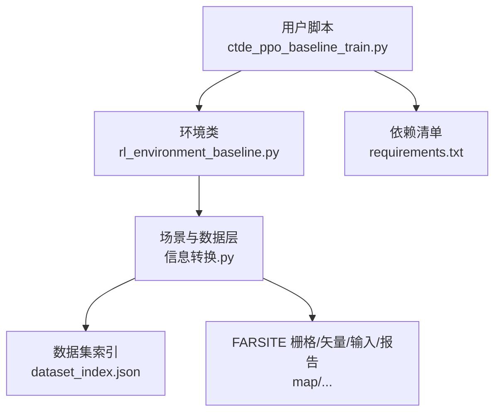
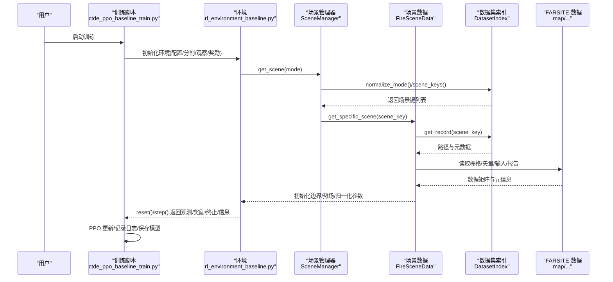
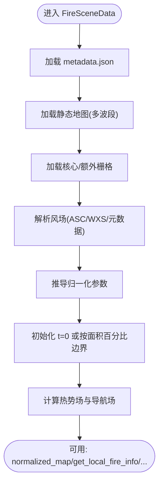
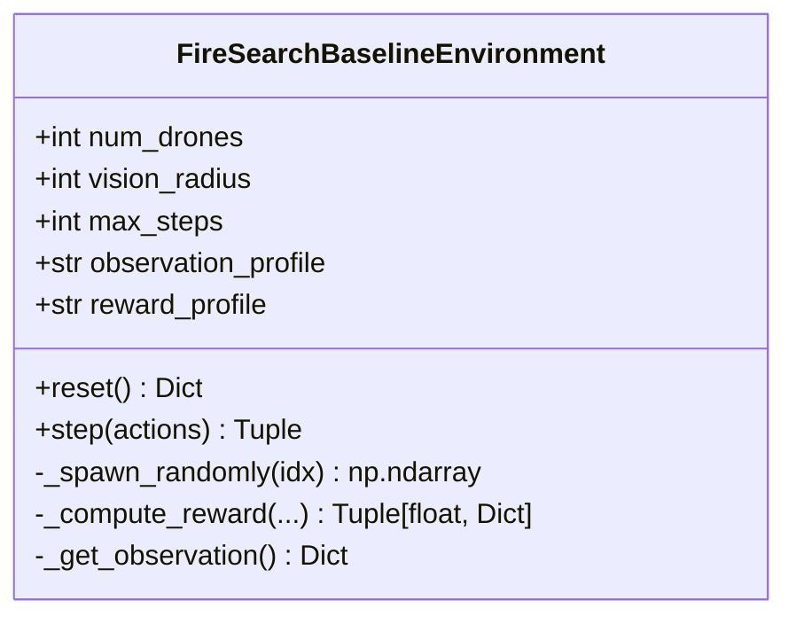
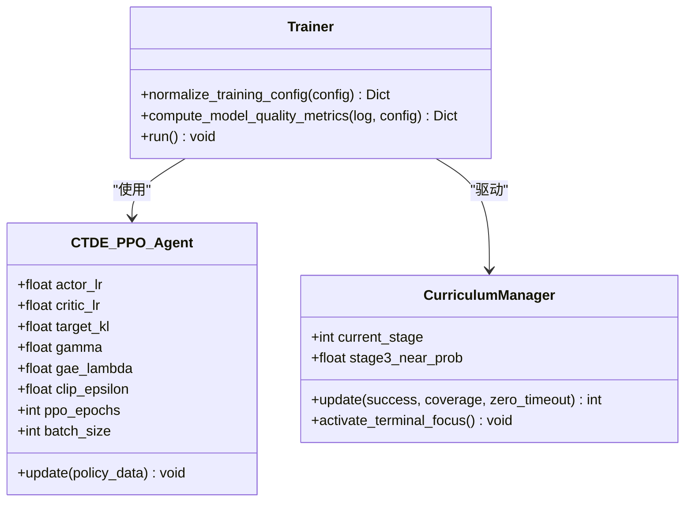
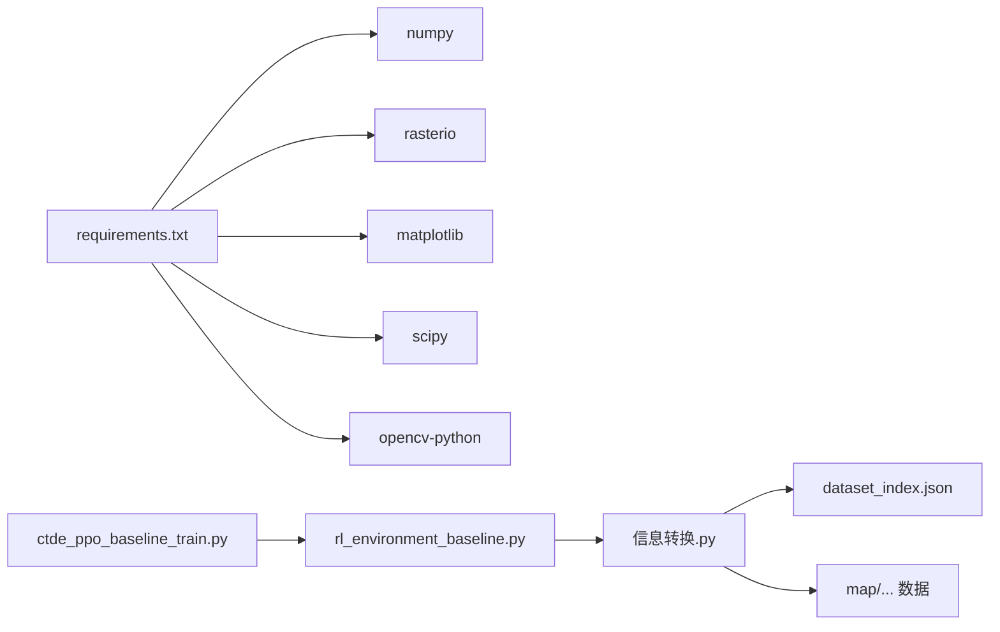

# 快速开始指南

<cite>
**本文引用的文件**   
- [requirements.txt](file://environment_variables/requirements.txt)
- [ctde_ppo_baseline_train.py](file://environment_variables/environment_variables/ctde_ppo_baseline_train.py)
- [rl_environment_baseline.py](file://environment_variables/environment_variables/rl_environment_baseline.py)
- [信息转换.py](file://environment_variables/environment_variables/信息转换.py)
- [dataset_index.json](file://environment_variables/environment_variables/dataset/dataset_index.json)
- [metadata.json](file://map/Train/1/scene1/metadata.json)
- [test_fire_scene_data.py](file://environment_variables/environment_variables/test_fire_scene_data.py)
- [test_thermal_field_optimization.py](file://environment_variables/environment_variables/test_thermal_field_optimization.py)
</cite>

## 目录
1. [简介](#简介)
2. [项目结构](#项目结构)
3. [核心组件](#核心组件)
4. [架构总览](#架构总览)
5. [详细组件分析](#详细组件分析)
6. [依赖关系分析](#依赖关系分析)
7. [性能与硬件建议](#性能与硬件建议)
8. [故障排除指南](#故障排除指南)
9. [结论](#结论)
10. [附录：最小可运行示例与命令](#附录最小可运行示例与命令)

## 简介
本指南面向新用户，帮助你在最短时间内完成环境搭建、数据准备、训练与结果查看。项目基于 FARSITE 仿真场景，提供多无人机边界搜索的强化学习环境（CTDE-PPO），并内置数据集索引与场景加载器，支持训练/验证/泛化/压力四类划分。

## 项目结构
- 环境与依赖
  - environment_variables/requirements.txt：列出核心依赖（numpy、rasterio、matplotlib、scipy、opencv-python）与可选依赖（torch、stable-baselines3、tensorboard）。
- 数据与索引
  - environment_variables/environment_variables/dataset/dataset_index.json：定义 source_root、schema、splits、raster_files 与各 scene 的路径映射。
  - map/...：包含 Train/Validation/Generalization/Stress 等划分的场景目录，每个场景含 inputs/rasters/vectors/reports 及 metadata.json。
- 代码与脚本
  - environment_variables/environment_variables/信息转换.py：数据集索引、场景加载、归一化、热场计算、边界检测、风场处理等核心逻辑。
  - environment_variables/environment_variables/rl_environment_baseline.py：Gymnasium 风格的基线环境，封装观测、动作、奖励与课程学习参数。
  - environment_variables/environment_variables/ctde_ppo_baseline_train.py：CTDE-PPO 训练主循环、配置归一化、质量评估指标、日志与保存策略。
  - environment_variables/environment_variables/test_*：单元测试，用于验证数据加载、观测形状、奖励分解、热场健康诊断等。

图示来源
- [ctde_ppo_baseline_train.py:1-120](file://environment_variables/environment_variables/ctde_ppo_baseline_train.py#L1-L120)
- [rl_environment_baseline.py:1-120](file://environment_variables/environment_variables/rl_environment_baseline.py#L1-L120)
- [信息转换.py:20-120](file://environment_variables/environment_variables/信息转换.py#L20-L120)
- [dataset_index.json:1-120](file://environment_variables/environment_variables/dataset/dataset_index.json#L1-L120)
- [requirements.txt:1-13](file://environment_variables/requirements.txt#L1-L13)

章节来源
- [requirements.txt:1-13](file://environment_variables/requirements.txt#L1-L13)
- [dataset_index.json:1-120](file://environment_variables/environment_variables/dataset/dataset_index.json#L1-L120)
- [ctde_ppo_baseline_train.py:1-120](file://environment_variables/environment_variables/ctde_ppo_baseline_train.py#L1-L120)
- [rl_environment_baseline.py:1-120](file://environment_variables/environment_variables/rl_environment_baseline.py#L1-L120)
- [信息转换.py:20-120](file://environment_variables/environment_variables/信息转换.py#L20-L120)

## 核心组件
- 数据集索引与场景加载
  - DatasetIndex：解析 dataset_index.json，统一模式别名（train/validation/generalization/stress），提供 scene_keys、get_record、required_file_paths 等接口。
  - FireSceneData：按 scene_key 加载静态地图、动态栅格、风场、元数据；推导归一化参数；构造 t=0 或按面积百分比的初始火边界；计算热势场与导航场；提供局部邻域与热力梯度查询。
  - SceneManager：按 split 随机采样场景，并提供跨实例共享缓存以减少重复 IO 与计算。
- 基线环境
  - FireSearchBaselineEnvironment：实现 Gymnasium 接口，支持多种 observation_profile 与 reward_profile；内置课程阶段控制、近/远起点的概率分布、电池与步数约束、边界覆盖与前沿探测奖励等。
- 训练主循环
  - CTDE_PPO_Agent：Actor/Critic 网络、PPO 更新、KL 自适应学习率、质量指标（收敛效率、稳定性、KL 稳定性）、滚动均值与阈值穿越统计。
  - normalize_training_config：对默认配置进行类型校验、范围裁剪与合并，输出标准化配置字典。

章节来源
- [信息转换.py:20-120](file://environment_variables/environment_variables/信息转换.py#L20-L120)
- [信息转换.py:219-340](file://environment_variables/environment_variables/信息转换.py#L219-L340)
- [信息转换.py:1282-1327](file://environment_variables/environment_variables/信息转换.py#L1282-L1327)
- [rl_environment_baseline.py:21-120](file://environment_variables/environment_variables/rl_environment_baseline.py#L21-L120)
- [ctde_ppo_baseline_train.py:98-158](file://environment_variables/environment_variables/ctde_ppo_baseline_train.py#L98-L158)
- [ctde_ppo_baseline_train.py:161-281](file://environment_variables/environment_variables/ctde_ppo_baseline_train.py#L161-L281)

## 架构总览
下图展示从训练脚本到环境、再到数据层的调用链路与数据流向。

图示来源
- [ctde_ppo_baseline_train.py:1-120](file://environment_variables/environment_variables/ctde_ppo_baseline_train.py#L1-L120)
- [rl_environment_baseline.py:1-120](file://environment_variables/environment_variables/rl_environment_baseline.py#L1-L120)
- [信息转换.py:1282-1327](file://environment_variables/environment_variables/信息转换.py#L1282-L1327)
- [信息转换.py:20-120](file://environment_variables/environment_variables/信息转换.py#L20-L120)
- [dataset_index.json:1-120](file://environment_variables/environment_variables/dataset/dataset_index.json#L1-L120)

## 详细组件分析

### 数据与场景加载（信息转换.py）
- 关键职责
  - 解析 dataset_index.json，构建绝对路径与必需文件清单。
  - 加载静态地图（DEM/坡度/坡向/燃料/冠层等）与动态栅格（强度/到达时间/蔓延方向/热量/树冠火等）。
  - 解析风场（ASC 或 WXS 平均风向风速），缺失时回退至元数据。
  - 推导归一化参数（分位数/极值/范围裁剪），保证观测稳定。
  - 构造 t=0 或按面积百分比的初始火边界，生成二值火图与活跃前沿。
  - 计算热势场（高斯模糊+稳健归一化）与导航场（log 压缩），提供局部梯度。
- 复杂度与性能
  - 栅格读取与形状校验为 O(HW)，热场计算涉及下采样与高斯滤波，整体近似 O(HW)。
  - 场景缓存避免重复 IO 与归一化计算，提升批量评估效率。

图示来源
- [信息转换.py:219-340](file://environment_variables/environment_variables/信息转换.py#L219-L340)
- [信息转换.py:639-683](file://environment_variables/environment_variables/信息转换.py#L639-L683)
- [信息转换.py:684-722](file://environment_variables/environment_variables/信息转换.py#L684-L722)
- [信息转换.py:759-820](file://environment_variables/environment_variables/信息转换.py#L759-L820)

章节来源
- [信息转换.py:20-120](file://environment_variables/environment_variables/信息转换.py#L20-L120)
- [信息转换.py:219-340](file://environment_variables/environment_variables/信息转换.py#L219-L340)
- [信息转换.py:639-683](file://environment_variables/environment_variables/信息转换.py#L639-L683)
- [信息转换.py:684-722](file://environment_variables/environment_variables/信息转换.py#L684-L722)
- [信息转换.py:759-820](file://environment_variables/environment_variables/信息转换.py#L759-L820)

### 基线环境（rl_environment_baseline.py）
- 关键职责
  - 暴露 Gymnasium 接口：reset/step，返回 local_obs（每机向量）与 global_state（团队状态）。
  - 支持多种 observation_profile（baseline/static_terrain/dynamic_front/risk_aware）与 reward_profile（boundary_coverage/front_detection/severity_weighted/exploration_balanced）。
  - 课程阶段控制：近/远起点概率随阶段变化；超时惩罚与零覆盖额外惩罚；探索与边界发现奖励。
  - 传感器视野窗口、可见区域标记、前沿检测、严重度评分等。
- 维度与形状
  - baseline: local_obs_dim=17, global_state_dim=19；其他 profile 在本地观测上扩展特征。

图示来源
- [rl_environment_baseline.py:21-120](file://environment_variables/environment_variables/rl_environment_baseline.py#L21-L120)
- [rl_environment_baseline.py:331-361](file://environment_variables/environment_variables/rl_environment_baseline.py#L331-L361)
- [rl_environment_baseline.py:660-670](file://environment_variables/environment_variables/rl_environment_baseline.py#L660-L670)
- [rl_environment_baseline.py:692-767](file://environment_variables/environment_variables/rl_environment_baseline.py#L692-L767)
- [rl_environment_baseline.py:565-658](file://environment_variables/environment_variables/rl_environment_baseline.py#L565-L658)

章节来源
- [rl_environment_baseline.py:21-120](file://environment_variables/environment_variables/rl_environment_baseline.py#L21-L120)
- [rl_environment_baseline.py:331-361](file://environment_variables/environment_variables/rl_environment_baseline.py#L331-L361)
- [rl_environment_baseline.py:565-658](file://environment_variables/environment_variables/rl_environment_baseline.py#L565-L658)
- [rl_environment_baseline.py:660-670](file://environment_variables/environment_variables/rl_environment_baseline.py#L660-L670)
- [rl_environment_baseline.py:692-767](file://environment_variables/environment_variables/rl_environment_baseline.py#L692-L767)

### 训练主循环（ctde_ppo_baseline_train.py）
- 关键职责
  - 配置归一化：类型校验、范围裁剪、字符串列表解析、布尔/数值规范化。
  - 课程管理：三阶段目标、成功率/覆盖率/零超时阈值、near_prob 退火。
  - PPO 智能体：Actor/Critic 网络、KL 自适应学习率、GAE、截断比例、熵系数、价值系数、最大梯度范数。
  - 质量指标：AUC by steps、阈值穿越步数/更新数、尾部稳定性、KL 稳定性、clip_fraction 与 actor_lr 统计。
  - 日志与保存：控制台 TeeStream、训练日志 JSON、最佳验证模型保存。

图示来源
- [ctde_ppo_baseline_train.py:98-158](file://environment_variables/environment_variables/ctde_ppo_baseline_train.py#L98-L158)
- [ctde_ppo_baseline_train.py:161-281](file://environment_variables/environment_variables/ctde_ppo_baseline_train.py#L161-L281)
- [ctde_ppo_baseline_train.py:569-758](file://environment_variables/environment_variables/ctde_ppo_baseline_train.py#L569-L758)
- [ctde_ppo_baseline_train.py:759-800](file://environment_variables/environment_variables/ctde_ppo_baseline_train.py#L759-L800)

章节来源
- [ctde_ppo_baseline_train.py:98-158](file://environment_variables/environment_variables/ctde_ppo_baseline_train.py#L98-L158)
- [ctde_ppo_baseline_train.py:161-281](file://environment_variables/environment_variables/ctde_ppo_baseline_train.py#L161-L281)
- [ctde_ppo_baseline_train.py:569-758](file://environment_variables/environment_variables/ctde_ppo_baseline_train.py#L569-L758)
- [ctde_ppo_baseline_train.py:759-800](file://environment_variables/environment_variables/ctde_ppo_baseline_train.py#L759-L800)

## 依赖关系分析
- 外部依赖
  - numpy、rasterio、matplotlib、scipy、opencv-python 为核心依赖；torch、stable-baselines3、tensorboard 为可选（注释掉）。
- 内部依赖
  - 训练脚本依赖环境类与环境数据层；环境类依赖 SceneManager 与 FireSceneData；数据层依赖 dataset_index.json 与 map 下的 FARSITE 产物。

图示来源
- [requirements.txt:1-13](file://environment_variables/requirements.txt#L1-L13)
- [ctde_ppo_baseline_train.py:1-120](file://environment_variables/environment_variables/ctde_ppo_baseline_train.py#L1-L120)
- [rl_environment_baseline.py:1-120](file://environment_variables/environment_variables/rl_environment_baseline.py#L1-L120)
- [信息转换.py:20-120](file://environment_variables/environment_variables/信息转换.py#L20-L120)
- [dataset_index.json:1-120](file://environment_variables/environment_variables/dataset/dataset_index.json#L1-L120)

章节来源
- [requirements.txt:1-13](file://environment_variables/requirements.txt#L1-L13)
- [ctde_ppo_baseline_train.py:1-120](file://environment_variables/environment_variables/ctde_ppo_baseline_train.py#L1-L120)
- [rl_environment_baseline.py:1-120](file://environment_variables/environment_variables/rl_environment_baseline.py#L1-L120)
- [信息转换.py:20-120](file://environment_variables/environment_variables/信息转换.py#L20-L120)
- [dataset_index.json:1-120](file://environment_variables/environment_variables/dataset/dataset_index.json#L1-L120)

## 性能与硬件建议
- CPU/GPU
  - 当前代码未强制要求 GPU；若启用 torch 相关依赖，建议使用具备 CUDA 支持的 GPU 以加速训练。
- 内存与磁盘
  - 栅格数据量较大，建议至少 16GB 内存与充足磁盘空间（数百 GB 级别取决于场景规模）。
- I/O 优化
  - 使用 SceneManager 的场景缓存减少重复 IO；批量评估前确保 dataset_index.json 的 source_root 指向实际数据根目录。
- 数值稳定性
  - 热势场采用稳健归一化与 log 压缩导航场，避免高值区梯度消失；训练前应通过 diagnose_thermal_health 检查。

[本节为通用指导，不直接分析具体文件]

## 故障排除指南
- 常见错误与定位
  - dataset_index.json 不存在或 source_root 不正确：检查 data_dir 与 index_name，确认 source_root 为绝对路径或相对路径可解析。
  - 栅格形状不匹配：static_map 与动态栅格必须同分辨率；否则抛出 RuntimeError 并提示文件名。
  - 缺少必需文件：required_file_paths 会列出缺失项，包括 metadata、static_map、核心/额外栅格、inputs、vectors、reports。
  - t=0 边界为空：当 t=0 无有效火边界时会抛出 InvalidSceneError，需调整 fire_threshold 或 init_area_percent。
  - 风场缺失：若无 ASC 风场，将回退解析 WXS 或元数据 wind 字段；仍失败则检查 inputs 与 metadata。
- 诊断工具
  - validate_scene_boundaries：批量校验场景有效性、t=0 边界点数量、init_area_percent 对应边界点与实际面积百分比。
  - diagnose_thermal_health：检查热场饱和比、高热区零梯度比例、非零比例与分位数。
- 测试用例参考
  - test_fire_scene_data.py：验证场景加载、归一化、观测形状、奖励分解、use_metadata_uav_params 行为。
  - test_thermal_field_optimization.py：验证热场输出范围、不同火掩码产生不同场、无饱和且存在梯度。

章节来源
- [信息转换.py:1329-1416](file://environment_variables/environment_variables/信息转换.py#L1329-L1416)
- [信息转换.py:972-1012](file://environment_variables/environment_variables/信息转换.py#L972-L1012)
- [test_fire_scene_data.py:1-262](file://environment_variables/environment_variables/test_fire_scene_data.py#L1-L262)
- [test_thermal_field_optimization.py:1-70](file://environment_variables/environment_variables/test_thermal_field_optimization.py#L1-L70)

## 结论
本项目提供了完整的 FARSITE 场景数据管线、RL 环境与 CTDE-PPO 训练框架。通过 dataset_index.json 统一管理场景与路径，结合 SceneManager 与 FireSceneData 的高效加载与归一化，以及健壮的热势场与课程学习机制，用户可快速开展实验与调参。

[本节为总结性内容，不直接分析具体文件]

## 附录：最小可运行示例与命令

- 环境搭建
  - Python 版本：建议使用 Python 3.8–3.11（与 numpy>=1.21.0、rasterio>=1.3.0 兼容）。
  - 安装依赖：
    - pip install -r environment_variables/requirements.txt
  - 环境变量与路径：
    - 确保 dataset_index.json 中的 source_root 指向 map 所在根目录（例如 Windows 绝对路径）。
    - 如需使用 GPU，请安装匹配的 torch 与 CUDA 驱动（可选依赖已注释）。

- 数据集准备
  - 数据格式要求（FARSITE）
    - 静态地图：多波段 GeoTIFF，包含 elevation/slope/aspect/fuel_model/canopy_cover/canopy_height/canopy_base_height/canopy_bulk_density。
    - 动态栅格：arrival_time.tif、fireline_intensity_farsite.tif、flame_length_farsite.tif、ros_farsite.tif、spread_direction_farsite.tif、heat_per_unit_area_farsite.tif、crown_fire_activity_farsite.tif。
    - 输入与报告：inputs/fuel_moisture_*.fms、inputs/weather_stream.wxs；reports/fire_growth_report.csv、reports/Run_log.txt。
    - 矢量：vectors/ignition.shp、vectors/fire_perimeter.shp。
  - 目录组织
    - map/{Train|Validation|Generalization|Stress}/{area_id}/sceneN/{inputs,rasters,vectors,reports,metadata.json}
    - dataset_index.json 中 source_root 指向 map 根目录，scenes 条目按 schema 指定各文件相对路径。
  - 校验数据
    - 运行 validate_scene_boundaries(base_dir="./dataset", verbose=True) 检查所有场景是否有效。

- 基本使用示例
  - 单步执行（仅演示环境交互）
    - 在 environment_variables/environment_variables 目录下运行：
      - python -m unittest environment_variables.test_fire_scene_data.FireSceneDataLoadingTest.test_environment_default_keeps_baseline_uav_arguments_and_profiles
    - 该用例会创建环境、reset、step，并断言观测与奖励形状。
  - 训练（CTDE-PPO）
    - 在 environment_variables/environment_variables 目录下运行：
      - python ctde_ppo_baseline_train.py
    - 可通过命令行或修改 DEFAULT_TRAIN_CONFIG 调整超参（如 total_episodes、batch_size、actor_lr、critic_lr、ppo_epochs、gamma、gae_lambda、clip_epsilon、entropy_coef、value_coef、max_grad_norm、save_interval、log_interval、seed、output_root_dir、output_subdir 等）。
  - 批量训练
    - 通过 train_split/eval_split/validation_split 与 eval_stages/eval_after_train/final_eval_splits 控制训练与评估流程。
  - 结果查看
    - 训练输出位于 output_root_dir/output_subdir，包含 figures、训练结果与训练源码快照；同时生成训练日志 JSON 与控制台日志。

- 配置文件结构与参数调优方法
  - 主要配置入口：DEFAULT_TRAIN_CONFIG 与 normalize_training_config。
  - 关键参数类别
    - 数据与场景：data_dir、train_split、eval_split、validation_split、train_scene_keys、eval_scene_keys。
    - 环境与任务：num_drones、vision_radius、max_steps、observation_profile、reward_profile、norm_params_source、init_percentile/init_area_percent。
    - 训练算法：actor_lr、critic_lr、lr_adapt_mode、target_kl、actor_lr_min/max、kl_ema_beta、kl_lr_alpha、gamma、gae_lambda、clip_epsilon、entropy_coef、value_coef、max_grad_norm、ppo_epochs、batch_size。
    - 课程学习：stage2_success_target、stage3_success_target、stage3_near_prob、quality_score_threshold、quality_window、quality_tail_fraction、quality_target_kl。
    - 输出与可视化：save_interval、log_interval、seed、comparison_seeds、plot_after_train、figure_window、figure_dpi、output_root_dir、output_subdir。
  - 调优建议
    - 先固定 seed 与 batch_size，逐步增大 total_episodes 观察收敛曲线。
    - 若 KL 波动大，降低 actor_lr 或提高 kl_ema_beta；必要时开启 lr_adapt_mode="kl"。
    - 根据场景难度调整 init_area_percent 与 curriculum 目标，确保阶段切换条件可达。
    - 使用 validation 集监控过拟合，配合 save_best_by_validation 保存最佳模型。

- 常见问题与解决
  - 找不到 dataset_index.json：检查 data_dir 与 index_name，确保路径正确。
  - 栅格形状不一致：核对 static_map 与动态栅格的分辨率与尺寸一致。
  - t=0 边界为空：调整 fire_threshold 或 init_area_percent，或使用 validate_scene_boundaries 定位问题场景。
  - 风场缺失：检查 inputs/wind 与 metadata.wind 字段，确保 WXS 或 ASC 文件存在。
  - 观测越界或 NaN：确认归一化参数推导正常，必要时打印 norm_params 并检查极端值。

- 最小可运行示例（可直接复制运行）
  - 在 environment_variables/environment_variables 目录下执行以下命令：
    - 安装依赖：pip install -r requirements.txt
    - 运行单步测试：python -m unittest environment_variables.test_fire_scene_data.FireSceneDataLoadingTest.test_environment_default_keeps_baseline_uav_arguments_and_profiles
    - 运行热场优化测试：python -m unittest environment_variables.test_thermal_field_optimization.ThermalFieldOptimizationTest
    - 启动训练：python ctde_ppo_baseline_train.py

章节来源
- [requirements.txt:1-13](file://environment_variables/requirements.txt#L1-L13)
- [dataset_index.json:1-120](file://environment_variables/environment_variables/dataset/dataset_index.json#L1-L120)
- [metadata.json:1-171](file://map/Train/1/scene1/metadata.json#L1-L171)
- [test_fire_scene_data.py:1-262](file://environment_variables/environment_variables/test_fire_scene_data.py#L1-L262)
- [test_thermal_field_optimization.py:1-70](file://environment_variables/environment_variables/test_thermal_field_optimization.py#L1-L70)
- [ctde_ppo_baseline_train.py:98-158](file://environment_variables/environment_variables/ctde_ppo_baseline_train.py#L98-L158)
- [ctde_ppo_baseline_train.py:161-281](file://environment_variables/environment_variables/ctde_ppo_baseline_train.py#L161-L281)