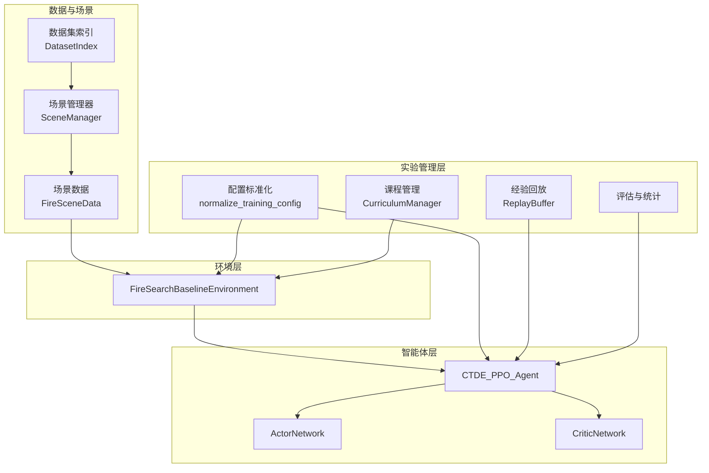
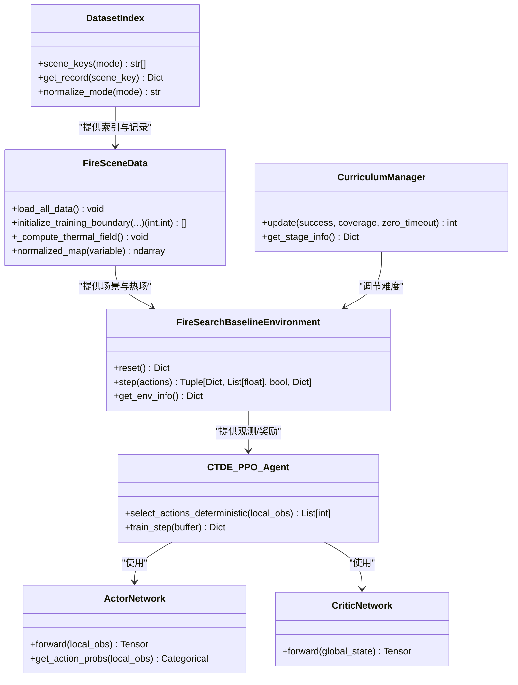
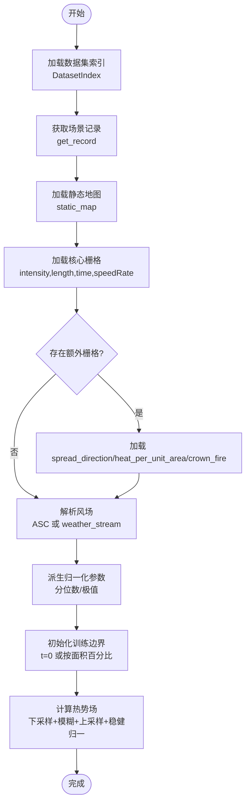
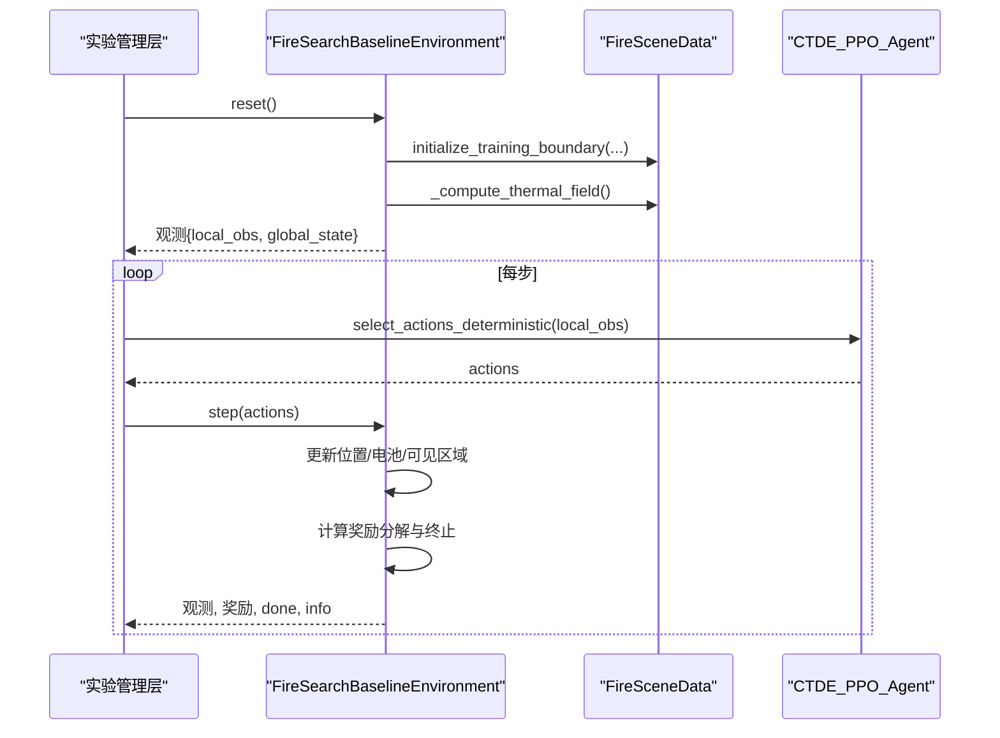
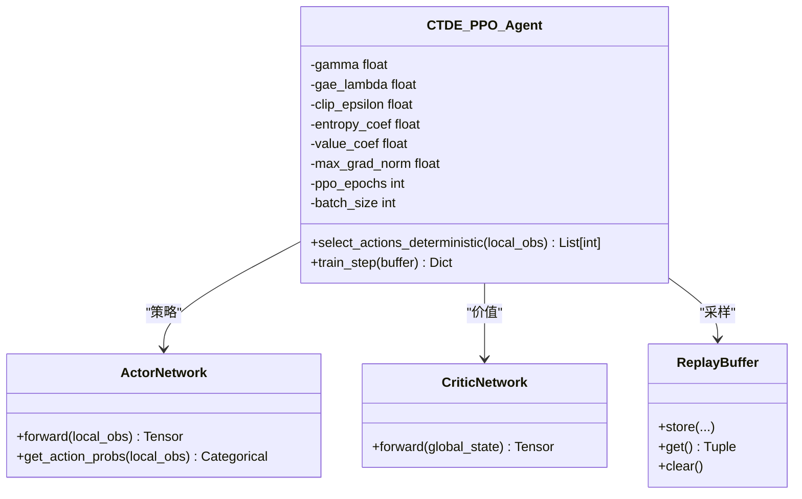
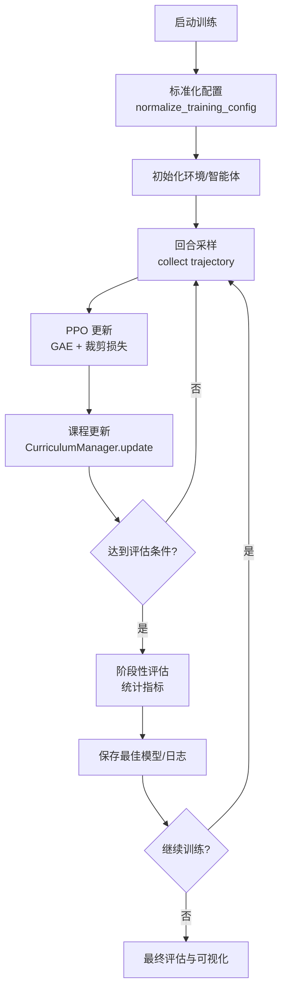
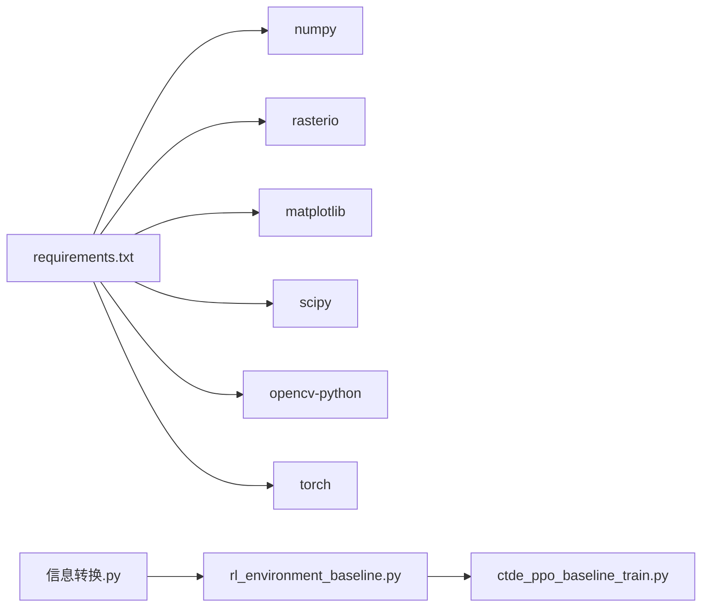

# 技术架构概览

<cite>
**本文引用的文件**   
- [rl_environment_baseline.py](file://environment_variables/environment_variables/rl_environment_baseline.py)
- [ctde_ppo_baseline_train.py](file://environment_variables/environment_variables/ctde_ppo_baseline_train.py)
- [信息转换.py](file://environment_variables/environment_variables/信息转换.py)
- [requirements.txt](file://environment_variables/requirements.txt)
</cite>

## 目录
1. [简介](#简介)
2. [项目结构](#项目结构)
3. [核心组件](#核心组件)
4. [架构总览](#架构总览)
5. [详细组件分析](#详细组件分析)
6. [依赖关系分析](#依赖关系分析)
7. [性能与可扩展性](#性能与可扩展性)
8. [故障排查指南](#故障排查指南)
9. [结论](#结论)
10. [附录：部署拓扑与环境要求](#附录部署拓扑与环境要求)

## 简介
本技术架构概览面向多无人机森林火灾边界搜索的强化学习系统，围绕以下四层展开：数据加载与场景管理、环境层（FireSearchBaselineEnvironment）、智能体层（CTDE_PPO_Agent）以及实验管理层。文档重点描述各层职责、接口契约、数据流与控制流，并给出架构图与关键流程时序图，帮助开发者快速理解系统全貌与扩展点。

## 项目结构
- 数据与场景
  - FARSITE 场景通过索引与元数据组织，由数据模块统一加载、归一化与派生特征（如热场）。
- 环境层
  - 基于 Gymnasium 的多智能体离散动作环境，提供局部观测与全局状态，封装奖励计算与课程阶段控制。
- 智能体层
  - CTDE-PPO 实现，Actor/Critic 网络分离，支持 KL 自适应学习率与 PPO 训练循环。
- 实验管理层
  - 配置标准化、训练主循环、评估与指标统计、结果输出与可视化。

图表来源
- [信息转换.py:20-196](file://environment_variables/environment_variables/信息转换.py#L20-L196)
- [信息转换.py:219-800](file://environment_variables/environment_variables/信息转换.py#L219-L800)
- [rl_environment_baseline.py:21-158](file://environment_variables/environment_variables/rl_environment_baseline.py#L21-L158)
- [ctde_ppo_baseline_train.py:460-535](file://environment_variables/environment_variables/ctde_ppo_baseline_train.py#L460-L535)
- [ctde_ppo_baseline_train.py:537-567](file://environment_variables/environment_variables/ctde_ppo_baseline_train.py#L537-L567)
- [ctde_ppo_baseline_train.py:569-757](file://environment_variables/environment_variables/ctde_ppo_baseline_train.py#L569-L757)
- [ctde_ppo_baseline_train.py:759-800](file://environment_variables/environment_variables/ctde_ppo_baseline_train.py#L759-L800)

章节来源
- [信息转换.py:20-196](file://environment_variables/environment_variables/信息转换.py#L20-L196)
- [信息转换.py:219-800](file://environment_variables/environment_variables/信息转换.py#L219-L800)
- [rl_environment_baseline.py:21-158](file://environment_variables/environment_variables/rl_environment_baseline.py#L21-L158)
- [ctde_ppo_baseline_train.py:460-535](file://environment_variables/environment_variables/ctde_ppo_baseline_train.py#L460-L535)
- [ctde_ppo_baseline_train.py:537-567](file://environment_variables/environment_variables/ctde_ppo_baseline_train.py#L537-L567)
- [ctde_ppo_baseline_train.py:569-757](file://environment_variables/environment_variables/ctde_ppo_baseline_train.py#L569-L757)
- [ctde_ppo_baseline_train.py:759-800](file://environment_variables/environment_variables/ctde_ppo_baseline_train.py#L759-L800)

## 核心组件
- 数据与场景层
  - DatasetIndex：维护 dataset_index.json，解析 splits、scenes、路径映射与模式别名。
  - FireSceneData：加载栅格与矢量、派生风场、计算归一化参数、构建火场二值掩码与热势场。
- 环境层
  - FireSearchBaselineEnvironment：Gymnasium 环境，定义动作空间、观测/全局状态维度、奖励剖面、课程阶段与生成逻辑。
- 智能体层
  - ActorNetwork/CriticNetwork：多层前馈网络，带 LayerNorm 与正交初始化。
  - CTDE_PPO_Agent：PPO 训练器，支持固定或 KL 自适应学习率、GAE 优势估计、批量采样与多轮更新。
- 实验管理层
  - normalize_training_config：统一默认值与校验；CurriculumManager：三阶段课程与 near_prob/target 退火；ReplayBuffer：轨迹缓存；评估与质量指标统计。

章节来源
- [信息转换.py:20-196](file://environment_variables/environment_variables/信息转换.py#L20-L196)
- [信息转换.py:219-800](file://environment_variables/environment_variables/信息转换.py#L219-L800)
- [rl_environment_baseline.py:21-158](file://environment_variables/environment_variables/rl_environment_baseline.py#L21-L158)
- [ctde_ppo_baseline_train.py:460-535](file://environment_variables/environment_variables/ctde_ppo_baseline_train.py#L460-L535)
- [ctde_ppo_baseline_train.py:537-567](file://environment_variables/environment_variables/ctde_ppo_baseline_train.py#L537-L567)
- [ctde_ppo_baseline_train.py:569-757](file://environment_variables/environment_variables/ctde_ppo_baseline_train.py#L569-L757)
- [ctde_ppo_baseline_train.py:759-800](file://environment_variables/environment_variables/ctde_ppo_baseline_train.py#L759-L800)

## 架构总览
系统采用“数据→环境→智能体→实验管理”的分层架构，强调模块化与可插拔：
- 数据层负责从 FARSITE 产物中抽取静态地形、动态火场与气象信息，并产出归一化参数与热势场。
- 环境层将场景抽象为 RL 任务，暴露标准 reset/step 接口，聚合局部观测与全局状态，计算奖励与终止条件。
- 智能体层以 CTDE-PPO 为核心，Actor 仅见局部观测，Critic 可见全局状态，实现集中式训练、分布式执行。
- 实验管理层负责配置标准化、课程调度、训练循环、评估与指标汇总。

图表来源
- [信息转换.py:20-196](file://environment_variables/environment_variables/信息转换.py#L20-L196)
- [信息转换.py:219-800](file://environment_variables/environment_variables/信息转换.py#L219-L800)
- [rl_environment_baseline.py:21-158](file://environment_variables/environment_variables/rl_environment_baseline.py#L21-L158)
- [ctde_ppo_baseline_train.py:460-535](file://environment_variables/environment_variables/ctde_ppo_baseline_train.py#L460-L535)
- [ctde_ppo_baseline_train.py:537-567](file://environment_variables/environment_variables/ctde_ppo_baseline_train.py#L537-L567)
- [ctde_ppo_baseline_train.py:569-757](file://environment_variables/environment_variables/ctde_ppo_baseline_train.py#L569-L757)
- [ctde_ppo_baseline_train.py:759-800](file://environment_variables/environment_variables/ctde_ppo_baseline_train.py#L759-L800)

## 详细组件分析

### 数据与场景层（FARSITE 到环境）
- 数据入口
  - DatasetIndex 读取 dataset_index.json，规范化 mode 别名，返回 splits 与 scene 记录，并解析绝对路径。
- 场景加载
  - FireSceneData 加载静态地图（DEM、坡度、坡向、植被等）与动态栅格（强度、长度、时间、速度等），可选额外栅格（扩散方向、单位面积热量、树冠火）。
  - 风场优先从 ASC 栅格读取，否则从 weather_stream 解析均值风速与风向，缺失时回退至 metadata。
  - 派生归一化参数（分位数/极值），对 DEM 做 min-max 归一，其他栅格按各自上限归一。
  - 构造 t=0 火场二值掩码，计算热势场（先下采样+高斯模糊再上采样，按场景稳健归一化得到 [0,1] 的热势与导航场）。
- 环境对接
  - 环境通过 SceneManager 选择场景，调用 initialize_training_boundary 设置初始边界，随后计算热场并缓存。

图表来源
- [信息转换.py:20-196](file://environment_variables/environment_variables/信息转换.py#L20-L196)
- [信息转换.py:219-800](file://environment_variables/environment_variables/信息转换.py#L219-L800)

章节来源
- [信息转换.py:20-196](file://environment_variables/environment_variables/信息转换.py#L20-L196)
- [信息转换.py:219-800](file://environment_variables/environment_variables/信息转换.py#L219-L800)

### 环境层（FireSearchBaselineEnvironment）
- 接口设计
  - 动作空间：离散 5 维（上下左右静止），边界裁剪。
  - 观测空间：每个无人机局部观测向量（位置、电量、地形、风场、热梯度、相机方向等），团队全局状态（覆盖率、平均/最小电量、队形中心与散布、距火距离、步长进度、已访问密度、课程阶段等）。
  - 多种观测剖面（baseline/static_terrain/dynamic_front/risk_aware）与奖励剖面（boundary_coverage/front_detection/severity_weighted/exploration_balanced）。
- 数据流
  - reset：加载新场景，初始化边界与热场，随机布放无人机（近/远策略受课程阶段影响），返回观测。
  - step：执行动作，更新位置与电池，标记可见区域，更新边界/前沿发现集合，计算奖励分解与终止信号。
- 控制流
  - 课程阶段：根据成功率、覆盖率与零覆盖超时率推进阶段，调整 near_prob 与目标覆盖率。
  - 终端惩罚：依据阶段目标与覆盖率缺口施加惩罚，鼓励探索与边界覆盖。

图表来源
- [rl_environment_baseline.py:21-158](file://environment_variables/environment_variables/rl_environment_baseline.py#L21-L158)
- [rl_environment_baseline.py:331-360](file://environment_variables/environment_variables/rl_environment_baseline.py#L331-L360)
- [rl_environment_baseline.py:565-658](file://environment_variables/environment_variables/rl_environment_baseline.py#L565-L658)
- [rl_environment_baseline.py:660-767](file://environment_variables/environment_variables/rl_environment_baseline.py#L660-L767)
- [ctde_ppo_baseline_train.py:1861-1920](file://environment_variables/environment_variables/ctde_ppo_baseline_train.py#L1861-L1920)

章节来源
- [rl_environment_baseline.py:21-158](file://environment_variables/environment_variables/rl_environment_baseline.py#L21-L158)
- [rl_environment_baseline.py:331-360](file://environment_variables/environment_variables/rl_environment_baseline.py#L331-L360)
- [rl_environment_baseline.py:565-658](file://environment_variables/environment_variables/rl_environment_baseline.py#L565-L658)
- [rl_environment_baseline.py:660-767](file://environment_variables/environment_variables/rl_environment_baseline.py#L660-L767)
- [ctde_ppo_baseline_train.py:1861-1920](file://environment_variables/environment_variables/ctde_ppo_baseline_train.py#L1861-L1920)

### 智能体层（CTDE_PPO_Agent）
- 网络结构
  - Actor：多层前馈 + LayerNorm，输出动作 logits。
  - Critic：多层前馈 + LayerNorm，输出标量价值。
- 训练算法
  - PPO：GAE 优势估计，裁剪损失，熵正则与价值损失加权，最大梯度范数约束。
  - 学习率策略：固定或 KL 自适应（EMA 跟踪近似 KL，按误差调整 actor_lr）。
  - 经验回放：收集 (local_obs, global_state, action, log_prob, reward, done)，批量采样多轮更新。
- 接口契约
  - 输入：local_obs_dim、global_state_dim、action_dim、num_agents。
  - 方法：select_actions_deterministic、train_step（内部包含 GAE、PPO 更新与日志）。

图表来源
- [ctde_ppo_baseline_train.py:460-535](file://environment_variables/environment_variables/ctde_ppo_baseline_train.py#L460-L535)
- [ctde_ppo_baseline_train.py:537-567](file://environment_variables/environment_variables/ctde_ppo_baseline_train.py#L537-L567)
- [ctde_ppo_baseline_train.py:569-757](file://environment_variables/environment_variables/ctde_ppo_baseline_train.py#L569-L757)
- [ctde_ppo_baseline_train.py:759-800](file://environment_variables/environment_variables/ctde_ppo_baseline_train.py#L759-L800)

章节来源
- [ctde_ppo_baseline_train.py:460-535](file://environment_variables/environment_variables/ctde_ppo_baseline_train.py#L460-L535)
- [ctde_ppo_baseline_train.py:537-567](file://environment_variables/environment_variables/ctde_ppo_baseline_train.py#L537-L567)
- [ctde_ppo_baseline_train.py:569-757](file://environment_variables/environment_variables/ctde_ppo_baseline_train.py#L569-L757)
- [ctde_ppo_baseline_train.py:759-800](file://environment_variables/environment_variables/ctde_ppo_baseline_train.py#L759-L800)

### 实验管理层（配置、课程、评估）
- 配置标准化
  - normalize_training_config：合并默认配置，类型与范围校验，导出 observation_profile_dims、norm_params_source 等。
- 课程管理
  - CurriculumManager：三阶段能力绑定退火，near_prob 与 stage3_target 阶梯式推进，最后强制进入评估条件。
- 评估与统计
  - 按阶段统计覆盖率、成功率、平均长度、超时率、任务得分等；计算模型质量指标（收敛效率、稳定性、KL 稳定性）。

图表来源
- [ctde_ppo_baseline_train.py:98-281](file://environment_variables/environment_variables/ctde_ppo_baseline_train.py#L98-L281)
- [ctde_ppo_baseline_train.py:569-757](file://environment_variables/environment_variables/ctde_ppo_baseline_train.py#L569-L757)
- [ctde_ppo_baseline_train.py:1861-1920](file://environment_variables/environment_variables/ctde_ppo_baseline_train.py#L1861-L1920)

章节来源
- [ctde_ppo_baseline_train.py:98-281](file://environment_variables/environment_variables/ctde_ppo_baseline_train.py#L98-L281)
- [ctde_ppo_baseline_train.py:569-757](file://environment_variables/environment_variables/ctde_ppo_baseline_train.py#L569-L757)
- [ctde_ppo_baseline_train.py:1861-1920](file://environment_variables/environment_variables/ctde_ppo_baseline_train.py#L1861-L1920)

## 依赖关系分析
- 直接依赖
  - 环境层依赖数据层（SceneManager/FireSceneData）提供场景与热场。
  - 智能体层依赖环境层提供的观测/奖励接口。
  - 实验管理层依赖环境层与智能体层进行训练与评估。
- 外部库
  - numpy、rasterio、matplotlib、scipy、opencv-python 用于数据处理与可视化；torch 用于神经网络与优化。
- 耦合与内聚
  - 数据层与环境的耦合通过明确的接口（initialize_training_boundary、normalized_map、热场字段）降低变更成本。
  - 智能体与环境解耦良好，便于替换算法或环境变体。
- 潜在循环依赖
  - 当前分层清晰，未见循环导入；若新增跨层回调需保持单向依赖。

图表来源
- [requirements.txt:1-13](file://environment_variables/requirements.txt#L1-L13)
- [信息转换.py:20-196](file://environment_variables/environment_variables/信息转换.py#L20-L196)
- [rl_environment_baseline.py:21-158](file://environment_variables/environment_variables/rl_environment_baseline.py#L21-L158)
- [ctde_ppo_baseline_train.py:460-535](file://environment_variables/environment_variables/ctde_ppo_baseline_train.py#L460-L535)

章节来源
- [requirements.txt:1-13](file://environment_variables/requirements.txt#L1-L13)
- [信息转换.py:20-196](file://environment_variables/environment_variables/信息转换.py#L20-L196)
- [rl_environment_baseline.py:21-158](file://environment_variables/environment_variables/rl_environment_baseline.py#L21-L158)
- [ctde_ppo_baseline_train.py:460-535](file://environment_variables/environment_variables/ctde_ppo_baseline_train.py#L460-L535)

## 性能与可扩展性
- 性能优化策略
  - 热势场计算采用下采样+高斯模糊+上采样，减少大规模栅格运算开销。
  - 归一化参数按场景稳健估计（分位数/极值），避免异常值影响训练稳定性。
  - 观测窗口圆形掩码与布尔矩阵操作提升可见区域标记效率。
  - PPO 批量大小与多轮更新平衡样本利用率与内存占用。
- 可扩展性考虑
  - 观测/奖励剖面通过枚举字典注册，新增类型无需修改核心流程。
  - 课程阶段参数与阈值可配置，便于在不同数据集上迁移。
  - 智能体网络结构独立于环境，易于替换为更复杂策略（如注意力、图网络）。
- 权衡
  - 集中式 Critic 提升训练稳定性但增加全局状态维度；可通过特征工程与降维缓解。
  - 课程退火提高学习效率但需要调参；建议结合验证集质量指标自动选择。

## 故障排查指南
- 常见错误与定位
  - 索引缺失或路径错误：检查 dataset_index.json 与 source_root 是否有效。
  - 栅格形状不匹配：确保 static_map 与各动态栅格分辨率一致。
  - 风场缺失：若无 ASC 栅格，确认 weather_stream 或 metadata 中存在风场信息。
  - 无效场景：t=0 边界为空会抛出 InvalidSceneError，需检查 fire_growth_report 或 time 栅格。
- 调试建议
  - 打印 norm_params 与热场统计，确认归一化合理。
  - 在环境中启用 get_env_info 输出维度与场景键，核对对齐。
  - 使用 TeeStream 捕获控制台日志，便于离线分析。

章节来源
- [信息转换.py:20-196](file://environment_variables/environment_variables/信息转换.py#L20-L196)
- [信息转换.py:219-800](file://environment_variables/environment_variables/信息转换.py#L219-L800)
- [ctde_ppo_baseline_train.py:47-96](file://environment_variables/environment_variables/ctde_ppo_baseline_train.py#L47-L96)
- [rl_environment_baseline.py:702-725](file://environment_variables/environment_variables/rl_environment_baseline.py#L702-L725)

## 结论
本系统以清晰的分层架构实现了从 FARSITE 数据到 CTDE-PPO 训练的完整闭环。数据层提供稳健的场景与热场表征，环境层封装任务与奖励，智能体层保证高效稳定的学习过程，实验管理层提供可复现的训练与评估流程。模块化设计与可配置的课程机制使系统在多样化场景中具备良好的泛化与扩展能力。

## 附录：部署拓扑与环境要求
- 运行环境
  - Python 环境安装 requirements.txt 所列依赖；建议使用虚拟环境隔离。
  - GPU 可选：若使用 torch CUDA，需安装对应版本驱动与 cudatoolkit。
- 数据准备
  - 准备 dataset_index.json 与 scenes 目录，确保所有必需栅格、矢量与报告文件存在。
- 启动方式
  - 通过 ctde_ppo_baseline_train.py 指定配置（数据路径、观察/奖励剖面、课程参数等）启动训练与评估。
- 输出与可视化
  - 训练日志与结果保存在 outputs 目录下，包含曲线图与统计摘要。

章节来源
- [requirements.txt:1-13](file://environment_variables/requirements.txt#L1-L13)
- [ctde_ppo_baseline_train.py:98-281](file://environment_variables/environment_variables/ctde_ppo_baseline_train.py#L98-L281)