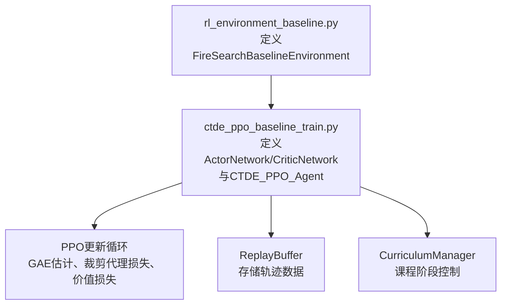
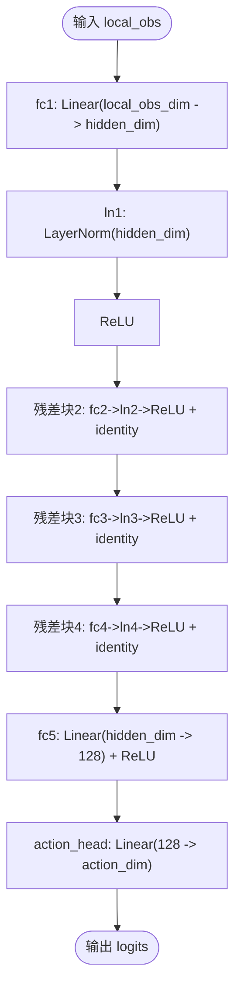
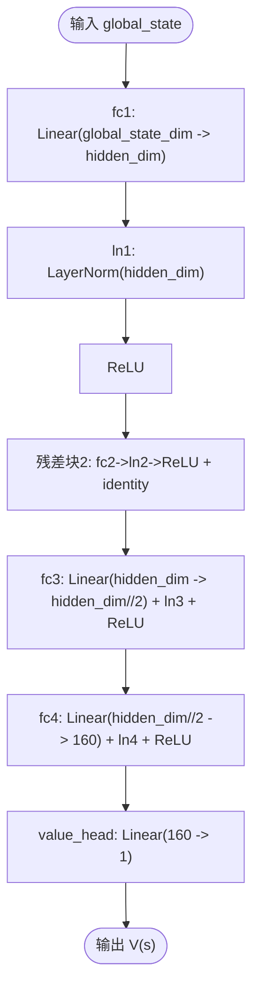
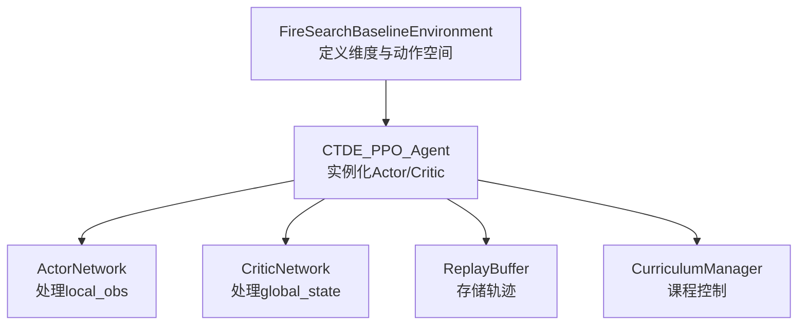

# Actor-Critic神经网络架构

<cite>
**本文引用的文件**   
- [ctde_ppo_baseline_train.py](file://environment_variables/environment_variables/ctde_ppo_baseline_train.py)
- [rl_environment_baseline.py](file://environment_variables/environment_variables/rl_environment_baseline.py)
</cite>

## 目录
1. [简介](#简介)
2. [项目结构](#项目结构)
3. [核心组件](#核心组件)
4. [架构总览](#架构总览)
5. [详细组件分析](#详细组件分析)
6. [依赖关系分析](#依赖关系分析)
7. [性能与稳定性考量](#性能与稳定性考量)
8. [故障排查指南](#故障排查指南)
9. [结论](#结论)
10. [附录：超参数调优指南](#附录超参数调优指南)

## 简介
本技术文档聚焦于CTDE-PPO算法中的Actor-Critic神经网络架构，围绕ActorNetwork与CriticNetwork的设计原理、残差连接、LayerNorm归一化层的作用、正交初始化策略、前向传播流程、网络层配置与维度变化、梯度流动路径进行系统化说明。同时给出网络结构图、训练更新序列图以及针对该特定任务场景的超参数调优建议。

## 项目结构
本项目采用“环境+训练脚本”的清晰分层：
- 环境定义位于rl_environment_baseline.py，提供多智能体火灾边界搜索任务的离散动作空间与观测/状态维度配置。
- 训练脚本ctde_ppo_baseline_train.py包含Actor/Critic网络定义、PPO更新循环、经验回放缓冲、课程学习管理与评估指标计算等。



图表来源
- [rl_environment_baseline.py:21-131](file://environment_variables/environment_variables/rl_environment_baseline.py#L21-L131)
- [ctde_ppo_baseline_train.py:460-535](file://environment_variables/environment_variables/ctde_ppo_baseline_train.py#L460-L535)
- [ctde_ppo_baseline_train.py:537-567](file://environment_variables/environment_variables/ctde_ppo_baseline_train.py#L537-L567)
- [ctde_ppo_baseline_train.py:569-758](file://environment_variables/environment_variables/ctde_ppo_baseline_train.py#L569-L758)

章节来源
- [rl_environment_baseline.py:21-131](file://environment_variables/environment_variables/rl_environment_baseline.py#L21-L131)
- [ctde_ppo_baseline_train.py:460-535](file://environment_variables/environment_variables/ctde_ppo_baseline_train.py#L460-L535)

## 核心组件
- ActorNetwork：基于局部观测输入，输出动作对数概率（logits），用于采样离散动作。
- CriticNetwork：基于全局状态输入，输出标量价值函数估计V(s)。
- CTDE_PPO_Agent：封装PPO训练逻辑，包括GAE优势估计、批量更新、KL自适应学习率（可选）、梯度裁剪与优化器步进。
- ReplayBuffer：按时间步累积轨迹样本，供PPO多轮小批量更新使用。
- CurriculumManager：管理训练阶段的难度曲线与生成条件退火。

章节来源
- [ctde_ppo_baseline_train.py:460-535](file://environment_variables/environment_variables/ctde_ppo_baseline_train.py#L460-L535)
- [ctde_ppo_baseline_train.py:537-567](file://environment_variables/environment_variables/ctde_ppo_baseline_train.py#L537-L567)
- [ctde_ppo_baseline_train.py:759-834](file://environment_variables/environment_variables/ctde_ppo_baseline_train.py#L759-L834)
- [ctde_ppo_baseline_train.py:889-991](file://environment_variables/environment_variables/ctde_ppo_baseline_train.py#L889-L991)
- [ctde_ppo_baseline_train.py:569-758](file://environment_variables/environment_variables/ctde_ppo_baseline_train.py#L569-L758)

## 架构总览
下图展示了Actor与Critic的网络拓扑、关键层顺序、归一化与激活位置、残差连接点，以及输出头。

```mermaid
classDiagram
class ActorNetwork {
+fc1 : Linear(local_obs_dim -> hidden_dim)
+ln1 : LayerNorm(hidden_dim)
+fc2 : Linear(hidden_dim -> hidden_dim)
+ln2 : LayerNorm(hidden_dim)
+fc3 : Linear(hidden_dim -> hidden_dim)
+ln3 : LayerNorm(hidden_dim)
+fc4 : Linear(hidden_dim -> hidden_dim)
+ln4 : LayerNorm(hidden_dim)
+fc5 : Linear(hidden_dim -> 128)
+action_head : Linear(128 -> action_dim)
+forward(local_obs) Tensor
+get_action_probs(local_obs) Categorical
}
class CriticNetwork {
+fc1 : Linear(global_state_dim -> hidden_dim)
+ln1 : LayerNorm(hidden_dim)
+fc2 : Linear(hidden_dim -> hidden_dim)
+ln2 : LayerNorm(hidden_dim)
+fc3 : Linear(hidden_dim -> hidden_dim//2)
+ln3 : LayerNorm(hidden_dim//2)
+fc4 : Linear(hidden_dim//2 -> 160)
+ln4 : LayerNorm(160)
+value_head : Linear(160 -> 1)
+forward(global_state) Tensor
}
ActorNetwork --> "输出动作logits" : "Categorical(logits)"
CriticNetwork --> "输出价值V(s)" : "标量"
```

图表来源
- [ctde_ppo_baseline_train.py:460-502](file://environment_variables/environment_variables/ctde_ppo_baseline_train.py#L460-L502)
- [ctde_ppo_baseline_train.py:504-535](file://environment_variables/environment_variables/ctde_ppo_baseline_train.py#L504-L535)

## 详细组件分析

### ActorNetwork设计要点
- 输入：局部观测向量local_obs，维度由环境observation_profile决定（例如baseline为17）。
- 隐藏层：四层全连接，每层后接LayerNorm与ReLU；第2~4层引入残差连接（x = F.relu(LN(fc(x))) + x）。
- 瓶颈层：一层线性映射到128维，再经ReLU。
- 输出头：线性层将128维映射到action_dim维的对数概率（logits），配合Categorical分布采样离散动作。
- 初始化：所有Linear层权重采用正交初始化（gain=√2），偏置初始化为0；动作头权重采用较小的正交增益（0.01）以稳定初期探索。
- 前向流程：LN→FC→ReLU的顺序有助于稳定深层网络的数值分布，残差连接缓解退化问题并促进梯度回传。



图表来源
- [ctde_ppo_baseline_train.py:482-501](file://environment_variables/environment_variables/ctde_ppo_baseline_train.py#L482-L501)

章节来源
- [ctde_ppo_baseline_train.py:460-502](file://environment_variables/environment_variables/ctde_ppo_baseline_train.py#L460-L502)

### CriticNetwork设计要点
- 输入：全局状态向量global_state，维度由环境observation_profile决定（例如baseline为19）。
- 隐藏层：两层宽隐藏层（hidden_dim），随后逐层降维至hidden_dim//2再到160；每层后接LayerNorm与ReLU。
- 输出头：线性层将160维映射到1维标量，表示状态价值V(s)。
- 初始化：与Actor一致的正交初始化策略，但价值头权重增益设为1.0，有利于价值估计的尺度稳定。
- 前向流程：无残差连接，采用逐步降维的结构，利于从全局信息中提炼价值信号。



图表来源
- [ctde_ppo_baseline_train.py:525-534](file://environment_variables/environment_variables/ctde_ppo_baseline_train.py#L525-L534)

章节来源
- [ctde_ppo_baseline_train.py:504-535](file://environment_variables/environment_variables/ctde_ppo_baseline_train.py#L504-L535)

### 训练与梯度流（PPO更新）
- GAE优势估计：基于团队奖励r_t、折扣因子γ与GAE参数λ，结合Critic预测的价值V(s_t)，计算advantages与returns，并进行标准化。
- 小批量更新：在每个epoch内随机打乱索引，按mini_batch_size切分批次，分别更新Critic与Actor。
- Critic损失：MSE损失，目标为returns，系数value_coef控制重要性。
- Actor损失：PPO裁剪代理损失，结合熵正则项entropy_coef鼓励探索；通过新旧策略比率ratio与clip_epsilon限制更新幅度。
- 梯度裁剪：max_grad_norm约束梯度范数，防止爆炸。
- KL监控与学习率自适应：支持固定或基于KL指数移动平均的学习率调整模式。

```mermaid
sequenceDiagram
participant Agent as "CTDE_PPO_Agent"
participant Buffer as "ReplayBuffer"
participant Critic as "CriticNetwork"
participant Actor as "ActorNetwork"
participant Dist as "Categorical"
Agent->>Buffer : 获取(local_obs, global_states, actions, old_log_probs, rewards, dones)
Agent->>Agent : compute_gae(rewards, dones, global_states)
Agent->>Agent : 标准化advantages与returns
loop ppo_epochs
Agent->>Critic : forward(global_states_mb) -> values_pred
Agent->>Agent : critic_loss = MSE(values_pred, returns_mb)
Agent->>Critic : backward() + clip_grad_norm_ + step()
Agent->>Actor : get_action_probs(flat_local_obs) -> Dist
Agent->>Dist : log_prob(actions_mb), entropy()
Agent->>Agent : ratio = exp(new_log_probs - old_log_probs)
Agent->>Agent : actor_loss = -min(ratio*adv, clamp(ratio)*adv) - entropy_coef*entropy
Agent->>Actor : backward() + clip_grad_norm_ + step()
Agent->>Agent : 统计approx_kl, clip_fraction
end
Agent->>Agent : 清空Buffer并记录日志
```

图表来源
- [ctde_ppo_baseline_train.py:889-991](file://environment_variables/environment_variables/ctde_ppo_baseline_train.py#L889-L991)

章节来源
- [ctde_ppo_baseline_train.py:889-991](file://environment_variables/environment_variables/ctde_ppo_baseline_train.py#L889-L991)

### 维度变化与数据结构
- 环境维度配置：
  - baseline: local_obs_dim=17, global_state_dim=19
  - static_terrain: local_obs_dim=24, global_state_dim=19
  - dynamic_front: local_obs_dim=23, global_state_dim=19
  - risk_aware: local_obs_dim=20, global_state_dim=19
- 动作空间：离散动作num_actions=5。
- Actor网络维度变化（示例baseline）：
  - 输入17 → hidden_dim(默认256) → 残差块×3 → 128 → action_dim(5)
- Critic网络维度变化（示例baseline）：
  - 输入19 → hidden_dim(默认384) → hidden_dim → hidden_dim//2(192) → 160 → 1

章节来源
- [rl_environment_baseline.py:24-29](file://environment_variables/environment_variables/rl_environment_baseline.py#L24-L29)
- [rl_environment_baseline.py:89-91](file://environment_variables/environment_variables/rl_environment_baseline.py#L89-L91)
- [ctde_ppo_baseline_train.py:460-502](file://environment_variables/environment_variables/ctde_ppo_baseline_train.py#L460-L502)
- [ctde_ppo_baseline_train.py:504-535](file://environment_variables/environment_variables/ctde_ppo_baseline_train.py#L504-L535)

### 为什么选择这种架构？
- 残差连接：在Actor中引入残差块，有助于缓解深层网络退化，保持特征通路畅通，提升训练稳定性与收敛速度。
- LayerNorm：在每层线性变换后应用，稳定激活分布，降低内部协变量偏移，提高对输入尺度变化的鲁棒性。
- 正交初始化：为线性层权重赋予正交矩阵，避免初始阶段梯度过大或过小，配合偏置零初始化，使训练起点更可控。
- 分离式Actor/Critic：Actor仅依赖局部观测，符合CTDE的去中心化决策需求；Critic利用全局状态估计价值，提供稳定的基线，减少方差。
- 逐步降维的Critic：从全局状态中提取高层抽象特征，最终映射到单一价值标量，结构简洁且易于优化。

章节来源
- [ctde_ppo_baseline_train.py:460-535](file://environment_variables/environment_variables/ctde_ppo_baseline_train.py#L460-L535)

## 依赖关系分析
- 环境与网络耦合：
  - FireSearchBaselineEnvironment定义了不同observation_profile对应的local_obs_dim与global_state_dim，直接决定Actor与Critic的输入维度。
  - CTDE_PPO_Agent根据环境维度实例化ActorNetwork与CriticNetwork，并使用Adam优化器进行参数更新。
- 训练循环依赖：
  - ReplayBuffer负责收集轨迹数据，compute_gae依赖Critic预测值，PPO更新依赖Actor的策略分布与Critic的价值估计。
  - CurriculumManager影响环境生成条件（如初始区域百分比、near_prob），间接改变输入分布与训练难度。



图表来源
- [rl_environment_baseline.py:21-131](file://environment_variables/environment_variables/rl_environment_baseline.py#L21-L131)
- [ctde_ppo_baseline_train.py:759-834](file://environment_variables/environment_variables/ctde_ppo_baseline_train.py#L759-L834)
- [ctde_ppo_baseline_train.py:537-567](file://environment_variables/environment_variables/ctde_ppo_baseline_train.py#L537-L567)
- [ctde_ppo_baseline_train.py:569-758](file://environment_variables/environment_variables/ctde_ppo_baseline_train.py#L569-L758)

章节来源
- [rl_environment_baseline.py:21-131](file://environment_variables/environment_variables/rl_environment_baseline.py#L21-L131)
- [ctde_ppo_baseline_train.py:759-834](file://environment_variables/environment_variables/ctde_ppo_baseline_train.py#L759-L834)

## 性能与稳定性考量
- 梯度裁剪：max_grad_norm限制梯度范数，防止训练不稳定。
- 优势标准化：advantages减去均值并除以标准差，提升PPO更新的稳定性。
- 熵正则：entropy_coef鼓励探索，避免过早收敛到次优策略。
- 小批量更新：mini_batch_size与ppo_epochs平衡样本利用率与更新频率。
- KL自适应：当启用KL模式时，依据近似KL动态调整actor学习率，维持策略更新幅度在目标范围内。

章节来源
- [ctde_ppo_baseline_train.py:889-991](file://environment_variables/environment_variables/ctde_ppo_baseline_train.py#L889-L991)

## 故障排查指南
- 维度不匹配错误：
  - 现象：Actor或Critic前向时报错形状不一致。
  - 排查：确认observation_profile与对应local_obs_dim/global_state_dim是否与环境一致。
- 训练发散或NaN：
  - 现象：loss变为NaN或剧烈震荡。
  - 排查：检查max_grad_norm是否过小或过大；验证advantages标准化是否生效；确认正交初始化是否正确应用。
- 策略更新过激：
  - 现象：policy频繁被裁剪，approx_kl远大于target_kl。
  - 排查：适当增大clip_epsilon或减小actor_lr；启用KL自适应模式并调整kl_ema_beta与kl_lr_alpha。
- 价值估计偏差大：
  - 现象：critic_loss长期偏高。
  - 排查：检查returns计算是否正确；确保Critic网络容量足够（hidden_dim可适度增加）；必要时调整value_coef。

章节来源
- [ctde_ppo_baseline_train.py:889-991](file://environment_variables/environment_variables/ctde_ppo_baseline_train.py#L889-L991)
- [rl_environment_baseline.py:24-29](file://environment_variables/environment_variables/rl_environment_baseline.py#L24-L29)

## 结论
该Actor-Critic架构通过残差连接与LayerNorm提升了深层网络的稳定性与表达能力；正交初始化确保了良好的训练起点；Actor基于局部观测输出动作分布，Critic基于全局状态估计价值，契合CTDE的去中心化决策与集中式价值评估范式。配合PPO的裁剪代理损失、优势标准化与KL自适应学习率，整体训练过程稳健高效。

## 附录：超参数调优指南
- 网络容量：
  - Actor.hidden_dim：可从256起步，若任务复杂可提升至384或更高。
  - Critic.hidden_dim：可从384起步，关注价值估计误差与训练稳定性。
- PPO核心：
  - clip_epsilon：0.1~0.3范围尝试，较大值允许更大更新但可能不稳定。
  - entropy_coef：0.001~0.05，鼓励探索但需避免过度随机。
  - value_coef：0.1~1.0，平衡策略与价值学习。
  - max_grad_norm：0.5~1.0，抑制梯度爆炸。
  - ppo_epochs：2~6，过多易过拟合当前批次。
  - mini_batch_size：根据显存与batch_size调整，保证统计稳定性。
- KL自适应：
  - target_kl：0.005~0.02，控制策略更新幅度。
  - kl_ema_beta：0.8~0.99，平滑KL估计。
  - kl_lr_alpha：0.05~0.2，调节学习率响应强度。
- 环境维度与观察配置：
  - observation_profile：根据任务特性选择baseline/static_terrain/dynamic_front/risk_aware，确保网络输入维度正确。
  - num_drones与vision_radius：影响局部观测复杂度与全局状态信息量。

章节来源
- [ctde_ppo_baseline_train.py:98-158](file://environment_variables/environment_variables/ctde_ppo_baseline_train.py#L98-L158)
- [ctde_ppo_baseline_train.py:889-991](file://environment_variables/environment_variables/ctde_ppo_baseline_train.py#L889-L991)
- [rl_environment_baseline.py:24-29](file://environment_variables/environment_variables/rl_environment_baseline.py#L24-L29)