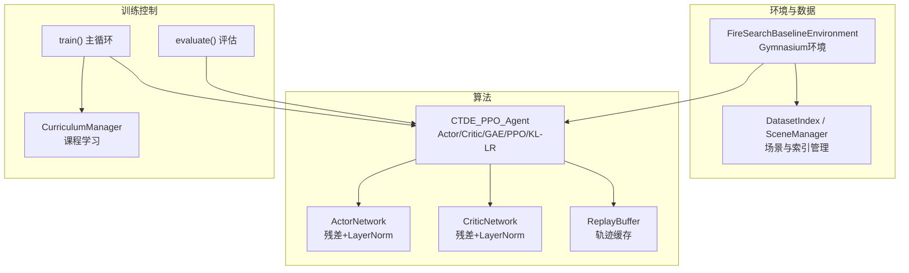
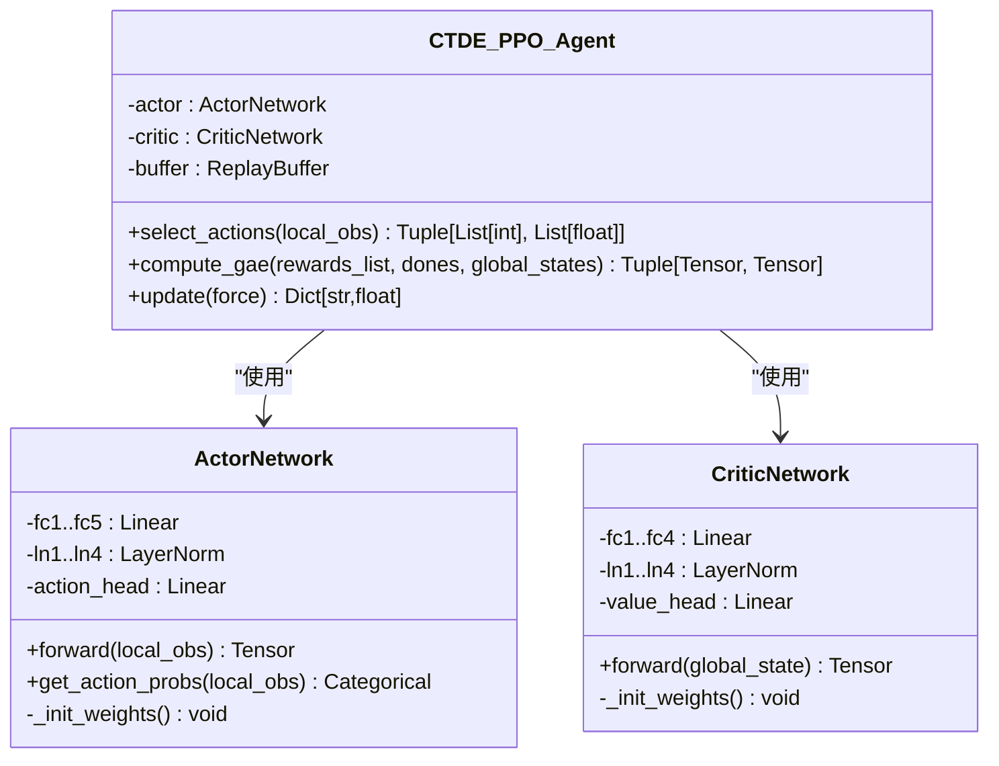
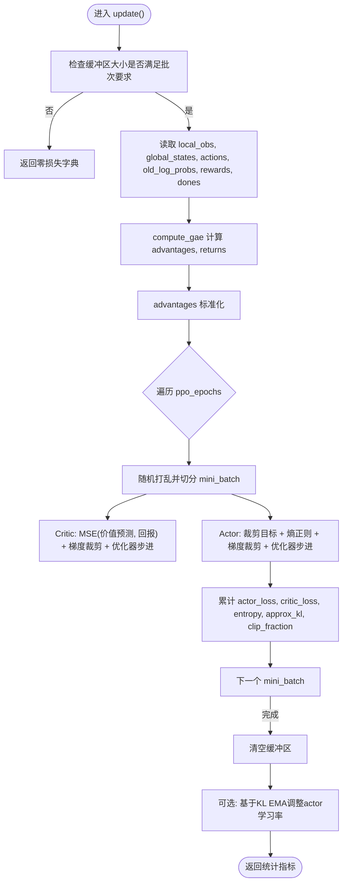
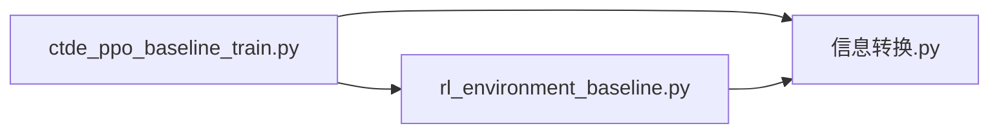
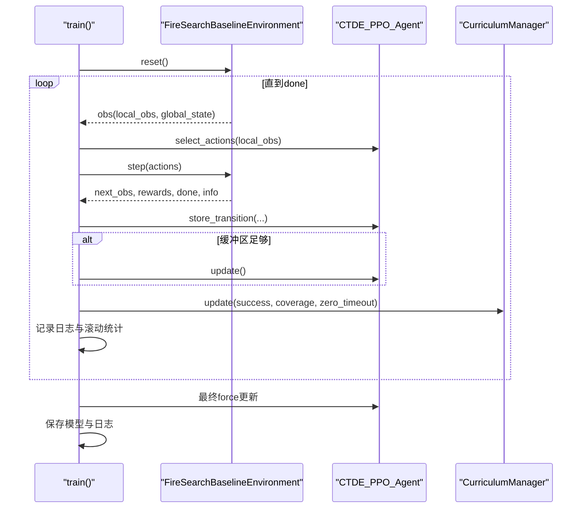

# CTDE-PPO算法实现

<cite>
**本文引用的文件**   
- [ctde_ppo_baseline_train.py](file://environment_variables/environment_variables/ctde_ppo_baseline_train.py)
- [rl_environment_baseline.py](file://environment_variables/environment_variables/rl_environment_baseline.py)
- [信息转换.py](file://environment_variables/environment_variables/信息转换.py)
</cite>

## 目录
1. [引言](#引言)
2. [项目结构](#项目结构)
3. [核心组件](#核心组件)
4. [架构总览](#架构总览)
5. [详细组件分析](#详细组件分析)
6. [依赖关系分析](#依赖关系分析)
7. [性能与稳定性考量](#性能与稳定性考量)
8. [故障排查指南](#故障排查指南)
9. [结论](#结论)
10. [附录：训练循环与关键流程](#附录训练循环与关键流程)

## 引言
本技术文档围绕仓库中的CTDE-PPO基线实现，系统阐述“集中式训练、去中心化执行”（CTDE）的设计理念与技术优势，深入解析Actor-Critic网络结构（含残差连接、LayerNorm归一化与梯度裁剪）、PPO目标函数与优势估计、经验回放缓冲区的采样与批处理机制，并给出完整的训练循环说明。同时提供网络初始化、超参数调优与学习率调度的高级配置建议，帮助读者快速理解与复现实验。

## 项目结构
该实现由三个核心模块构成：
- 环境与数据层：基于Gymnasium的多无人机火场边界搜索环境，负责观测/全局状态构造、奖励计算与场景加载。
- 算法层：CTDE-PPO智能体，包含Actor/Critic网络、ReplayBuffer、GAE优势估计、PPO更新与KL自适应学习率策略。
- 数据索引与预处理：数据集索引、场景元数据与栅格/矢量数据路径解析，以及热场健康检查等工具。



图表来源
- [ctde_ppo_baseline_train.py:460-535](file://environment_variables/environment_variables/ctde_ppo_baseline_train.py#L460-L535)
- [ctde_ppo_baseline_train.py:537-567](file://environment_variables/environment_variables/ctde_ppo_baseline_train.py#L537-L567)
- [ctde_ppo_baseline_train.py:759-822](file://environment_variables/environment_variables/ctde_ppo_baseline_train.py#L759-L822)
- [rl_environment_baseline.py:21-158](file://environment_variables/environment_variables/rl_environment_baseline.py#L21-L158)
- [信息转换.py:20-94](file://environment_variables/environment_variables/信息转换.py#L20-L94)

章节来源
- [ctde_ppo_baseline_train.py:1-158](file://environment_variables/environment_variables/ctde_ppo_baseline_train.py#L1-L158)
- [rl_environment_baseline.py:1-158](file://environment_variables/environment_variables/rl_environment_baseline.py#L1-L158)
- [信息转换.py:1-94](file://environment_variables/environment_variables/信息转换.py#L1-L94)

## 核心组件
- Actor网络：接收多智能体的局部观测，输出离散动作分布；采用多层全连接+LayerNorm+残差连接，提升深层网络训练稳定性。
- Critic网络：接收全局状态，输出标量价值估计；同样使用LayerNorm与残差结构，增强价值函数的拟合能力。
- ReplayBuffer：按时间步累积(局部观测, 全局状态, 动作, 旧对数概率, 奖励, done)，用于PPO多轮小批量更新。
- GAE优势估计：基于Critic的价值预测，计算优势与回报，并进行标准化以提升训练稳定性。
- PPO更新：在多个epoch内对小批量数据进行策略裁剪与价值损失联合优化，支持梯度裁剪与近似KL监控。
- KL自适应学习率：根据平均KL误差的指数移动平均动态调整Actor学习率，避免策略更新过大导致崩溃。
- CurriculumManager：三阶段课程学习，逐步提高初始位置难度、成功率目标与近界生成概率，配合终末专注模式稳定收敛。

章节来源
- [ctde_ppo_baseline_train.py:460-535](file://environment_variables/environment_variables/ctde_ppo_baseline_train.py#L460-L535)
- [ctde_ppo_baseline_train.py:537-567](file://environment_variables/environment_variables/ctde_ppo_baseline_train.py#L537-L567)
- [ctde_ppo_baseline_train.py:867-991](file://environment_variables/environment_variables/ctde_ppo_baseline_train.py#L867-L991)
- [ctde_ppo_baseline_train.py:569-752](file://environment_variables/environment_variables/ctde_ppo_baseline_train.py#L569-L752)

## 架构总览
CTDE-PPO采用“集中式训练、去中心化执行”的信息流设计：
- 执行阶段（去中心化）：每个无人机仅依据自身局部观测选择动作，保证部署时的可扩展性与低通信开销。
- 训练阶段（集中式）：全局状态参与Critic网络与前向传播，用于计算优势与价值目标，从而引导各Agent的策略学习。
- 参数共享：所有Agent共享同一Actor权重，Critic也共享单一权重，降低参数量并促进协同学习。

```mermaid
sequenceDiagram
participant Env as "环境"
participant Agent as "CTDE_PPO_Agent"
participant Actor as "ActorNetwork"
participant Critic as "CriticNetwork"
participant Buffer as "ReplayBuffer"
loop 每回合
Env->>Agent : 返回 local_obs, global_state
Agent->>Actor : 输入 local_obs -> 采样动作, log_prob
Agent->>Env : 执行 actions
Env-->>Agent : next_obs, rewards, done, info
Agent->>Buffer : store(local_obs, global_state, actions, log_probs, rewards, done)
end
Note over Agent,Buffer : 当缓冲区达到阈值时触发PPO更新
Agent->>Critic : 前向 global_state -> values
Agent->>Agent : compute_gae(rewards, dones, values)
Agent->>Actor : 小批量策略裁剪更新
Agent->>Critic : 小批量价值MSE更新
Agent->>Agent : 记录approx_kl, clip_fraction, actor_lr
```

图表来源
- [ctde_ppo_baseline_train.py:849-866](file://environment_variables/environment_variables/ctde_ppo_baseline_train.py#L849-L866)
- [ctde_ppo_baseline_train.py:867-991](file://environment_variables/environment_variables/ctde_ppo_baseline_train.py#L867-L991)
- [rl_environment_baseline.py:565-658](file://environment_variables/environment_variables/rl_environment_baseline.py#L565-L658)

## 详细组件分析

### Actor-Critic网络架构
- Actor网络：
  - 输入：局部观测向量（维度随observation_profile变化）。
  - 结构：多层全连接+LayerNorm+ReLU，并在中间层引入残差连接，最后通过线性头输出动作logits。
  - 初始化：正交初始化权重，偏置为0；动作头增益较小以稳定初期探索。
- Critic网络：
  - 输入：全局状态向量（团队统计、覆盖率、风场、地形等特征）。
  - 结构：多层全连接+LayerNorm+ReLU，部分层带残差连接，最终输出单值价值。
  - 初始化：正交初始化权重，价值头增益较大以准确估计回报。



图表来源
- [ctde_ppo_baseline_train.py:460-535](file://environment_variables/environment_variables/ctde_ppo_baseline_train.py#L460-L535)
- [ctde_ppo_baseline_train.py:759-822](file://environment_variables/environment_variables/ctde_ppo_baseline_train.py#L759-L822)

章节来源
- [ctde_ppo_baseline_train.py:460-535](file://environment_variables/environment_variables/ctde_ppo_baseline_train.py#L460-L535)

### PPO算法核心实现
- 优势函数与回报：
  - 使用GAE（Generalized Advantage Estimation），结合折扣因子γ与λ，从后向前递推计算优势与回报。
  - 优势进行零均值单位方差标准化，减少方差并提升稳定性。
- 策略更新：
  - 计算新旧策略比率ratio=exp(new_logp-old_logp)。
  - 使用裁剪目标min(surr1,surr2)最大化，其中surr1=ratio*adv，surr2=clamp(ratio)*adv。
  - 加入熵正则项鼓励探索。
- 价值更新：
  - 最小化预测价值与回报的MSE损失。
- 梯度裁剪：
  - 对Actor与Critic分别设置最大梯度范数，防止梯度爆炸。
- 近似KL与clip比例：
  - 记录approx_kl=(ratio-1-log_ratio)的均值，用于监控策略漂移。
  - 记录clip_fraction作为裁剪比例的统计指标。



图表来源
- [ctde_ppo_baseline_train.py:889-991](file://environment_variables/environment_variables/ctde_ppo_baseline_train.py#L889-L991)

章节来源
- [ctde_ppo_baseline_train.py:867-991](file://environment_variables/environment_variables/ctde_ppo_baseline_train.py#L867-L991)

### 经验回放缓冲区与批处理机制
- 存储格式：
  - 列表形式保存每个时间步的(局部观测, 全局状态, 动作, 旧对数概率, 奖励, done)。
- 采样策略：
  - 每次更新前将全部样本转换为张量，并按mini_batch_size切分。
  - 在每个epoch内随机打乱索引，确保不同批次的数据多样性。
- 批处理细节：
  - 将多智能体观测展平为(batch*num_agents, obs_dim)，动作与旧对数概率同理展平。
  - 优势张量扩展至(num_agents)维度后再展平，匹配Actor输出的动作分布。

章节来源
- [ctde_ppo_baseline_train.py:537-567](file://environment_variables/environment_variables/ctde_ppo_baseline_train.py#L537-L567)
- [ctde_ppo_baseline_train.py:889-991](file://environment_variables/environment_variables/ctde_ppo_baseline_train.py#L889-L991)

### 训练循环与日志/评估
- 训练主循环：
  - 每回合与环境交互，收集轨迹并存入缓冲区。
  - 当缓冲区达到batch_size时触发一次PPO更新。
  - 记录滚动统计（奖励、长度、覆盖率、成功率、任务得分、超时率等）。
- 课程学习：
  - 根据成功率、覆盖率与零覆盖超时率自动推进阶段，调整初始位置百分位、阶段3成功率目标与近界生成概率。
  - 终末专注模式在最后若干回合强制使用最终难度条件，提升模型质量。
- 验证与保存：
  - 定期在验证集上评估，按综合分数保存最佳验证模型。
  - 定期保存当前模型与最终模型，并输出训练日志与质量指标。

章节来源
- [ctde_ppo_baseline_train.py:1278-1813](file://environment_variables/environment_variables/ctde_ppo_baseline_train.py#L1278-L1813)
- [ctde_ppo_baseline_train.py:569-752](file://environment_variables/environment_variables/ctde_ppo_baseline_train.py#L569-L752)

## 依赖关系分析
- 环境依赖：
  - Gymnasium空间定义与接口，用于封装局部观测与全局状态。
  - 场景管理器与数据索引，负责加载地图、栅格与矢量数据，构建t=0边界点与热场。
- 算法依赖：
  - PyTorch张量与优化器，用于网络前向、反向与参数更新。
  - torch.distributions.Categorical用于离散动作采样与log_prob计算。
- 数据预处理：
  - 信息转换模块提供场景索引、路径解析、边界点初始化与热场健康检查。



图表来源
- [ctde_ppo_baseline_train.py:30-37](file://environment_variables/environment_variables/ctde_ppo_baseline_train.py#L30-L37)
- [rl_environment_baseline.py:17-19](file://environment_variables/environment_variables/rl_environment_baseline.py#L17-L19)
- [信息转换.py:20-94](file://environment_variables/environment_variables/信息转换.py#L20-L94)

章节来源
- [ctde_ppo_baseline_train.py:30-37](file://environment_variables/environment_variables/ctde_ppo_baseline_train.py#L30-L37)
- [rl_environment_baseline.py:17-19](file://environment_variables/environment_variables/rl_environment_baseline.py#L17-L19)
- [信息转换.py:20-94](file://environment_variables/environment_variables/信息转换.py#L20-L94)

## 性能与稳定性考量
- 残差连接与LayerNorm：
  - 缓解深层网络梯度消失问题，加速收敛并提升泛化。
- 梯度裁剪：
  - 限制最大梯度范数，避免策略或价值网络更新过激导致不稳定。
- 优势标准化：
  - 降低优势估计方差，使策略更新更稳健。
- KL自适应学习率：
  - 通过EMA跟踪平均KL，动态缩放actor学习率，保持策略更新在目标KL附近，防止坍塌。
- 课程学习与终末专注：
  - 渐进增加难度，配合终末专注模式，有助于在高难度条件下获得高质量策略。

[本节为通用指导，不直接分析具体文件]

## 故障排查指南
- 热场健康检查失败：
  - 训练前会收集各场景的热场健康记录，若超过阈值将抛出异常。需检查数据完整性与边界初始化是否正确。
- 缓冲区不足无法更新：
  - 若缓冲区未达到最小批次大小，update将返回零损失。应增大episode长度或减小batch_size。
- KL超限率高：
  - 若approx_kl显著高于target_kl，可增大kl_lr_alpha或降低actor_lr_max，或增加ppo_epochs但谨慎调整。
- 观察/奖励配置错误：
  - observation_profile与reward_profile需在环境支持的集合中，否则会抛出ValueError。

章节来源
- [ctde_ppo_baseline_train.py:1239-1248](file://environment_variables/environment_variables/ctde_ppo_baseline_train.py#L1239-L1248)
- [ctde_ppo_baseline_train.py:889-893](file://environment_variables/environment_variables/ctde_ppo_baseline_train.py#L889-L893)
- [rl_environment_baseline.py:209-226](file://environment_variables/environment_variables/rl_environment_baseline.py#L209-L226)

## 结论
该CTDE-PPO实现以清晰的模块化设计与稳定的训练技巧为核心，结合课程学习与KL自适应学习率，能够在复杂火场环境中学习到高效的多无人机协同策略。其“集中式训练、去中心化执行”的架构既保证了训练效率，又兼顾了部署时的可扩展性。通过合理的网络初始化、超参数调优与学习率调度，可在不同场景下取得稳定且高质量的收敛效果。

[本节为总结性内容，不直接分析具体文件]

## 附录：训练循环与关键流程

### 训练主循环时序图


图表来源
- [ctde_ppo_baseline_train.py:1278-1813](file://environment_variables/environment_variables/ctde_ppo_baseline_train.py#L1278-L1813)
- [ctde_ppo_baseline_train.py:849-866](file://environment_variables/environment_variables/ctde_ppo_baseline_train.py#L849-L866)
- [ctde_ppo_baseline_train.py:889-991](file://environment_variables/environment_variables/ctde_ppo_baseline_train.py#L889-L991)

### 高级配置指南（网络初始化、超参数与学习率调度）
- 网络初始化：
  - 使用正交初始化权重与零偏置，动作头与价值头增益分别设置为较小与较大值，以平衡探索与价值估计精度。
- 超参数建议：
  - gamma≈0.99，gae_lambda≈0.95，clip_epsilon≈0.2，entropy_coef≈0.01，value_coef≈0.5，max_grad_norm≈0.5。
  - batch_size与ppo_epochs需根据GPU内存与数据规模权衡，mini_batch_size通常取batch_size的1/8以上。
- 学习率调度：
  - fixed模式：固定actor/critic学习率，便于对比实验。
  - kl模式：基于KL EMA的动态调整，target_kl与kl_lr_alpha共同决定调整幅度与速度。
- 课程学习：
  - 阶段1侧重基础探索与边界发现；阶段2提升成功率目标；阶段3进一步逼近最终目标并退火near_prob。
  - 终末专注模式在训练末尾锁定最终难度，提升模型质量。

章节来源
- [ctde_ppo_baseline_train.py:460-535](file://environment_variables/environment_variables/ctde_ppo_baseline_train.py#L460-L535)
- [ctde_ppo_baseline_train.py:823-848](file://environment_variables/environment_variables/ctde_ppo_baseline_train.py#L823-L848)
- [ctde_ppo_baseline_train.py:569-752](file://environment_variables/environment_variables/ctde_ppo_baseline_train.py#L569-L752)