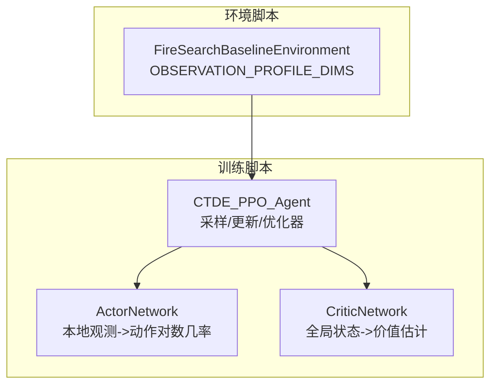
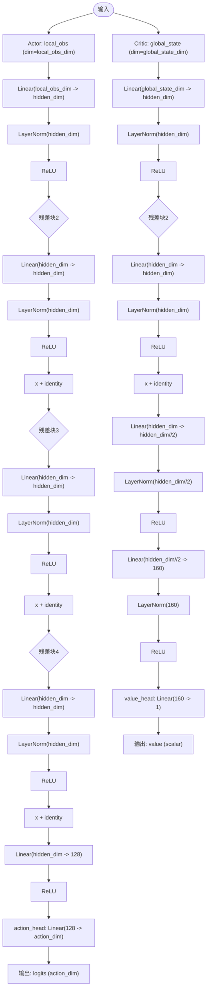
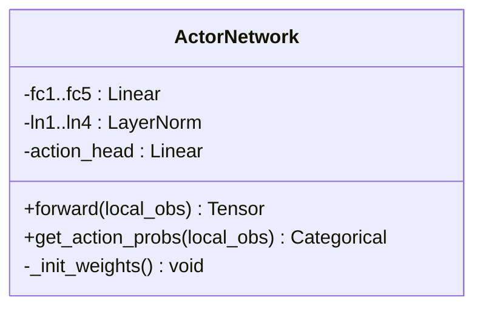
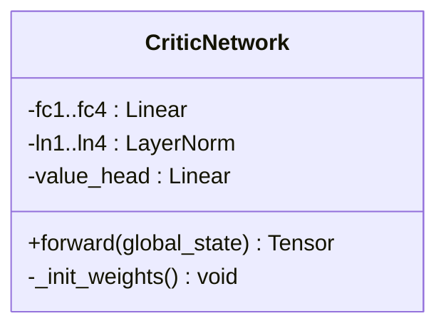
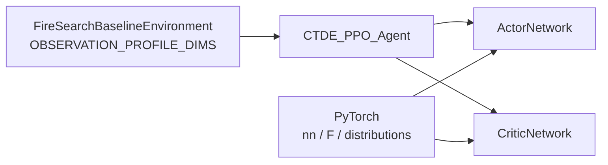

# Actor-Critic神经网络架构

<cite>
**本文引用的文件**   
- [ctde_ppo_baseline_train.py](file://environment_variables/environment_variables/ctde_ppo_baseline_train.py)
- [rl_environment_baseline.py](file://environment_variables/environment_variables/rl_environment_baseline.py)
</cite>

## 目录
1. [简介](#简介)
2. [项目结构](#项目结构)
3. [核心组件](#核心组件)
4. [架构总览](#架构总览)
5. [详细组件分析](#详细组件分析)
6. [依赖关系分析](#依赖关系分析)
7. [性能与稳定性考量](#性能与稳定性考量)
8. [故障排查指南](#故障排查指南)
9. [结论](#结论)
10. [附录：参数统计与扩展建议](#附录参数统计与扩展建议)

## 简介
本技术文档聚焦于Actor-Critic神经网络架构，围绕ActorNetwork与CriticNetwork的网络结构设计、激活函数与归一化策略、权重初始化（正交初始化）、前向传播流程、动作头与价值头的输出设计、概率分布建模、局部观测与全局状态的处理差异、数据流向与维度变换、参数量统计以及可扩展性与自定义修改原则进行系统性说明。该实现基于CTDE-PPO基线训练脚本，采用多层感知机（MLP）作为骨干网络，结合LayerNorm与残差连接提升训练稳定性与收敛速度。

## 项目结构
本项目中Actor-Critic网络定义与使用集中在训练脚本中，环境模块提供观测与状态维度配置。关键位置如下：
- ActorNetwork与CriticNetwork类定义位于训练脚本中
- 环境与观测维度定义位于环境脚本中
- PPO智能体在训练循环中调用Actor/Critic的前向方法完成采样、评估与更新



图表来源
- [ctde_ppo_baseline_train.py:460-534](file://environment_variables/environment_variables/ctde_ppo_baseline_train.py#L460-L534)
- [rl_environment_baseline.py:24-29](file://environment_variables/environment_variables/rl_environment_baseline.py#L24-L29)

章节来源
- [ctde_ppo_baseline_train.py:460-534](file://environment_variables/environment_variables/ctde_ppo_baseline_train.py#L460-L534)
- [rl_environment_baseline.py:24-29](file://environment_variables/environment_variables/rl_environment_baseline.py#L24-L29)

## 核心组件
- ActorNetwork：以local_obs为输入，经多层线性层+LayerNorm+ReLU与前向残差块，最终通过action_head输出动作对数几率，供离散动作的Categorical分布采样。
- CriticNetwork：以global_state为输入，经多层线性层+LayerNorm+ReLU与前向残差块，最终通过value_head输出标量价值估计。
- CTDE_PPO_Agent：负责将local_obs与global_state送入Actor/Critic，计算GAE优势与回报，执行PPO裁剪目标与KL自适应学习率策略。

章节来源
- [ctde_ppo_baseline_train.py:460-534](file://environment_variables/environment_variables/ctde_ppo_baseline_train.py#L460-L534)
- [ctde_ppo_baseline_train.py:850-991](file://environment_variables/environment_variables/ctde_ppo_baseline_train.py#L850-L991)

## 架构总览
下图展示Actor与Critic在前向过程中的数据流与主要操作顺序，包括LayerNorm、ReLU、残差连接与头部映射。



图表来源
- [ctde_ppo_baseline_train.py:482-534](file://environment_variables/environment_variables/ctde_ppo_baseline_train.py#L482-L534)

## 详细组件分析

### ActorNetwork分析
- 网络结构
  - 输入：local_obs，维度由环境配置决定（例如baseline为17）。
  - 骨干：4个“线性+LayerNorm+ReLU”块，其中第2至第4块包含前向残差连接（x = ReLU(LN(Linear(x))) + x）。
  - 压缩层：Linear(hidden_dim -> 128) + ReLU。
  - 动作头：Linear(128 -> action_dim)，输出动作对数几率logits。
- 权重初始化
  - 所有Linear层权重采用正交初始化nn.init.orthogonal_，偏置初始化为0；动作头权重增益较小（0.01），有助于稳定初期探索。
- 前向传播与激活
  - 使用ReLU作为非线性激活；LayerNorm置于线性层之后、激活之前，有助于稳定特征尺度。
- 概率分布建模
  - get_action_probs返回torch.distributions.Categorical(logits=...)，用于离散动作空间采样与log_prob计算。
- 数据流向与维度
  - 典型路径：[B, local_obs_dim] -> [B, hidden_dim] -> ... -> [B, 128] -> [B, action_dim]。
- 残差连接的作用
  - 在第2至第4块引入恒等映射相加，缓解深层梯度消失，加速收敛并提升稳定性。



图表来源
- [ctde_ppo_baseline_train.py:460-501](file://environment_variables/environment_variables/ctde_ppo_baseline_train.py#L460-L501)

章节来源
- [ctde_ppo_baseline_train.py:460-501](file://environment_variables/environment_variables/ctde_ppo_baseline_train.py#L460-L501)

### CriticNetwork分析
- 网络结构
  - 输入：global_state，维度由环境配置决定（例如baseline为19）。
  - 骨干：前两层含残差连接；随后两层逐步降维（hidden_dim -> hidden_dim//2 -> 160），每层后接LayerNorm与ReLU。
  - 价值头：Linear(160 -> 1)，输出标量价值。
- 权重初始化
  - 所有Linear层权重正交初始化，偏置为0；价值头权重增益为1.0，利于价值回归的稳定起步。
- 前向传播与激活
  - 同样采用ReLU与LayerNorm组合，保证特征分布稳定。
- 数据流向与维度
  - 典型路径：[B, global_state_dim] -> [B, hidden_dim] -> [B, hidden_dim//2] -> [B, 160] -> [B, 1]。
- 与Actor的差异
  - Critic不输出分布，仅输出标量V(s)；其隐藏层通道数变化更显著，体现从全局状态到价值估计的压缩过程。



图表来源
- [ctde_ppo_baseline_train.py:504-534](file://environment_variables/environment_variables/ctde_ppo_baseline_train.py#L504-L534)

章节来源
- [ctde_ppo_baseline_train.py:504-534](file://environment_variables/environment_variables/ctde_ppo_baseline_train.py#L504-L534)

### 前向传播序列（Agent视角）
下图展示Agent在一次采样与一次更新中的关键调用链，包括Actor采样、Critic价值预测、GAE计算与PPO更新。

```mermaid
sequenceDiagram
participant Agent as "CTDE_PPO_Agent"
participant Actor as "ActorNetwork"
participant Critic as "CriticNetwork"
Agent->>Actor : get_action_probs(local_obs_tensor)
Actor-->>Agent : Categorical(logits)
Agent->>Agent : sample(), log_prob()
Agent->>Critic : forward(global_states_tensor)
Critic-->>Agent : values (batch,)
Agent->>Agent : compute_gae(rewards, dones, values)
Agent->>Critic : forward(mb_global_states)
Critic-->>Agent : values_pred
Agent->>Agent : critic_loss = MSE(values_pred, returns)
Agent->>Actor : get_action_probs(flat_obs)
Actor-->>Agent : new_log_probs, entropy
Agent->>Agent : actor_loss (PPO clip + entropy)
```

图表来源
- [ctde_ppo_baseline_train.py:850-991](file://environment_variables/environment_variables/ctde_ppo_baseline_train.py#L850-L991)

章节来源
- [ctde_ppo_baseline_train.py:850-991](file://environment_variables/environment_variables/ctde_ppo_baseline_train.py#L850-L991)

### 局部观测与全局状态处理差异
- 输入来源
  - local_obs：每个智能体的局部观测，维度由observation_profile决定（如baseline为17）。
  - global_state：集中式全局状态，维度由observation_profile决定（如baseline为19）。
- 处理方式
  - Actor仅接收local_obs，输出动作分布；Critic仅接收global_state，输出价值估计。
  - 在训练时，Agent将多智能体批次展平后批量送入Actor/Critic，确保批内并行高效。
- 维度来源
  - 环境类中定义了不同observation_profile对应的local_obs_dim与global_state_dim，训练脚本据此构造网络。

章节来源
- [rl_environment_baseline.py:24-29](file://environment_variables/environment_variables/rl_environment_baseline.py#L24-L29)
- [ctde_ppo_baseline_train.py:192-205](file://environment_variables/environment_variables/ctde_ppo_baseline_train.py#L192-L205)

## 依赖关系分析
- 外部依赖
  - torch.nn与torch.nn.functional：线性层、LayerNorm、ReLU、正交初始化、梯度裁剪等。
  - torch.distributions.Categorical：离散动作的概率分布建模。
- 内部依赖
  - FireSearchBaselineEnvironment.OBSERVATION_PROFILE_DIMS：提供local_obs_dim与global_state_dim。
  - CTDE_PPO_Agent：封装Actor/Critic的使用、优化器、GAE与PPO更新逻辑。



图表来源
- [rl_environment_baseline.py:24-29](file://environment_variables/environment_variables/rl_environment_baseline.py#L24-L29)
- [ctde_ppo_baseline_train.py:460-534](file://environment_variables/environment_variables/ctde_ppo_baseline_train.py#L460-L534)
- [ctde_ppo_baseline_train.py:850-991](file://environment_variables/environment_variables/ctde_ppo_baseline_train.py#L850-L991)

章节来源
- [rl_environment_baseline.py:24-29](file://environment_variables/environment_variables/rl_environment_baseline.py#L24-L29)
- [ctde_ppo_baseline_train.py:460-534](file://environment_variables/environment_variables/ctde_ppo_baseline_train.py#L460-L534)
- [ctde_ppo_baseline_train.py:850-991](file://environment_variables/environment_variables/ctde_ppo_baseline_train.py#L850-L991)

## 性能与稳定性考量
- 正交初始化nn.init.orthogonal_
  - 对线性层权重采用正交初始化，配合较小的动作头增益（0.01）与价值头增益（1.0），可显著提升训练初期的稳定性与收敛速度，避免早期梯度爆炸或退化。
- LayerNorm与ReLU
  - 线性层后接LayerNorm再ReLU，有助于稳定特征分布，减少内部协变量偏移，提高深层网络的训练鲁棒性。
- 残差连接
  - 在Actor与Critic的关键层引入恒等映射相加，缓解梯度衰减，有利于更深网络的训练。
- GAE与优势标准化
  - 使用GAE计算优势并进行均值-方差标准化，降低方差，提升PPO更新的稳定性。
- 梯度裁剪
  - 训练中对Actor与Critic参数进行梯度范数裁剪，防止梯度爆炸导致的数值不稳定。

章节来源
- [ctde_ppo_baseline_train.py:475-480](file://environment_variables/environment_variables/ctde_ppo_baseline_train.py#L475-L480)
- [ctde_ppo_baseline_train.py:518-523](file://environment_variables/environment_variables/ctde_ppo_baseline_train.py#L518-L523)
- [ctde_ppo_baseline_train.py:898-991](file://environment_variables/environment_variables/ctde_ppo_baseline_train.py#L898-L991)

## 故障排查指南
- 维度不匹配错误
  - 现象：传入local_obs或global_state的最后一维与网络期望不一致。
  - 排查：确认observation_profile与OBSERVATION_PROFILE_DIMS一致；检查环境初始化与Agent构造时的维度传递。
- 训练发散或NaN
  - 现象：损失变为NaN或剧烈震荡。
  - 排查：检查是否启用了梯度裁剪；验证正交初始化是否正确应用；适当调整actor_lr/critic_lr与max_grad_norm。
- 动作分布退化
  - 现象：熵过低导致动作单一。
  - 排查：增大entropy_coef或检查action_head增益是否过小；观察KL值与clip_fraction指标。
- 价值估计偏差大
  - 现象：returns与values_pred差距过大。
  - 排查：检查Critic隐藏层通道数与学习率；确保GAE参数gamma与gae_lambda合理。

章节来源
- [ctde_ppo_baseline_train.py:850-991](file://environment_variables/environment_variables/ctde_ppo_baseline_train.py#L850-L991)
- [rl_environment_baseline.py:24-29](file://environment_variables/environment_variables/rl_environment_baseline.py#L24-L29)

## 结论
该Actor-Critic架构采用MLP骨干、LayerNorm与ReLU的组合，并在关键层引入残差连接以提升训练稳定性与收敛速度。正交初始化策略有效改善了初始阶段的数值稳定性，动作头与小增益初始化有助于探索，价值头与大增益初始化利于回归任务。通过GAE与优势标准化、梯度裁剪与KL自适应学习率，整体训练流程稳健且具备良好扩展性。

## 附录：参数统计与扩展建议

### 参数量估算（以默认hidden_dim为例）
- ActorNetwork（hidden_dim=256，action_dim=5，local_obs_dim=17）
  - fc1: 17×256 + 256
  - fc2: 256×256 + 256
  - fc3: 256×256 + 256
  - fc4: 256×256 + 256
  - fc5: 256×128 + 128
  - action_head: 128×5 + 5
  - 总计约：~1.3M参数
- CriticNetwork（hidden_dim=384，global_state_dim=19）
  - fc1: 19×384 + 384
  - fc2: 384×384 + 384
  - fc3: 384×192 + 192
  - fc4: 192×160 + 160
  - value_head: 160×1 + 1
  - 总计约：~290K参数

注：以上为按默认配置的近似估算，实际参数量取决于local_obs_dim、global_state_dim与hidden_dim的具体取值。

章节来源
- [ctde_ppo_baseline_train.py:460-534](file://environment_variables/environment_variables/ctde_ppo_baseline_train.py#L460-L534)
- [rl_environment_baseline.py:24-29](file://environment_variables/environment_variables/rl_environment_baseline.py#L24-L29)

### 扩展性与自定义修改指导
- 替换激活函数
  - 可将ReLU替换为GELU或Swish以增强表达能力，但需重新调参并监控训练稳定性。
- 增加深度或宽度
  - 增加隐藏层或扩大hidden_dim可提升容量，但需关注过拟合风险与计算开销；建议配合更大的batch_size与更强的正则化。
- 残差连接策略
  - 可在更多层引入残差连接，或使用预归一化（Pre-LN）变体（LN在前、线性在后）进一步提升稳定性。
- 动作头与价值头
  - 对于连续动作空间，可将action_head改为输出均值与方差的双头结构；价值头可根据任务需求输出多步价值或向量价值。
- 归一化策略
  - 若输入特征尺度差异较大，可在输入端增加BatchNorm或特征级标准化；LayerNorm通常更适合序列或小批场景。
- 初始化策略
  - 保持正交初始化，必要时针对特定任务微调head增益；对价值头可适当增大gain以加速价值学习。

章节来源
- [ctde_ppo_baseline_train.py:460-534](file://environment_variables/environment_variables/ctde_ppo_baseline_train.py#L460-L534)