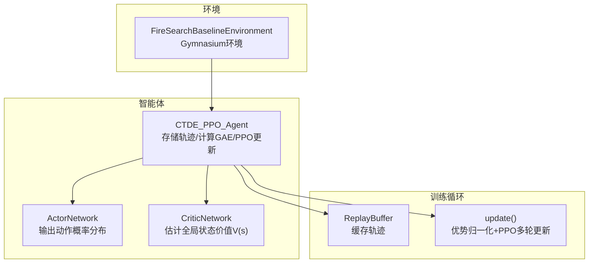
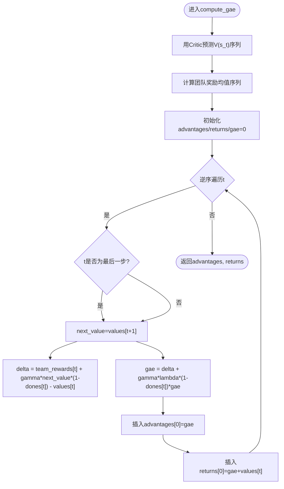
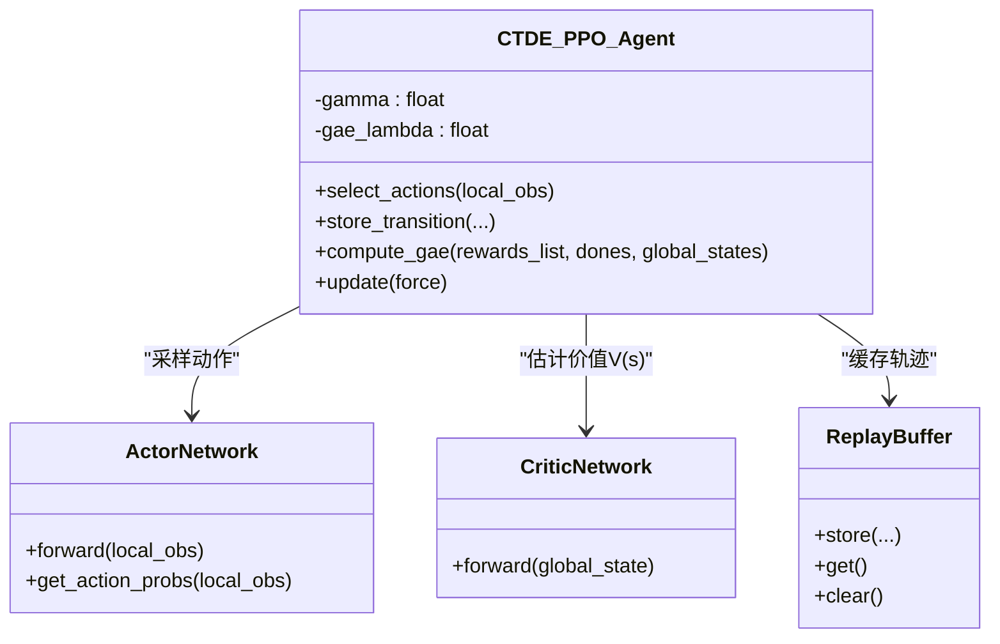

# GAE优势估计实现

<cite>
**本文引用的文件**   
- [ctde_ppo_baseline_train.py](file://environment_variables/environment_variables/ctde_ppo_baseline_train.py)
- [rl_environment_baseline.py](file://environment_variables/environment_variables/rl_environment_baseline.py)
</cite>

## 目录
1. [简介](#简介)
2. [项目结构](#项目结构)
3. [核心组件](#核心组件)
4. [架构总览](#架构总览)
5. [详细组件分析](#详细组件分析)
6. [依赖关系分析](#依赖关系分析)
7. [性能与数值稳定性](#性能与数值稳定性)
8. [故障排查指南](#故障排查指南)
9. [结论](#结论)
10. [附录](#附录)

## 简介
本技术文档围绕仓库中CTDE-PPO基线训练脚本中的GAE（Generalized Advantage Estimation，广义优势估计）实现展开。重点包括：
- GAE的数学理论基础：λ-return、TD残差、偏差-方差权衡
- GAE计算公式与边界条件处理：A^GAE_t = Σ_{l=0}^{∞} (γλ)^l δ_{t+l}，δ_t = r_t + γV(s_{t+1}) - V(s_t)
- gae_lambda参数对偏差-方差的影响及训练表现
- 完整优势函数计算流程：时序差分误差累积、episode终止状态bootstrap处理、数值稳定保证
- Critic价值网络在优势估计中的作用
- 优势归一化与标准化策略及其对训练稳定性的贡献

## 项目结构
本项目采用“环境-智能体-训练循环”的清晰分层：
- 环境层：基于Gymnasium的多无人机火场搜索环境，提供局部观测与全局状态
- 智能体层：Actor-Critic网络与PPO更新逻辑，包含GAE优势估计
- 训练循环：数据收集、优势计算、PPO多轮小批量更新、指标记录与保存



图表来源
- [ctde_ppo_baseline_train.py:460-535](file://environment_variables/environment_variables/ctde_ppo_baseline_train.py#L460-L535)
- [ctde_ppo_baseline_train.py:537-567](file://environment_variables/environment_variables/ctde_ppo_baseline_train.py#L537-L567)
- [ctde_ppo_baseline_train.py:759-991](file://environment_variables/environment_variables/ctde_ppo_baseline_train.py#L759-L991)
- [rl_environment_baseline.py:21-157](file://environment_variables/environment_variables/rl_environment_baseline.py#L21-L157)

章节来源
- [ctde_ppo_baseline_train.py:1-158](file://environment_variables/environment_variables/ctde_ppo_baseline_train.py#L1-L158)
- [rl_environment_baseline.py:1-157](file://environment_variables/environment_variables/rl_environment_baseline.py#L1-L157)

## 核心组件
- ActorNetwork：基于多层全连接与LayerNorm的残差式结构，输出离散动作的对数几率，采样得到动作与log_prob
- CriticNetwork：基于多层全连接与LayerNorm的残差式结构，输出标量价值V(s)，用于优势估计与目标回报
- ReplayBuffer：按时间步缓存局部观测、全局状态、动作、log_prob、奖励、done标志
- CTDE_PPO_Agent：封装训练关键流程，包括选择动作、存储转移、计算GAE、PPO多轮更新、自适应学习率等

章节来源
- [ctde_ppo_baseline_train.py:460-535](file://environment_variables/environment_variables/ctde_ppo_baseline_train.py#L460-L535)
- [ctde_ppo_baseline_train.py:537-567](file://environment_variables/environment_variables/ctde_ppo_baseline_train.py#L537-L567)
- [ctde_ppo_baseline_train.py:759-991](file://environment_variables/environment_variables/ctde_ppo_baseline_train.py#L759-L991)

## 架构总览
下图展示了从环境交互到优势估计再到PPO更新的端到端流程，突出GAE在其中的位置与作用。

```mermaid
sequenceDiagram
participant Env as "环境"
participant Agent as "CTDE_PPO_Agent"
participant Buffer as "ReplayBuffer"
participant Critic as "CriticNetwork"
participant Actor as "ActorNetwork"
loop 每个时间步
Env->>Agent : 返回局部观测与全局状态
Agent->>Actor : 采样动作与log_prob
Agent->>Env : 执行动作
Env-->>Agent : 返回奖励r_t与done_t
Agent->>Buffer : 存储(局部观测, 全局状态, 动作, log_prob, r_t, done_t)
end
Agent->>Critic : 前向计算V(s_t)序列
Agent->>Agent : 计算TD残差δ_t = r_t + γ·V(s_{t+1})·(1-done_t) - V(s_t)
Agent->>Agent : 逆序累积GAE : A_t = δ_t + γ·λ·(1-done_t)·A_{t+1}
Agent->>Agent : 优势归一化 : (A - mean(A)) / (std(A)+ε)
Agent->>Actor : PPO多轮小批量更新(裁剪代理损失+熵正则)
Agent->>Critic : PPO多轮小批量更新(MSE价值损失)
```

图表来源
- [ctde_ppo_baseline_train.py:867-887](file://environment_variables/environment_variables/ctde_ppo_baseline_train.py#L867-L887)
- [ctde_ppo_baseline_train.py:889-991](file://environment_variables/environment_variables/ctde_ppo_baseline_train.py#L889-L991)

## 详细组件分析

### GAE数学基础与公式
- TD残差定义：δ_t = r_t + γ·V(s_{t+1}) - V(s_t)。当t为episode末尾时，下一时刻价值项被置零或乘以(1-done_t)以进行bootstrap截断
- λ-return与GAE：A^GAE_t = Σ_{l=0}^{∞} (γλ)^l δ_{t+l}，等价于逆序递推形式：A_t = δ_t + γ·λ·(1-done_t)·A_{t+1}
- 偏差-方差权衡：λ接近0时退化为单步TD优势（低方差、高偏差），λ接近1时更接近蒙特卡洛优势（高方差、低偏差）。gae_lambda控制该权衡

章节来源
- [ctde_ppo_baseline_train.py:867-887](file://environment_variables/environment_variables/ctde_ppo_baseline_train.py#L867-L887)

### GAE实现细节与边界条件
- 逆序遍历：从最后一个时间步向前累积，确保A_{T}=δ_T且后续项被正确屏蔽
- 终止状态处理：通过(1 - float(dones[t]))因子将下一时刻的价值与累积优势置零，避免跨episode传播
- 团队奖励聚合：对多智能体场景，使用每步奖励的均值作为团队奖励，减少个体噪声
- 数值稳定：在优势归一化时加入极小常数防止除零



图表来源
- [ctde_ppo_baseline_train.py:867-887](file://environment_variables/environment_variables/ctde_ppo_baseline_train.py#L867-L887)

章节来源
- [ctde_ppo_baseline_train.py:867-887](file://environment_variables/environment_variables/ctde_ppo_baseline_train.py#L867-L887)

### Critic价值网络的作用
- 提供V(s_t)估计，用于计算TD残差与目标回报
- 在PPO更新阶段，使用MSE损失优化V(s_t)逼近returns，从而间接提升优势估计质量
- 权重初始化采用正交初始化，有助于稳定训练初期梯度流

章节来源
- [ctde_ppo_baseline_train.py:504-535](file://environment_variables/environment_variables/ctde_ppo_baseline_train.py#L504-L535)
- [ctde_ppo_baseline_train.py:920-926](file://environment_variables/environment_variables/ctde_ppo_baseline_train.py#L920-L926)

### 优势归一化与标准化
- 在每次PPO更新前，对整批优势进行标准化：(A - mean(A)) / (std(A) + ε)
- 作用：降低不同episode间优势尺度差异，提高策略更新的稳定性与收敛速度
- 数值安全：分母加极小常数防止标准差为零导致的数值不稳定

章节来源
- [ctde_ppo_baseline_train.py:897-899](file://environment_variables/environment_variables/ctde_ppo_baseline_train.py#L897-L899)

### gae_lambda参数与偏差-方差权衡
- 默认值：0.95，偏向较高方差但较低偏差的优势估计，适合长视距任务
- 调参建议：
  - 短视距或高噪声环境：适当减小λ（如0.8~0.9）以降低方差
  - 长视距或需要更准确优势信号：增大λ（如0.95~1.0）以提升信息利用度
- 配置入口：DEFAULT_TRAIN_CONFIG与normalize_training_config中对gae_lambda进行类型与范围校验

章节来源
- [ctde_ppo_baseline_train.py:122-123](file://environment_variables/environment_variables/ctde_ppo_baseline_train.py#L122-L123)
- [ctde_ppo_baseline_train.py:240-241](file://environment_variables/environment_variables/ctde_ppo_baseline_train.py#L240-L241)

### 与环境的交互与episode终止处理
- 环境返回done标志表示episode结束；在GAE计算中通过(1 - dones[t])屏蔽下一时刻价值与累积优势
- 团队奖励聚合：对多智能体场景，取各智能体奖励的均值作为团队奖励，简化优势估计并增强稳定性

章节来源
- [ctde_ppo_baseline_train.py:867-887](file://environment_variables/environment_variables/ctde_ppo_baseline_train.py#L867-L887)
- [rl_environment_baseline.py:21-157](file://environment_variables/environment_variables/rl_environment_baseline.py#L21-L157)

## 依赖关系分析
- CTDE_PPO_Agent依赖ActorNetwork与CriticNetwork进行动作采样与价值估计
- compute_gae依赖CriticNetwork输出的V(s_t)序列与环境的rewards/dones
- update方法在计算完优势后进行PPO多轮小批量更新，同时更新Actor与Critic



图表来源
- [ctde_ppo_baseline_train.py:460-535](file://environment_variables/environment_variables/ctde_ppo_baseline_train.py#L460-L535)
- [ctde_ppo_baseline_train.py:537-567](file://environment_variables/environment_variables/ctde_ppo_baseline_train.py#L537-L567)
- [ctde_ppo_baseline_train.py:759-991](file://environment_variables/environment_variables/ctde_ppo_baseline_train.py#L759-L991)

章节来源
- [ctde_ppo_baseline_train.py:460-535](file://environment_variables/environment_variables/ctde_ppo_baseline_train.py#L460-L535)
- [ctde_ppo_baseline_train.py:537-567](file://environment_variables/environment_variables/ctde_ppo_baseline_train.py#L537-L567)
- [ctde_ppo_baseline_train.py:759-991](file://environment_variables/environment_variables/ctde_ppo_baseline_train.py#L759-L991)

## 性能与数值稳定性
- 逆序累积GAE的时间复杂度为O(T)，空间复杂度为O(T)，其中T为episode长度
- 优势归一化可显著降低不同episode间的优势尺度波动，提高PPO更新的稳定性
- 在计算TD残差与GAE时，使用(1 - dones[t])屏蔽终止状态，避免跨episode污染
- 数值稳定措施：
  - 优势归一化分母加极小常数
  - 价值网络权重正交初始化，缓解梯度爆炸/消失
  - 梯度裁剪（max_grad_norm）限制参数更新幅度

章节来源
- [ctde_ppo_baseline_train.py:867-887](file://environment_variables/environment_variables/ctde_ppo_baseline_train.py#L867-L887)
- [ctde_ppo_baseline_train.py:897-899](file://environment_variables/environment_variables/ctde_ppo_baseline_train.py#L897-L899)
- [ctde_ppo_baseline_train.py:920-926](file://environment_variables/environment_variables/ctde_ppo_baseline_train.py#L920-L926)

## 故障排查指南
- 优势发散或不稳定：检查gae_lambda是否过大导致方差过高；尝试减小至0.8~0.9；确认优势归一化是否启用
- episode提前终止导致优势异常：确认dones标志是否正确传递；检查(1 - dones[t])屏蔽逻辑
- 价值估计偏差大：检查Critic网络结构与学习率；观察value_loss是否收敛；必要时调整value_coef
- 训练崩溃或NaN：检查梯度裁剪与数值稳定常数；确认输入数据无异常值

章节来源
- [ctde_ppo_baseline_train.py:867-887](file://environment_variables/environment_variables/ctde_ppo_baseline_train.py#L867-L887)
- [ctde_ppo_baseline_train.py:897-899](file://environment_variables/environment_variables/ctde_ppo_baseline_train.py#L897-L899)
- [ctde_ppo_baseline_train.py:920-926](file://environment_variables/environment_variables/ctde_ppo_baseline_train.py#L920-L926)

## 结论
本仓库中的GAE实现遵循标准理论框架，结合CTDE-PPO的训练流程，提供了稳健的优势估计与策略更新机制。通过合理的gae_lambda设置、优势归一化与终止状态处理，能够在复杂多智能体环境中获得稳定的训练效果。建议在具体任务中根据episode长度与噪声水平微调gae_lambda，并结合价值网络的训练稳定性进行综合调优。

## 附录
- 关键参数位置参考：
  - gae_lambda默认值与归一化校验：[ctde_ppo_baseline_train.py:122-123](file://environment_variables/environment_variables/ctde_ppo_baseline_train.py#L122-L123)、[ctde_ppo_baseline_train.py:240-241](file://environment_variables/environment_variables/ctde_ppo_baseline_train.py#L240-L241)
  - GAE计算与优势归一化：[ctde_ppo_baseline_train.py:867-887](file://environment_variables/environment_variables/ctde_ppo_baseline_train.py#L867-L887)、[ctde_ppo_baseline_train.py:897-899](file://environment_variables/environment_variables/ctde_ppo_baseline_train.py#L897-L899)
  - Critic网络定义与权重初始化：[ctde_ppo_baseline_train.py:504-535](file://environment_variables/environment_variables/ctde_ppo_baseline_train.py#L504-L535)
  - 环境接口与维度定义：[rl_environment_baseline.py:21-157](file://environment_variables/environment_variables/rl_environment_baseline.py#L21-L157)