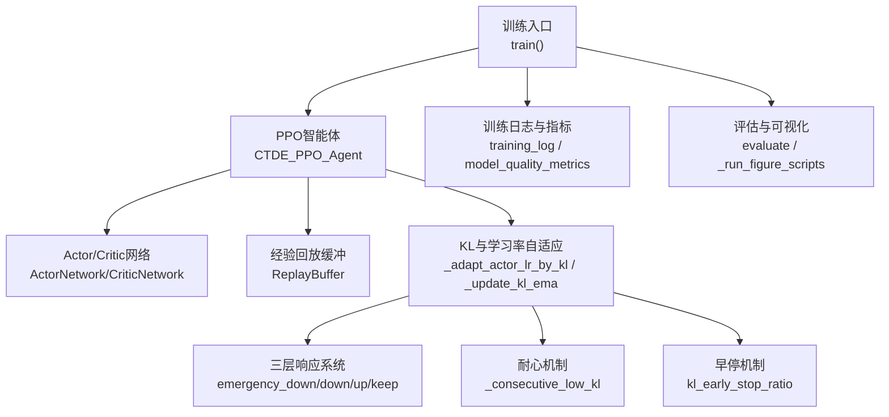
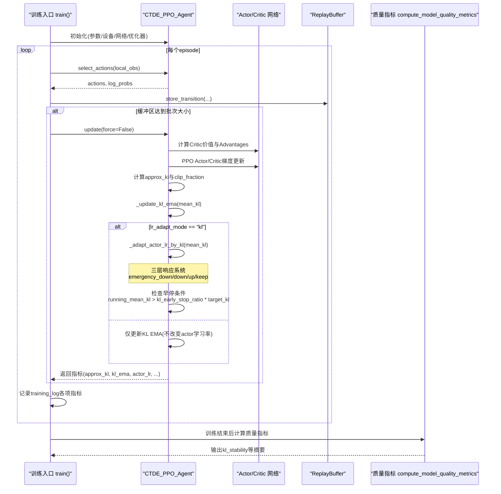
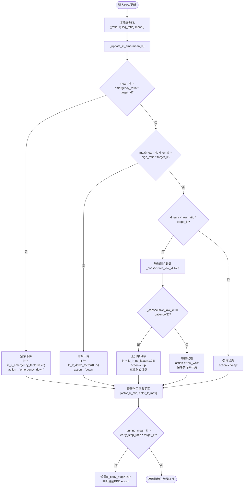
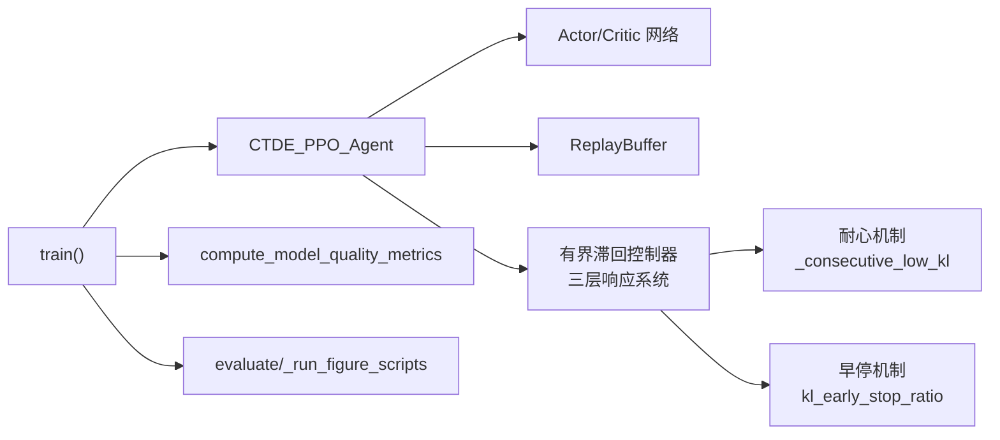

# KL散度监控与自适应学习率

<cite>
**本文引用的文件**   
- [ctde_ppo_baseline_train.py](file://environment_variables/environment_variables/ctde_ppo_baseline_train.py)
- [test_kl_lr_controller.py](file://environment_variables/environment_variables/test_kl_lr_controller.py)
</cite>

## 更新摘要
**所做更改**   
- 完全重构了自适应学习率控制器，从简单指数衰减机制升级为复杂的有界滞回控制器
- 新增多层参数系统，包括低KL比率(0.80)、高KL比率(1.20)、紧急比率(2.00)等关键阈值
- 实现三层响应系统：紧急下降、常规下降、等待上升，以及耐心机制防止频繁调整
- 添加PPO训练过程中的早停机制，当KL超过阈值时提前终止当前epoch
- 增强检查点功能，支持训练状态恢复和向后兼容
- 完善测试套件，验证新控制器的各项功能

## 目录
1. [简介](#简介)
2. [项目结构](#项目结构)
3. [核心组件](#核心组件)
4. [架构总览](#架构总览)
5. [详细组件分析](#详细组件分析)
6. [依赖关系分析](#依赖关系分析)
7. [性能考量](#性能考量)
8. [故障排查指南](#故障排查指南)
9. [结论](#结论)
10. [附录](#附录)

## 简介
本技术文档聚焦于KL散度监控与自适应学习率机制在CTDE-PPO训练中的实现与应用。内容涵盖：
- KL散度在策略优化中的作用、近似KL的估计方法与数值稳定性处理
- target_kl参数的作用与不同取值对训练行为的影响
- **全新升级的有界滞回控制器**，替代原有的简单指数衰减机制
- 三层响应系统的自适应学习率算法，包括紧急下降、常规下降和耐心上升策略
- PPO训练过程中的早停机制，提升训练效率和稳定性
- KL散度监控指标的实现细节（实时计算、历史跟踪、异常检测）
- 固定学习率与自适应学习率的对比实验流程与可视化输出
- 学习率调度曲线与训练稳定性分析
- KL过大或过小的诊断与修复策略

## 项目结构
本项目围绕一个完整的CTDE-PPO基线训练脚本展开，包含：
- 训练主循环、PPO更新、KL散度统计与**有界滞回自适应学习率调整**
- 质量指标计算与日志记录
- 学习率对比实验编排与图表生成调用

**图示来源**
- [ctde_ppo_baseline_train.py:1362-1929](file://environment_variables/environment_variables/ctde_ppo_baseline_train.py#L1362-L1929)
- [ctde_ppo_baseline_train.py:779-1098](file://environment_variables/environment_variables/ctde_ppo_baseline_train.py#L779-L1098)

## 核心组件
- **CTDE_PPO_Agent**：封装Actor/Critic网络、优化器、经验缓冲、GAE计算、PPO多轮更新、KL散度统计与**有界滞回自适应学习率逻辑**
- **ActorNetwork/CriticNetwork**：多层前馈网络，带LayerNorm与正交初始化，提升训练稳定性
- **ReplayBuffer**：按回合收集轨迹并批量采样用于PPO更新
- **训练主循环**：负责环境交互、缓冲区填充、触发更新、记录指标、保存模型与日志
- **质量指标计算**：汇总收敛效率、奖励稳定性与KL稳定性等维度

**章节来源**
- [ctde_ppo_baseline_train.py:779-1098](file://environment_variables/environment_variables/ctde_ppo_baseline_train.py#L779-L1098)
- [ctde_ppo_baseline_train.py:1362-1929](file://environment_variables/environment_variables/ctde_ppo_baseline_train.py#L1362-L1929)

## 架构总览
下图展示从训练入口到PPO更新、KL统计与**有界滞回自适应学习率调整**的完整数据流与控制流。

**图示来源**
- [ctde_ppo_baseline_train.py:1362-1929](file://environment_variables/environment_variables/ctde_ppo_baseline_train.py#L1362-L1929)
- [ctde_ppo_baseline_train.py:943-1060](file://environment_variables/environment_variables/ctde_ppo_baseline_train.py#L943-L1060)
- [ctde_ppo_baseline_train.py:873-901](file://environment_variables/environment_variables/ctde_ppo_baseline_train.py#L873-L901)

## 详细组件分析

### 有界滞回控制器与自适应学习率（CTDE_PPO_Agent）
**重大更新** 从简单指数衰减机制升级为复杂的有界滞回控制器：

- **三层响应系统**：
  - **紧急下降**：当mean_kl > kl_lr_emergency_ratio * target_kl时，使用kl_lr_emergency_factor(0.70)大幅降低学习率
  - **常规下降**：当max(mean_kl, kl_ema) > kl_lr_high_ratio * target_kl时，使用kl_lr_down_factor(0.85)适度降低学习率  
  - **耐心上升**：当kl_ema < kl_lr_low_ratio * target_kl时，需要连续kl_lr_low_patience(3)次才增加学习率，使用kl_lr_up_factor(1.03)小幅提升
  - **保持状态**：其他情况下保持当前学习率不变

- **数值稳定性**：ratio通过exp(log_ratio)计算；clip_fraction统计被裁剪的比例以辅助判断策略变化幅度
- **EMA平滑**：维护kl_ema，采用指数移动平均对mean_kl进行平滑，降低噪声影响
- **早停机制**：在PPO训练过程中，如果running_mean_kl > kl_early_stop_ratio * target_kl，立即停止当前epoch的训练
- **滞后效应**：通过_consecutive_low_kl计数器实现迟滞特性，防止学习率在边界附近频繁震荡

**图示来源**
- [ctde_ppo_baseline_train.py:873-901](file://environment_variables/environment_variables/ctde_ppo_baseline_train.py#L873-L901)
- [ctde_ppo_baseline_train.py:1027-1032](file://environment_variables/environment_variables/ctde_ppo_baseline_train.py#L1027-L1032)

**章节来源**
- [ctde_ppo_baseline_train.py:873-901](file://environment_variables/environment_variables/ctde_ppo_baseline_train.py#L873-L901)
- [ctde_ppo_baseline_train.py:1027-1032](file://environment_variables/environment_variables/ctde_ppo_baseline_train.py#L1027-L1032)

### 配置与参数归一化（DEFAULT_TRAIN_CONFIG与normalize_training_config）
**重大更新** 新增多层参数系统：

- **关键参数**：
  - lr_adapt_mode：支持"fixed"与"kl"两种模式
  - target_kl：目标KL散度，用于自适应学习率的目标参考
  - actor_lr_min/actor_lr_max：actor学习率上下界
  - kl_ema_beta：KL EMA平滑系数，范围被裁剪至[0, 0.999]
  - **kl_lr_low_ratio (0.80)**：低KL阈值比率，低于此值考虑增加学习率
  - **kl_lr_high_ratio (1.20)**：高KL阈值比率，高于此值降低学习率
  - **kl_lr_emergency_ratio (2.00)**：紧急KL阈值比率，远高于此值大幅降低学习率
  - **kl_lr_up_factor (1.03)**：学习率上升因子，小幅增加
  - **kl_lr_down_factor (0.85)**：学习率下降因子，适度减少
  - **kl_lr_emergency_factor (0.70)**：紧急下降因子，大幅减少
  - **kl_lr_low_patience (3)**：耐心计数，连续多次低于低阈值才上升
  - **kl_early_stop_ratio (1.50)**：早停阈值比率，超过此值中断当前epoch

- **参数约束**：确保合理的参数范围，如kl_lr_low_ratio ≤ kl_lr_high_ratio ≤ kl_lr_emergency_ratio，kl_lr_up_factor ≥ 1.0，kl_lr_down_factor ∈ [1e-6, 1.0]等

**章节来源**
- [ctde_ppo_baseline_train.py:98-165](file://environment_variables/environment_variables/ctde_ppo_baseline_train.py#L98-L165)
- [ctde_ppo_baseline_train.py:245-259](file://environment_variables/environment_variables/ctde_ppo_baseline_train.py#L245-L259)

### 增强的检查点与状态管理
**重大更新** 支持训练状态恢复和向后兼容：

- **检查点格式**：包含actor/critic状态、优化器状态、训练步骤、KL控制器状态
- **训练状态恢复**：支持恢复kl_ema、_consecutive_low_kl、target_kl等控制器状态
- **向后兼容**：支持加载旧格式的检查点文件，自动迁移到新的控制器状态格式
- **评估模式**：支持仅加载模型权重而不恢复训练状态的评估模式

**章节来源**
- [ctde_ppo_baseline_train.py:1062-1098](file://environment_variables/environment_variables/ctde_ppo_baseline_train.py#L1062-L1098)

### 质量指标与KL稳定性分析（compute_model_quality_metrics）
- 收敛效率：任务得分AUC、到达阈值步数/更新次数
- 奖励稳定性：尾部标准差、性能下降均值/最大值
- KL稳定性：
  - mean_kl、kl_std
  - mean_abs_kl_error：与target_kl的平均绝对误差
  - kl_overshoot_rate：超过两倍target_kl的频率
  - clip_fraction_mean/std：策略裁剪比例统计
  - actor_lr_mean/min/max：自适应学习率的历史统计
  - num_ppo_updates_measured：实际参与统计的更新次数

**章节来源**
- [ctde_ppo_baseline_train.py:378-453](file://environment_variables/environment_variables/ctde_ppo_baseline_train.py#L378-L453)

### 学习率对比实验（run_lr_comparison）
- 变体：
  - Fixed_LR_CTDE_PPO：固定学习率
  - KL_LR_CTDE_PPO：基于KL的自适应学习率
- 多随机种子运行，分别保存训练日志、质量指标与泛化评估结果
- 自动生成训练与泛化图表，便于对比分析

**章节来源**
- [ctde_ppo_baseline_train.py:2039-2195](file://environment_variables/environment_variables/ctde_ppo_baseline_train.py#L2039-L2195)

## 依赖关系分析
- 模块耦合：
  - 训练入口依赖Agent进行交互与更新
  - Agent内部依赖网络与缓冲，同时管理KL与**有界滞回学习率自适应**
  - 质量指标函数独立读取training_log进行离线分析
- 外部依赖：
  - PyTorch张量与分布操作用于策略采样与KL估计
  - NumPy用于统计与滚动窗口计算
  - JSON/NPZ用于日志持久化

**图示来源**
- [ctde_ppo_baseline_train.py:1362-1929](file://environment_variables/environment_variables/ctde_ppo_baseline_train.py#L1362-L1929)
- [ctde_ppo_baseline_train.py:779-1098](file://environment_variables/environment_variables/ctde_ppo_baseline_train.py#L779-L1098)
- [ctde_ppo_baseline_train.py:378-453](file://environment_variables/environment_variables/ctde_ppo_baseline_train.py#L378-L453)

**章节来源**
- [ctde_ppo_baseline_train.py:1362-1929](file://environment_variables/environment_variables/ctde_ppo_baseline_train.py#L1362-L1929)
- [ctde_ppo_baseline_train.py:779-1098](file://environment_variables/environment_variables/ctde_ppo_baseline_train.py#L779-L1098)
- [ctde_ppo_baseline_train.py:378-453](file://environment_variables/environment_variables/ctde_ppo_baseline_train.py#L378-L453)

## 性能考量
- 小批量与多轮更新：mini_batch_size与ppo_epochs控制每次更新的样本规模与迭代次数，影响KL估计方差与学习稳定性
- 优势标准化：advantages标准化有助于减少梯度方差，间接影响KL估计的稳定性
- 梯度裁剪：max_grad_norm防止梯度爆炸，提高训练鲁棒性
- **早停机制**：当KL超过早停阈值时提前终止当前PPO epoch，避免过度更新导致的不稳定
- **滞后效应**：通过耐心机制减少学习率频繁调整，提高训练稳定性
- 设备选择：自动选择GPU/CPU，避免不必要的开销

**章节来源**
- [ctde_ppo_baseline_train.py:943-1060](file://environment_variables/environment_variables/ctde_ppo_baseline_train.py#L943-L1060)
- [ctde_ppo_baseline_train.py:1027-1032](file://environment_variables/environment_variables/ctde_ppo_baseline_train.py#L1027-L1032)

## 故障排查指南
- **KL过大（频繁超过紧急阈值）**：
  - 现象：频繁触发emergency_down动作，actor学习率快速下降
  - 诊断：检查kl_lr_emergency_ratio是否过小、ppo_epochs或batch_size是否过大导致单次更新步长过大
  - 修复：增大kl_lr_emergency_ratio、减小ppo_epochs或增大batch_size、适当增大kl_ema_beta以平滑噪声
- **KL中等偏高（频繁超过高阈值）**：
  - 现象：频繁触发down动作，actor学习率逐步下降
  - 诊断：检查kl_lr_high_ratio是否过小、target_kl设置是否合理
  - 修复：增大kl_lr_high_ratio或target_kl、检查clip_epsilon是否合适
- **KL过低（长期低于低阈值）**：
  - 现象：长时间处于low_wait状态，最终触发up动作
  - 诊断：检查kl_lr_low_ratio是否过大、entropy_coef是否过高导致探索过度
  - 修复：减小kl_lr_low_ratio、降低entropy_coef或增大kl_lr_low_patience以减少误判
- **学习率震荡**：
  - 现象：actor_lr在边界附近频繁波动
  - 诊断：检查kl_lr_low_patience是否过小导致过早上升，或kl_lr_up_factor是否过大
  - 修复：增大kl_lr_low_patience、减小kl_lr_up_factor
- **早停频繁触发**：
  - 现象：ppo_epochs_completed远小于配置的ppo_epochs
  - 诊断：检查kl_early_stop_ratio是否过小
  - 修复：增大kl_early_stop_ratio或减小target_kl
- **训练不稳定**：
  - 现象：reward_std_tail与task_score_std_tail升高
  - 诊断：检查max_grad_norm是否过小导致欠拟合，或advantages标准化分母过小导致数值不稳定
  - 修复：调整max_grad_norm、确保标准化分母有足够正则项

**章节来源**
- [ctde_ppo_baseline_train.py:378-453](file://environment_variables/environment_variables/ctde_ppo_baseline_train.py#L378-L453)
- [ctde_ppo_baseline_train.py:873-901](file://environment_variables/environment_variables/ctde_ppo_baseline_train.py#L873-L901)
- [ctde_ppo_baseline_train.py:1027-1032](file://environment_variables/environment_variables/ctde_ppo_baseline_train.py#L1027-L1032)

## 结论
- **有界滞回控制器**作为策略更新的智能约束信号，结合EMA平滑与三层响应系统，能有效维持策略变化的可控性与训练稳定性
- **多层阈值系统**（低、高、紧急）提供了细粒度的学习率控制，适应不同的KL散度水平
- **耐心机制**有效防止学习率在边界附近的频繁震荡，提高训练稳定性
- **早停机制**在PPO训练过程中提供额外的安全保障，避免过度更新导致的发散
- **增强的检查点系统**支持训练状态恢复和向后兼容，便于实验管理和复现
- target_kl决定期望的策略变化幅度，需与环境复杂度、batch规模与ppo_epochs协同调参
- 各参数共同决定自适应学习率的响应速度与平滑程度，建议先设定合理的阈值比率，再微调因子和耐心参数
- 固定学习率与自适应学习率的对比实验提供了可复现的分析框架，配合质量指标与可视化输出，便于系统性评估与改进

## 附录

### KL散度数学定义与近似估计
- 离散分布KL散度定义：D_KL(P||Q) = Σ P(x) log(P(x)/Q(x))
- 在PPO中，常用近似KL估计：((ratio - 1) - log_ratio).mean()，其中ratio = exp(new_log_prob - old_log_prob)
- 该近似在ratio接近1时具有良好的数值性质，适合在线监控与自适应控制

**章节来源**
- [ctde_ppo_baseline_train.py:1014-1016](file://environment_variables/environment_variables/ctde_ppo_baseline_train.py#L1014-L1016)

### 有界滞回控制器参数调优指南
- **阈值比率设置**：
  - kl_lr_low_ratio：初始0.80左右，表示低于目标KL 20%时考虑增加学习率
  - kl_lr_high_ratio：初始1.20左右，表示高于目标KL 20%时降低学习率
  - kl_lr_emergency_ratio：初始2.00左右，表示高于目标KL 100%时紧急降低学习率
- **响应因子设置**：
  - kl_lr_up_factor：初始1.03左右，小幅增加学习率（3%）
  - kl_lr_down_factor：初始0.85左右，适度降低学习率（15%）
  - kl_lr_emergency_factor：初始0.70左右，大幅降低学习率（30%）
- **耐心与早停设置**：
  - kl_lr_low_patience：初始3次，连续3次低于低阈值才增加学习率
  - kl_early_stop_ratio：初始1.50，当KL超过目标1.5倍时中断当前epoch
- **调优建议**：
  - 首先根据任务难度设置合适的target_kl
  - 然后调整阈值比率，确保三层响应的合理性
  - 最后微调响应因子和耐心参数，平衡响应速度与稳定性

**章节来源**
- [ctde_ppo_baseline_train.py:120-128](file://environment_variables/environment_variables/ctde_ppo_baseline_train.py#L120-L128)
- [ctde_ppo_baseline_train.py:873-901](file://environment_variables/environment_variables/ctde_ppo_baseline_train.py#L873-L901)

### 监控指标与可视化
- 训练日志字段：approx_kl、kl_ema、kl_lr_action、clip_fraction、actor_lr、consecutive_low_kl、kl_early_stop等
- 质量指标：kl_stability提供mean_kl、kl_std、mean_abs_kl_error、kl_overshoot_rate等
- 可视化：训练与泛化图表由外部脚本生成，便于观察学习率调度曲线与稳定性趋势

**章节来源**
- [ctde_ppo_baseline_train.py:1489-1536](file://environment_variables/environment_variables/ctde_ppo_baseline_train.py#L1489-L1536)
- [ctde_ppo_baseline_train.py:378-453](file://environment_variables/environment_variables/ctde_ppo_baseline_train.py#L378-L453)

### 测试用例说明
- **默认配置验证**：验证新控制器的默认参数设置正确
- **耐心机制测试**：验证低KL时需要连续多次才增加学习率
- **紧急下降测试**：验证紧急情况下只降低actor学习率而不影响critic学习率
- **检查点恢复测试**：验证训练状态的正确恢复和向后兼容性
- **早停机制测试**：验证PPO训练过程中的早停功能

**章节来源**
- [test_kl_lr_controller.py:31-124](file://environment_variables/environment_variables/test_kl_lr_controller.py#L31-L124)