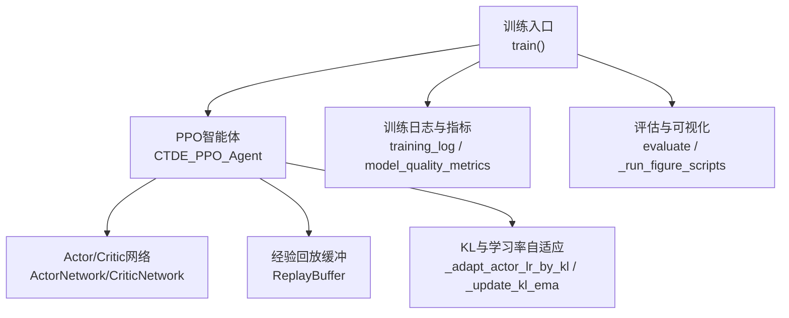
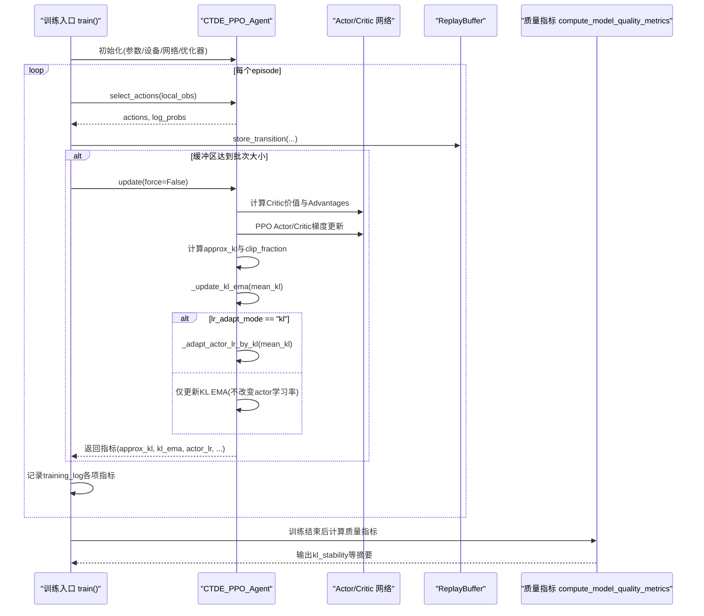
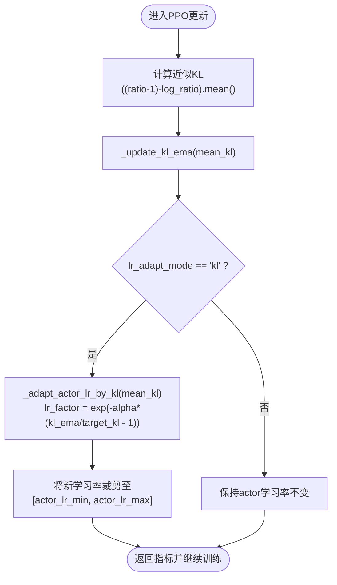
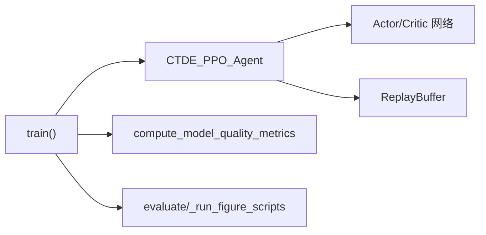

# KL散度监控与自适应学习率

<cite>
**本文引用的文件**   
- [ctde_ppo_baseline_train.py](file://environment_variables/environment_variables/ctde_ppo_baseline_train.py)
- [model_quality_metrics.json](file://environment_variables/environment_variables/outputs/lr_comparison_20260709_095438/训练结果/KL_LR_CTDE_PPO_seed42/logs/model_quality_metrics.json)
</cite>

## 目录
1. [简介](#简介)
2. [项目结构](#项目结构)
3. [核心组件](#核心组件)
4. [架构总览](#架构总览)
5. [详细组件分析](#详细组件分析)
6. [依赖关系分析](#依赖关系分析)
7. [性能考量](#性能考量)
8. [故障排查指南](#故障排查指南)
9. [结论](#结论)
10. [附录](#附录)

## 简介
本技术文档聚焦于KL散度监控与自适应学习率机制在CTDE-PPO训练中的实现与应用。内容涵盖：
- KL散度在策略优化中的作用、近似KL的估计方法与数值稳定性处理
- target_kl参数的作用与不同取值对训练行为的影响
- 基于EMA平滑与指数调节的自适应学习率算法，以及kl_ema_beta与kl_lr_alpha的调优建议
- KL散度监控指标的实现细节（实时计算、历史跟踪、异常检测）
- 固定学习率与自适应学习率的对比实验流程与可视化输出
- 学习率调度曲线与训练稳定性分析
- KL过大或过小的诊断与修复策略

## 项目结构
本项目围绕一个完整的CTDE-PPO基线训练脚本展开，包含：
- 训练主循环、PPO更新、KL散度统计与自适应学习率调整
- 质量指标计算与日志记录
- 学习率对比实验编排与图表生成调用

图示来源
- [ctde_ppo_baseline_train.py:1278-1814](file://environment_variables/environment_variables/ctde_ppo_baseline_train.py#L1278-L1814)
- [ctde_ppo_baseline_train.py:759-1014](file://environment_variables/environment_variables/ctde_ppo_baseline_train.py#L759-L1014)

章节来源
- [ctde_ppo_baseline_train.py:1278-1814](file://environment_variables/environment_variables/ctde_ppo_baseline_train.py#L1278-L1814)
- [ctde_ppo_baseline_train.py:759-1014](file://environment_variables/environment_variables/ctde_ppo_baseline_train.py#L759-L1014)

## 核心组件
- CTDE_PPO_Agent：封装Actor/Critic网络、优化器、经验缓冲、GAE计算、PPO多轮更新、KL散度统计与自适应学习率逻辑
- ActorNetwork/CriticNetwork：多层前馈网络，带LayerNorm与正交初始化，提升训练稳定性
- ReplayBuffer：按回合收集轨迹并批量采样用于PPO更新
- 训练主循环：负责环境交互、缓冲区填充、触发更新、记录指标、保存模型与日志
- 质量指标计算：汇总收敛效率、奖励稳定性与KL稳定性等维度

章节来源
- [ctde_ppo_baseline_train.py:759-1014](file://environment_variables/environment_variables/ctde_ppo_baseline_train.py#L759-L1014)
- [ctde_ppo_baseline_train.py:1278-1814](file://environment_variables/environment_variables/ctde_ppo_baseline_train.py#L1278-L1814)

## 架构总览
下图展示从训练入口到PPO更新、KL统计与自适应学习率调整的完整数据流与控制流。

图示来源
- [ctde_ppo_baseline_train.py:1278-1814](file://environment_variables/environment_variables/ctde_ppo_baseline_train.py#L1278-L1814)
- [ctde_ppo_baseline_train.py:889-991](file://environment_variables/environment_variables/ctde_ppo_baseline_train.py#L889-L991)
- [ctde_ppo_baseline_train.py:828-847](file://environment_variables/environment_variables/ctde_ppo_baseline_train.py#L828-L847)
- [ctde_ppo_baseline_train.py:358-433](file://environment_variables/environment_variables/ctde_ppo_baseline_train.py#L358-L433)

## 详细组件分析

### KL散度监控与自适应学习率（CTDE_PPO_Agent）
- 近似KL散度估计：在PPO小批量更新中，使用比率与log比率的二阶泰勒近似形式进行估计，并在无梯度模式下累积均值
- 数值稳定性：ratio通过exp(log_ratio)计算；clip_fraction统计被裁剪的比例以辅助判断策略变化幅度
- EMA平滑：维护kl_ema，采用指数移动平均对mean_kl进行平滑，降低噪声影响
- 自适应学习率：当lr_adapt_mode为"kl"时，依据kl_ema与target_kl的相对偏差，通过指数因子动态缩放actor学习率，并限制在[min,max]范围内
- 固定模式：当lr_adapt_mode为"fixed"时，仅更新KL EMA而不改变actor学习率

图示来源
- [ctde_ppo_baseline_train.py:958-966](file://environment_variables/environment_variables/ctde_ppo_baseline_train.py#L958-L966)
- [ctde_ppo_baseline_train.py:828-847](file://environment_variables/environment_variables/ctde_ppo_baseline_train.py#L828-L847)
- [ctde_ppo_baseline_train.py:974-978](file://environment_variables/environment_variables/ctde_ppo_baseline_train.py#L974-L978)

章节来源
- [ctde_ppo_baseline_train.py:889-991](file://environment_variables/environment_variables/ctde_ppo_baseline_train.py#L889-L991)
- [ctde_ppo_baseline_train.py:828-847](file://environment_variables/environment_variables/ctde_ppo_baseline_train.py#L828-L847)

### 配置与参数归一化（DEFAULT_TRAIN_CONFIG与normalize_training_config）
- 关键参数：
  - lr_adapt_mode：支持"fixed"与"kl"两种模式
  - target_kl：目标KL散度，用于自适应学习率的目标参考
  - actor_lr_min/actor_lr_max：actor学习率上下界
  - kl_ema_beta：KL EMA平滑系数，范围被裁剪至[0, 0.999]
  - kl_lr_alpha：自适应学习率敏感度系数，非负
- 归一化过程确保参数合法（如最小值约束、类型转换、范围裁剪），并提供quality_target_kl用于质量指标计算

章节来源
- [ctde_ppo_baseline_train.py:98-158](file://environment_variables/environment_variables/ctde_ppo_baseline_train.py#L98-L158)
- [ctde_ppo_baseline_train.py:232-240](file://environment_variables/environment_variables/ctde_ppo_baseline_train.py#L232-L240)
- [ctde_ppo_baseline_train.py:266-269](file://environment_variables/environment_variables/ctde_ppo_baseline_train.py#L266-L269)

### 质量指标与KL稳定性分析（compute_model_quality_metrics）
- 收敛效率：任务得分AUC、到达阈值步数/更新次数
- 奖励稳定性：尾部标准差、性能下降均值/最大值
- KL稳定性：
  - mean_kl、kl_std
  - mean_abs_kl_error：与target_kl的平均绝对误差
  - kl_overshoot_rate：超过两倍target_kl的频率
  - clip_fraction_mean/std：策略裁剪比例统计
  - actor_lr_mean/min/max：自适应学习率的历史统计
  - num_ppo_updates_measured：实际参与统计的更新次数

章节来源
- [ctde_ppo_baseline_train.py:358-433](file://environment_variables/environment_variables/ctde_ppo_baseline_train.py#L358-L433)

### 学习率对比实验（run_lr_comparison）
- 变体：
  - Fixed_LR_CTDE_PPO：固定学习率
  - KL_LR_CTDE_PPO：基于KL的自适应学习率
- 多随机种子运行，分别保存训练日志、质量指标与泛化评估结果
- 自动生成训练与泛化图表，便于对比分析

章节来源
- [ctde_ppo_baseline_train.py:1924-2080](file://environment_variables/environment_variables/ctde_ppo_baseline_train.py#L1924-L2080)

### 示例指标解读（model_quality_metrics.json）
- 示例显示KL均值接近目标、超限率为零、clip_fraction稳定、actor学习率在合理区间内波动，表明自适应学习率有效且训练稳定

章节来源
- [model_quality_metrics.json:1-31](file://environment_variables/environment_variables/outputs/lr_comparison_20260709_095438/训练结果/KL_LR_CTDE_PPO_seed42/logs/model_quality_metrics.json#L1-L31)

## 依赖关系分析
- 模块耦合：
  - 训练入口依赖Agent进行交互与更新
  - Agent内部依赖网络与缓冲，同时管理KL与学习率自适应
  - 质量指标函数独立读取training_log进行离线分析
- 外部依赖：
  - PyTorch张量与分布操作用于策略采样与KL估计
  - NumPy用于统计与滚动窗口计算
  - JSON/NPZ用于日志持久化

图示来源
- [ctde_ppo_baseline_train.py:1278-1814](file://environment_variables/environment_variables/ctde_ppo_baseline_train.py#L1278-L1814)
- [ctde_ppo_baseline_train.py:759-1014](file://environment_variables/environment_variables/ctde_ppo_baseline_train.py#L759-L1014)
- [ctde_ppo_baseline_train.py:358-433](file://environment_variables/environment_variables/ctde_ppo_baseline_train.py#L358-L433)

章节来源
- [ctde_ppo_baseline_train.py:1278-1814](file://environment_variables/environment_variables/ctde_ppo_baseline_train.py#L1278-L1814)
- [ctde_ppo_baseline_train.py:759-1014](file://environment_variables/environment_variables/ctde_ppo_baseline_train.py#L759-L1014)
- [ctde_ppo_baseline_train.py:358-433](file://environment_variables/environment_variables/ctde_ppo_baseline_train.py#L358-L433)

## 性能考量
- 小批量与多轮更新：mini_batch_size与ppo_epochs控制每次更新的样本规模与迭代次数，影响KL估计方差与学习稳定性
- 优势标准化：advantages标准化有助于减少梯度方差，间接影响KL估计的稳定性
- 梯度裁剪：max_grad_norm防止梯度爆炸，提高训练鲁棒性
- 设备选择：自动选择GPU/CPU，避免不必要的开销

章节来源
- [ctde_ppo_baseline_train.py:800-814](file://environment_variables/environment_variables/ctde_ppo_baseline_train.py#L800-L814)
- [ctde_ppo_baseline_train.py:898-900](file://environment_variables/environment_variables/ctde_ppo_baseline_train.py#L898-L900)
- [ctde_ppo_baseline_train.py:925-926](file://environment_variables/environment_variables/ctde_ppo_baseline_train.py#L925-L926)
- [ctde_ppo_baseline_train.py:955-956](file://environment_variables/environment_variables/ctde_ppo_baseline_train.py#L955-L956)

## 故障排查指南
- KL过大（频繁超过2倍target_kl）：
  - 现象：kl_overshoot_rate升高，clip_fraction增大，actor学习率可能快速下降
  - 诊断：检查target_kl是否过小、ppo_epochs或batch_size是否过大导致单次更新步长过大
  - 修复：增大target_kl、减小ppo_epochs或增大batch_size、适当增大kl_ema_beta以平滑噪声
- KL过小（长期低于target_kl）：
  - 现象：mean_abs_kl_error较大但方向为负，actor学习率可能上升
  - 诊断：检查clip_epsilon是否过小导致策略更新受限，或熵系数过高导致探索过度
  - 修复：适度增大clip_epsilon、降低entropy_coef或减小kl_lr_alpha以降低学习率敏感性
- 学习率震荡：
  - 现象：actor_lr_mean/min/max波动剧烈
  - 诊断：检查kl_lr_alpha是否过大导致指数因子敏感
  - 修复：减小kl_lr_alpha或增大kl_ema_beta以增强平滑
- 训练不稳定：
  - 现象：reward_std_tail与task_score_std_tail升高
  - 诊断：检查max_grad_norm是否过小导致欠拟合，或advantages标准化分母过小导致数值不稳定
  - 修复：调整max_grad_norm、确保标准化分母有足够正则项

章节来源
- [ctde_ppo_baseline_train.py:358-433](file://environment_variables/environment_variables/ctde_ppo_baseline_train.py#L358-L433)
- [ctde_ppo_baseline_train.py:828-847](file://environment_variables/environment_variables/ctde_ppo_baseline_train.py#L828-L847)
- [ctde_ppo_baseline_train.py:898-900](file://environment_variables/environment_variables/ctde_ppo_baseline_train.py#L898-L900)

## 结论
- 近似KL散度作为策略更新的约束信号，结合EMA平滑与指数自适应学习率，能有效维持策略变化的可控性与训练稳定性
- target_kl决定期望的策略变化幅度，需与环境复杂度、batch规模与ppo_epochs协同调参
- kl_ema_beta与kl_lr_alpha共同决定自适应学习率的响应速度与平滑程度，建议先设定合理的kl_ema_beta，再微调kl_lr_alpha
- 固定学习率与自适应学习率的对比实验提供了可复现的分析框架，配合质量指标与可视化输出，便于系统性评估与改进

## 附录

### KL散度数学定义与近似估计
- 离散分布KL散度定义：D_KL(P||Q) = Σ P(x) log(P(x)/Q(x))
- 在PPO中，常用近似KL估计：((ratio - 1) - log_ratio).mean()，其中ratio = exp(new_log_prob - old_log_prob)
- 该近似在ratio接近1时具有良好的数值性质，适合在线监控与自适应控制

章节来源
- [ctde_ppo_baseline_train.py:958-966](file://environment_variables/environment_variables/ctde_ppo_baseline_train.py#L958-L966)

### 自适应学习率公式与参数调优
- 自适应因子：lr_factor = exp(-kl_lr_alpha * (kl_ema / target_kl - 1))
- 新学习率：new_lr = clip(current_lr * lr_factor, actor_lr_min, actor_lr_max)
- 调优建议：
  - kl_ema_beta：初始0.9左右，若KL噪声大可适当增大至0.95~0.99
  - kl_lr_alpha：初始0.1左右，若学习率波动大则减小，若响应迟缓则增大
  - target_kl：根据任务难度与batch规模设置，常见范围0.005~0.05

章节来源
- [ctde_ppo_baseline_train.py:828-847](file://environment_variables/environment_variables/ctde_ppo_baseline_train.py#L828-L847)
- [ctde_ppo_baseline_train.py:232-240](file://environment_variables/environment_variables/ctde_ppo_baseline_train.py#L232-L240)

### 监控指标与可视化
- 训练日志字段：approx_kl、kl_ema、kl_lr_action、clip_fraction、actor_lr等
- 质量指标：kl_stability提供mean_kl、kl_std、mean_abs_kl_error、kl_overshoot_rate等
- 可视化：训练与泛化图表由外部脚本生成，便于观察学习率调度曲线与稳定性趋势

章节来源
- [ctde_ppo_baseline_train.py:1393-1450](file://environment_variables/environment_variables/ctde_ppo_baseline_train.py#L1393-L1450)
- [ctde_ppo_baseline_train.py:358-433](file://environment_variables/environment_variables/ctde_ppo_baseline_train.py#L358-L433)
- [ctde_ppo_baseline_train.py:1048-1116](file://environment_variables/environment_variables/ctde_ppo_baseline_train.py#L1048-L1116)