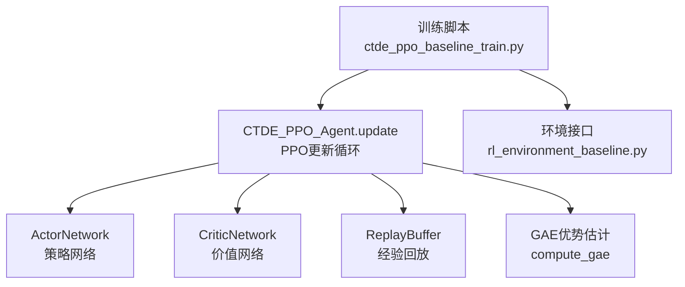
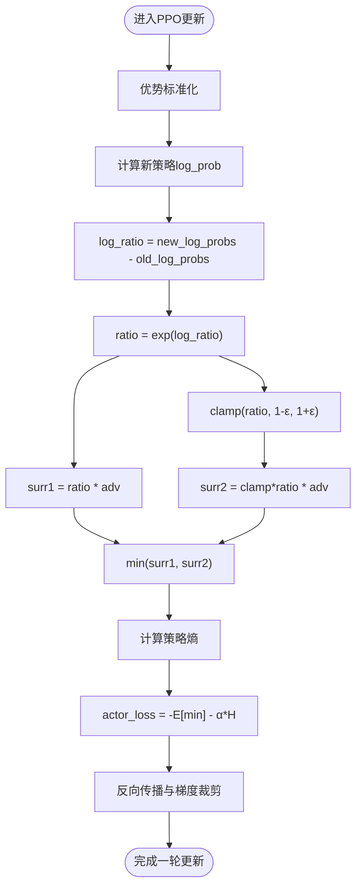
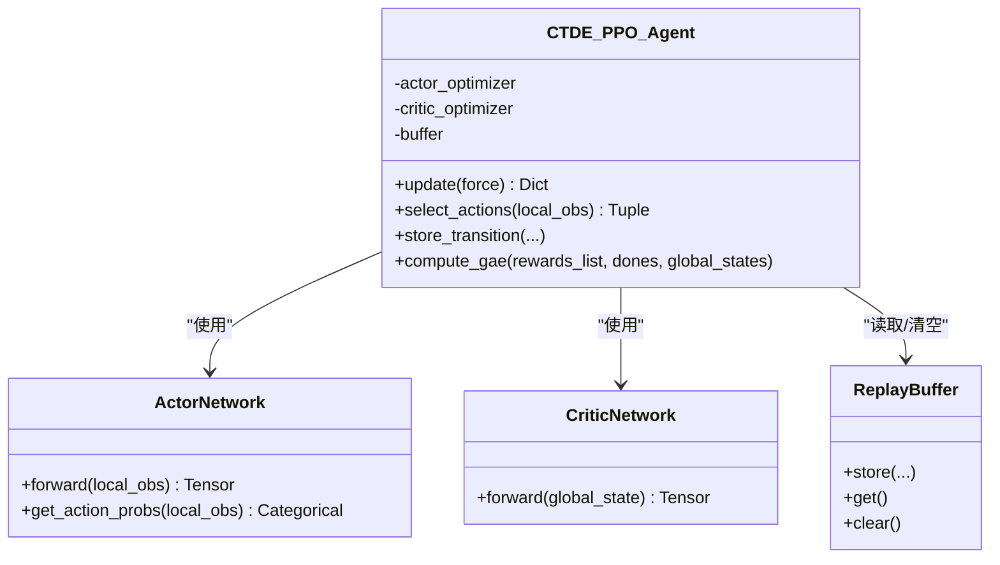

# PPO目标函数与裁剪机制

<cite>
**本文引用的文件**
- [ctde_ppo_baseline_train.py](file://environment_variables/environment_variables/ctde_ppo_baseline_train.py)
- [rl_environment_baseline.py](file://environment_variables/environment_variables/rl_environment_baseline.py)
</cite>

## 目录
1. [引言](#引言)
2. [项目结构](#项目结构)
3. [核心组件](#核心组件)
4. [架构总览](#架构总览)
5. [详细组件分析](#详细组件分析)
6. [依赖关系分析](#依赖关系分析)
7. [性能与数值稳定性](#性能与数值稳定性)
8. [故障排查指南](#故障排查指南)
9. [结论](#结论)
10. [附录：参数与训练流程对照](#附录参数与训练流程对照)

## 引言
本技术文档聚焦于PPO-Clip算法在本仓库中的实现，系统阐述重要性采样比率、裁剪目标函数、熵正则化项的作用与实现细节，并结合代码路径给出梯度计算、损失分解与反向传播的要点说明。同时提供不同clip_epsilon取值对训练稳定性的影响分析与实践建议。

## 项目结构
本项目围绕CTDE-PPO基线训练脚本展开，核心算法逻辑集中在单一训练脚本中，环境定义位于独立模块。关键位置如下：
- PPO代理类与更新循环：[CTDE_PPO_Agent.update:889-991](file://environment_variables/environment_variables/ctde_ppo_baseline_train.py#L889-L991)
- GAE优势估计：[compute_gae:867-887](file://environment_variables/environment_variables/ctde_ppo_baseline_train.py#L867-L887)
- Actor/Critic网络定义：[ActorNetwork:460-502](file://environment_variables/environment_variables/ctde_ppo_baseline_train.py#L460-L502)、[CriticNetwork:504-535](file://environment_variables/environment_variables/ctde_ppo_baseline_train.py#L504-L535)
- 环境与观测/动作空间：[FireSearchBaselineEnvironment:21-200](file://environment_variables/environment_variables/rl_environment_baseline.py#L21-L200)



图表来源
- [ctde_ppo_baseline_train.py:889-991](file://environment_variables/environment_variables/ctde_ppo_baseline_train.py#L889-L991)
- [ctde_ppo_baseline_train.py:460-535](file://environment_variables/environment_variables/ctde_ppo_baseline_train.py#L460-L535)
- [rl_environment_baseline.py:21-200](file://environment_variables/environment_variables/rl_environment_baseline.py#L21-L200)

章节来源
- [ctde_ppo_baseline_train.py:889-991](file://environment_variables/environment_variables/ctde_ppo_baseline_train.py#L889-L991)
- [ctde_ppo_baseline_train.py:867-887](file://environment_variables/environment_variables/ctde_ppo_baseline_train.py#L867-L887)
- [ctde_ppo_baseline_train.py:460-535](file://environment_variables/environment_variables/ctde_ppo_baseline_train.py#L460-L535)
- [rl_environment_baseline.py:21-200](file://environment_variables/environment_variables/rl_environment_baseline.py#L21-L200)

## 核心组件
- CTDE_PPO_Agent：封装策略与价值网络、优化器、缓冲区以及PPO更新流程；支持KL自适应学习率与多轮mini-batch更新。
- ActorNetwork：离散动作策略网络，输出logits并通过Categorical分布采样动作并计算log_prob与熵。
- CriticNetwork：全局状态到标量价值的映射，使用MSE损失拟合returns。
- ReplayBuffer：存储本地观测、全局状态、动作、旧策略log_prob、奖励与终止信号。
- compute_gae：基于TD误差与GAE公式计算优势与回报，并进行标准化以提升稳定性。

章节来源
- [ctde_ppo_baseline_train.py:759-822](file://environment_variables/environment_variables/ctde_ppo_baseline_train.py#L759-L822)
- [ctde_ppo_baseline_train.py:460-535](file://environment_variables/environment_variables/ctde_ppo_baseline_train.py#L460-L535)
- [ctde_ppo_baseline_train.py:537-567](file://environment_variables/environment_variables/ctde_ppo_baseline_train.py#L537-L567)
- [ctde_ppo_baseline_train.py:867-887](file://environment_variables/environment_variables/ctde_ppo_baseline_train.py#L867-L887)

## 架构总览
下图展示PPO更新的关键数据流与调用顺序，包括GAE计算、优势标准化、裁剪目标与熵正则化的组合、以及KL监控与可选的学习率自适应。

```mermaid
sequenceDiagram
participant Agent as "CTDE_PPO_Agent"
participant Buffer as "ReplayBuffer"
participant Critic as "CriticNetwork"
participant Actor as "ActorNetwork"
participant OptA as "Actor优化器"
participant OptC as "Critic优化器"
Agent->>Buffer : get()
Agent->>Agent : compute_gae(rewards, dones, global_states)
Agent->>Agent : 优势标准化 (adv - mean)/(std+eps)
loop ppo_epochs
Agent->>Critic : forward(global_states) -> values_pred
Agent->>OptC : MSE(values_pred, returns) 反向传播
Agent->>Actor : get_action_probs(local_obs) -> new_log_probs
Agent->>Agent : log_ratio = new_log_probs - old_log_probs
Agent->>Agent : ratio = exp(log_ratio)
Agent->>Agent : surr1 = ratio * adv
Agent->>Agent : surr2 = clamp(ratio, 1-ε, 1+ε) * adv
Agent->>Agent : actor_loss = -min(surr1,surr2) - α*entropy
Agent->>OptA : actor_loss 反向传播
Agent->>Agent : approx_kl = ((ratio-1)-log_ratio).mean()
Agent->>Agent : clip_fraction = mean(|ratio-1|>ε)
end
Agent->>Agent : KL自适应(可选)调整actor_lr
```

图表来源
- [ctde_ppo_baseline_train.py:889-991](file://environment_variables/environment_variables/ctde_ppo_baseline_train.py#L889-L991)
- [ctde_ppo_baseline_train.py:867-887](file://environment_variables/environment_variables/ctde_ppo_baseline_train.py#L867-L887)

## 详细组件分析

### PPO-Clip目标函数与重要性采样比率
- 重要性采样比率 r_t(θ) 的实现：通过新旧策略的对数概率差取指数得到
  - 代码路径：[ratio = torch.exp(new_log_probs - old_log_probs):943-944](file://environment_variables/environment_variables/ctde_ppo_baseline_train.py#L943-L944)
- 裁剪目标函数 L^CLIP(θ) 的实现：
  - 未裁剪项：surr1 = ratio * advantages
  - 裁剪项：surr2 = clamp(ratio, 1-ε, 1+ε) * advantages
  - 最终策略损失：actor_loss = -E[min(surr1, surr2)] - α·H(π_θ)
  - 代码路径：[surr1/surr2/actor_loss:945-951](file://environment_variables/environment_variables/ctde_ppo_baseline_train.py#L945-L951)
- 设计动机：
  - 通过限制r_t(θ)在[1-ε, 1+ε]范围内，避免单次更新导致策略分布发生过大变化，从而提升样本效率与训练稳定性。
  - min操作确保当新策略比旧策略更差时（adv>0但ratio过大），不会过度放大正优势；当新策略更好时（adv<0但ratio过小），也不会过度惩罚负优势。

章节来源
- [ctde_ppo_baseline_train.py:943-951](file://environment_variables/environment_variables/ctde_ppo_baseline_train.py#L943-L951)

### 数值稳定性处理
- 对数域计算比率：先计算log_ratio再exp，减少直接概率比值带来的数值不稳定风险
  - 代码路径：[log_ratio/new_log_probs:940-944](file://environment_variables/environment_variables/ctde_ppo_baseline_train.py#L940-L944)
- 优势标准化：(adv - mean)/(std + ε)，降低方差，提高优化稳定性
  - 代码路径：[advantages标准化:897-898](file://environment_variables/environment_variables/ctde_ppo_baseline_train.py#L897-L898)
- 梯度裁剪：对actor/critic分别进行max_grad_norm裁剪，防止梯度爆炸
  - 代码路径：[梯度裁剪:923-926](file://environment_variables/environment_variables/ctde_ppo_baseline_train.py#L923-L926), [梯度裁剪:953-956](file://environment_variables/environment_variables/ctde_ppo_baseline_train.py#L953-L956)
- 小常数保护：标准差分母加1e-8，避免除零
  - 代码路径：[advantages标准化分母:897-898](file://environment_variables/environment_variables/ctde_ppo_baseline_train.py#L897-L898)

章节来源
- [ctde_ppo_baseline_train.py:897-898](file://environment_variables/environment_variables/ctde_ppo_baseline_train.py#L897-L898)
- [ctde_ppo_baseline_train.py:923-926](file://environment_variables/environment_variables/ctde_ppo_baseline_train.py#L923-L926)
- [ctde_ppo_baseline_train.py:953-956](file://environment_variables/environment_variables/ctde_ppo_baseline_train.py#L953-L956)

### 裁剪参数clip_epsilon的影响与控制作用
- 控制策略更新步长：ε越小，裁剪区间越窄，更新越保守，训练更稳定但收敛可能较慢；ε越大，允许更大更新，可能更快但易不稳定。
- 裁剪比例统计：clip_fraction用于衡量被裁剪的比例，作为监控指标
  - 代码路径：[clip_fraction计算:959-960](file://environment_variables/environment_variables/ctde_ppo_baseline_train.py#L959-L960)
- 默认值与配置：默认ε=0.2，可通过配置传入
  - 代码路径：[默认配置:123-125](file://environment_variables/environment_variables/ctde_ppo_baseline_train.py#L123-L125), [参数接收:775-796](file://environment_variables/environment_variables/ctde_ppo_baseline_train.py#L775-L796)

章节来源
- [ctde_ppo_baseline_train.py:123-125](file://environment_variables/environment_variables/ctde_ppo_baseline_train.py#L123-L125)
- [ctde_ppo_baseline_train.py:775-796](file://environment_variables/environment_variables/ctde_ppo_baseline_train.py#L775-L796)
- [ctde_ppo_baseline_train.py:959-960](file://environment_variables/environment_variables/ctde_ppo_baseline_train.py#L959-L960)

### 熵正则化项entropy_coef的作用
- 目的：鼓励探索，避免策略过早退化到确定性行为，有助于在复杂环境中保持多样性。
- 实现：actor_loss中包含-α·H(π_θ)项，其中H为策略分布的期望熵
  - 代码路径：[entropy计算与加入损失:941-951](file://environment_variables/environment_variables/ctde_ppo_baseline_train.py#L941-L951)
- 默认值与配置：默认α=0.01，可通过配置传入
  - 代码路径：[默认配置:124-125](file://environment_variables/environment_variables/ctde_ppo_baseline_train.py#L124-L125), [参数接收:776-797](file://environment_variables/environment_variables/ctde_ppo_baseline_train.py#L776-L797)

章节来源
- [ctde_ppo_baseline_train.py:941-951](file://environment_variables/environment_variables/ctde_ppo_baseline_train.py#L941-L951)
- [ctde_ppo_baseline_train.py:124-125](file://environment_variables/environment_variables/ctde_ppo_baseline_train.py#L124-L125)
- [ctde_ppo_baseline_train.py:776-797](file://environment_variables/environment_variables/ctde_ppo_baseline_train.py#L776-L797)

### 近似KL与监控
- 近似KL计算：((ratio - 1) - log_ratio).mean()，用于评估新旧策略差异
  - 代码路径：[approx_kl计算:959-960](file://environment_variables/environment_variables/ctde_ppo_baseline_train.py#L959-L960)
- KL自适应学习率（可选）：根据KL EMA动态调整actor学习率，以维持策略更新幅度
  - 代码路径：[KL自适应:836-847](file://environment_variables/environment_variables/ctde_ppo_baseline_train.py#L836-L847)

章节来源
- [ctde_ppo_baseline_train.py:959-960](file://environment_variables/environment_variables/ctde_ppo_baseline_train.py#L959-L960)
- [ctde_ppo_baseline_train.py:836-847](file://environment_variables/environment_variables/ctde_ppo_baseline_train.py#L836-L847)

### 损失分解与反向传播
- Critic损失：value_coef * MSE(values_pred, returns)，用于价值网络更新
  - 代码路径：[critic_loss:920-926](file://environment_variables/environment_variables/ctde_ppo_baseline_train.py#L920-L926)
- Actor损失：-min(surr1, surr2) - α·entropy，用于策略网络更新
  - 代码路径：[actor_loss:945-956](file://environment_variables/environment_variables/ctde_ppo_baseline_train.py#L945-L956)
- 反向传播与优化步骤：分别对critic和actor执行zero_grad、backward、step，并应用梯度裁剪
  - 代码路径：[critic优化:923-926](file://environment_variables/environment_variables/ctde_ppo_baseline_train.py#L923-L926), [actor优化:953-956](file://environment_variables/environment_variables/ctde_ppo_baseline_train.py#L953-L956)

章节来源
- [ctde_ppo_baseline_train.py:920-926](file://environment_variables/environment_variables/ctde_ppo_baseline_train.py#L920-L926)
- [ctde_ppo_baseline_train.py:945-956](file://environment_variables/environment_variables/ctde_ppo_baseline_train.py#L945-L956)

### 算法流程图（裁剪目标）


图表来源
- [ctde_ppo_baseline_train.py:940-956](file://environment_variables/environment_variables/ctde_ppo_baseline_train.py#L940-L956)

## 依赖关系分析
- CTDE_PPO_Agent依赖ActorNetwork与CriticNetwork进行前向推理与参数更新。
- 训练循环依赖ReplayBuffer收集轨迹，compute_gae计算优势与回报。
- 环境模块提供离散动作空间与观测/全局状态维度，供Agent初始化与交互。



图表来源
- [ctde_ppo_baseline_train.py:759-822](file://environment_variables/environment_variables/ctde_ppo_baseline_train.py#L759-L822)
- [ctde_ppo_baseline_train.py:460-535](file://environment_variables/environment_variables/ctde_ppo_baseline_train.py#L460-L535)
- [ctde_ppo_baseline_train.py:537-567](file://environment_variables/environment_variables/ctde_ppo_baseline_train.py#L537-L567)

章节来源
- [ctde_ppo_baseline_train.py:759-822](file://environment_variables/environment_variables/ctde_ppo_baseline_train.py#L759-L822)
- [ctde_ppo_baseline_train.py:460-535](file://environment_variables/environment_variables/ctde_ppo_baseline_train.py#L460-L535)
- [ctde_ppo_baseline_train.py:537-567](file://environment_variables/environment_variables/ctde_ppo_baseline_train.py#L537-L567)

## 性能与数值稳定性
- 优势标准化：显著降低方差，提升优化稳定性与收敛速度
  - 参考：[advantages标准化:897-898](file://environment_variables/environment_variables/ctde_ppo_baseline_train.py#L897-L898)
- 梯度裁剪：防止大梯度导致的参数震荡
  - 参考：[梯度裁剪:923-926](file://environment_variables/environment_variables/ctde_ppo_baseline_train.py#L923-L926), [梯度裁剪:953-956](file://environment_variables/environment_variables/ctde_ppo_baseline_train.py#L953-L956)
- 对数域比率：避免直接概率比值的不稳定
  - 参考：[log_ratio/exp:940-944](file://environment_variables/environment_variables/ctde_ppo_baseline_train.py#L940-L944)
- mini-batch与多轮更新：提高样本利用率，需配合较小ε与合理学习率
  - 参考：[ppo_epochs与mini_batch_size:912-916](file://environment_variables/environment_variables/ctde_ppo_baseline_train.py#L912-L916)

章节来源
- [ctde_ppo_baseline_train.py:897-898](file://environment_variables/environment_variables/ctde_ppo_baseline_train.py#L897-L898)
- [ctde_ppo_baseline_train.py:923-926](file://environment_variables/environment_variables/ctde_ppo_baseline_train.py#L923-L926)
- [ctde_ppo_baseline_train.py:940-944](file://environment_variables/environment_variables/ctde_ppo_baseline_train.py#L940-L944)
- [ctde_ppo_baseline_train.py:912-916](file://environment_variables/environment_variables/ctde_ppo_baseline_train.py#L912-L916)

## 故障排查指南
- 训练发散或剧烈波动：
  - 检查是否启用优势标准化与梯度裁剪
  - 适当减小clip_epsilon或actor学习率
  - 参考：[advantages标准化:897-898](file://environment_variables/environment_variables/ctde_ppo_baseline_train.py#L897-L898), [梯度裁剪:953-956](file://environment_variables/environment_variables/ctde_ppo_baseline_train.py#L953-L956)
- 策略退化过快（熵过低）：
  - 增大entropy_coef以增强探索
  - 参考：[entropy项:941-951](file://environment_variables/environment_variables/ctde_ppo_baseline_train.py#L941-L951)
- 更新步幅过大：
  - 减小clip_epsilon或开启KL自适应学习率
  - 参考：[clip_fraction监控:959-960](file://environment_variables/environment_variables/ctde_ppo_baseline_train.py#L959-L960), [KL自适应:836-847](file://environment_variables/environment_variables/ctde_ppo_baseline_train.py#L836-L847)

章节来源
- [ctde_ppo_baseline_train.py:897-898](file://environment_variables/environment_variables/ctde_ppo_baseline_train.py#L897-L898)
- [ctde_ppo_baseline_train.py:941-951](file://environment_variables/environment_variables/ctde_ppo_baseline_train.py#L941-L951)
- [ctde_ppo_baseline_train.py:959-960](file://environment_variables/environment_variables/ctde_ppo_baseline_train.py#L959-L960)
- [ctde_ppo_baseline_train.py:836-847](file://environment_variables/environment_variables/ctde_ppo_baseline_train.py#L836-L847)

## 结论
该实现严格遵循PPO-Clip的核心思想：通过对重要性采样比率进行裁剪，限制策略更新的幅度，结合优势标准化与梯度裁剪提升数值稳定性，并通过熵正则化维持探索性。实践中，建议从默认ε=0.2出发，依据clip_fraction与approx_kl监控结果微调ε与学习率，必要时启用KL自适应以自动约束策略变化幅度。

## 附录：参数与训练流程对照
- 关键超参与默认值：
  - clip_epsilon=0.2、entropy_coef=0.01、value_coef=0.5、ppo_epochs=4、batch_size=4096、mini_batch_size=max(512, batch_size//8)
  - 参考：[默认配置:123-130](file://environment_variables/environment_variables/ctde_ppo_baseline_train.py#L123-L130), [构造参数:775-803](file://environment_variables/environment_variables/ctde_ppo_baseline_train.py#L775-L803)
- 训练主循环要点：
  - 收集轨迹→GAE计算→优势标准化→多轮mini-batch更新→记录指标（actor_loss、critic_loss、entropy、approx_kl、clip_fraction）
  - 参考：[update主循环:889-991](file://environment_variables/environment_variables/ctde_ppo_baseline_train.py#L889-L991)

章节来源
- [ctde_ppo_baseline_train.py:123-130](file://environment_variables/environment_variables/ctde_ppo_baseline_train.py#L123-L130)
- [ctde_ppo_baseline_train.py:775-803](file://environment_variables/environment_variables/ctde_ppo_baseline_train.py#L775-L803)
- [ctde_ppo_baseline_train.py:889-991](file://environment_variables/environment_variables/ctde_ppo_baseline_train.py#L889-L991)