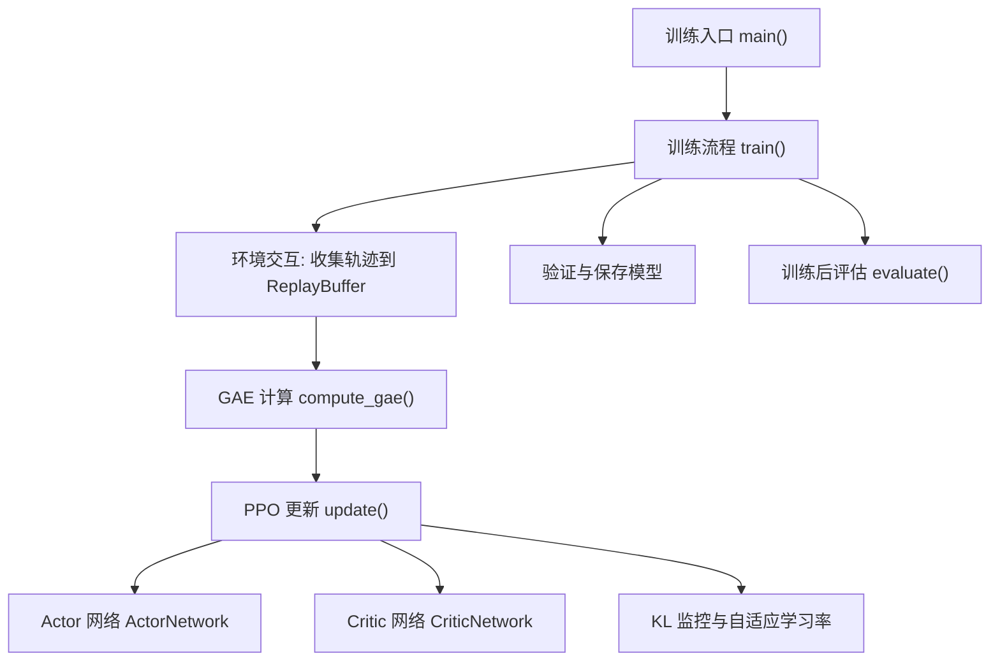
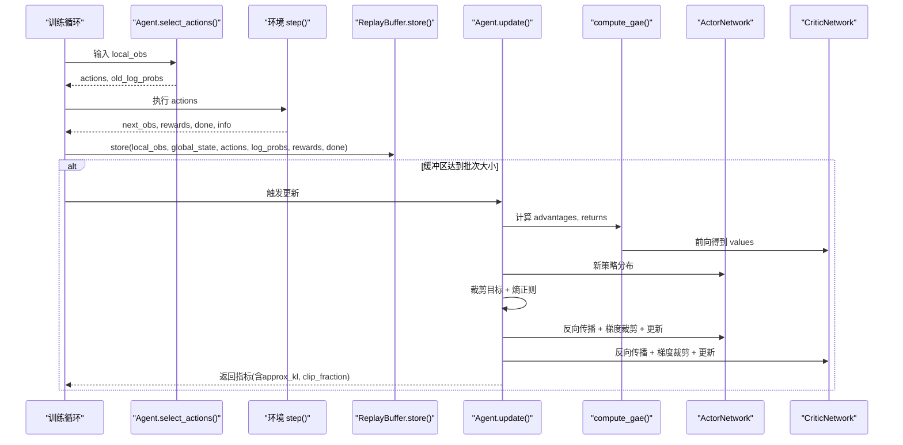
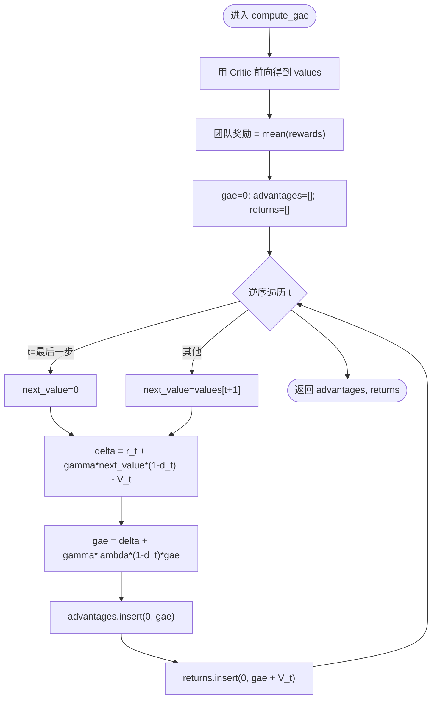
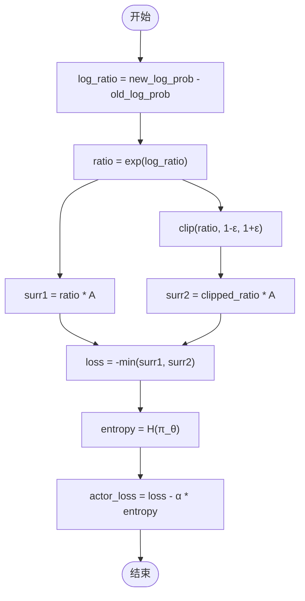
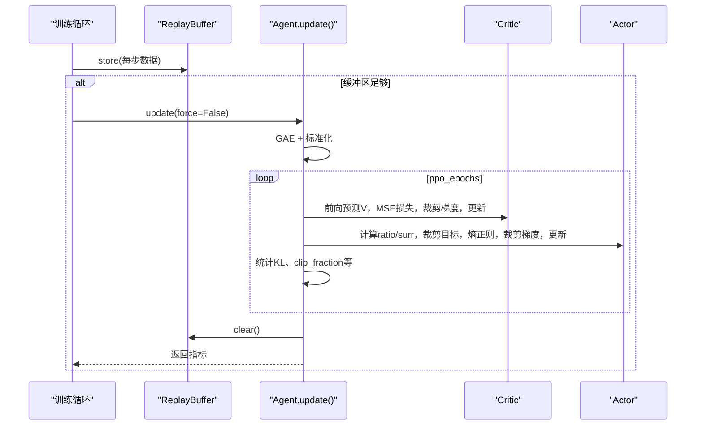
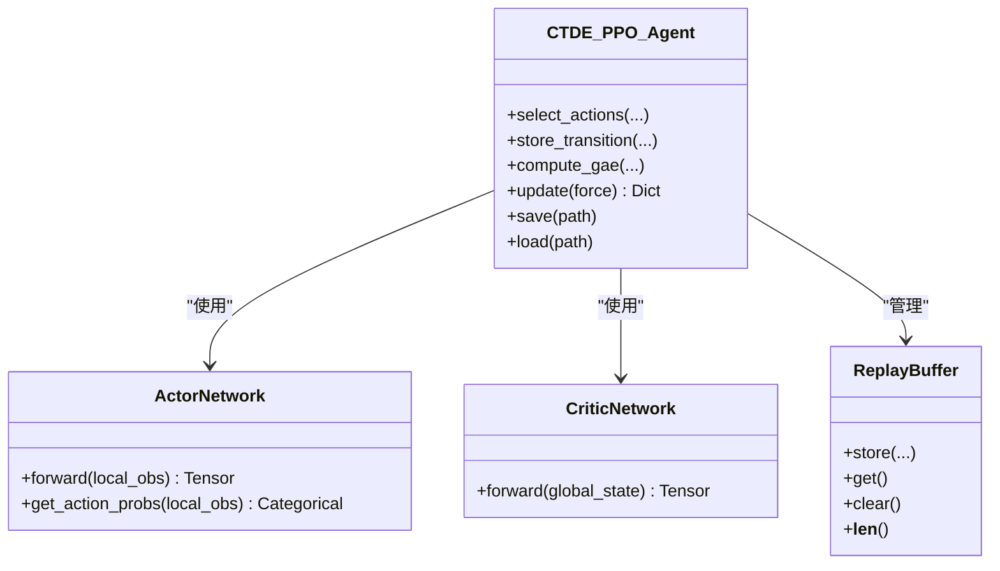

# PPO算法核心实现

<cite>
**本文引用的文件**   
- [ctde_ppo_baseline_train.py](file://environment_variables/environment_variables/ctde_ppo_baseline_train.py)
</cite>

## 目录
1. [简介](#简介)
2. [项目结构](#项目结构)
3. [核心组件](#核心组件)
4. [架构总览](#架构总览)
5. [详细组件分析](#详细组件分析)
6. [依赖关系分析](#依赖关系分析)
7. [性能与数值稳定性](#性能与数值稳定性)
8. [故障排查指南](#故障排查指南)
9. [结论](#结论)
10. [附录：超参数影响与调参建议](#附录超参数影响与调参建议)

## 简介
本技术文档聚焦于仓库中PPO（近端策略优化）算法的核心实现，系统阐述以下要点：
- 优势函数计算与GAE（Generalized Advantage Estimation）的推导、实现细节与数值稳定性处理
- PPO目标函数的构造与裁剪机制防止策略更新过大的数学原理
- 经验回放缓冲区ReplayBuffer的数据结构设计、采样策略与批处理优化
- 完整训练循环：前向传播、损失计算、反向传播与参数更新
- KL散度监控、梯度裁剪与数值稳定性的工程实践
- 关键超参数clip_epsilon、gae_lambda、entropy_coef对训练稳定性和收敛性的影响

## 项目结构
该仓库包含大量场景数据与输出结果，PPO算法核心逻辑集中在单一训练脚本中。主要模块包括：
- 网络模型：ActorNetwork（策略）、CriticNetwork（价值）
- 经验缓冲：ReplayBuffer
- 智能体与控制流：CTDE_PPO_Agent（封装GAE、PPO更新、KL自适应学习率等）
- 训练主循环与评估：train、evaluate、run_lr_comparison、main

图表来源
- [ctde_ppo_baseline_train.py:2092-2168](file://environment_variables/environment_variables/ctde_ppo_baseline_train.py#L2092-L2168)
- [ctde_ppo_baseline_train.py:1195-1676](file://environment_variables/environment_variables/ctde_ppo_baseline_train.py#L1195-L1676)
- [ctde_ppo_baseline_train.py:867-991](file://environment_variables/environment_variables/ctde_ppo_baseline_train.py#L867-L991)

章节来源
- [ctde_ppo_baseline_train.py:2092-2168](file://environment_variables/environment_variables/ctde_ppo_baseline_train.py#L2092-L2168)
- [ctde_ppo_baseline_train.py:1195-1676](file://environment_variables/environment_variables/ctde_ppo_baseline_train.py#L1195-L1676)

## 核心组件
- ActorNetwork：多层全连接+LayerNorm+残差块，输出离散动作logits，提供概率分布接口
- CriticNetwork：多层全连接+LayerNorm+残差块，输出标量状态价值
- ReplayBuffer：按时间步顺序存储本地观测、全局状态、动作、旧对数概率、奖励、终止标记
- CTDE_PPO_Agent：封装选择动作、GAE计算、PPO多轮小批量更新、KL自适应学习率、梯度裁剪、指标统计

章节来源
- [ctde_ppo_baseline_train.py:460-535](file://environment_variables/environment_variables/ctde_ppo_baseline_train.py#L460-L535)
- [ctde_ppo_baseline_train.py:537-566](file://environment_variables/environment_variables/ctde_ppo_baseline_train.py#L537-L566)
- [ctde_ppo_baseline_train.py:759-822](file://environment_variables/environment_variables/ctde_ppo_baseline_train.py#L759-L822)

## 架构总览
下图展示PPO在训练中的关键调用序列与数据流向：

图表来源
- [ctde_ppo_baseline_train.py:1195-1676](file://environment_variables/environment_variables/ctde_ppo_baseline_train.py#L1195-L1676)
- [ctde_ppo_baseline_train.py:849-866](file://environment_variables/environment_variables/ctde_ppo_baseline_train.py#L849-L866)
- [ctde_ppo_baseline_train.py:867-991](file://environment_variables/environment_variables/ctde_ppo_baseline_train.py#L867-L991)

## 详细组件分析

### 优势函数与GAE实现
- 团队奖励聚合：将多智能体每步奖励取均值作为团队奖励，降低方差并统一信号
- TD误差delta：使用当前值估计V(s_t)、下一时刻值V(s_{t+1})与折扣因子gamma计算
- GAE递归：从最后一步逆序累积，结合终止标志dones控制回传边界
- 数值稳定：advantages标准化为均值为0、标准差为1（加极小常数防除零）

图表来源
- [ctde_ppo_baseline_train.py:867-887](file://environment_variables/environment_variables/ctde_ppo_baseline_train.py#L867-L887)
- [ctde_ppo_baseline_train.py:897-898](file://environment_variables/environment_variables/ctde_ppo_baseline_train.py#L897-L898)

章节来源
- [ctde_ppo_baseline_train.py:867-887](file://environment_variables/environment_variables/ctde_ppo_baseline_train.py#L867-L887)
- [ctde_ppo_baseline_train.py:897-898](file://environment_variables/environment_variables/ctde_ppo_baseline_train.py#L897-L898)

### PPO目标函数与裁剪机制
- 重要性采样比率ratio = exp(log π_θ(a|s) - log π_θ_old(a|s))
- 无裁剪目标 surr1 = ratio * A
- 裁剪目标 surr2 = clip(ratio, 1-ε, 1+ε) * A
- 最终actor目标：min(surr1, surr2) 的负均值，减去熵正则项 entropy_coef * H(π_θ)
- 裁剪的数学动机：限制新旧策略分布偏离程度，避免单次更新过大导致性能崩溃；通过“保守”目标保证单调改进近似

图表来源
- [ctde_ppo_baseline_train.py:943-951](file://environment_variables/environment_variables/ctde_ppo_baseline_train.py#L943-L951)

章节来源
- [ctde_ppo_baseline_train.py:943-951](file://environment_variables/environment_variables/ctde_ppo_baseline_train.py#L943-L951)

### 经验回放缓冲区 ReplayBuffer
- 数据结构：以列表形式按时间步顺序存放local_obs、global_states、actions、log_probs、rewards、dones
- 写入接口：store(...) 追加单步数据
- 读取接口：get() 一次性返回全部历史
- 清理接口：clear() 清空所有列表
- 长度接口：__len__() 基于rewards长度
- 设计权衡：简单直观，适合离线GAE与整段轨迹更新；内存占用随episode长度线性增长

章节来源
- [ctde_ppo_baseline_train.py:537-566](file://environment_variables/environment_variables/ctde_ppo_baseline_train.py#L537-L566)

### 采样策略与批处理优化
- 整段轨迹先用于GAE计算，再打乱索引进行多轮epoch的小批量训练
- mini_batch_size默认取batch_size//8且不低于512，提高GPU吞吐与稳定性
- 每次迭代内分别更新critic与actor，critic使用MSE回归到returns，actor使用PPO裁剪目标
- 多智能体维度展平：将(num_agents,)维度的动作与优势展平到样本维度，确保与网络输出对齐

章节来源
- [ctde_ppo_baseline_train.py:912-967](file://environment_variables/environment_variables/ctde_ppo_baseline_train.py#L912-L967)

### 训练循环与参数更新
- 交互阶段：每步选择动作、记录旧对数概率与环境反馈，存入ReplayBuffer
- 更新触发：当缓冲区长度≥batch_size时触发update()；支持force=True强制更新
- 更新过程：
  - 计算advantages与returns并进行标准化
  - ppo_epochs轮内随机打乱索引，按mini_batch_size切片
  - critic：MSE损失，梯度裁剪max_grad_norm，Adam更新
  - actor：PPO裁剪目标+熵正则，梯度裁剪，Adam更新
  - 统计approx_kl、clip_fraction、entropy等指标
- 结束后清空缓冲区，累计training_step

图表来源
- [ctde_ppo_baseline_train.py:1195-1676](file://environment_variables/environment_variables/ctde_ppo_baseline_train.py#L1195-L1676)
- [ctde_ppo_baseline_train.py:889-991](file://environment_variables/environment_variables/ctde_ppo_baseline_train.py#L889-L991)

章节来源
- [ctde_ppo_baseline_train.py:889-991](file://environment_variables/environment_variables/ctde_ppo_baseline_train.py#L889-L991)
- [ctde_ppo_baseline_train.py:1195-1676](file://environment_variables/environment_variables/ctde_ppo_baseline_train.py#L1195-L1676)

### KL散度监控与自适应学习率
- approx_kl：基于新旧对数概率差的二阶近似，衡量策略变化幅度
- clip_fraction：ratio超出裁剪边界的比例，反映约束生效强度
- KL自适应：根据ema(KL)与target_kl偏差动态调整actor学习率，保持策略更新在可控范围内
- 固定模式：仅记录KL EMA而不改变学习率

章节来源
- [ctde_ppo_baseline_train.py:828-847](file://environment_variables/environment_variables/ctde_ppo_baseline_train.py#L828-L847)
- [ctde_ppo_baseline_train.py:958-991](file://environment_variables/environment_variables/ctde_ppo_baseline_train.py#L958-L991)

### 类图：网络与智能体关系

图表来源
- [ctde_ppo_baseline_train.py:460-535](file://environment_variables/environment_variables/ctde_ppo_baseline_train.py#L460-L535)
- [ctde_ppo_baseline_train.py:537-566](file://environment_variables/environment_variables/ctde_ppo_baseline_train.py#L537-L566)
- [ctde_ppo_baseline_train.py:759-822](file://environment_variables/environment_variables/ctde_ppo_baseline_train.py#L759-L822)

## 依赖关系分析
- 外部依赖：torch、numpy、torch.distributions.Categorical、torch.nn.functional
- 内部依赖：FireSearchBaselineEnvironment（环境定义），信息转换模块（数据集与场景管理）
- 耦合点：
  - Agent与环境通过obs["local_obs"]、obs["global_state"]、rewards、done、info交互
  - Agent与网络通过张量形状与设备(device)一致性耦合
  - GAE与Critic共享全局状态表示，需保证维度一致

章节来源
- [ctde_ppo_baseline_train.py:30-36](file://environment_variables/environment_variables/ctde_ppo_baseline_train.py#L30-L36)
- [ctde_ppo_baseline_train.py:24-28](file://environment_variables/environment_variables/ctde_ppo_baseline_train.py#L24-L28)

## 性能与数值稳定性
- 数值稳定措施
  - advantages标准化：减均值、除以(std+1e-8)，避免大尺度优势导致不稳定
  - 梯度裁剪：nn.utils.clip_grad_norm_(..., max_grad_norm)防止爆炸
  - Adam eps=1e-5，避免除零
  - KL自适应学习率：exp(-α*(KL_ema/target_kl - 1))平滑调节
- 批处理优化
  - mini_batch_size下限512，提升并行效率
  - 多epoch重复利用同一批轨迹，减少环境交互开销
- 复杂度
  - GAE：O(T)逆序扫描
  - 更新：每epoch O(B/mb_size)次前向/反向，整体O(ppo_epochs * B/mb_size)

章节来源
- [ctde_ppo_baseline_train.py:897-898](file://environment_variables/environment_variables/ctde_ppo_baseline_train.py#L897-L898)
- [ctde_ppo_baseline_train.py:923-926](file://environment_variables/environment_variables/ctde_ppo_baseline_train.py#L923-L926)
- [ctde_ppo_baseline_train.py:954-956](file://environment_variables/environment_variables/ctde_ppo_baseline_train.py#L954-L956)
- [ctde_ppo_baseline_train.py:802-803](file://environment_variables/environment_variables/ctde_ppo_baseline_train.py#L802-L803)

## 故障排查指南
- 训练不更新或更新停滞
  - 检查缓冲区长度是否达到batch_size；若不足，增大episode长度或减小batch_size
  - 观察clip_fraction是否接近1，可能说明策略更新被频繁裁剪，需降低学习率或增大epsilon
- KL发散或策略崩溃
  - 启用KL自适应学习率，适当增大kl_ema_beta或kl_lr_alpha
  - 增大max_grad_norm或降低actor_lr
- 数值异常（NaN/Inf）
  - 确认advantages标准化未除零（std+1e-8）
  - 检查网络初始化与LayerNorm配置
- 评估失败或泛化差
  - 检查eval阶段是否使用确定性策略select_actions_deterministic
  - 关注validation_interval与best_val保存逻辑

章节来源
- [ctde_ppo_baseline_train.py:889-991](file://environment_variables/environment_variables/ctde_ppo_baseline_train.py#L889-L991)
- [ctde_ppo_baseline_train.py:1606-1676](file://environment_variables/environment_variables/ctde_ppo_baseline_train.py#L1606-L1676)
- [ctde_ppo_baseline_train.py:1816-1920](file://environment_variables/environment_variables/ctde_ppo_baseline_train.py#L1816-L1920)

## 结论
该实现采用经典PPO框架并结合多项工程优化：GAE优势估计、裁剪目标、KL自适应学习率、梯度裁剪与advantages标准化，形成稳健的训练闭环。ReplayBuffer以简洁的列表结构支撑整段轨迹更新，配合小批量多epoch训练，兼顾易用性与效率。通过完善的日志与质量指标，便于监控训练稳定性与收敛性。

## 附录：超参数影响与调参建议
- clip_epsilon
  - 作用：限制ratio上下界，控制策略更新幅度
  - 影响：过小导致更新保守、收敛慢；过大易破坏旧策略，造成性能抖动
  - 建议：默认0.2，若出现大幅震荡可降至0.1~0.15；若长期不更新可增至0.25~0.3
- gae_lambda
  - 作用：GAE偏差-方差折中系数
  - 影响：接近1偏向低偏高方差；接近0偏向高偏低方差
  - 建议：默认0.95通常较稳；若回报噪声大可适当降低至0.9~0.95
- entropy_coef
  - 作用：鼓励探索的正则项权重
  - 影响：过大导致策略过于随机；过小导致过早收敛到次优
  - 建议：默认0.01；若早期探索不足可增至0.02~0.05，后期逐步衰减
- 其他相关
  - target_kl与kl_lr_alpha：控制KL自适应强度，适合需要严格约束的场景
  - max_grad_norm：防止梯度爆炸，常见0.5~1.0
  - ppo_epochs与mini_batch_size：决定数据重用与批大小，需平衡稳定性与效率

章节来源
- [ctde_ppo_baseline_train.py:122-128](file://environment_variables/environment_variables/ctde_ppo_baseline_train.py#L122-L128)
- [ctde_ppo_baseline_train.py:774-803](file://environment_variables/environment_variables/ctde_ppo_baseline_train.py#L774-L803)
- [ctde_ppo_baseline_train.py:943-951](file://environment_variables/environment_variables/ctde_ppo_baseline_train.py#L943-L951)
- [ctde_ppo_baseline_train.py:828-847](file://environment_variables/environment_variables/ctde_ppo_baseline_train.py#L828-L847)